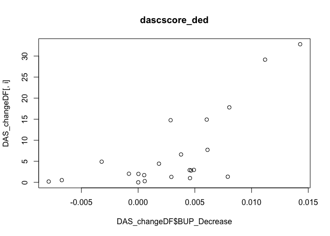
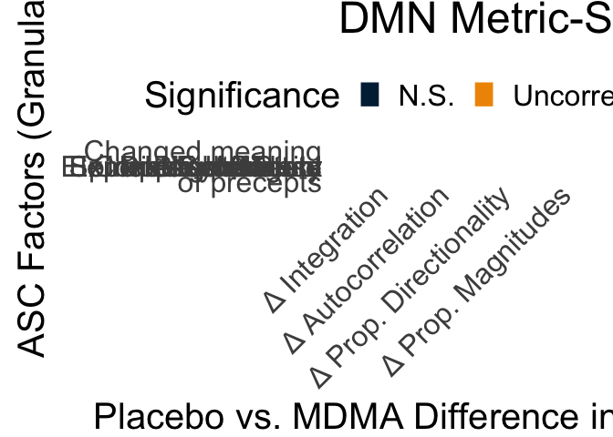

MDMA Stats and Visualization: Study 1
================
2023-07-13

``` r
library(reshape2)
library(ggplot2)
library(visreg)
library(nlme)
```

``` r
# prop angles
rs1=read.csv('~/Downloads/rs1_propsMerged.csv',header=F)
rs2=read.csv('~/Downloads/rs2_propsMerged.csv',header=F)
emo=read.csv('~/Downloads/emotion_propsMerged.csv',header=F)
gambling=read.csv('~/Downloads/gambling_propsMerged.csv',header=F)
wm=read.csv('~/Downloads/wm_propsMerged.csv',header=F)

rs1$Task='rs'
rs2$Task='rs2'
emo$Task='emotion'
gambling$Task='gambling'
wm$Task='wm'

# remove subj 4
rs1=rs1[-c(4),]
rs2=rs2[-c(4),]
emo=emo[-c(4),]
gambling=gambling[-c(4),]
wm=wm[-c(4),]

# this is going to be ugly but simple
# manually pair columns as sep. observations of baseline, placebo, 80, 120mg
rs1bv=data.frame(cbind(rs1$V1,rs1$V2,rs1$V3,rs1$V4,rs1$V17))
rs1p=data.frame(cbind(rs1$V5,rs1$V6,rs1$V7,rs1$V8,rs1$V18))
rs1m1=data.frame(cbind(rs1$V9,rs1$V10,rs1$V11,rs1$V12,rs1$V19))
rs1m2=data.frame(cbind(rs1$V13,rs1$V14,rs1$V15,rs1$V16,rs1$V20))
colnames(rs1bv)=c('TDProp1','TDProp2','TDProp3','TDProp4','RemTRs')
colnames(rs1p)=c('TDProp1','TDProp2','TDProp3','TDProp4','RemTRs')
colnames(rs1m1)=c('TDProp1','TDProp2','TDProp3','TDProp4','RemTRs')
colnames(rs1m2)=c('TDProp1','TDProp2','TDProp3','TDProp4','RemTRs')

rs2bv=data.frame(cbind(rs2$V1,rs2$V2,rs2$V3,rs2$V4,rs2$V17))
rs2p=data.frame(cbind(rs2$V5,rs2$V6,rs2$V7,rs2$V8,rs2$V18))
rs2m1=data.frame(cbind(rs2$V9,rs2$V10,rs2$V11,rs2$V12,rs2$V19))
rs2m2=data.frame(cbind(rs2$V13,rs2$V14,rs2$V15,rs2$V16,rs2$V20))
colnames(rs2bv)=c('TDProp1','TDProp2','TDProp3','TDProp4','RemTRs')
colnames(rs2p)=c('TDProp1','TDProp2','TDProp3','TDProp4','RemTRs')
colnames(rs2m1)=c('TDProp1','TDProp2','TDProp3','TDProp4','RemTRs')
colnames(rs2m2)=c('TDProp1','TDProp2','TDProp3','TDProp4','RemTRs')

emobv=data.frame(cbind(emo$V1,emo$V2,emo$V3,emo$V4,emo$V17))
emop=data.frame(cbind(emo$V5,emo$V6,emo$V7,emo$V8,emo$V18))
emom1=data.frame(cbind(emo$V9,emo$V10,emo$V11,emo$V12,emo$V19))
emom2=data.frame(cbind(emo$V13,emo$V14,emo$V15,emo$V16,emo$V20))
colnames(emobv)=c('TDProp1','TDProp2','TDProp3','TDProp4','RemTRs')
colnames(emop)=c('TDProp1','TDProp2','TDProp3','TDProp4','RemTRs')
colnames(emom1)=c('TDProp1','TDProp2','TDProp3','TDProp4','RemTRs')
colnames(emom2)=c('TDProp1','TDProp2','TDProp3','TDProp4','RemTRs')

gamblingbv=data.frame(cbind(gambling$V1,gambling$V2,gambling$V3,gambling$V4,gambling$V17))
gamblingp=data.frame(cbind(gambling$V5,gambling$V6,gambling$V7,gambling$V8,gambling$V18))
gamblingm1=data.frame(cbind(gambling$V9,gambling$V10,gambling$V11,gambling$V12,gambling$V19))
gamblingm2=data.frame(cbind(gambling$V13,gambling$V14,gambling$V15,gambling$V16,gambling$V20))
colnames(gamblingbv)=c('TDProp1','TDProp2','TDProp3','TDProp4','RemTRs')
colnames(gamblingp)=c('TDProp1','TDProp2','TDProp3','TDProp4','RemTRs')
colnames(gamblingm1)=c('TDProp1','TDProp2','TDProp3','TDProp4','RemTRs')
colnames(gamblingm2)=c('TDProp1','TDProp2','TDProp3','TDProp4','RemTRs')

wmbv=data.frame(cbind(wm$V1,wm$V2,wm$V3,wm$V4,wm$V17))
wmp=data.frame(cbind(wm$V5,wm$V6,wm$V7,wm$V8,wm$V18))
wmm1=data.frame(cbind(wm$V9,wm$V10,wm$V11,wm$V12,wm$V19))
wmm2=data.frame(cbind(wm$V13,wm$V14,wm$V15,wm$V16,wm$V20))
colnames(wmbv)=c('TDProp1','TDProp2','TDProp3','TDProp4','RemTRs')
colnames(wmp)=c('TDProp1','TDProp2','TDProp3','TDProp4','RemTRs')
colnames(wmm1)=c('TDProp1','TDProp2','TDProp3','TDProp4','RemTRs')
colnames(wmm2)=c('TDProp1','TDProp2','TDProp3','TDProp4','RemTRs')

# get subject IDs from this rds
alff=readRDS('~/OutPlacDrug_alff.rds')
rs1bv$Subjects=alff$SubjID
rs1p$Subjects=alff$SubjID
rs1m1$Subjects=alff$SubjID
rs1m2$Subjects=alff$SubjID

rs2bv$Subjects=alff$SubjID
rs2p$Subjects=alff$SubjID
rs2m1$Subjects=alff$SubjID
rs2m2$Subjects=alff$SubjID

emobv$Subjects=alff$SubjID
emop$Subjects=alff$SubjID
emom1$Subjects=alff$SubjID
emom2$Subjects=alff$SubjID

gamblingbv$Subjects=alff$SubjID
gamblingp$Subjects=alff$SubjID
gamblingm1$Subjects=alff$SubjID
gamblingm2$Subjects=alff$SubjID

wmbv$Subjects=alff$SubjID
wmp$Subjects=alff$SubjID
wmm1$Subjects=alff$SubjID
wmm2$Subjects=alff$SubjID

# add in task (rs to be made equivalent after motion merge)
rs1bv$Task='rs'
rs1p$Task='rs'
rs1m1$Task='rs'
rs1m2$Task='rs'

rs2bv$Task='rs2'
rs2p$Task='rs2'
rs2m1$Task='rs2'
rs2m2$Task='rs2'

emobv$Task='emotion'
emop$Task='emotion'
emom1$Task='emotion'
emom2$Task='emotion'

gamblingbv$Task='gambling'
gamblingp$Task='gambling'
gamblingm1$Task='gambling'
gamblingm2$Task='gambling'

wmbv$Task='wm'
wmp$Task='wm'
wmm1$Task='wm'
wmm2$Task='wm'

# add in dosage
rs1bv$Dosage='baseline'
rs1p$Dosage='Placebo'
rs1m1$Dosage='80mg'
rs1m2$Dosage='120mg'

rs2bv$Dosage='baseline'
rs2p$Dosage='Placebo'
rs2m1$Dosage='80mg'
rs2m2$Dosage='120mg'

emobv$Dosage='baseline'
emop$Dosage='Placebo'
emom1$Dosage='80mg'
emom2$Dosage='120mg'

gamblingbv$Dosage='baseline'
gamblingp$Dosage='Placebo'
gamblingm1$Dosage='80mg'
gamblingm2$Dosage='120mg'

wmbv$Dosage='baseline'
wmp$Dosage='Placebo'
wmm1$Dosage='80mg'
wmm2$Dosage='120mg'

# combine all
allScans=rbind(rs1bv,rs1p,rs1m1,rs1m2,rs2bv,rs2p,rs2m1,rs2m2,emobv,emop,emom1,emom2,gamblingbv,gamblingp,gamblingm1,gamblingm2,wmbv,wmp,wmm1,wmm2)

# read in motion
mot=read.csv('~/Desktop/MDMA_spikes_summary.csv')

# motion merge
mergedDf=merge(mot,allScans,by=c('Subjects','Task','Dosage'))
mergedDf$Drug=0
mergedDf$Drug[mergedDf$Dosage=="120mg"]=1
mergedDf$Drug[mergedDf$Dosage=="80mg"]=1
mergedDf$Drug=as.factor(mergedDf$Drug)
mergedDf$Subjects<-as.factor(mergedDf$Subjects)
mergedDf$Dosage<-as.factor(mergedDf$Dosage)
mergedDfProps=mergedDf
```

``` r
# remove data that needs to be removed (subs 6 and 10, <250 TRs)
mergedDf=mergedDf[mergedDf$Subjects!='sub-MDMA006',]
mergedDf=mergedDf[mergedDf$Subjects!='sub-MDMA010',]
mergedDf=mergedDf[mergedDf$RemTRs>250,]

# plot out missing frames by condition
mergedDf$DrugCondition <- factor(ifelse(mergedDf$Dosage %in% c("80mg", "120mg"), 
                                        "MDMA", 
                                        as.character(mergedDf$Dosage)),
                                 levels = c("baseline", "Placebo", "MDMA"))

# rs for EZ comparison
mergedDf2=mergedDf[mergedDf$Task!='wm',]
#mergedDf2=mergedDf[mergedDf$Task!='rs',]
#mergedDf2=mergedDf2[mergedDf2$Task!='rs2',]

mergedDf2=mergedDf2[mergedDf2$Task!='gambling',]


# reviewer fig: remaining TRs by condition
ggplot(mergedDf2, aes(x = DrugCondition, y = 500-RemTRs, fill = DrugCondition)) +
  geom_boxplot(outlier.shape = NA) +  # Boxplot without outliers
  geom_jitter(width = 0.2, alpha = 0.4) +  # Add jitter for individual points
  theme_minimal() +
  scale_fill_manual(values = c("baseline" = "gray", "Placebo" = "blue", "MDMA" = "green")) +
  scale_x_discrete(labels = c("baseline" = "No Drug", "Placebo" = "Placebo", "MDMA" = "MDMA"))+
  labs(title = "Total Frames Omitted Across Conditions (Study 1, Resting State)",
       x = "Drug",
       y = "Total Frames Omitted due to Censoring")+theme(legend.position = "none")
```

<!-- -->

``` r
# save out for  merging
saveRDS(mergedDf,'~/mergedDf_study1_QCd.rds')
```

``` r
# assign clearer subject labels
# get unique subj names
mergedDf$Subjects <- droplevels(mergedDf$Subjects)
unique_values <- unique(mergedDf$Subjects)
new_labels <- paste0("MDMA", seq_along(unique_values))
names(new_labels) <- unique_values

# Replace the values in Subjects using the new labels
mergedDf$People <- new_labels[mergedDf$Subjects]

# final ordering
mergedDf$People <- factor(mergedDf$People, levels = new_labels)

# change rs2 to rs for accurate task-modeling
mergedDf$Task[mergedDf$Task=='rs2']='rs'
mergedDf$Task=as.factor(mergedDf$Task)
mergedDf_clean=mergedDf[mergedDf$Dosage!='baseline',]

# make donut plot
donutData<- data.frame(
  Category=levels(mergedDf$Dosage),
  count=tabulate(mergedDf$Dosage)
)

# convert labels to be consistent across studies
donutData$Category=c('Psychedelic','x','Baseline','Placebo')
# merge 120 and 80mg for clear plots
donutData$count[donutData$Category=='Psychedelic']=donutData$count[donutData$Category=='Psychedelic']+donutData$count[donutData$Category=='x']
donutData=donutData[donutData$Category!='x',]

# percentages
donutData$frac = donutData$count / sum(donutData$count)

# Compute the cumulative for plotting
donutData$ymax = cumsum(donutData$frac)

# Compute the bottom of each rectangle (plotted as rectangle and coord_polar'ed)
donutData$ymin = c(0, head(donutData$ymax, n=-1))

# convert to factor for manual ordering
donutData$Category <- factor(donutData$Category, levels = c('Placebo', 'Baseline', 'Psychedelic'))


# plot
ggplot(donutData, aes(ymax=ymax, ymin=ymin, xmax=4, xmin=3, fill=Category)) +
     geom_rect() +
     coord_polar(theta="y") + 
     xlim(c(1, 4)) + theme_classic(base_size=28)+theme(
    axis.text = element_blank(),
    axis.ticks = element_blank(),
    axis.line = element_blank()
  )+guides(fill = guide_legend(title = NULL))+scale_fill_manual(values = c("#EF9500","#002642","#840032"))
```

<!-- -->

``` r
# generate extended color pal for subject plotting
library(grDevices)
# Define the extended custom palette function
extended_palette <- colorRampPalette(rev(c("#FFEE00", "#EF9500", "#002642", "#c1004f", "#000000")))

# Generate a palette with the number of unique levels in V1
num_colors <- length(unique(mergedDf_clean$Subjects))
generated_colors <- extended_palette(num_colors)

# get head-motion regressed values for plotting
model_to_reg <- lm(TDProp1 ~ MeanFD + RemTRs+Task, data = mergedDf_clean)
mergedDf_clean$Residuals<-resid(model_to_reg)+mean(mergedDf_clean$TDProp1)

# updated with manual Gaussian jitter
# Add Gaussian jitter to x values (e.g., Drug factor levels)
set.seed(2)
mergedDf_clean$JitteredDrug <- as.numeric(mergedDf_clean$Drug) + rnorm(nrow(mergedDf_clean), mean = 0, sd = 0.1)

# figure 2a
ggplot(mergedDf_clean, aes(x = JitteredDrug, y = Residuals*100)) +
  geom_point(alpha = 0.8, size = 4, aes(color = People)) +  # Points with Gaussian jitter
  geom_boxplot(aes(group = Drug), alpha = 0.2, outlier.shape = NA, width = 0.25) +  # Boxplot
  labs(title = "MDMA vs. Placebo \n",
       x = "",
       y = "% Bottom-up") + 
  scale_x_continuous(breaks = 1:2, labels = c('Placebo', 'MDMA')) +
  scale_color_manual(values = generated_colors)+
  theme_minimal(base_size=28)
```

<!-- -->

``` r
# job application version - 350 x 650
ggplot(mergedDf_clean, aes(x = Drug, y = Residuals)) +
  geom_jitter(width = 0.25, height = 0, alpha = 0.8, size = 2, aes(color = People)) +  # Jittered points
  geom_boxplot(alpha = 0.2, outlier.shape = NA) +     # Boxplot
  labs(x = "",
       y = "% Bottom-up") +
  scale_x_discrete(labels = c('Placebo', 'MDMA')) +
  scale_color_manual(values = generated_colors) +  # Custom generated color palette
  theme_minimal(base_size = 28)+
  theme(legend.position = "none",axis.text.x=element_text(angle=45))
```

<!-- -->

``` r
# full model for stats
fit_lme <- lme(TDProp1 ~ Drug + RemTRs + MeanFD+Task, random = ~ 1 | Subjects, data = mergedDf_clean)
summaryLME<-summary(fit_lme)

# testing lme4 for robustness
library(lme4)
```

    ## Loading required package: Matrix

    ## 
    ## Attaching package: 'lme4'

    ## The following object is masked from 'package:nlme':
    ## 
    ##     lmList

``` r
library(lmerTest)
```

    ## 
    ## Attaching package: 'lmerTest'

    ## The following object is masked from 'package:lme4':
    ## 
    ##     lmer

    ## The following object is masked from 'package:stats':
    ## 
    ##     step

``` r
fit_lmer <- lmer(TDProp1 ~ Drug + RemTRs + MeanFD+Task + (1 | Subjects), data = mergedDf_clean)
```

    ## Warning: Some predictor variables are on very different scales: consider
    ## rescaling
    ## Warning: Some predictor variables are on very different scales: consider
    ## rescaling

``` r
# checks out

#####
#### with all non-drug scans: Figure 2b
#####

# get head-motion regressed values for plotting
model_to_reg <- lm(TDProp1 ~ MeanFD + RemTRs+Task, data = mergedDf)
mergedDf$Residuals<-resid(model_to_reg)+mean(mergedDf$TDProp1)

# updated with manual Gaussian jitter
# Add Gaussian jitter to x values (e.g., Drug factor levels)
set.seed(1)
mergedDf$JitteredDrug <- as.numeric(mergedDf$Drug) + rnorm(nrow(mergedDf), mean = 0, sd = 0.1)

# figure 2a: * 100 for percentage scaling
ggplot(mergedDf, aes(x = JitteredDrug, y = Residuals*100)) +
  geom_point(alpha = 0.8, size = 4, aes(color = People)) +  # Points with Gaussian jitter
  geom_boxplot(aes(group = Drug), alpha = 0.2, outlier.shape = NA, width = 0.25) +  # Boxplot
  labs(title = "MDMA vs. No-drug scans \n",
       x = "",
       y = "% Bottom-up") + 
  scale_x_continuous(breaks = 1:2, labels = c('No Drug', 'MDMA')) +
  theme_minimal(base_size = 25) +
  scale_color_manual(values = generated_colors)
```

<!-- -->

``` r
# figure 2a
#ggplot(mergedDf, aes(x = Drug, y = Residuals)) +
#  geom_jitter(width = 0.25, height = 0, alpha = 0.8,size=4,aes(color = People)) +  # Jittered points
#  geom_boxplot(alpha = 0.2,outlier.shape = NA) +     # Boxplot
#  labs(title = "MDMA vs. No-drug scans \n",
#       x = "",
#       y = "% Bottom-up") + scale_x_discrete(labels=c('No Drug','MDMA'))+
#  theme_minimal(base_size=25)+scale_color_manual(values = generated_colors)

# full model for stats
fit_lme <- lme(TDProp1 ~ Drug + RemTRs + MeanFD+Task, random = ~ 1 | Subjects, data = mergedDf)
summaryLME<-summary(fit_lme)

# lme4 test for robustness
fit_lmer <- lmer(TDProp1 ~ Drug + RemTRs + MeanFD+Task + (1 | Subjects), data = mergedDf)
```

    ## Warning: Some predictor variables are on very different scales: consider
    ## rescaling
    ## Warning: Some predictor variables are on very different scales: consider
    ## rescaling

``` r
# checks out

# make a "people"-"subjects" equivalence data frame to reference in figures down below
unique_pairs <- unique(mergedDf[c("People", "Subjects")])
```

``` r
# extract standout sessions/participants
library(dplyr)
```

    ## 
    ## Attaching package: 'dplyr'

    ## The following object is masked from 'package:nlme':
    ## 
    ##     collapse

    ## The following objects are masked from 'package:stats':
    ## 
    ##     filter, lag

    ## The following objects are masked from 'package:base':
    ## 
    ##     intersect, setdiff, setequal, union

``` r
# Calculate the difference in TDProp1 between Drug and Placebo conditions
df_diff <- mergedDf_clean %>%
  group_by(Subjects) %>%
  summarise(Diff_TDProp1 = mean(TDProp1[Drug == 0]-mean(TDProp1[Drug == 1]), na.rm = TRUE))

# Identify the participant with the greatest increase in TDProp1
max_diff_subject <- df_diff %>%
  filter(Diff_TDProp1 == max(Diff_TDProp1, na.rm = TRUE)) %>%
  pull(Subjects)

print(max_diff_subject)
```

    ## [1] sub-MDMA017
    ## 14 Levels: sub-MDMA001 sub-MDMA002 sub-MDMA003 sub-MDMA005 ... sub-MDMA017

``` r
# added chunk to code which sessions are post-mdma in macro timeline of study

# initialize new column in mergedDf
mergedDf$PostMDMASession <- 2

# load in subjSeshDoseCorrep (read delim, sep=' ')
subjSeshDoseCorrep <- read.table("~/Downloads/subjSeshDoseCorresp.csv", sep = ' ')

# for each subject
for (i in 1:nrow(subjSeshDoseCorrep)) {
  # if i <10
  if(i<10){
    subjectID <- paste0("sub-MDMA00", i)  # Reconstruct subject ID
  } else if(i>9){
    subjectID <- paste0("sub-MDMA0", i)  # Reconstruct subject ID
  }
  # get position of placebo
  placeboPos <- which(subjSeshDoseCorrep[i, 2:5] == "ses-01")
  print(placeboPos)
  # get position in mergedDf
  placeboRows <- mergedDf$Subject == subjectID & mergedDf$Dosage == "Placebo"
  # baseline is pos one, placebo is pos 2, 80 is pos 3, 120 is pos 4
  # if placebo is ses-01, leave as initialize 0
  # if placebo is ses-02, 1 for post-drugMacro
  # if placebo is ses-03, 1 for post-drugMacro
  if (placeboPos == 2) {
      mergedDf$PostMDMASession[placeboRows] <- 0
    } else if (placeboPos == 3 ) {
      mergedDf$PostMDMASession[placeboRows] <- 1
    } else if (placeboPos == 4) {
      mergedDf$PostMDMASession[placeboRows] <- 1
    }
}
```

    ## [1] 3
    ## [1] 2
    ## [1] 3
    ## [1] 2
    ## [1] 4
    ## [1] 3
    ## [1] 3
    ## [1] 2
    ## [1] 2
    ## [1] 4
    ## [1] 2
    ## [1] 3
    ## [1] 4
    ## [1] 4
    ## [1] 2
    ## [1] 3
    ## [1] 2

``` r
# make post drug a separate placebo condition
mergedDf$Drug2<-as.numeric(mergedDf$Drug)
mergedDf$Drug2[mergedDf$PostMDMASession==1]=3
# placebo pre-drug is 1
# placebo post-drug is 3
# drug is 2

mergedDf$Drug2<-as.factor(mergedDf$Drug2)
mergedDf <- within(mergedDf, Drug2 <- relevel(Drug2, ref = 1))
# set MDMA visits to post MDMA
mergedDf$PostMDMASession[mergedDf$Drug==1]=1

model <- lme(TDProp1 ~ MeanFD +Drug2+ RemTRs, random = ~ 1 | Subjects, data = mergedDf)
```

``` r
#meltedDf <- melt(mergedDf, id.vars = c("Subjects", "Task", "Dosage", "Session", "SpikesPercent", "MeanFD", "RemTRs", "Drug"))
#meltedDf <- within(meltedDf, variable <- relevel(variable, ref = 3))
#model <- lme(value ~ MeanFD + Drug + RemTRs+variable+variable*Drug+MeanFD*variable+RemTRs*variable, random = ~ 1 | Subjects/variable, data = meltedDf)
#summary(model)
#sjPlot::plot_model(model, type = "eff",show.values = T)
#
## great, now let's bootstrap it
## Set the number of bootstrap samples
#num_bootstrap_samples <- 
## initialize t vectors
#td1_d<-zeros(num_bootstrap_samples,1)
#td1_fd<-zeros(num_bootstrap_samples,1)
#td2_d<-zeros(num_bootstrap_samples,1)
#td2_fd<-zeros(num_bootstrap_samples,1)
#td3_d<-zeros(num_bootstrap_samples,1)
#td3_fd<-zeros(num_bootstrap_samples,1)
#td4_d<-zeros(num_bootstrap_samples,1)
#td4_fd<-zeros(num_bootstrap_samples,1)
#
## bootstrap loops
#set.seed(420)
#for (i in 1:num_bootstrap_samples){
#  # resample subjects instead of observations to be conserative
#   BootSubjs=sample(unique(mergedDf$Subjects),14,replace=T)
#   # Create an empty dataframe to store the resampled observations
#   bootSamp <- data.frame()
#   for (j in 1:length(BootSubjs)){
#       subject_obs <- meltedDf[meltedDf$Subjects == BootSubjs[j], ]
#       bootSamp <- rbind(bootSamp, subject_obs)
#   }
#  # fit model
#  model_i <- lme(value ~ MeanFD + Drug + RemTRs+variable+variable*Drug+variable*MeanFD, random = ~ 1 | Subjects/variable, data = bootSamp)
#  # get t-values
#  td1_d[i]=summary(model_i)$tTable[rownames(summary(model_i)$tTable) == "Drug1:variableTDProp1", "t-value"]
#  td1_fd[i]=summary(model_i)$tTable[rownames(summary(model_i)$tTable) == "MeanFD:variableTDProp1", "t-value"]
#  td3_d[i]=summary(model_i)$tTable[rownames(summary(model_i)$tTable) == "Drug1:variableTDProp3", "t-value"]
#  td3_fd[i]=summary(model_i)$tTable[rownames(summary(model_i)$tTable) == "MeanFD:variableTDProp3", "t-value"]
#  td4_d[i]=summary(model_i)$tTable[rownames(summary(model_i)$tTable) == "Drug1:variableTDProp4", "t-value"]
#  td4_fd[i]=summary(model_i)$tTable[rownames(summary(model_i)$tTable) == "MeanFD:variableTDProp4", "t-value"]
#}
#
#bootstrap_results=data.frame(cbind(td1_d,td1_fd,td3_d,td3_fd,td4_d,td4_fd))
#colnames(bootstrap_results)=c('td1_drug','td1_fd','td3_drug','td3_fd','td4_drug','td4_fd')
#plotdf=melt(bootstrap_results)
#
## Create box-and-whisker plots
#ggplot(plotdf, aes(x = variable, y = value,)) +
#  geom_boxplot(position = position_dodge(width = 0.8)) +
#  labs(x = "Model", y = "T-Values", title = "Bootstrap T-Values for Drug and MeanFD") +
#  theme_minimal(base_size = 16)+scale_fill_manual(values=c('blue','red'))
```

``` r
# autocorrelation
rs1=read.csv('~/Downloads/rs1_TAutoCorMerged.csv',header=F)
rs2=read.csv('~/Downloads/rs2_TAutoCorMerged.csv',header=F)
emo=read.csv('~/Downloads/emotion_TAutoCorMerged.csv',header=F)
gambling=read.csv('~/Downloads/gambling_TAutoCorMerged.csv',header=F)
wm=read.csv('~/Downloads/wm_TAutoCorMerged.csv',header=F)

rs1$Task='rs'
rs2$Task='rs2'
emo$Task='emotion'
gambling$Task='gambling'
wm$Task='wm'

# remove subj 4
rs1=rs1[-c(4),]
rs2=rs2[-c(4),]
emo=emo[-c(4),]
gambling=gambling[-c(4),]
wm=wm[-c(4),]

# this is going to be ugly but simple
# manually pair columns as sep. observations of baseline, placebo, 80, 120mg
rs1bv=data.frame(cbind(rs1$V1,rs1$V5))
rs1p=data.frame(cbind(rs1$V2,rs1$V6))
rs1m1=data.frame(cbind(rs1$V3,rs1$V7))
rs1m2=data.frame(cbind(rs1$V4,rs1$V8))
colnames(rs1bv)=c('AutoCor','RemTRs')
colnames(rs1p)=c('AutoCor','RemTRs')
colnames(rs1m1)=c('AutoCor','RemTRs')
colnames(rs1m2)=c('AutoCor','RemTRs')

rs2bv=data.frame(cbind(rs2$V1,rs2$V5))
rs2p=data.frame(cbind(rs2$V2,rs2$V6))
rs2m1=data.frame(cbind(rs2$V3,rs2$V7))
rs2m2=data.frame(cbind(rs2$V4,rs2$V8))
colnames(rs2bv)=c('AutoCor','RemTRs')
colnames(rs2p)=c('AutoCor','RemTRs')
colnames(rs2m1)=c('AutoCor','RemTRs')
colnames(rs2m2)=c('AutoCor','RemTRs')

emobv=data.frame(cbind(emo$V1,emo$V5))
emop=data.frame(cbind(emo$V2,emo$V6))
emom1=data.frame(cbind(emo$V3,emo$V7))
emom2=data.frame(cbind(emo$V4,emo$V8))
colnames(emobv)=c('AutoCor','RemTRs')
colnames(emop)=c('AutoCor','RemTRs')
colnames(emom1)=c('AutoCor','RemTRs')
colnames(emom2)=c('AutoCor','RemTRs')

gamblingbv=data.frame(cbind(gambling$V1,gambling$V5))
gamblingp=data.frame(cbind(gambling$V2,gambling$V6))
gamblingm1=data.frame(cbind(gambling$V3,gambling$V7))
gamblingm2=data.frame(cbind(gambling$V4,gambling$V8))
colnames(gamblingbv)=c('AutoCor','RemTRs')
colnames(gamblingp)=c('AutoCor','RemTRs')
colnames(gamblingm1)=c('AutoCor','RemTRs')
colnames(gamblingm2)=c('AutoCor','RemTRs')

wmbv=data.frame(cbind(wm$V1,wm$V5))
wmp=data.frame(cbind(wm$V2,wm$V6))
wmm1=data.frame(cbind(wm$V3,wm$V7))
wmm2=data.frame(cbind(wm$V4,wm$V8))
colnames(wmbv)=c('AutoCor','RemTRs')
colnames(wmp)=c('AutoCor','RemTRs')
colnames(wmm1)=c('AutoCor','RemTRs')
colnames(wmm2)=c('AutoCor','RemTRs')

# get subject IDs from this rds
alff=readRDS('~/OutPlacDrug_alff.rds')
rs1bv$Subjects=alff$SubjID
rs1p$Subjects=alff$SubjID
rs1m1$Subjects=alff$SubjID
rs1m2$Subjects=alff$SubjID

rs2bv$Subjects=alff$SubjID
rs2p$Subjects=alff$SubjID
rs2m1$Subjects=alff$SubjID
rs2m2$Subjects=alff$SubjID

emobv$Subjects=alff$SubjID
emop$Subjects=alff$SubjID
emom1$Subjects=alff$SubjID
emom2$Subjects=alff$SubjID

gamblingbv$Subjects=alff$SubjID
gamblingp$Subjects=alff$SubjID
gamblingm1$Subjects=alff$SubjID
gamblingm2$Subjects=alff$SubjID

wmbv$Subjects=alff$SubjID
wmp$Subjects=alff$SubjID
wmm1$Subjects=alff$SubjID
wmm2$Subjects=alff$SubjID

# add in task (rs to be made equivalent after motion merge)
rs1bv$Task='rs'
rs1p$Task='rs'
rs1m1$Task='rs'
rs1m2$Task='rs'

rs2bv$Task='rs2'
rs2p$Task='rs2'
rs2m1$Task='rs2'
rs2m2$Task='rs2'

emobv$Task='emotion'
emop$Task='emotion'
emom1$Task='emotion'
emom2$Task='emotion'

gamblingbv$Task='gambling'
gamblingp$Task='gambling'
gamblingm1$Task='gambling'
gamblingm2$Task='gambling'

wmbv$Task='wm'
wmp$Task='wm'
wmm1$Task='wm'
wmm2$Task='wm'

# add in dosage
rs1bv$Dosage='baseline'
rs1p$Dosage='Placebo'
rs1m1$Dosage='80mg'
rs1m2$Dosage='120mg'

rs2bv$Dosage='baseline'
rs2p$Dosage='Placebo'
rs2m1$Dosage='80mg'
rs2m2$Dosage='120mg'

emobv$Dosage='baseline'
emop$Dosage='Placebo'
emom1$Dosage='80mg'
emom2$Dosage='120mg'

gamblingbv$Dosage='baseline'
gamblingp$Dosage='Placebo'
gamblingm1$Dosage='80mg'
gamblingm2$Dosage='120mg'

wmbv$Dosage='baseline'
wmp$Dosage='Placebo'
wmm1$Dosage='80mg'
wmm2$Dosage='120mg'

# comibine all
allScans=rbind(rs1bv,rs1p,rs1m1,rs1m2,rs2bv,rs2p,rs2m1,rs2m2,emobv,emop,emom1,emom2,gamblingbv,gamblingp,gamblingm1,gamblingm2,wmbv,wmp,wmm1,wmm2)

# read in motion
mot=read.csv('~/Desktop/MDMA_spikes_summary.csv')

# motion merge
mergedDf=merge(mot,allScans,by=c('Subjects','Task','Dosage'))
#mergedDf=mergedDf[mergedDf$Dosage!='baseline',]
mergedDf$Drug=0
mergedDf$Drug[mergedDf$Dosage=="120mg"]=1
mergedDf$Drug[mergedDf$Dosage=="80mg"]=1
mergedDf$Drug=as.factor(mergedDf$Drug)
```

``` r
# combine props and autocor
mergedDfPropsComplAutoC=merge(mergedDfProps,mergedDf,by=c("Subjects","Task","Dosage","Session","MeanFD","SpikesPercent","RemTRs","Drug"))
```

``` r
# DMN seg
rs1=read.csv('~/Downloads/rs1_DMNSegMerged.csv',header=F)
rs2=read.csv('~/Downloads/rs2_DMNSegMerged.csv',header=F)
emo=read.csv('~/Downloads/emotion_DMNSegMerged.csv',header=F)
gambling=read.csv('~/Downloads/gambling_DMNSegMerged.csv',header=F)
wm=read.csv('~/Downloads/wm_DMNSegMerged.csv',header=F)

rs1$Task='rs'
rs2$Task='rs2'
emo$Task='emotion'
gambling$Task='gambling'
wm$Task='wm'

# remove subj 4
rs1=rs1[-c(4),]
rs2=rs2[-c(4),]
emo=emo[-c(4),]
gambling=gambling[-c(4),]
wm=wm[-c(4),]

# this is going to be ugly but simple
# manually pair columns as sep. observations of baseline, placebo, 80, 120mg
rs1bv=data.frame(cbind(rs1$V1,rs1$V5))
rs1p=data.frame(cbind(rs1$V2,rs1$V6))
rs1m1=data.frame(cbind(rs1$V3,rs1$V7))
rs1m2=data.frame(cbind(rs1$V4,rs1$V8))
colnames(rs1bv)=c('DMNFC','RemTRs')
colnames(rs1p)=c('DMNFC','RemTRs')
colnames(rs1m1)=c('DMNFC','RemTRs')
colnames(rs1m2)=c('DMNFC','RemTRs')

rs2bv=data.frame(cbind(rs2$V1,rs2$V5))
rs2p=data.frame(cbind(rs2$V2,rs2$V6))
rs2m1=data.frame(cbind(rs2$V3,rs2$V7))
rs2m2=data.frame(cbind(rs2$V4,rs2$V8))
colnames(rs2bv)=c('DMNFC','RemTRs')
colnames(rs2p)=c('DMNFC','RemTRs')
colnames(rs2m1)=c('DMNFC','RemTRs')
colnames(rs2m2)=c('DMNFC','RemTRs')

emobv=data.frame(cbind(emo$V1,emo$V5))
emop=data.frame(cbind(emo$V2,emo$V6))
emom1=data.frame(cbind(emo$V3,emo$V7))
emom2=data.frame(cbind(emo$V4,emo$V8))
colnames(emobv)=c('DMNFC','RemTRs')
colnames(emop)=c('DMNFC','RemTRs')
colnames(emom1)=c('DMNFC','RemTRs')
colnames(emom2)=c('DMNFC','RemTRs')

gamblingbv=data.frame(cbind(gambling$V1,gambling$V5))
gamblingp=data.frame(cbind(gambling$V2,gambling$V6))
gamblingm1=data.frame(cbind(gambling$V3,gambling$V7))
gamblingm2=data.frame(cbind(gambling$V4,gambling$V8))
colnames(gamblingbv)=c('DMNFC','RemTRs')
colnames(gamblingp)=c('DMNFC','RemTRs')
colnames(gamblingm1)=c('DMNFC','RemTRs')
colnames(gamblingm2)=c('DMNFC','RemTRs')

wmbv=data.frame(cbind(wm$V1,wm$V5))
wmp=data.frame(cbind(wm$V2,wm$V6))
wmm1=data.frame(cbind(wm$V3,wm$V7))
wmm2=data.frame(cbind(wm$V4,wm$V8))
colnames(wmbv)=c('DMNFC','RemTRs')
colnames(wmp)=c('DMNFC','RemTRs')
colnames(wmm1)=c('DMNFC','RemTRs')
colnames(wmm2)=c('DMNFC','RemTRs')

# get subject IDs from this rds
alff=readRDS('~/OutPlacDrug_alff.rds')
rs1bv$Subjects=alff$SubjID
rs1p$Subjects=alff$SubjID
rs1m1$Subjects=alff$SubjID
rs1m2$Subjects=alff$SubjID

rs2bv$Subjects=alff$SubjID
rs2p$Subjects=alff$SubjID
rs2m1$Subjects=alff$SubjID
rs2m2$Subjects=alff$SubjID

emobv$Subjects=alff$SubjID
emop$Subjects=alff$SubjID
emom1$Subjects=alff$SubjID
emom2$Subjects=alff$SubjID

gamblingbv$Subjects=alff$SubjID
gamblingp$Subjects=alff$SubjID
gamblingm1$Subjects=alff$SubjID
gamblingm2$Subjects=alff$SubjID

wmbv$Subjects=alff$SubjID
wmp$Subjects=alff$SubjID
wmm1$Subjects=alff$SubjID
wmm2$Subjects=alff$SubjID

# add in task (rs to be made equivalent after motion merge)
rs1bv$Task='rs'
rs1p$Task='rs'
rs1m1$Task='rs'
rs1m2$Task='rs'

rs2bv$Task='rs2'
rs2p$Task='rs2'
rs2m1$Task='rs2'
rs2m2$Task='rs2'

emobv$Task='emotion'
emop$Task='emotion'
emom1$Task='emotion'
emom2$Task='emotion'

gamblingbv$Task='gambling'
gamblingp$Task='gambling'
gamblingm1$Task='gambling'
gamblingm2$Task='gambling'

wmbv$Task='wm'
wmp$Task='wm'
wmm1$Task='wm'
wmm2$Task='wm'

# add in dosage
rs1bv$Dosage='baseline'
rs1p$Dosage='Placebo'
rs1m1$Dosage='80mg'
rs1m2$Dosage='120mg'

rs2bv$Dosage='baseline'
rs2p$Dosage='Placebo'
rs2m1$Dosage='80mg'
rs2m2$Dosage='120mg'

emobv$Dosage='baseline'
emop$Dosage='Placebo'
emom1$Dosage='80mg'
emom2$Dosage='120mg'

gamblingbv$Dosage='baseline'
gamblingp$Dosage='Placebo'
gamblingm1$Dosage='80mg'
gamblingm2$Dosage='120mg'

wmbv$Dosage='baseline'
wmp$Dosage='Placebo'
wmm1$Dosage='80mg'
wmm2$Dosage='120mg'

# comibine all
allScans=rbind(rs1bv,rs1p,rs1m1,rs1m2,rs2bv,rs2p,rs2m1,rs2m2,emobv,emop,emom1,emom2,gamblingbv,gamblingp,gamblingm1,gamblingm2,wmbv,wmp,wmm1,wmm2)

# read in motion
mot=read.csv('~/Desktop/MDMA_spikes_summary.csv')

# motion merge
mergedDf=merge(mot,allScans,by=c('Subjects','Task','Dosage'))
#mergedDf=mergedDf[mergedDf$Dosage!='baseline',]
mergedDf$Drug=0
mergedDf$Drug[mergedDf$Dosage=="120mg"]=1
mergedDf$Drug[mergedDf$Dosage=="80mg"]=1
mergedDf$Drug=as.factor(mergedDf$Drug)
```

``` r
# combine dmn fc and props and autocor
mergedDfPropsComplAutoCdmnFC=merge(mergedDfPropsComplAutoC,mergedDf,by=c("Subjects","Task","Dosage","Session","MeanFD","SpikesPercent","RemTRs","Drug"))
```

``` r
# DMN mag
rs1=read.csv('~/Downloads/rs1_DMNMagMerged.csv',header=F)
rs2=read.csv('~/Downloads/rs2_DMNMagMerged.csv',header=F)
emo=read.csv('~/Downloads/emotion_DMNMagMerged.csv',header=F)
gambling=read.csv('~/Downloads/gambling_DMNMagMerged.csv',header=F)
wm=read.csv('~/Downloads/wm_DMNMagMerged.csv',header=F)

rs1$Task='rs'
rs2$Task='rs2'
emo$Task='emotion'
gambling$Task='gambling'
wm$Task='wm'

# remove subj 4
rs1=rs1[-c(4),]
rs2=rs2[-c(4),]
emo=emo[-c(4),]
gambling=gambling[-c(4),]
wm=wm[-c(4),]

# this is going to be ugly but simple
# manually pair columns as sep. observations of baseline, placebo, 80, 120mg
rs1bv=data.frame(cbind(rs1$V1,rs1$V5))
rs1p=data.frame(cbind(rs1$V2,rs1$V6))
rs1m1=data.frame(cbind(rs1$V3,rs1$V7))
rs1m2=data.frame(cbind(rs1$V4,rs1$V8))
colnames(rs1bv)=c('DMNMag','RemTRs')
colnames(rs1p)=c('DMNMag','RemTRs')
colnames(rs1m1)=c('DMNMag','RemTRs')
colnames(rs1m2)=c('DMNMag','RemTRs')

rs2bv=data.frame(cbind(rs2$V1,rs2$V5))
rs2p=data.frame(cbind(rs2$V2,rs2$V6))
rs2m1=data.frame(cbind(rs2$V3,rs2$V7))
rs2m2=data.frame(cbind(rs2$V4,rs2$V8))
colnames(rs2bv)=c('DMNMag','RemTRs')
colnames(rs2p)=c('DMNMag','RemTRs')
colnames(rs2m1)=c('DMNMag','RemTRs')
colnames(rs2m2)=c('DMNMag','RemTRs')

emobv=data.frame(cbind(emo$V1,emo$V5))
emop=data.frame(cbind(emo$V2,emo$V6))
emom1=data.frame(cbind(emo$V3,emo$V7))
emom2=data.frame(cbind(emo$V4,emo$V8))
colnames(emobv)=c('DMNMag','RemTRs')
colnames(emop)=c('DMNMag','RemTRs')
colnames(emom1)=c('DMNMag','RemTRs')
colnames(emom2)=c('DMNMag','RemTRs')

gamblingbv=data.frame(cbind(gambling$V1,gambling$V5))
gamblingp=data.frame(cbind(gambling$V2,gambling$V6))
gamblingm1=data.frame(cbind(gambling$V3,gambling$V7))
gamblingm2=data.frame(cbind(gambling$V4,gambling$V8))
colnames(gamblingbv)=c('DMNMag','RemTRs')
colnames(gamblingp)=c('DMNMag','RemTRs')
colnames(gamblingm1)=c('DMNMag','RemTRs')
colnames(gamblingm2)=c('DMNMag','RemTRs')

wmbv=data.frame(cbind(wm$V1,wm$V5))
wmp=data.frame(cbind(wm$V2,wm$V6))
wmm1=data.frame(cbind(wm$V3,wm$V7))
wmm2=data.frame(cbind(wm$V4,wm$V8))
colnames(wmbv)=c('DMNMag','RemTRs')
colnames(wmp)=c('DMNMag','RemTRs')
colnames(wmm1)=c('DMNMag','RemTRs')
colnames(wmm2)=c('DMNMag','RemTRs')

# get subject IDs from this rds
alff=readRDS('~/OutPlacDrug_alff.rds')
rs1bv$Subjects=alff$SubjID
rs1p$Subjects=alff$SubjID
rs1m1$Subjects=alff$SubjID
rs1m2$Subjects=alff$SubjID

rs2bv$Subjects=alff$SubjID
rs2p$Subjects=alff$SubjID
rs2m1$Subjects=alff$SubjID
rs2m2$Subjects=alff$SubjID

emobv$Subjects=alff$SubjID
emop$Subjects=alff$SubjID
emom1$Subjects=alff$SubjID
emom2$Subjects=alff$SubjID

gamblingbv$Subjects=alff$SubjID
gamblingp$Subjects=alff$SubjID
gamblingm1$Subjects=alff$SubjID
gamblingm2$Subjects=alff$SubjID

wmbv$Subjects=alff$SubjID
wmp$Subjects=alff$SubjID
wmm1$Subjects=alff$SubjID
wmm2$Subjects=alff$SubjID

# add in task (rs to be made equivalent after motion merge)
rs1bv$Task='rs'
rs1p$Task='rs'
rs1m1$Task='rs'
rs1m2$Task='rs'

rs2bv$Task='rs2'
rs2p$Task='rs2'
rs2m1$Task='rs2'
rs2m2$Task='rs2'

emobv$Task='emotion'
emop$Task='emotion'
emom1$Task='emotion'
emom2$Task='emotion'

gamblingbv$Task='gambling'
gamblingp$Task='gambling'
gamblingm1$Task='gambling'
gamblingm2$Task='gambling'

wmbv$Task='wm'
wmp$Task='wm'
wmm1$Task='wm'
wmm2$Task='wm'

# add in dosage
rs1bv$Dosage='baseline'
rs1p$Dosage='Placebo'
rs1m1$Dosage='80mg'
rs1m2$Dosage='120mg'

rs2bv$Dosage='baseline'
rs2p$Dosage='Placebo'
rs2m1$Dosage='80mg'
rs2m2$Dosage='120mg'

emobv$Dosage='baseline'
emop$Dosage='Placebo'
emom1$Dosage='80mg'
emom2$Dosage='120mg'

gamblingbv$Dosage='baseline'
gamblingp$Dosage='Placebo'
gamblingm1$Dosage='80mg'
gamblingm2$Dosage='120mg'

wmbv$Dosage='baseline'
wmp$Dosage='Placebo'
wmm1$Dosage='80mg'
wmm2$Dosage='120mg'

# comibine all
allScans=rbind(rs1bv,rs1p,rs1m1,rs1m2,rs2bv,rs2p,rs2m1,rs2m2,emobv,emop,emom1,emom2,gamblingbv,gamblingp,gamblingm1,gamblingm2,wmbv,wmp,wmm1,wmm2)

# read in motion
mot=read.csv('~/Desktop/MDMA_spikes_summary.csv')

# motion merge
mergedDf=merge(mot,allScans,by=c('Subjects','Task','Dosage'))
mergedDfBVincl=mergedDf
mergedDf=mergedDf[mergedDf$Dosage!='baseline',]
mergedDf$Drug=0
mergedDf$Drug[mergedDf$Dosage=="120mg"]=1
mergedDf$Drug[mergedDf$Dosage=="80mg"]=1
mergedDf$Drug=as.factor(mergedDf$Drug)

mergedDfBVincl$Drug=0
mergedDfBVincl$Drug[mergedDfBVincl$Dosage=="120mg"]=1
mergedDfBVincl$Drug[mergedDfBVincl$Dosage=="80mg"]=1
mergedDfBVincl$Drug=as.factor(mergedDfBVincl$Drug)
```

``` r
# combine dmn fc and props and autocor
mergedDfPropsComplAutoCdmnFCdmnMag=merge(mergedDfPropsComplAutoCdmnFC,mergedDf,by=c("Subjects","Task","Dosage","Session","MeanFD","SpikesPercent","RemTRs","Drug"))
# version with baseline included
mergedDfPropsComplAutoCdmnFCdmnMagbv=merge(mergedDfPropsComplAutoCdmnFC,mergedDfBVincl,by=c("Subjects","Task","Dosage","Session","MeanFD","SpikesPercent","RemTRs","Drug"))

# remove data that needs to be removed (subs 6 and 10, <250 TRs)
mergedDfPropsComplAutoCdmnFCdmnMag=mergedDfPropsComplAutoCdmnFCdmnMag[mergedDfPropsComplAutoCdmnFCdmnMag$Subjects!='sub-MDMA006',]
mergedDfPropsComplAutoCdmnFCdmnMag=mergedDfPropsComplAutoCdmnFCdmnMag[mergedDfPropsComplAutoCdmnFCdmnMag$Subjects!='sub-MDMA010',]
mergedDfPropsComplAutoCdmnFCdmnMag=mergedDfPropsComplAutoCdmnFCdmnMag[mergedDfPropsComplAutoCdmnFCdmnMag$RemTRs>250,]

# change rs2 to rs for accurate task-modeling
mergedDfPropsComplAutoCdmnFCdmnMag$Task[mergedDfPropsComplAutoCdmnFCdmnMag$Task=='rs2']='rs'
mergedDfPropsComplAutoCdmnFCdmnMag$Task=as.factor(mergedDfPropsComplAutoCdmnFCdmnMag$Task)

# set rs to reference level
mergedDfPropsComplAutoCdmnFCdmnMag <- within(mergedDfPropsComplAutoCdmnFCdmnMag, Task <- relevel(Task, ref = 2))

### baseline included
# remove data that needs to be removed (subs 6 and 10, <250 TRs)
mergedDfPropsComplAutoCdmnFCdmnMagbv=mergedDfPropsComplAutoCdmnFCdmnMagbv[mergedDfPropsComplAutoCdmnFCdmnMagbv$Subjects!='sub-MDMA006',]
mergedDfPropsComplAutoCdmnFCdmnMagbv=mergedDfPropsComplAutoCdmnFCdmnMagbv[mergedDfPropsComplAutoCdmnFCdmnMagbv$Subjects!='sub-MDMA010',]
mergedDfPropsComplAutoCdmnFCdmnMagbv=mergedDfPropsComplAutoCdmnFCdmnMagbv[mergedDfPropsComplAutoCdmnFCdmnMagbv$RemTRs>250,]

# change rs2 to rs for accurate task-modeling
mergedDfPropsComplAutoCdmnFCdmnMagbv$Task[mergedDfPropsComplAutoCdmnFCdmnMagbv$Task=='rs2']='rs'
mergedDfPropsComplAutoCdmnFCdmnMagbv$Task=as.factor(mergedDfPropsComplAutoCdmnFCdmnMagbv$Task)

# set rs to reference level
mergedDfPropsComplAutoCdmnFCdmnMagbv <- within(mergedDfPropsComplAutoCdmnFCdmnMagbv, Task <- relevel(Task, ref = 2))
```

``` r
# model
td_model <- lme(TDProp1 ~ MeanFD + Drug+RemTRs+Task, random = ~ 1 | Subjects, data = mergedDfPropsComplAutoCdmnFCdmnMag)
ta_model <- lme(AutoCor ~ MeanFD + Drug+RemTRs+Task, random = ~ 1 | Subjects, data = mergedDfPropsComplAutoCdmnFCdmnMag)
dmnseg_model <- lme(DMNFC ~ MeanFD + Drug+RemTRs+Task, random = ~ 1 | Subjects, data = mergedDfPropsComplAutoCdmnFCdmnMag)
dmnmag_model <- lme(DMNMag ~ MeanFD + Drug+RemTRs+Task, random = ~ 1 | Subjects, data = mergedDfPropsComplAutoCdmnFCdmnMag)

# inclusive model
td_model <- lme(TDProp1 ~ MeanFD + Drug+RemTRs+Task+AutoCor+DMNFC, random = ~ 1 | Subjects, data = mergedDfPropsComplAutoCdmnFCdmnMag)
dmnmag_model <- lme(DMNMag ~ MeanFD + Drug+RemTRs+Task+AutoCor+DMNFC, random = ~ 1 | Subjects, data = mergedDfPropsComplAutoCdmnFCdmnMag)

# inclusive model, no drug
td_model <- lme(TDProp1 ~ MeanFD + Drug+RemTRs+Task+AutoCor+DMNFC, random = ~ 1 | Subjects, data = mergedDfPropsComplAutoCdmnFCdmnMagbv)
dmnmag_model <- lme(DMNMag ~ MeanFD + Drug+RemTRs+Task+AutoCor+DMNFC, random = ~ 1 | Subjects, data = mergedDfPropsComplAutoCdmnFCdmnMagbv)


# for correlation matrix
forCormat=data.frame(mergedDfPropsComplAutoCdmnFCdmnMag$TDProp1,mergedDfPropsComplAutoCdmnFCdmnMag$AutoCor,mergedDfPropsComplAutoCdmnFCdmnMag$DMNFC,mergedDfPropsComplAutoCdmnFCdmnMag$MeanFD,mergedDfPropsComplAutoCdmnFCdmnMag$RemTRs,mergedDfPropsComplAutoCdmnFCdmnMag$DMNMag)

colnames(forCormat)=c('TDProp1','AutoCor','DMNFC','MeanFD','RemTRs','DMNMag')

library(corrplot)
```

    ## corrplot 0.92 loaded

``` r
source("http://www.sthda.com/upload/rquery_cormat.r")

corrmatrix=rquery.cormat(forCormat,type="full")
```

<!-- -->

``` r
corrplot(as.matrix(corrmatrix$r),method='number')
```

<!-- -->

``` r
# need to establish which DMN metrics are associated above and beyond drug effect
# DMN FC
dmnseg_model <- lme(DMNFC ~ MeanFD + Drug+RemTRs+Task+TDProp1+AutoCor+DMNMag, random = ~ 1 | Subjects, data = mergedDfPropsComplAutoCdmnFCdmnMag)
# DMN tdprops
td_model <- lme(TDProp1 ~ MeanFD + Drug+RemTRs+Task+DMNFC+AutoCor+DMNMag, random = ~ 1 | Subjects, data = mergedDfPropsComplAutoCdmnFCdmnMag)
# DMN Mag
dmnmag_model <- lme(DMNMag ~ MeanFD + Drug+RemTRs+Task+DMNFC+AutoCor+TDProp1, random = ~ 1 | Subjects, data = mergedDfPropsComplAutoCdmnFCdmnMag)
# DMN autocor
dmnAC_model <- lme(AutoCor ~ MeanFD + Drug+RemTRs+Task+DMNFC+DMNMag+TDProp1, random = ~ 1 | Subjects, data = mergedDfPropsComplAutoCdmnFCdmnMag)

library(pROC)
```

    ## Type 'citation("pROC")' for a citation.

    ## 
    ## Attaching package: 'pROC'

    ## The following objects are masked from 'package:stats':
    ## 
    ##     cov, smooth, var

``` r
library(plotROC)
```

    ## 
    ## Attaching package: 'plotROC'

    ## The following object is masked from 'package:pROC':
    ## 
    ##     ggroc

``` r
mergedDfPropsComplAutoCdmnFCdmnMag_notask=mergedDfPropsComplAutoCdmnFCdmnMag[mergedDfPropsComplAutoCdmnFCdmnMag$Task=='rs',]

# Fit logistic regression models
model1 <- glm(Drug ~ MeanFD + RemTRs + DMNFC+AutoCor, data = mergedDfPropsComplAutoCdmnFCdmnMag_notask, family = binomial)
model2 <- glm(Drug ~ MeanFD + RemTRs + DMNFC + AutoCor+DMNMag+TDProp1, data = mergedDfPropsComplAutoCdmnFCdmnMag_notask, family = binomial)
model3 <- glm(Drug ~ MeanFD + RemTRs +DMNMag+TDProp1, data = mergedDfPropsComplAutoCdmnFCdmnMag_notask, family = binomial)

# Predict probabilities
prob1 <- predict(model1, type = "response")
prob2 <- predict(model2, type = "response")
prob3 <- predict(model3, type = "response")

# Create a combined data frame for all models
df <- data.frame(
  labels = as.numeric(rep(mergedDfPropsComplAutoCdmnFCdmnMag_notask$Drug, 3)),
  predictions = c(prob1, prob2,prob3),
  model = factor(rep(c("DMN Correlations", "+DMN Propagations","DMN Propagations"), each = nrow(mergedDfPropsComplAutoCdmnFCdmnMag_notask)))
)

# Generate the ROC plot
ggplot(df, aes(m = predictions, d = labels, color = model)) + 
  geom_roc(n.cuts = 0, labels = FALSE) + 
  ylim(0, 1) + ylab('True Positive Rate') +xlab('False Positive Rate')+
  ggtitle("ROC Curves for Classifying MDMA") + 
  theme_minimal(base_size=18) + 
  scale_color_manual(values = c("#EF9500","#c12139","#09416b"))+
  geom_abline(intercept = 0, slope = 1, linetype = "dashed", color = "gray")+
  theme(legend.position = "none")
```

    ## Warning in verify_d(data$d): D not labeled 0/1, assuming 1 = 0 and 2 = 1!

<!-- -->

``` r
# Calculate AUC for each model
roc1 <- roc(mergedDfPropsComplAutoCdmnFCdmnMag_notask$Drug, prob1)
```

    ## Setting levels: control = 0, case = 1

    ## Setting direction: controls < cases

``` r
roc2 <- roc(mergedDfPropsComplAutoCdmnFCdmnMag_notask$Drug, prob2)
```

    ## Setting levels: control = 0, case = 1
    ## Setting direction: controls < cases

``` r
roc3 <- roc(mergedDfPropsComplAutoCdmnFCdmnMag_notask$Drug, prob3)
```

    ## Setting levels: control = 0, case = 1
    ## Setting direction: controls < cases

``` r
# Print AUC values
auc1 <- auc(roc1)
auc2 <- auc(roc2)
auc3 <- auc(roc3)

print(paste("AUC for DMN Correlations:", auc1))
```

    ## [1] "AUC for DMN Correlations: 0.806481481481482"

``` r
print(paste("AUC for Full Model:", auc2))
```

    ## [1] "AUC for Full Model: 0.881481481481482"

``` r
print(paste("AUC for Prop Model:", auc3))
```

    ## [1] "AUC for Prop Model: 0.832407407407407"

``` r
# Calculate AUC difference between full and reduced models
auc_diff <- auc2 - auc1
```

``` r
# Temporary comment out: output is making rstudio wonky


# make equivalent AUC calculations on permuted data
# initialize AUC difference vectors
auc_diffs <- rep(NA, 1000)

# 1. permute each DMN variable (and FD)
set.seed(1)
for (i in 1:1000){
  print(i)
  # permute DMNMag
  mergedDfPropsComplAutoCdmnFCdmnMag_notask$DMNMag_perm <- sample(mergedDfPropsComplAutoCdmnFCdmnMag_notask$DMNMag)
  # permute TDProp1
  mergedDfPropsComplAutoCdmnFCdmnMag_notask$TDProp1_perm <- sample(mergedDfPropsComplAutoCdmnFCdmnMag_notask$TDProp1)
 
  # Fit logistic regression models
  model1 <- glm(Drug ~ MeanFD + RemTRs + DMNFC+AutoCor, data = mergedDfPropsComplAutoCdmnFCdmnMag_notask, family = binomial)
  model2_perm <- glm(Drug ~ MeanFD + RemTRs + DMNFC+AutoCor+TDProp1_perm+DMNMag_perm, data = mergedDfPropsComplAutoCdmnFCdmnMag_notask, family = binomial)
    
  # 3. calculate AUC difference between full and reduced models with permuted data
  roc1 <- roc(mergedDfPropsComplAutoCdmnFCdmnMag_notask$Drug, predict(model1, type = "response"))
  roc2_perm <- roc(mergedDfPropsComplAutoCdmnFCdmnMag_notask$Drug, predict(model2_perm, type = "response"))
  
  # Print AUC values
  auc1 <- auc(roc1)
  auc2_perm <-auc(roc2_perm)

  # populate auc_diff vectors
  # DMN correlations vs. full (permuted props) model
  auc_diffs[i] <- auc2_perm - auc1
}
```

    ## [1] 1

    ## Setting levels: control = 0, case = 1

    ## Setting direction: controls < cases

    ## Setting levels: control = 0, case = 1

    ## Setting direction: controls < cases

    ## [1] 2

    ## Setting levels: control = 0, case = 1
    ## Setting direction: controls < cases

    ## Setting levels: control = 0, case = 1

    ## Setting direction: controls < cases

    ## [1] 3

    ## Setting levels: control = 0, case = 1
    ## Setting direction: controls < cases

    ## Setting levels: control = 0, case = 1

    ## Setting direction: controls < cases

    ## [1] 4

    ## Setting levels: control = 0, case = 1
    ## Setting direction: controls < cases

    ## Setting levels: control = 0, case = 1

    ## Setting direction: controls < cases

    ## [1] 5

    ## Setting levels: control = 0, case = 1
    ## Setting direction: controls < cases

    ## Setting levels: control = 0, case = 1

    ## Setting direction: controls < cases

    ## [1] 6

    ## Setting levels: control = 0, case = 1
    ## Setting direction: controls < cases

    ## Setting levels: control = 0, case = 1

    ## Setting direction: controls < cases

    ## [1] 7

    ## Setting levels: control = 0, case = 1
    ## Setting direction: controls < cases

    ## Setting levels: control = 0, case = 1

    ## Setting direction: controls < cases

    ## [1] 8

    ## Setting levels: control = 0, case = 1
    ## Setting direction: controls < cases

    ## Setting levels: control = 0, case = 1

    ## Setting direction: controls < cases

    ## [1] 9

    ## Setting levels: control = 0, case = 1
    ## Setting direction: controls < cases

    ## Setting levels: control = 0, case = 1

    ## Setting direction: controls < cases

    ## [1] 10

    ## Setting levels: control = 0, case = 1
    ## Setting direction: controls < cases

    ## Setting levels: control = 0, case = 1

    ## Setting direction: controls < cases

    ## [1] 11

    ## Setting levels: control = 0, case = 1
    ## Setting direction: controls < cases

    ## Setting levels: control = 0, case = 1

    ## Setting direction: controls < cases

    ## [1] 12

    ## Setting levels: control = 0, case = 1
    ## Setting direction: controls < cases

    ## Setting levels: control = 0, case = 1

    ## Setting direction: controls < cases

    ## [1] 13

    ## Setting levels: control = 0, case = 1
    ## Setting direction: controls < cases

    ## Setting levels: control = 0, case = 1

    ## Setting direction: controls < cases

    ## [1] 14

    ## Setting levels: control = 0, case = 1
    ## Setting direction: controls < cases

    ## Setting levels: control = 0, case = 1

    ## Setting direction: controls < cases

    ## [1] 15

    ## Setting levels: control = 0, case = 1
    ## Setting direction: controls < cases

    ## Setting levels: control = 0, case = 1

    ## Setting direction: controls < cases

    ## [1] 16

    ## Setting levels: control = 0, case = 1
    ## Setting direction: controls < cases

    ## Setting levels: control = 0, case = 1

    ## Setting direction: controls < cases

    ## [1] 17

    ## Setting levels: control = 0, case = 1
    ## Setting direction: controls < cases

    ## Setting levels: control = 0, case = 1

    ## Setting direction: controls < cases

    ## [1] 18

    ## Setting levels: control = 0, case = 1
    ## Setting direction: controls < cases

    ## Setting levels: control = 0, case = 1

    ## Setting direction: controls < cases

    ## [1] 19

    ## Setting levels: control = 0, case = 1
    ## Setting direction: controls < cases

    ## Setting levels: control = 0, case = 1

    ## Setting direction: controls < cases

    ## [1] 20

    ## Setting levels: control = 0, case = 1
    ## Setting direction: controls < cases

    ## Setting levels: control = 0, case = 1

    ## Setting direction: controls < cases

    ## [1] 21

    ## Setting levels: control = 0, case = 1
    ## Setting direction: controls < cases

    ## Setting levels: control = 0, case = 1

    ## Setting direction: controls < cases

    ## [1] 22

    ## Setting levels: control = 0, case = 1
    ## Setting direction: controls < cases

    ## Setting levels: control = 0, case = 1

    ## Setting direction: controls < cases

    ## [1] 23

    ## Setting levels: control = 0, case = 1
    ## Setting direction: controls < cases

    ## Setting levels: control = 0, case = 1

    ## Setting direction: controls < cases

    ## [1] 24

    ## Setting levels: control = 0, case = 1
    ## Setting direction: controls < cases

    ## Setting levels: control = 0, case = 1

    ## Setting direction: controls < cases

    ## [1] 25

    ## Setting levels: control = 0, case = 1
    ## Setting direction: controls < cases

    ## Setting levels: control = 0, case = 1

    ## Setting direction: controls < cases

    ## [1] 26

    ## Setting levels: control = 0, case = 1
    ## Setting direction: controls < cases

    ## Setting levels: control = 0, case = 1

    ## Setting direction: controls < cases

    ## [1] 27

    ## Setting levels: control = 0, case = 1
    ## Setting direction: controls < cases

    ## Setting levels: control = 0, case = 1

    ## Setting direction: controls < cases

    ## [1] 28

    ## Setting levels: control = 0, case = 1
    ## Setting direction: controls < cases

    ## Setting levels: control = 0, case = 1

    ## Setting direction: controls < cases

    ## [1] 29

    ## Setting levels: control = 0, case = 1
    ## Setting direction: controls < cases

    ## Setting levels: control = 0, case = 1

    ## Setting direction: controls < cases

    ## [1] 30

    ## Setting levels: control = 0, case = 1
    ## Setting direction: controls < cases

    ## Setting levels: control = 0, case = 1

    ## Setting direction: controls < cases

    ## [1] 31

    ## Setting levels: control = 0, case = 1
    ## Setting direction: controls < cases

    ## Setting levels: control = 0, case = 1

    ## Setting direction: controls < cases

    ## [1] 32

    ## Setting levels: control = 0, case = 1
    ## Setting direction: controls < cases

    ## Setting levels: control = 0, case = 1

    ## Setting direction: controls < cases

    ## [1] 33

    ## Setting levels: control = 0, case = 1
    ## Setting direction: controls < cases

    ## Setting levels: control = 0, case = 1

    ## Setting direction: controls < cases

    ## [1] 34

    ## Setting levels: control = 0, case = 1
    ## Setting direction: controls < cases

    ## Setting levels: control = 0, case = 1

    ## Setting direction: controls < cases

    ## [1] 35

    ## Setting levels: control = 0, case = 1
    ## Setting direction: controls < cases

    ## Setting levels: control = 0, case = 1

    ## Setting direction: controls < cases

    ## [1] 36

    ## Setting levels: control = 0, case = 1
    ## Setting direction: controls < cases

    ## Setting levels: control = 0, case = 1

    ## Setting direction: controls < cases

    ## [1] 37

    ## Setting levels: control = 0, case = 1
    ## Setting direction: controls < cases

    ## Setting levels: control = 0, case = 1

    ## Setting direction: controls < cases

    ## [1] 38

    ## Setting levels: control = 0, case = 1
    ## Setting direction: controls < cases

    ## Setting levels: control = 0, case = 1

    ## Setting direction: controls < cases

    ## [1] 39

    ## Setting levels: control = 0, case = 1
    ## Setting direction: controls < cases

    ## Setting levels: control = 0, case = 1

    ## Setting direction: controls < cases

    ## [1] 40

    ## Setting levels: control = 0, case = 1
    ## Setting direction: controls < cases

    ## Setting levels: control = 0, case = 1

    ## Setting direction: controls < cases

    ## [1] 41

    ## Setting levels: control = 0, case = 1
    ## Setting direction: controls < cases

    ## Setting levels: control = 0, case = 1

    ## Setting direction: controls < cases

    ## [1] 42

    ## Setting levels: control = 0, case = 1
    ## Setting direction: controls < cases

    ## Setting levels: control = 0, case = 1

    ## Setting direction: controls < cases

    ## [1] 43

    ## Setting levels: control = 0, case = 1
    ## Setting direction: controls < cases

    ## Setting levels: control = 0, case = 1

    ## Setting direction: controls < cases

    ## [1] 44

    ## Setting levels: control = 0, case = 1
    ## Setting direction: controls < cases

    ## Setting levels: control = 0, case = 1

    ## Setting direction: controls < cases

    ## [1] 45

    ## Setting levels: control = 0, case = 1
    ## Setting direction: controls < cases

    ## Setting levels: control = 0, case = 1

    ## Setting direction: controls < cases

    ## [1] 46

    ## Setting levels: control = 0, case = 1
    ## Setting direction: controls < cases

    ## Setting levels: control = 0, case = 1

    ## Setting direction: controls < cases

    ## [1] 47

    ## Setting levels: control = 0, case = 1
    ## Setting direction: controls < cases

    ## Setting levels: control = 0, case = 1

    ## Setting direction: controls < cases

    ## [1] 48

    ## Setting levels: control = 0, case = 1
    ## Setting direction: controls < cases

    ## Setting levels: control = 0, case = 1

    ## Setting direction: controls < cases

    ## [1] 49

    ## Setting levels: control = 0, case = 1
    ## Setting direction: controls < cases

    ## Setting levels: control = 0, case = 1

    ## Setting direction: controls < cases

    ## [1] 50

    ## Setting levels: control = 0, case = 1
    ## Setting direction: controls < cases

    ## Setting levels: control = 0, case = 1

    ## Setting direction: controls < cases

    ## [1] 51

    ## Setting levels: control = 0, case = 1
    ## Setting direction: controls < cases

    ## Setting levels: control = 0, case = 1

    ## Setting direction: controls < cases

    ## [1] 52

    ## Setting levels: control = 0, case = 1
    ## Setting direction: controls < cases

    ## Setting levels: control = 0, case = 1

    ## Setting direction: controls < cases

    ## [1] 53

    ## Setting levels: control = 0, case = 1
    ## Setting direction: controls < cases

    ## Setting levels: control = 0, case = 1

    ## Setting direction: controls < cases

    ## [1] 54

    ## Setting levels: control = 0, case = 1
    ## Setting direction: controls < cases

    ## Setting levels: control = 0, case = 1

    ## Setting direction: controls < cases

    ## [1] 55

    ## Setting levels: control = 0, case = 1
    ## Setting direction: controls < cases

    ## Setting levels: control = 0, case = 1

    ## Setting direction: controls < cases

    ## [1] 56

    ## Setting levels: control = 0, case = 1
    ## Setting direction: controls < cases

    ## Setting levels: control = 0, case = 1

    ## Setting direction: controls < cases

    ## [1] 57

    ## Setting levels: control = 0, case = 1
    ## Setting direction: controls < cases

    ## Setting levels: control = 0, case = 1

    ## Setting direction: controls < cases

    ## [1] 58

    ## Setting levels: control = 0, case = 1
    ## Setting direction: controls < cases

    ## Setting levels: control = 0, case = 1

    ## Setting direction: controls < cases

    ## [1] 59

    ## Setting levels: control = 0, case = 1
    ## Setting direction: controls < cases

    ## Setting levels: control = 0, case = 1

    ## Setting direction: controls < cases

    ## [1] 60

    ## Setting levels: control = 0, case = 1
    ## Setting direction: controls < cases

    ## Setting levels: control = 0, case = 1

    ## Setting direction: controls < cases

    ## [1] 61

    ## Setting levels: control = 0, case = 1
    ## Setting direction: controls < cases

    ## Setting levels: control = 0, case = 1

    ## Setting direction: controls < cases

    ## [1] 62

    ## Setting levels: control = 0, case = 1
    ## Setting direction: controls < cases

    ## Setting levels: control = 0, case = 1

    ## Setting direction: controls < cases

    ## [1] 63

    ## Setting levels: control = 0, case = 1
    ## Setting direction: controls < cases

    ## Setting levels: control = 0, case = 1

    ## Setting direction: controls < cases

    ## [1] 64

    ## Setting levels: control = 0, case = 1
    ## Setting direction: controls < cases

    ## Setting levels: control = 0, case = 1

    ## Setting direction: controls < cases

    ## [1] 65

    ## Setting levels: control = 0, case = 1
    ## Setting direction: controls < cases

    ## Setting levels: control = 0, case = 1

    ## Setting direction: controls < cases

    ## [1] 66

    ## Setting levels: control = 0, case = 1
    ## Setting direction: controls < cases

    ## Setting levels: control = 0, case = 1

    ## Setting direction: controls < cases

    ## [1] 67

    ## Setting levels: control = 0, case = 1
    ## Setting direction: controls < cases

    ## Setting levels: control = 0, case = 1

    ## Setting direction: controls < cases

    ## [1] 68

    ## Setting levels: control = 0, case = 1
    ## Setting direction: controls < cases

    ## Setting levels: control = 0, case = 1

    ## Setting direction: controls < cases

    ## [1] 69

    ## Setting levels: control = 0, case = 1
    ## Setting direction: controls < cases

    ## Setting levels: control = 0, case = 1

    ## Setting direction: controls < cases

    ## [1] 70

    ## Setting levels: control = 0, case = 1
    ## Setting direction: controls < cases

    ## Setting levels: control = 0, case = 1

    ## Setting direction: controls < cases

    ## [1] 71

    ## Setting levels: control = 0, case = 1
    ## Setting direction: controls < cases

    ## Setting levels: control = 0, case = 1

    ## Setting direction: controls < cases

    ## [1] 72

    ## Setting levels: control = 0, case = 1
    ## Setting direction: controls < cases

    ## Setting levels: control = 0, case = 1

    ## Setting direction: controls < cases

    ## [1] 73

    ## Setting levels: control = 0, case = 1
    ## Setting direction: controls < cases

    ## Setting levels: control = 0, case = 1

    ## Setting direction: controls < cases

    ## [1] 74

    ## Setting levels: control = 0, case = 1
    ## Setting direction: controls < cases

    ## Setting levels: control = 0, case = 1

    ## Setting direction: controls < cases

    ## [1] 75

    ## Setting levels: control = 0, case = 1
    ## Setting direction: controls < cases

    ## Setting levels: control = 0, case = 1

    ## Setting direction: controls < cases

    ## [1] 76

    ## Setting levels: control = 0, case = 1
    ## Setting direction: controls < cases

    ## Setting levels: control = 0, case = 1

    ## Setting direction: controls < cases

    ## [1] 77

    ## Setting levels: control = 0, case = 1
    ## Setting direction: controls < cases

    ## Setting levels: control = 0, case = 1

    ## Setting direction: controls < cases

    ## [1] 78

    ## Setting levels: control = 0, case = 1
    ## Setting direction: controls < cases

    ## Setting levels: control = 0, case = 1

    ## Setting direction: controls < cases

    ## [1] 79

    ## Setting levels: control = 0, case = 1
    ## Setting direction: controls < cases

    ## Setting levels: control = 0, case = 1

    ## Setting direction: controls < cases

    ## [1] 80

    ## Setting levels: control = 0, case = 1
    ## Setting direction: controls < cases

    ## Setting levels: control = 0, case = 1

    ## Setting direction: controls < cases

    ## [1] 81

    ## Setting levels: control = 0, case = 1
    ## Setting direction: controls < cases

    ## Setting levels: control = 0, case = 1

    ## Setting direction: controls < cases

    ## [1] 82

    ## Setting levels: control = 0, case = 1
    ## Setting direction: controls < cases

    ## Setting levels: control = 0, case = 1

    ## Setting direction: controls < cases

    ## [1] 83

    ## Setting levels: control = 0, case = 1
    ## Setting direction: controls < cases

    ## Setting levels: control = 0, case = 1

    ## Setting direction: controls < cases

    ## [1] 84

    ## Setting levels: control = 0, case = 1
    ## Setting direction: controls < cases

    ## Setting levels: control = 0, case = 1

    ## Setting direction: controls < cases

    ## [1] 85

    ## Setting levels: control = 0, case = 1
    ## Setting direction: controls < cases

    ## Setting levels: control = 0, case = 1

    ## Setting direction: controls < cases

    ## [1] 86

    ## Setting levels: control = 0, case = 1
    ## Setting direction: controls < cases

    ## Setting levels: control = 0, case = 1

    ## Setting direction: controls < cases

    ## [1] 87

    ## Setting levels: control = 0, case = 1
    ## Setting direction: controls < cases

    ## Setting levels: control = 0, case = 1

    ## Setting direction: controls < cases

    ## [1] 88

    ## Setting levels: control = 0, case = 1
    ## Setting direction: controls < cases

    ## Setting levels: control = 0, case = 1

    ## Setting direction: controls < cases

    ## [1] 89

    ## Setting levels: control = 0, case = 1
    ## Setting direction: controls < cases

    ## Setting levels: control = 0, case = 1

    ## Setting direction: controls < cases

    ## [1] 90

    ## Setting levels: control = 0, case = 1
    ## Setting direction: controls < cases

    ## Setting levels: control = 0, case = 1

    ## Setting direction: controls < cases

    ## [1] 91

    ## Setting levels: control = 0, case = 1
    ## Setting direction: controls < cases

    ## Setting levels: control = 0, case = 1

    ## Setting direction: controls < cases

    ## [1] 92

    ## Setting levels: control = 0, case = 1
    ## Setting direction: controls < cases

    ## Setting levels: control = 0, case = 1

    ## Setting direction: controls < cases

    ## [1] 93

    ## Setting levels: control = 0, case = 1
    ## Setting direction: controls < cases

    ## Setting levels: control = 0, case = 1

    ## Setting direction: controls < cases

    ## [1] 94

    ## Setting levels: control = 0, case = 1
    ## Setting direction: controls < cases

    ## Setting levels: control = 0, case = 1

    ## Setting direction: controls < cases

    ## [1] 95

    ## Setting levels: control = 0, case = 1
    ## Setting direction: controls < cases

    ## Setting levels: control = 0, case = 1

    ## Setting direction: controls < cases

    ## [1] 96

    ## Setting levels: control = 0, case = 1
    ## Setting direction: controls < cases

    ## Setting levels: control = 0, case = 1

    ## Setting direction: controls < cases

    ## [1] 97

    ## Setting levels: control = 0, case = 1
    ## Setting direction: controls < cases

    ## Setting levels: control = 0, case = 1

    ## Setting direction: controls < cases

    ## [1] 98

    ## Setting levels: control = 0, case = 1
    ## Setting direction: controls < cases

    ## Setting levels: control = 0, case = 1

    ## Setting direction: controls < cases

    ## [1] 99

    ## Setting levels: control = 0, case = 1
    ## Setting direction: controls < cases

    ## Setting levels: control = 0, case = 1

    ## Setting direction: controls < cases

    ## [1] 100

    ## Setting levels: control = 0, case = 1
    ## Setting direction: controls < cases

    ## Setting levels: control = 0, case = 1

    ## Setting direction: controls < cases

    ## [1] 101

    ## Setting levels: control = 0, case = 1
    ## Setting direction: controls < cases

    ## Setting levels: control = 0, case = 1

    ## Setting direction: controls < cases

    ## [1] 102

    ## Setting levels: control = 0, case = 1
    ## Setting direction: controls < cases

    ## Setting levels: control = 0, case = 1

    ## Setting direction: controls < cases

    ## [1] 103

    ## Setting levels: control = 0, case = 1
    ## Setting direction: controls < cases

    ## Setting levels: control = 0, case = 1

    ## Setting direction: controls < cases

    ## [1] 104

    ## Setting levels: control = 0, case = 1
    ## Setting direction: controls < cases

    ## Setting levels: control = 0, case = 1

    ## Setting direction: controls < cases

    ## [1] 105

    ## Setting levels: control = 0, case = 1
    ## Setting direction: controls < cases

    ## Setting levels: control = 0, case = 1

    ## Setting direction: controls < cases

    ## [1] 106

    ## Setting levels: control = 0, case = 1
    ## Setting direction: controls < cases

    ## Setting levels: control = 0, case = 1

    ## Setting direction: controls < cases

    ## [1] 107

    ## Setting levels: control = 0, case = 1
    ## Setting direction: controls < cases

    ## Setting levels: control = 0, case = 1

    ## Setting direction: controls < cases

    ## [1] 108

    ## Setting levels: control = 0, case = 1
    ## Setting direction: controls < cases

    ## Setting levels: control = 0, case = 1

    ## Setting direction: controls < cases

    ## [1] 109

    ## Setting levels: control = 0, case = 1
    ## Setting direction: controls < cases

    ## Setting levels: control = 0, case = 1

    ## Setting direction: controls < cases

    ## [1] 110

    ## Setting levels: control = 0, case = 1
    ## Setting direction: controls < cases

    ## Setting levels: control = 0, case = 1

    ## Setting direction: controls < cases

    ## [1] 111

    ## Setting levels: control = 0, case = 1
    ## Setting direction: controls < cases

    ## Setting levels: control = 0, case = 1

    ## Setting direction: controls < cases

    ## [1] 112

    ## Setting levels: control = 0, case = 1
    ## Setting direction: controls < cases

    ## Setting levels: control = 0, case = 1

    ## Setting direction: controls < cases

    ## [1] 113

    ## Setting levels: control = 0, case = 1
    ## Setting direction: controls < cases

    ## Setting levels: control = 0, case = 1

    ## Setting direction: controls < cases

    ## [1] 114

    ## Setting levels: control = 0, case = 1
    ## Setting direction: controls < cases

    ## Setting levels: control = 0, case = 1

    ## Setting direction: controls < cases

    ## [1] 115

    ## Setting levels: control = 0, case = 1
    ## Setting direction: controls < cases

    ## Setting levels: control = 0, case = 1

    ## Setting direction: controls < cases

    ## [1] 116

    ## Setting levels: control = 0, case = 1
    ## Setting direction: controls < cases

    ## Setting levels: control = 0, case = 1

    ## Setting direction: controls < cases

    ## [1] 117

    ## Setting levels: control = 0, case = 1
    ## Setting direction: controls < cases

    ## Setting levels: control = 0, case = 1

    ## Setting direction: controls < cases

    ## [1] 118

    ## Setting levels: control = 0, case = 1
    ## Setting direction: controls < cases

    ## Setting levels: control = 0, case = 1

    ## Setting direction: controls < cases

    ## [1] 119

    ## Setting levels: control = 0, case = 1
    ## Setting direction: controls < cases

    ## Setting levels: control = 0, case = 1

    ## Setting direction: controls < cases

    ## [1] 120

    ## Setting levels: control = 0, case = 1
    ## Setting direction: controls < cases

    ## Setting levels: control = 0, case = 1

    ## Setting direction: controls < cases

    ## [1] 121

    ## Setting levels: control = 0, case = 1
    ## Setting direction: controls < cases

    ## Setting levels: control = 0, case = 1

    ## Setting direction: controls < cases

    ## [1] 122

    ## Setting levels: control = 0, case = 1
    ## Setting direction: controls < cases

    ## Setting levels: control = 0, case = 1

    ## Setting direction: controls < cases

    ## [1] 123

    ## Setting levels: control = 0, case = 1
    ## Setting direction: controls < cases

    ## Setting levels: control = 0, case = 1

    ## Setting direction: controls < cases

    ## [1] 124

    ## Setting levels: control = 0, case = 1
    ## Setting direction: controls < cases

    ## Setting levels: control = 0, case = 1

    ## Setting direction: controls < cases

    ## [1] 125

    ## Setting levels: control = 0, case = 1
    ## Setting direction: controls < cases

    ## Setting levels: control = 0, case = 1

    ## Setting direction: controls < cases

    ## [1] 126

    ## Setting levels: control = 0, case = 1
    ## Setting direction: controls < cases

    ## Setting levels: control = 0, case = 1

    ## Setting direction: controls < cases

    ## [1] 127

    ## Setting levels: control = 0, case = 1
    ## Setting direction: controls < cases

    ## Setting levels: control = 0, case = 1

    ## Setting direction: controls < cases

    ## [1] 128

    ## Setting levels: control = 0, case = 1
    ## Setting direction: controls < cases

    ## Setting levels: control = 0, case = 1

    ## Setting direction: controls < cases

    ## [1] 129

    ## Setting levels: control = 0, case = 1
    ## Setting direction: controls < cases

    ## Setting levels: control = 0, case = 1

    ## Setting direction: controls < cases

    ## [1] 130

    ## Setting levels: control = 0, case = 1
    ## Setting direction: controls < cases

    ## Setting levels: control = 0, case = 1

    ## Setting direction: controls < cases

    ## [1] 131

    ## Setting levels: control = 0, case = 1
    ## Setting direction: controls < cases

    ## Setting levels: control = 0, case = 1

    ## Setting direction: controls < cases

    ## [1] 132

    ## Setting levels: control = 0, case = 1
    ## Setting direction: controls < cases

    ## Setting levels: control = 0, case = 1

    ## Setting direction: controls < cases

    ## [1] 133

    ## Setting levels: control = 0, case = 1
    ## Setting direction: controls < cases

    ## Setting levels: control = 0, case = 1

    ## Setting direction: controls < cases

    ## [1] 134

    ## Setting levels: control = 0, case = 1
    ## Setting direction: controls < cases

    ## Setting levels: control = 0, case = 1

    ## Setting direction: controls < cases

    ## [1] 135

    ## Setting levels: control = 0, case = 1
    ## Setting direction: controls < cases

    ## Setting levels: control = 0, case = 1

    ## Setting direction: controls < cases

    ## [1] 136

    ## Setting levels: control = 0, case = 1
    ## Setting direction: controls < cases

    ## Setting levels: control = 0, case = 1

    ## Setting direction: controls < cases

    ## [1] 137

    ## Setting levels: control = 0, case = 1
    ## Setting direction: controls < cases

    ## Setting levels: control = 0, case = 1

    ## Setting direction: controls < cases

    ## [1] 138

    ## Setting levels: control = 0, case = 1
    ## Setting direction: controls < cases

    ## Setting levels: control = 0, case = 1

    ## Setting direction: controls < cases

    ## [1] 139

    ## Setting levels: control = 0, case = 1
    ## Setting direction: controls < cases

    ## Setting levels: control = 0, case = 1

    ## Setting direction: controls < cases

    ## [1] 140

    ## Setting levels: control = 0, case = 1
    ## Setting direction: controls < cases

    ## Setting levels: control = 0, case = 1

    ## Setting direction: controls < cases

    ## [1] 141

    ## Setting levels: control = 0, case = 1
    ## Setting direction: controls < cases

    ## Setting levels: control = 0, case = 1

    ## Setting direction: controls < cases

    ## [1] 142

    ## Setting levels: control = 0, case = 1
    ## Setting direction: controls < cases

    ## Setting levels: control = 0, case = 1

    ## Setting direction: controls < cases

    ## [1] 143

    ## Setting levels: control = 0, case = 1
    ## Setting direction: controls < cases

    ## Setting levels: control = 0, case = 1

    ## Setting direction: controls < cases

    ## [1] 144

    ## Setting levels: control = 0, case = 1
    ## Setting direction: controls < cases

    ## Setting levels: control = 0, case = 1

    ## Setting direction: controls < cases

    ## [1] 145

    ## Setting levels: control = 0, case = 1
    ## Setting direction: controls < cases

    ## Setting levels: control = 0, case = 1

    ## Setting direction: controls < cases

    ## [1] 146

    ## Setting levels: control = 0, case = 1
    ## Setting direction: controls < cases

    ## Setting levels: control = 0, case = 1

    ## Setting direction: controls < cases

    ## [1] 147

    ## Setting levels: control = 0, case = 1
    ## Setting direction: controls < cases

    ## Setting levels: control = 0, case = 1

    ## Setting direction: controls < cases

    ## [1] 148

    ## Setting levels: control = 0, case = 1
    ## Setting direction: controls < cases

    ## Setting levels: control = 0, case = 1

    ## Setting direction: controls < cases

    ## [1] 149

    ## Setting levels: control = 0, case = 1
    ## Setting direction: controls < cases

    ## Setting levels: control = 0, case = 1

    ## Setting direction: controls < cases

    ## [1] 150

    ## Setting levels: control = 0, case = 1
    ## Setting direction: controls < cases

    ## Setting levels: control = 0, case = 1

    ## Setting direction: controls < cases

    ## [1] 151

    ## Setting levels: control = 0, case = 1
    ## Setting direction: controls < cases

    ## Setting levels: control = 0, case = 1

    ## Setting direction: controls < cases

    ## [1] 152

    ## Setting levels: control = 0, case = 1
    ## Setting direction: controls < cases

    ## Setting levels: control = 0, case = 1

    ## Setting direction: controls < cases

    ## [1] 153

    ## Setting levels: control = 0, case = 1
    ## Setting direction: controls < cases

    ## Setting levels: control = 0, case = 1

    ## Setting direction: controls < cases

    ## [1] 154

    ## Setting levels: control = 0, case = 1
    ## Setting direction: controls < cases

    ## Setting levels: control = 0, case = 1

    ## Setting direction: controls < cases

    ## [1] 155

    ## Setting levels: control = 0, case = 1
    ## Setting direction: controls < cases

    ## Setting levels: control = 0, case = 1

    ## Setting direction: controls < cases

    ## [1] 156

    ## Setting levels: control = 0, case = 1
    ## Setting direction: controls < cases

    ## Setting levels: control = 0, case = 1

    ## Setting direction: controls < cases

    ## [1] 157

    ## Setting levels: control = 0, case = 1
    ## Setting direction: controls < cases

    ## Setting levels: control = 0, case = 1

    ## Setting direction: controls < cases

    ## [1] 158

    ## Setting levels: control = 0, case = 1
    ## Setting direction: controls < cases

    ## Setting levels: control = 0, case = 1

    ## Setting direction: controls < cases

    ## [1] 159

    ## Setting levels: control = 0, case = 1
    ## Setting direction: controls < cases

    ## Setting levels: control = 0, case = 1

    ## Setting direction: controls < cases

    ## [1] 160

    ## Setting levels: control = 0, case = 1
    ## Setting direction: controls < cases

    ## Setting levels: control = 0, case = 1

    ## Setting direction: controls < cases

    ## [1] 161

    ## Setting levels: control = 0, case = 1
    ## Setting direction: controls < cases

    ## Setting levels: control = 0, case = 1

    ## Setting direction: controls < cases

    ## [1] 162

    ## Setting levels: control = 0, case = 1
    ## Setting direction: controls < cases

    ## Setting levels: control = 0, case = 1

    ## Setting direction: controls < cases

    ## [1] 163

    ## Setting levels: control = 0, case = 1
    ## Setting direction: controls < cases

    ## Setting levels: control = 0, case = 1

    ## Setting direction: controls < cases

    ## [1] 164

    ## Setting levels: control = 0, case = 1
    ## Setting direction: controls < cases

    ## Setting levels: control = 0, case = 1

    ## Setting direction: controls < cases

    ## [1] 165

    ## Setting levels: control = 0, case = 1
    ## Setting direction: controls < cases

    ## Setting levels: control = 0, case = 1

    ## Setting direction: controls < cases

    ## [1] 166

    ## Setting levels: control = 0, case = 1
    ## Setting direction: controls < cases

    ## Setting levels: control = 0, case = 1

    ## Setting direction: controls < cases

    ## [1] 167

    ## Setting levels: control = 0, case = 1
    ## Setting direction: controls < cases

    ## Setting levels: control = 0, case = 1

    ## Setting direction: controls < cases

    ## [1] 168

    ## Setting levels: control = 0, case = 1
    ## Setting direction: controls < cases

    ## Setting levels: control = 0, case = 1

    ## Setting direction: controls < cases

    ## [1] 169

    ## Setting levels: control = 0, case = 1
    ## Setting direction: controls < cases

    ## Setting levels: control = 0, case = 1

    ## Setting direction: controls < cases

    ## [1] 170

    ## Setting levels: control = 0, case = 1
    ## Setting direction: controls < cases

    ## Setting levels: control = 0, case = 1

    ## Setting direction: controls < cases

    ## [1] 171

    ## Setting levels: control = 0, case = 1
    ## Setting direction: controls < cases

    ## Setting levels: control = 0, case = 1

    ## Setting direction: controls < cases

    ## [1] 172

    ## Setting levels: control = 0, case = 1
    ## Setting direction: controls < cases

    ## Setting levels: control = 0, case = 1

    ## Setting direction: controls < cases

    ## [1] 173

    ## Setting levels: control = 0, case = 1
    ## Setting direction: controls < cases

    ## Setting levels: control = 0, case = 1

    ## Setting direction: controls < cases

    ## [1] 174

    ## Setting levels: control = 0, case = 1
    ## Setting direction: controls < cases

    ## Setting levels: control = 0, case = 1

    ## Setting direction: controls < cases

    ## [1] 175

    ## Setting levels: control = 0, case = 1
    ## Setting direction: controls < cases

    ## Setting levels: control = 0, case = 1

    ## Setting direction: controls < cases

    ## [1] 176

    ## Setting levels: control = 0, case = 1
    ## Setting direction: controls < cases

    ## Setting levels: control = 0, case = 1

    ## Setting direction: controls < cases

    ## [1] 177

    ## Setting levels: control = 0, case = 1
    ## Setting direction: controls < cases

    ## Setting levels: control = 0, case = 1

    ## Setting direction: controls < cases

    ## [1] 178

    ## Setting levels: control = 0, case = 1
    ## Setting direction: controls < cases

    ## Setting levels: control = 0, case = 1

    ## Setting direction: controls < cases

    ## [1] 179

    ## Setting levels: control = 0, case = 1
    ## Setting direction: controls < cases

    ## Setting levels: control = 0, case = 1

    ## Setting direction: controls < cases

    ## [1] 180

    ## Setting levels: control = 0, case = 1
    ## Setting direction: controls < cases

    ## Setting levels: control = 0, case = 1

    ## Setting direction: controls < cases

    ## [1] 181

    ## Setting levels: control = 0, case = 1
    ## Setting direction: controls < cases

    ## Setting levels: control = 0, case = 1

    ## Setting direction: controls < cases

    ## [1] 182

    ## Setting levels: control = 0, case = 1
    ## Setting direction: controls < cases

    ## Setting levels: control = 0, case = 1

    ## Setting direction: controls < cases

    ## [1] 183

    ## Setting levels: control = 0, case = 1
    ## Setting direction: controls < cases

    ## Setting levels: control = 0, case = 1

    ## Setting direction: controls < cases

    ## [1] 184

    ## Setting levels: control = 0, case = 1
    ## Setting direction: controls < cases

    ## Setting levels: control = 0, case = 1

    ## Setting direction: controls < cases

    ## [1] 185

    ## Setting levels: control = 0, case = 1
    ## Setting direction: controls < cases

    ## Setting levels: control = 0, case = 1

    ## Setting direction: controls < cases

    ## [1] 186

    ## Setting levels: control = 0, case = 1
    ## Setting direction: controls < cases

    ## Setting levels: control = 0, case = 1

    ## Setting direction: controls < cases

    ## [1] 187

    ## Setting levels: control = 0, case = 1
    ## Setting direction: controls < cases

    ## Setting levels: control = 0, case = 1

    ## Setting direction: controls < cases

    ## [1] 188

    ## Setting levels: control = 0, case = 1
    ## Setting direction: controls < cases

    ## Setting levels: control = 0, case = 1

    ## Setting direction: controls < cases

    ## [1] 189

    ## Setting levels: control = 0, case = 1
    ## Setting direction: controls < cases

    ## Setting levels: control = 0, case = 1

    ## Setting direction: controls < cases

    ## [1] 190

    ## Setting levels: control = 0, case = 1
    ## Setting direction: controls < cases

    ## Setting levels: control = 0, case = 1

    ## Setting direction: controls < cases

    ## [1] 191

    ## Setting levels: control = 0, case = 1
    ## Setting direction: controls < cases

    ## Setting levels: control = 0, case = 1

    ## Setting direction: controls < cases

    ## [1] 192

    ## Setting levels: control = 0, case = 1
    ## Setting direction: controls < cases

    ## Setting levels: control = 0, case = 1

    ## Setting direction: controls < cases

    ## [1] 193

    ## Setting levels: control = 0, case = 1
    ## Setting direction: controls < cases

    ## Setting levels: control = 0, case = 1

    ## Setting direction: controls < cases

    ## [1] 194

    ## Setting levels: control = 0, case = 1
    ## Setting direction: controls < cases

    ## Setting levels: control = 0, case = 1

    ## Setting direction: controls < cases

    ## [1] 195

    ## Setting levels: control = 0, case = 1
    ## Setting direction: controls < cases

    ## Setting levels: control = 0, case = 1

    ## Setting direction: controls < cases

    ## [1] 196

    ## Setting levels: control = 0, case = 1
    ## Setting direction: controls < cases

    ## Setting levels: control = 0, case = 1

    ## Setting direction: controls < cases

    ## [1] 197

    ## Setting levels: control = 0, case = 1
    ## Setting direction: controls < cases

    ## Setting levels: control = 0, case = 1

    ## Setting direction: controls < cases

    ## [1] 198

    ## Setting levels: control = 0, case = 1
    ## Setting direction: controls < cases

    ## Setting levels: control = 0, case = 1

    ## Setting direction: controls < cases

    ## [1] 199

    ## Setting levels: control = 0, case = 1
    ## Setting direction: controls < cases

    ## Setting levels: control = 0, case = 1

    ## Setting direction: controls < cases

    ## [1] 200

    ## Setting levels: control = 0, case = 1
    ## Setting direction: controls < cases

    ## Setting levels: control = 0, case = 1

    ## Setting direction: controls < cases

    ## [1] 201

    ## Setting levels: control = 0, case = 1
    ## Setting direction: controls < cases

    ## Setting levels: control = 0, case = 1

    ## Setting direction: controls < cases

    ## [1] 202

    ## Setting levels: control = 0, case = 1
    ## Setting direction: controls < cases

    ## Setting levels: control = 0, case = 1

    ## Setting direction: controls < cases

    ## [1] 203

    ## Setting levels: control = 0, case = 1
    ## Setting direction: controls < cases

    ## Setting levels: control = 0, case = 1

    ## Setting direction: controls < cases

    ## [1] 204

    ## Setting levels: control = 0, case = 1
    ## Setting direction: controls < cases

    ## Setting levels: control = 0, case = 1

    ## Setting direction: controls < cases

    ## [1] 205

    ## Setting levels: control = 0, case = 1
    ## Setting direction: controls < cases

    ## Setting levels: control = 0, case = 1

    ## Setting direction: controls < cases

    ## [1] 206

    ## Setting levels: control = 0, case = 1
    ## Setting direction: controls < cases

    ## Setting levels: control = 0, case = 1

    ## Setting direction: controls < cases

    ## [1] 207

    ## Setting levels: control = 0, case = 1
    ## Setting direction: controls < cases

    ## Setting levels: control = 0, case = 1

    ## Setting direction: controls < cases

    ## [1] 208

    ## Setting levels: control = 0, case = 1
    ## Setting direction: controls < cases

    ## Setting levels: control = 0, case = 1

    ## Setting direction: controls < cases

    ## [1] 209

    ## Setting levels: control = 0, case = 1
    ## Setting direction: controls < cases

    ## Setting levels: control = 0, case = 1

    ## Setting direction: controls < cases

    ## [1] 210

    ## Setting levels: control = 0, case = 1
    ## Setting direction: controls < cases

    ## Setting levels: control = 0, case = 1

    ## Setting direction: controls < cases

    ## [1] 211

    ## Setting levels: control = 0, case = 1
    ## Setting direction: controls < cases

    ## Setting levels: control = 0, case = 1

    ## Setting direction: controls < cases

    ## [1] 212

    ## Setting levels: control = 0, case = 1
    ## Setting direction: controls < cases

    ## Setting levels: control = 0, case = 1

    ## Setting direction: controls < cases

    ## [1] 213

    ## Setting levels: control = 0, case = 1
    ## Setting direction: controls < cases

    ## Setting levels: control = 0, case = 1

    ## Setting direction: controls < cases

    ## [1] 214

    ## Setting levels: control = 0, case = 1
    ## Setting direction: controls < cases

    ## Setting levels: control = 0, case = 1

    ## Setting direction: controls < cases

    ## [1] 215

    ## Setting levels: control = 0, case = 1
    ## Setting direction: controls < cases

    ## Setting levels: control = 0, case = 1

    ## Setting direction: controls < cases

    ## [1] 216

    ## Setting levels: control = 0, case = 1
    ## Setting direction: controls < cases

    ## Setting levels: control = 0, case = 1

    ## Setting direction: controls < cases

    ## [1] 217

    ## Setting levels: control = 0, case = 1
    ## Setting direction: controls < cases

    ## Setting levels: control = 0, case = 1

    ## Setting direction: controls < cases

    ## [1] 218

    ## Setting levels: control = 0, case = 1
    ## Setting direction: controls < cases

    ## Setting levels: control = 0, case = 1

    ## Setting direction: controls < cases

    ## [1] 219

    ## Setting levels: control = 0, case = 1
    ## Setting direction: controls < cases

    ## Setting levels: control = 0, case = 1

    ## Setting direction: controls < cases

    ## [1] 220

    ## Setting levels: control = 0, case = 1
    ## Setting direction: controls < cases

    ## Setting levels: control = 0, case = 1

    ## Setting direction: controls < cases

    ## [1] 221

    ## Setting levels: control = 0, case = 1
    ## Setting direction: controls < cases

    ## Setting levels: control = 0, case = 1

    ## Setting direction: controls < cases

    ## [1] 222

    ## Setting levels: control = 0, case = 1
    ## Setting direction: controls < cases

    ## Setting levels: control = 0, case = 1

    ## Setting direction: controls < cases

    ## [1] 223

    ## Setting levels: control = 0, case = 1
    ## Setting direction: controls < cases

    ## Setting levels: control = 0, case = 1

    ## Setting direction: controls < cases

    ## [1] 224

    ## Setting levels: control = 0, case = 1
    ## Setting direction: controls < cases

    ## Setting levels: control = 0, case = 1

    ## Setting direction: controls < cases

    ## [1] 225

    ## Setting levels: control = 0, case = 1
    ## Setting direction: controls < cases

    ## Setting levels: control = 0, case = 1

    ## Setting direction: controls < cases

    ## [1] 226

    ## Setting levels: control = 0, case = 1
    ## Setting direction: controls < cases

    ## Setting levels: control = 0, case = 1

    ## Setting direction: controls < cases

    ## [1] 227

    ## Setting levels: control = 0, case = 1
    ## Setting direction: controls < cases

    ## Setting levels: control = 0, case = 1

    ## Setting direction: controls < cases

    ## [1] 228

    ## Setting levels: control = 0, case = 1
    ## Setting direction: controls < cases

    ## Setting levels: control = 0, case = 1

    ## Setting direction: controls < cases

    ## [1] 229

    ## Setting levels: control = 0, case = 1
    ## Setting direction: controls < cases

    ## Setting levels: control = 0, case = 1

    ## Setting direction: controls < cases

    ## [1] 230

    ## Setting levels: control = 0, case = 1
    ## Setting direction: controls < cases

    ## Setting levels: control = 0, case = 1

    ## Setting direction: controls < cases

    ## [1] 231

    ## Setting levels: control = 0, case = 1
    ## Setting direction: controls < cases

    ## Setting levels: control = 0, case = 1

    ## Setting direction: controls < cases

    ## [1] 232

    ## Setting levels: control = 0, case = 1
    ## Setting direction: controls < cases

    ## Setting levels: control = 0, case = 1

    ## Setting direction: controls < cases

    ## [1] 233

    ## Setting levels: control = 0, case = 1
    ## Setting direction: controls < cases

    ## Setting levels: control = 0, case = 1

    ## Setting direction: controls < cases

    ## [1] 234

    ## Setting levels: control = 0, case = 1
    ## Setting direction: controls < cases

    ## Setting levels: control = 0, case = 1

    ## Setting direction: controls < cases

    ## [1] 235

    ## Setting levels: control = 0, case = 1
    ## Setting direction: controls < cases

    ## Setting levels: control = 0, case = 1

    ## Setting direction: controls < cases

    ## [1] 236

    ## Setting levels: control = 0, case = 1
    ## Setting direction: controls < cases

    ## Setting levels: control = 0, case = 1

    ## Setting direction: controls < cases

    ## [1] 237

    ## Setting levels: control = 0, case = 1
    ## Setting direction: controls < cases

    ## Setting levels: control = 0, case = 1

    ## Setting direction: controls < cases

    ## [1] 238

    ## Setting levels: control = 0, case = 1
    ## Setting direction: controls < cases

    ## Setting levels: control = 0, case = 1

    ## Setting direction: controls < cases

    ## [1] 239

    ## Setting levels: control = 0, case = 1
    ## Setting direction: controls < cases

    ## Setting levels: control = 0, case = 1

    ## Setting direction: controls < cases

    ## [1] 240

    ## Setting levels: control = 0, case = 1
    ## Setting direction: controls < cases

    ## Setting levels: control = 0, case = 1

    ## Setting direction: controls < cases

    ## [1] 241

    ## Setting levels: control = 0, case = 1
    ## Setting direction: controls < cases

    ## Setting levels: control = 0, case = 1

    ## Setting direction: controls < cases

    ## [1] 242

    ## Setting levels: control = 0, case = 1
    ## Setting direction: controls < cases

    ## Setting levels: control = 0, case = 1

    ## Setting direction: controls < cases

    ## [1] 243

    ## Setting levels: control = 0, case = 1
    ## Setting direction: controls < cases

    ## Setting levels: control = 0, case = 1

    ## Setting direction: controls < cases

    ## [1] 244

    ## Setting levels: control = 0, case = 1
    ## Setting direction: controls < cases

    ## Setting levels: control = 0, case = 1

    ## Setting direction: controls < cases

    ## [1] 245

    ## Setting levels: control = 0, case = 1
    ## Setting direction: controls < cases

    ## Setting levels: control = 0, case = 1

    ## Setting direction: controls < cases

    ## [1] 246

    ## Setting levels: control = 0, case = 1
    ## Setting direction: controls < cases

    ## Setting levels: control = 0, case = 1

    ## Setting direction: controls < cases

    ## [1] 247

    ## Setting levels: control = 0, case = 1
    ## Setting direction: controls < cases

    ## Setting levels: control = 0, case = 1

    ## Setting direction: controls < cases

    ## [1] 248

    ## Setting levels: control = 0, case = 1
    ## Setting direction: controls < cases

    ## Setting levels: control = 0, case = 1

    ## Setting direction: controls < cases

    ## [1] 249

    ## Setting levels: control = 0, case = 1
    ## Setting direction: controls < cases

    ## Setting levels: control = 0, case = 1

    ## Setting direction: controls < cases

    ## [1] 250

    ## Setting levels: control = 0, case = 1
    ## Setting direction: controls < cases

    ## Setting levels: control = 0, case = 1

    ## Setting direction: controls < cases

    ## [1] 251

    ## Setting levels: control = 0, case = 1
    ## Setting direction: controls < cases

    ## Setting levels: control = 0, case = 1

    ## Setting direction: controls < cases

    ## [1] 252

    ## Setting levels: control = 0, case = 1
    ## Setting direction: controls < cases

    ## Setting levels: control = 0, case = 1

    ## Setting direction: controls < cases

    ## [1] 253

    ## Setting levels: control = 0, case = 1
    ## Setting direction: controls < cases

    ## Setting levels: control = 0, case = 1

    ## Setting direction: controls < cases

    ## [1] 254

    ## Setting levels: control = 0, case = 1
    ## Setting direction: controls < cases

    ## Setting levels: control = 0, case = 1

    ## Setting direction: controls < cases

    ## [1] 255

    ## Setting levels: control = 0, case = 1
    ## Setting direction: controls < cases

    ## Setting levels: control = 0, case = 1

    ## Setting direction: controls < cases

    ## [1] 256

    ## Setting levels: control = 0, case = 1
    ## Setting direction: controls < cases

    ## Setting levels: control = 0, case = 1

    ## Setting direction: controls < cases

    ## [1] 257

    ## Setting levels: control = 0, case = 1
    ## Setting direction: controls < cases

    ## Setting levels: control = 0, case = 1

    ## Setting direction: controls < cases

    ## [1] 258

    ## Setting levels: control = 0, case = 1
    ## Setting direction: controls < cases

    ## Setting levels: control = 0, case = 1

    ## Setting direction: controls < cases

    ## [1] 259

    ## Setting levels: control = 0, case = 1
    ## Setting direction: controls < cases

    ## Setting levels: control = 0, case = 1

    ## Setting direction: controls < cases

    ## [1] 260

    ## Setting levels: control = 0, case = 1
    ## Setting direction: controls < cases

    ## Setting levels: control = 0, case = 1

    ## Setting direction: controls < cases

    ## [1] 261

    ## Setting levels: control = 0, case = 1
    ## Setting direction: controls < cases

    ## Setting levels: control = 0, case = 1

    ## Setting direction: controls < cases

    ## [1] 262

    ## Setting levels: control = 0, case = 1
    ## Setting direction: controls < cases

    ## Setting levels: control = 0, case = 1

    ## Setting direction: controls < cases

    ## [1] 263

    ## Setting levels: control = 0, case = 1
    ## Setting direction: controls < cases

    ## Setting levels: control = 0, case = 1

    ## Setting direction: controls < cases

    ## [1] 264

    ## Setting levels: control = 0, case = 1
    ## Setting direction: controls < cases

    ## Setting levels: control = 0, case = 1

    ## Setting direction: controls < cases

    ## [1] 265

    ## Setting levels: control = 0, case = 1
    ## Setting direction: controls < cases

    ## Setting levels: control = 0, case = 1

    ## Setting direction: controls < cases

    ## [1] 266

    ## Setting levels: control = 0, case = 1
    ## Setting direction: controls < cases

    ## Setting levels: control = 0, case = 1

    ## Setting direction: controls < cases

    ## [1] 267

    ## Setting levels: control = 0, case = 1
    ## Setting direction: controls < cases

    ## Setting levels: control = 0, case = 1

    ## Setting direction: controls < cases

    ## [1] 268

    ## Setting levels: control = 0, case = 1
    ## Setting direction: controls < cases

    ## Setting levels: control = 0, case = 1

    ## Setting direction: controls < cases

    ## [1] 269

    ## Setting levels: control = 0, case = 1
    ## Setting direction: controls < cases

    ## Setting levels: control = 0, case = 1

    ## Setting direction: controls < cases

    ## [1] 270

    ## Setting levels: control = 0, case = 1
    ## Setting direction: controls < cases

    ## Setting levels: control = 0, case = 1

    ## Setting direction: controls < cases

    ## [1] 271

    ## Setting levels: control = 0, case = 1
    ## Setting direction: controls < cases

    ## Setting levels: control = 0, case = 1

    ## Setting direction: controls < cases

    ## [1] 272

    ## Setting levels: control = 0, case = 1
    ## Setting direction: controls < cases

    ## Setting levels: control = 0, case = 1

    ## Setting direction: controls < cases

    ## [1] 273

    ## Setting levels: control = 0, case = 1
    ## Setting direction: controls < cases

    ## Setting levels: control = 0, case = 1

    ## Setting direction: controls < cases

    ## [1] 274

    ## Setting levels: control = 0, case = 1
    ## Setting direction: controls < cases

    ## Setting levels: control = 0, case = 1

    ## Setting direction: controls < cases

    ## [1] 275

    ## Setting levels: control = 0, case = 1
    ## Setting direction: controls < cases

    ## Setting levels: control = 0, case = 1

    ## Setting direction: controls < cases

    ## [1] 276

    ## Setting levels: control = 0, case = 1
    ## Setting direction: controls < cases

    ## Setting levels: control = 0, case = 1

    ## Setting direction: controls < cases

    ## [1] 277

    ## Setting levels: control = 0, case = 1
    ## Setting direction: controls < cases

    ## Setting levels: control = 0, case = 1

    ## Setting direction: controls < cases

    ## [1] 278

    ## Setting levels: control = 0, case = 1
    ## Setting direction: controls < cases

    ## Setting levels: control = 0, case = 1

    ## Setting direction: controls < cases

    ## [1] 279

    ## Setting levels: control = 0, case = 1
    ## Setting direction: controls < cases

    ## Setting levels: control = 0, case = 1

    ## Setting direction: controls < cases

    ## [1] 280

    ## Setting levels: control = 0, case = 1
    ## Setting direction: controls < cases

    ## Setting levels: control = 0, case = 1

    ## Setting direction: controls < cases

    ## [1] 281

    ## Setting levels: control = 0, case = 1
    ## Setting direction: controls < cases

    ## Setting levels: control = 0, case = 1

    ## Setting direction: controls < cases

    ## [1] 282

    ## Setting levels: control = 0, case = 1
    ## Setting direction: controls < cases

    ## Setting levels: control = 0, case = 1

    ## Setting direction: controls < cases

    ## [1] 283

    ## Setting levels: control = 0, case = 1
    ## Setting direction: controls < cases

    ## Setting levels: control = 0, case = 1

    ## Setting direction: controls < cases

    ## [1] 284

    ## Setting levels: control = 0, case = 1
    ## Setting direction: controls < cases

    ## Setting levels: control = 0, case = 1

    ## Setting direction: controls < cases

    ## [1] 285

    ## Setting levels: control = 0, case = 1
    ## Setting direction: controls < cases

    ## Setting levels: control = 0, case = 1

    ## Setting direction: controls < cases

    ## [1] 286

    ## Setting levels: control = 0, case = 1
    ## Setting direction: controls < cases

    ## Setting levels: control = 0, case = 1

    ## Setting direction: controls < cases

    ## [1] 287

    ## Setting levels: control = 0, case = 1
    ## Setting direction: controls < cases

    ## Setting levels: control = 0, case = 1

    ## Setting direction: controls < cases

    ## [1] 288

    ## Setting levels: control = 0, case = 1
    ## Setting direction: controls < cases

    ## Setting levels: control = 0, case = 1

    ## Setting direction: controls < cases

    ## [1] 289

    ## Setting levels: control = 0, case = 1
    ## Setting direction: controls < cases

    ## Setting levels: control = 0, case = 1

    ## Setting direction: controls < cases

    ## [1] 290

    ## Setting levels: control = 0, case = 1
    ## Setting direction: controls < cases

    ## Setting levels: control = 0, case = 1

    ## Setting direction: controls < cases

    ## [1] 291

    ## Setting levels: control = 0, case = 1
    ## Setting direction: controls < cases

    ## Setting levels: control = 0, case = 1

    ## Setting direction: controls < cases

    ## [1] 292

    ## Setting levels: control = 0, case = 1
    ## Setting direction: controls < cases

    ## Setting levels: control = 0, case = 1

    ## Setting direction: controls < cases

    ## [1] 293

    ## Setting levels: control = 0, case = 1
    ## Setting direction: controls < cases

    ## Setting levels: control = 0, case = 1

    ## Setting direction: controls < cases

    ## [1] 294

    ## Setting levels: control = 0, case = 1
    ## Setting direction: controls < cases

    ## Setting levels: control = 0, case = 1

    ## Setting direction: controls < cases

    ## [1] 295

    ## Setting levels: control = 0, case = 1
    ## Setting direction: controls < cases

    ## Setting levels: control = 0, case = 1

    ## Setting direction: controls < cases

    ## [1] 296

    ## Setting levels: control = 0, case = 1
    ## Setting direction: controls < cases

    ## Setting levels: control = 0, case = 1

    ## Setting direction: controls < cases

    ## [1] 297

    ## Setting levels: control = 0, case = 1
    ## Setting direction: controls < cases

    ## Setting levels: control = 0, case = 1

    ## Setting direction: controls < cases

    ## [1] 298

    ## Setting levels: control = 0, case = 1
    ## Setting direction: controls < cases

    ## Setting levels: control = 0, case = 1

    ## Setting direction: controls < cases

    ## [1] 299

    ## Setting levels: control = 0, case = 1
    ## Setting direction: controls < cases

    ## Setting levels: control = 0, case = 1

    ## Setting direction: controls < cases

    ## [1] 300

    ## Setting levels: control = 0, case = 1
    ## Setting direction: controls < cases

    ## Setting levels: control = 0, case = 1

    ## Setting direction: controls < cases

    ## [1] 301

    ## Setting levels: control = 0, case = 1
    ## Setting direction: controls < cases

    ## Setting levels: control = 0, case = 1

    ## Setting direction: controls < cases

    ## [1] 302

    ## Setting levels: control = 0, case = 1
    ## Setting direction: controls < cases

    ## Setting levels: control = 0, case = 1

    ## Setting direction: controls < cases

    ## [1] 303

    ## Setting levels: control = 0, case = 1
    ## Setting direction: controls < cases

    ## Setting levels: control = 0, case = 1

    ## Setting direction: controls < cases

    ## [1] 304

    ## Setting levels: control = 0, case = 1
    ## Setting direction: controls < cases

    ## Setting levels: control = 0, case = 1

    ## Setting direction: controls < cases

    ## [1] 305

    ## Setting levels: control = 0, case = 1
    ## Setting direction: controls < cases

    ## Setting levels: control = 0, case = 1

    ## Setting direction: controls < cases

    ## [1] 306

    ## Setting levels: control = 0, case = 1
    ## Setting direction: controls < cases

    ## Setting levels: control = 0, case = 1

    ## Setting direction: controls < cases

    ## [1] 307

    ## Setting levels: control = 0, case = 1
    ## Setting direction: controls < cases

    ## Setting levels: control = 0, case = 1

    ## Setting direction: controls < cases

    ## [1] 308

    ## Setting levels: control = 0, case = 1
    ## Setting direction: controls < cases

    ## Setting levels: control = 0, case = 1

    ## Setting direction: controls < cases

    ## [1] 309

    ## Setting levels: control = 0, case = 1
    ## Setting direction: controls < cases

    ## Setting levels: control = 0, case = 1

    ## Setting direction: controls < cases

    ## [1] 310

    ## Setting levels: control = 0, case = 1
    ## Setting direction: controls < cases

    ## Setting levels: control = 0, case = 1

    ## Setting direction: controls < cases

    ## [1] 311

    ## Setting levels: control = 0, case = 1
    ## Setting direction: controls < cases

    ## Setting levels: control = 0, case = 1

    ## Setting direction: controls < cases

    ## [1] 312

    ## Setting levels: control = 0, case = 1
    ## Setting direction: controls < cases

    ## Setting levels: control = 0, case = 1

    ## Setting direction: controls < cases

    ## [1] 313

    ## Setting levels: control = 0, case = 1
    ## Setting direction: controls < cases

    ## Setting levels: control = 0, case = 1

    ## Setting direction: controls < cases

    ## [1] 314

    ## Setting levels: control = 0, case = 1
    ## Setting direction: controls < cases

    ## Setting levels: control = 0, case = 1

    ## Setting direction: controls < cases

    ## [1] 315

    ## Setting levels: control = 0, case = 1
    ## Setting direction: controls < cases

    ## Setting levels: control = 0, case = 1

    ## Setting direction: controls < cases

    ## [1] 316

    ## Setting levels: control = 0, case = 1
    ## Setting direction: controls < cases

    ## Setting levels: control = 0, case = 1

    ## Setting direction: controls < cases

    ## [1] 317

    ## Setting levels: control = 0, case = 1
    ## Setting direction: controls < cases

    ## Setting levels: control = 0, case = 1

    ## Setting direction: controls < cases

    ## [1] 318

    ## Setting levels: control = 0, case = 1
    ## Setting direction: controls < cases

    ## Setting levels: control = 0, case = 1

    ## Setting direction: controls < cases

    ## [1] 319

    ## Setting levels: control = 0, case = 1
    ## Setting direction: controls < cases

    ## Setting levels: control = 0, case = 1

    ## Setting direction: controls < cases

    ## [1] 320

    ## Setting levels: control = 0, case = 1
    ## Setting direction: controls < cases

    ## Setting levels: control = 0, case = 1

    ## Setting direction: controls < cases

    ## [1] 321

    ## Setting levels: control = 0, case = 1
    ## Setting direction: controls < cases

    ## Setting levels: control = 0, case = 1

    ## Setting direction: controls < cases

    ## [1] 322

    ## Setting levels: control = 0, case = 1
    ## Setting direction: controls < cases

    ## Setting levels: control = 0, case = 1

    ## Setting direction: controls < cases

    ## [1] 323

    ## Setting levels: control = 0, case = 1
    ## Setting direction: controls < cases

    ## Setting levels: control = 0, case = 1

    ## Setting direction: controls < cases

    ## [1] 324

    ## Setting levels: control = 0, case = 1
    ## Setting direction: controls < cases

    ## Setting levels: control = 0, case = 1

    ## Setting direction: controls < cases

    ## [1] 325

    ## Setting levels: control = 0, case = 1
    ## Setting direction: controls < cases

    ## Setting levels: control = 0, case = 1

    ## Setting direction: controls < cases

    ## [1] 326

    ## Setting levels: control = 0, case = 1
    ## Setting direction: controls < cases

    ## Setting levels: control = 0, case = 1

    ## Setting direction: controls < cases

    ## [1] 327

    ## Setting levels: control = 0, case = 1
    ## Setting direction: controls < cases

    ## Setting levels: control = 0, case = 1

    ## Setting direction: controls < cases

    ## [1] 328

    ## Setting levels: control = 0, case = 1
    ## Setting direction: controls < cases

    ## Setting levels: control = 0, case = 1

    ## Setting direction: controls < cases

    ## [1] 329

    ## Setting levels: control = 0, case = 1
    ## Setting direction: controls < cases

    ## Setting levels: control = 0, case = 1

    ## Setting direction: controls < cases

    ## [1] 330

    ## Setting levels: control = 0, case = 1
    ## Setting direction: controls < cases

    ## Setting levels: control = 0, case = 1

    ## Setting direction: controls < cases

    ## [1] 331

    ## Setting levels: control = 0, case = 1
    ## Setting direction: controls < cases

    ## Setting levels: control = 0, case = 1

    ## Setting direction: controls < cases

    ## [1] 332

    ## Setting levels: control = 0, case = 1
    ## Setting direction: controls < cases

    ## Setting levels: control = 0, case = 1

    ## Setting direction: controls < cases

    ## [1] 333

    ## Setting levels: control = 0, case = 1
    ## Setting direction: controls < cases

    ## Setting levels: control = 0, case = 1

    ## Setting direction: controls < cases

    ## [1] 334

    ## Setting levels: control = 0, case = 1
    ## Setting direction: controls < cases

    ## Setting levels: control = 0, case = 1

    ## Setting direction: controls < cases

    ## [1] 335

    ## Setting levels: control = 0, case = 1
    ## Setting direction: controls < cases

    ## Setting levels: control = 0, case = 1

    ## Setting direction: controls < cases

    ## [1] 336

    ## Setting levels: control = 0, case = 1
    ## Setting direction: controls < cases

    ## Setting levels: control = 0, case = 1

    ## Setting direction: controls < cases

    ## [1] 337

    ## Setting levels: control = 0, case = 1
    ## Setting direction: controls < cases

    ## Setting levels: control = 0, case = 1

    ## Setting direction: controls < cases

    ## [1] 338

    ## Setting levels: control = 0, case = 1
    ## Setting direction: controls < cases

    ## Setting levels: control = 0, case = 1

    ## Setting direction: controls < cases

    ## [1] 339

    ## Setting levels: control = 0, case = 1
    ## Setting direction: controls < cases

    ## Setting levels: control = 0, case = 1

    ## Setting direction: controls < cases

    ## [1] 340

    ## Setting levels: control = 0, case = 1
    ## Setting direction: controls < cases

    ## Setting levels: control = 0, case = 1

    ## Setting direction: controls < cases

    ## [1] 341

    ## Setting levels: control = 0, case = 1
    ## Setting direction: controls < cases

    ## Setting levels: control = 0, case = 1

    ## Setting direction: controls < cases

    ## [1] 342

    ## Setting levels: control = 0, case = 1
    ## Setting direction: controls < cases

    ## Setting levels: control = 0, case = 1

    ## Setting direction: controls < cases

    ## [1] 343

    ## Setting levels: control = 0, case = 1
    ## Setting direction: controls < cases

    ## Setting levels: control = 0, case = 1

    ## Setting direction: controls < cases

    ## [1] 344

    ## Setting levels: control = 0, case = 1
    ## Setting direction: controls < cases

    ## Setting levels: control = 0, case = 1

    ## Setting direction: controls < cases

    ## [1] 345

    ## Setting levels: control = 0, case = 1
    ## Setting direction: controls < cases

    ## Setting levels: control = 0, case = 1

    ## Setting direction: controls < cases

    ## [1] 346

    ## Setting levels: control = 0, case = 1
    ## Setting direction: controls < cases

    ## Setting levels: control = 0, case = 1

    ## Setting direction: controls < cases

    ## [1] 347

    ## Setting levels: control = 0, case = 1
    ## Setting direction: controls < cases

    ## Setting levels: control = 0, case = 1

    ## Setting direction: controls < cases

    ## [1] 348

    ## Setting levels: control = 0, case = 1
    ## Setting direction: controls < cases

    ## Setting levels: control = 0, case = 1

    ## Setting direction: controls < cases

    ## [1] 349

    ## Setting levels: control = 0, case = 1
    ## Setting direction: controls < cases

    ## Setting levels: control = 0, case = 1

    ## Setting direction: controls < cases

    ## [1] 350

    ## Setting levels: control = 0, case = 1
    ## Setting direction: controls < cases

    ## Setting levels: control = 0, case = 1

    ## Setting direction: controls < cases

    ## [1] 351

    ## Setting levels: control = 0, case = 1
    ## Setting direction: controls < cases

    ## Setting levels: control = 0, case = 1

    ## Setting direction: controls < cases

    ## [1] 352

    ## Setting levels: control = 0, case = 1
    ## Setting direction: controls < cases

    ## Setting levels: control = 0, case = 1

    ## Setting direction: controls < cases

    ## [1] 353

    ## Setting levels: control = 0, case = 1
    ## Setting direction: controls < cases

    ## Setting levels: control = 0, case = 1

    ## Setting direction: controls < cases

    ## [1] 354

    ## Setting levels: control = 0, case = 1
    ## Setting direction: controls < cases

    ## Setting levels: control = 0, case = 1

    ## Setting direction: controls < cases

    ## [1] 355

    ## Setting levels: control = 0, case = 1
    ## Setting direction: controls < cases

    ## Setting levels: control = 0, case = 1

    ## Setting direction: controls < cases

    ## [1] 356

    ## Setting levels: control = 0, case = 1
    ## Setting direction: controls < cases

    ## Setting levels: control = 0, case = 1

    ## Setting direction: controls < cases

    ## [1] 357

    ## Setting levels: control = 0, case = 1
    ## Setting direction: controls < cases

    ## Setting levels: control = 0, case = 1

    ## Setting direction: controls < cases

    ## [1] 358

    ## Setting levels: control = 0, case = 1
    ## Setting direction: controls < cases

    ## Setting levels: control = 0, case = 1

    ## Setting direction: controls < cases

    ## [1] 359

    ## Setting levels: control = 0, case = 1
    ## Setting direction: controls < cases

    ## Setting levels: control = 0, case = 1

    ## Setting direction: controls < cases

    ## [1] 360

    ## Setting levels: control = 0, case = 1
    ## Setting direction: controls < cases

    ## Setting levels: control = 0, case = 1

    ## Setting direction: controls < cases

    ## [1] 361

    ## Setting levels: control = 0, case = 1
    ## Setting direction: controls < cases

    ## Setting levels: control = 0, case = 1

    ## Setting direction: controls < cases

    ## [1] 362

    ## Setting levels: control = 0, case = 1
    ## Setting direction: controls < cases

    ## Setting levels: control = 0, case = 1

    ## Setting direction: controls < cases

    ## [1] 363

    ## Setting levels: control = 0, case = 1
    ## Setting direction: controls < cases

    ## Setting levels: control = 0, case = 1

    ## Setting direction: controls < cases

    ## [1] 364

    ## Setting levels: control = 0, case = 1
    ## Setting direction: controls < cases

    ## Setting levels: control = 0, case = 1

    ## Setting direction: controls < cases

    ## [1] 365

    ## Setting levels: control = 0, case = 1
    ## Setting direction: controls < cases

    ## Setting levels: control = 0, case = 1

    ## Setting direction: controls < cases

    ## [1] 366

    ## Setting levels: control = 0, case = 1
    ## Setting direction: controls < cases

    ## Setting levels: control = 0, case = 1

    ## Setting direction: controls < cases

    ## [1] 367

    ## Setting levels: control = 0, case = 1
    ## Setting direction: controls < cases

    ## Setting levels: control = 0, case = 1

    ## Setting direction: controls < cases

    ## [1] 368

    ## Setting levels: control = 0, case = 1
    ## Setting direction: controls < cases

    ## Setting levels: control = 0, case = 1

    ## Setting direction: controls < cases

    ## [1] 369

    ## Setting levels: control = 0, case = 1
    ## Setting direction: controls < cases

    ## Setting levels: control = 0, case = 1

    ## Setting direction: controls < cases

    ## [1] 370

    ## Setting levels: control = 0, case = 1
    ## Setting direction: controls < cases

    ## Setting levels: control = 0, case = 1

    ## Setting direction: controls < cases

    ## [1] 371

    ## Setting levels: control = 0, case = 1
    ## Setting direction: controls < cases

    ## Setting levels: control = 0, case = 1

    ## Setting direction: controls < cases

    ## [1] 372

    ## Setting levels: control = 0, case = 1
    ## Setting direction: controls < cases

    ## Setting levels: control = 0, case = 1

    ## Setting direction: controls < cases

    ## [1] 373

    ## Setting levels: control = 0, case = 1
    ## Setting direction: controls < cases

    ## Setting levels: control = 0, case = 1

    ## Setting direction: controls < cases

    ## [1] 374

    ## Setting levels: control = 0, case = 1
    ## Setting direction: controls < cases

    ## Setting levels: control = 0, case = 1

    ## Setting direction: controls < cases

    ## [1] 375

    ## Setting levels: control = 0, case = 1
    ## Setting direction: controls < cases

    ## Setting levels: control = 0, case = 1

    ## Setting direction: controls < cases

    ## [1] 376

    ## Setting levels: control = 0, case = 1
    ## Setting direction: controls < cases

    ## Setting levels: control = 0, case = 1

    ## Setting direction: controls < cases

    ## [1] 377

    ## Setting levels: control = 0, case = 1
    ## Setting direction: controls < cases

    ## Setting levels: control = 0, case = 1

    ## Setting direction: controls < cases

    ## [1] 378

    ## Setting levels: control = 0, case = 1
    ## Setting direction: controls < cases

    ## Setting levels: control = 0, case = 1

    ## Setting direction: controls < cases

    ## [1] 379

    ## Setting levels: control = 0, case = 1
    ## Setting direction: controls < cases

    ## Setting levels: control = 0, case = 1

    ## Setting direction: controls < cases

    ## [1] 380

    ## Setting levels: control = 0, case = 1
    ## Setting direction: controls < cases

    ## Setting levels: control = 0, case = 1

    ## Setting direction: controls < cases

    ## [1] 381

    ## Setting levels: control = 0, case = 1
    ## Setting direction: controls < cases

    ## Setting levels: control = 0, case = 1

    ## Setting direction: controls < cases

    ## [1] 382

    ## Setting levels: control = 0, case = 1
    ## Setting direction: controls < cases

    ## Setting levels: control = 0, case = 1

    ## Setting direction: controls < cases

    ## [1] 383

    ## Setting levels: control = 0, case = 1
    ## Setting direction: controls < cases

    ## Setting levels: control = 0, case = 1

    ## Setting direction: controls < cases

    ## [1] 384

    ## Setting levels: control = 0, case = 1
    ## Setting direction: controls < cases

    ## Setting levels: control = 0, case = 1

    ## Setting direction: controls < cases

    ## [1] 385

    ## Setting levels: control = 0, case = 1
    ## Setting direction: controls < cases

    ## Setting levels: control = 0, case = 1

    ## Setting direction: controls < cases

    ## [1] 386

    ## Setting levels: control = 0, case = 1
    ## Setting direction: controls < cases

    ## Setting levels: control = 0, case = 1

    ## Setting direction: controls < cases

    ## [1] 387

    ## Setting levels: control = 0, case = 1
    ## Setting direction: controls < cases

    ## Setting levels: control = 0, case = 1

    ## Setting direction: controls < cases

    ## [1] 388

    ## Setting levels: control = 0, case = 1
    ## Setting direction: controls < cases

    ## Setting levels: control = 0, case = 1

    ## Setting direction: controls < cases

    ## [1] 389

    ## Setting levels: control = 0, case = 1
    ## Setting direction: controls < cases

    ## Setting levels: control = 0, case = 1

    ## Setting direction: controls < cases

    ## [1] 390

    ## Setting levels: control = 0, case = 1
    ## Setting direction: controls < cases

    ## Setting levels: control = 0, case = 1

    ## Setting direction: controls < cases

    ## [1] 391

    ## Setting levels: control = 0, case = 1
    ## Setting direction: controls < cases

    ## Setting levels: control = 0, case = 1

    ## Setting direction: controls < cases

    ## [1] 392

    ## Setting levels: control = 0, case = 1
    ## Setting direction: controls < cases

    ## Setting levels: control = 0, case = 1

    ## Setting direction: controls < cases

    ## [1] 393

    ## Setting levels: control = 0, case = 1
    ## Setting direction: controls < cases

    ## Setting levels: control = 0, case = 1

    ## Setting direction: controls < cases

    ## [1] 394

    ## Setting levels: control = 0, case = 1
    ## Setting direction: controls < cases

    ## Setting levels: control = 0, case = 1

    ## Setting direction: controls < cases

    ## [1] 395

    ## Setting levels: control = 0, case = 1
    ## Setting direction: controls < cases

    ## Setting levels: control = 0, case = 1

    ## Setting direction: controls < cases

    ## [1] 396

    ## Setting levels: control = 0, case = 1
    ## Setting direction: controls < cases

    ## Setting levels: control = 0, case = 1

    ## Setting direction: controls < cases

    ## [1] 397

    ## Setting levels: control = 0, case = 1
    ## Setting direction: controls < cases

    ## Setting levels: control = 0, case = 1

    ## Setting direction: controls < cases

    ## [1] 398

    ## Setting levels: control = 0, case = 1
    ## Setting direction: controls < cases

    ## Setting levels: control = 0, case = 1

    ## Setting direction: controls < cases

    ## [1] 399

    ## Setting levels: control = 0, case = 1
    ## Setting direction: controls < cases

    ## Setting levels: control = 0, case = 1

    ## Setting direction: controls < cases

    ## [1] 400

    ## Setting levels: control = 0, case = 1
    ## Setting direction: controls < cases

    ## Setting levels: control = 0, case = 1

    ## Setting direction: controls < cases

    ## [1] 401

    ## Setting levels: control = 0, case = 1
    ## Setting direction: controls < cases

    ## Setting levels: control = 0, case = 1

    ## Setting direction: controls < cases

    ## [1] 402

    ## Setting levels: control = 0, case = 1
    ## Setting direction: controls < cases

    ## Setting levels: control = 0, case = 1

    ## Setting direction: controls < cases

    ## [1] 403

    ## Setting levels: control = 0, case = 1
    ## Setting direction: controls < cases

    ## Setting levels: control = 0, case = 1

    ## Setting direction: controls < cases

    ## [1] 404

    ## Setting levels: control = 0, case = 1
    ## Setting direction: controls < cases

    ## Setting levels: control = 0, case = 1

    ## Setting direction: controls < cases

    ## [1] 405

    ## Setting levels: control = 0, case = 1
    ## Setting direction: controls < cases

    ## Setting levels: control = 0, case = 1

    ## Setting direction: controls < cases

    ## [1] 406

    ## Setting levels: control = 0, case = 1
    ## Setting direction: controls < cases

    ## Setting levels: control = 0, case = 1

    ## Setting direction: controls < cases

    ## [1] 407

    ## Setting levels: control = 0, case = 1
    ## Setting direction: controls < cases

    ## Setting levels: control = 0, case = 1

    ## Setting direction: controls < cases

    ## [1] 408

    ## Setting levels: control = 0, case = 1
    ## Setting direction: controls < cases

    ## Setting levels: control = 0, case = 1

    ## Setting direction: controls < cases

    ## [1] 409

    ## Setting levels: control = 0, case = 1
    ## Setting direction: controls < cases

    ## Setting levels: control = 0, case = 1

    ## Setting direction: controls < cases

    ## [1] 410

    ## Setting levels: control = 0, case = 1
    ## Setting direction: controls < cases

    ## Setting levels: control = 0, case = 1

    ## Setting direction: controls < cases

    ## [1] 411

    ## Setting levels: control = 0, case = 1
    ## Setting direction: controls < cases

    ## Setting levels: control = 0, case = 1

    ## Setting direction: controls < cases

    ## [1] 412

    ## Setting levels: control = 0, case = 1
    ## Setting direction: controls < cases

    ## Setting levels: control = 0, case = 1

    ## Setting direction: controls < cases

    ## [1] 413

    ## Setting levels: control = 0, case = 1
    ## Setting direction: controls < cases

    ## Setting levels: control = 0, case = 1

    ## Setting direction: controls < cases

    ## [1] 414

    ## Setting levels: control = 0, case = 1
    ## Setting direction: controls < cases

    ## Setting levels: control = 0, case = 1

    ## Setting direction: controls < cases

    ## [1] 415

    ## Setting levels: control = 0, case = 1
    ## Setting direction: controls < cases

    ## Setting levels: control = 0, case = 1

    ## Setting direction: controls < cases

    ## [1] 416

    ## Setting levels: control = 0, case = 1
    ## Setting direction: controls < cases

    ## Setting levels: control = 0, case = 1

    ## Setting direction: controls < cases

    ## [1] 417

    ## Setting levels: control = 0, case = 1
    ## Setting direction: controls < cases

    ## Setting levels: control = 0, case = 1

    ## Setting direction: controls < cases

    ## [1] 418

    ## Setting levels: control = 0, case = 1
    ## Setting direction: controls < cases

    ## Setting levels: control = 0, case = 1

    ## Setting direction: controls < cases

    ## [1] 419

    ## Setting levels: control = 0, case = 1
    ## Setting direction: controls < cases

    ## Setting levels: control = 0, case = 1

    ## Setting direction: controls < cases

    ## [1] 420

    ## Setting levels: control = 0, case = 1
    ## Setting direction: controls < cases

    ## Setting levels: control = 0, case = 1

    ## Setting direction: controls < cases

    ## [1] 421

    ## Setting levels: control = 0, case = 1
    ## Setting direction: controls < cases

    ## Setting levels: control = 0, case = 1

    ## Setting direction: controls < cases

    ## [1] 422

    ## Setting levels: control = 0, case = 1
    ## Setting direction: controls < cases

    ## Setting levels: control = 0, case = 1

    ## Setting direction: controls < cases

    ## [1] 423

    ## Setting levels: control = 0, case = 1
    ## Setting direction: controls < cases

    ## Setting levels: control = 0, case = 1

    ## Setting direction: controls < cases

    ## [1] 424

    ## Setting levels: control = 0, case = 1
    ## Setting direction: controls < cases

    ## Setting levels: control = 0, case = 1

    ## Setting direction: controls < cases

    ## [1] 425

    ## Setting levels: control = 0, case = 1
    ## Setting direction: controls < cases

    ## Setting levels: control = 0, case = 1

    ## Setting direction: controls < cases

    ## [1] 426

    ## Setting levels: control = 0, case = 1
    ## Setting direction: controls < cases

    ## Setting levels: control = 0, case = 1

    ## Setting direction: controls < cases

    ## [1] 427

    ## Setting levels: control = 0, case = 1
    ## Setting direction: controls < cases

    ## Setting levels: control = 0, case = 1

    ## Setting direction: controls < cases

    ## [1] 428

    ## Setting levels: control = 0, case = 1
    ## Setting direction: controls < cases

    ## Setting levels: control = 0, case = 1

    ## Setting direction: controls < cases

    ## [1] 429

    ## Setting levels: control = 0, case = 1
    ## Setting direction: controls < cases

    ## Setting levels: control = 0, case = 1

    ## Setting direction: controls < cases

    ## [1] 430

    ## Setting levels: control = 0, case = 1
    ## Setting direction: controls < cases

    ## Setting levels: control = 0, case = 1

    ## Setting direction: controls < cases

    ## [1] 431

    ## Setting levels: control = 0, case = 1
    ## Setting direction: controls < cases

    ## Setting levels: control = 0, case = 1

    ## Setting direction: controls < cases

    ## [1] 432

    ## Setting levels: control = 0, case = 1
    ## Setting direction: controls < cases

    ## Setting levels: control = 0, case = 1

    ## Setting direction: controls < cases

    ## [1] 433

    ## Setting levels: control = 0, case = 1
    ## Setting direction: controls < cases

    ## Setting levels: control = 0, case = 1

    ## Setting direction: controls < cases

    ## [1] 434

    ## Setting levels: control = 0, case = 1
    ## Setting direction: controls < cases

    ## Setting levels: control = 0, case = 1

    ## Setting direction: controls < cases

    ## [1] 435

    ## Setting levels: control = 0, case = 1
    ## Setting direction: controls < cases

    ## Setting levels: control = 0, case = 1

    ## Setting direction: controls < cases

    ## [1] 436

    ## Setting levels: control = 0, case = 1
    ## Setting direction: controls < cases

    ## Setting levels: control = 0, case = 1

    ## Setting direction: controls < cases

    ## [1] 437

    ## Setting levels: control = 0, case = 1
    ## Setting direction: controls < cases

    ## Setting levels: control = 0, case = 1

    ## Setting direction: controls < cases

    ## [1] 438

    ## Setting levels: control = 0, case = 1
    ## Setting direction: controls < cases

    ## Setting levels: control = 0, case = 1

    ## Setting direction: controls < cases

    ## [1] 439

    ## Setting levels: control = 0, case = 1
    ## Setting direction: controls < cases

    ## Setting levels: control = 0, case = 1

    ## Setting direction: controls < cases

    ## [1] 440

    ## Setting levels: control = 0, case = 1
    ## Setting direction: controls < cases

    ## Setting levels: control = 0, case = 1

    ## Setting direction: controls < cases

    ## [1] 441

    ## Setting levels: control = 0, case = 1
    ## Setting direction: controls < cases

    ## Setting levels: control = 0, case = 1

    ## Setting direction: controls < cases

    ## [1] 442

    ## Setting levels: control = 0, case = 1
    ## Setting direction: controls < cases

    ## Setting levels: control = 0, case = 1

    ## Setting direction: controls < cases

    ## [1] 443

    ## Setting levels: control = 0, case = 1
    ## Setting direction: controls < cases

    ## Setting levels: control = 0, case = 1

    ## Setting direction: controls < cases

    ## [1] 444

    ## Setting levels: control = 0, case = 1
    ## Setting direction: controls < cases

    ## Setting levels: control = 0, case = 1

    ## Setting direction: controls < cases

    ## [1] 445

    ## Setting levels: control = 0, case = 1
    ## Setting direction: controls < cases

    ## Setting levels: control = 0, case = 1

    ## Setting direction: controls < cases

    ## [1] 446

    ## Setting levels: control = 0, case = 1
    ## Setting direction: controls < cases

    ## Setting levels: control = 0, case = 1

    ## Setting direction: controls < cases

    ## [1] 447

    ## Setting levels: control = 0, case = 1
    ## Setting direction: controls < cases

    ## Setting levels: control = 0, case = 1

    ## Setting direction: controls < cases

    ## [1] 448

    ## Setting levels: control = 0, case = 1
    ## Setting direction: controls < cases

    ## Setting levels: control = 0, case = 1

    ## Setting direction: controls < cases

    ## [1] 449

    ## Setting levels: control = 0, case = 1
    ## Setting direction: controls < cases

    ## Setting levels: control = 0, case = 1

    ## Setting direction: controls < cases

    ## [1] 450

    ## Setting levels: control = 0, case = 1
    ## Setting direction: controls < cases

    ## Setting levels: control = 0, case = 1

    ## Setting direction: controls < cases

    ## [1] 451

    ## Setting levels: control = 0, case = 1
    ## Setting direction: controls < cases

    ## Setting levels: control = 0, case = 1

    ## Setting direction: controls < cases

    ## [1] 452

    ## Setting levels: control = 0, case = 1
    ## Setting direction: controls < cases

    ## Setting levels: control = 0, case = 1

    ## Setting direction: controls < cases

    ## [1] 453

    ## Setting levels: control = 0, case = 1
    ## Setting direction: controls < cases

    ## Setting levels: control = 0, case = 1

    ## Setting direction: controls < cases

    ## [1] 454

    ## Setting levels: control = 0, case = 1
    ## Setting direction: controls < cases

    ## Setting levels: control = 0, case = 1

    ## Setting direction: controls < cases

    ## [1] 455

    ## Setting levels: control = 0, case = 1
    ## Setting direction: controls < cases

    ## Setting levels: control = 0, case = 1

    ## Setting direction: controls < cases

    ## [1] 456

    ## Setting levels: control = 0, case = 1
    ## Setting direction: controls < cases

    ## Setting levels: control = 0, case = 1

    ## Setting direction: controls < cases

    ## [1] 457

    ## Setting levels: control = 0, case = 1
    ## Setting direction: controls < cases

    ## Setting levels: control = 0, case = 1

    ## Setting direction: controls < cases

    ## [1] 458

    ## Setting levels: control = 0, case = 1
    ## Setting direction: controls < cases

    ## Setting levels: control = 0, case = 1

    ## Setting direction: controls < cases

    ## [1] 459

    ## Setting levels: control = 0, case = 1
    ## Setting direction: controls < cases

    ## Setting levels: control = 0, case = 1

    ## Setting direction: controls < cases

    ## [1] 460

    ## Setting levels: control = 0, case = 1
    ## Setting direction: controls < cases

    ## Setting levels: control = 0, case = 1

    ## Setting direction: controls < cases

    ## [1] 461

    ## Setting levels: control = 0, case = 1
    ## Setting direction: controls < cases

    ## Setting levels: control = 0, case = 1

    ## Setting direction: controls < cases

    ## [1] 462

    ## Setting levels: control = 0, case = 1
    ## Setting direction: controls < cases

    ## Setting levels: control = 0, case = 1

    ## Setting direction: controls < cases

    ## [1] 463

    ## Setting levels: control = 0, case = 1
    ## Setting direction: controls < cases

    ## Setting levels: control = 0, case = 1

    ## Setting direction: controls < cases

    ## [1] 464

    ## Setting levels: control = 0, case = 1
    ## Setting direction: controls < cases

    ## Setting levels: control = 0, case = 1

    ## Setting direction: controls < cases

    ## [1] 465

    ## Setting levels: control = 0, case = 1
    ## Setting direction: controls < cases

    ## Setting levels: control = 0, case = 1

    ## Setting direction: controls < cases

    ## [1] 466

    ## Setting levels: control = 0, case = 1
    ## Setting direction: controls < cases

    ## Setting levels: control = 0, case = 1

    ## Setting direction: controls < cases

    ## [1] 467

    ## Setting levels: control = 0, case = 1
    ## Setting direction: controls < cases

    ## Setting levels: control = 0, case = 1

    ## Setting direction: controls < cases

    ## [1] 468

    ## Setting levels: control = 0, case = 1
    ## Setting direction: controls < cases

    ## Setting levels: control = 0, case = 1

    ## Setting direction: controls < cases

    ## [1] 469

    ## Setting levels: control = 0, case = 1
    ## Setting direction: controls < cases

    ## Setting levels: control = 0, case = 1

    ## Setting direction: controls < cases

    ## [1] 470

    ## Setting levels: control = 0, case = 1
    ## Setting direction: controls < cases

    ## Setting levels: control = 0, case = 1

    ## Setting direction: controls < cases

    ## [1] 471

    ## Setting levels: control = 0, case = 1
    ## Setting direction: controls < cases

    ## Setting levels: control = 0, case = 1

    ## Setting direction: controls < cases

    ## [1] 472

    ## Setting levels: control = 0, case = 1
    ## Setting direction: controls < cases

    ## Setting levels: control = 0, case = 1

    ## Setting direction: controls < cases

    ## [1] 473

    ## Setting levels: control = 0, case = 1
    ## Setting direction: controls < cases

    ## Setting levels: control = 0, case = 1

    ## Setting direction: controls < cases

    ## [1] 474

    ## Setting levels: control = 0, case = 1
    ## Setting direction: controls < cases

    ## Setting levels: control = 0, case = 1

    ## Setting direction: controls < cases

    ## [1] 475

    ## Setting levels: control = 0, case = 1
    ## Setting direction: controls < cases

    ## Setting levels: control = 0, case = 1

    ## Setting direction: controls < cases

    ## [1] 476

    ## Setting levels: control = 0, case = 1
    ## Setting direction: controls < cases

    ## Setting levels: control = 0, case = 1

    ## Setting direction: controls < cases

    ## [1] 477

    ## Setting levels: control = 0, case = 1
    ## Setting direction: controls < cases

    ## Setting levels: control = 0, case = 1

    ## Setting direction: controls < cases

    ## [1] 478

    ## Setting levels: control = 0, case = 1
    ## Setting direction: controls < cases

    ## Setting levels: control = 0, case = 1

    ## Setting direction: controls < cases

    ## [1] 479

    ## Setting levels: control = 0, case = 1
    ## Setting direction: controls < cases

    ## Setting levels: control = 0, case = 1

    ## Setting direction: controls < cases

    ## [1] 480

    ## Setting levels: control = 0, case = 1
    ## Setting direction: controls < cases

    ## Setting levels: control = 0, case = 1

    ## Setting direction: controls < cases

    ## [1] 481

    ## Setting levels: control = 0, case = 1
    ## Setting direction: controls < cases

    ## Setting levels: control = 0, case = 1

    ## Setting direction: controls < cases

    ## [1] 482

    ## Setting levels: control = 0, case = 1
    ## Setting direction: controls < cases

    ## Setting levels: control = 0, case = 1

    ## Setting direction: controls < cases

    ## [1] 483

    ## Setting levels: control = 0, case = 1
    ## Setting direction: controls < cases

    ## Setting levels: control = 0, case = 1

    ## Setting direction: controls < cases

    ## [1] 484

    ## Setting levels: control = 0, case = 1
    ## Setting direction: controls < cases

    ## Setting levels: control = 0, case = 1

    ## Setting direction: controls < cases

    ## [1] 485

    ## Setting levels: control = 0, case = 1
    ## Setting direction: controls < cases

    ## Setting levels: control = 0, case = 1

    ## Setting direction: controls < cases

    ## [1] 486

    ## Setting levels: control = 0, case = 1
    ## Setting direction: controls < cases

    ## Setting levels: control = 0, case = 1

    ## Setting direction: controls < cases

    ## [1] 487

    ## Setting levels: control = 0, case = 1
    ## Setting direction: controls < cases

    ## Setting levels: control = 0, case = 1

    ## Setting direction: controls < cases

    ## [1] 488

    ## Setting levels: control = 0, case = 1
    ## Setting direction: controls < cases

    ## Setting levels: control = 0, case = 1

    ## Setting direction: controls < cases

    ## [1] 489

    ## Setting levels: control = 0, case = 1
    ## Setting direction: controls < cases

    ## Setting levels: control = 0, case = 1

    ## Setting direction: controls < cases

    ## [1] 490

    ## Setting levels: control = 0, case = 1
    ## Setting direction: controls < cases

    ## Setting levels: control = 0, case = 1

    ## Setting direction: controls < cases

    ## [1] 491

    ## Setting levels: control = 0, case = 1
    ## Setting direction: controls < cases

    ## Setting levels: control = 0, case = 1

    ## Setting direction: controls < cases

    ## [1] 492

    ## Setting levels: control = 0, case = 1
    ## Setting direction: controls < cases

    ## Setting levels: control = 0, case = 1

    ## Setting direction: controls < cases

    ## [1] 493

    ## Setting levels: control = 0, case = 1
    ## Setting direction: controls < cases

    ## Setting levels: control = 0, case = 1

    ## Setting direction: controls < cases

    ## [1] 494

    ## Setting levels: control = 0, case = 1
    ## Setting direction: controls < cases

    ## Setting levels: control = 0, case = 1

    ## Setting direction: controls < cases

    ## [1] 495

    ## Setting levels: control = 0, case = 1
    ## Setting direction: controls < cases

    ## Setting levels: control = 0, case = 1

    ## Setting direction: controls < cases

    ## [1] 496

    ## Setting levels: control = 0, case = 1
    ## Setting direction: controls < cases

    ## Setting levels: control = 0, case = 1

    ## Setting direction: controls < cases

    ## [1] 497

    ## Setting levels: control = 0, case = 1
    ## Setting direction: controls < cases

    ## Setting levels: control = 0, case = 1

    ## Setting direction: controls < cases

    ## [1] 498

    ## Setting levels: control = 0, case = 1
    ## Setting direction: controls < cases

    ## Setting levels: control = 0, case = 1

    ## Setting direction: controls < cases

    ## [1] 499

    ## Setting levels: control = 0, case = 1
    ## Setting direction: controls < cases

    ## Setting levels: control = 0, case = 1

    ## Setting direction: controls < cases

    ## [1] 500

    ## Setting levels: control = 0, case = 1
    ## Setting direction: controls < cases

    ## Setting levels: control = 0, case = 1

    ## Setting direction: controls < cases

    ## [1] 501

    ## Setting levels: control = 0, case = 1
    ## Setting direction: controls < cases

    ## Setting levels: control = 0, case = 1

    ## Setting direction: controls < cases

    ## [1] 502

    ## Setting levels: control = 0, case = 1
    ## Setting direction: controls < cases

    ## Setting levels: control = 0, case = 1

    ## Setting direction: controls < cases

    ## [1] 503

    ## Setting levels: control = 0, case = 1
    ## Setting direction: controls < cases

    ## Setting levels: control = 0, case = 1

    ## Setting direction: controls < cases

    ## [1] 504

    ## Setting levels: control = 0, case = 1
    ## Setting direction: controls < cases

    ## Setting levels: control = 0, case = 1

    ## Setting direction: controls < cases

    ## [1] 505

    ## Setting levels: control = 0, case = 1
    ## Setting direction: controls < cases

    ## Setting levels: control = 0, case = 1

    ## Setting direction: controls < cases

    ## [1] 506

    ## Setting levels: control = 0, case = 1
    ## Setting direction: controls < cases

    ## Setting levels: control = 0, case = 1

    ## Setting direction: controls < cases

    ## [1] 507

    ## Setting levels: control = 0, case = 1
    ## Setting direction: controls < cases

    ## Setting levels: control = 0, case = 1

    ## Setting direction: controls < cases

    ## [1] 508

    ## Setting levels: control = 0, case = 1
    ## Setting direction: controls < cases

    ## Setting levels: control = 0, case = 1

    ## Setting direction: controls < cases

    ## [1] 509

    ## Setting levels: control = 0, case = 1
    ## Setting direction: controls < cases

    ## Setting levels: control = 0, case = 1

    ## Setting direction: controls < cases

    ## [1] 510

    ## Setting levels: control = 0, case = 1
    ## Setting direction: controls < cases

    ## Setting levels: control = 0, case = 1

    ## Setting direction: controls < cases

    ## [1] 511

    ## Setting levels: control = 0, case = 1
    ## Setting direction: controls < cases

    ## Setting levels: control = 0, case = 1

    ## Setting direction: controls < cases

    ## [1] 512

    ## Setting levels: control = 0, case = 1
    ## Setting direction: controls < cases

    ## Setting levels: control = 0, case = 1

    ## Setting direction: controls < cases

    ## [1] 513

    ## Setting levels: control = 0, case = 1
    ## Setting direction: controls < cases

    ## Setting levels: control = 0, case = 1

    ## Setting direction: controls < cases

    ## [1] 514

    ## Setting levels: control = 0, case = 1
    ## Setting direction: controls < cases

    ## Setting levels: control = 0, case = 1

    ## Setting direction: controls < cases

    ## [1] 515

    ## Setting levels: control = 0, case = 1
    ## Setting direction: controls < cases

    ## Setting levels: control = 0, case = 1

    ## Setting direction: controls < cases

    ## [1] 516

    ## Setting levels: control = 0, case = 1
    ## Setting direction: controls < cases

    ## Setting levels: control = 0, case = 1

    ## Setting direction: controls < cases

    ## [1] 517

    ## Setting levels: control = 0, case = 1
    ## Setting direction: controls < cases

    ## Setting levels: control = 0, case = 1

    ## Setting direction: controls < cases

    ## [1] 518

    ## Setting levels: control = 0, case = 1
    ## Setting direction: controls < cases

    ## Setting levels: control = 0, case = 1

    ## Setting direction: controls < cases

    ## [1] 519

    ## Setting levels: control = 0, case = 1
    ## Setting direction: controls < cases

    ## Setting levels: control = 0, case = 1

    ## Setting direction: controls < cases

    ## [1] 520

    ## Setting levels: control = 0, case = 1
    ## Setting direction: controls < cases

    ## Setting levels: control = 0, case = 1

    ## Setting direction: controls < cases

    ## [1] 521

    ## Setting levels: control = 0, case = 1
    ## Setting direction: controls < cases

    ## Setting levels: control = 0, case = 1

    ## Setting direction: controls < cases

    ## [1] 522

    ## Setting levels: control = 0, case = 1
    ## Setting direction: controls < cases

    ## Setting levels: control = 0, case = 1

    ## Setting direction: controls < cases

    ## [1] 523

    ## Setting levels: control = 0, case = 1
    ## Setting direction: controls < cases

    ## Setting levels: control = 0, case = 1

    ## Setting direction: controls < cases

    ## [1] 524

    ## Setting levels: control = 0, case = 1
    ## Setting direction: controls < cases

    ## Setting levels: control = 0, case = 1

    ## Setting direction: controls < cases

    ## [1] 525

    ## Setting levels: control = 0, case = 1
    ## Setting direction: controls < cases

    ## Setting levels: control = 0, case = 1

    ## Setting direction: controls < cases

    ## [1] 526

    ## Setting levels: control = 0, case = 1
    ## Setting direction: controls < cases

    ## Setting levels: control = 0, case = 1

    ## Setting direction: controls < cases

    ## [1] 527

    ## Setting levels: control = 0, case = 1
    ## Setting direction: controls < cases

    ## Setting levels: control = 0, case = 1

    ## Setting direction: controls < cases

    ## [1] 528

    ## Setting levels: control = 0, case = 1
    ## Setting direction: controls < cases

    ## Setting levels: control = 0, case = 1

    ## Setting direction: controls < cases

    ## [1] 529

    ## Setting levels: control = 0, case = 1
    ## Setting direction: controls < cases

    ## Setting levels: control = 0, case = 1

    ## Setting direction: controls < cases

    ## [1] 530

    ## Setting levels: control = 0, case = 1
    ## Setting direction: controls < cases

    ## Setting levels: control = 0, case = 1

    ## Setting direction: controls < cases

    ## [1] 531

    ## Setting levels: control = 0, case = 1
    ## Setting direction: controls < cases

    ## Setting levels: control = 0, case = 1

    ## Setting direction: controls < cases

    ## [1] 532

    ## Setting levels: control = 0, case = 1
    ## Setting direction: controls < cases

    ## Setting levels: control = 0, case = 1

    ## Setting direction: controls < cases

    ## [1] 533

    ## Setting levels: control = 0, case = 1
    ## Setting direction: controls < cases

    ## Setting levels: control = 0, case = 1

    ## Setting direction: controls < cases

    ## [1] 534

    ## Setting levels: control = 0, case = 1
    ## Setting direction: controls < cases

    ## Setting levels: control = 0, case = 1

    ## Setting direction: controls < cases

    ## [1] 535

    ## Setting levels: control = 0, case = 1
    ## Setting direction: controls < cases

    ## Setting levels: control = 0, case = 1

    ## Setting direction: controls < cases

    ## [1] 536

    ## Setting levels: control = 0, case = 1
    ## Setting direction: controls < cases

    ## Setting levels: control = 0, case = 1

    ## Setting direction: controls < cases

    ## [1] 537

    ## Setting levels: control = 0, case = 1
    ## Setting direction: controls < cases

    ## Setting levels: control = 0, case = 1

    ## Setting direction: controls < cases

    ## [1] 538

    ## Setting levels: control = 0, case = 1
    ## Setting direction: controls < cases

    ## Setting levels: control = 0, case = 1

    ## Setting direction: controls < cases

    ## [1] 539

    ## Setting levels: control = 0, case = 1
    ## Setting direction: controls < cases

    ## Setting levels: control = 0, case = 1

    ## Setting direction: controls < cases

    ## [1] 540

    ## Setting levels: control = 0, case = 1
    ## Setting direction: controls < cases

    ## Setting levels: control = 0, case = 1

    ## Setting direction: controls < cases

    ## [1] 541

    ## Setting levels: control = 0, case = 1
    ## Setting direction: controls < cases

    ## Setting levels: control = 0, case = 1

    ## Setting direction: controls < cases

    ## [1] 542

    ## Setting levels: control = 0, case = 1
    ## Setting direction: controls < cases

    ## Setting levels: control = 0, case = 1

    ## Setting direction: controls < cases

    ## [1] 543

    ## Setting levels: control = 0, case = 1
    ## Setting direction: controls < cases

    ## Setting levels: control = 0, case = 1

    ## Setting direction: controls < cases

    ## [1] 544

    ## Setting levels: control = 0, case = 1
    ## Setting direction: controls < cases

    ## Setting levels: control = 0, case = 1

    ## Setting direction: controls < cases

    ## [1] 545

    ## Setting levels: control = 0, case = 1
    ## Setting direction: controls < cases

    ## Setting levels: control = 0, case = 1

    ## Setting direction: controls < cases

    ## [1] 546

    ## Setting levels: control = 0, case = 1
    ## Setting direction: controls < cases

    ## Setting levels: control = 0, case = 1

    ## Setting direction: controls < cases

    ## [1] 547

    ## Setting levels: control = 0, case = 1
    ## Setting direction: controls < cases

    ## Setting levels: control = 0, case = 1

    ## Setting direction: controls < cases

    ## [1] 548

    ## Setting levels: control = 0, case = 1
    ## Setting direction: controls < cases

    ## Setting levels: control = 0, case = 1

    ## Setting direction: controls < cases

    ## [1] 549

    ## Setting levels: control = 0, case = 1
    ## Setting direction: controls < cases

    ## Setting levels: control = 0, case = 1

    ## Setting direction: controls < cases

    ## [1] 550

    ## Setting levels: control = 0, case = 1
    ## Setting direction: controls < cases

    ## Setting levels: control = 0, case = 1

    ## Setting direction: controls < cases

    ## [1] 551

    ## Setting levels: control = 0, case = 1
    ## Setting direction: controls < cases

    ## Setting levels: control = 0, case = 1

    ## Setting direction: controls < cases

    ## [1] 552

    ## Setting levels: control = 0, case = 1
    ## Setting direction: controls < cases

    ## Setting levels: control = 0, case = 1

    ## Setting direction: controls < cases

    ## [1] 553

    ## Setting levels: control = 0, case = 1
    ## Setting direction: controls < cases

    ## Setting levels: control = 0, case = 1

    ## Setting direction: controls < cases

    ## [1] 554

    ## Setting levels: control = 0, case = 1
    ## Setting direction: controls < cases

    ## Setting levels: control = 0, case = 1

    ## Setting direction: controls < cases

    ## [1] 555

    ## Setting levels: control = 0, case = 1
    ## Setting direction: controls < cases

    ## Setting levels: control = 0, case = 1

    ## Setting direction: controls < cases

    ## [1] 556

    ## Setting levels: control = 0, case = 1
    ## Setting direction: controls < cases

    ## Setting levels: control = 0, case = 1

    ## Setting direction: controls < cases

    ## [1] 557

    ## Setting levels: control = 0, case = 1
    ## Setting direction: controls < cases

    ## Setting levels: control = 0, case = 1

    ## Setting direction: controls < cases

    ## [1] 558

    ## Setting levels: control = 0, case = 1
    ## Setting direction: controls < cases

    ## Setting levels: control = 0, case = 1

    ## Setting direction: controls < cases

    ## [1] 559

    ## Setting levels: control = 0, case = 1
    ## Setting direction: controls < cases

    ## Setting levels: control = 0, case = 1

    ## Setting direction: controls < cases

    ## [1] 560

    ## Setting levels: control = 0, case = 1
    ## Setting direction: controls < cases

    ## Setting levels: control = 0, case = 1

    ## Setting direction: controls < cases

    ## [1] 561

    ## Setting levels: control = 0, case = 1
    ## Setting direction: controls < cases

    ## Setting levels: control = 0, case = 1

    ## Setting direction: controls < cases

    ## [1] 562

    ## Setting levels: control = 0, case = 1
    ## Setting direction: controls < cases

    ## Setting levels: control = 0, case = 1

    ## Setting direction: controls < cases

    ## [1] 563

    ## Setting levels: control = 0, case = 1
    ## Setting direction: controls < cases

    ## Setting levels: control = 0, case = 1

    ## Setting direction: controls < cases

    ## [1] 564

    ## Setting levels: control = 0, case = 1
    ## Setting direction: controls < cases

    ## Setting levels: control = 0, case = 1

    ## Setting direction: controls < cases

    ## [1] 565

    ## Setting levels: control = 0, case = 1
    ## Setting direction: controls < cases

    ## Setting levels: control = 0, case = 1

    ## Setting direction: controls < cases

    ## [1] 566

    ## Setting levels: control = 0, case = 1
    ## Setting direction: controls < cases

    ## Setting levels: control = 0, case = 1

    ## Setting direction: controls < cases

    ## [1] 567

    ## Setting levels: control = 0, case = 1
    ## Setting direction: controls < cases

    ## Setting levels: control = 0, case = 1

    ## Setting direction: controls < cases

    ## [1] 568

    ## Setting levels: control = 0, case = 1
    ## Setting direction: controls < cases

    ## Setting levels: control = 0, case = 1

    ## Setting direction: controls < cases

    ## [1] 569

    ## Setting levels: control = 0, case = 1
    ## Setting direction: controls < cases

    ## Setting levels: control = 0, case = 1

    ## Setting direction: controls < cases

    ## [1] 570

    ## Setting levels: control = 0, case = 1
    ## Setting direction: controls < cases

    ## Setting levels: control = 0, case = 1

    ## Setting direction: controls < cases

    ## [1] 571

    ## Setting levels: control = 0, case = 1
    ## Setting direction: controls < cases

    ## Setting levels: control = 0, case = 1

    ## Setting direction: controls < cases

    ## [1] 572

    ## Setting levels: control = 0, case = 1
    ## Setting direction: controls < cases

    ## Setting levels: control = 0, case = 1

    ## Setting direction: controls < cases

    ## [1] 573

    ## Setting levels: control = 0, case = 1
    ## Setting direction: controls < cases

    ## Setting levels: control = 0, case = 1

    ## Setting direction: controls < cases

    ## [1] 574

    ## Setting levels: control = 0, case = 1
    ## Setting direction: controls < cases

    ## Setting levels: control = 0, case = 1

    ## Setting direction: controls < cases

    ## [1] 575

    ## Setting levels: control = 0, case = 1
    ## Setting direction: controls < cases

    ## Setting levels: control = 0, case = 1

    ## Setting direction: controls < cases

    ## [1] 576

    ## Setting levels: control = 0, case = 1
    ## Setting direction: controls < cases

    ## Setting levels: control = 0, case = 1

    ## Setting direction: controls < cases

    ## [1] 577

    ## Setting levels: control = 0, case = 1
    ## Setting direction: controls < cases

    ## Setting levels: control = 0, case = 1

    ## Setting direction: controls < cases

    ## [1] 578

    ## Setting levels: control = 0, case = 1
    ## Setting direction: controls < cases

    ## Setting levels: control = 0, case = 1

    ## Setting direction: controls < cases

    ## [1] 579

    ## Setting levels: control = 0, case = 1
    ## Setting direction: controls < cases

    ## Setting levels: control = 0, case = 1

    ## Setting direction: controls < cases

    ## [1] 580

    ## Setting levels: control = 0, case = 1
    ## Setting direction: controls < cases

    ## Setting levels: control = 0, case = 1

    ## Setting direction: controls < cases

    ## [1] 581

    ## Setting levels: control = 0, case = 1
    ## Setting direction: controls < cases

    ## Setting levels: control = 0, case = 1

    ## Setting direction: controls < cases

    ## [1] 582

    ## Setting levels: control = 0, case = 1
    ## Setting direction: controls < cases

    ## Setting levels: control = 0, case = 1

    ## Setting direction: controls < cases

    ## [1] 583

    ## Setting levels: control = 0, case = 1
    ## Setting direction: controls < cases

    ## Setting levels: control = 0, case = 1

    ## Setting direction: controls < cases

    ## [1] 584

    ## Setting levels: control = 0, case = 1
    ## Setting direction: controls < cases

    ## Setting levels: control = 0, case = 1

    ## Setting direction: controls < cases

    ## [1] 585

    ## Setting levels: control = 0, case = 1
    ## Setting direction: controls < cases

    ## Setting levels: control = 0, case = 1

    ## Setting direction: controls < cases

    ## [1] 586

    ## Setting levels: control = 0, case = 1
    ## Setting direction: controls < cases

    ## Setting levels: control = 0, case = 1

    ## Setting direction: controls < cases

    ## [1] 587

    ## Setting levels: control = 0, case = 1
    ## Setting direction: controls < cases

    ## Setting levels: control = 0, case = 1

    ## Setting direction: controls < cases

    ## [1] 588

    ## Setting levels: control = 0, case = 1
    ## Setting direction: controls < cases

    ## Setting levels: control = 0, case = 1

    ## Setting direction: controls < cases

    ## [1] 589

    ## Setting levels: control = 0, case = 1
    ## Setting direction: controls < cases

    ## Setting levels: control = 0, case = 1

    ## Setting direction: controls < cases

    ## [1] 590

    ## Setting levels: control = 0, case = 1
    ## Setting direction: controls < cases

    ## Setting levels: control = 0, case = 1

    ## Setting direction: controls < cases

    ## [1] 591

    ## Setting levels: control = 0, case = 1
    ## Setting direction: controls < cases

    ## Setting levels: control = 0, case = 1

    ## Setting direction: controls < cases

    ## [1] 592

    ## Setting levels: control = 0, case = 1
    ## Setting direction: controls < cases

    ## Setting levels: control = 0, case = 1

    ## Setting direction: controls < cases

    ## [1] 593

    ## Setting levels: control = 0, case = 1
    ## Setting direction: controls < cases

    ## Setting levels: control = 0, case = 1

    ## Setting direction: controls < cases

    ## [1] 594

    ## Setting levels: control = 0, case = 1
    ## Setting direction: controls < cases

    ## Setting levels: control = 0, case = 1

    ## Setting direction: controls < cases

    ## [1] 595

    ## Setting levels: control = 0, case = 1
    ## Setting direction: controls < cases

    ## Setting levels: control = 0, case = 1

    ## Setting direction: controls < cases

    ## [1] 596

    ## Setting levels: control = 0, case = 1
    ## Setting direction: controls < cases

    ## Setting levels: control = 0, case = 1

    ## Setting direction: controls < cases

    ## [1] 597

    ## Setting levels: control = 0, case = 1
    ## Setting direction: controls < cases

    ## Setting levels: control = 0, case = 1

    ## Setting direction: controls < cases

    ## [1] 598

    ## Setting levels: control = 0, case = 1
    ## Setting direction: controls < cases

    ## Setting levels: control = 0, case = 1

    ## Setting direction: controls < cases

    ## [1] 599

    ## Setting levels: control = 0, case = 1
    ## Setting direction: controls < cases

    ## Setting levels: control = 0, case = 1

    ## Setting direction: controls < cases

    ## [1] 600

    ## Setting levels: control = 0, case = 1
    ## Setting direction: controls < cases

    ## Setting levels: control = 0, case = 1

    ## Setting direction: controls < cases

    ## [1] 601

    ## Setting levels: control = 0, case = 1
    ## Setting direction: controls < cases

    ## Setting levels: control = 0, case = 1

    ## Setting direction: controls < cases

    ## [1] 602

    ## Setting levels: control = 0, case = 1
    ## Setting direction: controls < cases

    ## Setting levels: control = 0, case = 1

    ## Setting direction: controls < cases

    ## [1] 603

    ## Setting levels: control = 0, case = 1
    ## Setting direction: controls < cases

    ## Setting levels: control = 0, case = 1

    ## Setting direction: controls < cases

    ## [1] 604

    ## Setting levels: control = 0, case = 1
    ## Setting direction: controls < cases

    ## Setting levels: control = 0, case = 1

    ## Setting direction: controls < cases

    ## [1] 605

    ## Setting levels: control = 0, case = 1
    ## Setting direction: controls < cases

    ## Setting levels: control = 0, case = 1

    ## Setting direction: controls < cases

    ## [1] 606

    ## Setting levels: control = 0, case = 1
    ## Setting direction: controls < cases

    ## Setting levels: control = 0, case = 1

    ## Setting direction: controls < cases

    ## [1] 607

    ## Setting levels: control = 0, case = 1
    ## Setting direction: controls < cases

    ## Setting levels: control = 0, case = 1

    ## Setting direction: controls < cases

    ## [1] 608

    ## Setting levels: control = 0, case = 1
    ## Setting direction: controls < cases

    ## Setting levels: control = 0, case = 1

    ## Setting direction: controls < cases

    ## [1] 609

    ## Setting levels: control = 0, case = 1
    ## Setting direction: controls < cases

    ## Setting levels: control = 0, case = 1

    ## Setting direction: controls < cases

    ## [1] 610

    ## Setting levels: control = 0, case = 1
    ## Setting direction: controls < cases

    ## Setting levels: control = 0, case = 1

    ## Setting direction: controls < cases

    ## [1] 611

    ## Setting levels: control = 0, case = 1
    ## Setting direction: controls < cases

    ## Setting levels: control = 0, case = 1

    ## Setting direction: controls < cases

    ## [1] 612

    ## Setting levels: control = 0, case = 1
    ## Setting direction: controls < cases

    ## Setting levels: control = 0, case = 1

    ## Setting direction: controls < cases

    ## [1] 613

    ## Setting levels: control = 0, case = 1
    ## Setting direction: controls < cases

    ## Setting levels: control = 0, case = 1

    ## Setting direction: controls < cases

    ## [1] 614

    ## Setting levels: control = 0, case = 1
    ## Setting direction: controls < cases

    ## Setting levels: control = 0, case = 1

    ## Setting direction: controls < cases

    ## [1] 615

    ## Setting levels: control = 0, case = 1
    ## Setting direction: controls < cases

    ## Setting levels: control = 0, case = 1

    ## Setting direction: controls < cases

    ## [1] 616

    ## Setting levels: control = 0, case = 1
    ## Setting direction: controls < cases

    ## Setting levels: control = 0, case = 1

    ## Setting direction: controls < cases

    ## [1] 617

    ## Setting levels: control = 0, case = 1
    ## Setting direction: controls < cases

    ## Setting levels: control = 0, case = 1

    ## Setting direction: controls < cases

    ## [1] 618

    ## Setting levels: control = 0, case = 1
    ## Setting direction: controls < cases

    ## Setting levels: control = 0, case = 1

    ## Setting direction: controls < cases

    ## [1] 619

    ## Setting levels: control = 0, case = 1
    ## Setting direction: controls < cases

    ## Setting levels: control = 0, case = 1

    ## Setting direction: controls < cases

    ## [1] 620

    ## Setting levels: control = 0, case = 1
    ## Setting direction: controls < cases

    ## Setting levels: control = 0, case = 1

    ## Setting direction: controls < cases

    ## [1] 621

    ## Setting levels: control = 0, case = 1
    ## Setting direction: controls < cases

    ## Setting levels: control = 0, case = 1

    ## Setting direction: controls < cases

    ## [1] 622

    ## Setting levels: control = 0, case = 1
    ## Setting direction: controls < cases

    ## Setting levels: control = 0, case = 1

    ## Setting direction: controls < cases

    ## [1] 623

    ## Setting levels: control = 0, case = 1
    ## Setting direction: controls < cases

    ## Setting levels: control = 0, case = 1

    ## Setting direction: controls < cases

    ## [1] 624

    ## Setting levels: control = 0, case = 1
    ## Setting direction: controls < cases

    ## Setting levels: control = 0, case = 1

    ## Setting direction: controls < cases

    ## [1] 625

    ## Setting levels: control = 0, case = 1
    ## Setting direction: controls < cases

    ## Setting levels: control = 0, case = 1

    ## Setting direction: controls < cases

    ## [1] 626

    ## Setting levels: control = 0, case = 1
    ## Setting direction: controls < cases

    ## Setting levels: control = 0, case = 1

    ## Setting direction: controls < cases

    ## [1] 627

    ## Setting levels: control = 0, case = 1
    ## Setting direction: controls < cases

    ## Setting levels: control = 0, case = 1

    ## Setting direction: controls < cases

    ## [1] 628

    ## Setting levels: control = 0, case = 1
    ## Setting direction: controls < cases

    ## Setting levels: control = 0, case = 1

    ## Setting direction: controls < cases

    ## [1] 629

    ## Setting levels: control = 0, case = 1
    ## Setting direction: controls < cases

    ## Setting levels: control = 0, case = 1

    ## Setting direction: controls < cases

    ## [1] 630

    ## Setting levels: control = 0, case = 1
    ## Setting direction: controls < cases

    ## Setting levels: control = 0, case = 1

    ## Setting direction: controls < cases

    ## [1] 631

    ## Setting levels: control = 0, case = 1
    ## Setting direction: controls < cases

    ## Setting levels: control = 0, case = 1

    ## Setting direction: controls < cases

    ## [1] 632

    ## Setting levels: control = 0, case = 1
    ## Setting direction: controls < cases

    ## Setting levels: control = 0, case = 1

    ## Setting direction: controls < cases

    ## [1] 633

    ## Setting levels: control = 0, case = 1
    ## Setting direction: controls < cases

    ## Setting levels: control = 0, case = 1

    ## Setting direction: controls < cases

    ## [1] 634

    ## Setting levels: control = 0, case = 1
    ## Setting direction: controls < cases

    ## Setting levels: control = 0, case = 1

    ## Setting direction: controls < cases

    ## [1] 635

    ## Setting levels: control = 0, case = 1
    ## Setting direction: controls < cases

    ## Setting levels: control = 0, case = 1

    ## Setting direction: controls < cases

    ## [1] 636

    ## Setting levels: control = 0, case = 1
    ## Setting direction: controls < cases

    ## Setting levels: control = 0, case = 1

    ## Setting direction: controls < cases

    ## [1] 637

    ## Setting levels: control = 0, case = 1
    ## Setting direction: controls < cases

    ## Setting levels: control = 0, case = 1

    ## Setting direction: controls < cases

    ## [1] 638

    ## Setting levels: control = 0, case = 1
    ## Setting direction: controls < cases

    ## Setting levels: control = 0, case = 1

    ## Setting direction: controls < cases

    ## [1] 639

    ## Setting levels: control = 0, case = 1
    ## Setting direction: controls < cases

    ## Setting levels: control = 0, case = 1

    ## Setting direction: controls < cases

    ## [1] 640

    ## Setting levels: control = 0, case = 1
    ## Setting direction: controls < cases

    ## Setting levels: control = 0, case = 1

    ## Setting direction: controls < cases

    ## [1] 641

    ## Setting levels: control = 0, case = 1
    ## Setting direction: controls < cases

    ## Setting levels: control = 0, case = 1

    ## Setting direction: controls < cases

    ## [1] 642

    ## Setting levels: control = 0, case = 1
    ## Setting direction: controls < cases

    ## Setting levels: control = 0, case = 1

    ## Setting direction: controls < cases

    ## [1] 643

    ## Setting levels: control = 0, case = 1
    ## Setting direction: controls < cases

    ## Setting levels: control = 0, case = 1

    ## Setting direction: controls < cases

    ## [1] 644

    ## Setting levels: control = 0, case = 1
    ## Setting direction: controls < cases

    ## Setting levels: control = 0, case = 1

    ## Setting direction: controls < cases

    ## [1] 645

    ## Setting levels: control = 0, case = 1
    ## Setting direction: controls < cases

    ## Setting levels: control = 0, case = 1

    ## Setting direction: controls < cases

    ## [1] 646

    ## Setting levels: control = 0, case = 1
    ## Setting direction: controls < cases

    ## Setting levels: control = 0, case = 1

    ## Setting direction: controls < cases

    ## [1] 647

    ## Setting levels: control = 0, case = 1
    ## Setting direction: controls < cases

    ## Setting levels: control = 0, case = 1

    ## Setting direction: controls < cases

    ## [1] 648

    ## Setting levels: control = 0, case = 1
    ## Setting direction: controls < cases

    ## Setting levels: control = 0, case = 1

    ## Setting direction: controls < cases

    ## [1] 649

    ## Setting levels: control = 0, case = 1
    ## Setting direction: controls < cases

    ## Setting levels: control = 0, case = 1

    ## Setting direction: controls < cases

    ## [1] 650

    ## Setting levels: control = 0, case = 1
    ## Setting direction: controls < cases

    ## Setting levels: control = 0, case = 1

    ## Setting direction: controls < cases

    ## [1] 651

    ## Setting levels: control = 0, case = 1
    ## Setting direction: controls < cases

    ## Setting levels: control = 0, case = 1

    ## Setting direction: controls < cases

    ## [1] 652

    ## Setting levels: control = 0, case = 1
    ## Setting direction: controls < cases

    ## Setting levels: control = 0, case = 1

    ## Setting direction: controls < cases

    ## [1] 653

    ## Setting levels: control = 0, case = 1
    ## Setting direction: controls < cases

    ## Setting levels: control = 0, case = 1

    ## Setting direction: controls < cases

    ## [1] 654

    ## Setting levels: control = 0, case = 1
    ## Setting direction: controls < cases

    ## Setting levels: control = 0, case = 1

    ## Setting direction: controls < cases

    ## [1] 655

    ## Setting levels: control = 0, case = 1
    ## Setting direction: controls < cases

    ## Setting levels: control = 0, case = 1

    ## Setting direction: controls < cases

    ## [1] 656

    ## Setting levels: control = 0, case = 1
    ## Setting direction: controls < cases

    ## Setting levels: control = 0, case = 1

    ## Setting direction: controls < cases

    ## [1] 657

    ## Setting levels: control = 0, case = 1
    ## Setting direction: controls < cases

    ## Setting levels: control = 0, case = 1

    ## Setting direction: controls < cases

    ## [1] 658

    ## Setting levels: control = 0, case = 1
    ## Setting direction: controls < cases

    ## Setting levels: control = 0, case = 1

    ## Setting direction: controls < cases

    ## [1] 659

    ## Setting levels: control = 0, case = 1
    ## Setting direction: controls < cases

    ## Setting levels: control = 0, case = 1

    ## Setting direction: controls < cases

    ## [1] 660

    ## Setting levels: control = 0, case = 1
    ## Setting direction: controls < cases

    ## Setting levels: control = 0, case = 1

    ## Setting direction: controls < cases

    ## [1] 661

    ## Setting levels: control = 0, case = 1
    ## Setting direction: controls < cases

    ## Setting levels: control = 0, case = 1

    ## Setting direction: controls < cases

    ## [1] 662

    ## Setting levels: control = 0, case = 1
    ## Setting direction: controls < cases

    ## Setting levels: control = 0, case = 1

    ## Setting direction: controls < cases

    ## [1] 663

    ## Setting levels: control = 0, case = 1
    ## Setting direction: controls < cases

    ## Setting levels: control = 0, case = 1

    ## Setting direction: controls < cases

    ## [1] 664

    ## Setting levels: control = 0, case = 1
    ## Setting direction: controls < cases

    ## Setting levels: control = 0, case = 1

    ## Setting direction: controls < cases

    ## [1] 665

    ## Setting levels: control = 0, case = 1
    ## Setting direction: controls < cases

    ## Setting levels: control = 0, case = 1

    ## Setting direction: controls < cases

    ## [1] 666

    ## Setting levels: control = 0, case = 1
    ## Setting direction: controls < cases

    ## Setting levels: control = 0, case = 1

    ## Setting direction: controls < cases

    ## [1] 667

    ## Setting levels: control = 0, case = 1
    ## Setting direction: controls < cases

    ## Setting levels: control = 0, case = 1

    ## Setting direction: controls < cases

    ## [1] 668

    ## Setting levels: control = 0, case = 1
    ## Setting direction: controls < cases

    ## Setting levels: control = 0, case = 1

    ## Setting direction: controls < cases

    ## [1] 669

    ## Setting levels: control = 0, case = 1
    ## Setting direction: controls < cases

    ## Setting levels: control = 0, case = 1

    ## Setting direction: controls < cases

    ## [1] 670

    ## Setting levels: control = 0, case = 1
    ## Setting direction: controls < cases

    ## Setting levels: control = 0, case = 1

    ## Setting direction: controls < cases

    ## [1] 671

    ## Setting levels: control = 0, case = 1
    ## Setting direction: controls < cases

    ## Setting levels: control = 0, case = 1

    ## Setting direction: controls < cases

    ## [1] 672

    ## Setting levels: control = 0, case = 1
    ## Setting direction: controls < cases

    ## Setting levels: control = 0, case = 1

    ## Setting direction: controls < cases

    ## [1] 673

    ## Setting levels: control = 0, case = 1
    ## Setting direction: controls < cases

    ## Setting levels: control = 0, case = 1

    ## Setting direction: controls < cases

    ## [1] 674

    ## Setting levels: control = 0, case = 1
    ## Setting direction: controls < cases

    ## Setting levels: control = 0, case = 1

    ## Setting direction: controls < cases

    ## [1] 675

    ## Setting levels: control = 0, case = 1
    ## Setting direction: controls < cases

    ## Setting levels: control = 0, case = 1

    ## Setting direction: controls < cases

    ## [1] 676

    ## Setting levels: control = 0, case = 1
    ## Setting direction: controls < cases

    ## Setting levels: control = 0, case = 1

    ## Setting direction: controls < cases

    ## [1] 677

    ## Setting levels: control = 0, case = 1
    ## Setting direction: controls < cases

    ## Setting levels: control = 0, case = 1

    ## Setting direction: controls < cases

    ## [1] 678

    ## Setting levels: control = 0, case = 1
    ## Setting direction: controls < cases

    ## Setting levels: control = 0, case = 1

    ## Setting direction: controls < cases

    ## [1] 679

    ## Setting levels: control = 0, case = 1
    ## Setting direction: controls < cases

    ## Setting levels: control = 0, case = 1

    ## Setting direction: controls < cases

    ## [1] 680

    ## Setting levels: control = 0, case = 1
    ## Setting direction: controls < cases

    ## Setting levels: control = 0, case = 1

    ## Setting direction: controls < cases

    ## [1] 681

    ## Setting levels: control = 0, case = 1
    ## Setting direction: controls < cases

    ## Setting levels: control = 0, case = 1

    ## Setting direction: controls < cases

    ## [1] 682

    ## Setting levels: control = 0, case = 1
    ## Setting direction: controls < cases

    ## Setting levels: control = 0, case = 1

    ## Setting direction: controls < cases

    ## [1] 683

    ## Setting levels: control = 0, case = 1
    ## Setting direction: controls < cases

    ## Setting levels: control = 0, case = 1

    ## Setting direction: controls < cases

    ## [1] 684

    ## Setting levels: control = 0, case = 1
    ## Setting direction: controls < cases

    ## Setting levels: control = 0, case = 1

    ## Setting direction: controls < cases

    ## [1] 685

    ## Setting levels: control = 0, case = 1
    ## Setting direction: controls < cases

    ## Setting levels: control = 0, case = 1

    ## Setting direction: controls < cases

    ## [1] 686

    ## Setting levels: control = 0, case = 1
    ## Setting direction: controls < cases

    ## Setting levels: control = 0, case = 1

    ## Setting direction: controls < cases

    ## [1] 687

    ## Setting levels: control = 0, case = 1
    ## Setting direction: controls < cases

    ## Setting levels: control = 0, case = 1

    ## Setting direction: controls < cases

    ## [1] 688

    ## Setting levels: control = 0, case = 1
    ## Setting direction: controls < cases

    ## Setting levels: control = 0, case = 1

    ## Setting direction: controls < cases

    ## [1] 689

    ## Setting levels: control = 0, case = 1
    ## Setting direction: controls < cases

    ## Setting levels: control = 0, case = 1

    ## Setting direction: controls < cases

    ## [1] 690

    ## Setting levels: control = 0, case = 1
    ## Setting direction: controls < cases

    ## Setting levels: control = 0, case = 1

    ## Setting direction: controls < cases

    ## [1] 691

    ## Setting levels: control = 0, case = 1
    ## Setting direction: controls < cases

    ## Setting levels: control = 0, case = 1

    ## Setting direction: controls < cases

    ## [1] 692

    ## Setting levels: control = 0, case = 1
    ## Setting direction: controls < cases

    ## Setting levels: control = 0, case = 1

    ## Setting direction: controls < cases

    ## [1] 693

    ## Setting levels: control = 0, case = 1
    ## Setting direction: controls < cases

    ## Setting levels: control = 0, case = 1

    ## Setting direction: controls < cases

    ## [1] 694

    ## Setting levels: control = 0, case = 1
    ## Setting direction: controls < cases

    ## Setting levels: control = 0, case = 1

    ## Setting direction: controls < cases

    ## [1] 695

    ## Setting levels: control = 0, case = 1
    ## Setting direction: controls < cases

    ## Setting levels: control = 0, case = 1

    ## Setting direction: controls < cases

    ## [1] 696

    ## Setting levels: control = 0, case = 1
    ## Setting direction: controls < cases

    ## Setting levels: control = 0, case = 1

    ## Setting direction: controls < cases

    ## [1] 697

    ## Setting levels: control = 0, case = 1
    ## Setting direction: controls < cases

    ## Setting levels: control = 0, case = 1

    ## Setting direction: controls < cases

    ## [1] 698

    ## Setting levels: control = 0, case = 1
    ## Setting direction: controls < cases

    ## Setting levels: control = 0, case = 1

    ## Setting direction: controls < cases

    ## [1] 699

    ## Setting levels: control = 0, case = 1
    ## Setting direction: controls < cases

    ## Setting levels: control = 0, case = 1

    ## Setting direction: controls < cases

    ## [1] 700

    ## Setting levels: control = 0, case = 1
    ## Setting direction: controls < cases

    ## Setting levels: control = 0, case = 1

    ## Setting direction: controls < cases

    ## [1] 701

    ## Setting levels: control = 0, case = 1
    ## Setting direction: controls < cases

    ## Setting levels: control = 0, case = 1

    ## Setting direction: controls < cases

    ## [1] 702

    ## Setting levels: control = 0, case = 1
    ## Setting direction: controls < cases

    ## Setting levels: control = 0, case = 1

    ## Setting direction: controls < cases

    ## [1] 703

    ## Setting levels: control = 0, case = 1
    ## Setting direction: controls < cases

    ## Setting levels: control = 0, case = 1

    ## Setting direction: controls < cases

    ## [1] 704

    ## Setting levels: control = 0, case = 1
    ## Setting direction: controls < cases

    ## Setting levels: control = 0, case = 1

    ## Setting direction: controls < cases

    ## [1] 705

    ## Setting levels: control = 0, case = 1
    ## Setting direction: controls < cases

    ## Setting levels: control = 0, case = 1

    ## Setting direction: controls < cases

    ## [1] 706

    ## Setting levels: control = 0, case = 1
    ## Setting direction: controls < cases

    ## Setting levels: control = 0, case = 1

    ## Setting direction: controls < cases

    ## [1] 707

    ## Setting levels: control = 0, case = 1
    ## Setting direction: controls < cases

    ## Setting levels: control = 0, case = 1

    ## Setting direction: controls < cases

    ## [1] 708

    ## Setting levels: control = 0, case = 1
    ## Setting direction: controls < cases

    ## Setting levels: control = 0, case = 1

    ## Setting direction: controls < cases

    ## [1] 709

    ## Setting levels: control = 0, case = 1
    ## Setting direction: controls < cases

    ## Setting levels: control = 0, case = 1

    ## Setting direction: controls < cases

    ## [1] 710

    ## Setting levels: control = 0, case = 1
    ## Setting direction: controls < cases

    ## Setting levels: control = 0, case = 1

    ## Setting direction: controls < cases

    ## [1] 711

    ## Setting levels: control = 0, case = 1
    ## Setting direction: controls < cases

    ## Setting levels: control = 0, case = 1

    ## Setting direction: controls < cases

    ## [1] 712

    ## Setting levels: control = 0, case = 1
    ## Setting direction: controls < cases

    ## Setting levels: control = 0, case = 1

    ## Setting direction: controls < cases

    ## [1] 713

    ## Setting levels: control = 0, case = 1
    ## Setting direction: controls < cases

    ## Setting levels: control = 0, case = 1

    ## Setting direction: controls < cases

    ## [1] 714

    ## Setting levels: control = 0, case = 1
    ## Setting direction: controls < cases

    ## Setting levels: control = 0, case = 1

    ## Setting direction: controls < cases

    ## [1] 715

    ## Setting levels: control = 0, case = 1
    ## Setting direction: controls < cases

    ## Setting levels: control = 0, case = 1

    ## Setting direction: controls < cases

    ## [1] 716

    ## Setting levels: control = 0, case = 1
    ## Setting direction: controls < cases

    ## Setting levels: control = 0, case = 1

    ## Setting direction: controls < cases

    ## [1] 717

    ## Setting levels: control = 0, case = 1
    ## Setting direction: controls < cases

    ## Setting levels: control = 0, case = 1

    ## Setting direction: controls < cases

    ## [1] 718

    ## Setting levels: control = 0, case = 1
    ## Setting direction: controls < cases

    ## Setting levels: control = 0, case = 1

    ## Setting direction: controls < cases

    ## [1] 719

    ## Setting levels: control = 0, case = 1
    ## Setting direction: controls < cases

    ## Setting levels: control = 0, case = 1

    ## Setting direction: controls < cases

    ## [1] 720

    ## Setting levels: control = 0, case = 1
    ## Setting direction: controls < cases

    ## Setting levels: control = 0, case = 1

    ## Setting direction: controls < cases

    ## [1] 721

    ## Setting levels: control = 0, case = 1
    ## Setting direction: controls < cases

    ## Setting levels: control = 0, case = 1

    ## Setting direction: controls < cases

    ## [1] 722

    ## Setting levels: control = 0, case = 1
    ## Setting direction: controls < cases

    ## Setting levels: control = 0, case = 1

    ## Setting direction: controls < cases

    ## [1] 723

    ## Setting levels: control = 0, case = 1
    ## Setting direction: controls < cases

    ## Setting levels: control = 0, case = 1

    ## Setting direction: controls < cases

    ## [1] 724

    ## Setting levels: control = 0, case = 1
    ## Setting direction: controls < cases

    ## Setting levels: control = 0, case = 1

    ## Setting direction: controls < cases

    ## [1] 725

    ## Setting levels: control = 0, case = 1
    ## Setting direction: controls < cases

    ## Setting levels: control = 0, case = 1

    ## Setting direction: controls < cases

    ## [1] 726

    ## Setting levels: control = 0, case = 1
    ## Setting direction: controls < cases

    ## Setting levels: control = 0, case = 1

    ## Setting direction: controls < cases

    ## [1] 727

    ## Setting levels: control = 0, case = 1
    ## Setting direction: controls < cases

    ## Setting levels: control = 0, case = 1

    ## Setting direction: controls < cases

    ## [1] 728

    ## Setting levels: control = 0, case = 1
    ## Setting direction: controls < cases

    ## Setting levels: control = 0, case = 1

    ## Setting direction: controls < cases

    ## [1] 729

    ## Setting levels: control = 0, case = 1
    ## Setting direction: controls < cases

    ## Setting levels: control = 0, case = 1

    ## Setting direction: controls < cases

    ## [1] 730

    ## Setting levels: control = 0, case = 1
    ## Setting direction: controls < cases

    ## Setting levels: control = 0, case = 1

    ## Setting direction: controls < cases

    ## [1] 731

    ## Setting levels: control = 0, case = 1
    ## Setting direction: controls < cases

    ## Setting levels: control = 0, case = 1

    ## Setting direction: controls < cases

    ## [1] 732

    ## Setting levels: control = 0, case = 1
    ## Setting direction: controls < cases

    ## Setting levels: control = 0, case = 1

    ## Setting direction: controls < cases

    ## [1] 733

    ## Setting levels: control = 0, case = 1
    ## Setting direction: controls < cases

    ## Setting levels: control = 0, case = 1

    ## Setting direction: controls < cases

    ## [1] 734

    ## Setting levels: control = 0, case = 1
    ## Setting direction: controls < cases

    ## Setting levels: control = 0, case = 1

    ## Setting direction: controls < cases

    ## [1] 735

    ## Setting levels: control = 0, case = 1
    ## Setting direction: controls < cases

    ## Setting levels: control = 0, case = 1

    ## Setting direction: controls < cases

    ## [1] 736

    ## Setting levels: control = 0, case = 1
    ## Setting direction: controls < cases

    ## Setting levels: control = 0, case = 1

    ## Setting direction: controls < cases

    ## [1] 737

    ## Setting levels: control = 0, case = 1
    ## Setting direction: controls < cases

    ## Setting levels: control = 0, case = 1

    ## Setting direction: controls < cases

    ## [1] 738

    ## Setting levels: control = 0, case = 1
    ## Setting direction: controls < cases

    ## Setting levels: control = 0, case = 1

    ## Setting direction: controls < cases

    ## [1] 739

    ## Setting levels: control = 0, case = 1
    ## Setting direction: controls < cases

    ## Setting levels: control = 0, case = 1

    ## Setting direction: controls < cases

    ## [1] 740

    ## Setting levels: control = 0, case = 1
    ## Setting direction: controls < cases

    ## Setting levels: control = 0, case = 1

    ## Setting direction: controls < cases

    ## [1] 741

    ## Setting levels: control = 0, case = 1
    ## Setting direction: controls < cases

    ## Setting levels: control = 0, case = 1

    ## Setting direction: controls < cases

    ## [1] 742

    ## Setting levels: control = 0, case = 1
    ## Setting direction: controls < cases

    ## Setting levels: control = 0, case = 1

    ## Setting direction: controls < cases

    ## [1] 743

    ## Setting levels: control = 0, case = 1
    ## Setting direction: controls < cases

    ## Setting levels: control = 0, case = 1

    ## Setting direction: controls < cases

    ## [1] 744

    ## Setting levels: control = 0, case = 1
    ## Setting direction: controls < cases

    ## Setting levels: control = 0, case = 1

    ## Setting direction: controls < cases

    ## [1] 745

    ## Setting levels: control = 0, case = 1
    ## Setting direction: controls < cases

    ## Setting levels: control = 0, case = 1

    ## Setting direction: controls < cases

    ## [1] 746

    ## Setting levels: control = 0, case = 1
    ## Setting direction: controls < cases

    ## Setting levels: control = 0, case = 1

    ## Setting direction: controls < cases

    ## [1] 747

    ## Setting levels: control = 0, case = 1
    ## Setting direction: controls < cases

    ## Setting levels: control = 0, case = 1

    ## Setting direction: controls < cases

    ## [1] 748

    ## Setting levels: control = 0, case = 1
    ## Setting direction: controls < cases

    ## Setting levels: control = 0, case = 1

    ## Setting direction: controls < cases

    ## [1] 749

    ## Setting levels: control = 0, case = 1
    ## Setting direction: controls < cases

    ## Setting levels: control = 0, case = 1

    ## Setting direction: controls < cases

    ## [1] 750

    ## Setting levels: control = 0, case = 1
    ## Setting direction: controls < cases

    ## Setting levels: control = 0, case = 1

    ## Setting direction: controls < cases

    ## [1] 751

    ## Setting levels: control = 0, case = 1
    ## Setting direction: controls < cases

    ## Setting levels: control = 0, case = 1

    ## Setting direction: controls < cases

    ## [1] 752

    ## Setting levels: control = 0, case = 1
    ## Setting direction: controls < cases

    ## Setting levels: control = 0, case = 1

    ## Setting direction: controls < cases

    ## [1] 753

    ## Setting levels: control = 0, case = 1
    ## Setting direction: controls < cases

    ## Setting levels: control = 0, case = 1

    ## Setting direction: controls < cases

    ## [1] 754

    ## Setting levels: control = 0, case = 1
    ## Setting direction: controls < cases

    ## Setting levels: control = 0, case = 1

    ## Setting direction: controls < cases

    ## [1] 755

    ## Setting levels: control = 0, case = 1
    ## Setting direction: controls < cases

    ## Setting levels: control = 0, case = 1

    ## Setting direction: controls < cases

    ## [1] 756

    ## Setting levels: control = 0, case = 1
    ## Setting direction: controls < cases

    ## Setting levels: control = 0, case = 1

    ## Setting direction: controls < cases

    ## [1] 757

    ## Setting levels: control = 0, case = 1
    ## Setting direction: controls < cases

    ## Setting levels: control = 0, case = 1

    ## Setting direction: controls < cases

    ## [1] 758

    ## Setting levels: control = 0, case = 1
    ## Setting direction: controls < cases

    ## Setting levels: control = 0, case = 1

    ## Setting direction: controls < cases

    ## [1] 759

    ## Setting levels: control = 0, case = 1
    ## Setting direction: controls < cases

    ## Setting levels: control = 0, case = 1

    ## Setting direction: controls < cases

    ## [1] 760

    ## Setting levels: control = 0, case = 1
    ## Setting direction: controls < cases

    ## Setting levels: control = 0, case = 1

    ## Setting direction: controls < cases

    ## [1] 761

    ## Setting levels: control = 0, case = 1
    ## Setting direction: controls < cases

    ## Setting levels: control = 0, case = 1

    ## Setting direction: controls < cases

    ## [1] 762

    ## Setting levels: control = 0, case = 1
    ## Setting direction: controls < cases

    ## Setting levels: control = 0, case = 1

    ## Setting direction: controls < cases

    ## [1] 763

    ## Setting levels: control = 0, case = 1
    ## Setting direction: controls < cases

    ## Setting levels: control = 0, case = 1

    ## Setting direction: controls < cases

    ## [1] 764

    ## Setting levels: control = 0, case = 1
    ## Setting direction: controls < cases

    ## Setting levels: control = 0, case = 1

    ## Setting direction: controls < cases

    ## [1] 765

    ## Setting levels: control = 0, case = 1
    ## Setting direction: controls < cases

    ## Setting levels: control = 0, case = 1

    ## Setting direction: controls < cases

    ## [1] 766

    ## Setting levels: control = 0, case = 1
    ## Setting direction: controls < cases

    ## Setting levels: control = 0, case = 1

    ## Setting direction: controls < cases

    ## [1] 767

    ## Setting levels: control = 0, case = 1
    ## Setting direction: controls < cases

    ## Setting levels: control = 0, case = 1

    ## Setting direction: controls < cases

    ## [1] 768

    ## Setting levels: control = 0, case = 1
    ## Setting direction: controls < cases

    ## Setting levels: control = 0, case = 1

    ## Setting direction: controls < cases

    ## [1] 769

    ## Setting levels: control = 0, case = 1
    ## Setting direction: controls < cases

    ## Setting levels: control = 0, case = 1

    ## Setting direction: controls < cases

    ## [1] 770

    ## Setting levels: control = 0, case = 1
    ## Setting direction: controls < cases

    ## Setting levels: control = 0, case = 1

    ## Setting direction: controls < cases

    ## [1] 771

    ## Setting levels: control = 0, case = 1
    ## Setting direction: controls < cases

    ## Setting levels: control = 0, case = 1

    ## Setting direction: controls < cases

    ## [1] 772

    ## Setting levels: control = 0, case = 1
    ## Setting direction: controls < cases

    ## Setting levels: control = 0, case = 1

    ## Setting direction: controls < cases

    ## [1] 773

    ## Setting levels: control = 0, case = 1
    ## Setting direction: controls < cases

    ## Setting levels: control = 0, case = 1

    ## Setting direction: controls < cases

    ## [1] 774

    ## Setting levels: control = 0, case = 1
    ## Setting direction: controls < cases

    ## Setting levels: control = 0, case = 1

    ## Setting direction: controls < cases

    ## [1] 775

    ## Setting levels: control = 0, case = 1
    ## Setting direction: controls < cases

    ## Setting levels: control = 0, case = 1

    ## Setting direction: controls < cases

    ## [1] 776

    ## Setting levels: control = 0, case = 1
    ## Setting direction: controls < cases

    ## Setting levels: control = 0, case = 1

    ## Setting direction: controls < cases

    ## [1] 777

    ## Setting levels: control = 0, case = 1
    ## Setting direction: controls < cases

    ## Setting levels: control = 0, case = 1

    ## Setting direction: controls < cases

    ## [1] 778

    ## Setting levels: control = 0, case = 1
    ## Setting direction: controls < cases

    ## Setting levels: control = 0, case = 1

    ## Setting direction: controls < cases

    ## [1] 779

    ## Setting levels: control = 0, case = 1
    ## Setting direction: controls < cases

    ## Setting levels: control = 0, case = 1

    ## Setting direction: controls < cases

    ## [1] 780

    ## Setting levels: control = 0, case = 1
    ## Setting direction: controls < cases

    ## Setting levels: control = 0, case = 1

    ## Setting direction: controls < cases

    ## [1] 781

    ## Setting levels: control = 0, case = 1
    ## Setting direction: controls < cases

    ## Setting levels: control = 0, case = 1

    ## Setting direction: controls < cases

    ## [1] 782

    ## Setting levels: control = 0, case = 1
    ## Setting direction: controls < cases

    ## Setting levels: control = 0, case = 1

    ## Setting direction: controls < cases

    ## [1] 783

    ## Setting levels: control = 0, case = 1
    ## Setting direction: controls < cases

    ## Setting levels: control = 0, case = 1

    ## Setting direction: controls < cases

    ## [1] 784

    ## Setting levels: control = 0, case = 1
    ## Setting direction: controls < cases

    ## Setting levels: control = 0, case = 1

    ## Setting direction: controls < cases

    ## [1] 785

    ## Setting levels: control = 0, case = 1
    ## Setting direction: controls < cases

    ## Setting levels: control = 0, case = 1

    ## Setting direction: controls < cases

    ## [1] 786

    ## Setting levels: control = 0, case = 1
    ## Setting direction: controls < cases

    ## Setting levels: control = 0, case = 1

    ## Setting direction: controls < cases

    ## [1] 787

    ## Setting levels: control = 0, case = 1
    ## Setting direction: controls < cases

    ## Setting levels: control = 0, case = 1

    ## Setting direction: controls < cases

    ## [1] 788

    ## Setting levels: control = 0, case = 1
    ## Setting direction: controls < cases

    ## Setting levels: control = 0, case = 1

    ## Setting direction: controls < cases

    ## [1] 789

    ## Setting levels: control = 0, case = 1
    ## Setting direction: controls < cases

    ## Setting levels: control = 0, case = 1

    ## Setting direction: controls < cases

    ## [1] 790

    ## Setting levels: control = 0, case = 1
    ## Setting direction: controls < cases

    ## Setting levels: control = 0, case = 1

    ## Setting direction: controls < cases

    ## [1] 791

    ## Setting levels: control = 0, case = 1
    ## Setting direction: controls < cases

    ## Setting levels: control = 0, case = 1

    ## Setting direction: controls < cases

    ## [1] 792

    ## Setting levels: control = 0, case = 1
    ## Setting direction: controls < cases

    ## Setting levels: control = 0, case = 1

    ## Setting direction: controls < cases

    ## [1] 793

    ## Setting levels: control = 0, case = 1
    ## Setting direction: controls < cases

    ## Setting levels: control = 0, case = 1

    ## Setting direction: controls < cases

    ## [1] 794

    ## Setting levels: control = 0, case = 1
    ## Setting direction: controls < cases

    ## Setting levels: control = 0, case = 1

    ## Setting direction: controls < cases

    ## [1] 795

    ## Setting levels: control = 0, case = 1
    ## Setting direction: controls < cases

    ## Setting levels: control = 0, case = 1

    ## Setting direction: controls < cases

    ## [1] 796

    ## Setting levels: control = 0, case = 1
    ## Setting direction: controls < cases

    ## Setting levels: control = 0, case = 1

    ## Setting direction: controls < cases

    ## [1] 797

    ## Setting levels: control = 0, case = 1
    ## Setting direction: controls < cases

    ## Setting levels: control = 0, case = 1

    ## Setting direction: controls < cases

    ## [1] 798

    ## Setting levels: control = 0, case = 1
    ## Setting direction: controls < cases

    ## Setting levels: control = 0, case = 1

    ## Setting direction: controls < cases

    ## [1] 799

    ## Setting levels: control = 0, case = 1
    ## Setting direction: controls < cases

    ## Setting levels: control = 0, case = 1

    ## Setting direction: controls < cases

    ## [1] 800

    ## Setting levels: control = 0, case = 1
    ## Setting direction: controls < cases

    ## Setting levels: control = 0, case = 1

    ## Setting direction: controls < cases

    ## [1] 801

    ## Setting levels: control = 0, case = 1
    ## Setting direction: controls < cases

    ## Setting levels: control = 0, case = 1

    ## Setting direction: controls < cases

    ## [1] 802

    ## Setting levels: control = 0, case = 1
    ## Setting direction: controls < cases

    ## Setting levels: control = 0, case = 1

    ## Setting direction: controls < cases

    ## [1] 803

    ## Setting levels: control = 0, case = 1
    ## Setting direction: controls < cases

    ## Setting levels: control = 0, case = 1

    ## Setting direction: controls < cases

    ## [1] 804

    ## Setting levels: control = 0, case = 1
    ## Setting direction: controls < cases

    ## Setting levels: control = 0, case = 1

    ## Setting direction: controls < cases

    ## [1] 805

    ## Setting levels: control = 0, case = 1
    ## Setting direction: controls < cases

    ## Setting levels: control = 0, case = 1

    ## Setting direction: controls < cases

    ## [1] 806

    ## Setting levels: control = 0, case = 1
    ## Setting direction: controls < cases

    ## Setting levels: control = 0, case = 1

    ## Setting direction: controls < cases

    ## [1] 807

    ## Setting levels: control = 0, case = 1
    ## Setting direction: controls < cases

    ## Setting levels: control = 0, case = 1

    ## Setting direction: controls < cases

    ## [1] 808

    ## Setting levels: control = 0, case = 1
    ## Setting direction: controls < cases

    ## Setting levels: control = 0, case = 1

    ## Setting direction: controls < cases

    ## [1] 809

    ## Setting levels: control = 0, case = 1
    ## Setting direction: controls < cases

    ## Setting levels: control = 0, case = 1

    ## Setting direction: controls < cases

    ## [1] 810

    ## Setting levels: control = 0, case = 1
    ## Setting direction: controls < cases

    ## Setting levels: control = 0, case = 1

    ## Setting direction: controls < cases

    ## [1] 811

    ## Setting levels: control = 0, case = 1
    ## Setting direction: controls < cases

    ## Setting levels: control = 0, case = 1

    ## Setting direction: controls < cases

    ## [1] 812

    ## Setting levels: control = 0, case = 1
    ## Setting direction: controls < cases

    ## Setting levels: control = 0, case = 1

    ## Setting direction: controls < cases

    ## [1] 813

    ## Setting levels: control = 0, case = 1
    ## Setting direction: controls < cases

    ## Setting levels: control = 0, case = 1

    ## Setting direction: controls < cases

    ## [1] 814

    ## Setting levels: control = 0, case = 1
    ## Setting direction: controls < cases

    ## Setting levels: control = 0, case = 1

    ## Setting direction: controls < cases

    ## [1] 815

    ## Setting levels: control = 0, case = 1
    ## Setting direction: controls < cases

    ## Setting levels: control = 0, case = 1

    ## Setting direction: controls < cases

    ## [1] 816

    ## Setting levels: control = 0, case = 1
    ## Setting direction: controls < cases

    ## Setting levels: control = 0, case = 1

    ## Setting direction: controls < cases

    ## [1] 817

    ## Setting levels: control = 0, case = 1
    ## Setting direction: controls < cases

    ## Setting levels: control = 0, case = 1

    ## Setting direction: controls < cases

    ## [1] 818

    ## Setting levels: control = 0, case = 1
    ## Setting direction: controls < cases

    ## Setting levels: control = 0, case = 1

    ## Setting direction: controls < cases

    ## [1] 819

    ## Setting levels: control = 0, case = 1
    ## Setting direction: controls < cases

    ## Setting levels: control = 0, case = 1

    ## Setting direction: controls < cases

    ## [1] 820

    ## Setting levels: control = 0, case = 1
    ## Setting direction: controls < cases

    ## Setting levels: control = 0, case = 1

    ## Setting direction: controls < cases

    ## [1] 821

    ## Setting levels: control = 0, case = 1
    ## Setting direction: controls < cases

    ## Setting levels: control = 0, case = 1

    ## Setting direction: controls < cases

    ## [1] 822

    ## Setting levels: control = 0, case = 1
    ## Setting direction: controls < cases

    ## Setting levels: control = 0, case = 1

    ## Setting direction: controls < cases

    ## [1] 823

    ## Setting levels: control = 0, case = 1
    ## Setting direction: controls < cases

    ## Setting levels: control = 0, case = 1

    ## Setting direction: controls < cases

    ## [1] 824

    ## Setting levels: control = 0, case = 1
    ## Setting direction: controls < cases

    ## Setting levels: control = 0, case = 1

    ## Setting direction: controls < cases

    ## [1] 825

    ## Setting levels: control = 0, case = 1
    ## Setting direction: controls < cases

    ## Setting levels: control = 0, case = 1

    ## Setting direction: controls < cases

    ## [1] 826

    ## Setting levels: control = 0, case = 1
    ## Setting direction: controls < cases

    ## Setting levels: control = 0, case = 1

    ## Setting direction: controls < cases

    ## [1] 827

    ## Setting levels: control = 0, case = 1
    ## Setting direction: controls < cases

    ## Setting levels: control = 0, case = 1

    ## Setting direction: controls < cases

    ## [1] 828

    ## Setting levels: control = 0, case = 1
    ## Setting direction: controls < cases

    ## Setting levels: control = 0, case = 1

    ## Setting direction: controls < cases

    ## [1] 829

    ## Setting levels: control = 0, case = 1
    ## Setting direction: controls < cases

    ## Setting levels: control = 0, case = 1

    ## Setting direction: controls < cases

    ## [1] 830

    ## Setting levels: control = 0, case = 1
    ## Setting direction: controls < cases

    ## Setting levels: control = 0, case = 1

    ## Setting direction: controls < cases

    ## [1] 831

    ## Setting levels: control = 0, case = 1
    ## Setting direction: controls < cases

    ## Setting levels: control = 0, case = 1

    ## Setting direction: controls < cases

    ## [1] 832

    ## Setting levels: control = 0, case = 1
    ## Setting direction: controls < cases

    ## Setting levels: control = 0, case = 1

    ## Setting direction: controls < cases

    ## [1] 833

    ## Setting levels: control = 0, case = 1
    ## Setting direction: controls < cases

    ## Setting levels: control = 0, case = 1

    ## Setting direction: controls < cases

    ## [1] 834

    ## Setting levels: control = 0, case = 1
    ## Setting direction: controls < cases

    ## Setting levels: control = 0, case = 1

    ## Setting direction: controls < cases

    ## [1] 835

    ## Setting levels: control = 0, case = 1
    ## Setting direction: controls < cases

    ## Setting levels: control = 0, case = 1

    ## Setting direction: controls < cases

    ## [1] 836

    ## Setting levels: control = 0, case = 1
    ## Setting direction: controls < cases

    ## Setting levels: control = 0, case = 1

    ## Setting direction: controls < cases

    ## [1] 837

    ## Setting levels: control = 0, case = 1
    ## Setting direction: controls < cases

    ## Setting levels: control = 0, case = 1

    ## Setting direction: controls < cases

    ## [1] 838

    ## Setting levels: control = 0, case = 1
    ## Setting direction: controls < cases

    ## Setting levels: control = 0, case = 1

    ## Setting direction: controls < cases

    ## [1] 839

    ## Setting levels: control = 0, case = 1
    ## Setting direction: controls < cases

    ## Setting levels: control = 0, case = 1

    ## Setting direction: controls < cases

    ## [1] 840

    ## Setting levels: control = 0, case = 1
    ## Setting direction: controls < cases

    ## Setting levels: control = 0, case = 1

    ## Setting direction: controls < cases

    ## [1] 841

    ## Setting levels: control = 0, case = 1
    ## Setting direction: controls < cases

    ## Setting levels: control = 0, case = 1

    ## Setting direction: controls < cases

    ## [1] 842

    ## Setting levels: control = 0, case = 1
    ## Setting direction: controls < cases

    ## Setting levels: control = 0, case = 1

    ## Setting direction: controls < cases

    ## [1] 843

    ## Setting levels: control = 0, case = 1
    ## Setting direction: controls < cases

    ## Setting levels: control = 0, case = 1

    ## Setting direction: controls < cases

    ## [1] 844

    ## Setting levels: control = 0, case = 1
    ## Setting direction: controls < cases

    ## Setting levels: control = 0, case = 1

    ## Setting direction: controls < cases

    ## [1] 845

    ## Setting levels: control = 0, case = 1
    ## Setting direction: controls < cases

    ## Setting levels: control = 0, case = 1

    ## Setting direction: controls < cases

    ## [1] 846

    ## Setting levels: control = 0, case = 1
    ## Setting direction: controls < cases

    ## Setting levels: control = 0, case = 1

    ## Setting direction: controls < cases

    ## [1] 847

    ## Setting levels: control = 0, case = 1
    ## Setting direction: controls < cases

    ## Setting levels: control = 0, case = 1

    ## Setting direction: controls < cases

    ## [1] 848

    ## Setting levels: control = 0, case = 1
    ## Setting direction: controls < cases

    ## Setting levels: control = 0, case = 1

    ## Setting direction: controls < cases

    ## [1] 849

    ## Setting levels: control = 0, case = 1
    ## Setting direction: controls < cases

    ## Setting levels: control = 0, case = 1

    ## Setting direction: controls < cases

    ## [1] 850

    ## Setting levels: control = 0, case = 1
    ## Setting direction: controls < cases

    ## Setting levels: control = 0, case = 1

    ## Setting direction: controls < cases

    ## [1] 851

    ## Setting levels: control = 0, case = 1
    ## Setting direction: controls < cases

    ## Setting levels: control = 0, case = 1

    ## Setting direction: controls < cases

    ## [1] 852

    ## Setting levels: control = 0, case = 1
    ## Setting direction: controls < cases

    ## Setting levels: control = 0, case = 1

    ## Setting direction: controls < cases

    ## [1] 853

    ## Setting levels: control = 0, case = 1
    ## Setting direction: controls < cases

    ## Setting levels: control = 0, case = 1

    ## Setting direction: controls < cases

    ## [1] 854

    ## Setting levels: control = 0, case = 1
    ## Setting direction: controls < cases

    ## Setting levels: control = 0, case = 1

    ## Setting direction: controls < cases

    ## [1] 855

    ## Setting levels: control = 0, case = 1
    ## Setting direction: controls < cases

    ## Setting levels: control = 0, case = 1

    ## Setting direction: controls < cases

    ## [1] 856

    ## Setting levels: control = 0, case = 1
    ## Setting direction: controls < cases

    ## Setting levels: control = 0, case = 1

    ## Setting direction: controls < cases

    ## [1] 857

    ## Setting levels: control = 0, case = 1
    ## Setting direction: controls < cases

    ## Setting levels: control = 0, case = 1

    ## Setting direction: controls < cases

    ## [1] 858

    ## Setting levels: control = 0, case = 1
    ## Setting direction: controls < cases

    ## Setting levels: control = 0, case = 1

    ## Setting direction: controls < cases

    ## [1] 859

    ## Setting levels: control = 0, case = 1
    ## Setting direction: controls < cases

    ## Setting levels: control = 0, case = 1

    ## Setting direction: controls < cases

    ## [1] 860

    ## Setting levels: control = 0, case = 1
    ## Setting direction: controls < cases

    ## Setting levels: control = 0, case = 1

    ## Setting direction: controls < cases

    ## [1] 861

    ## Setting levels: control = 0, case = 1
    ## Setting direction: controls < cases

    ## Setting levels: control = 0, case = 1

    ## Setting direction: controls < cases

    ## [1] 862

    ## Setting levels: control = 0, case = 1
    ## Setting direction: controls < cases

    ## Setting levels: control = 0, case = 1

    ## Setting direction: controls < cases

    ## [1] 863

    ## Setting levels: control = 0, case = 1
    ## Setting direction: controls < cases

    ## Setting levels: control = 0, case = 1

    ## Setting direction: controls < cases

    ## [1] 864

    ## Setting levels: control = 0, case = 1
    ## Setting direction: controls < cases

    ## Setting levels: control = 0, case = 1

    ## Setting direction: controls < cases

    ## [1] 865

    ## Setting levels: control = 0, case = 1
    ## Setting direction: controls < cases

    ## Setting levels: control = 0, case = 1

    ## Setting direction: controls < cases

    ## [1] 866

    ## Setting levels: control = 0, case = 1
    ## Setting direction: controls < cases

    ## Setting levels: control = 0, case = 1

    ## Setting direction: controls < cases

    ## [1] 867

    ## Setting levels: control = 0, case = 1
    ## Setting direction: controls < cases

    ## Setting levels: control = 0, case = 1

    ## Setting direction: controls < cases

    ## [1] 868

    ## Setting levels: control = 0, case = 1
    ## Setting direction: controls < cases

    ## Setting levels: control = 0, case = 1

    ## Setting direction: controls < cases

    ## [1] 869

    ## Setting levels: control = 0, case = 1
    ## Setting direction: controls < cases

    ## Setting levels: control = 0, case = 1

    ## Setting direction: controls < cases

    ## [1] 870

    ## Setting levels: control = 0, case = 1
    ## Setting direction: controls < cases

    ## Setting levels: control = 0, case = 1

    ## Setting direction: controls < cases

    ## [1] 871

    ## Setting levels: control = 0, case = 1
    ## Setting direction: controls < cases

    ## Setting levels: control = 0, case = 1

    ## Setting direction: controls < cases

    ## [1] 872

    ## Setting levels: control = 0, case = 1
    ## Setting direction: controls < cases

    ## Setting levels: control = 0, case = 1

    ## Setting direction: controls < cases

    ## [1] 873

    ## Setting levels: control = 0, case = 1
    ## Setting direction: controls < cases

    ## Setting levels: control = 0, case = 1

    ## Setting direction: controls < cases

    ## [1] 874

    ## Setting levels: control = 0, case = 1
    ## Setting direction: controls < cases

    ## Setting levels: control = 0, case = 1

    ## Setting direction: controls < cases

    ## [1] 875

    ## Setting levels: control = 0, case = 1
    ## Setting direction: controls < cases

    ## Setting levels: control = 0, case = 1

    ## Setting direction: controls < cases

    ## [1] 876

    ## Setting levels: control = 0, case = 1
    ## Setting direction: controls < cases

    ## Setting levels: control = 0, case = 1

    ## Setting direction: controls < cases

    ## [1] 877

    ## Setting levels: control = 0, case = 1
    ## Setting direction: controls < cases

    ## Setting levels: control = 0, case = 1

    ## Setting direction: controls < cases

    ## [1] 878

    ## Setting levels: control = 0, case = 1
    ## Setting direction: controls < cases

    ## Setting levels: control = 0, case = 1

    ## Setting direction: controls < cases

    ## [1] 879

    ## Setting levels: control = 0, case = 1
    ## Setting direction: controls < cases

    ## Setting levels: control = 0, case = 1

    ## Setting direction: controls < cases

    ## [1] 880

    ## Setting levels: control = 0, case = 1
    ## Setting direction: controls < cases

    ## Setting levels: control = 0, case = 1

    ## Setting direction: controls < cases

    ## [1] 881

    ## Setting levels: control = 0, case = 1
    ## Setting direction: controls < cases

    ## Setting levels: control = 0, case = 1

    ## Setting direction: controls < cases

    ## [1] 882

    ## Setting levels: control = 0, case = 1
    ## Setting direction: controls < cases

    ## Setting levels: control = 0, case = 1

    ## Setting direction: controls < cases

    ## [1] 883

    ## Setting levels: control = 0, case = 1
    ## Setting direction: controls < cases

    ## Setting levels: control = 0, case = 1

    ## Setting direction: controls < cases

    ## [1] 884

    ## Setting levels: control = 0, case = 1
    ## Setting direction: controls < cases

    ## Setting levels: control = 0, case = 1

    ## Setting direction: controls < cases

    ## [1] 885

    ## Setting levels: control = 0, case = 1
    ## Setting direction: controls < cases

    ## Setting levels: control = 0, case = 1

    ## Setting direction: controls < cases

    ## [1] 886

    ## Setting levels: control = 0, case = 1
    ## Setting direction: controls < cases

    ## Setting levels: control = 0, case = 1

    ## Setting direction: controls < cases

    ## [1] 887

    ## Setting levels: control = 0, case = 1
    ## Setting direction: controls < cases

    ## Setting levels: control = 0, case = 1

    ## Setting direction: controls < cases

    ## [1] 888

    ## Setting levels: control = 0, case = 1
    ## Setting direction: controls < cases

    ## Setting levels: control = 0, case = 1

    ## Setting direction: controls < cases

    ## [1] 889

    ## Setting levels: control = 0, case = 1
    ## Setting direction: controls < cases

    ## Setting levels: control = 0, case = 1

    ## Setting direction: controls < cases

    ## [1] 890

    ## Setting levels: control = 0, case = 1
    ## Setting direction: controls < cases

    ## Setting levels: control = 0, case = 1

    ## Setting direction: controls < cases

    ## [1] 891

    ## Setting levels: control = 0, case = 1
    ## Setting direction: controls < cases

    ## Setting levels: control = 0, case = 1

    ## Setting direction: controls < cases

    ## [1] 892

    ## Setting levels: control = 0, case = 1
    ## Setting direction: controls < cases

    ## Setting levels: control = 0, case = 1

    ## Setting direction: controls < cases

    ## [1] 893

    ## Setting levels: control = 0, case = 1
    ## Setting direction: controls < cases

    ## Setting levels: control = 0, case = 1

    ## Setting direction: controls < cases

    ## [1] 894

    ## Setting levels: control = 0, case = 1
    ## Setting direction: controls < cases

    ## Setting levels: control = 0, case = 1

    ## Setting direction: controls < cases

    ## [1] 895

    ## Setting levels: control = 0, case = 1
    ## Setting direction: controls < cases

    ## Setting levels: control = 0, case = 1

    ## Setting direction: controls < cases

    ## [1] 896

    ## Setting levels: control = 0, case = 1
    ## Setting direction: controls < cases

    ## Setting levels: control = 0, case = 1

    ## Setting direction: controls < cases

    ## [1] 897

    ## Setting levels: control = 0, case = 1
    ## Setting direction: controls < cases

    ## Setting levels: control = 0, case = 1

    ## Setting direction: controls < cases

    ## [1] 898

    ## Setting levels: control = 0, case = 1
    ## Setting direction: controls < cases

    ## Setting levels: control = 0, case = 1

    ## Setting direction: controls < cases

    ## [1] 899

    ## Setting levels: control = 0, case = 1
    ## Setting direction: controls < cases

    ## Setting levels: control = 0, case = 1

    ## Setting direction: controls < cases

    ## [1] 900

    ## Setting levels: control = 0, case = 1
    ## Setting direction: controls < cases

    ## Setting levels: control = 0, case = 1

    ## Setting direction: controls < cases

    ## [1] 901

    ## Setting levels: control = 0, case = 1
    ## Setting direction: controls < cases

    ## Setting levels: control = 0, case = 1

    ## Setting direction: controls < cases

    ## [1] 902

    ## Setting levels: control = 0, case = 1
    ## Setting direction: controls < cases

    ## Setting levels: control = 0, case = 1

    ## Setting direction: controls < cases

    ## [1] 903

    ## Setting levels: control = 0, case = 1
    ## Setting direction: controls < cases

    ## Setting levels: control = 0, case = 1

    ## Setting direction: controls < cases

    ## [1] 904

    ## Setting levels: control = 0, case = 1
    ## Setting direction: controls < cases

    ## Setting levels: control = 0, case = 1

    ## Setting direction: controls < cases

    ## [1] 905

    ## Setting levels: control = 0, case = 1
    ## Setting direction: controls < cases

    ## Setting levels: control = 0, case = 1

    ## Setting direction: controls < cases

    ## [1] 906

    ## Setting levels: control = 0, case = 1
    ## Setting direction: controls < cases

    ## Setting levels: control = 0, case = 1

    ## Setting direction: controls < cases

    ## [1] 907

    ## Setting levels: control = 0, case = 1
    ## Setting direction: controls < cases

    ## Setting levels: control = 0, case = 1

    ## Setting direction: controls < cases

    ## [1] 908

    ## Setting levels: control = 0, case = 1
    ## Setting direction: controls < cases

    ## Setting levels: control = 0, case = 1

    ## Setting direction: controls < cases

    ## [1] 909

    ## Setting levels: control = 0, case = 1
    ## Setting direction: controls < cases

    ## Setting levels: control = 0, case = 1

    ## Setting direction: controls < cases

    ## [1] 910

    ## Setting levels: control = 0, case = 1
    ## Setting direction: controls < cases

    ## Setting levels: control = 0, case = 1

    ## Setting direction: controls < cases

    ## [1] 911

    ## Setting levels: control = 0, case = 1
    ## Setting direction: controls < cases

    ## Setting levels: control = 0, case = 1

    ## Setting direction: controls < cases

    ## [1] 912

    ## Setting levels: control = 0, case = 1
    ## Setting direction: controls < cases

    ## Setting levels: control = 0, case = 1

    ## Setting direction: controls < cases

    ## [1] 913

    ## Setting levels: control = 0, case = 1
    ## Setting direction: controls < cases

    ## Setting levels: control = 0, case = 1

    ## Setting direction: controls < cases

    ## [1] 914

    ## Setting levels: control = 0, case = 1
    ## Setting direction: controls < cases

    ## Setting levels: control = 0, case = 1

    ## Setting direction: controls < cases

    ## [1] 915

    ## Setting levels: control = 0, case = 1
    ## Setting direction: controls < cases

    ## Setting levels: control = 0, case = 1

    ## Setting direction: controls < cases

    ## [1] 916

    ## Setting levels: control = 0, case = 1
    ## Setting direction: controls < cases

    ## Setting levels: control = 0, case = 1

    ## Setting direction: controls < cases

    ## [1] 917

    ## Setting levels: control = 0, case = 1
    ## Setting direction: controls < cases

    ## Setting levels: control = 0, case = 1

    ## Setting direction: controls < cases

    ## [1] 918

    ## Setting levels: control = 0, case = 1
    ## Setting direction: controls < cases

    ## Setting levels: control = 0, case = 1

    ## Setting direction: controls < cases

    ## [1] 919

    ## Setting levels: control = 0, case = 1
    ## Setting direction: controls < cases

    ## Setting levels: control = 0, case = 1

    ## Setting direction: controls < cases

    ## [1] 920

    ## Setting levels: control = 0, case = 1
    ## Setting direction: controls < cases

    ## Setting levels: control = 0, case = 1

    ## Setting direction: controls < cases

    ## [1] 921

    ## Setting levels: control = 0, case = 1
    ## Setting direction: controls < cases

    ## Setting levels: control = 0, case = 1

    ## Setting direction: controls < cases

    ## [1] 922

    ## Setting levels: control = 0, case = 1
    ## Setting direction: controls < cases

    ## Setting levels: control = 0, case = 1

    ## Setting direction: controls < cases

    ## [1] 923

    ## Setting levels: control = 0, case = 1
    ## Setting direction: controls < cases

    ## Setting levels: control = 0, case = 1

    ## Setting direction: controls < cases

    ## [1] 924

    ## Setting levels: control = 0, case = 1
    ## Setting direction: controls < cases

    ## Setting levels: control = 0, case = 1

    ## Setting direction: controls < cases

    ## [1] 925

    ## Setting levels: control = 0, case = 1
    ## Setting direction: controls < cases

    ## Setting levels: control = 0, case = 1

    ## Setting direction: controls < cases

    ## [1] 926

    ## Setting levels: control = 0, case = 1
    ## Setting direction: controls < cases

    ## Setting levels: control = 0, case = 1

    ## Setting direction: controls < cases

    ## [1] 927

    ## Setting levels: control = 0, case = 1
    ## Setting direction: controls < cases

    ## Setting levels: control = 0, case = 1

    ## Setting direction: controls < cases

    ## [1] 928

    ## Setting levels: control = 0, case = 1
    ## Setting direction: controls < cases

    ## Setting levels: control = 0, case = 1

    ## Setting direction: controls < cases

    ## [1] 929

    ## Setting levels: control = 0, case = 1
    ## Setting direction: controls < cases

    ## Setting levels: control = 0, case = 1

    ## Setting direction: controls < cases

    ## [1] 930

    ## Setting levels: control = 0, case = 1
    ## Setting direction: controls < cases

    ## Setting levels: control = 0, case = 1

    ## Setting direction: controls < cases

    ## [1] 931

    ## Setting levels: control = 0, case = 1
    ## Setting direction: controls < cases

    ## Setting levels: control = 0, case = 1

    ## Setting direction: controls < cases

    ## [1] 932

    ## Setting levels: control = 0, case = 1
    ## Setting direction: controls < cases

    ## Setting levels: control = 0, case = 1

    ## Setting direction: controls < cases

    ## [1] 933

    ## Setting levels: control = 0, case = 1
    ## Setting direction: controls < cases

    ## Setting levels: control = 0, case = 1

    ## Setting direction: controls < cases

    ## [1] 934

    ## Setting levels: control = 0, case = 1
    ## Setting direction: controls < cases

    ## Setting levels: control = 0, case = 1

    ## Setting direction: controls < cases

    ## [1] 935

    ## Setting levels: control = 0, case = 1
    ## Setting direction: controls < cases

    ## Setting levels: control = 0, case = 1

    ## Setting direction: controls < cases

    ## [1] 936

    ## Setting levels: control = 0, case = 1
    ## Setting direction: controls < cases

    ## Setting levels: control = 0, case = 1

    ## Setting direction: controls < cases

    ## [1] 937

    ## Setting levels: control = 0, case = 1
    ## Setting direction: controls < cases

    ## Setting levels: control = 0, case = 1

    ## Setting direction: controls < cases

    ## [1] 938

    ## Setting levels: control = 0, case = 1
    ## Setting direction: controls < cases

    ## Setting levels: control = 0, case = 1

    ## Setting direction: controls < cases

    ## [1] 939

    ## Setting levels: control = 0, case = 1
    ## Setting direction: controls < cases

    ## Setting levels: control = 0, case = 1

    ## Setting direction: controls < cases

    ## [1] 940

    ## Setting levels: control = 0, case = 1
    ## Setting direction: controls < cases

    ## Setting levels: control = 0, case = 1

    ## Setting direction: controls < cases

    ## [1] 941

    ## Setting levels: control = 0, case = 1
    ## Setting direction: controls < cases

    ## Setting levels: control = 0, case = 1

    ## Setting direction: controls < cases

    ## [1] 942

    ## Setting levels: control = 0, case = 1
    ## Setting direction: controls < cases

    ## Setting levels: control = 0, case = 1

    ## Setting direction: controls < cases

    ## [1] 943

    ## Setting levels: control = 0, case = 1
    ## Setting direction: controls < cases

    ## Setting levels: control = 0, case = 1

    ## Setting direction: controls < cases

    ## [1] 944

    ## Setting levels: control = 0, case = 1
    ## Setting direction: controls < cases

    ## Setting levels: control = 0, case = 1

    ## Setting direction: controls < cases

    ## [1] 945

    ## Setting levels: control = 0, case = 1
    ## Setting direction: controls < cases

    ## Setting levels: control = 0, case = 1

    ## Setting direction: controls < cases

    ## [1] 946

    ## Setting levels: control = 0, case = 1
    ## Setting direction: controls < cases

    ## Setting levels: control = 0, case = 1

    ## Setting direction: controls < cases

    ## [1] 947

    ## Setting levels: control = 0, case = 1
    ## Setting direction: controls < cases

    ## Setting levels: control = 0, case = 1

    ## Setting direction: controls < cases

    ## [1] 948

    ## Setting levels: control = 0, case = 1
    ## Setting direction: controls < cases

    ## Setting levels: control = 0, case = 1

    ## Setting direction: controls < cases

    ## [1] 949

    ## Setting levels: control = 0, case = 1
    ## Setting direction: controls < cases

    ## Setting levels: control = 0, case = 1

    ## Setting direction: controls < cases

    ## [1] 950

    ## Setting levels: control = 0, case = 1
    ## Setting direction: controls < cases

    ## Setting levels: control = 0, case = 1

    ## Setting direction: controls < cases

    ## [1] 951

    ## Setting levels: control = 0, case = 1
    ## Setting direction: controls < cases

    ## Setting levels: control = 0, case = 1

    ## Setting direction: controls < cases

    ## [1] 952

    ## Setting levels: control = 0, case = 1
    ## Setting direction: controls < cases

    ## Setting levels: control = 0, case = 1

    ## Setting direction: controls < cases

    ## [1] 953

    ## Setting levels: control = 0, case = 1
    ## Setting direction: controls < cases

    ## Setting levels: control = 0, case = 1

    ## Setting direction: controls < cases

    ## [1] 954

    ## Setting levels: control = 0, case = 1
    ## Setting direction: controls < cases

    ## Setting levels: control = 0, case = 1

    ## Setting direction: controls < cases

    ## [1] 955

    ## Setting levels: control = 0, case = 1
    ## Setting direction: controls < cases

    ## Setting levels: control = 0, case = 1

    ## Setting direction: controls < cases

    ## [1] 956

    ## Setting levels: control = 0, case = 1
    ## Setting direction: controls < cases

    ## Setting levels: control = 0, case = 1

    ## Setting direction: controls < cases

    ## [1] 957

    ## Setting levels: control = 0, case = 1
    ## Setting direction: controls < cases

    ## Setting levels: control = 0, case = 1

    ## Setting direction: controls < cases

    ## [1] 958

    ## Setting levels: control = 0, case = 1
    ## Setting direction: controls < cases

    ## Setting levels: control = 0, case = 1

    ## Setting direction: controls < cases

    ## [1] 959

    ## Setting levels: control = 0, case = 1
    ## Setting direction: controls < cases

    ## Setting levels: control = 0, case = 1

    ## Setting direction: controls < cases

    ## [1] 960

    ## Setting levels: control = 0, case = 1
    ## Setting direction: controls < cases

    ## Setting levels: control = 0, case = 1

    ## Setting direction: controls < cases

    ## [1] 961

    ## Setting levels: control = 0, case = 1
    ## Setting direction: controls < cases

    ## Setting levels: control = 0, case = 1

    ## Setting direction: controls < cases

    ## [1] 962

    ## Setting levels: control = 0, case = 1
    ## Setting direction: controls < cases

    ## Setting levels: control = 0, case = 1

    ## Setting direction: controls < cases

    ## [1] 963

    ## Setting levels: control = 0, case = 1
    ## Setting direction: controls < cases

    ## Setting levels: control = 0, case = 1

    ## Setting direction: controls < cases

    ## [1] 964

    ## Setting levels: control = 0, case = 1
    ## Setting direction: controls < cases

    ## Setting levels: control = 0, case = 1

    ## Setting direction: controls < cases

    ## [1] 965

    ## Setting levels: control = 0, case = 1
    ## Setting direction: controls < cases

    ## Setting levels: control = 0, case = 1

    ## Setting direction: controls < cases

    ## [1] 966

    ## Setting levels: control = 0, case = 1
    ## Setting direction: controls < cases

    ## Setting levels: control = 0, case = 1

    ## Setting direction: controls < cases

    ## [1] 967

    ## Setting levels: control = 0, case = 1
    ## Setting direction: controls < cases

    ## Setting levels: control = 0, case = 1

    ## Setting direction: controls < cases

    ## [1] 968

    ## Setting levels: control = 0, case = 1
    ## Setting direction: controls < cases

    ## Setting levels: control = 0, case = 1

    ## Setting direction: controls < cases

    ## [1] 969

    ## Setting levels: control = 0, case = 1
    ## Setting direction: controls < cases

    ## Setting levels: control = 0, case = 1

    ## Setting direction: controls < cases

    ## [1] 970

    ## Setting levels: control = 0, case = 1
    ## Setting direction: controls < cases

    ## Setting levels: control = 0, case = 1

    ## Setting direction: controls < cases

    ## [1] 971

    ## Setting levels: control = 0, case = 1
    ## Setting direction: controls < cases

    ## Setting levels: control = 0, case = 1

    ## Setting direction: controls < cases

    ## [1] 972

    ## Setting levels: control = 0, case = 1
    ## Setting direction: controls < cases

    ## Setting levels: control = 0, case = 1

    ## Setting direction: controls < cases

    ## [1] 973

    ## Setting levels: control = 0, case = 1
    ## Setting direction: controls < cases

    ## Setting levels: control = 0, case = 1

    ## Setting direction: controls < cases

    ## [1] 974

    ## Setting levels: control = 0, case = 1
    ## Setting direction: controls < cases

    ## Setting levels: control = 0, case = 1

    ## Setting direction: controls < cases

    ## [1] 975

    ## Setting levels: control = 0, case = 1
    ## Setting direction: controls < cases

    ## Setting levels: control = 0, case = 1

    ## Setting direction: controls < cases

    ## [1] 976

    ## Setting levels: control = 0, case = 1
    ## Setting direction: controls < cases

    ## Setting levels: control = 0, case = 1

    ## Setting direction: controls < cases

    ## [1] 977

    ## Setting levels: control = 0, case = 1
    ## Setting direction: controls < cases

    ## Setting levels: control = 0, case = 1

    ## Setting direction: controls < cases

    ## [1] 978

    ## Setting levels: control = 0, case = 1
    ## Setting direction: controls < cases

    ## Setting levels: control = 0, case = 1

    ## Setting direction: controls < cases

    ## [1] 979

    ## Setting levels: control = 0, case = 1
    ## Setting direction: controls < cases

    ## Setting levels: control = 0, case = 1

    ## Setting direction: controls < cases

    ## [1] 980

    ## Setting levels: control = 0, case = 1
    ## Setting direction: controls < cases

    ## Setting levels: control = 0, case = 1

    ## Setting direction: controls < cases

    ## [1] 981

    ## Setting levels: control = 0, case = 1
    ## Setting direction: controls < cases

    ## Setting levels: control = 0, case = 1

    ## Setting direction: controls < cases

    ## [1] 982

    ## Setting levels: control = 0, case = 1
    ## Setting direction: controls < cases

    ## Setting levels: control = 0, case = 1

    ## Setting direction: controls < cases

    ## [1] 983

    ## Setting levels: control = 0, case = 1
    ## Setting direction: controls < cases

    ## Setting levels: control = 0, case = 1

    ## Setting direction: controls < cases

    ## [1] 984

    ## Setting levels: control = 0, case = 1
    ## Setting direction: controls < cases

    ## Setting levels: control = 0, case = 1

    ## Setting direction: controls < cases

    ## [1] 985

    ## Setting levels: control = 0, case = 1
    ## Setting direction: controls < cases

    ## Setting levels: control = 0, case = 1

    ## Setting direction: controls < cases

    ## [1] 986

    ## Setting levels: control = 0, case = 1
    ## Setting direction: controls < cases

    ## Setting levels: control = 0, case = 1

    ## Setting direction: controls < cases

    ## [1] 987

    ## Setting levels: control = 0, case = 1
    ## Setting direction: controls < cases

    ## Setting levels: control = 0, case = 1

    ## Setting direction: controls < cases

    ## [1] 988

    ## Setting levels: control = 0, case = 1
    ## Setting direction: controls < cases

    ## Setting levels: control = 0, case = 1

    ## Setting direction: controls < cases

    ## [1] 989

    ## Setting levels: control = 0, case = 1
    ## Setting direction: controls < cases

    ## Setting levels: control = 0, case = 1

    ## Setting direction: controls < cases

    ## [1] 990

    ## Setting levels: control = 0, case = 1
    ## Setting direction: controls < cases

    ## Setting levels: control = 0, case = 1

    ## Setting direction: controls < cases

    ## [1] 991

    ## Setting levels: control = 0, case = 1
    ## Setting direction: controls < cases

    ## Setting levels: control = 0, case = 1

    ## Setting direction: controls < cases

    ## [1] 992

    ## Setting levels: control = 0, case = 1
    ## Setting direction: controls < cases

    ## Setting levels: control = 0, case = 1

    ## Setting direction: controls < cases

    ## [1] 993

    ## Setting levels: control = 0, case = 1
    ## Setting direction: controls < cases

    ## Setting levels: control = 0, case = 1

    ## Setting direction: controls < cases

    ## [1] 994

    ## Setting levels: control = 0, case = 1
    ## Setting direction: controls < cases

    ## Setting levels: control = 0, case = 1

    ## Setting direction: controls < cases

    ## [1] 995

    ## Setting levels: control = 0, case = 1
    ## Setting direction: controls < cases

    ## Setting levels: control = 0, case = 1

    ## Setting direction: controls < cases

    ## [1] 996

    ## Setting levels: control = 0, case = 1
    ## Setting direction: controls < cases

    ## Setting levels: control = 0, case = 1

    ## Setting direction: controls < cases

    ## [1] 997

    ## Setting levels: control = 0, case = 1
    ## Setting direction: controls < cases

    ## Setting levels: control = 0, case = 1

    ## Setting direction: controls < cases

    ## [1] 998

    ## Setting levels: control = 0, case = 1
    ## Setting direction: controls < cases

    ## Setting levels: control = 0, case = 1

    ## Setting direction: controls < cases

    ## [1] 999

    ## Setting levels: control = 0, case = 1
    ## Setting direction: controls < cases

    ## Setting levels: control = 0, case = 1

    ## Setting direction: controls < cases

    ## [1] 1000

    ## Setting levels: control = 0, case = 1
    ## Setting direction: controls < cases

    ## Setting levels: control = 0, case = 1

    ## Setting direction: controls < cases

``` r
# 4. Compare true AUC differences to permuted AUC differences

sum(auc_diffs>auc_diff)
```

    ## [1] 2

``` r
# 0 indicates p <0.001
```

``` r
# great, now let's bootstrap them
# Set the number of bootstrap samples
num_bootstrap_samples <- 1000
# initialize t vectors
td_d<-rep(0,num_bootstrap_samples)
td_fd<-rep(0,num_bootstrap_samples)
ta_d<-rep(0,num_bootstrap_samples)
ta_fd<-rep(0,num_bootstrap_samples)
ds_d<-rep(0,num_bootstrap_samples)
ds_fd<-rep(0,num_bootstrap_samples)
dm_d<-rep(0,num_bootstrap_samples)
dm_fd<-rep(0,num_bootstrap_samples)

# bootstrap loops
set.seed(1)
for (i in 1:num_bootstrap_samples){
  # resample data
  data=mergedDfPropsComplAutoCdmnFCdmnMag[sample(nrow(mergedDfPropsComplAutoCdmnFCdmnMag), replace = TRUE), ]
  # fit on all models
  td_model <- lme(TDProp1 ~ MeanFD + Drug+RemTRs+Task, random = ~ 1 | Subjects, data = data)
  ta_model <- lme(AutoCor ~ MeanFD + Drug+RemTRs+Task, random = ~ 1 | Subjects, data = data)
  ds_model <- lme(DMNFC ~ MeanFD + Drug+RemTRs+Task, random = ~ 1 | Subjects, data = data)
  dm_model <- lme(DMNMag ~ MeanFD + Drug+RemTRs+Task, random = ~ 1 | Subjects, data = data)
  # get t-values
  td_d[i]=summary(td_model)$tTable[rownames(summary(td_model)$tTable) == "Drug1", "t-value"]
  td_fd[i]=summary(td_model)$tTable[rownames(summary(td_model)$tTable) == "MeanFD", "t-value"]
  ta_d[i]=summary(ta_model)$tTable[rownames(summary(ta_model)$tTable) == "Drug1", "t-value"]
  ta_fd[i]=summary(ta_model)$tTable[rownames(summary(ta_model)$tTable) == "MeanFD", "t-value"]
  ds_d[i]=summary(ds_model)$tTable[rownames(summary(ds_model)$tTable) == "Drug1", "t-value"]
  ds_fd[i]=summary(ds_model)$tTable[rownames(summary(ds_model)$tTable) == "MeanFD", "t-value"]
  dm_d[i]=summary(dm_model)$tTable[rownames(summary(dm_model)$tTable) == "Drug1", "t-value"]
  dm_fd[i]=summary(dm_model)$tTable[rownames(summary(dm_model)$tTable) == "MeanFD", "t-value"]
}
# convert to dataframes
td_d=data.frame(td_d)
ta_d=data.frame(ta_d)
ds_d=data.frame(ds_d)
dm_d=data.frame(dm_d)
td_fd=data.frame(td_fd)
ta_fd=data.frame(ta_fd)
ds_fd=data.frame(ds_fd)
dm_fd=data.frame(dm_fd)

colnames(td_d)='tstat'
colnames(ta_d)='tstat'
colnames(ds_d)='tstat'
colnames(dm_d)='tstat'
colnames(td_fd)='tstat'
colnames(ta_fd)='tstat'
colnames(ds_fd)='tstat'
colnames(dm_fd)='tstat'

# set column names for merging
td_d$Cov='Drug'
ta_d$Cov='Drug'
ds_d$Cov='Drug'
dm_d$Cov='Drug'

td_fd$Cov='FD'
ta_fd$Cov='FD'
ds_fd$Cov='FD'
dm_fd$Cov='FD'

td_d$Model='Bottom-up %'
ta_d$Model='AutoCor'
ds_d$Model='Integration'
dm_d$Model='Magnitude'

td_fd$Model='Bottom-up %'
ta_fd$Model='AutoCor'
ds_fd$Model='Integration'
dm_fd$Model='Magnitude'

bootstrap_results_FD=rbind(td_fd,ta_fd,ds_fd,dm_fd)
bootstrap_results_Drug=rbind(td_d,ta_d,ds_d,dm_d)
# Calculate the average t-value for each Model category
average_t_values <- bootstrap_results_FD %>%
  group_by(Model) %>%
  summarize(avg_t_value = mean(abs(tstat), na.rm = TRUE))

# Reorder the Model factor based on the average t-values
bootstrap_results_FD$Model <- factor(bootstrap_results_FD$Model, 
                                     levels = average_t_values$Model[order(average_t_values$avg_t_value)])


# Calculate the average t-value for each Model category
average_t_values <- bootstrap_results_Drug %>%
  group_by(Model) %>%
  summarize(avg_t_value = mean(abs(tstat), na.rm = TRUE))

# Reorder the Model factor based on the average t-values
bootstrap_results_Drug$Model <- factor(bootstrap_results_Drug$Model, 
                                     levels = average_t_values$Model[order(average_t_values$avg_t_value)])

library(ggdist)
# Generate the plot
ggplot(bootstrap_results_FD, aes(x = Model, y = tstat, fill = Cov)) +
    geom_boxplot(
        width = 0.12,
        # Removing outliers
        outlier.color = NA,
        fill='#EF9500'
    ) +
    stat_dots(
        # Plotting on left side
        side = "left",
        # Adjusting position
        justification = 1.1,
        # Adjust grouping (binning) of observations
        binwidth = 0.08
    ) +
    labs(x = "Model", y = "T-Values", title = "Bootstrap T-Values for FD effect") +
    theme_minimal(base_size = 18) +
    geom_hline(yintercept = 0, linetype = "dashed")+
    # just to prevent extra x-axis expansion
    coord_cartesian(xlim = c(.8, length(unique(bootstrap_results_Drug$Model))))+
    theme(legend.position = "none")
```

<!-- -->

``` r
# Calculate the average t-value for each Model category
average_t_values <- bootstrap_results_Drug %>%
  group_by(Model) %>%
  summarize(avg_t_value = mean(tstat, na.rm = TRUE))

# Reorder the Model factor based on the average t-values
bootstrap_results_Drug$Model <- factor(bootstrap_results_Drug$Model, 
                                     levels = c('Integration','AutoCor','Bottom-up %','Magnitude'))


# add fill column
bootstrap_results_Drug$Fill='DMN Correlatons'
bootstrap_results_Drug$Fill[bootstrap_results_Drug$Model=='Bottom-up %']='DMN Propagations'
bootstrap_results_Drug$Fill[bootstrap_results_Drug$Model=='Magnitude']='DMN Propagations'


# Generate the plot
ggplot(bootstrap_results_Drug, aes(x = Model, y = tstat, fill = Fill)) +
    geom_boxplot(
        width = 0.12,
        # Removing outliers
        outlier.color = NA) +
        scale_fill_manual(values=c("#c12139","#09416b"))+
    stat_dots(
        # Plotting on left side
        side = "left",
        # Adjusting position
        justification = 1.1,
        # Adjust grouping (binning) of observations
        binwidth = 0.08,
        overflow = "compress"
    ) +
    labs(x = "Model", y = "T-Values", title = "Bootstrap T-Values for MDMA effect") +
    theme_minimal(base_size = 18) +
    geom_hline(yintercept = 0, linetype = "dashed")+
    # just to prevent extra x-axis expansion
    coord_cartesian(xlim = c(1, length(unique(bootstrap_results_Drug$Model))))+
    theme(legend.position = "none")+ylim(c(-10.5,10.5))
```

<!-- -->

``` r
# now compare with VAS
vas=read.csv('~/Downloads/MDMA_VAS_ASC_forAdam_03062023.csv')
# correct subject naming
vas$Subjects <- paste0("sub-MDMA", sprintf("%03d", vas$Subjects))
VASmerge=merge(vas,mergedDfPropsComplAutoCdmnFCdmnMag,by=c("Subjects","Dosage"))
```

``` r
###### spin tests
# load in y7 alignment left
y7align_L=read.csv('~/Downloads/perm_vs_obs_DMN_Y7_L.csv')
y7align_R=read.csv('~/Downloads/perm_vs_obs_DMN_Y7_R.csv')
# add a real vs. permuted value
y7align_L$Observed=0
y7align_R$Observed=0
y7align_L$Observed[10001]=1
y7align_R$Observed[10001]=1
# add right vs. left
y7align_L$Side='Left'
y7align_R$Side='Right'
y7plotdf=rbind(y7align_L,y7align_R)

# subset spun and nonspun df
spunL=y7align_L[1:10000,]
ObsL=y7align_L[10001,]
spunR=y7align_R[1:10000,]
ObsR=y7align_R[10001,]
  
# left hemi
ggplot(spunL,aes(x=Var1))+geom_density(size=1.5)+geom_vline(xintercept = ObsL$Var1,size=2,color='#BC3754')+theme_classic(base_size=23)+ylab('')+xlab('T-Statistics')+guides(y="none")+theme(axis.text = element_text(size=22))+ggtitle('DMN localization to Yeo7 Boundary: Left hemisphere')
```

    ## Warning: Using `size` aesthetic for lines was deprecated in ggplot2 3.4.0.
    ##  Please use `linewidth` instead.
    ## This warning is displayed once every 8 hours.
    ## Call `lifecycle::last_lifecycle_warnings()` to see where this warning was
    ## generated.

<!-- -->

``` r
# right hemi
ggplot(spunR,aes(x=Var1))+geom_density(size=1.5)+geom_vline(xintercept = ObsR$Var1,size=2,color='#BC3754')+theme_classic(base_size=23)+ylab('')+xlab('T-Statistics')+guides(y="none")+theme(axis.text = element_text(size=22))+ggtitle('DMN localization to Yeo7 Boundary: Right hemisphere')
```

<!-- -->

``` r
# now for biol psych rois
bpalign_L=read.csv('~/Downloads/perm_vs_obs_DMN_BiolPsych_L.csv')
bpalign_R=read.csv('~/Downloads/perm_vs_obs_DMN_BiolPsych_R.csv')
# add a real vs. permuted value
bpalign_L$Observed=0
bpalign_R$Observed=0
bpalign_L$Observed[10001]=1
bpalign_R$Observed[10001]=1
# add right vs. left
bpalign_L$Side='Left'
bpalign_R$Side='Right'

# subset spun and nonspun df
spunL=bpalign_L[1:10000,]
ObsL=bpalign_L[10001,]
spunR=bpalign_R[1:10000,]
ObsR=bpalign_R[10001,]
  
# left hemi
ggplot(spunL,aes(x=Var1))+geom_density(size=1.5)+geom_vline(xintercept = ObsL$Var1,size=2,color='#BC3754')+theme_classic(base_size=23)+ylab('')+xlab('T-Statistics')+guides(y="none")+theme(axis.text = element_text(size=22))+ggtitle('DMN localization to Biol. Psych. ROIs: Left hemisphere')
```

<!-- -->

``` r
# right hemi
ggplot(spunR,aes(x=Var1))+geom_density(size=1.5)+geom_vline(xintercept = ObsR$Var1,size=2,color='#BC3754')+theme_classic(base_size=23)+ylab('')+xlab('T-Statistics')+guides(y="none")+theme(axis.text = element_text(size=22))+ggtitle('DMN localization to Biol. Psych. ROIs: Right hemisphere')
```

<!-- -->

``` r
# calculate change in DAS to investigate inter-psychedelic-session variability
# initialize change columns
DAS_Change_Subject=c('')
DAS_Change_Dosage=c('')
DAS_Change_ChangeTA=0
DAS_Change_ChangeFC=0
DAS_Change_ChangeBUP=0
DAS_Change_ChangeMag=0

# isolate drug sessions
VASmerge_DrugSeshs=VASmerge[VASmerge$Drug==1,]
VASmerge_Plac=VASmerge[VASmerge$Drug==0,]
eachSubj=unique(VASmerge$Subjects)

# create change from placebo column
for (i in 1:length(eachSubj)){
  # extract drug sessions
  SubjDrug=VASmerge_DrugSeshs[VASmerge_DrugSeshs$Subjects==eachSubj[i],]
  Subj80=SubjDrug[SubjDrug$Dosage=='80mg',]
  Subj120=SubjDrug[SubjDrug$Dosage=='120mg',]
  # extract placebo session
  SubjPlac=VASmerge_Plac[VASmerge_Plac$Subjects==eachSubj[i],]

  # calculate mean change across scans (TA)
  TA_Plac=mean(SubjPlac$AutoCor)
  TA_80=mean(Subj80$AutoCor)
  TA_120=mean(Subj120$AutoCor)
  SubjChange_TA_80=TA_Plac-TA_80
  SubjChange_TA_120=TA_Plac-TA_120
  
  # calculate mean change across scans (DMN integration)
  FC_Plac=mean(SubjPlac$DMNFC)
  FC_80=mean(Subj80$DMNFC)
  FC_120=mean(Subj120$DMNFC)
  SubjChange_FC_80=FC_Plac-FC_80
  SubjChange_FC_120=FC_Plac-FC_120
  
  # calculate mean change across scans (BUP)
  BUP_Plac=mean(SubjPlac$TDProp1)
  BUP_80=mean(Subj80$TDProp1)
  BUP_120=mean(Subj120$TDProp1)
  SubjChange_BUP_80=BUP_Plac-BUP_80
  SubjChange_BUP_120=BUP_Plac-BUP_120
  
  # calculate mean change across scans (Magnitude)
  Mag_Plac=mean(SubjPlac$DMNMag)
  Mag_80=mean(Subj80$DMNMag)
  Mag_120=mean(Subj120$DMNMag)
  SubjChange_Mag_80=Mag_Plac-Mag_80
  SubjChange_Mag_120=Mag_Plac-Mag_120
  
  # put into DAS_change, 80mg
  DAS_Change_Subject<-c(DAS_Change_Subject,eachSubj[i])
  DAS_Change_Dosage<-c(DAS_Change_Dosage,'80mg')
  DAS_Change_ChangeFC<-c(DAS_Change_ChangeFC,SubjChange_TA_80)
  DAS_Change_ChangeTA<-c(DAS_Change_ChangeTA,SubjChange_FC_80)
  DAS_Change_ChangeBUP<-c(DAS_Change_ChangeBUP,SubjChange_BUP_80)
  DAS_Change_ChangeMag<-c(DAS_Change_ChangeMag,SubjChange_Mag_80)
  # 120
  DAS_Change_Subject<-c(DAS_Change_Subject,eachSubj[i])
  DAS_Change_Dosage<-c(DAS_Change_Dosage,'120mg')
  DAS_Change_ChangeFC<-c(DAS_Change_ChangeFC,SubjChange_TA_120)
  DAS_Change_ChangeTA<-c(DAS_Change_ChangeTA,SubjChange_FC_120)
  DAS_Change_ChangeBUP<-c(DAS_Change_ChangeBUP,SubjChange_BUP_120)
  DAS_Change_ChangeMag<-c(DAS_Change_ChangeMag,SubjChange_Mag_120)
}

DAS_changeDF=data.frame(DAS_Change_Subject,DAS_Change_Dosage,DAS_Change_ChangeFC,DAS_Change_ChangeTA,DAS_Change_ChangeBUP,DAS_Change_ChangeMag)
# drop first row (initialization row)
DAS_changeDF=DAS_changeDF[-c(1),]
colnames(DAS_changeDF)<-c('Subjects','Dosage','FC_Decrease','TA_Decrease','BUP_Decrease','Mag_Decrease')
# merge with DAS scores
DAS_changeDF=merge(DAS_changeDF,vas,by=c("Subjects","Dosage"))
# omit NA rows
DAS_changeDF=DAS_changeDF[DAS_changeDF$FC_Decrease!='NaN',]


# initialize output correlation stats
corvec=NULL
pvec=NULL
colNameVec=NULL
counter=1
# plot change from placebo with reported DAS scores
for (i in 41:57){
  plot(DAS_changeDF$BUP_Decrease,DAS_changeDF[,i],main=colnames(DAS_changeDF)[i])
  # note das scores are not normally distriuted, even from drug sessions
  a=cor.test(DAS_changeDF$BUP_Decrease,DAS_changeDF[,i])
  corvec[counter]=a$estimate
  pvec[counter]=a$p.value
  colNameVec[counter]=colnames(DAS_changeDF)[i]
  counter=counter+1
}
```

<!-- --><!-- --><!-- --><!-- --><!-- --><!-- --><!-- --><!-- --><!-- --><!-- --><!-- --><!-- --><!-- --><!-- --><!-- --><!-- --><!-- -->

``` r
# set some colorations to be consistent in new df by subject
DAS_changeDF$Subjects<-as.factor(DAS_changeDF$Subjects)
DAS_changeDF$Colors <- generated_colors[DAS_changeDF$Subjects]
DAS_changeDF_people <- merge(DAS_changeDF, unique_pairs, by = 'Subjects', all.x = TRUE)
DAS_changeDF_people$SubjectsCols <- factor(DAS_changeDF_people$Subjects, levels = names(generated_colors))
```

``` r
### figure 4C prep - coarse
# make a vector of DAS scale names \n is a newline for the ggplots
dascNames <- c(
  'Oceanic\nBoundlessness',
  'Dread of Ego\nDissolution',
  'Visionary\nRestructuralization',
  'Auditory\nAlterations',
  'Vigilance\nReduction'
)

dascNamesAcr <- c(
  'O.B.',
  'D.E.D.',
  'V.Res.',
  'A.A.',
  'V.Red.'
)


##### Propagation directions
# initialize correlation vector for dasc
BUP_corvec=NULL
BUP_pvec=NULL
colNameVec=NULL
# initialize counter
counter=1
for (i in 44:48){
  a=cor.test(DAS_changeDF$BUP_Decrease,DAS_changeDF[,i])
  BUP_corvec[counter] <- a$estimate
  BUP_pvec[counter] <- a$p.value
  counter=counter+1
}


#########
# equivalent for AutoCor
#########

TA_corvec=NULL
TA_pvec=NULL
# initialize counter
counter=1
for (i in 44:48){
  a=cor.test(DAS_changeDF$TA_Decrease,DAS_changeDF[,i])
  TA_corvec[counter] <- a$estimate
  TA_pvec[counter] <- a$p.value
  counter=counter+1
}


#########
# equivalent for DMN seg
#########

S_corvec=NULL
S_pvec=NULL
# initialize counter
counter=1
for (i in 44:48){
  a=cor.test(DAS_changeDF$FC_Decrease,DAS_changeDF[,i])
  S_corvec[counter] <- a$estimate
  S_pvec[counter] <- a$p.value
  counter=counter+1
}

#########
# equivalent for DMN Magnitude
#########

M_corvec=NULL
M_pvec=NULL
# initialize counter
counter=1
for (i in 44:48){
  a=cor.test(DAS_changeDF$Mag_Decrease,DAS_changeDF[,i])
  M_corvec[counter] <- a$estimate
  M_pvec[counter] <- a$p.value
  counter=counter+1
}

# correct all for multiple comparisons
allPs=c(S_pvec,TA_pvec,BUP_pvec,M_pvec)
allPs_MC=p.adjust(allPs,method='fdr')

# pull out S pvecs
S_pvec_mc=allPs_MC[1:5]
TA_pvec_mc=allPs_MC[6:10]
BUP_pvec_mc=allPs_MC[11:15]
M_pvec_mc=allPs_MC[16:20]

# BAR PLOTS FOR ALL
# DMN SEGREGATION
# Create a dataframe with the values and column names
df <- data.frame(Values = S_corvec, pvals=S_pvec)

# make a color vector by significance
colorvec=rep('NS',5)
colorvec[S_pvec<.05]='Uncr'
colorvec[S_pvec_mc<.05]='FDR'
df$Sig <- factor(colorvec, levels = c('NS', 'Uncr', 'FDR'))
# Specify color scale manually
colors <- c('NS' = '#002642', 'Uncr' = '#EF9500', 'FDR' = '#840032')
df$ColumnNamesAcr<-c(dascNames)
# linear version
ggplot(df, aes(x = Values, y = dascNames,fill=Sig)) +
  geom_bar(size=3,stat = "identity")+
  scale_fill_manual(values = colors) +
  labs(y = "", x = "Subscale Correlation",title="Change in Integration")+theme_minimal(base_size=17)+xlim(c(-.3,.8))+
  theme(legend.position='none')
```

<!-- -->

``` r
# DMN AUTOCOTR
# Create a dataframe with the values and column names
df <- data.frame(Values = TA_corvec, pvals=TA_pvec)

# make a color vector by significance
colorvec=rep('NS',5)
colorvec[TA_pvec<.05]='Uncr'
colorvec[TA_pvec_mc<.05]='FDR'
df$Sig <- factor(colorvec, levels = c('NS', 'Uncr', 'FDR'))
# Specify color scale manually
colors <- c('NS' = '#002642', 'Uncr' = '#EF9500', 'FDR' = '#840032')
df$ColumnNamesAcr<-c(dascNamesAcr)
# bar version
ggplot(df, aes(x = Values, y = ColumnNamesAcr,fill=Sig)) +
  geom_bar(size=3,stat = "identity")+
  scale_fill_manual(values = colors) +
  labs(y = "", x = "Subscale Correlation",title="Change in Autocorrelation")+theme_minimal(base_size=17)+xlim(c(-.3,.8))+
  theme(legend.position='none')
```

<!-- -->

``` r
# DMN BUP
# Create a dataframe with the values and column names
df <- data.frame(Values = BUP_corvec, pvals=BUP_pvec)

# make a color vector by significance
colorvec=rep('NS',5)
colorvec[BUP_pvec<.05]='Uncr'
colorvec[BUP_pvec_mc<.05]='FDR'
df$Sig <- factor(colorvec, levels = c('NS', 'Uncr', 'FDR'))
# Specify color scale manually
colors <- c('NS' = '#002642', 'Uncr' = '#EF9500', 'FDR' = '#840032')
df$ColumnNamesAcr<-c(dascNamesAcr)
# bar version
ggplot(df, aes(x = Values, y = ColumnNamesAcr,fill=Sig)) +
  geom_bar(size=3,stat = "identity")+
  scale_fill_manual(values = colors) +
  labs(y = "", x = "Subscale Correlation",title="Change in Prop. Direction")+theme_minimal(base_size=17)+xlim(c(-.3,.8))+
  theme(legend.position='none')
```

<!-- -->

``` r
# DMN Mag
# Create a dataframe with the values and column names
df <- data.frame(Values = M_corvec, pvals=M_pvec)

# make a color vector by significance
colorvec=rep('NS',5)
colorvec[M_pvec<.05]='Uncr'
colorvec[M_pvec_mc<.05]='FDR'
df$Sig <- factor(colorvec, levels = c('NS', 'Uncr', 'FDR'))
# Specify color scale manually
colors <- c('NS' = '#002642', 'Uncr' = '#EF9500', 'FDR' = '#840032')
df$ColumnNamesAcr<-c(dascNamesAcr)
# bar version
ggplot(df, aes(x = Values, y = ColumnNamesAcr,fill=Sig)) +
  geom_bar(size=3,stat = "identity")+
  scale_fill_manual(values = colors) +
  labs(y = "", x = "Subscale Correlation",title="Change in Prop. Magnitudes")+theme_minimal(base_size=17)+xlim(c(-.4,.9))+
  theme(legend.position='none')
```

<!-- -->

``` r
# pull out BUP~DED correlation: *100 to convert to %
ggplot(data=DAS_changeDF_people,aes(y=dascscore_ded,x=BUP_Decrease*100))+
  geom_point(size=6,aes(color = People))+
  labs(x = "Decrease in Bottom-up %", y = "Increase in Dread of Ego Dissolution", color = "People") +
  scale_color_manual(values = generated_colors) +
  theme_minimal(base_size = 30)
```

<!-- -->

``` r
cor.test(DAS_changeDF_people$dascscore_ded,DAS_changeDF_people$BUP_Decrease)
```

    ## 
    ##  Pearson's product-moment correlation
    ## 
    ## data:  DAS_changeDF_people$dascscore_ded and DAS_changeDF_people$BUP_Decrease
    ## t = 4.5982, df = 20, p-value = 0.0001741
    ## alternative hypothesis: true correlation is not equal to 0
    ## 95 percent confidence interval:
    ##  0.4231442 0.8742441
    ## sample estimates:
    ##       cor 
    ## 0.7168634

``` r
### they won't take barplots. Here's a geom_tile version of coarse DASC for figure 4
# combine all metrics into a single dataframe
DMN_metrics <- data.frame(
  Metric = rep(c("Segregation", "Autocorrelation", "Bottom-Up Processing", "Magnitudes"), each = length(dascNames)),
  DASCName = rep(dascNames, times = 4),
  Correlation = c(S_corvec, TA_corvec, BUP_corvec, M_corvec),
  PValue = c(S_pvec, TA_pvec, BUP_pvec, M_pvec),
  PValue_MC = c(S_pvec_mc, TA_pvec_mc, BUP_pvec_mc, M_pvec_mc)
)

# define significance categories
DMN_metrics$Sig <- "N.S."
DMN_metrics$Sig[DMN_metrics$PValue < 0.05] <- "Uncorrected"
DMN_metrics$Sig[DMN_metrics$PValue_MC < 0.05] <- "FDR"

# set up colors for the significance categories
colors <- c('N.S.' = '#002642', 'Uncorrected' = '#EF9500', 'FDR' = '#840032')

# update column names and order
DMN_metrics$Metric <- factor(DMN_metrics$Metric,
                             levels = c("Segregation", "Autocorrelation", "Bottom-Up Processing", "Magnitudes"),
                             labels = c(" Integration", " Autocorrelation", " Prop. Directionality", " Prop. Magnitudes"))

# define significance categories with a custom order
DMN_metrics$Sig <- factor(DMN_metrics$Sig, levels = c("N.S.", "Uncorrected", "FDR"))

# 4c coarse
ggplot(DMN_metrics, aes(x = Metric, y = DASCName, fill = Sig)) +
  geom_tile(color = "white", size = 0.5) + # Add borders for clarity
  geom_text(aes(label = round(Correlation, 2)), color = "white", size = 12) + # Correlation values
  scale_fill_manual(
    values = colors,
    labels = c("N.S.", "Uncorrected", "FDR") 
  ) +
  labs(
    x = "Placebo vs. MDMA Difference in DMN Metrics",
    y = "ASC Factors (Coarse)",
    fill = "Significance",
    title = "DMN Metric-Self Report Correlations"
  ) +
  theme_minimal(base_size = 30) +
  theme(
    axis.text.x = element_text(angle = 45, hjust = 1),
    legend.position = "top"
  )
```

<!-- -->

``` r
### figure 4D - granular
# make a vector of DAS scale names \n is a newline for the ggplots
dascNames=c('Experience of Unity','Spirtual Experience','Blissful State','Insightfulness','Disembodiment','Impaired Control','Anxiety','Complex Imagery','Elementary Imagery','Synsthesia','Changed meaning\n of precepts')

dascNamesAcr <- c(
  'E.U.',
  'S.E.',
  'B.S.',
  'Ins.',
  'Disemb.',
  'I.C.',
  'Anx.',
  'C.Im.',
  'E.Im.',
  'Syn.',
  'C.M.O.P.'
)
##### Propagation directions
# initialize correlation vector for dasc
BUP_corvec=NULL
BUP_pvec=NULL
colNameVec=NULL
# initialize counter
counter=1
for (i in 50:60){
  a=cor.test(DAS_changeDF$BUP_Decrease,DAS_changeDF[,i])
  BUP_corvec[counter] <- a$estimate
  BUP_pvec[counter] <- a$p.value
  counter=counter+1
}


#########
# equivalent for AutoCor
#########

TA_corvec=NULL
TA_pvec=NULL
# initialize counter
counter=1
for (i in 50:60){
  a=cor.test(DAS_changeDF$TA_Decrease,DAS_changeDF[,i])
  TA_corvec[counter] <- a$estimate
  TA_pvec[counter] <- a$p.value
  counter=counter+1
}


#########
# equivalent for DMN seg
#########

S_corvec=NULL
S_pvec=NULL
# initialize counter
counter=1
for (i in 50:60){
  a=cor.test(DAS_changeDF$FC_Decrease,DAS_changeDF[,i])
  S_corvec[counter] <- a$estimate
  S_pvec[counter] <- a$p.value
  counter=counter+1
}

#########
# equivalent for DMN Magnitude
#########

M_corvec=NULL
M_pvec=NULL
# initialize counter
counter=1
for (i in 50:60){
  a=cor.test(DAS_changeDF$Mag_Decrease,DAS_changeDF[,i])
  M_corvec[counter] <- a$estimate
  M_pvec[counter] <- a$p.value
  counter=counter+1
}

# correct all for multiple comparisons
allPs=c(S_pvec,TA_pvec,BUP_pvec,M_pvec)
allPs_MC=p.adjust(allPs,method='fdr')

# pull out S pvecs
S_pvec_mc=allPs_MC[1:11]
TA_pvec_mc=allPs_MC[12:22]
BUP_pvec_mc=allPs_MC[23:33]
M_pvec_mc=allPs_MC[34:44]

# BAR PLOTS FOR ALL
# DMN SEGREGATION
# Create a dataframe with the values and column names
df <- data.frame(Values = S_corvec, pvals=S_pvec)

# make a color vector by significance
colorvec=rep('NS',11)
colorvec[S_pvec<.05]='Uncr'
colorvec[S_pvec_mc<.05]='FDR'
df$Sig <- factor(colorvec, levels = c('NS', 'Uncr', 'FDR'))
# Specify color scale manually
colors <- c('NS' = '#002642', 'Uncr' = '#EF9500', 'FDR' = '#840032')
df$ColumnNamesAcr<-c(dascNames)
# linear version
ggplot(df, aes(x = Values, y = dascNames,fill=Sig)) +
  geom_bar(size=3,stat = "identity")+
  scale_fill_manual(values = colors) +
  labs(y = "", x = "Subscale Correlation",title="Change in Integration")+theme_minimal(base_size=17)+xlim(c(-.3,.8))+
  theme(legend.position='none')
```

<!-- -->

``` r
# DMN AUTOCOR
# Create a dataframe with the values and column names
df <- data.frame(Values = TA_corvec, pvals=TA_pvec)

# make a color vector by significance
colorvec=rep('NS',11)
colorvec[TA_pvec<.05]='Uncr'
colorvec[TA_pvec_mc<.05]='FDR'
df$Sig <- factor(colorvec, levels = c('NS', 'Uncr', 'FDR'))
# Specify color scale manually
colors <- c('NS' = '#002642', 'Uncr' = '#EF9500', 'FDR' = '#840032')
# extra step needs to be done to maintain same row ordering as previous plot
df$ColumnNamesAcr<-c(dascNamesAcr)
df$ColumnNamesAcr<-factor(df$ColumnNamesAcr,levels=c('Anx.','B.S.','C.M.O.P.','C.Im.','Disemb.','E.Im.','E.U.','I.C.','Ins.','S.E.','Syn.'))
# bar version
ggplot(df, aes(x = Values, y = ColumnNamesAcr,fill=Sig)) +
  geom_bar(size=3,stat = "identity")+
  scale_fill_manual(values = colors) +
  labs(y = "", x = "Subscale Correlation",title="Change in Autocorrelation")+theme_minimal(base_size=17)+xlim(c(-.3,.8))+
  theme(legend.position='none')
```

<!-- -->

``` r
# DMN BUP
# Create a dataframe with the values and column names
df <- data.frame(Values = BUP_corvec, pvals=BUP_pvec)

# make a color vector by significance
colorvec=rep('NS',11)
colorvec[BUP_pvec<.05]='Uncr'
colorvec[BUP_pvec_mc<.05]='FDR'
df$Sig <- factor(colorvec, levels = c('NS', 'Uncr', 'FDR'))
# Specify color scale manually
colors <- c('N.S.' = '#002642', 'Uncorrected' = '#EF9500', 'FDR' = '#840032')
# extra step needs to be done to maintain same row ordering as previous plot
df$ColumnNamesAcr<-c(dascNamesAcr)
df$ColumnNamesAcr<-factor(df$ColumnNamesAcr,levels=c('Anx.','B.S.','C.M.O.P.','C.Im.','Disemb.','E.Im.','E.U.','I.C.','Ins.','S.E.','Syn.'))

# bar version
ggplot(df, aes(x = Values, y = ColumnNamesAcr,fill=Sig)) +
  geom_bar(size=3,stat = "identity")+
  scale_fill_manual(values = colors) +
  labs(y = "", x = "Subscale Correlation",title="Change in Prop. Direction")+theme_minimal(base_size=17)+xlim(c(-.3,.8))+
  theme(legend.position='none')
```

<!-- -->

``` r
# and one just for the legend
df$Significant=df$Sig
ggplot(df, aes(x = Values, y = ColumnNamesAcr,fill=Significant)) +
  geom_bar(size=3,stat = "identity")+
  scale_fill_manual(values = colors) +
  labs(y = "", x = "Subscale Correlation",title="Change in Prop. Direction")+theme_minimal(base_size=17)+xlim(c(-.3,.8))
```

<!-- -->

``` r
# DMN Mag
# Create a dataframe with the values and column names
df <- data.frame(Values = M_corvec, pvals=M_pvec)

# make a color vector by significance
colorvec=rep('N.S.',11)
colorvec[M_pvec<.05]='Uncr'
colorvec[M_pvec_mc<.05]='FDR'
df$Sig <- factor(colorvec, levels = c('NS', 'Uncr', 'FDR'))
# Specify color scale manually
colors <- c('NS' = '#002642', 'Uncr' = '#EF9500', 'FDR' = '#840032')
df$ColumnNamesAcr<-c(dascNamesAcr)
# bar version
ggplot(df, aes(x = Values, y = ColumnNamesAcr,fill=Sig)) +
  geom_bar(size=3,stat = "identity")+
  scale_fill_manual(values = colors) +
  labs(y = "", x = "Subscale Correlation",title="Change in Prop. Magnitudes")+theme_minimal(base_size=17)+xlim(c(-.3,.8))+
  theme(legend.position='none')
```

    ## Warning: Removed 1 row containing missing values or values outside the scale range
    ## (`geom_bar()`).

<!-- -->

``` r
# pull out BUP~Impaired Control correlation, *100 to convert to %
ggplot(data=DAS_changeDF_people,aes(y=dascscore_impair,x=BUP_Decrease*100))+
  geom_point(size=6,aes(color = People))+
  labs(x = "Decrease in Bottom-up %", y = "Increase in Impaired Control", color = "People") +
  scale_color_manual(values = generated_colors) +
  theme_minimal(base_size = 30)
```

<!-- -->

``` r
cor.test(DAS_changeDF_people$dascscore_impair,DAS_changeDF_people$BUP_Decrease)
```

    ## 
    ##  Pearson's product-moment correlation
    ## 
    ## data:  DAS_changeDF_people$dascscore_impair and DAS_changeDF_people$BUP_Decrease
    ## t = 4.4524, df = 20, p-value = 0.0002444
    ## alternative hypothesis: true correlation is not equal to 0
    ## 95 percent confidence interval:
    ##  0.4041507 0.8687335
    ## sample estimates:
    ##       cor 
    ## 0.7055399

``` r
# 4D
# combine all metrics into a single dataframe
DMN_metrics <- data.frame(
  Metric = rep(c("Segregation", "Autocorrelation", "Bottom-Up Processing", "Magnitudes"), each = length(dascNames)),
  DASCName = rep(dascNames, times = 4),
  Correlation = c(S_corvec, TA_corvec, BUP_corvec, M_corvec),
  PValue = c(S_pvec, TA_pvec, BUP_pvec, M_pvec),
  PValue_MC = c(S_pvec_mc, TA_pvec_mc, BUP_pvec_mc, M_pvec_mc)
)

# define significance categories
DMN_metrics$Sig <- "N.S."
DMN_metrics$Sig[DMN_metrics$PValue < 0.05] <- "Uncorrected"
DMN_metrics$Sig[DMN_metrics$PValue_MC < 0.05] <- "FDR"

# set up colors for the significance categories
colors <- c('N.S.' = '#002642', 'Uncorrected' = '#EF9500', 'FDR' = '#840032')

# update column names and order
DMN_metrics$Metric <- factor(DMN_metrics$Metric,
                             levels = c("Segregation", "Autocorrelation", "Bottom-Up Processing", "Magnitudes"),
                             labels = c(" Integration", " Autocorrelation", " Prop. Directionality", " Prop. Magnitudes"))

# Define significance categories with a custom order
DMN_metrics$Sig <- factor(DMN_metrics$Sig, levels = c("N.S.", "Uncorrected", "FDR"))

# 4d granular
ggplot(DMN_metrics, aes(x = Metric, y = DASCName, fill = Sig)) +
  geom_tile(color = "white", size = 0.5) + # Add borders for clarity
  geom_text(aes(label = round(Correlation, 2)), color = "white", size = 12) + # Correlation values
  scale_fill_manual(
    values = colors,
    labels = c("N.S.", "Uncorrected", "FDR") 
  ) +
  labs(
    x = "Placebo vs. MDMA Difference in DMN Metrics",
    y = "ASC Factors (Granular)",
    fill = "Significance",
    title = "DMN Metric-Self Report Correlations"
  ) +
  theme_minimal(base_size = 30) +
  theme(
    axis.text.x = element_text(angle = 45, hjust = 1),
    legend.position = "top"
  )
```

<!-- -->

``` r
# tangent reviewer figure: dmn loadings and distance to primary cortices
# Load data
DistL <- read.csv('~/Downloads/Dist_to_PrimCort_Left.csv', header = FALSE)
DistR <- read.csv('~/Downloads/Dist_to_PrimCort_Right.csv', header = FALSE)

# Rename columns for clarity
colnames(DistL) <- c("Dnet_LH", "geo_distances_L")
colnames(DistR) <- c("Dnet_RH", "geo_distances_R")

# Plot for Left Hemisphere
ggplot(DistL, aes(x=Dnet_LH, y=geo_distances_L) ) +
  geom_point(alpha=.2,size=.4)+theme_minimal()+geom_smooth(method='lm')+ylab('Distance From Primary Cortex')+xlab('DMN Loadings (Left Hemi.)')
```

    ## `geom_smooth()` using formula = 'y ~ x'

<!-- -->

``` r
cor.test(DistL$Dnet_LH,DistL$geo_distances_L,method='spearman')
```

    ## Warning in cor.test.default(DistL$Dnet_LH, DistL$geo_distances_L, method =
    ## "spearman"): Cannot compute exact p-value with ties

    ## 
    ##  Spearman's rank correlation rho
    ## 
    ## data:  DistL$Dnet_LH and DistL$geo_distances_L
    ## S = 521272835, p-value < 2.2e-16
    ## alternative hypothesis: true rho is not equal to 0
    ## sample estimates:
    ##       rho 
    ## 0.6684737

``` r
# Right
ggplot(DistR, aes(x=Dnet_RH, y=geo_distances_R) ) +
  geom_point(alpha=.2,size=.4)+theme_minimal()+geom_smooth(method='lm')+ylab('Distance From Primary Cortex')+xlab('DMN Loadings (Right Hemi.)')
```

    ## `geom_smooth()` using formula = 'y ~ x'

<!-- -->

``` r
cor.test(DistR$Dnet_RH,DistR$geo_distances_R,method='spearman')
```

    ## Warning in cor.test.default(DistR$Dnet_RH, DistR$geo_distances_R, method =
    ## "spearman"): Cannot compute exact p-value with ties

    ## 
    ##  Spearman's rank correlation rho
    ## 
    ## data:  DistR$Dnet_RH and DistR$geo_distances_R
    ## S = 448474008, p-value < 2.2e-16
    ## alternative hypothesis: true rho is not equal to 0
    ## sample estimates:
    ##       rho 
    ## 0.7195782

``` r
# now thresholded
# Plot for Left Hemisphere
ggplot(DistL[DistL$Dnet_LH>.3,], aes(x=Dnet_LH, y=geo_distances_L) ) +
  geom_point(alpha=.2,size=.4)+theme_minimal()+geom_smooth(method='lm')+ylab('Distance From Primary Cortex')+xlab('DMN Loadings (Left Hemi., Thresholded)')
```

    ## `geom_smooth()` using formula = 'y ~ x'

<!-- -->

``` r
cor.test(DistL$Dnet_LH[DistL$Dnet_LH>.3],DistL$geo_distances_L[DistL$Dnet_LH>.3],method='spearman')
```

    ## 
    ##  Spearman's rank correlation rho
    ## 
    ## data:  DistL$Dnet_LH[DistL$Dnet_LH > 0.3] and DistL$geo_distances_L[DistL$Dnet_LH > 0.3]
    ## S = 19018478, p-value = 4.543e-11
    ## alternative hypothesis: true rho is not equal to 0
    ## sample estimates:
    ##       rho 
    ## 0.2793296

``` r
# Right
ggplot(DistR[DistR$Dnet_RH>.3,], aes(x=Dnet_RH, y=geo_distances_R) ) +
  geom_point(alpha=.2,size=.4)+theme_minimal()+geom_smooth(method='lm')+ylab('Distance From Primary Cortex')+xlab('DMN Loadings (Right Hemi., Thresholded)')
```

    ## `geom_smooth()` using formula = 'y ~ x'

<!-- -->

``` r
cor.test(DistR$Dnet_RH[DistR$Dnet_RH>.3],DistR$geo_distances_R[DistR$Dnet_RH>.3],method='spearman')
```

    ## 
    ##  Spearman's rank correlation rho
    ## 
    ## data:  DistR$Dnet_RH[DistR$Dnet_RH > 0.3] and DistR$geo_distances_R[DistR$Dnet_RH > 0.3]
    ## S = 12045670, p-value < 2.2e-16
    ## alternative hypothesis: true rho is not equal to 0
    ## sample estimates:
    ##       rho 
    ## 0.3625473
