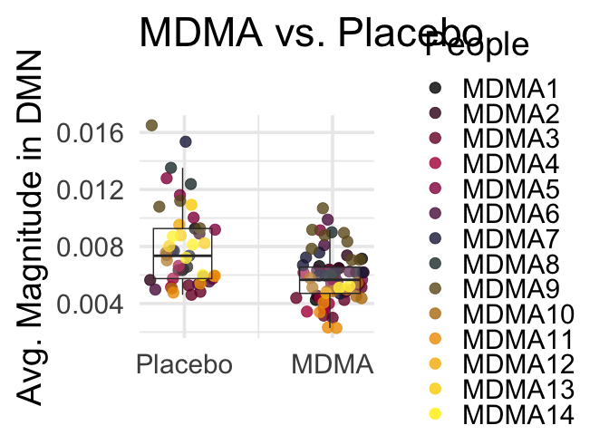
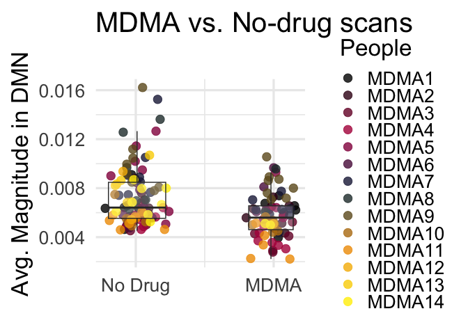

MDMA magnitude standalone
================
2023-07-13

``` r
library(reshape2)
library(ggplot2)
library(visreg)
library(nlme)
```

``` r
# prop angles
rs1=read.csv('~/Downloads/rs1_DMNMagMerged.csv',header=F)
rs2=read.csv('~/Downloads/rs2_DMNMagMerged.csv',header=F)
emo=read.csv('~/Downloads/emotion_DMNMagMerged.csv',header=F)
gambling=read.csv('~/Downloads/gambling_DMNMagMerged.csv',header=F)
wm=read.csv('~/Downloads/wm_DMNMagMerged.csv',header=F)

rs1$Task='rs'
rs2$Task='rs2'
emo$Task='emotion'
gambling$Task='gambling'
wm$Task='wm'

# remove subj 4
rs1=rs1[-c(4),]
rs2=rs2[-c(4),]
emo=emo[-c(4),]
gambling=gambling[-c(4),]
wm=wm[-c(4),]

# this is going to be ugly but simple
# manually pair columns as sep. observations of baseline, placebo, 80, 120mg
rs1bv=data.frame(cbind(rs1$V1,rs1$V5))
rs1p=data.frame(cbind(rs1$V2,rs1$V6))
rs1m1=data.frame(cbind(rs1$V3,rs1$V7))
rs1m2=data.frame(cbind(rs1$V4,rs1$V8))
colnames(rs1bv)=c('TDProp1','RemTRs')
colnames(rs1p)=c('TDProp1','RemTRs')
colnames(rs1m1)=c('TDProp1','RemTRs')
colnames(rs1m2)=c('TDProp1','RemTRs')

rs2bv=data.frame(cbind(rs2$V1,rs2$V5))
rs2p=data.frame(cbind(rs2$V2,rs2$V6))
rs2m1=data.frame(cbind(rs2$V3,rs2$V7))
rs2m2=data.frame(cbind(rs2$V4,rs2$V8))
colnames(rs2bv)=c('TDProp1','RemTRs')
colnames(rs2p)=c('TDProp1','RemTRs')
colnames(rs2m1)=c('TDProp1','RemTRs')
colnames(rs2m2)=c('TDProp1','RemTRs')

emobv=data.frame(cbind(emo$V1,emo$V5))
emop=data.frame(cbind(emo$V2,emo$V6))
emom1=data.frame(cbind(emo$V3,emo$V7))
emom2=data.frame(cbind(emo$V4,emo$V8))
colnames(emobv)=c('TDProp1','RemTRs')
colnames(emop)=c('TDProp1','RemTRs')
colnames(emom1)=c('TDProp1','RemTRs')
colnames(emom2)=c('TDProp1','RemTRs')

gamblingbv=data.frame(cbind(gambling$V1,gambling$V5))
gamblingp=data.frame(cbind(gambling$V2,gambling$V6))
gamblingm1=data.frame(cbind(gambling$V3,gambling$V7))
gamblingm2=data.frame(cbind(gambling$V4,gambling$V8))
colnames(gamblingbv)=c('TDProp1','RemTRs')
colnames(gamblingp)=c('TDProp1','RemTRs')
colnames(gamblingm1)=c('TDProp1','RemTRs')
colnames(gamblingm2)=c('TDProp1','RemTRs')

wmbv=data.frame(cbind(wm$V1,wm$V5))
wmp=data.frame(cbind(wm$V2,wm$V6))
wmm1=data.frame(cbind(wm$V3,wm$V7))
wmm2=data.frame(cbind(wm$V4,wm$V8))
colnames(wmbv)=c('TDProp1','RemTRs')
colnames(wmp)=c('TDProp1','RemTRs')
colnames(wmm1)=c('TDProp1','RemTRs')
colnames(wmm2)=c('TDProp1','RemTRs')

# get subject IDs from this rds
alff=readRDS('~/OutPlacDrug_alff.rds')
rs1bv$Subjects=alff$SubjID
rs1p$Subjects=alff$SubjID
rs1m1$Subjects=alff$SubjID
rs1m2$Subjects=alff$SubjID

rs2bv$Subjects=alff$SubjID
rs2p$Subjects=alff$SubjID
rs2m1$Subjects=alff$SubjID
rs2m2$Subjects=alff$SubjID

emobv$Subjects=alff$SubjID
emop$Subjects=alff$SubjID
emom1$Subjects=alff$SubjID
emom2$Subjects=alff$SubjID

gamblingbv$Subjects=alff$SubjID
gamblingp$Subjects=alff$SubjID
gamblingm1$Subjects=alff$SubjID
gamblingm2$Subjects=alff$SubjID

wmbv$Subjects=alff$SubjID
wmp$Subjects=alff$SubjID
wmm1$Subjects=alff$SubjID
wmm2$Subjects=alff$SubjID

# add in task (rs to be made equivalent after motion merge)
rs1bv$Task='rs'
rs1p$Task='rs'
rs1m1$Task='rs'
rs1m2$Task='rs'

rs2bv$Task='rs2'
rs2p$Task='rs2'
rs2m1$Task='rs2'
rs2m2$Task='rs2'

emobv$Task='emotion'
emop$Task='emotion'
emom1$Task='emotion'
emom2$Task='emotion'

gamblingbv$Task='gambling'
gamblingp$Task='gambling'
gamblingm1$Task='gambling'
gamblingm2$Task='gambling'

wmbv$Task='wm'
wmp$Task='wm'
wmm1$Task='wm'
wmm2$Task='wm'

# add in dosage
rs1bv$Dosage='baseline'
rs1p$Dosage='Placebo'
rs1m1$Dosage='80mg'
rs1m2$Dosage='120mg'

rs2bv$Dosage='baseline'
rs2p$Dosage='Placebo'
rs2m1$Dosage='80mg'
rs2m2$Dosage='120mg'

emobv$Dosage='baseline'
emop$Dosage='Placebo'
emom1$Dosage='80mg'
emom2$Dosage='120mg'

gamblingbv$Dosage='baseline'
gamblingp$Dosage='Placebo'
gamblingm1$Dosage='80mg'
gamblingm2$Dosage='120mg'

wmbv$Dosage='baseline'
wmp$Dosage='Placebo'
wmm1$Dosage='80mg'
wmm2$Dosage='120mg'

# combine all
allScans=rbind(rs1bv,rs1p,rs1m1,rs1m2,rs2bv,rs2p,rs2m1,rs2m2,emobv,emop,emom1,emom2,gamblingbv,gamblingp,gamblingm1,gamblingm2,wmbv,wmp,wmm1,wmm2)

# read in motion
mot=read.csv('~/Desktop/MDMA_spikes_summary.csv')

# motion merge
mergedDf=merge(mot,allScans,by=c('Subjects','Task','Dosage'))
mergedDf$Drug=0
mergedDf$Drug[mergedDf$Dosage=="120mg"]=1
mergedDf$Drug[mergedDf$Dosage=="80mg"]=1
mergedDf$Drug=as.factor(mergedDf$Drug)
mergedDf$Subjects<-as.factor(mergedDf$Subjects)
mergedDf$Dosage<-as.factor(mergedDf$Dosage)
mergedDfProps=mergedDf
```

``` r
# remove data that needs to be removed (subs 6 and 10, <250 TRs)
mergedDf=mergedDf[mergedDf$Subjects!='sub-MDMA006',]
mergedDf=mergedDf[mergedDf$Subjects!='sub-MDMA010',]
mergedDf=mergedDf[mergedDf$RemTRs>250,]
```

``` r
# assign clearer subject labels
# get unique subj names
mergedDf$Subjects <- droplevels(mergedDf$Subjects)
unique_values <- unique(mergedDf$Subjects)
new_labels <- paste0("MDMA", seq_along(unique_values))
names(new_labels) <- unique_values

# Replace the values in Subjects using the new labels
mergedDf$People <- new_labels[mergedDf$Subjects]

# final ordering
mergedDf$People <- factor(mergedDf$People, levels = new_labels)

# change rs2 to rs for accurate task-modeling
mergedDf$Task[mergedDf$Task=='rs2']='rs'
mergedDf$Task=as.factor(mergedDf$Task)
mergedDf_clean=mergedDf[mergedDf$Dosage!='baseline',]

# make donut plot
donutData<- data.frame(
  Category=levels(mergedDf$Dosage),
  count=tabulate(mergedDf$Dosage)
)

# convert labels to be consistent across studies
donutData$Category=c('Psychedelic','x','No Drug','Placebo')
# merge 120 and 80mg for clear plots
donutData$count[donutData$Category=='Psychedelic']=donutData$count[donutData$Category=='Psychedelic']+donutData$count[donutData$Category=='x']
donutData=donutData[donutData$Category!='x',]

# percentages
donutData$frac = donutData$count / sum(donutData$count)

# Compute the cumulative for plotting
donutData$ymax = cumsum(donutData$frac)

# Compute the bottom of each rectangle (plotted as rectangle and coord_polar'ed)
donutData$ymin = c(0, head(donutData$ymax, n=-1))

# convert to factor for manual ordering
donutData$Category <- factor(donutData$Category, levels = c('Placebo', 'No Drug', 'Psychedelic'))


# plot
ggplot(donutData, aes(ymax=ymax, ymin=ymin, xmax=4, xmin=3, fill=Category)) +
     geom_rect() +
     coord_polar(theta="y") + 
     xlim(c(1, 4)) + theme_classic(base_size=28)+theme(
    axis.text = element_blank(),
    axis.ticks = element_blank(),
    axis.line = element_blank()
  )+guides(fill = guide_legend(title = NULL))+scale_fill_manual(values = c("#EF9500","#002642","#840032"))
```

<!-- -->

``` r
# generate extended color pal for subject plotting
library(grDevices)
# Define the extended custom palette function
extended_palette <- colorRampPalette(rev(c("#FFEE00", "#EF9500", "#002642", "#c1004f", "#000000")))

# Generate a palette with the number of unique levels in V1
num_colors <- length(unique(mergedDf_clean$Subjects))
generated_colors <- extended_palette(num_colors)

# get head-motion regressed values for plotting
model_to_reg <- lm(TDProp1 ~ MeanFD + RemTRs+Task, data = mergedDf_clean)
mergedDf_clean$Residuals<-resid(model_to_reg)+mean(mergedDf_clean$TDProp1)

# gaussian jitter
set.seed(2)
mergedDf_clean$JitteredDrug <- as.numeric(mergedDf_clean$Drug) + rnorm(nrow(mergedDf_clean), mean = 0, sd = 0.1)

# figure 2a
ggplot(mergedDf_clean, aes(x = JitteredDrug, y = Residuals)) +
  geom_point(alpha = 0.8, size = 4, aes(color = People)) +  # Points with Gaussian jitter
  geom_boxplot(aes(group = Drug), alpha = 0.2, outlier.shape = NA, width = 0.25) +  # Boxplot
  labs(title = "MDMA vs. Placebo \n",
       x = "",
       y = "Avg. Magnitude in DMN") + 
  scale_x_continuous(breaks = 1:2, labels = c('Placebo', 'MDMA')) +
  scale_color_manual(values = generated_colors)+
  theme_minimal(base_size=28)
```

<!-- -->

``` r
# full model for stats
fit_lme <- lme(TDProp1 ~ Drug + RemTRs + MeanFD+Task, random = ~ 1 | Subjects, data = mergedDf_clean)
summary(fit_lme)
```

    ## Linear mixed-effects model fit by REML
    ##   Data: mergedDf_clean 
    ##         AIC       BIC   logLik
    ##   -1079.257 -1057.368 547.6287
    ## 
    ## Random effects:
    ##  Formula: ~1 | Subjects
    ##         (Intercept)    Residual
    ## StdDev: 0.001649035 0.001588973
    ## 
    ## Fixed effects:  TDProp1 ~ Drug + RemTRs + MeanFD + Task 
    ##                    Value   Std.Error  DF   t-value p-value
    ## (Intercept)  0.008235748 0.003022477 101  2.724834  0.0076
    ## Drug1       -0.002078404 0.000320057 101 -6.493863  0.0000
    ## RemTRs      -0.000005481 0.000007165 101 -0.764958  0.4461
    ## MeanFD       0.000998354 0.013102926 101  0.076193  0.9394
    ## Taskrs       0.002642710 0.000909061 101  2.907078  0.0045
    ## Taskwm       0.000712354 0.000851392 101  0.836693  0.4047
    ##  Correlation: 
    ##        (Intr) Drug1  RemTRs MeanFD Taskrs
    ## Drug1   0.031                            
    ## RemTRs -0.955 -0.022                     
    ## MeanFD -0.891 -0.188  0.787              
    ## Taskrs  0.839  0.029 -0.904 -0.752       
    ## Taskwm  0.794  0.048 -0.850 -0.733  0.913
    ## 
    ## Standardized Within-Group Residuals:
    ##         Min          Q1         Med          Q3         Max 
    ## -1.67031162 -0.63171111 -0.06836859  0.38128693  4.12671947 
    ## 
    ## Number of Observations: 120
    ## Number of Groups: 14

``` r
# testing lme4 for robustness
library(lme4)
```

    ## Loading required package: Matrix

    ## 
    ## Attaching package: 'lme4'

    ## The following object is masked from 'package:nlme':
    ## 
    ##     lmList

``` r
library(lmerTest)
```

    ## 
    ## Attaching package: 'lmerTest'

    ## The following object is masked from 'package:lme4':
    ## 
    ##     lmer

    ## The following object is masked from 'package:stats':
    ## 
    ##     step

``` r
fit_lmer <- lmer(TDProp1 ~ Drug + RemTRs + MeanFD+Task + (1 | Subjects), data = mergedDf_clean)
```

    ## Warning: Some predictor variables are on very different scales: consider
    ## rescaling
    ## Warning: Some predictor variables are on very different scales: consider
    ## rescaling

``` r
# checks out

#####
#### with all non-drug scans: Figure 2b
#####

# get head-motion regressed values for plotting
model_to_reg <- lm(TDProp1 ~ MeanFD + RemTRs+Task, data = mergedDf)
mergedDf$Residuals<-resid(model_to_reg)+mean(mergedDf$TDProp1)


# gaussian jitter
set.seed(1)
mergedDf$JitteredDrug <- as.numeric(mergedDf$Drug) + rnorm(nrow(mergedDf), mean = 0, sd = 0.1)

# figure 2a
ggplot(mergedDf, aes(x = JitteredDrug, y = Residuals)) +
  geom_point(alpha = 0.8, size = 4, aes(color = People)) +  # Points with Gaussian jitter
  geom_boxplot(aes(group = Drug), alpha = 0.2, outlier.shape = NA, width = 0.25) +  # Boxplot
  labs(title = "MDMA vs. No-drug scans \n",
       x = "",
       y = "Avg. Magnitude in DMN") + 
  scale_x_continuous(breaks = 1:2, labels = c('No Drug','MDMA')) +
  theme_minimal(base_size=25)+scale_color_manual(values = generated_colors)
```

<!-- -->

``` r
# full model for stats
fit_lme <- lme(TDProp1 ~ Drug + RemTRs + MeanFD+Task, random = ~ 1 | Subjects, data = mergedDf)
summary(fit_lme)
```

    ## Linear mixed-effects model fit by REML
    ##   Data: mergedDf 
    ##         AIC       BIC   logLik
    ##   -1570.221 -1545.471 793.1106
    ## 
    ## Random effects:
    ##  Formula: ~1 | Subjects
    ##         (Intercept)    Residual
    ## StdDev: 0.001457932 0.001579285
    ## 
    ## Fixed effects:  TDProp1 ~ Drug + RemTRs + MeanFD + Task 
    ##                    Value   Std.Error  DF   t-value p-value
    ## (Intercept)  0.008698962 0.002515142 150  3.458636  0.0007
    ## Drug1       -0.001494817 0.000264161 150 -5.658739  0.0000
    ## RemTRs      -0.000009030 0.000006078 150 -1.485735  0.1394
    ## MeanFD      -0.002656836 0.010505804 150 -0.252892  0.8007
    ## Taskrs       0.003398607 0.000764625 150  4.444801  0.0000
    ## Taskwm       0.000952150 0.000713765 150  1.333983  0.1842
    ##  Correlation: 
    ##        (Intr) Drug1  RemTRs MeanFD Taskrs
    ## Drug1  -0.039                            
    ## RemTRs -0.953  0.072                     
    ## MeanFD -0.871 -0.126  0.754              
    ## Taskrs  0.844 -0.071 -0.910 -0.722       
    ## Taskwm  0.804 -0.038 -0.857 -0.719  0.913
    ## 
    ## Standardized Within-Group Residuals:
    ##        Min         Q1        Med         Q3        Max 
    ## -2.2340325 -0.6463812 -0.1275661  0.4939345  4.0972945 
    ## 
    ## Number of Observations: 169
    ## Number of Groups: 14

``` r
# lme4 test for robustness
fit_lmer <- lmer(TDProp1 ~ Drug + RemTRs + MeanFD+Task + (1 | Subjects), data = mergedDf)
```

    ## Warning: Some predictor variables are on very different scales: consider
    ## rescaling
    ## Warning: Some predictor variables are on very different scales: consider
    ## rescaling

``` r
# checks out
```
