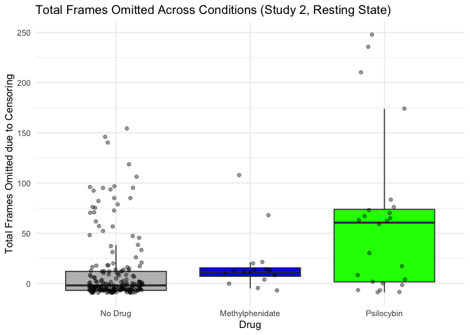
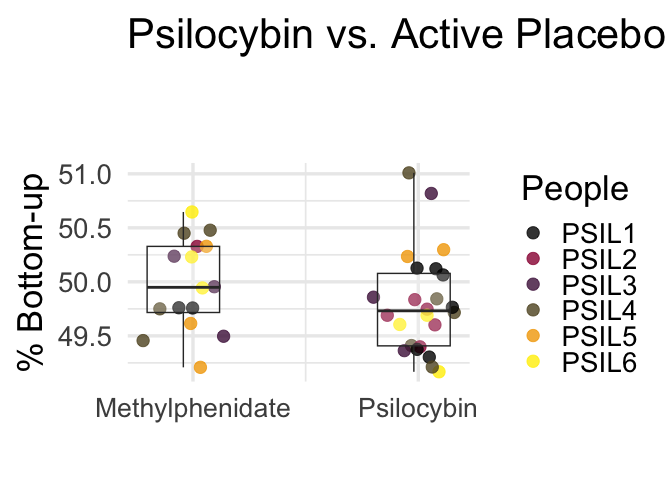
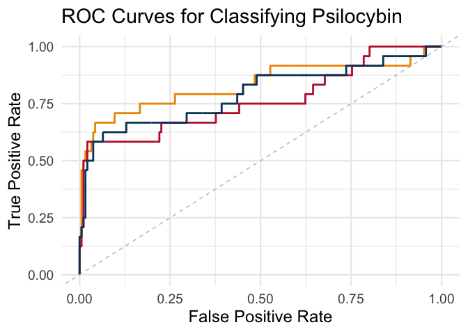
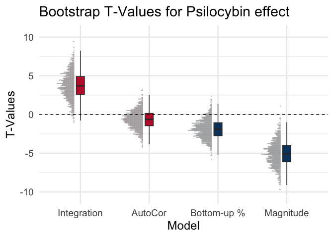

Psilocybin Stats and Visualization: Study 2
================
2024-02-03

``` r
library(reshape2)
library(ggplot2)
library(visreg)
library(nlme)
library(dplyr)
```

    ## 
    ## Attaching package: 'dplyr'

    ## The following object is masked from 'package:nlme':
    ## 
    ##     collapse

    ## The following objects are masked from 'package:stats':
    ## 
    ##     filter, lag

    ## The following objects are masked from 'package:base':
    ## 
    ##     intersect, setdiff, setequal, union

``` r
# prop angles
rs1=read.csv('~/Downloads/rs1_Psil_propsMerged.csv',header=F)
rs2=read.csv('~/Downloads/rs2_Psil_propsMerged.csv',header=F)
rs3=read.csv('~/Downloads/rs3_Psil_propsMerged.csv',header=F)
rs4=read.csv('~/Downloads/rs4_Psil_propsMerged.csv',header=F)
rs5=read.csv('~/Downloads/rs5_Psil_propsMerged.csv',header=F)
rs6=read.csv('~/Downloads/rs6_Psil_propsMerged.csv',header=F)

rs1$Task='rs'
rs2$Task='rs2'
rs3$Task='rs3'
rs4$Task='rs4'
rs5$Task='rs5'
rs6$Task='rs6'

# add an OG row column to determine which came first/second chronologically
rs1$OgRow=seq(1:dim(rs1)[1])
rs2$OgRow=seq(1:dim(rs2)[1])
rs3$OgRow=seq(1:dim(rs3)[1])
rs4$OgRow=seq(1:dim(rs4)[1])
rs5$OgRow=seq(1:dim(rs5)[1])
rs6$OgRow=seq(1:dim(rs6)[1])

# this is going to be ugly but simple
# NOTE VARIABLE NAMES ARE FOR EQUIVALENCE WITH MDMA PROC: 
# BV = BASELINE
# P = BETWEEN
# M1 = AFTER
# M2 = DRUG
# manually pair columns as sep. observations of baseline, placebo, 80, 120mg
rs1bv=data.frame(cbind(rs1$V1,rs1$V2,rs1$V3,rs1$V4,rs1$V17,rs1$OgRow,rs1$V21))
rs1p=data.frame(cbind(rs1$V5,rs1$V6,rs1$V7,rs1$V8,rs1$V18,rs1$OgRow,rs1$V22))
rs1m1=data.frame(cbind(rs1$V9,rs1$V10,rs1$V11,rs1$V12,rs1$V19,rs1$OgRow,rs1$V23))
rs1m2=data.frame(cbind(rs1$V13,rs1$V14,rs1$V15,rs1$V16,rs1$V20,rs1$OgRow,rs1$V24))
colnames(rs1bv)=c('TDProp1','TDProp2','TDProp3','TDProp4','RemTRs','OgRow','FD')
colnames(rs1p)=c('TDProp1','TDProp2','TDProp3','TDProp4','RemTRs','OgRow','FD')
colnames(rs1m1)=c('TDProp1','TDProp2','TDProp3','TDProp4','RemTRs','OgRow','FD')
colnames(rs1m2)=c('TDProp1','TDProp2','TDProp3','TDProp4','RemTRs','OgRow','FD')

rs2bv=data.frame(cbind(rs2$V1,rs2$V2,rs2$V3,rs2$V4,rs2$V17,rs2$OgRow,rs2$V21))
rs2p=data.frame(cbind(rs2$V5,rs2$V6,rs2$V7,rs2$V8,rs2$V18,rs2$OgRow,rs2$V22))
rs2m1=data.frame(cbind(rs2$V9,rs2$V10,rs2$V11,rs2$V12,rs2$V19,rs2$OgRow,rs2$V23))
rs2m2=data.frame(cbind(rs2$V13,rs2$V14,rs2$V15,rs2$V16,rs2$V20,rs2$OgRow,rs2$V24))
colnames(rs2bv)=c('TDProp1','TDProp2','TDProp3','TDProp4','RemTRs','OgRow','FD')
colnames(rs2p)=c('TDProp1','TDProp2','TDProp3','TDProp4','RemTRs','OgRow','FD')
colnames(rs2m1)=c('TDProp1','TDProp2','TDProp3','TDProp4','RemTRs','OgRow','FD')
colnames(rs2m2)=c('TDProp1','TDProp2','TDProp3','TDProp4','RemTRs','OgRow','FD')

rs3bv=data.frame(cbind(rs3$V1,rs3$V2,rs3$V3,rs3$V4,rs3$V17,rs3$OgRow,rs3$V21))
rs3p=data.frame(cbind(rs3$V5,rs3$V6,rs3$V7,rs3$V8,rs3$V18,rs3$OgRow,rs3$V22))
rs3m1=data.frame(cbind(rs3$V9,rs3$V10,rs3$V11,rs3$V12,rs3$V19,rs3$OgRow,rs3$V23))
rs3m2=data.frame(cbind(rs3$V13,rs3$V14,rs3$V15,rs3$V16,rs3$V20,rs3$OgRow,rs3$V24))
colnames(rs3bv)=c('TDProp1','TDProp2','TDProp3','TDProp4','RemTRs','OgRow','FD')
colnames(rs3p)=c('TDProp1','TDProp2','TDProp3','TDProp4','RemTRs','OgRow','FD')
colnames(rs3m1)=c('TDProp1','TDProp2','TDProp3','TDProp4','RemTRs','OgRow','FD')
colnames(rs3m2)=c('TDProp1','TDProp2','TDProp3','TDProp4','RemTRs','OgRow','FD')

rs4bv=data.frame(cbind(rs4$V1,rs4$V2,rs4$V3,rs4$V4,rs4$V17,rs4$OgRow,rs4$V21))
rs4p=data.frame(cbind(rs4$V5,rs4$V6,rs4$V7,rs4$V8,rs4$V18,rs4$OgRow,rs4$V22))
rs4m1=data.frame(cbind(rs4$V9,rs4$V10,rs4$V11,rs4$V12,rs4$V19,rs4$OgRow,rs4$V23))
rs4m2=data.frame(cbind(rs4$V13,rs4$V14,rs4$V15,rs4$V16,rs4$V20,rs4$OgRow,rs4$V24))
colnames(rs4bv)=c('TDProp1','TDProp2','TDProp3','TDProp4','RemTRs','OgRow','FD')
colnames(rs4p)=c('TDProp1','TDProp2','TDProp3','TDProp4','RemTRs','OgRow','FD')
colnames(rs4m1)=c('TDProp1','TDProp2','TDProp3','TDProp4','RemTRs','OgRow','FD')
colnames(rs4m2)=c('TDProp1','TDProp2','TDProp3','TDProp4','RemTRs','OgRow','FD')

rs5bv=data.frame(cbind(rs5$V1,rs5$V2,rs5$V3,rs5$V4,rs5$V17,rs5$OgRow,rs5$V21))
rs5p=data.frame(cbind(rs5$V5,rs5$V6,rs5$V7,rs5$V8,rs5$V18,rs5$OgRow,rs5$V22))
rs5m1=data.frame(cbind(rs5$V9,rs5$V10,rs5$V11,rs5$V12,rs5$V19,rs5$OgRow,rs5$V23))
rs5m2=data.frame(cbind(rs5$V13,rs5$V14,rs5$V15,rs5$V16,rs5$V20,rs5$OgRow,rs5$V24))
colnames(rs5bv)=c('TDProp1','TDProp2','TDProp3','TDProp4','RemTRs','OgRow','FD')
colnames(rs5p)=c('TDProp1','TDProp2','TDProp3','TDProp4','RemTRs','OgRow','FD')
colnames(rs5m1)=c('TDProp1','TDProp2','TDProp3','TDProp4','RemTRs','OgRow','FD')
colnames(rs5m2)=c('TDProp1','TDProp2','TDProp3','TDProp4','RemTRs','OgRow','FD')

rs6bv=data.frame(cbind(rs6$V1,rs6$V2,rs6$V3,rs6$V4,rs6$V17,rs6$OgRow,rs6$V21))
rs6p=data.frame(cbind(rs6$V5,rs6$V6,rs6$V7,rs6$V8,rs6$V18,rs6$OgRow,rs6$V22))
rs6m1=data.frame(cbind(rs6$V9,rs6$V10,rs6$V11,rs6$V12,rs6$V19,rs6$OgRow,rs6$V23))
rs6m2=data.frame(cbind(rs6$V13,rs6$V14,rs6$V15,rs6$V16,rs6$V20,rs6$OgRow,rs6$V24))
colnames(rs6bv)=c('TDProp1','TDProp2','TDProp3','TDProp4','RemTRs','OgRow','FD')
colnames(rs6p)=c('TDProp1','TDProp2','TDProp3','TDProp4','RemTRs','OgRow','FD')
colnames(rs6m1)=c('TDProp1','TDProp2','TDProp3','TDProp4','RemTRs','OgRow','FD')
colnames(rs6m2)=c('TDProp1','TDProp2','TDProp3','TDProp4','RemTRs','OgRow','FD')

# get subject IDs subject order csv (should both be identical)
subjOrder_rs1=read.delim('~/rs1_Psil_propsMerged_subjOrder.csv',blank.lines.skip = FALSE)
subjOrder_rs2=read.delim('~/rs2_Psil_propsMerged_subjOrder.csv',blank.lines.skip = FALSE)
subjOrder_rs3=read.delim('~/rs3_Psil_propsMerged_subjOrder.csv',blank.lines.skip = FALSE)
subjOrder_rs4=read.delim('~/rs4_Psil_propsMerged_subjOrder.csv',blank.lines.skip = FALSE)
subjOrder_rs5=read.delim('~/rs5_Psil_propsMerged_subjOrder.csv',blank.lines.skip = FALSE)
subjOrder_rs6=read.delim('~/rs6_Psil_propsMerged_subjOrder.csv',blank.lines.skip = FALSE)
rs1bv$Subjects=subjOrder_rs1$SubjNameCol
rs2bv$Subjects=subjOrder_rs2$SubjNameCol
rs3bv$Subjects=subjOrder_rs3$SubjNameCol
rs4bv$Subjects=subjOrder_rs4$SubjNameCol
rs5bv$Subjects=subjOrder_rs5$SubjNameCol
rs6bv$Subjects=subjOrder_rs6$SubjNameCol
rs1p$Subjects=subjOrder_rs1$SubjNameCol
rs2p$Subjects=subjOrder_rs2$SubjNameCol
rs3p$Subjects=subjOrder_rs3$SubjNameCol
rs4p$Subjects=subjOrder_rs4$SubjNameCol
rs5p$Subjects=subjOrder_rs5$SubjNameCol
rs6p$Subjects=subjOrder_rs6$SubjNameCol
rs1m1$Subjects=subjOrder_rs1$SubjNameCol
rs2m1$Subjects=subjOrder_rs2$SubjNameCol
rs3m1$Subjects=subjOrder_rs3$SubjNameCol
rs4m1$Subjects=subjOrder_rs4$SubjNameCol
rs5m1$Subjects=subjOrder_rs5$SubjNameCol
rs6m1$Subjects=subjOrder_rs6$SubjNameCol
rs1m2$Subjects=subjOrder_rs1$SubjNameCol
rs2m2$Subjects=subjOrder_rs2$SubjNameCol
rs3m2$Subjects=subjOrder_rs3$SubjNameCol
rs4m2$Subjects=subjOrder_rs4$SubjNameCol
rs5m2$Subjects=subjOrder_rs5$SubjNameCol
rs6m2$Subjects=subjOrder_rs6$SubjNameCol

# add session straight from matlab readout
subjOrder_rs_ws=read.delim('~/Downloads/rs_Psil_propsMerged_subjOrder_WithSesh.csv',blank.lines.skip = FALSE,sep=',')

rs1bv$Session=subjOrder_rs_ws$SubjNameCol_2
rs2bv$Session=subjOrder_rs_ws$SubjNameCol_2
rs3bv$Session=subjOrder_rs_ws$SubjNameCol_2
rs4bv$Session=subjOrder_rs_ws$SubjNameCol_2
rs5bv$Session=subjOrder_rs_ws$SubjNameCol_2
rs6bv$Session=subjOrder_rs_ws$SubjNameCol_2
rs1p$Session=subjOrder_rs_ws$SubjNameCol_2
rs2p$Session=subjOrder_rs_ws$SubjNameCol_2
rs3p$Session=subjOrder_rs_ws$SubjNameCol_2
rs4p$Session=subjOrder_rs_ws$SubjNameCol_2
rs5p$Session=subjOrder_rs_ws$SubjNameCol_2
rs6p$Session=subjOrder_rs_ws$SubjNameCol_2
rs1m1$Session=subjOrder_rs_ws$SubjNameCol_2
rs2m1$Session=subjOrder_rs_ws$SubjNameCol_2
rs3m1$Session=subjOrder_rs_ws$SubjNameCol_2
rs4m1$Session=subjOrder_rs_ws$SubjNameCol_2
rs5m1$Session=subjOrder_rs_ws$SubjNameCol_2
rs6m1$Session=subjOrder_rs_ws$SubjNameCol_2
rs1m2$Session=subjOrder_rs_ws$SubjNameCol_2
rs2m2$Session=subjOrder_rs_ws$SubjNameCol_2
rs3m2$Session=subjOrder_rs_ws$SubjNameCol_2
rs4m2$Session=subjOrder_rs_ws$SubjNameCol_2
rs5m2$Session=subjOrder_rs_ws$SubjNameCol_2
rs6m2$Session=subjOrder_rs_ws$SubjNameCol_2
# add in task (rs to be made equivalent after motion merge)
rs1bv$Task='rs'
rs1p$Task='rs'
rs1m1$Task='rs'
rs1m2$Task='rs'

rs2bv$Task='rs2'
rs2p$Task='rs2'
rs2m1$Task='rs2'
rs2m2$Task='rs2'

rs3bv$Task='rs3'
rs3p$Task='rs3'
rs3m1$Task='rs3'
rs3m2$Task='rs3'

rs4bv$Task='rs4'
rs4p$Task='rs4'
rs4m1$Task='rs4'
rs4m2$Task='rs4'

rs5bv$Task='rs5'
rs5p$Task='rs5'
rs5m1$Task='rs5'
rs5m2$Task='rs5'

rs6bv$Task='rs6'
rs6p$Task='rs6'
rs6m1$Task='rs6'
rs6m2$Task='rs6'
```

``` r
# change to account for psy_pfm structure
# add in dosage
rs1bv$Dosage='none'
rs1p$Dosage='none'
rs1m1$Dosage='none'
rs1m2$Dosage='Drug'

rs2bv$Dosage='none'
rs2p$Dosage='none'
rs2m1$Dosage='none'
rs2m2$Dosage='Drug'

rs3bv$Dosage='none'
rs3p$Dosage='none'
rs3m1$Dosage='none'
rs3m2$Dosage='Drug'

rs4bv$Dosage='none'
rs4p$Dosage='none'
rs4m1$Dosage='none'
rs4m2$Dosage='Drug'

rs5bv$Dosage='none'
rs5p$Dosage='none'
rs5m1$Dosage='none'
rs5m2$Dosage='Drug'

rs6bv$Dosage='none'
rs6p$Dosage='none'
rs6m1$Dosage='none'
rs6m2$Dosage='Drug'
```

``` r
# BEFORE/AFTER VERSION
# change to account for psy_pfm structure
# add in dosage
rs1bv$Dosage='before'
rs1p$Dosage='between'
rs1m1$Dosage='after'
rs1m2$Dosage='Drug'
#
rs2bv$Dosage='before'
rs2p$Dosage='between'
rs2m1$Dosage='after'
rs2m2$Dosage='Drug'
#
rs3bv$Dosage='before'
rs3p$Dosage='between'
rs3m1$Dosage='after'
rs3m2$Dosage='Drug'
#
rs4bv$Dosage='before'
rs4p$Dosage='between'
rs4m1$Dosage='after'
rs4m2$Dosage='Drug'
#
rs5bv$Dosage='before'
rs5p$Dosage='between'
rs5m1$Dosage='after'
rs5m2$Dosage='Drug'
#
rs6bv$Dosage='before'
rs6p$Dosage='between'
rs6m1$Dosage='after'
rs6m2$Dosage='Drug'
```

``` r
# parse out only existing rows 
rs1bv=rs1bv[rs1bv$TDProp1>0,]
rs1p=rs1p[rs1p$TDProp1>0,]
rs1m1=rs1m1[rs1m1$TDProp1>0,]
rs1m2=rs1m2[rs1m2$TDProp1>0,]

rs2bv=rs2bv[rs2bv$TDProp1>0,]
rs2p=rs2p[rs2p$TDProp1>0,]
rs2m1=rs2m1[rs2m1$TDProp1>0,]
rs2m2=rs2m2[rs2m2$TDProp1>0,]

rs3bv=rs3bv[rs3bv$TDProp1>0,]
rs3p=rs3p[rs3p$TDProp1>0,]
rs3m1=rs3m1[rs3m1$TDProp1>0,]
rs3m2=rs3m2[rs3m2$TDProp1>0,]

rs4bv=rs4bv[rs4bv$TDProp1>0,]
rs4p=rs4p[rs4p$TDProp1>0,]
rs4m1=rs4m1[rs4m1$TDProp1>0,]
rs4m2=rs4m2[rs4m2$TDProp1>0,]

rs5bv=rs5bv[rs5bv$TDProp1>0,]
rs5p=rs5p[rs5p$TDProp1>0,]
rs5m1=rs5m1[rs5m1$TDProp1>0,]
rs5m2=rs5m2[rs5m2$TDProp1>0,]

rs6bv=rs6bv[rs6bv$TDProp1>0,]
rs6p=rs6p[rs6p$TDProp1>0,]
rs6m1=rs6m1[rs6m1$TDProp1>0,]
rs6m2=rs6m2[rs6m2$TDProp1>0,]
```

``` r
# decode Methylphenidate vs. psilocybin for each PT
subjDoseCorresp=read.csv('~/subjSeshDoseCorresp_psilo.csv',header=F)
```

    ## Warning in read.table(file = file, header = header, sep = sep, quote = quote, :
    ## incomplete final line found by readTableHeader on
    ## '~/subjSeshDoseCorresp_psilo.csv'

``` r
subjDoseCorresp=data.frame(t(subjDoseCorresp))
subjDoseCorresp$X2<-as.numeric(subjDoseCorresp$X2)
# initialize new drug column in all dfs
rs1bv$Drug <- rep('none', nrow(rs1bv))
rs1bv$Drug <- factor(rs1bv$Drug, levels = c('none', 'Methyl', 'Psilo','Drug1','Drug2','Drug'))
rs2bv$Drug=rep('none', nrow(rs2bv))
rs2bv$Drug<- factor(rs2bv$Drug, levels = c('none', 'Methyl', 'Psilo','Drug1','Drug2','Drug'))
rs1p$Drug=rep('none', nrow(rs1p))
rs1p$Drug<- factor(rs1p$Drug, levels = c('none', 'Methyl', 'Psilo','Drug1','Drug2','Drug'))
rs2p$Drug=rep('none', nrow(rs2p))
rs2p$Drug<- factor(rs2p$Drug, levels = c('none', 'Methyl', 'Psilo','Drug1','Drug2','Drug'))
rs1m1$Drug=rep('none', nrow(rs1m1))
rs1m1$Drug<- factor(rs1m1$Drug, levels = c('none', 'Methyl', 'Psilo','Drug1','Drug2','Drug'))
rs2m1$Drug=rep('none', nrow(rs2m1))
rs2m1$Drug<- factor(rs2m1$Drug, levels = c('none', 'Methyl', 'Psilo','Drug1','Drug2','Drug'))
rs1m2$Drug=rep('none', nrow(rs1m2))
rs1m2$Drug<- factor(rs1m2$Drug, levels = c('none', 'Methyl', 'Psilo','Drug1','Drug2','Drug'))
rs2m2$Drug=rep('none', nrow(rs2m2))
rs2m2$Drug<- factor(rs2m2$Drug, levels = c('none', 'Methyl', 'Psilo','Drug1','Drug2','Drug'))
rs3bv$Drug=rep('none', nrow(rs3bv))
rs3bv$Drug<- factor(rs3bv$Drug, levels = c('none', 'Methyl', 'Psilo','Drug1','Drug2','Drug'))
rs3p$Drug=rep('none', nrow(rs3p))
rs3p$Drug<- factor(rs3p$Drug, levels = c('none', 'Methyl', 'Psilo','Drug1','Drug2','Drug'))
rs3m1$Drug=rep('none', nrow(rs3m1))
rs3m1$Drug<- factor(rs3m1$Drug, levels = c('none', 'Methyl', 'Psilo','Drug1','Drug2','Drug'))
rs3m2$Drug=rep('none', nrow(rs3m2))
rs3m2$Drug<- factor(rs3m2$Drug, levels = c('none', 'Methyl', 'Psilo','Drug1','Drug2','Drug'))
rs4bv$Drug=rep('none', nrow(rs4bv))
rs4bv$Drug<- factor(rs4bv$Drug, levels = c('none', 'Methyl', 'Psilo','Drug1','Drug2','Drug'))
rs4p$Drug=rep('none', nrow(rs4p))
rs4p$Drug<- factor(rs4p$Drug, levels = c('none', 'Methyl', 'Psilo','Drug1','Drug2','Drug'))
rs4m1$Drug=rep('none', nrow(rs4m1))
rs4m1$Drug<- factor(rs4m1$Drug, levels = c('none', 'Methyl', 'Psilo','Drug1','Drug2','Drug'))
rs4m2$Drug=rep('none', nrow(rs4m2))
rs4m2$Drug<- factor(rs4m2$Drug, levels = c('none', 'Methyl', 'Psilo','Drug1','Drug2','Drug'))
rs5bv$Drug=rep('none', nrow(rs5bv))
rs5bv$Drug<- factor(rs5bv$Drug, levels = c('none', 'Methyl', 'Psilo','Drug1','Drug2','Drug'))
rs5p$Drug=rep('none', nrow(rs5p))
rs5p$Drug<- factor(rs5p$Drug, levels = c('none', 'Methyl', 'Psilo','Drug1','Drug2','Drug'))
rs5m1$Drug=rep('none', nrow(rs5m1))
rs5m1$Drug<- factor(rs5m1$Drug, levels = c('none', 'Methyl', 'Psilo','Drug1','Drug2','Drug'))
rs5m2$Drug=rep('none', nrow(rs5m2))
rs5m2$Drug<- factor(rs5m2$Drug, levels = c('none', 'Methyl', 'Psilo','Drug1','Drug2','Drug'))
rs6bv$Drug=rep('none', nrow(rs6bv))
rs6bv$Drug<- factor(rs6bv$Drug, levels = c('none', 'Methyl', 'Psilo','Drug1','Drug2','Drug'))
rs6p$Drug=rep('none', nrow(rs6p))
rs6p$Drug<- factor(rs6p$Drug, levels = c('none', 'Methyl', 'Psilo','Drug1','Drug2','Drug'))
rs6m1$Drug=rep('none', nrow(rs6m1))
rs6m1$Drug<- factor(rs6m1$Drug, levels = c('none', 'Methyl', 'Psilo','Drug1','Drug2','Drug'))
rs6m2$Drug=rep('none', nrow(rs6m2))
rs6m2$Drug<- factor(rs6m2$Drug, levels = c('none', 'Methyl', 'Psilo','Drug1','Drug2','Drug'))

# for resting-state 1
for (s in 1:length(unique(rs1m2$Subjects))){
  # this subject
  subj=unique(rs1m2$Subjects)[s]
  print(subj)
  # Subset rows for the current subject
  subjRows <- rs1m2[rs1m2$Subjects == subj, ]
  # Subset rows for the 'Drug' dosage
  subjDrugRows <- subjRows[subjRows$Dosage == 'Drug', ]
  # Identify 'Drug1' and 'Drug2' based on 'OgRow'
  ###drug1Rows <- subjDrugRows[subjDrugRows$OgRow == min(subjDrugRows$OgRow), ]
  ###drug2Rows <- subjDrugRows[subjDrugRows$OgRow == max(subjDrugRows$OgRow), ]
  drug1Rows <- which(subjDrugRows$Session == 1)
  drug2Rows <- which(subjDrugRows$Session == 2)
  # if min=max, label only 1 drug
  ###if (min(subjDrugRows$OgRow)==max(subjDrugRows$OgRow)){
  ###  subjDrugRows$Drug='DrugOnly'
  ###  subjRows$Drug[subjDrugRows$OgRow==subjDrugRows$OgRow]='Drug'
  ###} else {
  #  # Assign 'Drug' values to the original rows
    ###subjRows$Drug[subjRows$OgRow %in% drug1Rows$OgRow] <- 'Drug1'
    ###subjRows$Drug[subjRows$OgRow %in% drug2Rows$OgRow] <- 'Drug2'
    subjRows$Drug[drug1Rows] <- 'Drug1'
    subjRows$Drug[drug2Rows] <- 'Drug2'
  #}
  ### Now pull out methyl vs. psilo
  DoseCorresp=subjDoseCorresp[subjDoseCorresp$X1==subj,]
  # if Drug1 = 1 in key, Drug1 = psilo
  if (subjDrugRows$Drug[1] == 'DrugOnly_CantSeeMe') {
    subjRows$Drug[subjRows$Drug == 'Drug'] <- 'Psilo'
  } else if (DoseCorresp$X2 == 1) {
    subjRows$Drug[subjRows$Drug == 'Drug1'] <- 'Psilo'
    subjRows$Drug[subjRows$Drug == 'Drug2'] <- 'Methyl'
  } else if (DoseCorresp$X2 == 2) {
    subjRows$Drug[subjRows$Drug == 'Drug1'] <- 'Methyl'
    subjRows$Drug[subjRows$Drug == 'Drug2'] <- 'Psilo'
  } 
  # find where OG row corresponds to methyl
  MethylRows=subjRows$OgRow[subjRows$Drug=='Methyl']
  # and psilo
  PsiloRows=subjRows$OgRow[subjRows$Drug=='Psilo']
  # set
  rs1m2$Drug[rs1m2$OgRow==MethylRows[1]]='Methyl'
  rs1m2$Drug[rs1m2$OgRow==PsiloRows[1]]='Psilo'
}
```

    ## [1] "PS03"
    ## [1] "PS16"
    ## [1] "PS18"
    ## [1] "PS19"
    ## [1] "PS21"
    ## [1] "PS24"
    ## [1] "PS93"
    ## [1] "PS96"
    ## [1] "PS98"
    ## [1] "PS99"

``` r
# for resting-state 2
for (s in 1:length(unique(rs2m2$Subjects))){
  # this subject
  subj=unique(rs2m2$Subjects)[s]
  print(subj)
  # Subset rows for the current subject
  subjRows <- rs2m2[rs2m2$Subjects == subj, ]
  # Subset rows for the 'Drug' dosage
  subjDrugRows <- subjRows[subjRows$Dosage == 'Drug', ]
  # Identify 'Drug1' and 'Drug2' based on 'OgRow'
  ###drug1Rows <- subjDrugRows[subjDrugRows$OgRow == min(subjDrugRows$OgRow), ]
  ###drug2Rows <- subjDrugRows[subjDrugRows$OgRow == max(subjDrugRows$OgRow), ]
  drug1Rows <- which(subjDrugRows$Session == 1)
  drug2Rows <- which(subjDrugRows$Session == 2)
  # if min=max, label only 1 drug
  ###if (min(subjDrugRows$OgRow)==max(subjDrugRows$OgRow)){
  ###  subjDrugRows$Drug='DrugOnly'
  ###  subjRows$Drug[subjDrugRows$OgRow==subjDrugRows$OgRow]='Drug'
  ###} else {
  #  # Assign 'Drug' values to the original rows
    ###subjRows$Drug[subjRows$OgRow %in% drug1Rows$OgRow] <- 'Drug1'
    ###subjRows$Drug[subjRows$OgRow %in% drug2Rows$OgRow] <- 'Drug2'
    subjRows$Drug[drug1Rows] <- 'Drug1'
    subjRows$Drug[drug2Rows] <- 'Drug2'
  #}
  ### Now pull out methyl vs. psilo
  DoseCorresp=subjDoseCorresp[subjDoseCorresp$X1==subj,]
  # if Drug1 = 1 in key, Drug1 = psilo
  if (subjDrugRows$Drug[1] == 'DrugOnly_CantSeeMe') {
    subjRows$Drug[subjRows$Drug == 'Drug'] <- 'Psilo'
  } else if (DoseCorresp$X2 == 1) {
    subjRows$Drug[subjRows$Drug == 'Drug1'] <- 'Psilo'
    subjRows$Drug[subjRows$Drug == 'Drug2'] <- 'Methyl'
  } else if (DoseCorresp$X2 == 2) {
    subjRows$Drug[subjRows$Drug == 'Drug1'] <- 'Methyl'
    subjRows$Drug[subjRows$Drug == 'Drug2'] <- 'Psilo'
  } 
  # find where OG row corresponds to methyl
  MethylRows=subjRows$OgRow[subjRows$Drug=='Methyl']
  # and psilo
  PsiloRows=subjRows$OgRow[subjRows$Drug=='Psilo']
  # set
  rs2m2$Drug[rs2m2$OgRow==MethylRows[1]]='Methyl'
  rs2m2$Drug[rs2m2$OgRow==PsiloRows[1]]='Psilo'
}
```

    ## [1] "PS03"
    ## [1] "PS18"
    ## [1] "PS19"
    ## [1] "PS21"
    ## [1] "PS24"
    ## [1] "PS93"
    ## [1] "PS96"
    ## [1] "PS98"
    ## [1] "PS99"
    ## [1] "PS16"

``` r
# for resting-state 3
for (s in 1:length(unique(rs3m2$Subjects))){
  # this subject
  subj=unique(rs3m2$Subjects)[s]
  print(subj)
  # Subset rows for the current subject
  subjRows <- rs3m2[rs3m2$Subjects == subj, ]
  # Subset rows for the 'Drug' dosage
  subjDrugRows <- subjRows[subjRows$Dosage == 'Drug', ]
    # Identify 'Drug1' and 'Drug2' based on 'OgRow'
  ###drug1Rows <- subjDrugRows[subjDrugRows$OgRow == min(subjDrugRows$OgRow), ]
  ###drug2Rows <- subjDrugRows[subjDrugRows$OgRow == max(subjDrugRows$OgRow), ]
  drug1Rows <- which(subjDrugRows$Session == 1)
  drug2Rows <- which(subjDrugRows$Session == 2)
  # if min=max, label only 1 drug
  ###if (min(subjDrugRows$OgRow)==max(subjDrugRows$OgRow)){
  ###  subjDrugRows$Drug='DrugOnly'
  ###  subjRows$Drug[subjDrugRows$OgRow==subjDrugRows$OgRow]='Drug'
  ###} else {
  #  # Assign 'Drug' values to the original rows
    ###subjRows$Drug[subjRows$OgRow %in% drug1Rows$OgRow] <- 'Drug1'
    ###subjRows$Drug[subjRows$OgRow %in% drug2Rows$OgRow] <- 'Drug2'
    subjRows$Drug[drug1Rows] <- 'Drug1'
    subjRows$Drug[drug2Rows] <- 'Drug2'
  #}
  ### Now pull out methyl vs. psilo
  DoseCorresp=subjDoseCorresp[subjDoseCorresp$X1==subj,]
  # if Drug1 = 1 in key, Drug1 = psilo
  if (subjDrugRows$Drug[1] == 'DrugOnly_cantSeeMe') {
    subjRows$Drug[subjRows$Drug == 'Drug'] <- 'Psilo'
  } else if (DoseCorresp$X2 == 1) {
    subjRows$Drug[subjRows$Drug == 'Drug1'] <- 'Psilo'
    subjRows$Drug[subjRows$Drug == 'Drug2'] <- 'Methyl'
  } else if (DoseCorresp$X2 == 2) {
    subjRows$Drug[subjRows$Drug == 'Drug1'] <- 'Methyl'
    subjRows$Drug[subjRows$Drug == 'Drug2'] <- 'Psilo'
  }
  # find where OG row corresponds to methyl
  MethylRows=subjRows$OgRow[subjRows$Drug=='Methyl']
  # and psilo
  PsiloRows=subjRows$OgRow[subjRows$Drug=='Psilo']
  # set
  rs3m2$Drug[rs3m2$OgRow==MethylRows[1]]='Methyl'
  rs3m2$Drug[rs3m2$OgRow==PsiloRows[1]]='Psilo'
}
```

    ## [1] "PS18"
    ## [1] "PS19"
    ## [1] "PS21"
    ## [1] "PS24"
    ## [1] "PS93"
    ## [1] "PS96"
    ## [1] "PS99"

``` r
# for resting-state 4
for (s in 1:length(unique(rs4m2$Subjects))){
  # this subject
  subj=unique(rs4m2$Subjects)[s]
  print(subj)
  # Subset rows for the current subject
  subjRows <- rs4m2[rs4m2$Subjects == subj, ]
  # Subset rows for the 'Drug' dosage
  subjDrugRows <- subjRows[subjRows$Dosage == 'Drug', ]
  # Identify 'Drug1' and 'Drug2' based on 'OgRow'
  ###drug1Rows <- subjDrugRows[subjDrugRows$OgRow == min(subjDrugRows$OgRow), ]
  ###drug2Rows <- subjDrugRows[subjDrugRows$OgRow == max(subjDrugRows$OgRow), ]
  drug1Rows <- which(subjDrugRows$Session == 1)
  drug2Rows <- which(subjDrugRows$Session == 2)
  # if min=max, label only 1 drug
  ###if (min(subjDrugRows$OgRow)==max(subjDrugRows$OgRow)){
  ###  subjDrugRows$Drug='DrugOnly'
  ###  subjRows$Drug[subjDrugRows$OgRow==subjDrugRows$OgRow]='Drug'
  ###} else {
  #  # Assign 'Drug' values to the original rows
    ###subjRows$Drug[subjRows$OgRow %in% drug1Rows$OgRow] <- 'Drug1'
    ###subjRows$Drug[subjRows$OgRow %in% drug2Rows$OgRow] <- 'Drug2'
    subjRows$Drug[drug1Rows] <- 'Drug1'
    subjRows$Drug[drug2Rows] <- 'Drug2'
  #}
  ### Now pull out methyl vs. psilo
  DoseCorresp=subjDoseCorresp[subjDoseCorresp$X1==subj,]
  # if Drug1 = 1 in key, Drug1 = psilo
  if (subjDrugRows$Drug[1] == 'DrugOnly_CantSeeMe') {
    subjRows$Drug[subjRows$Drug == 'Drug'] <- 'Psilo'
  } else if (DoseCorresp$X2 == 1) {
    subjRows$Drug[subjRows$Drug == 'Drug1'] <- 'Psilo'
    subjRows$Drug[subjRows$Drug == 'Drug2'] <- 'Methyl'
  } else if (DoseCorresp$X2 == 2) {
    subjRows$Drug[subjRows$Drug == 'Drug1'] <- 'Methyl'
    subjRows$Drug[subjRows$Drug == 'Drug2'] <- 'Psilo'
  }
  # find where OG row corresponds to methyl
  MethylRows=subjRows$OgRow[subjRows$Drug=='Methyl']
  # and psilo
  PsiloRows=subjRows$OgRow[subjRows$Drug=='Psilo']
  # set
  rs4m2$Drug[rs4m2$OgRow==MethylRows[1]]='Methyl'
  rs4m2$Drug[rs4m2$OgRow==PsiloRows[1]]='Psilo'
}
```

    ## [1] "PS19"
    ## [1] "PS24"
    ## [1] "PS93"

``` r
# for resting-state 5
for (s in 1:length(unique(rs5m2$Subjects))){
  # this subject
  subj=unique(rs5m2$Subjects)[s]
  print(subj)
  # Subset rows for the current subject
  subjRows <- rs5m2[rs5m2$Subjects == subj, ]
  # Subset rows for the 'Drug' dosage
  subjDrugRows <- subjRows[subjRows$Dosage == 'Drug', ]
  # Identify 'Drug1' and 'Drug2' based on 'OgRow'
  ###drug1Rows <- subjDrugRows[subjDrugRows$OgRow == min(subjDrugRows$OgRow), ]
  ###drug2Rows <- subjDrugRows[subjDrugRows$OgRow == max(subjDrugRows$OgRow), ]
  drug1Rows <- which(subjDrugRows$Session == 1)
  drug2Rows <- which(subjDrugRows$Session == 2)
  # if min=max, label only 1 drug
  ###if (min(subjDrugRows$OgRow)==max(subjDrugRows$OgRow)){
  ###  subjDrugRows$Drug='DrugOnly'
  ###  subjRows$Drug[subjDrugRows$OgRow==subjDrugRows$OgRow]='Drug'
  ###} else {
  #  # Assign 'Drug' values to the original rows
    ###subjRows$Drug[subjRows$OgRow %in% drug1Rows$OgRow] <- 'Drug1'
    ###subjRows$Drug[subjRows$OgRow %in% drug2Rows$OgRow] <- 'Drug2'
    subjRows$Drug[drug1Rows] <- 'Drug1'
    subjRows$Drug[drug2Rows] <- 'Drug2'
  #}
  ### Now pull out methyl vs. psilo
  DoseCorresp=subjDoseCorresp[subjDoseCorresp$X1==subj,]
  # if Drug1 = 1 in key, Drug1 = psilo
  if (subjDrugRows$Drug[1] == 'DrugOnly_CantSeeMe') {
    subjRows$Drug[subjRows$Drug == 'Drug'] <- 'Psilo'
  } else if (DoseCorresp$X2 == 1) {
    subjRows$Drug[subjRows$Drug == 'Drug1'] <- 'Psilo'
    subjRows$Drug[subjRows$Drug == 'Drug2'] <- 'Methyl'
  } else if (DoseCorresp$X2 == 2) {
    subjRows$Drug[subjRows$Drug == 'Drug1'] <- 'Methyl'
    subjRows$Drug[subjRows$Drug == 'Drug2'] <- 'Psilo'
  }
  # find where OG row corresponds to methyl
  MethylRows=subjRows$OgRow[subjRows$Drug=='Methyl']
  # and psilo
  PsiloRows=subjRows$OgRow[subjRows$Drug=='Psilo']
  # set
  rs5m2$Drug[rs5m2$OgRow==MethylRows[1]]='Methyl'
  rs5m2$Drug[rs5m2$OgRow==PsiloRows[1]]='Psilo'
}
```

    ## [1] "PS24"

``` r
# for resting-state 6
for (s in 1:length(unique(rs6m2$Subjects))){
  # this subject
  subj=unique(rs6m2$Subjects)[s]
  print(subj)
  # Subset rows for the current subject
  subjRows <- rs6m2[rs6m2$Subjects == subj, ]
  # Subset rows for the 'Drug' dosage
  subjDrugRows <- subjRows[subjRows$Dosage == 'Drug', ]
  # Identify 'Drug1' and 'Drug2' based on 'OgRow'
  ###drug1Rows <- subjDrugRows[subjDrugRows$OgRow == min(subjDrugRows$OgRow), ]
  ###drug2Rows <- subjDrugRows[subjDrugRows$OgRow == max(subjDrugRows$OgRow), ]
  drug1Rows <- which(subjDrugRows$Session == 1)
  drug2Rows <- which(subjDrugRows$Session == 2)
  # if min=max, label only 1 drug
  ###if (min(subjDrugRows$OgRow)==max(subjDrugRows$OgRow)){
  ###  subjDrugRows$Drug='DrugOnly'
  ###  subjRows$Drug[subjDrugRows$OgRow==subjDrugRows$OgRow]='Drug'
  ###} else {
  #  # Assign 'Drug' values to the original rows
    ###subjRows$Drug[subjRows$OgRow %in% drug1Rows$OgRow] <- 'Drug1'
    ###subjRows$Drug[subjRows$OgRow %in% drug2Rows$OgRow] <- 'Drug2'
    subjRows$Drug[drug1Rows] <- 'Drug1'
    subjRows$Drug[drug2Rows] <- 'Drug2'
  #}
  ### Now pull out methyl vs. psilo
  DoseCorresp=subjDoseCorresp[subjDoseCorresp$X1==subj,]
  # if Drug1 = 1 in key, Drug1 = psilo
  if (subjDrugRows$Drug[1] == 'DrugOnly_CantSeeMe') {
    subjRows$Drug[subjRows$Drug == 'Drug'] <- 'Psilo'
  } else if (DoseCorresp$X2 == 1) {
    subjRows$Drug[subjRows$Drug == 'Drug1'] <- 'Psilo'
    subjRows$Drug[subjRows$Drug == 'Drug2'] <- 'Methyl'
  } else if (DoseCorresp$X2 == 2) {
    subjRows$Drug[subjRows$Drug == 'Drug1'] <- 'Methyl'
    subjRows$Drug[subjRows$Drug == 'Drug2'] <- 'Psilo'
  }
  # find where OG row corresponds to methyl
  MethylRows=subjRows$OgRow[subjRows$Drug=='Methyl']
  # and psilo
  PsiloRows=subjRows$OgRow[subjRows$Drug=='Psilo']
  # set
  rs6m2$Drug[rs6m2$OgRow==MethylRows[1]]='Methyl'
  rs6m2$Drug[rs6m2$OgRow==PsiloRows[1]]='Psilo'
}
```

    ## [1] "PS24"

``` r
# combine all
allScans=rbind(rs1bv,rs1p,rs1m1,rs1m2,rs2bv,rs2p,rs2m1,rs2m2,rs3bv,rs3p,rs3m1,rs3m2,rs4bv,rs4p,rs4m1,rs4m2,rs5bv,rs5p,rs5m1,rs5m2,rs6bv,rs6p,rs6m1,rs6m2)
# before scans
Before=rbind(rs1bv,rs2bv,rs3bv,rs4bv,rs5bv,rs6bv)
Before$Chronology='Before'
# after
After=rbind(rs1m1,rs2m1,rs3m1,rs4m1,rs5m1,rs6m1)
After$Chronology='After'
B_A=rbind(Before,After)
# set non-drug conditions to none
allScans$Drug[allScans$Dosage=='none']='none'
# retain a legacy subjects naming convention for MEQ use later
allScans$LegacySubjs=allScans$Subjects
```

``` r
### make chronological order column.
allScans$TemporalOrder=0
for (s in 1:length(unique(allScans$Subjects))){
  # get subject ID
  subject=(unique(allScans$Subjects))[s]
  allScansSubj=allScans[allScans$Subjects==subject,]
  # first logical temporal determination is in Dosage column: before < drug 1 < between < drug 2 < after
  allScansSubj$TemporalOrder[allScansSubj$Dosage=='before']=1000
  allScansSubj$TemporalOrder[allScansSubj$Dosage=='Drug']=2000
  # note drug1 vs drug 2 to be demarcated later, after this loop, using Drug column 
  allScansSubj$TemporalOrder[allScansSubj$Dosage=='between']=3000
  allScansSubj$TemporalOrder[allScansSubj$Dosage=='after']=4000
  # second logical temporal determination is session # column: lower session = earlier on
  #allScansSubj$TemporalOrder <- allScansSubj$TemporalOrder + allScansSubj$OgRow
  allScansSubj$TemporalOrder <- allScansSubj$TemporalOrder + allScansSubj$Session
  # use both pieces of logic combined to get sequence for each subject of first to last scan (numbered 1 for first and x for last scan)
  allScansSubj$TemporalOrder <- rank(allScansSubj$TemporalOrder, ties.method = "min")
  allScansSubj_TemporalOrder<-as.numeric(allScansSubj$TemporalOrder)
  # sorted values for indexing
  allScansSubj_TemporalOrderSorted=sort(unique(allScansSubj$TemporalOrder))
  # convert to by-1 sequence
  for (i in 1:length(unique(allScansSubj$TemporalOrder))){
      numberOfInterest=allScansSubj_TemporalOrderSorted[i]
      allScansSubj_TemporalOrder[allScansSubj_TemporalOrder==numberOfInterest]=i
  }
  allScansSubj$TemporalOrder<-allScansSubj_TemporalOrder
  allScans[allScans$Subject == subject, ]$TemporalOrder <- allScansSubj$TemporalOrder
}
```

``` r
# Now we need to place drug2 scans after all betweens. Subtract # of drug2 scans from between temporal order, plop drug2 in the integer sequence space between is translated down by.

# use subjDoseCorresp X2 to find where methyl is drug1 (X2=2 indicates methyl is drug1, X2=1 indicates psilo is drug1)

# New loop to adjust TemporalOrder based on drug2 placement
for (s in 1:length(unique(allScans$Subject))) {
  # get subject ID
  subject <- (unique(allScans$Subject))[s]
  allScansSubj <- allScans[allScans$Subject == subject, ]
  # get which dose is psil/methyl
  DoseCorresp=subjDoseCorresp$X2[subjDoseCorresp$X1==subject]
  # if psilo is drug 1
  if (DoseCorresp==1){
        # recoded 6/29/24 to use same extraction as above
        # first logical temporal determination is in Dosage column: before < drug 1 < between < drug 2 < after
        allScansSubj$TemporalOrder[allScansSubj$Dosage=='before']=1000
        allScansSubj$TemporalOrder[allScansSubj$Drug=='Psilo']=2000
        # note drug1 vs drug 2 to be demarcated later, after this loop, using Drug column 
        allScansSubj$TemporalOrder[allScansSubj$Dosage=='between']=3000
        allScansSubj$TemporalOrder[allScansSubj$Drug=='Methyl']=4000
        allScansSubj$TemporalOrder[allScansSubj$Dosage=='after']=5000
        # second logical temporal determination is session # column: lower session = earlier on
        allScansSubj$TemporalOrder <- allScansSubj$TemporalOrder + allScansSubj$Session
        # use both pieces of logic combined to get sequence for each subject of first to last scan (numbered 1 for first and x for last scan)
        allScansSubj$TemporalOrder <- rank(allScansSubj$TemporalOrder, ties.method = "min")
        allScansSubj_TemporalOrder<-as.numeric(allScansSubj$TemporalOrder)
        # sorted values for indexing
        allScansSubj_TemporalOrderSorted=sort(unique(allScansSubj$TemporalOrder))
        # convert to by-1 sequence
        for (i in 1:length(unique(allScansSubj$TemporalOrder))){
            numberOfInterest=allScansSubj_TemporalOrderSorted[i]
            allScansSubj_TemporalOrder[allScansSubj_TemporalOrder==numberOfInterest]=i
        }
        allScansSubj$TemporalOrder<-allScansSubj_TemporalOrder
        allScans[allScans$Subject == subject, ]$TemporalOrder <- allScansSubj$TemporalOrder
     # if psilo is drug 2
  } else if (DoseCorresp==2) {
    # recoded 6/29/24 to use same extraction as above
        # first logical temporal determination is in Dosage column: before < drug 1 < between < drug 2 < after
        allScansSubj$TemporalOrder[allScansSubj$Dosage=='before']=1000
        allScansSubj$TemporalOrder[allScansSubj$Drug=='Methyl']=2000
        # note drug1 vs drug 2 to be demarcated later, after this loop, using Drug column 
        allScansSubj$TemporalOrder[allScansSubj$Dosage=='between']=3000
        allScansSubj$TemporalOrder[allScansSubj$Drug=='Psilo']=4000
        allScansSubj$TemporalOrder[allScansSubj$Dosage=='after']=5000
        # second logical temporal determination is session # column: lower session = earlier on
        allScansSubj$TemporalOrder <- allScansSubj$TemporalOrder + allScansSubj$Session
        # use both pieces of logic combined to get sequence for each subject of first to last scan (numbered 1 for first and x for last scan)
        allScansSubj$TemporalOrder <- rank(allScansSubj$TemporalOrder, ties.method = "min")
        allScansSubj_TemporalOrder<-as.numeric(allScansSubj$TemporalOrder)
        # sorted values for indexing
        allScansSubj_TemporalOrderSorted=sort(unique(allScansSubj$TemporalOrder))
        # convert to by-1 sequence
        for (i in 1:length(unique(allScansSubj$TemporalOrder))){
            numberOfInterest=allScansSubj_TemporalOrderSorted[i]
            allScansSubj_TemporalOrder[allScansSubj_TemporalOrder==numberOfInterest]=i
        }
        allScansSubj$TemporalOrder<-allScansSubj_TemporalOrder
        allScans[allScans$Subject == subject, ]$TemporalOrder <- allScansSubj$TemporalOrder
  }
# end loop
}
```

``` r
# need to add a session column with After1, After2, etc. to match vertexwise


# retain original order column
allScans$SessionOG<-allScans$Session

# Adding session column
allScans$Session <- NA

# Unique subjects
subjects <- unique(allScans$Subjects)

# for each subject
for (subject in subjects) {
  # Subset for each subject
  subject_data <- allScans[allScans$Subjects == subject, ]
  
  # for all categories (before, between, drug, after)
  categories <- unique(subject_data$Dosage)

  # use Temporal Order column (all rows with same Temporal Order column) to set "Session" variable as concatenated category variable + 1 for first in temporal order, , cat. + 2 for second in order, etc.
  # Loop over each category
  for (category in categories) {
    # Subset for each category
    category_data <- subject_data[subject_data$Dosage == category, ]
    
    # Get unique TemporalOrder values
    temporal_orders <- unique(category_data$TemporalOrder)
    
    # Loop over each TemporalOrder
    for (i in seq_along(temporal_orders)) {
      temporal_order <- temporal_orders[i]
      # Assign session values
      category_data$Session[category_data$TemporalOrder == temporal_order] <- paste(category, i, sep = "")
    }
    
    # Update the main dataframe
    allScans[allScans$Subjects == subject & allScans$Dosage == category, ] <- category_data
  }
}

# end

# final thing is to convert all "before" to "Baseline", "between" to "Between". and "after" to "After"
allScans$Session <- gsub("before", "Baseline", allScans$Session)
allScans$Session <- gsub("between", "Between", allScans$Session)
allScans$Session <- gsub("after", "After", allScans$Session)
```

``` r
# remove data that needs to be removed (<250 TRs)
allScans=allScans[allScans$RemTRs>250,]

# note logic of "Session" numbering works between RDS's (TA, DMNMag, Seg, BUP), but not 100% corresponding to imaging filenames anymore due to temporal order logic (). Need to reconstruct so stuff like Baseline2 not existing for PS19 won't prevent merge
allScans$SessionPrefix <- sub("[0-9]+$", "", allScans$Session)
# Create a new string by combining the prefix with the Task number
allScans$SessionNumbered <- paste0(allScans$SessionPrefix, allScans$SessionOG)

# save out qc'd version for streams
saveRDS(allScans,'~/mergedDf_study2_QCd.rds')

# make donut plot)
donutData<- data.frame(
  Category=levels(allScans$Drug)[1:3],
  count=tabulate(allScans$Drug)
)

# convert labels to be consistent across studies
donutData$Category=c('Baseline','Active Control','Psychedelic')

# percentages
donutData$frac = donutData$count / sum(donutData$count)

# Compute the cumulative for plotting
donutData$ymax = cumsum(donutData$frac)

# Compute the bottom of each rectangle (plotted as rectangle and coord_polar'ed)
donutData$ymin = c(0, head(donutData$ymax, n=-1))
 
# plot
ggplot(donutData, aes(ymax=ymax, ymin=ymin, xmax=4, xmin=3, fill=Category)) +
     geom_rect() +
     coord_polar(theta="y") + 
     xlim(c(1, 4)) + theme_classic(base_size=28)+theme(
    axis.text = element_blank(),
    axis.ticks = element_blank(),
    axis.line = element_blank()
  )+guides(fill = guide_legend(title = NULL))+scale_fill_manual(values = c("#EF9500","#002642","#840032"))
```

<!-- -->

``` r
### match 99's to <9x ID's

# temporal order of 99's has to be after 03 16 18 19!
allScans$TemporalOrder[allScans$Subjects=='PS93']=allScans$TemporalOrder[allScans$Subjects=='PS93']+max(allScans$TemporalOrder[allScans$Subjects=='PS03'])

allScans$TemporalOrder[allScans$Subjects=='PS96']=allScans$TemporalOrder[allScans$Subjects=='PS96']+max(allScans$TemporalOrder[allScans$Subjects=='PS16'])

allScans$TemporalOrder[allScans$Subjects=='PS98']=allScans$TemporalOrder[allScans$Subjects=='PS98']+max(allScans$TemporalOrder[allScans$Subjects=='PS18'])

allScans$TemporalOrder[allScans$Subjects=='PS99']=allScans$TemporalOrder[allScans$Subjects=='PS99']+max(allScans$TemporalOrder[allScans$Subjects=='PS19'])

# this technically makes all non drug scans "after" for these PTs
allScans$Dosage[allScans$Subjects=='PS93']='after'
allScans$Dosage[allScans$Subjects=='PS96']='after'
allScans$Dosage[allScans$Subjects=='PS98']='after'
allScans$Dosage[allScans$Subjects=='PS99']='after'

# rename to formally fold into same subject ID
allScans$Subjects[allScans$Subjects=='PS93']='PS03'
allScans$Subjects[allScans$Subjects=='PS96']='PS16'
allScans$Subjects[allScans$Subjects=='PS98']='PS18'
allScans$Subjects[allScans$Subjects=='PS99']='PS19'
allScans$Subjects=as.factor(allScans$Subjects)
```

``` r
# exclude methylphenidate
allScansNoMeth=allScans[allScans$Drug!='Methyl',]
# model - note this is all scans, excluding methylphenidate
fit_lme <- lme(TDProp1 ~ Drug + RemTRs + FD, random = ~ 1 | Subjects, data = allScansNoMeth)
summaryLME<-summary(fit_lme)
# match to one-tailed
paste('one sided p (confirmatory of psil):', pt(summaryLME$tTable[2,4],summaryLME$tTable[2,3],lower=TRUE))
```

    ## [1] "one sided p (confirmatory of psil): 0.0388640414184551"

``` r
# methylphenidate vs. psilocybin
drugScans=allScans[allScans$Drug!='none',]
fit_lme <- lme(TDProp1 ~ Drug + RemTRs + FD, random = ~ 1 | Subjects, data = drugScans)
summaryLME<-summary(fit_lme)
# match to one-tailed
paste('one sided p (confirmatory of psil):', pt(summaryLME$tTable[2,4],summaryLME$tTable[2,3],lower=TRUE))
```

    ## [1] "one sided p (confirmatory of psil): 0.109305594916348"

``` r
# save out this df for merging
saveRDS(allScans,'~/Downloads/Psil_BUP_Merged.rds')
```

``` r
# alternative coding to above
allScans$Condition=allScans$Dosage
# correct betweens to after where psilo has already occurred
for (s in 1:length(unique(allScans$Subject))) {
  # get subject ID
  subject <- (unique(allScans$Subject))[s]
  allScansSubj <- allScans[allScans$Subject == subject, ]
  if (min(allScansSubj$TemporalOrder[allScansSubj$Drug=='Psilo'])<min(allScansSubj$TemporalOrder[allScansSubj$Dosage=='between'])){
    allScansSubj$Dosage[allScansSubj$Dosage=='between']='after'
    # alter between visits to after if this condition is met
    allScans[allScans$Subject == subject, ]$Condition <- allScansSubj$Dosage
  }
}

# correct betweens to before where psilo has not occurred
allScans$Condition [allScans$Condition == 'between']<- 'before'

# construe after scans in terms of how many scans after
levels(allScans$Condition)<-c(levels(allScans$Condition),'immed_afterPsil','immed_afterMethyl')
# for each subj
for (s in 1:length(unique(allScans$Subject))) {
  # get subject ID
  subject <- (unique(allScans$Subject))[s]
  allScansSubj <- allScans[allScans$Subject == subject, ]
  TempOrdersubj=allScansSubj$TemporalOrder
  # find psil scan
  psilScanInds=TempOrdersubj[allScansSubj$Drug=='Psilo']
  unqPsilScans=unique(psilScanInds)
  for (unqPsilScans in 1:length(unqPsilScans)){
      # psil scan temporal index
      p_s_t_i=psilScanInds[unqPsilScans]
      # mark after scan as immedafter in cond
      allScansSubj$Condition[allScansSubj$TemporalOrder==(p_s_t_i+1)]='immed_afterPsil'
      allScansSubj$Condition[allScansSubj$TemporalOrder==(p_s_t_i+2)]='immed_afterPsil'
  }
  # find methyl scan
  methScanInds=TempOrdersubj[allScansSubj$Drug=='Methyl']
  unqmethScans=unique(methScanInds)
  for (unqmethScans in 1:length(unqmethScans)){
      # meth scan temporal index
      m_s_t_i=methScanInds[unqmethScans]
      # mark after scan as immedafter in cond
      allScansSubj$Condition[allScansSubj$TemporalOrder==(m_s_t_i+1)]='immed_afterMethyl'
      allScansSubj$Condition[allScansSubj$TemporalOrder==(m_s_t_i+2)]='immed_afterMethyl'
  }
  # insert back into master dataframe
  allScans[allScans$Subject == subject, ]$Condition <- allScansSubj$Condition
}
  

# after condition no longer meaningfully distinct from before
allScans$Condition2<-as.factor(allScans$Condition)
allScans$Condition2[allScans$Condition2=='after']='before'
levels(allScans$Condition2)=c(levels(allScans$Condition2),'Non-Drug','Psilo','Methyl')
allScans$Condition2[allScans$Condition2=='before']='Non-Drug'
allScans$Condition2[allScans$Drug=='Methyl']='Methyl'
allScans$Condition2[allScans$Drug=='Psilo']='Psilo'
```

``` r
# model it with non-drug as reference scans
allScans <- within(allScans, Condition2 <- relevel(Condition2, ref = 6))

# reviewer fig: remaining TRs by condition
ggplot(allScans, aes(x = Drug, y = 500-RemTRs, fill = Drug)) +
  geom_boxplot(outlier.shape = NA) +  # Boxplot without outliers
  geom_jitter(width = 0.2, alpha = 0.4) +  # Add jitter for individual points
  theme_minimal() +
  scale_fill_manual(values = c("none" = "gray", "Methyl" = "blue", "Psilo" = "green")) +
  scale_x_discrete(labels = c("none" = "No Drug", "Methyl" = "Methylphenidate", "Psilo" = "Psilocybin"))+
  labs(title = "Total Frames Omitted Across Conditions (Study 2, Resting State)",
       x = "Drug",
       y = "Total Frames Omitted due to Censoring")+theme(legend.position = 'none')
```

<!-- -->

``` r
# figure 2 plots: drug vs. nondrug
allScans$Psilo=0
allScans$Psilo[allScans$Drug=='Psilo']=1
allScans$Psilo<-as.factor(allScans$Psilo)


# generate extended color pal for subject plotting
library(grDevices)
# Define the extended custom palette function
extended_palette <- colorRampPalette(rev(c("#FFEE00", "#EF9500", "#002642", "#c1004f", "#000000")))

# Generate a palette with the number of unique levels in V1
num_colors <- length(unique(allScans$Subjects))
generated_colors <- extended_palette(num_colors)

# get unique subj names
allScans$Subjects <- droplevels(allScans$Subjects)
unique_values <- unique(allScans$Subjects)
new_labels <- paste0("PSIL", seq_along(unique_values))
names(new_labels) <- unique_values

# Replace the values in Subjects using the new labels
allScans$People <- new_labels[allScans$Subjects]

# final ordering
allScans$People <- factor(allScans$People, levels = new_labels)

# just non-drug for easier interpretability for this plot
allScansNoMeth=allScans[allScans$Drug!='Methyl',]
# plot residuals from reduced model: lme(TDProp1 ~ Drug + RemTRs + FD)
reducedModel=lme(TDProp1 ~RemTRs + FD, random = ~ 1 | Subjects, data = allScansNoMeth)
allScansNoMeth$ResidualsReduced=resid(reducedModel)+mean(allScansNoMeth$TDProp1)

# gaussian jitter
set.seed(1)
allScansNoMeth$JitteredPsilo <- as.numeric(allScansNoMeth$Psilo) + rnorm(nrow(allScansNoMeth), mean = 0, sd = 0.1)

# * 100 to get it back to percent
ggplot(allScansNoMeth, aes(x = JitteredPsilo, y = ResidualsReduced*100)) +
  geom_point(alpha = 0.8, size = 4, aes(color = People)) +  # Points with Gaussian jitter
  geom_boxplot(aes(group = Psilo), alpha = 0.2, outlier.shape = NA, width = 0.25) +  # Boxplot
  labs(title = "Psilocybin vs. No-drug scans \n",
       x = "",
       y = "% Bottom-up") + 
  scale_x_continuous(breaks = 1:2, labels = c('No Drug','Psilocybin')) +
  theme_minimal(base_size=26)+scale_color_manual(values = generated_colors)
```

<!-- -->

``` r
# job application version - 350 x 600
ggplot(allScansNoMeth, aes(x = Psilo, y = ResidualsReduced)) +
  geom_jitter(width = 0.25, height = 0, alpha = 0.8, size = 2, aes(color = People)) +  # Jittered points
  geom_boxplot(alpha = 0.2, outlier.shape = NA) +     # Boxplot
  labs(x = "",
       y = "% Bottom-up") +
  scale_x_discrete(labels = c('No Drug', 'Psilocybin')) +
  scale_color_manual(values = generated_colors) +  # Custom generated color palette
  theme_minimal(base_size = 28)+
  theme(legend.position = "none",axis.text.x=element_text(angle=45))
```

<!-- -->

``` r
# full model for stats
fit_lme <- lme(TDProp1 ~ Psilo + RemTRs + FD, random = ~ 1 | Subjects, data = allScansNoMeth)
summaryLME<-summary(fit_lme)
# match to one-tailed
paste('one sided p (confirmatory of psil):', pt(summaryLME$tTable[2,4],summaryLME$tTable[2,3],lower=TRUE))
```

    ## [1] "one sided p (confirmatory of psil): 0.0388640414184551"

``` r
# figure 2 plots: methylphenidate vs. psilocybin

# subset out sessions where participant received pill
drugScans=allScans[allScans$Drug!='none',]

# plot residuals from reduced model: lme(TDProp1 ~ Drug + RemTRs + FD)
reducedModel=lme(TDProp1 ~  RemTRs + FD, random = ~ 1 | Subjects, data = drugScans)
drugScans$ResidualsReduced=resid(reducedModel)+mean(drugScans$TDProp1)

# gaussian jitter, as.numeric - 1 because none is retained as factor level despite not being populated
set.seed(1)
drugScans$JitteredDrug <- as.numeric(drugScans$Drug)-1 + rnorm(nrow(drugScans), mean = 0, sd = 0.1)

# * 100 to convert back to %
ggplot(drugScans, aes(x = JitteredDrug, y = ResidualsReduced*100)) +
  geom_point(alpha = 0.8, size = 4, aes(color = People)) +  # Points with Gaussian jitter
  geom_boxplot(aes(group = Drug), alpha = 0.2, outlier.shape = NA, width = 0.25) +  # Boxplot
  labs(title = "Psilocybin vs. Active Placebo \n \n",
       x = "",
       y = "% Bottom-up") + 
  scale_x_continuous(breaks = 1:2, labels = c('Methylphenidate','Psilocybin')) +
  theme_minimal(base_size=26)+scale_color_manual(values = generated_colors)+theme(axis.text.x = element_text(size = 20))
```

<!-- -->

``` r
# full model for stats
fit_lme <- lme(TDProp1 ~ Drug + RemTRs + FD, random = ~ 1 | Subjects, data = drugScans)
summaryLME<-summary(fit_lme)
# match to one-tailed
paste('one sided p (confirmatory of psil):', pt(summaryLME$tTable[2,4],summaryLME$tTable[2,3],lower=TRUE))
```

    ## [1] "one sided p (confirmatory of psil): 0.109305594916348"

``` r
# figure 2 plots: follow-up scans
# get residuals
reducedModel=lme(TDProp1 ~RemTRs + FD, random = ~ 1 | Subjects, data = allScans)
allScans$ResidualsReduced=resid(reducedModel)+mean(allScans$TDProp1)
# plot one version without methyl conditions for main text
allScansNoMeth=allScans[allScans$Condition2!='Methyl',]
allScansNoMeth=allScansNoMeth[allScansNoMeth$Condition2!='immed_afterMethyl',]

# adjust *100 to reflect percentage
ggplot(allScansNoMeth, aes(x = Condition2, y = ResidualsReduced*100)) +
  geom_jitter(width = 0.25, height = 0, alpha = 0.8,size=3,aes(color=People)) +  # Jittered points
  geom_boxplot(alpha = 0.2,outlier.shape = NA) +     # Boxplot
  labs(title = "Psilocybin: Lasting effects \n \n",
       x = "",
       y = "% Bottom-up") + scale_x_discrete(labels=c('No Drug','Post-Psil','During Psil'))+
  theme_minimal(base_size=25)+scale_color_manual(values = generated_colors)
```

<!-- -->

``` r
# full model for stats
fit_lme <- lme(TDProp1 ~ Condition2+RemTRs+FD, random = ~ 1 | Subjects, data = allScansNoMeth)
summaryLME<-summary(fit_lme)
# match to one-tailed
paste('one sided p (confirmatory of psil):', pt(summaryLME$tTable[3,4],summaryLME$tTable[3,3],lower=TRUE))
```

    ## [1] "one sided p (confirmatory of psil): 0.0142344877231902"

``` r
paste('one sided p (confirmatory of post-psil):', pt(summaryLME$tTable[2,4],summaryLME$tTable[2,3],lower=TRUE))
```

    ## [1] "one sided p (confirmatory of post-psil): 0.0197694249096936"

``` r
# figure 3: load in all DMN measures
BUP=readRDS('~/Downloads/Psil_BUP_Merged.rds')
DMNSeg=readRDS('~/Downloads/Psil_DMNSeg_Merged.rds')
Mag=readRDS('~/Downloads/Psil_MagMerged.rds')
TA=readRDS('~/Downloads/Psil_TAuto_Merged.rds')
# merge em all
colnames(BUP)[1]<-'BUP'
colnames(DMNSeg)[1]<-'DMNFC'
colnames(Mag)[1]<-'Magnitudes'
colnames(TA)[1]<-'TmpAutoCor'

# merge em
PsilMerged=merge(BUP,DMNSeg,by=c('RemTRs','OgRow','FD','Subjects','Task','Dosage','TemporalOrder','Session','Drug'))
PsilMerged=merge(PsilMerged,Mag,by=c('RemTRs','OgRow','FD','Subjects','Task','Dosage','TemporalOrder','Session','Drug'))
PsilMerged=merge(PsilMerged,TA,by=c('RemTRs','OgRow','FD','Subjects','Task','Dosage','TemporalOrder','Session','Drug'))
```

    ## Warning in merge.data.frame(PsilMerged, TA, by = c("RemTRs", "OgRow", "FD", :
    ## column names 'TDProp2.x', 'TDProp3.x', 'TDProp4.x', 'SessionOG.x', 'TDProp2.y',
    ## 'TDProp3.y', 'TDProp4.y', 'SessionOG.y' are duplicated in the result

``` r
### Psil vs. methyl version
PsilMergedDrug=PsilMerged[PsilMerged$Drug!='none',]

# inclusive models
fit_BUP <- lme(BUP ~ Drug + RemTRs + FD + Magnitudes, random = ~ 1 | Subjects, data = PsilMergedDrug)
fit_Mag <- lme(Magnitudes ~ Drug + RemTRs + FD + BUP, random = ~ 1 | Subjects, data = PsilMergedDrug)

### Psil vs. no drug version
# remove methylphenidate for ease of interpretation
PsilMerged=PsilMerged[PsilMerged$Drug!='Methyl',]

fit_BUP <- lme(BUP ~ Drug + RemTRs + FD + Magnitudes, random = ~ 1 | Subjects, data = PsilMerged)
fit_Mag <- lme(Magnitudes ~ Drug + RemTRs + FD + BUP, random = ~ 1 | Subjects, data = PsilMerged)


PsilMerged$DrugBinary=0
PsilMerged$DrugBinary[PsilMerged$Drug=='Psilo']=1


# AUC thangs
library(pROC)
```

    ## Type 'citation("pROC")' for a citation.

    ## 
    ## Attaching package: 'pROC'

    ## The following objects are masked from 'package:stats':
    ## 
    ##     cov, smooth, var

``` r
library(plotROC)
```

    ## 
    ## Attaching package: 'plotROC'

    ## The following object is masked from 'package:pROC':
    ## 
    ##     ggroc

``` r
# Fit logistic regression models
model1 <- glm(DrugBinary ~ FD + RemTRs + DMNFC+TmpAutoCor, data = PsilMerged, family = binomial)
model2 <- glm(DrugBinary ~ FD + RemTRs + DMNFC + BUP + TmpAutoCor+Magnitudes, data = PsilMerged, family = binomial)
model3 <- glm(DrugBinary ~ FD + RemTRs + BUP +Magnitudes, data = PsilMerged, family = binomial)

# Predict probabilities
prob1 <- predict(model1, type = "response")
prob2 <- predict(model2, type = "response")
prob3 <- predict(model3, type = "response")
```

``` r
# Calculate AUC for each model
roc1 <- roc(PsilMerged$DrugBinary, prob1)
```

    ## Setting levels: control = 0, case = 1

    ## Setting direction: controls < cases

``` r
roc2 <- roc(PsilMerged$DrugBinary, prob2)
```

    ## Setting levels: control = 0, case = 1
    ## Setting direction: controls < cases

``` r
roc3 <- roc(PsilMerged$DrugBinary, prob3)
```

    ## Setting levels: control = 0, case = 1
    ## Setting direction: controls < cases

``` r
# Print AUC values
auc1 <- auc(roc1)
auc2 <- auc(roc2)
auc3 <- auc(roc3)

print(paste("AUC for DMN Correlations:", auc1))
```

    ## [1] "AUC for DMN Correlations: 0.763440860215054"

``` r
print(paste("AUC for +DMN Propagations:", auc2))
```

    ## [1] "AUC for +DMN Propagations: 0.831989247311827"

``` r
print(paste("AUC for DMN Propagations:", auc3))
```

    ## [1] "AUC for DMN Propagations: 0.792338709677422"

``` r
# Calculate AUC difference between full and reduced models
auc_diff <- auc2 - auc1

# Create a combined data frame for all models
df <- data.frame(
  labels = as.numeric(rep(PsilMerged$Drug, 3)),
  predictions = c(prob1, prob2,prob3),
  model = factor(rep(c("DMN Correlations", "+DMN Propagations","DMN Propagations"), each = nrow(PsilMerged)))
)

# Generate the ROC plot
ggplot(df, aes(m = predictions, d = labels, color = model)) + 
  geom_roc(n.cuts = 0, labels = FALSE) + 
  ylim(0, 1) + ylab('True Positive Rate') +xlab('False Positive Rate')+
  ggtitle("ROC Curves for Classifying Psilocybin") + 
  theme_minimal(base_size=18) + 
  scale_color_manual(values = c("#EF9500","#c12139","#09416b"))+
  geom_abline(intercept = 0, slope = 1, linetype = "dashed", color = "gray")+
  theme(legend.position = "none")
```

    ## Warning in verify_d(data$d): D not labeled 0/1, assuming 1 = 0 and 3 = 1!

<!-- -->

``` r
# make equivalent AUC calculations on permuted data

#### commented out because it takes forecer to run, but does work when uncommented

## initialize AUC difference vectors
auc_diffs <- rep(NA, 1000)

# 1. permute each DMN variable (and FD)
set.seed(1)
# temp to allow this to run quick, analysis ran on 1000
#for (i in 1:2){
for (i in 1:1000){
  print(i)
  # permute DMNMag
  PsilMerged$DMNMag_perm <- sample(PsilMerged$Magnitudes)
  # permute TDProp1
  PsilMerged$TDProp1_perm <- sample(PsilMerged$BUP)
 
  # Fit logistic regression models
  model1 <- glm(DrugBinary ~ FD + RemTRs + DMNFC+TmpAutoCor, data = PsilMerged, family = binomial)
  model2_perm <- glm(DrugBinary ~ FD + RemTRs + DMNFC+TmpAutoCor+TDProp1_perm+DMNMag_perm, data = PsilMerged, family = binomial)
    
  # 3. calculate AUC difference between full and reduced models with permuted data
  roc1 <- roc(PsilMerged$DrugBinary, predict(model1, type = "response"))
  roc2_perm <- roc(PsilMerged$DrugBinary, predict(model2_perm, type = "response"))
  
  # Print AUC values
  auc1 <- auc(roc1)
  auc2_perm <-auc(roc2_perm)

  # populate auc_diff vectors
  # DMN correlations vs. full (permuted props) model
  auc_diffs[i] <- auc2_perm - auc1
}
```

    ## [1] 1

    ## Setting levels: control = 0, case = 1

    ## Setting direction: controls < cases

    ## Setting levels: control = 0, case = 1

    ## Setting direction: controls < cases

    ## [1] 2

    ## Setting levels: control = 0, case = 1
    ## Setting direction: controls < cases

    ## Setting levels: control = 0, case = 1

    ## Setting direction: controls < cases

    ## [1] 3

    ## Setting levels: control = 0, case = 1
    ## Setting direction: controls < cases

    ## Setting levels: control = 0, case = 1

    ## Setting direction: controls < cases

    ## [1] 4

    ## Setting levels: control = 0, case = 1
    ## Setting direction: controls < cases

    ## Setting levels: control = 0, case = 1

    ## Setting direction: controls < cases

    ## [1] 5

    ## Setting levels: control = 0, case = 1
    ## Setting direction: controls < cases

    ## Setting levels: control = 0, case = 1

    ## Setting direction: controls < cases

    ## [1] 6

    ## Setting levels: control = 0, case = 1
    ## Setting direction: controls < cases

    ## Setting levels: control = 0, case = 1

    ## Setting direction: controls < cases

    ## [1] 7

    ## Setting levels: control = 0, case = 1
    ## Setting direction: controls < cases

    ## Setting levels: control = 0, case = 1

    ## Setting direction: controls < cases

    ## [1] 8

    ## Setting levels: control = 0, case = 1
    ## Setting direction: controls < cases

    ## Setting levels: control = 0, case = 1

    ## Setting direction: controls < cases

    ## [1] 9

    ## Setting levels: control = 0, case = 1
    ## Setting direction: controls < cases

    ## Setting levels: control = 0, case = 1

    ## Setting direction: controls < cases

    ## [1] 10

    ## Setting levels: control = 0, case = 1
    ## Setting direction: controls < cases

    ## Setting levels: control = 0, case = 1

    ## Setting direction: controls < cases

    ## [1] 11

    ## Setting levels: control = 0, case = 1
    ## Setting direction: controls < cases

    ## Setting levels: control = 0, case = 1

    ## Setting direction: controls < cases

    ## [1] 12

    ## Setting levels: control = 0, case = 1
    ## Setting direction: controls < cases

    ## Setting levels: control = 0, case = 1

    ## Setting direction: controls < cases

    ## [1] 13

    ## Setting levels: control = 0, case = 1
    ## Setting direction: controls < cases

    ## Setting levels: control = 0, case = 1

    ## Setting direction: controls < cases

    ## [1] 14

    ## Setting levels: control = 0, case = 1
    ## Setting direction: controls < cases

    ## Setting levels: control = 0, case = 1

    ## Setting direction: controls < cases

    ## [1] 15

    ## Setting levels: control = 0, case = 1
    ## Setting direction: controls < cases

    ## Setting levels: control = 0, case = 1

    ## Setting direction: controls < cases

    ## [1] 16

    ## Setting levels: control = 0, case = 1
    ## Setting direction: controls < cases

    ## Setting levels: control = 0, case = 1

    ## Setting direction: controls < cases

    ## [1] 17

    ## Setting levels: control = 0, case = 1
    ## Setting direction: controls < cases

    ## Setting levels: control = 0, case = 1

    ## Setting direction: controls < cases

    ## [1] 18

    ## Setting levels: control = 0, case = 1
    ## Setting direction: controls < cases

    ## Setting levels: control = 0, case = 1

    ## Setting direction: controls < cases

    ## [1] 19

    ## Setting levels: control = 0, case = 1
    ## Setting direction: controls < cases

    ## Setting levels: control = 0, case = 1

    ## Setting direction: controls < cases

    ## [1] 20

    ## Setting levels: control = 0, case = 1
    ## Setting direction: controls < cases

    ## Setting levels: control = 0, case = 1

    ## Setting direction: controls < cases

    ## [1] 21

    ## Setting levels: control = 0, case = 1
    ## Setting direction: controls < cases

    ## Setting levels: control = 0, case = 1

    ## Setting direction: controls < cases

    ## [1] 22

    ## Setting levels: control = 0, case = 1
    ## Setting direction: controls < cases

    ## Setting levels: control = 0, case = 1

    ## Setting direction: controls < cases

    ## [1] 23

    ## Setting levels: control = 0, case = 1
    ## Setting direction: controls < cases

    ## Setting levels: control = 0, case = 1

    ## Setting direction: controls < cases

    ## [1] 24

    ## Setting levels: control = 0, case = 1
    ## Setting direction: controls < cases

    ## Setting levels: control = 0, case = 1

    ## Setting direction: controls < cases

    ## [1] 25

    ## Setting levels: control = 0, case = 1
    ## Setting direction: controls < cases

    ## Setting levels: control = 0, case = 1

    ## Setting direction: controls < cases

    ## [1] 26

    ## Setting levels: control = 0, case = 1
    ## Setting direction: controls < cases

    ## Setting levels: control = 0, case = 1

    ## Setting direction: controls < cases

    ## [1] 27

    ## Setting levels: control = 0, case = 1
    ## Setting direction: controls < cases

    ## Setting levels: control = 0, case = 1

    ## Setting direction: controls < cases

    ## [1] 28

    ## Setting levels: control = 0, case = 1
    ## Setting direction: controls < cases

    ## Setting levels: control = 0, case = 1

    ## Setting direction: controls < cases

    ## [1] 29

    ## Setting levels: control = 0, case = 1
    ## Setting direction: controls < cases

    ## Setting levels: control = 0, case = 1

    ## Setting direction: controls < cases

    ## [1] 30

    ## Setting levels: control = 0, case = 1
    ## Setting direction: controls < cases

    ## Setting levels: control = 0, case = 1

    ## Setting direction: controls < cases

    ## [1] 31

    ## Setting levels: control = 0, case = 1
    ## Setting direction: controls < cases

    ## Setting levels: control = 0, case = 1

    ## Setting direction: controls < cases

    ## [1] 32

    ## Setting levels: control = 0, case = 1
    ## Setting direction: controls < cases

    ## Setting levels: control = 0, case = 1

    ## Setting direction: controls < cases

    ## [1] 33

    ## Setting levels: control = 0, case = 1
    ## Setting direction: controls < cases

    ## Setting levels: control = 0, case = 1

    ## Setting direction: controls < cases

    ## [1] 34

    ## Setting levels: control = 0, case = 1
    ## Setting direction: controls < cases

    ## Setting levels: control = 0, case = 1

    ## Setting direction: controls < cases

    ## [1] 35

    ## Setting levels: control = 0, case = 1
    ## Setting direction: controls < cases

    ## Setting levels: control = 0, case = 1

    ## Setting direction: controls < cases

    ## [1] 36

    ## Setting levels: control = 0, case = 1
    ## Setting direction: controls < cases

    ## Setting levels: control = 0, case = 1

    ## Setting direction: controls < cases

    ## [1] 37

    ## Setting levels: control = 0, case = 1
    ## Setting direction: controls < cases

    ## Setting levels: control = 0, case = 1

    ## Setting direction: controls < cases

    ## [1] 38

    ## Setting levels: control = 0, case = 1
    ## Setting direction: controls < cases

    ## Setting levels: control = 0, case = 1

    ## Setting direction: controls < cases

    ## [1] 39

    ## Setting levels: control = 0, case = 1
    ## Setting direction: controls < cases

    ## Setting levels: control = 0, case = 1

    ## Setting direction: controls < cases

    ## [1] 40

    ## Setting levels: control = 0, case = 1
    ## Setting direction: controls < cases

    ## Setting levels: control = 0, case = 1

    ## Setting direction: controls < cases

    ## [1] 41

    ## Setting levels: control = 0, case = 1
    ## Setting direction: controls < cases

    ## Setting levels: control = 0, case = 1

    ## Setting direction: controls < cases

    ## [1] 42

    ## Setting levels: control = 0, case = 1
    ## Setting direction: controls < cases

    ## Setting levels: control = 0, case = 1

    ## Setting direction: controls < cases

    ## [1] 43

    ## Setting levels: control = 0, case = 1
    ## Setting direction: controls < cases

    ## Setting levels: control = 0, case = 1

    ## Setting direction: controls < cases

    ## [1] 44

    ## Setting levels: control = 0, case = 1
    ## Setting direction: controls < cases

    ## Setting levels: control = 0, case = 1

    ## Setting direction: controls < cases

    ## [1] 45

    ## Setting levels: control = 0, case = 1
    ## Setting direction: controls < cases

    ## Setting levels: control = 0, case = 1

    ## Setting direction: controls < cases

    ## [1] 46

    ## Setting levels: control = 0, case = 1
    ## Setting direction: controls < cases

    ## Setting levels: control = 0, case = 1

    ## Setting direction: controls < cases

    ## [1] 47

    ## Setting levels: control = 0, case = 1
    ## Setting direction: controls < cases

    ## Setting levels: control = 0, case = 1

    ## Setting direction: controls < cases

    ## [1] 48

    ## Setting levels: control = 0, case = 1
    ## Setting direction: controls < cases

    ## Setting levels: control = 0, case = 1

    ## Setting direction: controls < cases

    ## [1] 49

    ## Setting levels: control = 0, case = 1
    ## Setting direction: controls < cases

    ## Setting levels: control = 0, case = 1

    ## Setting direction: controls < cases

    ## [1] 50

    ## Setting levels: control = 0, case = 1
    ## Setting direction: controls < cases

    ## Setting levels: control = 0, case = 1

    ## Setting direction: controls < cases

    ## [1] 51

    ## Setting levels: control = 0, case = 1
    ## Setting direction: controls < cases

    ## Setting levels: control = 0, case = 1

    ## Setting direction: controls < cases

    ## [1] 52

    ## Setting levels: control = 0, case = 1
    ## Setting direction: controls < cases

    ## Setting levels: control = 0, case = 1

    ## Setting direction: controls < cases

    ## [1] 53

    ## Setting levels: control = 0, case = 1
    ## Setting direction: controls < cases

    ## Setting levels: control = 0, case = 1

    ## Setting direction: controls < cases

    ## [1] 54

    ## Setting levels: control = 0, case = 1
    ## Setting direction: controls < cases

    ## Setting levels: control = 0, case = 1

    ## Setting direction: controls < cases

    ## [1] 55

    ## Setting levels: control = 0, case = 1
    ## Setting direction: controls < cases

    ## Setting levels: control = 0, case = 1

    ## Setting direction: controls < cases

    ## [1] 56

    ## Setting levels: control = 0, case = 1
    ## Setting direction: controls < cases

    ## Setting levels: control = 0, case = 1

    ## Setting direction: controls < cases

    ## [1] 57

    ## Setting levels: control = 0, case = 1
    ## Setting direction: controls < cases

    ## Setting levels: control = 0, case = 1

    ## Setting direction: controls < cases

    ## [1] 58

    ## Setting levels: control = 0, case = 1
    ## Setting direction: controls < cases

    ## Setting levels: control = 0, case = 1

    ## Setting direction: controls < cases

    ## [1] 59

    ## Setting levels: control = 0, case = 1
    ## Setting direction: controls < cases

    ## Setting levels: control = 0, case = 1

    ## Setting direction: controls < cases

    ## [1] 60

    ## Setting levels: control = 0, case = 1
    ## Setting direction: controls < cases

    ## Setting levels: control = 0, case = 1

    ## Setting direction: controls < cases

    ## [1] 61

    ## Setting levels: control = 0, case = 1
    ## Setting direction: controls < cases

    ## Setting levels: control = 0, case = 1

    ## Setting direction: controls < cases

    ## [1] 62

    ## Setting levels: control = 0, case = 1
    ## Setting direction: controls < cases

    ## Setting levels: control = 0, case = 1

    ## Setting direction: controls < cases

    ## [1] 63

    ## Setting levels: control = 0, case = 1
    ## Setting direction: controls < cases

    ## Setting levels: control = 0, case = 1

    ## Setting direction: controls < cases

    ## [1] 64

    ## Setting levels: control = 0, case = 1
    ## Setting direction: controls < cases

    ## Setting levels: control = 0, case = 1

    ## Setting direction: controls < cases

    ## [1] 65

    ## Setting levels: control = 0, case = 1
    ## Setting direction: controls < cases

    ## Setting levels: control = 0, case = 1

    ## Setting direction: controls < cases

    ## [1] 66

    ## Setting levels: control = 0, case = 1
    ## Setting direction: controls < cases

    ## Setting levels: control = 0, case = 1

    ## Setting direction: controls < cases

    ## [1] 67

    ## Setting levels: control = 0, case = 1
    ## Setting direction: controls < cases

    ## Setting levels: control = 0, case = 1

    ## Setting direction: controls < cases

    ## [1] 68

    ## Setting levels: control = 0, case = 1
    ## Setting direction: controls < cases

    ## Setting levels: control = 0, case = 1

    ## Setting direction: controls < cases

    ## [1] 69

    ## Setting levels: control = 0, case = 1
    ## Setting direction: controls < cases

    ## Setting levels: control = 0, case = 1

    ## Setting direction: controls < cases

    ## [1] 70

    ## Setting levels: control = 0, case = 1
    ## Setting direction: controls < cases

    ## Setting levels: control = 0, case = 1

    ## Setting direction: controls < cases

    ## [1] 71

    ## Setting levels: control = 0, case = 1
    ## Setting direction: controls < cases

    ## Setting levels: control = 0, case = 1

    ## Setting direction: controls < cases

    ## [1] 72

    ## Setting levels: control = 0, case = 1
    ## Setting direction: controls < cases

    ## Setting levels: control = 0, case = 1

    ## Setting direction: controls < cases

    ## [1] 73

    ## Setting levels: control = 0, case = 1
    ## Setting direction: controls < cases

    ## Setting levels: control = 0, case = 1

    ## Setting direction: controls < cases

    ## [1] 74

    ## Setting levels: control = 0, case = 1
    ## Setting direction: controls < cases

    ## Setting levels: control = 0, case = 1

    ## Setting direction: controls < cases

    ## [1] 75

    ## Setting levels: control = 0, case = 1
    ## Setting direction: controls < cases

    ## Setting levels: control = 0, case = 1

    ## Setting direction: controls < cases

    ## [1] 76

    ## Setting levels: control = 0, case = 1
    ## Setting direction: controls < cases

    ## Setting levels: control = 0, case = 1

    ## Setting direction: controls < cases

    ## [1] 77

    ## Setting levels: control = 0, case = 1
    ## Setting direction: controls < cases

    ## Setting levels: control = 0, case = 1

    ## Setting direction: controls < cases

    ## [1] 78

    ## Setting levels: control = 0, case = 1
    ## Setting direction: controls < cases

    ## Setting levels: control = 0, case = 1

    ## Setting direction: controls < cases

    ## [1] 79

    ## Setting levels: control = 0, case = 1
    ## Setting direction: controls < cases

    ## Setting levels: control = 0, case = 1

    ## Setting direction: controls < cases

    ## [1] 80

    ## Setting levels: control = 0, case = 1
    ## Setting direction: controls < cases

    ## Setting levels: control = 0, case = 1

    ## Setting direction: controls < cases

    ## [1] 81

    ## Setting levels: control = 0, case = 1
    ## Setting direction: controls < cases

    ## Setting levels: control = 0, case = 1

    ## Setting direction: controls < cases

    ## [1] 82

    ## Setting levels: control = 0, case = 1
    ## Setting direction: controls < cases

    ## Setting levels: control = 0, case = 1

    ## Setting direction: controls < cases

    ## [1] 83

    ## Setting levels: control = 0, case = 1
    ## Setting direction: controls < cases

    ## Setting levels: control = 0, case = 1

    ## Setting direction: controls < cases

    ## [1] 84

    ## Setting levels: control = 0, case = 1
    ## Setting direction: controls < cases

    ## Setting levels: control = 0, case = 1

    ## Setting direction: controls < cases

    ## [1] 85

    ## Setting levels: control = 0, case = 1
    ## Setting direction: controls < cases

    ## Setting levels: control = 0, case = 1

    ## Setting direction: controls < cases

    ## [1] 86

    ## Setting levels: control = 0, case = 1
    ## Setting direction: controls < cases

    ## Setting levels: control = 0, case = 1

    ## Setting direction: controls < cases

    ## [1] 87

    ## Setting levels: control = 0, case = 1
    ## Setting direction: controls < cases

    ## Setting levels: control = 0, case = 1

    ## Setting direction: controls < cases

    ## [1] 88

    ## Setting levels: control = 0, case = 1
    ## Setting direction: controls < cases

    ## Setting levels: control = 0, case = 1

    ## Setting direction: controls < cases

    ## [1] 89

    ## Setting levels: control = 0, case = 1
    ## Setting direction: controls < cases

    ## Setting levels: control = 0, case = 1

    ## Setting direction: controls < cases

    ## [1] 90

    ## Setting levels: control = 0, case = 1
    ## Setting direction: controls < cases

    ## Setting levels: control = 0, case = 1

    ## Setting direction: controls < cases

    ## [1] 91

    ## Setting levels: control = 0, case = 1
    ## Setting direction: controls < cases

    ## Setting levels: control = 0, case = 1

    ## Setting direction: controls < cases

    ## [1] 92

    ## Setting levels: control = 0, case = 1
    ## Setting direction: controls < cases

    ## Setting levels: control = 0, case = 1

    ## Setting direction: controls < cases

    ## [1] 93

    ## Setting levels: control = 0, case = 1
    ## Setting direction: controls < cases

    ## Setting levels: control = 0, case = 1

    ## Setting direction: controls < cases

    ## [1] 94

    ## Setting levels: control = 0, case = 1
    ## Setting direction: controls < cases

    ## Setting levels: control = 0, case = 1

    ## Setting direction: controls < cases

    ## [1] 95

    ## Setting levels: control = 0, case = 1
    ## Setting direction: controls < cases

    ## Setting levels: control = 0, case = 1

    ## Setting direction: controls < cases

    ## [1] 96

    ## Setting levels: control = 0, case = 1
    ## Setting direction: controls < cases

    ## Setting levels: control = 0, case = 1

    ## Setting direction: controls < cases

    ## [1] 97

    ## Setting levels: control = 0, case = 1
    ## Setting direction: controls < cases

    ## Setting levels: control = 0, case = 1

    ## Setting direction: controls < cases

    ## [1] 98

    ## Setting levels: control = 0, case = 1
    ## Setting direction: controls < cases

    ## Setting levels: control = 0, case = 1

    ## Setting direction: controls < cases

    ## [1] 99

    ## Setting levels: control = 0, case = 1
    ## Setting direction: controls < cases

    ## Setting levels: control = 0, case = 1

    ## Setting direction: controls < cases

    ## [1] 100

    ## Setting levels: control = 0, case = 1
    ## Setting direction: controls < cases

    ## Setting levels: control = 0, case = 1

    ## Setting direction: controls < cases

    ## [1] 101

    ## Setting levels: control = 0, case = 1
    ## Setting direction: controls < cases

    ## Setting levels: control = 0, case = 1

    ## Setting direction: controls < cases

    ## [1] 102

    ## Setting levels: control = 0, case = 1
    ## Setting direction: controls < cases

    ## Setting levels: control = 0, case = 1

    ## Setting direction: controls < cases

    ## [1] 103

    ## Setting levels: control = 0, case = 1
    ## Setting direction: controls < cases

    ## Setting levels: control = 0, case = 1

    ## Setting direction: controls < cases

    ## [1] 104

    ## Setting levels: control = 0, case = 1
    ## Setting direction: controls < cases

    ## Setting levels: control = 0, case = 1

    ## Setting direction: controls < cases

    ## [1] 105

    ## Setting levels: control = 0, case = 1
    ## Setting direction: controls < cases

    ## Setting levels: control = 0, case = 1

    ## Setting direction: controls < cases

    ## [1] 106

    ## Setting levels: control = 0, case = 1
    ## Setting direction: controls < cases

    ## Setting levels: control = 0, case = 1

    ## Setting direction: controls < cases

    ## [1] 107

    ## Setting levels: control = 0, case = 1
    ## Setting direction: controls < cases

    ## Setting levels: control = 0, case = 1

    ## Setting direction: controls < cases

    ## [1] 108

    ## Setting levels: control = 0, case = 1
    ## Setting direction: controls < cases

    ## Setting levels: control = 0, case = 1

    ## Setting direction: controls < cases

    ## [1] 109

    ## Setting levels: control = 0, case = 1
    ## Setting direction: controls < cases

    ## Setting levels: control = 0, case = 1

    ## Setting direction: controls < cases

    ## [1] 110

    ## Setting levels: control = 0, case = 1
    ## Setting direction: controls < cases

    ## Setting levels: control = 0, case = 1

    ## Setting direction: controls < cases

    ## [1] 111

    ## Setting levels: control = 0, case = 1
    ## Setting direction: controls < cases

    ## Setting levels: control = 0, case = 1

    ## Setting direction: controls < cases

    ## [1] 112

    ## Setting levels: control = 0, case = 1
    ## Setting direction: controls < cases

    ## Setting levels: control = 0, case = 1

    ## Setting direction: controls < cases

    ## [1] 113

    ## Setting levels: control = 0, case = 1
    ## Setting direction: controls < cases

    ## Setting levels: control = 0, case = 1

    ## Setting direction: controls < cases

    ## [1] 114

    ## Setting levels: control = 0, case = 1
    ## Setting direction: controls < cases

    ## Setting levels: control = 0, case = 1

    ## Setting direction: controls < cases

    ## [1] 115

    ## Setting levels: control = 0, case = 1
    ## Setting direction: controls < cases

    ## Setting levels: control = 0, case = 1

    ## Setting direction: controls < cases

    ## [1] 116

    ## Setting levels: control = 0, case = 1
    ## Setting direction: controls < cases

    ## Setting levels: control = 0, case = 1

    ## Setting direction: controls < cases

    ## [1] 117

    ## Setting levels: control = 0, case = 1
    ## Setting direction: controls < cases

    ## Setting levels: control = 0, case = 1

    ## Setting direction: controls < cases

    ## [1] 118

    ## Setting levels: control = 0, case = 1
    ## Setting direction: controls < cases

    ## Setting levels: control = 0, case = 1

    ## Setting direction: controls < cases

    ## [1] 119

    ## Setting levels: control = 0, case = 1
    ## Setting direction: controls < cases

    ## Setting levels: control = 0, case = 1

    ## Setting direction: controls < cases

    ## [1] 120

    ## Setting levels: control = 0, case = 1
    ## Setting direction: controls < cases

    ## Setting levels: control = 0, case = 1

    ## Setting direction: controls < cases

    ## [1] 121

    ## Setting levels: control = 0, case = 1
    ## Setting direction: controls < cases

    ## Setting levels: control = 0, case = 1

    ## Setting direction: controls < cases

    ## [1] 122

    ## Setting levels: control = 0, case = 1
    ## Setting direction: controls < cases

    ## Setting levels: control = 0, case = 1

    ## Setting direction: controls < cases

    ## [1] 123

    ## Setting levels: control = 0, case = 1
    ## Setting direction: controls < cases

    ## Setting levels: control = 0, case = 1

    ## Setting direction: controls < cases

    ## [1] 124

    ## Setting levels: control = 0, case = 1
    ## Setting direction: controls < cases

    ## Setting levels: control = 0, case = 1

    ## Setting direction: controls < cases

    ## [1] 125

    ## Setting levels: control = 0, case = 1
    ## Setting direction: controls < cases

    ## Setting levels: control = 0, case = 1

    ## Setting direction: controls < cases

    ## [1] 126

    ## Setting levels: control = 0, case = 1
    ## Setting direction: controls < cases

    ## Setting levels: control = 0, case = 1

    ## Setting direction: controls < cases

    ## [1] 127

    ## Setting levels: control = 0, case = 1
    ## Setting direction: controls < cases

    ## Setting levels: control = 0, case = 1

    ## Setting direction: controls < cases

    ## [1] 128

    ## Setting levels: control = 0, case = 1
    ## Setting direction: controls < cases

    ## Setting levels: control = 0, case = 1

    ## Setting direction: controls < cases

    ## [1] 129

    ## Setting levels: control = 0, case = 1
    ## Setting direction: controls < cases

    ## Setting levels: control = 0, case = 1

    ## Setting direction: controls < cases

    ## [1] 130

    ## Setting levels: control = 0, case = 1
    ## Setting direction: controls < cases

    ## Setting levels: control = 0, case = 1

    ## Setting direction: controls < cases

    ## [1] 131

    ## Setting levels: control = 0, case = 1
    ## Setting direction: controls < cases

    ## Setting levels: control = 0, case = 1

    ## Setting direction: controls < cases

    ## [1] 132

    ## Setting levels: control = 0, case = 1
    ## Setting direction: controls < cases

    ## Setting levels: control = 0, case = 1

    ## Setting direction: controls < cases

    ## [1] 133

    ## Setting levels: control = 0, case = 1
    ## Setting direction: controls < cases

    ## Setting levels: control = 0, case = 1

    ## Setting direction: controls < cases

    ## [1] 134

    ## Setting levels: control = 0, case = 1
    ## Setting direction: controls < cases

    ## Setting levels: control = 0, case = 1

    ## Setting direction: controls < cases

    ## [1] 135

    ## Setting levels: control = 0, case = 1
    ## Setting direction: controls < cases

    ## Setting levels: control = 0, case = 1

    ## Setting direction: controls < cases

    ## [1] 136

    ## Setting levels: control = 0, case = 1
    ## Setting direction: controls < cases

    ## Setting levels: control = 0, case = 1

    ## Setting direction: controls < cases

    ## [1] 137

    ## Setting levels: control = 0, case = 1
    ## Setting direction: controls < cases

    ## Setting levels: control = 0, case = 1

    ## Setting direction: controls < cases

    ## [1] 138

    ## Setting levels: control = 0, case = 1
    ## Setting direction: controls < cases

    ## Setting levels: control = 0, case = 1

    ## Setting direction: controls < cases

    ## [1] 139

    ## Setting levels: control = 0, case = 1
    ## Setting direction: controls < cases

    ## Setting levels: control = 0, case = 1

    ## Setting direction: controls < cases

    ## [1] 140

    ## Setting levels: control = 0, case = 1
    ## Setting direction: controls < cases

    ## Setting levels: control = 0, case = 1

    ## Setting direction: controls < cases

    ## [1] 141

    ## Setting levels: control = 0, case = 1
    ## Setting direction: controls < cases

    ## Setting levels: control = 0, case = 1

    ## Setting direction: controls < cases

    ## [1] 142

    ## Setting levels: control = 0, case = 1
    ## Setting direction: controls < cases

    ## Setting levels: control = 0, case = 1

    ## Setting direction: controls < cases

    ## [1] 143

    ## Setting levels: control = 0, case = 1
    ## Setting direction: controls < cases

    ## Setting levels: control = 0, case = 1

    ## Setting direction: controls < cases

    ## [1] 144

    ## Setting levels: control = 0, case = 1
    ## Setting direction: controls < cases

    ## Setting levels: control = 0, case = 1

    ## Setting direction: controls < cases

    ## [1] 145

    ## Setting levels: control = 0, case = 1
    ## Setting direction: controls < cases

    ## Setting levels: control = 0, case = 1

    ## Setting direction: controls < cases

    ## [1] 146

    ## Setting levels: control = 0, case = 1
    ## Setting direction: controls < cases

    ## Setting levels: control = 0, case = 1

    ## Setting direction: controls < cases

    ## [1] 147

    ## Setting levels: control = 0, case = 1
    ## Setting direction: controls < cases

    ## Setting levels: control = 0, case = 1

    ## Setting direction: controls < cases

    ## [1] 148

    ## Setting levels: control = 0, case = 1
    ## Setting direction: controls < cases

    ## Setting levels: control = 0, case = 1

    ## Setting direction: controls < cases

    ## [1] 149

    ## Setting levels: control = 0, case = 1
    ## Setting direction: controls < cases

    ## Setting levels: control = 0, case = 1

    ## Setting direction: controls < cases

    ## [1] 150

    ## Setting levels: control = 0, case = 1
    ## Setting direction: controls < cases

    ## Setting levels: control = 0, case = 1

    ## Setting direction: controls < cases

    ## [1] 151

    ## Setting levels: control = 0, case = 1
    ## Setting direction: controls < cases

    ## Setting levels: control = 0, case = 1

    ## Setting direction: controls < cases

    ## [1] 152

    ## Setting levels: control = 0, case = 1
    ## Setting direction: controls < cases

    ## Setting levels: control = 0, case = 1

    ## Setting direction: controls < cases

    ## [1] 153

    ## Setting levels: control = 0, case = 1
    ## Setting direction: controls < cases

    ## Setting levels: control = 0, case = 1

    ## Setting direction: controls < cases

    ## [1] 154

    ## Setting levels: control = 0, case = 1
    ## Setting direction: controls < cases

    ## Setting levels: control = 0, case = 1

    ## Setting direction: controls < cases

    ## [1] 155

    ## Setting levels: control = 0, case = 1
    ## Setting direction: controls < cases

    ## Setting levels: control = 0, case = 1

    ## Setting direction: controls < cases

    ## [1] 156

    ## Setting levels: control = 0, case = 1
    ## Setting direction: controls < cases

    ## Setting levels: control = 0, case = 1

    ## Setting direction: controls < cases

    ## [1] 157

    ## Setting levels: control = 0, case = 1
    ## Setting direction: controls < cases

    ## Setting levels: control = 0, case = 1

    ## Setting direction: controls < cases

    ## [1] 158

    ## Setting levels: control = 0, case = 1
    ## Setting direction: controls < cases

    ## Setting levels: control = 0, case = 1

    ## Setting direction: controls < cases

    ## [1] 159

    ## Setting levels: control = 0, case = 1
    ## Setting direction: controls < cases

    ## Setting levels: control = 0, case = 1

    ## Setting direction: controls < cases

    ## [1] 160

    ## Setting levels: control = 0, case = 1
    ## Setting direction: controls < cases

    ## Setting levels: control = 0, case = 1

    ## Setting direction: controls < cases

    ## [1] 161

    ## Setting levels: control = 0, case = 1
    ## Setting direction: controls < cases

    ## Setting levels: control = 0, case = 1

    ## Setting direction: controls < cases

    ## [1] 162

    ## Setting levels: control = 0, case = 1
    ## Setting direction: controls < cases

    ## Setting levels: control = 0, case = 1

    ## Setting direction: controls < cases

    ## [1] 163

    ## Setting levels: control = 0, case = 1
    ## Setting direction: controls < cases

    ## Setting levels: control = 0, case = 1

    ## Setting direction: controls < cases

    ## [1] 164

    ## Setting levels: control = 0, case = 1
    ## Setting direction: controls < cases

    ## Setting levels: control = 0, case = 1

    ## Setting direction: controls < cases

    ## [1] 165

    ## Setting levels: control = 0, case = 1
    ## Setting direction: controls < cases

    ## Setting levels: control = 0, case = 1

    ## Setting direction: controls < cases

    ## [1] 166

    ## Setting levels: control = 0, case = 1
    ## Setting direction: controls < cases

    ## Setting levels: control = 0, case = 1

    ## Setting direction: controls < cases

    ## [1] 167

    ## Setting levels: control = 0, case = 1
    ## Setting direction: controls < cases

    ## Setting levels: control = 0, case = 1

    ## Setting direction: controls < cases

    ## [1] 168

    ## Setting levels: control = 0, case = 1
    ## Setting direction: controls < cases

    ## Setting levels: control = 0, case = 1

    ## Setting direction: controls < cases

    ## [1] 169

    ## Setting levels: control = 0, case = 1
    ## Setting direction: controls < cases

    ## Setting levels: control = 0, case = 1

    ## Setting direction: controls < cases

    ## [1] 170

    ## Setting levels: control = 0, case = 1
    ## Setting direction: controls < cases

    ## Setting levels: control = 0, case = 1

    ## Setting direction: controls < cases

    ## [1] 171

    ## Setting levels: control = 0, case = 1
    ## Setting direction: controls < cases

    ## Setting levels: control = 0, case = 1

    ## Setting direction: controls < cases

    ## [1] 172

    ## Setting levels: control = 0, case = 1
    ## Setting direction: controls < cases

    ## Setting levels: control = 0, case = 1

    ## Setting direction: controls < cases

    ## [1] 173

    ## Setting levels: control = 0, case = 1
    ## Setting direction: controls < cases

    ## Setting levels: control = 0, case = 1

    ## Setting direction: controls < cases

    ## [1] 174

    ## Setting levels: control = 0, case = 1
    ## Setting direction: controls < cases

    ## Setting levels: control = 0, case = 1

    ## Setting direction: controls < cases

    ## [1] 175

    ## Setting levels: control = 0, case = 1
    ## Setting direction: controls < cases

    ## Setting levels: control = 0, case = 1

    ## Setting direction: controls < cases

    ## [1] 176

    ## Setting levels: control = 0, case = 1
    ## Setting direction: controls < cases

    ## Setting levels: control = 0, case = 1

    ## Setting direction: controls < cases

    ## [1] 177

    ## Setting levels: control = 0, case = 1
    ## Setting direction: controls < cases

    ## Setting levels: control = 0, case = 1

    ## Setting direction: controls < cases

    ## [1] 178

    ## Setting levels: control = 0, case = 1
    ## Setting direction: controls < cases

    ## Setting levels: control = 0, case = 1

    ## Setting direction: controls < cases

    ## [1] 179

    ## Setting levels: control = 0, case = 1
    ## Setting direction: controls < cases

    ## Setting levels: control = 0, case = 1

    ## Setting direction: controls < cases

    ## [1] 180

    ## Setting levels: control = 0, case = 1
    ## Setting direction: controls < cases

    ## Setting levels: control = 0, case = 1

    ## Setting direction: controls < cases

    ## [1] 181

    ## Setting levels: control = 0, case = 1
    ## Setting direction: controls < cases

    ## Setting levels: control = 0, case = 1

    ## Setting direction: controls < cases

    ## [1] 182

    ## Setting levels: control = 0, case = 1
    ## Setting direction: controls < cases

    ## Setting levels: control = 0, case = 1

    ## Setting direction: controls < cases

    ## [1] 183

    ## Setting levels: control = 0, case = 1
    ## Setting direction: controls < cases

    ## Setting levels: control = 0, case = 1

    ## Setting direction: controls < cases

    ## [1] 184

    ## Setting levels: control = 0, case = 1
    ## Setting direction: controls < cases

    ## Setting levels: control = 0, case = 1

    ## Setting direction: controls < cases

    ## [1] 185

    ## Setting levels: control = 0, case = 1
    ## Setting direction: controls < cases

    ## Setting levels: control = 0, case = 1

    ## Setting direction: controls < cases

    ## [1] 186

    ## Setting levels: control = 0, case = 1
    ## Setting direction: controls < cases

    ## Setting levels: control = 0, case = 1

    ## Setting direction: controls < cases

    ## [1] 187

    ## Setting levels: control = 0, case = 1
    ## Setting direction: controls < cases

    ## Setting levels: control = 0, case = 1

    ## Setting direction: controls < cases

    ## [1] 188

    ## Setting levels: control = 0, case = 1
    ## Setting direction: controls < cases

    ## Setting levels: control = 0, case = 1

    ## Setting direction: controls < cases

    ## [1] 189

    ## Setting levels: control = 0, case = 1
    ## Setting direction: controls < cases

    ## Setting levels: control = 0, case = 1

    ## Setting direction: controls < cases

    ## [1] 190

    ## Setting levels: control = 0, case = 1
    ## Setting direction: controls < cases

    ## Setting levels: control = 0, case = 1

    ## Setting direction: controls < cases

    ## [1] 191

    ## Setting levels: control = 0, case = 1
    ## Setting direction: controls < cases

    ## Setting levels: control = 0, case = 1

    ## Setting direction: controls < cases

    ## [1] 192

    ## Setting levels: control = 0, case = 1
    ## Setting direction: controls < cases

    ## Setting levels: control = 0, case = 1

    ## Setting direction: controls < cases

    ## [1] 193

    ## Setting levels: control = 0, case = 1
    ## Setting direction: controls < cases

    ## Setting levels: control = 0, case = 1

    ## Setting direction: controls < cases

    ## [1] 194

    ## Setting levels: control = 0, case = 1
    ## Setting direction: controls < cases

    ## Setting levels: control = 0, case = 1

    ## Setting direction: controls < cases

    ## [1] 195

    ## Setting levels: control = 0, case = 1
    ## Setting direction: controls < cases

    ## Setting levels: control = 0, case = 1

    ## Setting direction: controls < cases

    ## [1] 196

    ## Setting levels: control = 0, case = 1
    ## Setting direction: controls < cases

    ## Setting levels: control = 0, case = 1

    ## Setting direction: controls < cases

    ## [1] 197

    ## Setting levels: control = 0, case = 1
    ## Setting direction: controls < cases

    ## Setting levels: control = 0, case = 1

    ## Setting direction: controls < cases

    ## [1] 198

    ## Setting levels: control = 0, case = 1
    ## Setting direction: controls < cases

    ## Setting levels: control = 0, case = 1

    ## Setting direction: controls < cases

    ## [1] 199

    ## Setting levels: control = 0, case = 1
    ## Setting direction: controls < cases

    ## Setting levels: control = 0, case = 1

    ## Setting direction: controls < cases

    ## [1] 200

    ## Setting levels: control = 0, case = 1
    ## Setting direction: controls < cases

    ## Setting levels: control = 0, case = 1

    ## Setting direction: controls < cases

    ## [1] 201

    ## Setting levels: control = 0, case = 1
    ## Setting direction: controls < cases

    ## Setting levels: control = 0, case = 1

    ## Setting direction: controls < cases

    ## [1] 202

    ## Setting levels: control = 0, case = 1
    ## Setting direction: controls < cases

    ## Setting levels: control = 0, case = 1

    ## Setting direction: controls < cases

    ## [1] 203

    ## Setting levels: control = 0, case = 1
    ## Setting direction: controls < cases

    ## Setting levels: control = 0, case = 1

    ## Setting direction: controls < cases

    ## [1] 204

    ## Setting levels: control = 0, case = 1
    ## Setting direction: controls < cases

    ## Setting levels: control = 0, case = 1

    ## Setting direction: controls < cases

    ## [1] 205

    ## Setting levels: control = 0, case = 1
    ## Setting direction: controls < cases

    ## Setting levels: control = 0, case = 1

    ## Setting direction: controls < cases

    ## [1] 206

    ## Setting levels: control = 0, case = 1
    ## Setting direction: controls < cases

    ## Setting levels: control = 0, case = 1

    ## Setting direction: controls < cases

    ## [1] 207

    ## Setting levels: control = 0, case = 1
    ## Setting direction: controls < cases

    ## Setting levels: control = 0, case = 1

    ## Setting direction: controls < cases

    ## [1] 208

    ## Setting levels: control = 0, case = 1
    ## Setting direction: controls < cases

    ## Setting levels: control = 0, case = 1

    ## Setting direction: controls < cases

    ## [1] 209

    ## Setting levels: control = 0, case = 1
    ## Setting direction: controls < cases

    ## Setting levels: control = 0, case = 1

    ## Setting direction: controls < cases

    ## [1] 210

    ## Setting levels: control = 0, case = 1
    ## Setting direction: controls < cases

    ## Setting levels: control = 0, case = 1

    ## Setting direction: controls < cases

    ## [1] 211

    ## Setting levels: control = 0, case = 1
    ## Setting direction: controls < cases

    ## Setting levels: control = 0, case = 1

    ## Setting direction: controls < cases

    ## [1] 212

    ## Setting levels: control = 0, case = 1
    ## Setting direction: controls < cases

    ## Setting levels: control = 0, case = 1

    ## Setting direction: controls < cases

    ## [1] 213

    ## Setting levels: control = 0, case = 1
    ## Setting direction: controls < cases

    ## Setting levels: control = 0, case = 1

    ## Setting direction: controls < cases

    ## [1] 214

    ## Setting levels: control = 0, case = 1
    ## Setting direction: controls < cases

    ## Setting levels: control = 0, case = 1

    ## Setting direction: controls < cases

    ## [1] 215

    ## Setting levels: control = 0, case = 1
    ## Setting direction: controls < cases

    ## Setting levels: control = 0, case = 1

    ## Setting direction: controls < cases

    ## [1] 216

    ## Setting levels: control = 0, case = 1
    ## Setting direction: controls < cases

    ## Setting levels: control = 0, case = 1

    ## Setting direction: controls < cases

    ## [1] 217

    ## Setting levels: control = 0, case = 1
    ## Setting direction: controls < cases

    ## Setting levels: control = 0, case = 1

    ## Setting direction: controls < cases

    ## [1] 218

    ## Setting levels: control = 0, case = 1
    ## Setting direction: controls < cases

    ## Setting levels: control = 0, case = 1

    ## Setting direction: controls < cases

    ## [1] 219

    ## Setting levels: control = 0, case = 1
    ## Setting direction: controls < cases

    ## Setting levels: control = 0, case = 1

    ## Setting direction: controls < cases

    ## [1] 220

    ## Setting levels: control = 0, case = 1
    ## Setting direction: controls < cases

    ## Setting levels: control = 0, case = 1

    ## Setting direction: controls < cases

    ## [1] 221

    ## Setting levels: control = 0, case = 1
    ## Setting direction: controls < cases

    ## Setting levels: control = 0, case = 1

    ## Setting direction: controls < cases

    ## [1] 222

    ## Setting levels: control = 0, case = 1
    ## Setting direction: controls < cases

    ## Setting levels: control = 0, case = 1

    ## Setting direction: controls < cases

    ## [1] 223

    ## Setting levels: control = 0, case = 1
    ## Setting direction: controls < cases

    ## Setting levels: control = 0, case = 1

    ## Setting direction: controls < cases

    ## [1] 224

    ## Setting levels: control = 0, case = 1
    ## Setting direction: controls < cases

    ## Setting levels: control = 0, case = 1

    ## Setting direction: controls < cases

    ## [1] 225

    ## Setting levels: control = 0, case = 1
    ## Setting direction: controls < cases

    ## Setting levels: control = 0, case = 1

    ## Setting direction: controls < cases

    ## [1] 226

    ## Setting levels: control = 0, case = 1
    ## Setting direction: controls < cases

    ## Setting levels: control = 0, case = 1

    ## Setting direction: controls < cases

    ## [1] 227

    ## Setting levels: control = 0, case = 1
    ## Setting direction: controls < cases

    ## Setting levels: control = 0, case = 1

    ## Setting direction: controls < cases

    ## [1] 228

    ## Setting levels: control = 0, case = 1
    ## Setting direction: controls < cases

    ## Setting levels: control = 0, case = 1

    ## Setting direction: controls < cases

    ## [1] 229

    ## Setting levels: control = 0, case = 1
    ## Setting direction: controls < cases

    ## Setting levels: control = 0, case = 1

    ## Setting direction: controls < cases

    ## [1] 230

    ## Setting levels: control = 0, case = 1
    ## Setting direction: controls < cases

    ## Setting levels: control = 0, case = 1

    ## Setting direction: controls < cases

    ## [1] 231

    ## Setting levels: control = 0, case = 1
    ## Setting direction: controls < cases

    ## Setting levels: control = 0, case = 1

    ## Setting direction: controls < cases

    ## [1] 232

    ## Setting levels: control = 0, case = 1
    ## Setting direction: controls < cases

    ## Setting levels: control = 0, case = 1

    ## Setting direction: controls < cases

    ## [1] 233

    ## Setting levels: control = 0, case = 1
    ## Setting direction: controls < cases

    ## Setting levels: control = 0, case = 1

    ## Setting direction: controls < cases

    ## [1] 234

    ## Setting levels: control = 0, case = 1
    ## Setting direction: controls < cases

    ## Setting levels: control = 0, case = 1

    ## Setting direction: controls < cases

    ## [1] 235

    ## Setting levels: control = 0, case = 1
    ## Setting direction: controls < cases

    ## Setting levels: control = 0, case = 1

    ## Setting direction: controls < cases

    ## [1] 236

    ## Setting levels: control = 0, case = 1
    ## Setting direction: controls < cases

    ## Setting levels: control = 0, case = 1

    ## Setting direction: controls < cases

    ## [1] 237

    ## Setting levels: control = 0, case = 1
    ## Setting direction: controls < cases

    ## Setting levels: control = 0, case = 1

    ## Setting direction: controls < cases

    ## [1] 238

    ## Setting levels: control = 0, case = 1
    ## Setting direction: controls < cases

    ## Setting levels: control = 0, case = 1

    ## Setting direction: controls < cases

    ## [1] 239

    ## Setting levels: control = 0, case = 1
    ## Setting direction: controls < cases

    ## Setting levels: control = 0, case = 1

    ## Setting direction: controls < cases

    ## [1] 240

    ## Setting levels: control = 0, case = 1
    ## Setting direction: controls < cases

    ## Setting levels: control = 0, case = 1

    ## Setting direction: controls < cases

    ## [1] 241

    ## Setting levels: control = 0, case = 1
    ## Setting direction: controls < cases

    ## Setting levels: control = 0, case = 1

    ## Setting direction: controls < cases

    ## [1] 242

    ## Setting levels: control = 0, case = 1
    ## Setting direction: controls < cases

    ## Setting levels: control = 0, case = 1

    ## Setting direction: controls < cases

    ## [1] 243

    ## Setting levels: control = 0, case = 1
    ## Setting direction: controls < cases

    ## Setting levels: control = 0, case = 1

    ## Setting direction: controls < cases

    ## [1] 244

    ## Setting levels: control = 0, case = 1
    ## Setting direction: controls < cases

    ## Setting levels: control = 0, case = 1

    ## Setting direction: controls < cases

    ## [1] 245

    ## Setting levels: control = 0, case = 1
    ## Setting direction: controls < cases

    ## Setting levels: control = 0, case = 1

    ## Setting direction: controls < cases

    ## [1] 246

    ## Setting levels: control = 0, case = 1
    ## Setting direction: controls < cases

    ## Setting levels: control = 0, case = 1

    ## Setting direction: controls < cases

    ## [1] 247

    ## Setting levels: control = 0, case = 1
    ## Setting direction: controls < cases

    ## Setting levels: control = 0, case = 1

    ## Setting direction: controls < cases

    ## [1] 248

    ## Setting levels: control = 0, case = 1
    ## Setting direction: controls < cases

    ## Setting levels: control = 0, case = 1

    ## Setting direction: controls < cases

    ## [1] 249

    ## Setting levels: control = 0, case = 1
    ## Setting direction: controls < cases

    ## Setting levels: control = 0, case = 1

    ## Setting direction: controls < cases

    ## [1] 250

    ## Setting levels: control = 0, case = 1
    ## Setting direction: controls < cases

    ## Setting levels: control = 0, case = 1

    ## Setting direction: controls < cases

    ## [1] 251

    ## Setting levels: control = 0, case = 1
    ## Setting direction: controls < cases

    ## Setting levels: control = 0, case = 1

    ## Setting direction: controls < cases

    ## [1] 252

    ## Setting levels: control = 0, case = 1
    ## Setting direction: controls < cases

    ## Setting levels: control = 0, case = 1

    ## Setting direction: controls < cases

    ## [1] 253

    ## Setting levels: control = 0, case = 1
    ## Setting direction: controls < cases

    ## Setting levels: control = 0, case = 1

    ## Setting direction: controls < cases

    ## [1] 254

    ## Setting levels: control = 0, case = 1
    ## Setting direction: controls < cases

    ## Setting levels: control = 0, case = 1

    ## Setting direction: controls < cases

    ## [1] 255

    ## Setting levels: control = 0, case = 1
    ## Setting direction: controls < cases

    ## Setting levels: control = 0, case = 1

    ## Setting direction: controls < cases

    ## [1] 256

    ## Setting levels: control = 0, case = 1
    ## Setting direction: controls < cases

    ## Setting levels: control = 0, case = 1

    ## Setting direction: controls < cases

    ## [1] 257

    ## Setting levels: control = 0, case = 1
    ## Setting direction: controls < cases

    ## Setting levels: control = 0, case = 1

    ## Setting direction: controls < cases

    ## [1] 258

    ## Setting levels: control = 0, case = 1
    ## Setting direction: controls < cases

    ## Setting levels: control = 0, case = 1

    ## Setting direction: controls < cases

    ## [1] 259

    ## Setting levels: control = 0, case = 1
    ## Setting direction: controls < cases

    ## Setting levels: control = 0, case = 1

    ## Setting direction: controls < cases

    ## [1] 260

    ## Setting levels: control = 0, case = 1
    ## Setting direction: controls < cases

    ## Setting levels: control = 0, case = 1

    ## Setting direction: controls < cases

    ## [1] 261

    ## Setting levels: control = 0, case = 1
    ## Setting direction: controls < cases

    ## Setting levels: control = 0, case = 1

    ## Setting direction: controls < cases

    ## [1] 262

    ## Setting levels: control = 0, case = 1
    ## Setting direction: controls < cases

    ## Setting levels: control = 0, case = 1

    ## Setting direction: controls < cases

    ## [1] 263

    ## Setting levels: control = 0, case = 1
    ## Setting direction: controls < cases

    ## Setting levels: control = 0, case = 1

    ## Setting direction: controls < cases

    ## [1] 264

    ## Setting levels: control = 0, case = 1
    ## Setting direction: controls < cases

    ## Setting levels: control = 0, case = 1

    ## Setting direction: controls < cases

    ## [1] 265

    ## Setting levels: control = 0, case = 1
    ## Setting direction: controls < cases

    ## Setting levels: control = 0, case = 1

    ## Setting direction: controls < cases

    ## [1] 266

    ## Setting levels: control = 0, case = 1
    ## Setting direction: controls < cases

    ## Setting levels: control = 0, case = 1

    ## Setting direction: controls < cases

    ## [1] 267

    ## Setting levels: control = 0, case = 1
    ## Setting direction: controls < cases

    ## Setting levels: control = 0, case = 1

    ## Setting direction: controls < cases

    ## [1] 268

    ## Setting levels: control = 0, case = 1
    ## Setting direction: controls < cases

    ## Setting levels: control = 0, case = 1

    ## Setting direction: controls < cases

    ## [1] 269

    ## Setting levels: control = 0, case = 1
    ## Setting direction: controls < cases

    ## Setting levels: control = 0, case = 1

    ## Setting direction: controls < cases

    ## [1] 270

    ## Setting levels: control = 0, case = 1
    ## Setting direction: controls < cases

    ## Setting levels: control = 0, case = 1

    ## Setting direction: controls < cases

    ## [1] 271

    ## Setting levels: control = 0, case = 1
    ## Setting direction: controls < cases

    ## Setting levels: control = 0, case = 1

    ## Setting direction: controls < cases

    ## [1] 272

    ## Setting levels: control = 0, case = 1
    ## Setting direction: controls < cases

    ## Setting levels: control = 0, case = 1

    ## Setting direction: controls < cases

    ## [1] 273

    ## Setting levels: control = 0, case = 1
    ## Setting direction: controls < cases

    ## Setting levels: control = 0, case = 1

    ## Setting direction: controls < cases

    ## [1] 274

    ## Setting levels: control = 0, case = 1
    ## Setting direction: controls < cases

    ## Setting levels: control = 0, case = 1

    ## Setting direction: controls < cases

    ## [1] 275

    ## Setting levels: control = 0, case = 1
    ## Setting direction: controls < cases

    ## Setting levels: control = 0, case = 1

    ## Setting direction: controls < cases

    ## [1] 276

    ## Setting levels: control = 0, case = 1
    ## Setting direction: controls < cases

    ## Setting levels: control = 0, case = 1

    ## Setting direction: controls < cases

    ## [1] 277

    ## Setting levels: control = 0, case = 1
    ## Setting direction: controls < cases

    ## Setting levels: control = 0, case = 1

    ## Setting direction: controls < cases

    ## [1] 278

    ## Setting levels: control = 0, case = 1
    ## Setting direction: controls < cases

    ## Setting levels: control = 0, case = 1

    ## Setting direction: controls < cases

    ## [1] 279

    ## Setting levels: control = 0, case = 1
    ## Setting direction: controls < cases

    ## Setting levels: control = 0, case = 1

    ## Setting direction: controls < cases

    ## [1] 280

    ## Setting levels: control = 0, case = 1
    ## Setting direction: controls < cases

    ## Setting levels: control = 0, case = 1

    ## Setting direction: controls < cases

    ## [1] 281

    ## Setting levels: control = 0, case = 1
    ## Setting direction: controls < cases

    ## Setting levels: control = 0, case = 1

    ## Setting direction: controls < cases

    ## [1] 282

    ## Setting levels: control = 0, case = 1
    ## Setting direction: controls < cases

    ## Setting levels: control = 0, case = 1

    ## Setting direction: controls < cases

    ## [1] 283

    ## Setting levels: control = 0, case = 1
    ## Setting direction: controls < cases

    ## Setting levels: control = 0, case = 1

    ## Setting direction: controls < cases

    ## [1] 284

    ## Setting levels: control = 0, case = 1
    ## Setting direction: controls < cases

    ## Setting levels: control = 0, case = 1

    ## Setting direction: controls < cases

    ## [1] 285

    ## Setting levels: control = 0, case = 1
    ## Setting direction: controls < cases

    ## Setting levels: control = 0, case = 1

    ## Setting direction: controls < cases

    ## [1] 286

    ## Setting levels: control = 0, case = 1
    ## Setting direction: controls < cases

    ## Setting levels: control = 0, case = 1

    ## Setting direction: controls < cases

    ## [1] 287

    ## Setting levels: control = 0, case = 1
    ## Setting direction: controls < cases

    ## Setting levels: control = 0, case = 1

    ## Setting direction: controls < cases

    ## [1] 288

    ## Setting levels: control = 0, case = 1
    ## Setting direction: controls < cases

    ## Setting levels: control = 0, case = 1

    ## Setting direction: controls < cases

    ## [1] 289

    ## Setting levels: control = 0, case = 1
    ## Setting direction: controls < cases

    ## Setting levels: control = 0, case = 1

    ## Setting direction: controls < cases

    ## [1] 290

    ## Setting levels: control = 0, case = 1
    ## Setting direction: controls < cases

    ## Setting levels: control = 0, case = 1

    ## Setting direction: controls < cases

    ## [1] 291

    ## Setting levels: control = 0, case = 1
    ## Setting direction: controls < cases

    ## Setting levels: control = 0, case = 1

    ## Setting direction: controls < cases

    ## [1] 292

    ## Setting levels: control = 0, case = 1
    ## Setting direction: controls < cases

    ## Setting levels: control = 0, case = 1

    ## Setting direction: controls < cases

    ## [1] 293

    ## Setting levels: control = 0, case = 1
    ## Setting direction: controls < cases

    ## Setting levels: control = 0, case = 1

    ## Setting direction: controls < cases

    ## [1] 294

    ## Setting levels: control = 0, case = 1
    ## Setting direction: controls < cases

    ## Setting levels: control = 0, case = 1

    ## Setting direction: controls < cases

    ## [1] 295

    ## Setting levels: control = 0, case = 1
    ## Setting direction: controls < cases

    ## Setting levels: control = 0, case = 1

    ## Setting direction: controls < cases

    ## [1] 296

    ## Setting levels: control = 0, case = 1
    ## Setting direction: controls < cases

    ## Setting levels: control = 0, case = 1

    ## Setting direction: controls < cases

    ## [1] 297

    ## Setting levels: control = 0, case = 1
    ## Setting direction: controls < cases

    ## Setting levels: control = 0, case = 1

    ## Setting direction: controls < cases

    ## [1] 298

    ## Setting levels: control = 0, case = 1
    ## Setting direction: controls < cases

    ## Setting levels: control = 0, case = 1

    ## Setting direction: controls < cases

    ## [1] 299

    ## Setting levels: control = 0, case = 1
    ## Setting direction: controls < cases

    ## Setting levels: control = 0, case = 1

    ## Setting direction: controls < cases

    ## [1] 300

    ## Setting levels: control = 0, case = 1
    ## Setting direction: controls < cases

    ## Setting levels: control = 0, case = 1

    ## Setting direction: controls < cases

    ## [1] 301

    ## Setting levels: control = 0, case = 1
    ## Setting direction: controls < cases

    ## Setting levels: control = 0, case = 1

    ## Setting direction: controls < cases

    ## [1] 302

    ## Setting levels: control = 0, case = 1
    ## Setting direction: controls < cases

    ## Setting levels: control = 0, case = 1

    ## Setting direction: controls < cases

    ## [1] 303

    ## Setting levels: control = 0, case = 1
    ## Setting direction: controls < cases

    ## Setting levels: control = 0, case = 1

    ## Setting direction: controls < cases

    ## [1] 304

    ## Setting levels: control = 0, case = 1
    ## Setting direction: controls < cases

    ## Setting levels: control = 0, case = 1

    ## Setting direction: controls < cases

    ## [1] 305

    ## Setting levels: control = 0, case = 1
    ## Setting direction: controls < cases

    ## Setting levels: control = 0, case = 1

    ## Setting direction: controls < cases

    ## [1] 306

    ## Setting levels: control = 0, case = 1
    ## Setting direction: controls < cases

    ## Setting levels: control = 0, case = 1

    ## Setting direction: controls < cases

    ## [1] 307

    ## Setting levels: control = 0, case = 1
    ## Setting direction: controls < cases

    ## Setting levels: control = 0, case = 1

    ## Setting direction: controls < cases

    ## [1] 308

    ## Setting levels: control = 0, case = 1
    ## Setting direction: controls < cases

    ## Setting levels: control = 0, case = 1

    ## Setting direction: controls < cases

    ## [1] 309

    ## Setting levels: control = 0, case = 1
    ## Setting direction: controls < cases

    ## Setting levels: control = 0, case = 1

    ## Setting direction: controls < cases

    ## [1] 310

    ## Setting levels: control = 0, case = 1
    ## Setting direction: controls < cases

    ## Setting levels: control = 0, case = 1

    ## Setting direction: controls < cases

    ## [1] 311

    ## Setting levels: control = 0, case = 1
    ## Setting direction: controls < cases

    ## Setting levels: control = 0, case = 1

    ## Setting direction: controls < cases

    ## [1] 312

    ## Setting levels: control = 0, case = 1
    ## Setting direction: controls < cases

    ## Setting levels: control = 0, case = 1

    ## Setting direction: controls < cases

    ## [1] 313

    ## Setting levels: control = 0, case = 1
    ## Setting direction: controls < cases

    ## Setting levels: control = 0, case = 1

    ## Setting direction: controls < cases

    ## [1] 314

    ## Setting levels: control = 0, case = 1
    ## Setting direction: controls < cases

    ## Setting levels: control = 0, case = 1

    ## Setting direction: controls < cases

    ## [1] 315

    ## Setting levels: control = 0, case = 1
    ## Setting direction: controls < cases

    ## Setting levels: control = 0, case = 1

    ## Setting direction: controls < cases

    ## [1] 316

    ## Setting levels: control = 0, case = 1
    ## Setting direction: controls < cases

    ## Setting levels: control = 0, case = 1

    ## Setting direction: controls < cases

    ## [1] 317

    ## Setting levels: control = 0, case = 1
    ## Setting direction: controls < cases

    ## Setting levels: control = 0, case = 1

    ## Setting direction: controls < cases

    ## [1] 318

    ## Setting levels: control = 0, case = 1
    ## Setting direction: controls < cases

    ## Setting levels: control = 0, case = 1

    ## Setting direction: controls < cases

    ## [1] 319

    ## Setting levels: control = 0, case = 1
    ## Setting direction: controls < cases

    ## Setting levels: control = 0, case = 1

    ## Setting direction: controls < cases

    ## [1] 320

    ## Setting levels: control = 0, case = 1
    ## Setting direction: controls < cases

    ## Setting levels: control = 0, case = 1

    ## Setting direction: controls < cases

    ## [1] 321

    ## Setting levels: control = 0, case = 1
    ## Setting direction: controls < cases

    ## Setting levels: control = 0, case = 1

    ## Setting direction: controls < cases

    ## [1] 322

    ## Setting levels: control = 0, case = 1
    ## Setting direction: controls < cases

    ## Setting levels: control = 0, case = 1

    ## Setting direction: controls < cases

    ## [1] 323

    ## Setting levels: control = 0, case = 1
    ## Setting direction: controls < cases

    ## Setting levels: control = 0, case = 1

    ## Setting direction: controls < cases

    ## [1] 324

    ## Setting levels: control = 0, case = 1
    ## Setting direction: controls < cases

    ## Setting levels: control = 0, case = 1

    ## Setting direction: controls < cases

    ## [1] 325

    ## Setting levels: control = 0, case = 1
    ## Setting direction: controls < cases

    ## Setting levels: control = 0, case = 1

    ## Setting direction: controls < cases

    ## [1] 326

    ## Setting levels: control = 0, case = 1
    ## Setting direction: controls < cases

    ## Setting levels: control = 0, case = 1

    ## Setting direction: controls < cases

    ## [1] 327

    ## Setting levels: control = 0, case = 1
    ## Setting direction: controls < cases

    ## Setting levels: control = 0, case = 1

    ## Setting direction: controls < cases

    ## [1] 328

    ## Setting levels: control = 0, case = 1
    ## Setting direction: controls < cases

    ## Setting levels: control = 0, case = 1

    ## Setting direction: controls < cases

    ## [1] 329

    ## Setting levels: control = 0, case = 1
    ## Setting direction: controls < cases

    ## Setting levels: control = 0, case = 1

    ## Setting direction: controls < cases

    ## [1] 330

    ## Setting levels: control = 0, case = 1
    ## Setting direction: controls < cases

    ## Setting levels: control = 0, case = 1

    ## Setting direction: controls < cases

    ## [1] 331

    ## Setting levels: control = 0, case = 1
    ## Setting direction: controls < cases

    ## Setting levels: control = 0, case = 1

    ## Setting direction: controls < cases

    ## [1] 332

    ## Setting levels: control = 0, case = 1
    ## Setting direction: controls < cases

    ## Setting levels: control = 0, case = 1

    ## Setting direction: controls < cases

    ## [1] 333

    ## Setting levels: control = 0, case = 1
    ## Setting direction: controls < cases

    ## Setting levels: control = 0, case = 1

    ## Setting direction: controls < cases

    ## [1] 334

    ## Setting levels: control = 0, case = 1
    ## Setting direction: controls < cases

    ## Setting levels: control = 0, case = 1

    ## Setting direction: controls < cases

    ## [1] 335

    ## Setting levels: control = 0, case = 1
    ## Setting direction: controls < cases

    ## Setting levels: control = 0, case = 1

    ## Setting direction: controls < cases

    ## [1] 336

    ## Setting levels: control = 0, case = 1
    ## Setting direction: controls < cases

    ## Setting levels: control = 0, case = 1

    ## Setting direction: controls < cases

    ## [1] 337

    ## Setting levels: control = 0, case = 1
    ## Setting direction: controls < cases

    ## Setting levels: control = 0, case = 1

    ## Setting direction: controls < cases

    ## [1] 338

    ## Setting levels: control = 0, case = 1
    ## Setting direction: controls < cases

    ## Setting levels: control = 0, case = 1

    ## Setting direction: controls < cases

    ## [1] 339

    ## Setting levels: control = 0, case = 1
    ## Setting direction: controls < cases

    ## Setting levels: control = 0, case = 1

    ## Setting direction: controls < cases

    ## [1] 340

    ## Setting levels: control = 0, case = 1
    ## Setting direction: controls < cases

    ## Setting levels: control = 0, case = 1

    ## Setting direction: controls < cases

    ## [1] 341

    ## Setting levels: control = 0, case = 1
    ## Setting direction: controls < cases

    ## Setting levels: control = 0, case = 1

    ## Setting direction: controls < cases

    ## [1] 342

    ## Setting levels: control = 0, case = 1
    ## Setting direction: controls < cases

    ## Setting levels: control = 0, case = 1

    ## Setting direction: controls < cases

    ## [1] 343

    ## Setting levels: control = 0, case = 1
    ## Setting direction: controls < cases

    ## Setting levels: control = 0, case = 1

    ## Setting direction: controls < cases

    ## [1] 344

    ## Setting levels: control = 0, case = 1
    ## Setting direction: controls < cases

    ## Setting levels: control = 0, case = 1

    ## Setting direction: controls < cases

    ## [1] 345

    ## Setting levels: control = 0, case = 1
    ## Setting direction: controls < cases

    ## Setting levels: control = 0, case = 1

    ## Setting direction: controls < cases

    ## [1] 346

    ## Setting levels: control = 0, case = 1
    ## Setting direction: controls < cases

    ## Setting levels: control = 0, case = 1

    ## Setting direction: controls < cases

    ## [1] 347

    ## Setting levels: control = 0, case = 1
    ## Setting direction: controls < cases

    ## Setting levels: control = 0, case = 1

    ## Setting direction: controls < cases

    ## [1] 348

    ## Setting levels: control = 0, case = 1
    ## Setting direction: controls < cases

    ## Setting levels: control = 0, case = 1

    ## Setting direction: controls < cases

    ## [1] 349

    ## Setting levels: control = 0, case = 1
    ## Setting direction: controls < cases

    ## Setting levels: control = 0, case = 1

    ## Setting direction: controls < cases

    ## [1] 350

    ## Setting levels: control = 0, case = 1
    ## Setting direction: controls < cases

    ## Setting levels: control = 0, case = 1

    ## Setting direction: controls < cases

    ## [1] 351

    ## Setting levels: control = 0, case = 1
    ## Setting direction: controls < cases

    ## Setting levels: control = 0, case = 1

    ## Setting direction: controls < cases

    ## [1] 352

    ## Setting levels: control = 0, case = 1
    ## Setting direction: controls < cases

    ## Setting levels: control = 0, case = 1

    ## Setting direction: controls < cases

    ## [1] 353

    ## Setting levels: control = 0, case = 1
    ## Setting direction: controls < cases

    ## Setting levels: control = 0, case = 1

    ## Setting direction: controls < cases

    ## [1] 354

    ## Setting levels: control = 0, case = 1
    ## Setting direction: controls < cases

    ## Setting levels: control = 0, case = 1

    ## Setting direction: controls < cases

    ## [1] 355

    ## Setting levels: control = 0, case = 1
    ## Setting direction: controls < cases

    ## Setting levels: control = 0, case = 1

    ## Setting direction: controls < cases

    ## [1] 356

    ## Setting levels: control = 0, case = 1
    ## Setting direction: controls < cases

    ## Setting levels: control = 0, case = 1

    ## Setting direction: controls < cases

    ## [1] 357

    ## Setting levels: control = 0, case = 1
    ## Setting direction: controls < cases

    ## Setting levels: control = 0, case = 1

    ## Setting direction: controls < cases

    ## [1] 358

    ## Setting levels: control = 0, case = 1
    ## Setting direction: controls < cases

    ## Setting levels: control = 0, case = 1

    ## Setting direction: controls < cases

    ## [1] 359

    ## Setting levels: control = 0, case = 1
    ## Setting direction: controls < cases

    ## Setting levels: control = 0, case = 1

    ## Setting direction: controls < cases

    ## [1] 360

    ## Setting levels: control = 0, case = 1
    ## Setting direction: controls < cases

    ## Setting levels: control = 0, case = 1

    ## Setting direction: controls < cases

    ## [1] 361

    ## Setting levels: control = 0, case = 1
    ## Setting direction: controls < cases

    ## Setting levels: control = 0, case = 1

    ## Setting direction: controls < cases

    ## [1] 362

    ## Setting levels: control = 0, case = 1
    ## Setting direction: controls < cases

    ## Setting levels: control = 0, case = 1

    ## Setting direction: controls < cases

    ## [1] 363

    ## Setting levels: control = 0, case = 1
    ## Setting direction: controls < cases

    ## Setting levels: control = 0, case = 1

    ## Setting direction: controls < cases

    ## [1] 364

    ## Setting levels: control = 0, case = 1
    ## Setting direction: controls < cases

    ## Setting levels: control = 0, case = 1

    ## Setting direction: controls < cases

    ## [1] 365

    ## Setting levels: control = 0, case = 1
    ## Setting direction: controls < cases

    ## Setting levels: control = 0, case = 1

    ## Setting direction: controls < cases

    ## [1] 366

    ## Setting levels: control = 0, case = 1
    ## Setting direction: controls < cases

    ## Setting levels: control = 0, case = 1

    ## Setting direction: controls < cases

    ## [1] 367

    ## Setting levels: control = 0, case = 1
    ## Setting direction: controls < cases

    ## Setting levels: control = 0, case = 1

    ## Setting direction: controls < cases

    ## [1] 368

    ## Setting levels: control = 0, case = 1
    ## Setting direction: controls < cases

    ## Setting levels: control = 0, case = 1

    ## Setting direction: controls < cases

    ## [1] 369

    ## Setting levels: control = 0, case = 1
    ## Setting direction: controls < cases

    ## Setting levels: control = 0, case = 1

    ## Setting direction: controls < cases

    ## [1] 370

    ## Setting levels: control = 0, case = 1
    ## Setting direction: controls < cases

    ## Setting levels: control = 0, case = 1

    ## Setting direction: controls < cases

    ## [1] 371

    ## Setting levels: control = 0, case = 1
    ## Setting direction: controls < cases

    ## Setting levels: control = 0, case = 1

    ## Setting direction: controls < cases

    ## [1] 372

    ## Setting levels: control = 0, case = 1
    ## Setting direction: controls < cases

    ## Setting levels: control = 0, case = 1

    ## Setting direction: controls < cases

    ## [1] 373

    ## Setting levels: control = 0, case = 1
    ## Setting direction: controls < cases

    ## Setting levels: control = 0, case = 1

    ## Setting direction: controls < cases

    ## [1] 374

    ## Setting levels: control = 0, case = 1
    ## Setting direction: controls < cases

    ## Setting levels: control = 0, case = 1

    ## Setting direction: controls < cases

    ## [1] 375

    ## Setting levels: control = 0, case = 1
    ## Setting direction: controls < cases

    ## Setting levels: control = 0, case = 1

    ## Setting direction: controls < cases

    ## [1] 376

    ## Setting levels: control = 0, case = 1
    ## Setting direction: controls < cases

    ## Setting levels: control = 0, case = 1

    ## Setting direction: controls < cases

    ## [1] 377

    ## Setting levels: control = 0, case = 1
    ## Setting direction: controls < cases

    ## Setting levels: control = 0, case = 1

    ## Setting direction: controls < cases

    ## [1] 378

    ## Setting levels: control = 0, case = 1
    ## Setting direction: controls < cases

    ## Setting levels: control = 0, case = 1

    ## Setting direction: controls < cases

    ## [1] 379

    ## Setting levels: control = 0, case = 1
    ## Setting direction: controls < cases

    ## Setting levels: control = 0, case = 1

    ## Setting direction: controls < cases

    ## [1] 380

    ## Setting levels: control = 0, case = 1
    ## Setting direction: controls < cases

    ## Setting levels: control = 0, case = 1

    ## Setting direction: controls < cases

    ## [1] 381

    ## Setting levels: control = 0, case = 1
    ## Setting direction: controls < cases

    ## Setting levels: control = 0, case = 1

    ## Setting direction: controls < cases

    ## [1] 382

    ## Setting levels: control = 0, case = 1
    ## Setting direction: controls < cases

    ## Setting levels: control = 0, case = 1

    ## Setting direction: controls < cases

    ## [1] 383

    ## Setting levels: control = 0, case = 1
    ## Setting direction: controls < cases

    ## Setting levels: control = 0, case = 1

    ## Setting direction: controls < cases

    ## [1] 384

    ## Setting levels: control = 0, case = 1
    ## Setting direction: controls < cases

    ## Setting levels: control = 0, case = 1

    ## Setting direction: controls < cases

    ## [1] 385

    ## Setting levels: control = 0, case = 1
    ## Setting direction: controls < cases

    ## Setting levels: control = 0, case = 1

    ## Setting direction: controls < cases

    ## [1] 386

    ## Setting levels: control = 0, case = 1
    ## Setting direction: controls < cases

    ## Setting levels: control = 0, case = 1

    ## Setting direction: controls < cases

    ## [1] 387

    ## Setting levels: control = 0, case = 1
    ## Setting direction: controls < cases

    ## Setting levels: control = 0, case = 1

    ## Setting direction: controls < cases

    ## [1] 388

    ## Setting levels: control = 0, case = 1
    ## Setting direction: controls < cases

    ## Setting levels: control = 0, case = 1

    ## Setting direction: controls < cases

    ## [1] 389

    ## Setting levels: control = 0, case = 1
    ## Setting direction: controls < cases

    ## Setting levels: control = 0, case = 1

    ## Setting direction: controls < cases

    ## [1] 390

    ## Setting levels: control = 0, case = 1
    ## Setting direction: controls < cases

    ## Setting levels: control = 0, case = 1

    ## Setting direction: controls < cases

    ## [1] 391

    ## Setting levels: control = 0, case = 1
    ## Setting direction: controls < cases

    ## Setting levels: control = 0, case = 1

    ## Setting direction: controls < cases

    ## [1] 392

    ## Setting levels: control = 0, case = 1
    ## Setting direction: controls < cases

    ## Setting levels: control = 0, case = 1

    ## Setting direction: controls < cases

    ## [1] 393

    ## Setting levels: control = 0, case = 1
    ## Setting direction: controls < cases

    ## Setting levels: control = 0, case = 1

    ## Setting direction: controls < cases

    ## [1] 394

    ## Setting levels: control = 0, case = 1
    ## Setting direction: controls < cases

    ## Setting levels: control = 0, case = 1

    ## Setting direction: controls < cases

    ## [1] 395

    ## Setting levels: control = 0, case = 1
    ## Setting direction: controls < cases

    ## Setting levels: control = 0, case = 1

    ## Setting direction: controls < cases

    ## [1] 396

    ## Setting levels: control = 0, case = 1
    ## Setting direction: controls < cases

    ## Setting levels: control = 0, case = 1

    ## Setting direction: controls < cases

    ## [1] 397

    ## Setting levels: control = 0, case = 1
    ## Setting direction: controls < cases

    ## Setting levels: control = 0, case = 1

    ## Setting direction: controls < cases

    ## [1] 398

    ## Setting levels: control = 0, case = 1
    ## Setting direction: controls < cases

    ## Setting levels: control = 0, case = 1

    ## Setting direction: controls < cases

    ## [1] 399

    ## Setting levels: control = 0, case = 1
    ## Setting direction: controls < cases

    ## Setting levels: control = 0, case = 1

    ## Setting direction: controls < cases

    ## [1] 400

    ## Setting levels: control = 0, case = 1
    ## Setting direction: controls < cases

    ## Setting levels: control = 0, case = 1

    ## Setting direction: controls < cases

    ## [1] 401

    ## Setting levels: control = 0, case = 1
    ## Setting direction: controls < cases

    ## Setting levels: control = 0, case = 1

    ## Setting direction: controls < cases

    ## [1] 402

    ## Setting levels: control = 0, case = 1
    ## Setting direction: controls < cases

    ## Setting levels: control = 0, case = 1

    ## Setting direction: controls < cases

    ## [1] 403

    ## Setting levels: control = 0, case = 1
    ## Setting direction: controls < cases

    ## Setting levels: control = 0, case = 1

    ## Setting direction: controls < cases

    ## [1] 404

    ## Setting levels: control = 0, case = 1
    ## Setting direction: controls < cases

    ## Setting levels: control = 0, case = 1

    ## Setting direction: controls < cases

    ## [1] 405

    ## Setting levels: control = 0, case = 1
    ## Setting direction: controls < cases

    ## Setting levels: control = 0, case = 1

    ## Setting direction: controls < cases

    ## [1] 406

    ## Setting levels: control = 0, case = 1
    ## Setting direction: controls < cases

    ## Setting levels: control = 0, case = 1

    ## Setting direction: controls < cases

    ## [1] 407

    ## Setting levels: control = 0, case = 1
    ## Setting direction: controls < cases

    ## Setting levels: control = 0, case = 1

    ## Setting direction: controls < cases

    ## [1] 408

    ## Setting levels: control = 0, case = 1
    ## Setting direction: controls < cases

    ## Setting levels: control = 0, case = 1

    ## Setting direction: controls < cases

    ## [1] 409

    ## Setting levels: control = 0, case = 1
    ## Setting direction: controls < cases

    ## Setting levels: control = 0, case = 1

    ## Setting direction: controls < cases

    ## [1] 410

    ## Setting levels: control = 0, case = 1
    ## Setting direction: controls < cases

    ## Setting levels: control = 0, case = 1

    ## Setting direction: controls < cases

    ## [1] 411

    ## Setting levels: control = 0, case = 1
    ## Setting direction: controls < cases

    ## Setting levels: control = 0, case = 1

    ## Setting direction: controls < cases

    ## [1] 412

    ## Setting levels: control = 0, case = 1
    ## Setting direction: controls < cases

    ## Setting levels: control = 0, case = 1

    ## Setting direction: controls < cases

    ## [1] 413

    ## Setting levels: control = 0, case = 1
    ## Setting direction: controls < cases

    ## Setting levels: control = 0, case = 1

    ## Setting direction: controls < cases

    ## [1] 414

    ## Setting levels: control = 0, case = 1
    ## Setting direction: controls < cases

    ## Setting levels: control = 0, case = 1

    ## Setting direction: controls < cases

    ## [1] 415

    ## Setting levels: control = 0, case = 1
    ## Setting direction: controls < cases

    ## Setting levels: control = 0, case = 1

    ## Setting direction: controls < cases

    ## [1] 416

    ## Setting levels: control = 0, case = 1
    ## Setting direction: controls < cases

    ## Setting levels: control = 0, case = 1

    ## Setting direction: controls < cases

    ## [1] 417

    ## Setting levels: control = 0, case = 1
    ## Setting direction: controls < cases

    ## Setting levels: control = 0, case = 1

    ## Setting direction: controls < cases

    ## [1] 418

    ## Setting levels: control = 0, case = 1
    ## Setting direction: controls < cases

    ## Setting levels: control = 0, case = 1

    ## Setting direction: controls < cases

    ## [1] 419

    ## Setting levels: control = 0, case = 1
    ## Setting direction: controls < cases

    ## Setting levels: control = 0, case = 1

    ## Setting direction: controls < cases

    ## [1] 420

    ## Setting levels: control = 0, case = 1
    ## Setting direction: controls < cases

    ## Setting levels: control = 0, case = 1

    ## Setting direction: controls < cases

    ## [1] 421

    ## Setting levels: control = 0, case = 1
    ## Setting direction: controls < cases

    ## Setting levels: control = 0, case = 1

    ## Setting direction: controls < cases

    ## [1] 422

    ## Setting levels: control = 0, case = 1
    ## Setting direction: controls < cases

    ## Setting levels: control = 0, case = 1

    ## Setting direction: controls < cases

    ## [1] 423

    ## Setting levels: control = 0, case = 1
    ## Setting direction: controls < cases

    ## Setting levels: control = 0, case = 1

    ## Setting direction: controls < cases

    ## [1] 424

    ## Setting levels: control = 0, case = 1
    ## Setting direction: controls < cases

    ## Setting levels: control = 0, case = 1

    ## Setting direction: controls < cases

    ## [1] 425

    ## Setting levels: control = 0, case = 1
    ## Setting direction: controls < cases

    ## Setting levels: control = 0, case = 1

    ## Setting direction: controls < cases

    ## [1] 426

    ## Setting levels: control = 0, case = 1
    ## Setting direction: controls < cases

    ## Setting levels: control = 0, case = 1

    ## Setting direction: controls < cases

    ## [1] 427

    ## Setting levels: control = 0, case = 1
    ## Setting direction: controls < cases

    ## Setting levels: control = 0, case = 1

    ## Setting direction: controls < cases

    ## [1] 428

    ## Setting levels: control = 0, case = 1
    ## Setting direction: controls < cases

    ## Setting levels: control = 0, case = 1

    ## Setting direction: controls < cases

    ## [1] 429

    ## Setting levels: control = 0, case = 1
    ## Setting direction: controls < cases

    ## Setting levels: control = 0, case = 1

    ## Setting direction: controls < cases

    ## [1] 430

    ## Setting levels: control = 0, case = 1
    ## Setting direction: controls < cases

    ## Setting levels: control = 0, case = 1

    ## Setting direction: controls < cases

    ## [1] 431

    ## Setting levels: control = 0, case = 1
    ## Setting direction: controls < cases

    ## Setting levels: control = 0, case = 1

    ## Setting direction: controls < cases

    ## [1] 432

    ## Setting levels: control = 0, case = 1
    ## Setting direction: controls < cases

    ## Setting levels: control = 0, case = 1

    ## Setting direction: controls < cases

    ## [1] 433

    ## Setting levels: control = 0, case = 1
    ## Setting direction: controls < cases

    ## Setting levels: control = 0, case = 1

    ## Setting direction: controls < cases

    ## [1] 434

    ## Setting levels: control = 0, case = 1
    ## Setting direction: controls < cases

    ## Setting levels: control = 0, case = 1

    ## Setting direction: controls < cases

    ## [1] 435

    ## Setting levels: control = 0, case = 1
    ## Setting direction: controls < cases

    ## Setting levels: control = 0, case = 1

    ## Setting direction: controls < cases

    ## [1] 436

    ## Setting levels: control = 0, case = 1
    ## Setting direction: controls < cases

    ## Setting levels: control = 0, case = 1

    ## Setting direction: controls < cases

    ## [1] 437

    ## Setting levels: control = 0, case = 1
    ## Setting direction: controls < cases

    ## Setting levels: control = 0, case = 1

    ## Setting direction: controls < cases

    ## [1] 438

    ## Setting levels: control = 0, case = 1
    ## Setting direction: controls < cases

    ## Setting levels: control = 0, case = 1

    ## Setting direction: controls < cases

    ## [1] 439

    ## Setting levels: control = 0, case = 1
    ## Setting direction: controls < cases

    ## Setting levels: control = 0, case = 1

    ## Setting direction: controls < cases

    ## [1] 440

    ## Setting levels: control = 0, case = 1
    ## Setting direction: controls < cases

    ## Setting levels: control = 0, case = 1

    ## Setting direction: controls < cases

    ## [1] 441

    ## Setting levels: control = 0, case = 1
    ## Setting direction: controls < cases

    ## Setting levels: control = 0, case = 1

    ## Setting direction: controls < cases

    ## [1] 442

    ## Setting levels: control = 0, case = 1
    ## Setting direction: controls < cases

    ## Setting levels: control = 0, case = 1

    ## Setting direction: controls < cases

    ## [1] 443

    ## Setting levels: control = 0, case = 1
    ## Setting direction: controls < cases

    ## Setting levels: control = 0, case = 1

    ## Setting direction: controls < cases

    ## [1] 444

    ## Setting levels: control = 0, case = 1
    ## Setting direction: controls < cases

    ## Setting levels: control = 0, case = 1

    ## Setting direction: controls < cases

    ## [1] 445

    ## Setting levels: control = 0, case = 1
    ## Setting direction: controls < cases

    ## Setting levels: control = 0, case = 1

    ## Setting direction: controls < cases

    ## [1] 446

    ## Setting levels: control = 0, case = 1
    ## Setting direction: controls < cases

    ## Setting levels: control = 0, case = 1

    ## Setting direction: controls < cases

    ## [1] 447

    ## Setting levels: control = 0, case = 1
    ## Setting direction: controls < cases

    ## Setting levels: control = 0, case = 1

    ## Setting direction: controls < cases

    ## [1] 448

    ## Setting levels: control = 0, case = 1
    ## Setting direction: controls < cases

    ## Setting levels: control = 0, case = 1

    ## Setting direction: controls < cases

    ## [1] 449

    ## Setting levels: control = 0, case = 1
    ## Setting direction: controls < cases

    ## Setting levels: control = 0, case = 1

    ## Setting direction: controls < cases

    ## [1] 450

    ## Setting levels: control = 0, case = 1
    ## Setting direction: controls < cases

    ## Setting levels: control = 0, case = 1

    ## Setting direction: controls < cases

    ## [1] 451

    ## Setting levels: control = 0, case = 1
    ## Setting direction: controls < cases

    ## Setting levels: control = 0, case = 1

    ## Setting direction: controls < cases

    ## [1] 452

    ## Setting levels: control = 0, case = 1
    ## Setting direction: controls < cases

    ## Setting levels: control = 0, case = 1

    ## Setting direction: controls < cases

    ## [1] 453

    ## Setting levels: control = 0, case = 1
    ## Setting direction: controls < cases

    ## Setting levels: control = 0, case = 1

    ## Setting direction: controls < cases

    ## [1] 454

    ## Setting levels: control = 0, case = 1
    ## Setting direction: controls < cases

    ## Setting levels: control = 0, case = 1

    ## Setting direction: controls < cases

    ## [1] 455

    ## Setting levels: control = 0, case = 1
    ## Setting direction: controls < cases

    ## Setting levels: control = 0, case = 1

    ## Setting direction: controls < cases

    ## [1] 456

    ## Setting levels: control = 0, case = 1
    ## Setting direction: controls < cases

    ## Setting levels: control = 0, case = 1

    ## Setting direction: controls < cases

    ## [1] 457

    ## Setting levels: control = 0, case = 1
    ## Setting direction: controls < cases

    ## Setting levels: control = 0, case = 1

    ## Setting direction: controls < cases

    ## [1] 458

    ## Setting levels: control = 0, case = 1
    ## Setting direction: controls < cases

    ## Setting levels: control = 0, case = 1

    ## Setting direction: controls < cases

    ## [1] 459

    ## Setting levels: control = 0, case = 1
    ## Setting direction: controls < cases

    ## Setting levels: control = 0, case = 1

    ## Setting direction: controls < cases

    ## [1] 460

    ## Setting levels: control = 0, case = 1
    ## Setting direction: controls < cases

    ## Setting levels: control = 0, case = 1

    ## Setting direction: controls < cases

    ## [1] 461

    ## Setting levels: control = 0, case = 1
    ## Setting direction: controls < cases

    ## Setting levels: control = 0, case = 1

    ## Setting direction: controls < cases

    ## [1] 462

    ## Setting levels: control = 0, case = 1
    ## Setting direction: controls < cases

    ## Setting levels: control = 0, case = 1

    ## Setting direction: controls < cases

    ## [1] 463

    ## Setting levels: control = 0, case = 1
    ## Setting direction: controls < cases

    ## Setting levels: control = 0, case = 1

    ## Setting direction: controls < cases

    ## [1] 464

    ## Setting levels: control = 0, case = 1
    ## Setting direction: controls < cases

    ## Setting levels: control = 0, case = 1

    ## Setting direction: controls < cases

    ## [1] 465

    ## Setting levels: control = 0, case = 1
    ## Setting direction: controls < cases

    ## Setting levels: control = 0, case = 1

    ## Setting direction: controls < cases

    ## [1] 466

    ## Setting levels: control = 0, case = 1
    ## Setting direction: controls < cases

    ## Setting levels: control = 0, case = 1

    ## Setting direction: controls < cases

    ## [1] 467

    ## Setting levels: control = 0, case = 1
    ## Setting direction: controls < cases

    ## Setting levels: control = 0, case = 1

    ## Setting direction: controls < cases

    ## [1] 468

    ## Setting levels: control = 0, case = 1
    ## Setting direction: controls < cases

    ## Setting levels: control = 0, case = 1

    ## Setting direction: controls < cases

    ## [1] 469

    ## Setting levels: control = 0, case = 1
    ## Setting direction: controls < cases

    ## Setting levels: control = 0, case = 1

    ## Setting direction: controls < cases

    ## [1] 470

    ## Setting levels: control = 0, case = 1
    ## Setting direction: controls < cases

    ## Setting levels: control = 0, case = 1

    ## Setting direction: controls < cases

    ## [1] 471

    ## Setting levels: control = 0, case = 1
    ## Setting direction: controls < cases

    ## Setting levels: control = 0, case = 1

    ## Setting direction: controls < cases

    ## [1] 472

    ## Setting levels: control = 0, case = 1
    ## Setting direction: controls < cases

    ## Setting levels: control = 0, case = 1

    ## Setting direction: controls < cases

    ## [1] 473

    ## Setting levels: control = 0, case = 1
    ## Setting direction: controls < cases

    ## Setting levels: control = 0, case = 1

    ## Setting direction: controls < cases

    ## [1] 474

    ## Setting levels: control = 0, case = 1
    ## Setting direction: controls < cases

    ## Setting levels: control = 0, case = 1

    ## Setting direction: controls < cases

    ## [1] 475

    ## Setting levels: control = 0, case = 1
    ## Setting direction: controls < cases

    ## Setting levels: control = 0, case = 1

    ## Setting direction: controls < cases

    ## [1] 476

    ## Setting levels: control = 0, case = 1
    ## Setting direction: controls < cases

    ## Setting levels: control = 0, case = 1

    ## Setting direction: controls < cases

    ## [1] 477

    ## Setting levels: control = 0, case = 1
    ## Setting direction: controls < cases

    ## Setting levels: control = 0, case = 1

    ## Setting direction: controls < cases

    ## [1] 478

    ## Setting levels: control = 0, case = 1
    ## Setting direction: controls < cases

    ## Setting levels: control = 0, case = 1

    ## Setting direction: controls < cases

    ## [1] 479

    ## Setting levels: control = 0, case = 1
    ## Setting direction: controls < cases

    ## Setting levels: control = 0, case = 1

    ## Setting direction: controls < cases

    ## [1] 480

    ## Setting levels: control = 0, case = 1
    ## Setting direction: controls < cases

    ## Setting levels: control = 0, case = 1

    ## Setting direction: controls < cases

    ## [1] 481

    ## Setting levels: control = 0, case = 1
    ## Setting direction: controls < cases

    ## Setting levels: control = 0, case = 1

    ## Setting direction: controls < cases

    ## [1] 482

    ## Setting levels: control = 0, case = 1
    ## Setting direction: controls < cases

    ## Setting levels: control = 0, case = 1

    ## Setting direction: controls < cases

    ## [1] 483

    ## Setting levels: control = 0, case = 1
    ## Setting direction: controls < cases

    ## Setting levels: control = 0, case = 1

    ## Setting direction: controls < cases

    ## [1] 484

    ## Setting levels: control = 0, case = 1
    ## Setting direction: controls < cases

    ## Setting levels: control = 0, case = 1

    ## Setting direction: controls < cases

    ## [1] 485

    ## Setting levels: control = 0, case = 1
    ## Setting direction: controls < cases

    ## Setting levels: control = 0, case = 1

    ## Setting direction: controls < cases

    ## [1] 486

    ## Setting levels: control = 0, case = 1
    ## Setting direction: controls < cases

    ## Setting levels: control = 0, case = 1

    ## Setting direction: controls < cases

    ## [1] 487

    ## Setting levels: control = 0, case = 1
    ## Setting direction: controls < cases

    ## Setting levels: control = 0, case = 1

    ## Setting direction: controls < cases

    ## [1] 488

    ## Setting levels: control = 0, case = 1
    ## Setting direction: controls < cases

    ## Setting levels: control = 0, case = 1

    ## Setting direction: controls < cases

    ## [1] 489

    ## Setting levels: control = 0, case = 1
    ## Setting direction: controls < cases

    ## Setting levels: control = 0, case = 1

    ## Setting direction: controls < cases

    ## [1] 490

    ## Setting levels: control = 0, case = 1
    ## Setting direction: controls < cases

    ## Setting levels: control = 0, case = 1

    ## Setting direction: controls < cases

    ## [1] 491

    ## Setting levels: control = 0, case = 1
    ## Setting direction: controls < cases

    ## Setting levels: control = 0, case = 1

    ## Setting direction: controls < cases

    ## [1] 492

    ## Setting levels: control = 0, case = 1
    ## Setting direction: controls < cases

    ## Setting levels: control = 0, case = 1

    ## Setting direction: controls < cases

    ## [1] 493

    ## Setting levels: control = 0, case = 1
    ## Setting direction: controls < cases

    ## Setting levels: control = 0, case = 1

    ## Setting direction: controls < cases

    ## [1] 494

    ## Setting levels: control = 0, case = 1
    ## Setting direction: controls < cases

    ## Setting levels: control = 0, case = 1

    ## Setting direction: controls < cases

    ## [1] 495

    ## Setting levels: control = 0, case = 1
    ## Setting direction: controls < cases

    ## Setting levels: control = 0, case = 1

    ## Setting direction: controls < cases

    ## [1] 496

    ## Setting levels: control = 0, case = 1
    ## Setting direction: controls < cases

    ## Setting levels: control = 0, case = 1

    ## Setting direction: controls < cases

    ## [1] 497

    ## Setting levels: control = 0, case = 1
    ## Setting direction: controls < cases

    ## Setting levels: control = 0, case = 1

    ## Setting direction: controls < cases

    ## [1] 498

    ## Setting levels: control = 0, case = 1
    ## Setting direction: controls < cases

    ## Setting levels: control = 0, case = 1

    ## Setting direction: controls < cases

    ## [1] 499

    ## Setting levels: control = 0, case = 1
    ## Setting direction: controls < cases

    ## Setting levels: control = 0, case = 1

    ## Setting direction: controls < cases

    ## [1] 500

    ## Setting levels: control = 0, case = 1
    ## Setting direction: controls < cases

    ## Setting levels: control = 0, case = 1

    ## Setting direction: controls < cases

    ## [1] 501

    ## Setting levels: control = 0, case = 1
    ## Setting direction: controls < cases

    ## Setting levels: control = 0, case = 1

    ## Setting direction: controls < cases

    ## [1] 502

    ## Setting levels: control = 0, case = 1
    ## Setting direction: controls < cases

    ## Setting levels: control = 0, case = 1

    ## Setting direction: controls < cases

    ## [1] 503

    ## Setting levels: control = 0, case = 1
    ## Setting direction: controls < cases

    ## Setting levels: control = 0, case = 1

    ## Setting direction: controls < cases

    ## [1] 504

    ## Setting levels: control = 0, case = 1
    ## Setting direction: controls < cases

    ## Setting levels: control = 0, case = 1

    ## Setting direction: controls < cases

    ## [1] 505

    ## Setting levels: control = 0, case = 1
    ## Setting direction: controls < cases

    ## Setting levels: control = 0, case = 1

    ## Setting direction: controls < cases

    ## [1] 506

    ## Setting levels: control = 0, case = 1
    ## Setting direction: controls < cases

    ## Setting levels: control = 0, case = 1

    ## Setting direction: controls < cases

    ## [1] 507

    ## Setting levels: control = 0, case = 1
    ## Setting direction: controls < cases

    ## Setting levels: control = 0, case = 1

    ## Setting direction: controls < cases

    ## [1] 508

    ## Setting levels: control = 0, case = 1
    ## Setting direction: controls < cases

    ## Setting levels: control = 0, case = 1

    ## Setting direction: controls < cases

    ## [1] 509

    ## Setting levels: control = 0, case = 1
    ## Setting direction: controls < cases

    ## Setting levels: control = 0, case = 1

    ## Setting direction: controls < cases

    ## [1] 510

    ## Setting levels: control = 0, case = 1
    ## Setting direction: controls < cases

    ## Setting levels: control = 0, case = 1

    ## Setting direction: controls < cases

    ## [1] 511

    ## Setting levels: control = 0, case = 1
    ## Setting direction: controls < cases

    ## Setting levels: control = 0, case = 1

    ## Setting direction: controls < cases

    ## [1] 512

    ## Setting levels: control = 0, case = 1
    ## Setting direction: controls < cases

    ## Setting levels: control = 0, case = 1

    ## Setting direction: controls < cases

    ## [1] 513

    ## Setting levels: control = 0, case = 1
    ## Setting direction: controls < cases

    ## Setting levels: control = 0, case = 1

    ## Setting direction: controls < cases

    ## [1] 514

    ## Setting levels: control = 0, case = 1
    ## Setting direction: controls < cases

    ## Setting levels: control = 0, case = 1

    ## Setting direction: controls < cases

    ## [1] 515

    ## Setting levels: control = 0, case = 1
    ## Setting direction: controls < cases

    ## Setting levels: control = 0, case = 1

    ## Setting direction: controls < cases

    ## [1] 516

    ## Setting levels: control = 0, case = 1
    ## Setting direction: controls < cases

    ## Setting levels: control = 0, case = 1

    ## Setting direction: controls < cases

    ## [1] 517

    ## Setting levels: control = 0, case = 1
    ## Setting direction: controls < cases

    ## Setting levels: control = 0, case = 1

    ## Setting direction: controls < cases

    ## [1] 518

    ## Setting levels: control = 0, case = 1
    ## Setting direction: controls < cases

    ## Setting levels: control = 0, case = 1

    ## Setting direction: controls < cases

    ## [1] 519

    ## Setting levels: control = 0, case = 1
    ## Setting direction: controls < cases

    ## Setting levels: control = 0, case = 1

    ## Setting direction: controls < cases

    ## [1] 520

    ## Setting levels: control = 0, case = 1
    ## Setting direction: controls < cases

    ## Setting levels: control = 0, case = 1

    ## Setting direction: controls < cases

    ## [1] 521

    ## Setting levels: control = 0, case = 1
    ## Setting direction: controls < cases

    ## Setting levels: control = 0, case = 1

    ## Setting direction: controls < cases

    ## [1] 522

    ## Setting levels: control = 0, case = 1
    ## Setting direction: controls < cases

    ## Setting levels: control = 0, case = 1

    ## Setting direction: controls < cases

    ## [1] 523

    ## Setting levels: control = 0, case = 1
    ## Setting direction: controls < cases

    ## Setting levels: control = 0, case = 1

    ## Setting direction: controls < cases

    ## [1] 524

    ## Setting levels: control = 0, case = 1
    ## Setting direction: controls < cases

    ## Setting levels: control = 0, case = 1

    ## Setting direction: controls < cases

    ## [1] 525

    ## Setting levels: control = 0, case = 1
    ## Setting direction: controls < cases

    ## Setting levels: control = 0, case = 1

    ## Setting direction: controls < cases

    ## [1] 526

    ## Setting levels: control = 0, case = 1
    ## Setting direction: controls < cases

    ## Setting levels: control = 0, case = 1

    ## Setting direction: controls < cases

    ## [1] 527

    ## Setting levels: control = 0, case = 1
    ## Setting direction: controls < cases

    ## Setting levels: control = 0, case = 1

    ## Setting direction: controls < cases

    ## [1] 528

    ## Setting levels: control = 0, case = 1
    ## Setting direction: controls < cases

    ## Setting levels: control = 0, case = 1

    ## Setting direction: controls < cases

    ## [1] 529

    ## Setting levels: control = 0, case = 1
    ## Setting direction: controls < cases

    ## Setting levels: control = 0, case = 1

    ## Setting direction: controls < cases

    ## [1] 530

    ## Setting levels: control = 0, case = 1
    ## Setting direction: controls < cases

    ## Setting levels: control = 0, case = 1

    ## Setting direction: controls < cases

    ## [1] 531

    ## Setting levels: control = 0, case = 1
    ## Setting direction: controls < cases

    ## Setting levels: control = 0, case = 1

    ## Setting direction: controls < cases

    ## [1] 532

    ## Setting levels: control = 0, case = 1
    ## Setting direction: controls < cases

    ## Setting levels: control = 0, case = 1

    ## Setting direction: controls < cases

    ## [1] 533

    ## Setting levels: control = 0, case = 1
    ## Setting direction: controls < cases

    ## Setting levels: control = 0, case = 1

    ## Setting direction: controls < cases

    ## [1] 534

    ## Setting levels: control = 0, case = 1
    ## Setting direction: controls < cases

    ## Setting levels: control = 0, case = 1

    ## Setting direction: controls < cases

    ## [1] 535

    ## Setting levels: control = 0, case = 1
    ## Setting direction: controls < cases

    ## Setting levels: control = 0, case = 1

    ## Setting direction: controls < cases

    ## [1] 536

    ## Setting levels: control = 0, case = 1
    ## Setting direction: controls < cases

    ## Setting levels: control = 0, case = 1

    ## Setting direction: controls < cases

    ## [1] 537

    ## Setting levels: control = 0, case = 1
    ## Setting direction: controls < cases

    ## Setting levels: control = 0, case = 1

    ## Setting direction: controls < cases

    ## [1] 538

    ## Setting levels: control = 0, case = 1
    ## Setting direction: controls < cases

    ## Setting levels: control = 0, case = 1

    ## Setting direction: controls < cases

    ## [1] 539

    ## Setting levels: control = 0, case = 1
    ## Setting direction: controls < cases

    ## Setting levels: control = 0, case = 1

    ## Setting direction: controls < cases

    ## [1] 540

    ## Setting levels: control = 0, case = 1
    ## Setting direction: controls < cases

    ## Setting levels: control = 0, case = 1

    ## Setting direction: controls < cases

    ## [1] 541

    ## Setting levels: control = 0, case = 1
    ## Setting direction: controls < cases

    ## Setting levels: control = 0, case = 1

    ## Setting direction: controls < cases

    ## [1] 542

    ## Setting levels: control = 0, case = 1
    ## Setting direction: controls < cases

    ## Setting levels: control = 0, case = 1

    ## Setting direction: controls < cases

    ## [1] 543

    ## Setting levels: control = 0, case = 1
    ## Setting direction: controls < cases

    ## Setting levels: control = 0, case = 1

    ## Setting direction: controls < cases

    ## [1] 544

    ## Setting levels: control = 0, case = 1
    ## Setting direction: controls < cases

    ## Setting levels: control = 0, case = 1

    ## Setting direction: controls < cases

    ## [1] 545

    ## Setting levels: control = 0, case = 1
    ## Setting direction: controls < cases

    ## Setting levels: control = 0, case = 1

    ## Setting direction: controls < cases

    ## [1] 546

    ## Setting levels: control = 0, case = 1
    ## Setting direction: controls < cases

    ## Setting levels: control = 0, case = 1

    ## Setting direction: controls < cases

    ## [1] 547

    ## Setting levels: control = 0, case = 1
    ## Setting direction: controls < cases

    ## Setting levels: control = 0, case = 1

    ## Setting direction: controls < cases

    ## [1] 548

    ## Setting levels: control = 0, case = 1
    ## Setting direction: controls < cases

    ## Setting levels: control = 0, case = 1

    ## Setting direction: controls < cases

    ## [1] 549

    ## Setting levels: control = 0, case = 1
    ## Setting direction: controls < cases

    ## Setting levels: control = 0, case = 1

    ## Setting direction: controls < cases

    ## [1] 550

    ## Setting levels: control = 0, case = 1
    ## Setting direction: controls < cases

    ## Setting levels: control = 0, case = 1

    ## Setting direction: controls < cases

    ## [1] 551

    ## Setting levels: control = 0, case = 1
    ## Setting direction: controls < cases

    ## Setting levels: control = 0, case = 1

    ## Setting direction: controls < cases

    ## [1] 552

    ## Setting levels: control = 0, case = 1
    ## Setting direction: controls < cases

    ## Setting levels: control = 0, case = 1

    ## Setting direction: controls < cases

    ## [1] 553

    ## Setting levels: control = 0, case = 1
    ## Setting direction: controls < cases

    ## Setting levels: control = 0, case = 1

    ## Setting direction: controls < cases

    ## [1] 554

    ## Setting levels: control = 0, case = 1
    ## Setting direction: controls < cases

    ## Setting levels: control = 0, case = 1

    ## Setting direction: controls < cases

    ## [1] 555

    ## Setting levels: control = 0, case = 1
    ## Setting direction: controls < cases

    ## Setting levels: control = 0, case = 1

    ## Setting direction: controls < cases

    ## [1] 556

    ## Setting levels: control = 0, case = 1
    ## Setting direction: controls < cases

    ## Setting levels: control = 0, case = 1

    ## Setting direction: controls < cases

    ## [1] 557

    ## Setting levels: control = 0, case = 1
    ## Setting direction: controls < cases

    ## Setting levels: control = 0, case = 1

    ## Setting direction: controls < cases

    ## [1] 558

    ## Setting levels: control = 0, case = 1
    ## Setting direction: controls < cases

    ## Setting levels: control = 0, case = 1

    ## Setting direction: controls < cases

    ## [1] 559

    ## Setting levels: control = 0, case = 1
    ## Setting direction: controls < cases

    ## Setting levels: control = 0, case = 1

    ## Setting direction: controls < cases

    ## [1] 560

    ## Setting levels: control = 0, case = 1
    ## Setting direction: controls < cases

    ## Setting levels: control = 0, case = 1

    ## Setting direction: controls < cases

    ## [1] 561

    ## Setting levels: control = 0, case = 1
    ## Setting direction: controls < cases

    ## Setting levels: control = 0, case = 1

    ## Setting direction: controls < cases

    ## [1] 562

    ## Setting levels: control = 0, case = 1
    ## Setting direction: controls < cases

    ## Setting levels: control = 0, case = 1

    ## Setting direction: controls < cases

    ## [1] 563

    ## Setting levels: control = 0, case = 1
    ## Setting direction: controls < cases

    ## Setting levels: control = 0, case = 1

    ## Setting direction: controls < cases

    ## [1] 564

    ## Setting levels: control = 0, case = 1
    ## Setting direction: controls < cases

    ## Setting levels: control = 0, case = 1

    ## Setting direction: controls < cases

    ## [1] 565

    ## Setting levels: control = 0, case = 1
    ## Setting direction: controls < cases

    ## Setting levels: control = 0, case = 1

    ## Setting direction: controls < cases

    ## [1] 566

    ## Setting levels: control = 0, case = 1
    ## Setting direction: controls < cases

    ## Setting levels: control = 0, case = 1

    ## Setting direction: controls < cases

    ## [1] 567

    ## Setting levels: control = 0, case = 1
    ## Setting direction: controls < cases

    ## Setting levels: control = 0, case = 1

    ## Setting direction: controls < cases

    ## [1] 568

    ## Setting levels: control = 0, case = 1
    ## Setting direction: controls < cases

    ## Setting levels: control = 0, case = 1

    ## Setting direction: controls < cases

    ## [1] 569

    ## Setting levels: control = 0, case = 1
    ## Setting direction: controls < cases

    ## Setting levels: control = 0, case = 1

    ## Setting direction: controls < cases

    ## [1] 570

    ## Setting levels: control = 0, case = 1
    ## Setting direction: controls < cases

    ## Setting levels: control = 0, case = 1

    ## Setting direction: controls < cases

    ## [1] 571

    ## Setting levels: control = 0, case = 1
    ## Setting direction: controls < cases

    ## Setting levels: control = 0, case = 1

    ## Setting direction: controls < cases

    ## [1] 572

    ## Setting levels: control = 0, case = 1
    ## Setting direction: controls < cases

    ## Setting levels: control = 0, case = 1

    ## Setting direction: controls < cases

    ## [1] 573

    ## Setting levels: control = 0, case = 1
    ## Setting direction: controls < cases

    ## Setting levels: control = 0, case = 1

    ## Setting direction: controls < cases

    ## [1] 574

    ## Setting levels: control = 0, case = 1
    ## Setting direction: controls < cases

    ## Setting levels: control = 0, case = 1

    ## Setting direction: controls < cases

    ## [1] 575

    ## Setting levels: control = 0, case = 1
    ## Setting direction: controls < cases

    ## Setting levels: control = 0, case = 1

    ## Setting direction: controls < cases

    ## [1] 576

    ## Setting levels: control = 0, case = 1
    ## Setting direction: controls < cases

    ## Setting levels: control = 0, case = 1

    ## Setting direction: controls < cases

    ## [1] 577

    ## Setting levels: control = 0, case = 1
    ## Setting direction: controls < cases

    ## Setting levels: control = 0, case = 1

    ## Setting direction: controls < cases

    ## [1] 578

    ## Setting levels: control = 0, case = 1
    ## Setting direction: controls < cases

    ## Setting levels: control = 0, case = 1

    ## Setting direction: controls < cases

    ## [1] 579

    ## Setting levels: control = 0, case = 1
    ## Setting direction: controls < cases

    ## Setting levels: control = 0, case = 1

    ## Setting direction: controls < cases

    ## [1] 580

    ## Setting levels: control = 0, case = 1
    ## Setting direction: controls < cases

    ## Setting levels: control = 0, case = 1

    ## Setting direction: controls < cases

    ## [1] 581

    ## Setting levels: control = 0, case = 1
    ## Setting direction: controls < cases

    ## Setting levels: control = 0, case = 1

    ## Setting direction: controls < cases

    ## [1] 582

    ## Setting levels: control = 0, case = 1
    ## Setting direction: controls < cases

    ## Setting levels: control = 0, case = 1

    ## Setting direction: controls < cases

    ## [1] 583

    ## Setting levels: control = 0, case = 1
    ## Setting direction: controls < cases

    ## Setting levels: control = 0, case = 1

    ## Setting direction: controls < cases

    ## [1] 584

    ## Setting levels: control = 0, case = 1
    ## Setting direction: controls < cases

    ## Setting levels: control = 0, case = 1

    ## Setting direction: controls < cases

    ## [1] 585

    ## Setting levels: control = 0, case = 1
    ## Setting direction: controls < cases

    ## Setting levels: control = 0, case = 1

    ## Setting direction: controls < cases

    ## [1] 586

    ## Setting levels: control = 0, case = 1
    ## Setting direction: controls < cases

    ## Setting levels: control = 0, case = 1

    ## Setting direction: controls < cases

    ## [1] 587

    ## Setting levels: control = 0, case = 1
    ## Setting direction: controls < cases

    ## Setting levels: control = 0, case = 1

    ## Setting direction: controls < cases

    ## [1] 588

    ## Setting levels: control = 0, case = 1
    ## Setting direction: controls < cases

    ## Setting levels: control = 0, case = 1

    ## Setting direction: controls < cases

    ## [1] 589

    ## Setting levels: control = 0, case = 1
    ## Setting direction: controls < cases

    ## Setting levels: control = 0, case = 1

    ## Setting direction: controls < cases

    ## [1] 590

    ## Setting levels: control = 0, case = 1
    ## Setting direction: controls < cases

    ## Setting levels: control = 0, case = 1

    ## Setting direction: controls < cases

    ## [1] 591

    ## Setting levels: control = 0, case = 1
    ## Setting direction: controls < cases

    ## Setting levels: control = 0, case = 1

    ## Setting direction: controls < cases

    ## [1] 592

    ## Setting levels: control = 0, case = 1
    ## Setting direction: controls < cases

    ## Setting levels: control = 0, case = 1

    ## Setting direction: controls < cases

    ## [1] 593

    ## Setting levels: control = 0, case = 1
    ## Setting direction: controls < cases

    ## Setting levels: control = 0, case = 1

    ## Setting direction: controls < cases

    ## [1] 594

    ## Setting levels: control = 0, case = 1
    ## Setting direction: controls < cases

    ## Setting levels: control = 0, case = 1

    ## Setting direction: controls < cases

    ## [1] 595

    ## Setting levels: control = 0, case = 1
    ## Setting direction: controls < cases

    ## Setting levels: control = 0, case = 1

    ## Setting direction: controls < cases

    ## [1] 596

    ## Setting levels: control = 0, case = 1
    ## Setting direction: controls < cases

    ## Setting levels: control = 0, case = 1

    ## Setting direction: controls < cases

    ## [1] 597

    ## Setting levels: control = 0, case = 1
    ## Setting direction: controls < cases

    ## Setting levels: control = 0, case = 1

    ## Setting direction: controls < cases

    ## [1] 598

    ## Setting levels: control = 0, case = 1
    ## Setting direction: controls < cases

    ## Setting levels: control = 0, case = 1

    ## Setting direction: controls < cases

    ## [1] 599

    ## Setting levels: control = 0, case = 1
    ## Setting direction: controls < cases

    ## Setting levels: control = 0, case = 1

    ## Setting direction: controls < cases

    ## [1] 600

    ## Setting levels: control = 0, case = 1
    ## Setting direction: controls < cases

    ## Setting levels: control = 0, case = 1

    ## Setting direction: controls < cases

    ## [1] 601

    ## Setting levels: control = 0, case = 1
    ## Setting direction: controls < cases

    ## Setting levels: control = 0, case = 1

    ## Setting direction: controls < cases

    ## [1] 602

    ## Setting levels: control = 0, case = 1
    ## Setting direction: controls < cases

    ## Setting levels: control = 0, case = 1

    ## Setting direction: controls < cases

    ## [1] 603

    ## Setting levels: control = 0, case = 1
    ## Setting direction: controls < cases

    ## Setting levels: control = 0, case = 1

    ## Setting direction: controls < cases

    ## [1] 604

    ## Setting levels: control = 0, case = 1
    ## Setting direction: controls < cases

    ## Setting levels: control = 0, case = 1

    ## Setting direction: controls < cases

    ## [1] 605

    ## Setting levels: control = 0, case = 1
    ## Setting direction: controls < cases

    ## Setting levels: control = 0, case = 1

    ## Setting direction: controls < cases

    ## [1] 606

    ## Setting levels: control = 0, case = 1
    ## Setting direction: controls < cases

    ## Setting levels: control = 0, case = 1

    ## Setting direction: controls < cases

    ## [1] 607

    ## Setting levels: control = 0, case = 1
    ## Setting direction: controls < cases

    ## Setting levels: control = 0, case = 1

    ## Setting direction: controls < cases

    ## [1] 608

    ## Setting levels: control = 0, case = 1
    ## Setting direction: controls < cases

    ## Setting levels: control = 0, case = 1

    ## Setting direction: controls < cases

    ## [1] 609

    ## Setting levels: control = 0, case = 1
    ## Setting direction: controls < cases

    ## Setting levels: control = 0, case = 1

    ## Setting direction: controls < cases

    ## [1] 610

    ## Setting levels: control = 0, case = 1
    ## Setting direction: controls < cases

    ## Setting levels: control = 0, case = 1

    ## Setting direction: controls < cases

    ## [1] 611

    ## Setting levels: control = 0, case = 1
    ## Setting direction: controls < cases

    ## Setting levels: control = 0, case = 1

    ## Setting direction: controls < cases

    ## [1] 612

    ## Setting levels: control = 0, case = 1
    ## Setting direction: controls < cases

    ## Setting levels: control = 0, case = 1

    ## Setting direction: controls < cases

    ## [1] 613

    ## Setting levels: control = 0, case = 1
    ## Setting direction: controls < cases

    ## Setting levels: control = 0, case = 1

    ## Setting direction: controls < cases

    ## [1] 614

    ## Setting levels: control = 0, case = 1
    ## Setting direction: controls < cases

    ## Setting levels: control = 0, case = 1

    ## Setting direction: controls < cases

    ## [1] 615

    ## Setting levels: control = 0, case = 1
    ## Setting direction: controls < cases

    ## Setting levels: control = 0, case = 1

    ## Setting direction: controls < cases

    ## [1] 616

    ## Setting levels: control = 0, case = 1
    ## Setting direction: controls < cases

    ## Setting levels: control = 0, case = 1

    ## Setting direction: controls < cases

    ## [1] 617

    ## Setting levels: control = 0, case = 1
    ## Setting direction: controls < cases

    ## Setting levels: control = 0, case = 1

    ## Setting direction: controls < cases

    ## [1] 618

    ## Setting levels: control = 0, case = 1
    ## Setting direction: controls < cases

    ## Setting levels: control = 0, case = 1

    ## Setting direction: controls < cases

    ## [1] 619

    ## Setting levels: control = 0, case = 1
    ## Setting direction: controls < cases

    ## Setting levels: control = 0, case = 1

    ## Setting direction: controls < cases

    ## [1] 620

    ## Setting levels: control = 0, case = 1
    ## Setting direction: controls < cases

    ## Setting levels: control = 0, case = 1

    ## Setting direction: controls < cases

    ## [1] 621

    ## Setting levels: control = 0, case = 1
    ## Setting direction: controls < cases

    ## Setting levels: control = 0, case = 1

    ## Setting direction: controls < cases

    ## [1] 622

    ## Setting levels: control = 0, case = 1
    ## Setting direction: controls < cases

    ## Setting levels: control = 0, case = 1

    ## Setting direction: controls < cases

    ## [1] 623

    ## Setting levels: control = 0, case = 1
    ## Setting direction: controls < cases

    ## Setting levels: control = 0, case = 1

    ## Setting direction: controls < cases

    ## [1] 624

    ## Setting levels: control = 0, case = 1
    ## Setting direction: controls < cases

    ## Setting levels: control = 0, case = 1

    ## Setting direction: controls < cases

    ## [1] 625

    ## Setting levels: control = 0, case = 1
    ## Setting direction: controls < cases

    ## Setting levels: control = 0, case = 1

    ## Setting direction: controls < cases

    ## [1] 626

    ## Setting levels: control = 0, case = 1
    ## Setting direction: controls < cases

    ## Setting levels: control = 0, case = 1

    ## Setting direction: controls < cases

    ## [1] 627

    ## Setting levels: control = 0, case = 1
    ## Setting direction: controls < cases

    ## Setting levels: control = 0, case = 1

    ## Setting direction: controls < cases

    ## [1] 628

    ## Setting levels: control = 0, case = 1
    ## Setting direction: controls < cases

    ## Setting levels: control = 0, case = 1

    ## Setting direction: controls < cases

    ## [1] 629

    ## Setting levels: control = 0, case = 1
    ## Setting direction: controls < cases

    ## Setting levels: control = 0, case = 1

    ## Setting direction: controls < cases

    ## [1] 630

    ## Setting levels: control = 0, case = 1
    ## Setting direction: controls < cases

    ## Setting levels: control = 0, case = 1

    ## Setting direction: controls < cases

    ## [1] 631

    ## Setting levels: control = 0, case = 1
    ## Setting direction: controls < cases

    ## Setting levels: control = 0, case = 1

    ## Setting direction: controls < cases

    ## [1] 632

    ## Setting levels: control = 0, case = 1
    ## Setting direction: controls < cases

    ## Setting levels: control = 0, case = 1

    ## Setting direction: controls < cases

    ## [1] 633

    ## Setting levels: control = 0, case = 1
    ## Setting direction: controls < cases

    ## Setting levels: control = 0, case = 1

    ## Setting direction: controls < cases

    ## [1] 634

    ## Setting levels: control = 0, case = 1
    ## Setting direction: controls < cases

    ## Setting levels: control = 0, case = 1

    ## Setting direction: controls < cases

    ## [1] 635

    ## Setting levels: control = 0, case = 1
    ## Setting direction: controls < cases

    ## Setting levels: control = 0, case = 1

    ## Setting direction: controls < cases

    ## [1] 636

    ## Setting levels: control = 0, case = 1
    ## Setting direction: controls < cases

    ## Setting levels: control = 0, case = 1

    ## Setting direction: controls < cases

    ## [1] 637

    ## Setting levels: control = 0, case = 1
    ## Setting direction: controls < cases

    ## Setting levels: control = 0, case = 1

    ## Setting direction: controls < cases

    ## [1] 638

    ## Setting levels: control = 0, case = 1
    ## Setting direction: controls < cases

    ## Setting levels: control = 0, case = 1

    ## Setting direction: controls < cases

    ## [1] 639

    ## Setting levels: control = 0, case = 1
    ## Setting direction: controls < cases

    ## Setting levels: control = 0, case = 1

    ## Setting direction: controls < cases

    ## [1] 640

    ## Setting levels: control = 0, case = 1
    ## Setting direction: controls < cases

    ## Setting levels: control = 0, case = 1

    ## Setting direction: controls < cases

    ## [1] 641

    ## Setting levels: control = 0, case = 1
    ## Setting direction: controls < cases

    ## Setting levels: control = 0, case = 1

    ## Setting direction: controls < cases

    ## [1] 642

    ## Setting levels: control = 0, case = 1
    ## Setting direction: controls < cases

    ## Setting levels: control = 0, case = 1

    ## Setting direction: controls < cases

    ## [1] 643

    ## Setting levels: control = 0, case = 1
    ## Setting direction: controls < cases

    ## Setting levels: control = 0, case = 1

    ## Setting direction: controls < cases

    ## [1] 644

    ## Setting levels: control = 0, case = 1
    ## Setting direction: controls < cases

    ## Setting levels: control = 0, case = 1

    ## Setting direction: controls < cases

    ## [1] 645

    ## Setting levels: control = 0, case = 1
    ## Setting direction: controls < cases

    ## Setting levels: control = 0, case = 1

    ## Setting direction: controls < cases

    ## [1] 646

    ## Setting levels: control = 0, case = 1
    ## Setting direction: controls < cases

    ## Setting levels: control = 0, case = 1

    ## Setting direction: controls < cases

    ## [1] 647

    ## Setting levels: control = 0, case = 1
    ## Setting direction: controls < cases

    ## Setting levels: control = 0, case = 1

    ## Setting direction: controls < cases

    ## [1] 648

    ## Setting levels: control = 0, case = 1
    ## Setting direction: controls < cases

    ## Setting levels: control = 0, case = 1

    ## Setting direction: controls < cases

    ## [1] 649

    ## Setting levels: control = 0, case = 1
    ## Setting direction: controls < cases

    ## Setting levels: control = 0, case = 1

    ## Setting direction: controls < cases

    ## [1] 650

    ## Setting levels: control = 0, case = 1
    ## Setting direction: controls < cases

    ## Setting levels: control = 0, case = 1

    ## Setting direction: controls < cases

    ## [1] 651

    ## Setting levels: control = 0, case = 1
    ## Setting direction: controls < cases

    ## Setting levels: control = 0, case = 1

    ## Setting direction: controls < cases

    ## [1] 652

    ## Setting levels: control = 0, case = 1
    ## Setting direction: controls < cases

    ## Setting levels: control = 0, case = 1

    ## Setting direction: controls < cases

    ## [1] 653

    ## Setting levels: control = 0, case = 1
    ## Setting direction: controls < cases

    ## Setting levels: control = 0, case = 1

    ## Setting direction: controls < cases

    ## [1] 654

    ## Setting levels: control = 0, case = 1
    ## Setting direction: controls < cases

    ## Setting levels: control = 0, case = 1

    ## Setting direction: controls < cases

    ## [1] 655

    ## Setting levels: control = 0, case = 1
    ## Setting direction: controls < cases

    ## Setting levels: control = 0, case = 1

    ## Setting direction: controls < cases

    ## [1] 656

    ## Setting levels: control = 0, case = 1
    ## Setting direction: controls < cases

    ## Setting levels: control = 0, case = 1

    ## Setting direction: controls < cases

    ## [1] 657

    ## Setting levels: control = 0, case = 1
    ## Setting direction: controls < cases

    ## Setting levels: control = 0, case = 1

    ## Setting direction: controls < cases

    ## [1] 658

    ## Setting levels: control = 0, case = 1
    ## Setting direction: controls < cases

    ## Setting levels: control = 0, case = 1

    ## Setting direction: controls < cases

    ## [1] 659

    ## Setting levels: control = 0, case = 1
    ## Setting direction: controls < cases

    ## Setting levels: control = 0, case = 1

    ## Setting direction: controls < cases

    ## [1] 660

    ## Setting levels: control = 0, case = 1
    ## Setting direction: controls < cases

    ## Setting levels: control = 0, case = 1

    ## Setting direction: controls < cases

    ## [1] 661

    ## Setting levels: control = 0, case = 1
    ## Setting direction: controls < cases

    ## Setting levels: control = 0, case = 1

    ## Setting direction: controls < cases

    ## [1] 662

    ## Setting levels: control = 0, case = 1
    ## Setting direction: controls < cases

    ## Setting levels: control = 0, case = 1

    ## Setting direction: controls < cases

    ## [1] 663

    ## Setting levels: control = 0, case = 1
    ## Setting direction: controls < cases

    ## Setting levels: control = 0, case = 1

    ## Setting direction: controls < cases

    ## [1] 664

    ## Setting levels: control = 0, case = 1
    ## Setting direction: controls < cases

    ## Setting levels: control = 0, case = 1

    ## Setting direction: controls < cases

    ## [1] 665

    ## Setting levels: control = 0, case = 1
    ## Setting direction: controls < cases

    ## Setting levels: control = 0, case = 1

    ## Setting direction: controls < cases

    ## [1] 666

    ## Setting levels: control = 0, case = 1
    ## Setting direction: controls < cases

    ## Setting levels: control = 0, case = 1

    ## Setting direction: controls < cases

    ## [1] 667

    ## Setting levels: control = 0, case = 1
    ## Setting direction: controls < cases

    ## Setting levels: control = 0, case = 1

    ## Setting direction: controls < cases

    ## [1] 668

    ## Setting levels: control = 0, case = 1
    ## Setting direction: controls < cases

    ## Setting levels: control = 0, case = 1

    ## Setting direction: controls < cases

    ## [1] 669

    ## Setting levels: control = 0, case = 1
    ## Setting direction: controls < cases

    ## Setting levels: control = 0, case = 1

    ## Setting direction: controls < cases

    ## [1] 670

    ## Setting levels: control = 0, case = 1
    ## Setting direction: controls < cases

    ## Setting levels: control = 0, case = 1

    ## Setting direction: controls < cases

    ## [1] 671

    ## Setting levels: control = 0, case = 1
    ## Setting direction: controls < cases

    ## Setting levels: control = 0, case = 1

    ## Setting direction: controls < cases

    ## [1] 672

    ## Setting levels: control = 0, case = 1
    ## Setting direction: controls < cases

    ## Setting levels: control = 0, case = 1

    ## Setting direction: controls < cases

    ## [1] 673

    ## Setting levels: control = 0, case = 1
    ## Setting direction: controls < cases

    ## Setting levels: control = 0, case = 1

    ## Setting direction: controls < cases

    ## [1] 674

    ## Setting levels: control = 0, case = 1
    ## Setting direction: controls < cases

    ## Setting levels: control = 0, case = 1

    ## Setting direction: controls < cases

    ## [1] 675

    ## Setting levels: control = 0, case = 1
    ## Setting direction: controls < cases

    ## Setting levels: control = 0, case = 1

    ## Setting direction: controls < cases

    ## [1] 676

    ## Setting levels: control = 0, case = 1
    ## Setting direction: controls < cases

    ## Setting levels: control = 0, case = 1

    ## Setting direction: controls < cases

    ## [1] 677

    ## Setting levels: control = 0, case = 1
    ## Setting direction: controls < cases

    ## Setting levels: control = 0, case = 1

    ## Setting direction: controls < cases

    ## [1] 678

    ## Setting levels: control = 0, case = 1
    ## Setting direction: controls < cases

    ## Setting levels: control = 0, case = 1

    ## Setting direction: controls < cases

    ## [1] 679

    ## Setting levels: control = 0, case = 1
    ## Setting direction: controls < cases

    ## Setting levels: control = 0, case = 1

    ## Setting direction: controls < cases

    ## [1] 680

    ## Setting levels: control = 0, case = 1
    ## Setting direction: controls < cases

    ## Setting levels: control = 0, case = 1

    ## Setting direction: controls < cases

    ## [1] 681

    ## Setting levels: control = 0, case = 1
    ## Setting direction: controls < cases

    ## Setting levels: control = 0, case = 1

    ## Setting direction: controls < cases

    ## [1] 682

    ## Setting levels: control = 0, case = 1
    ## Setting direction: controls < cases

    ## Setting levels: control = 0, case = 1

    ## Setting direction: controls < cases

    ## [1] 683

    ## Setting levels: control = 0, case = 1
    ## Setting direction: controls < cases

    ## Setting levels: control = 0, case = 1

    ## Setting direction: controls < cases

    ## [1] 684

    ## Setting levels: control = 0, case = 1
    ## Setting direction: controls < cases

    ## Setting levels: control = 0, case = 1

    ## Setting direction: controls < cases

    ## [1] 685

    ## Setting levels: control = 0, case = 1
    ## Setting direction: controls < cases

    ## Setting levels: control = 0, case = 1

    ## Setting direction: controls < cases

    ## [1] 686

    ## Setting levels: control = 0, case = 1
    ## Setting direction: controls < cases

    ## Setting levels: control = 0, case = 1

    ## Setting direction: controls < cases

    ## [1] 687

    ## Setting levels: control = 0, case = 1
    ## Setting direction: controls < cases

    ## Setting levels: control = 0, case = 1

    ## Setting direction: controls < cases

    ## [1] 688

    ## Setting levels: control = 0, case = 1
    ## Setting direction: controls < cases

    ## Setting levels: control = 0, case = 1

    ## Setting direction: controls < cases

    ## [1] 689

    ## Setting levels: control = 0, case = 1
    ## Setting direction: controls < cases

    ## Setting levels: control = 0, case = 1

    ## Setting direction: controls < cases

    ## [1] 690

    ## Setting levels: control = 0, case = 1
    ## Setting direction: controls < cases

    ## Setting levels: control = 0, case = 1

    ## Setting direction: controls < cases

    ## [1] 691

    ## Setting levels: control = 0, case = 1
    ## Setting direction: controls < cases

    ## Setting levels: control = 0, case = 1

    ## Setting direction: controls < cases

    ## [1] 692

    ## Setting levels: control = 0, case = 1
    ## Setting direction: controls < cases

    ## Setting levels: control = 0, case = 1

    ## Setting direction: controls < cases

    ## [1] 693

    ## Setting levels: control = 0, case = 1
    ## Setting direction: controls < cases

    ## Setting levels: control = 0, case = 1

    ## Setting direction: controls < cases

    ## [1] 694

    ## Setting levels: control = 0, case = 1
    ## Setting direction: controls < cases

    ## Setting levels: control = 0, case = 1

    ## Setting direction: controls < cases

    ## [1] 695

    ## Setting levels: control = 0, case = 1
    ## Setting direction: controls < cases

    ## Setting levels: control = 0, case = 1

    ## Setting direction: controls < cases

    ## [1] 696

    ## Setting levels: control = 0, case = 1
    ## Setting direction: controls < cases

    ## Setting levels: control = 0, case = 1

    ## Setting direction: controls < cases

    ## [1] 697

    ## Setting levels: control = 0, case = 1
    ## Setting direction: controls < cases

    ## Setting levels: control = 0, case = 1

    ## Setting direction: controls < cases

    ## [1] 698

    ## Setting levels: control = 0, case = 1
    ## Setting direction: controls < cases

    ## Setting levels: control = 0, case = 1

    ## Setting direction: controls < cases

    ## [1] 699

    ## Setting levels: control = 0, case = 1
    ## Setting direction: controls < cases

    ## Setting levels: control = 0, case = 1

    ## Setting direction: controls < cases

    ## [1] 700

    ## Setting levels: control = 0, case = 1
    ## Setting direction: controls < cases

    ## Setting levels: control = 0, case = 1

    ## Setting direction: controls < cases

    ## [1] 701

    ## Setting levels: control = 0, case = 1
    ## Setting direction: controls < cases

    ## Setting levels: control = 0, case = 1

    ## Setting direction: controls < cases

    ## [1] 702

    ## Setting levels: control = 0, case = 1
    ## Setting direction: controls < cases

    ## Setting levels: control = 0, case = 1

    ## Setting direction: controls < cases

    ## [1] 703

    ## Setting levels: control = 0, case = 1
    ## Setting direction: controls < cases

    ## Setting levels: control = 0, case = 1

    ## Setting direction: controls < cases

    ## [1] 704

    ## Setting levels: control = 0, case = 1
    ## Setting direction: controls < cases

    ## Setting levels: control = 0, case = 1

    ## Setting direction: controls < cases

    ## [1] 705

    ## Setting levels: control = 0, case = 1
    ## Setting direction: controls < cases

    ## Setting levels: control = 0, case = 1

    ## Setting direction: controls < cases

    ## [1] 706

    ## Setting levels: control = 0, case = 1
    ## Setting direction: controls < cases

    ## Setting levels: control = 0, case = 1

    ## Setting direction: controls < cases

    ## [1] 707

    ## Setting levels: control = 0, case = 1
    ## Setting direction: controls < cases

    ## Setting levels: control = 0, case = 1

    ## Setting direction: controls < cases

    ## [1] 708

    ## Setting levels: control = 0, case = 1
    ## Setting direction: controls < cases

    ## Setting levels: control = 0, case = 1

    ## Setting direction: controls < cases

    ## [1] 709

    ## Setting levels: control = 0, case = 1
    ## Setting direction: controls < cases

    ## Setting levels: control = 0, case = 1

    ## Setting direction: controls < cases

    ## [1] 710

    ## Setting levels: control = 0, case = 1
    ## Setting direction: controls < cases

    ## Setting levels: control = 0, case = 1

    ## Setting direction: controls < cases

    ## [1] 711

    ## Setting levels: control = 0, case = 1
    ## Setting direction: controls < cases

    ## Setting levels: control = 0, case = 1

    ## Setting direction: controls < cases

    ## [1] 712

    ## Setting levels: control = 0, case = 1
    ## Setting direction: controls < cases

    ## Setting levels: control = 0, case = 1

    ## Setting direction: controls < cases

    ## [1] 713

    ## Setting levels: control = 0, case = 1
    ## Setting direction: controls < cases

    ## Setting levels: control = 0, case = 1

    ## Setting direction: controls < cases

    ## [1] 714

    ## Setting levels: control = 0, case = 1
    ## Setting direction: controls < cases

    ## Setting levels: control = 0, case = 1

    ## Setting direction: controls < cases

    ## [1] 715

    ## Setting levels: control = 0, case = 1
    ## Setting direction: controls < cases

    ## Setting levels: control = 0, case = 1

    ## Setting direction: controls < cases

    ## [1] 716

    ## Setting levels: control = 0, case = 1
    ## Setting direction: controls < cases

    ## Setting levels: control = 0, case = 1

    ## Setting direction: controls < cases

    ## [1] 717

    ## Setting levels: control = 0, case = 1
    ## Setting direction: controls < cases

    ## Setting levels: control = 0, case = 1

    ## Setting direction: controls < cases

    ## [1] 718

    ## Setting levels: control = 0, case = 1
    ## Setting direction: controls < cases

    ## Setting levels: control = 0, case = 1

    ## Setting direction: controls < cases

    ## [1] 719

    ## Setting levels: control = 0, case = 1
    ## Setting direction: controls < cases

    ## Setting levels: control = 0, case = 1

    ## Setting direction: controls < cases

    ## [1] 720

    ## Setting levels: control = 0, case = 1
    ## Setting direction: controls < cases

    ## Setting levels: control = 0, case = 1

    ## Setting direction: controls < cases

    ## [1] 721

    ## Setting levels: control = 0, case = 1
    ## Setting direction: controls < cases

    ## Setting levels: control = 0, case = 1

    ## Setting direction: controls < cases

    ## [1] 722

    ## Setting levels: control = 0, case = 1
    ## Setting direction: controls < cases

    ## Setting levels: control = 0, case = 1

    ## Setting direction: controls < cases

    ## [1] 723

    ## Setting levels: control = 0, case = 1
    ## Setting direction: controls < cases

    ## Setting levels: control = 0, case = 1

    ## Setting direction: controls < cases

    ## [1] 724

    ## Setting levels: control = 0, case = 1
    ## Setting direction: controls < cases

    ## Setting levels: control = 0, case = 1

    ## Setting direction: controls < cases

    ## [1] 725

    ## Setting levels: control = 0, case = 1
    ## Setting direction: controls < cases

    ## Setting levels: control = 0, case = 1

    ## Setting direction: controls < cases

    ## [1] 726

    ## Setting levels: control = 0, case = 1
    ## Setting direction: controls < cases

    ## Setting levels: control = 0, case = 1

    ## Setting direction: controls < cases

    ## [1] 727

    ## Setting levels: control = 0, case = 1
    ## Setting direction: controls < cases

    ## Setting levels: control = 0, case = 1

    ## Setting direction: controls < cases

    ## [1] 728

    ## Setting levels: control = 0, case = 1
    ## Setting direction: controls < cases

    ## Setting levels: control = 0, case = 1

    ## Setting direction: controls < cases

    ## [1] 729

    ## Setting levels: control = 0, case = 1
    ## Setting direction: controls < cases

    ## Setting levels: control = 0, case = 1

    ## Setting direction: controls < cases

    ## [1] 730

    ## Setting levels: control = 0, case = 1
    ## Setting direction: controls < cases

    ## Setting levels: control = 0, case = 1

    ## Setting direction: controls < cases

    ## [1] 731

    ## Setting levels: control = 0, case = 1
    ## Setting direction: controls < cases

    ## Setting levels: control = 0, case = 1

    ## Setting direction: controls < cases

    ## [1] 732

    ## Setting levels: control = 0, case = 1
    ## Setting direction: controls < cases

    ## Setting levels: control = 0, case = 1

    ## Setting direction: controls < cases

    ## [1] 733

    ## Setting levels: control = 0, case = 1
    ## Setting direction: controls < cases

    ## Setting levels: control = 0, case = 1

    ## Setting direction: controls < cases

    ## [1] 734

    ## Setting levels: control = 0, case = 1
    ## Setting direction: controls < cases

    ## Setting levels: control = 0, case = 1

    ## Setting direction: controls < cases

    ## [1] 735

    ## Setting levels: control = 0, case = 1
    ## Setting direction: controls < cases

    ## Setting levels: control = 0, case = 1

    ## Setting direction: controls < cases

    ## [1] 736

    ## Setting levels: control = 0, case = 1
    ## Setting direction: controls < cases

    ## Setting levels: control = 0, case = 1

    ## Setting direction: controls < cases

    ## [1] 737

    ## Setting levels: control = 0, case = 1
    ## Setting direction: controls < cases

    ## Setting levels: control = 0, case = 1

    ## Setting direction: controls < cases

    ## [1] 738

    ## Setting levels: control = 0, case = 1
    ## Setting direction: controls < cases

    ## Setting levels: control = 0, case = 1

    ## Setting direction: controls < cases

    ## [1] 739

    ## Setting levels: control = 0, case = 1
    ## Setting direction: controls < cases

    ## Setting levels: control = 0, case = 1

    ## Setting direction: controls < cases

    ## [1] 740

    ## Setting levels: control = 0, case = 1
    ## Setting direction: controls < cases

    ## Setting levels: control = 0, case = 1

    ## Setting direction: controls < cases

    ## [1] 741

    ## Setting levels: control = 0, case = 1
    ## Setting direction: controls < cases

    ## Setting levels: control = 0, case = 1

    ## Setting direction: controls < cases

    ## [1] 742

    ## Setting levels: control = 0, case = 1
    ## Setting direction: controls < cases

    ## Setting levels: control = 0, case = 1

    ## Setting direction: controls < cases

    ## [1] 743

    ## Setting levels: control = 0, case = 1
    ## Setting direction: controls < cases

    ## Setting levels: control = 0, case = 1

    ## Setting direction: controls < cases

    ## [1] 744

    ## Setting levels: control = 0, case = 1
    ## Setting direction: controls < cases

    ## Setting levels: control = 0, case = 1

    ## Setting direction: controls < cases

    ## [1] 745

    ## Setting levels: control = 0, case = 1
    ## Setting direction: controls < cases

    ## Setting levels: control = 0, case = 1

    ## Setting direction: controls < cases

    ## [1] 746

    ## Setting levels: control = 0, case = 1
    ## Setting direction: controls < cases

    ## Setting levels: control = 0, case = 1

    ## Setting direction: controls < cases

    ## [1] 747

    ## Setting levels: control = 0, case = 1
    ## Setting direction: controls < cases

    ## Setting levels: control = 0, case = 1

    ## Setting direction: controls < cases

    ## [1] 748

    ## Setting levels: control = 0, case = 1
    ## Setting direction: controls < cases

    ## Setting levels: control = 0, case = 1

    ## Setting direction: controls < cases

    ## [1] 749

    ## Setting levels: control = 0, case = 1
    ## Setting direction: controls < cases

    ## Setting levels: control = 0, case = 1

    ## Setting direction: controls < cases

    ## [1] 750

    ## Setting levels: control = 0, case = 1
    ## Setting direction: controls < cases

    ## Setting levels: control = 0, case = 1

    ## Setting direction: controls < cases

    ## [1] 751

    ## Setting levels: control = 0, case = 1
    ## Setting direction: controls < cases

    ## Setting levels: control = 0, case = 1

    ## Setting direction: controls < cases

    ## [1] 752

    ## Setting levels: control = 0, case = 1
    ## Setting direction: controls < cases

    ## Setting levels: control = 0, case = 1

    ## Setting direction: controls < cases

    ## [1] 753

    ## Setting levels: control = 0, case = 1
    ## Setting direction: controls < cases

    ## Setting levels: control = 0, case = 1

    ## Setting direction: controls < cases

    ## [1] 754

    ## Setting levels: control = 0, case = 1
    ## Setting direction: controls < cases

    ## Setting levels: control = 0, case = 1

    ## Setting direction: controls < cases

    ## [1] 755

    ## Setting levels: control = 0, case = 1
    ## Setting direction: controls < cases

    ## Setting levels: control = 0, case = 1

    ## Setting direction: controls < cases

    ## [1] 756

    ## Setting levels: control = 0, case = 1
    ## Setting direction: controls < cases

    ## Setting levels: control = 0, case = 1

    ## Setting direction: controls < cases

    ## [1] 757

    ## Setting levels: control = 0, case = 1
    ## Setting direction: controls < cases

    ## Setting levels: control = 0, case = 1

    ## Setting direction: controls < cases

    ## [1] 758

    ## Setting levels: control = 0, case = 1
    ## Setting direction: controls < cases

    ## Setting levels: control = 0, case = 1

    ## Setting direction: controls < cases

    ## [1] 759

    ## Setting levels: control = 0, case = 1
    ## Setting direction: controls < cases

    ## Setting levels: control = 0, case = 1

    ## Setting direction: controls < cases

    ## [1] 760

    ## Setting levels: control = 0, case = 1
    ## Setting direction: controls < cases

    ## Setting levels: control = 0, case = 1

    ## Setting direction: controls < cases

    ## [1] 761

    ## Setting levels: control = 0, case = 1
    ## Setting direction: controls < cases

    ## Setting levels: control = 0, case = 1

    ## Setting direction: controls < cases

    ## [1] 762

    ## Setting levels: control = 0, case = 1
    ## Setting direction: controls < cases

    ## Setting levels: control = 0, case = 1

    ## Setting direction: controls < cases

    ## [1] 763

    ## Setting levels: control = 0, case = 1
    ## Setting direction: controls < cases

    ## Setting levels: control = 0, case = 1

    ## Setting direction: controls < cases

    ## [1] 764

    ## Setting levels: control = 0, case = 1
    ## Setting direction: controls < cases

    ## Setting levels: control = 0, case = 1

    ## Setting direction: controls < cases

    ## [1] 765

    ## Setting levels: control = 0, case = 1
    ## Setting direction: controls < cases

    ## Setting levels: control = 0, case = 1

    ## Setting direction: controls < cases

    ## [1] 766

    ## Setting levels: control = 0, case = 1
    ## Setting direction: controls < cases

    ## Setting levels: control = 0, case = 1

    ## Setting direction: controls < cases

    ## [1] 767

    ## Setting levels: control = 0, case = 1
    ## Setting direction: controls < cases

    ## Setting levels: control = 0, case = 1

    ## Setting direction: controls < cases

    ## [1] 768

    ## Setting levels: control = 0, case = 1
    ## Setting direction: controls < cases

    ## Setting levels: control = 0, case = 1

    ## Setting direction: controls < cases

    ## [1] 769

    ## Setting levels: control = 0, case = 1
    ## Setting direction: controls < cases

    ## Setting levels: control = 0, case = 1

    ## Setting direction: controls < cases

    ## [1] 770

    ## Setting levels: control = 0, case = 1
    ## Setting direction: controls < cases

    ## Setting levels: control = 0, case = 1

    ## Setting direction: controls < cases

    ## [1] 771

    ## Setting levels: control = 0, case = 1
    ## Setting direction: controls < cases

    ## Setting levels: control = 0, case = 1

    ## Setting direction: controls < cases

    ## [1] 772

    ## Setting levels: control = 0, case = 1
    ## Setting direction: controls < cases

    ## Setting levels: control = 0, case = 1

    ## Setting direction: controls < cases

    ## [1] 773

    ## Setting levels: control = 0, case = 1
    ## Setting direction: controls < cases

    ## Setting levels: control = 0, case = 1

    ## Setting direction: controls < cases

    ## [1] 774

    ## Setting levels: control = 0, case = 1
    ## Setting direction: controls < cases

    ## Setting levels: control = 0, case = 1

    ## Setting direction: controls < cases

    ## [1] 775

    ## Setting levels: control = 0, case = 1
    ## Setting direction: controls < cases

    ## Setting levels: control = 0, case = 1

    ## Setting direction: controls < cases

    ## [1] 776

    ## Setting levels: control = 0, case = 1
    ## Setting direction: controls < cases

    ## Setting levels: control = 0, case = 1

    ## Setting direction: controls < cases

    ## [1] 777

    ## Setting levels: control = 0, case = 1
    ## Setting direction: controls < cases

    ## Setting levels: control = 0, case = 1

    ## Setting direction: controls < cases

    ## [1] 778

    ## Setting levels: control = 0, case = 1
    ## Setting direction: controls < cases

    ## Setting levels: control = 0, case = 1

    ## Setting direction: controls < cases

    ## [1] 779

    ## Setting levels: control = 0, case = 1
    ## Setting direction: controls < cases

    ## Setting levels: control = 0, case = 1

    ## Setting direction: controls < cases

    ## [1] 780

    ## Setting levels: control = 0, case = 1
    ## Setting direction: controls < cases

    ## Setting levels: control = 0, case = 1

    ## Setting direction: controls < cases

    ## [1] 781

    ## Setting levels: control = 0, case = 1
    ## Setting direction: controls < cases

    ## Setting levels: control = 0, case = 1

    ## Setting direction: controls < cases

    ## [1] 782

    ## Setting levels: control = 0, case = 1
    ## Setting direction: controls < cases

    ## Setting levels: control = 0, case = 1

    ## Setting direction: controls < cases

    ## [1] 783

    ## Setting levels: control = 0, case = 1
    ## Setting direction: controls < cases

    ## Setting levels: control = 0, case = 1

    ## Setting direction: controls < cases

    ## [1] 784

    ## Setting levels: control = 0, case = 1
    ## Setting direction: controls < cases

    ## Setting levels: control = 0, case = 1

    ## Setting direction: controls < cases

    ## [1] 785

    ## Setting levels: control = 0, case = 1
    ## Setting direction: controls < cases

    ## Setting levels: control = 0, case = 1

    ## Setting direction: controls < cases

    ## [1] 786

    ## Setting levels: control = 0, case = 1
    ## Setting direction: controls < cases

    ## Setting levels: control = 0, case = 1

    ## Setting direction: controls < cases

    ## [1] 787

    ## Setting levels: control = 0, case = 1
    ## Setting direction: controls < cases

    ## Setting levels: control = 0, case = 1

    ## Setting direction: controls < cases

    ## [1] 788

    ## Setting levels: control = 0, case = 1
    ## Setting direction: controls < cases

    ## Setting levels: control = 0, case = 1

    ## Setting direction: controls < cases

    ## [1] 789

    ## Setting levels: control = 0, case = 1
    ## Setting direction: controls < cases

    ## Setting levels: control = 0, case = 1

    ## Setting direction: controls < cases

    ## [1] 790

    ## Setting levels: control = 0, case = 1
    ## Setting direction: controls < cases

    ## Setting levels: control = 0, case = 1

    ## Setting direction: controls < cases

    ## [1] 791

    ## Setting levels: control = 0, case = 1
    ## Setting direction: controls < cases

    ## Setting levels: control = 0, case = 1

    ## Setting direction: controls < cases

    ## [1] 792

    ## Setting levels: control = 0, case = 1
    ## Setting direction: controls < cases

    ## Setting levels: control = 0, case = 1

    ## Setting direction: controls < cases

    ## [1] 793

    ## Setting levels: control = 0, case = 1
    ## Setting direction: controls < cases

    ## Setting levels: control = 0, case = 1

    ## Setting direction: controls < cases

    ## [1] 794

    ## Setting levels: control = 0, case = 1
    ## Setting direction: controls < cases

    ## Setting levels: control = 0, case = 1

    ## Setting direction: controls < cases

    ## [1] 795

    ## Setting levels: control = 0, case = 1
    ## Setting direction: controls < cases

    ## Setting levels: control = 0, case = 1

    ## Setting direction: controls < cases

    ## [1] 796

    ## Setting levels: control = 0, case = 1
    ## Setting direction: controls < cases

    ## Setting levels: control = 0, case = 1

    ## Setting direction: controls < cases

    ## [1] 797

    ## Setting levels: control = 0, case = 1
    ## Setting direction: controls < cases

    ## Setting levels: control = 0, case = 1

    ## Setting direction: controls < cases

    ## [1] 798

    ## Setting levels: control = 0, case = 1
    ## Setting direction: controls < cases

    ## Setting levels: control = 0, case = 1

    ## Setting direction: controls < cases

    ## [1] 799

    ## Setting levels: control = 0, case = 1
    ## Setting direction: controls < cases

    ## Setting levels: control = 0, case = 1

    ## Setting direction: controls < cases

    ## [1] 800

    ## Setting levels: control = 0, case = 1
    ## Setting direction: controls < cases

    ## Setting levels: control = 0, case = 1

    ## Setting direction: controls < cases

    ## [1] 801

    ## Setting levels: control = 0, case = 1
    ## Setting direction: controls < cases

    ## Setting levels: control = 0, case = 1

    ## Setting direction: controls < cases

    ## [1] 802

    ## Setting levels: control = 0, case = 1
    ## Setting direction: controls < cases

    ## Setting levels: control = 0, case = 1

    ## Setting direction: controls < cases

    ## [1] 803

    ## Setting levels: control = 0, case = 1
    ## Setting direction: controls < cases

    ## Setting levels: control = 0, case = 1

    ## Setting direction: controls < cases

    ## [1] 804

    ## Setting levels: control = 0, case = 1
    ## Setting direction: controls < cases

    ## Setting levels: control = 0, case = 1

    ## Setting direction: controls < cases

    ## [1] 805

    ## Setting levels: control = 0, case = 1
    ## Setting direction: controls < cases

    ## Setting levels: control = 0, case = 1

    ## Setting direction: controls < cases

    ## [1] 806

    ## Setting levels: control = 0, case = 1
    ## Setting direction: controls < cases

    ## Setting levels: control = 0, case = 1

    ## Setting direction: controls < cases

    ## [1] 807

    ## Setting levels: control = 0, case = 1
    ## Setting direction: controls < cases

    ## Setting levels: control = 0, case = 1

    ## Setting direction: controls < cases

    ## [1] 808

    ## Setting levels: control = 0, case = 1
    ## Setting direction: controls < cases

    ## Setting levels: control = 0, case = 1

    ## Setting direction: controls < cases

    ## [1] 809

    ## Setting levels: control = 0, case = 1
    ## Setting direction: controls < cases

    ## Setting levels: control = 0, case = 1

    ## Setting direction: controls < cases

    ## [1] 810

    ## Setting levels: control = 0, case = 1
    ## Setting direction: controls < cases

    ## Setting levels: control = 0, case = 1

    ## Setting direction: controls < cases

    ## [1] 811

    ## Setting levels: control = 0, case = 1
    ## Setting direction: controls < cases

    ## Setting levels: control = 0, case = 1

    ## Setting direction: controls < cases

    ## [1] 812

    ## Setting levels: control = 0, case = 1
    ## Setting direction: controls < cases

    ## Setting levels: control = 0, case = 1

    ## Setting direction: controls < cases

    ## [1] 813

    ## Setting levels: control = 0, case = 1
    ## Setting direction: controls < cases

    ## Setting levels: control = 0, case = 1

    ## Setting direction: controls < cases

    ## [1] 814

    ## Setting levels: control = 0, case = 1
    ## Setting direction: controls < cases

    ## Setting levels: control = 0, case = 1

    ## Setting direction: controls < cases

    ## [1] 815

    ## Setting levels: control = 0, case = 1
    ## Setting direction: controls < cases

    ## Setting levels: control = 0, case = 1

    ## Setting direction: controls < cases

    ## [1] 816

    ## Setting levels: control = 0, case = 1
    ## Setting direction: controls < cases

    ## Setting levels: control = 0, case = 1

    ## Setting direction: controls < cases

    ## [1] 817

    ## Setting levels: control = 0, case = 1
    ## Setting direction: controls < cases

    ## Setting levels: control = 0, case = 1

    ## Setting direction: controls < cases

    ## [1] 818

    ## Setting levels: control = 0, case = 1
    ## Setting direction: controls < cases

    ## Setting levels: control = 0, case = 1

    ## Setting direction: controls < cases

    ## [1] 819

    ## Setting levels: control = 0, case = 1
    ## Setting direction: controls < cases

    ## Setting levels: control = 0, case = 1

    ## Setting direction: controls < cases

    ## [1] 820

    ## Setting levels: control = 0, case = 1
    ## Setting direction: controls < cases

    ## Setting levels: control = 0, case = 1

    ## Setting direction: controls < cases

    ## [1] 821

    ## Setting levels: control = 0, case = 1
    ## Setting direction: controls < cases

    ## Setting levels: control = 0, case = 1

    ## Setting direction: controls < cases

    ## [1] 822

    ## Setting levels: control = 0, case = 1
    ## Setting direction: controls < cases

    ## Setting levels: control = 0, case = 1

    ## Setting direction: controls < cases

    ## [1] 823

    ## Setting levels: control = 0, case = 1
    ## Setting direction: controls < cases

    ## Setting levels: control = 0, case = 1

    ## Setting direction: controls < cases

    ## [1] 824

    ## Setting levels: control = 0, case = 1
    ## Setting direction: controls < cases

    ## Setting levels: control = 0, case = 1

    ## Setting direction: controls < cases

    ## [1] 825

    ## Setting levels: control = 0, case = 1
    ## Setting direction: controls < cases

    ## Setting levels: control = 0, case = 1

    ## Setting direction: controls < cases

    ## [1] 826

    ## Setting levels: control = 0, case = 1
    ## Setting direction: controls < cases

    ## Setting levels: control = 0, case = 1

    ## Setting direction: controls < cases

    ## [1] 827

    ## Setting levels: control = 0, case = 1
    ## Setting direction: controls < cases

    ## Setting levels: control = 0, case = 1

    ## Setting direction: controls < cases

    ## [1] 828

    ## Setting levels: control = 0, case = 1
    ## Setting direction: controls < cases

    ## Setting levels: control = 0, case = 1

    ## Setting direction: controls < cases

    ## [1] 829

    ## Setting levels: control = 0, case = 1
    ## Setting direction: controls < cases

    ## Setting levels: control = 0, case = 1

    ## Setting direction: controls < cases

    ## [1] 830

    ## Setting levels: control = 0, case = 1
    ## Setting direction: controls < cases

    ## Setting levels: control = 0, case = 1

    ## Setting direction: controls < cases

    ## [1] 831

    ## Setting levels: control = 0, case = 1
    ## Setting direction: controls < cases

    ## Setting levels: control = 0, case = 1

    ## Setting direction: controls < cases

    ## [1] 832

    ## Setting levels: control = 0, case = 1
    ## Setting direction: controls < cases

    ## Setting levels: control = 0, case = 1

    ## Setting direction: controls < cases

    ## [1] 833

    ## Setting levels: control = 0, case = 1
    ## Setting direction: controls < cases

    ## Setting levels: control = 0, case = 1

    ## Setting direction: controls < cases

    ## [1] 834

    ## Setting levels: control = 0, case = 1
    ## Setting direction: controls < cases

    ## Setting levels: control = 0, case = 1

    ## Setting direction: controls < cases

    ## [1] 835

    ## Setting levels: control = 0, case = 1
    ## Setting direction: controls < cases

    ## Setting levels: control = 0, case = 1

    ## Setting direction: controls < cases

    ## [1] 836

    ## Setting levels: control = 0, case = 1
    ## Setting direction: controls < cases

    ## Setting levels: control = 0, case = 1

    ## Setting direction: controls < cases

    ## [1] 837

    ## Setting levels: control = 0, case = 1
    ## Setting direction: controls < cases

    ## Setting levels: control = 0, case = 1

    ## Setting direction: controls < cases

    ## [1] 838

    ## Setting levels: control = 0, case = 1
    ## Setting direction: controls < cases

    ## Setting levels: control = 0, case = 1

    ## Setting direction: controls < cases

    ## [1] 839

    ## Setting levels: control = 0, case = 1
    ## Setting direction: controls < cases

    ## Setting levels: control = 0, case = 1

    ## Setting direction: controls < cases

    ## [1] 840

    ## Setting levels: control = 0, case = 1
    ## Setting direction: controls < cases

    ## Setting levels: control = 0, case = 1

    ## Setting direction: controls < cases

    ## [1] 841

    ## Setting levels: control = 0, case = 1
    ## Setting direction: controls < cases

    ## Setting levels: control = 0, case = 1

    ## Setting direction: controls < cases

    ## [1] 842

    ## Setting levels: control = 0, case = 1
    ## Setting direction: controls < cases

    ## Setting levels: control = 0, case = 1

    ## Setting direction: controls < cases

    ## [1] 843

    ## Setting levels: control = 0, case = 1
    ## Setting direction: controls < cases

    ## Setting levels: control = 0, case = 1

    ## Setting direction: controls < cases

    ## [1] 844

    ## Setting levels: control = 0, case = 1
    ## Setting direction: controls < cases

    ## Setting levels: control = 0, case = 1

    ## Setting direction: controls < cases

    ## [1] 845

    ## Setting levels: control = 0, case = 1
    ## Setting direction: controls < cases

    ## Setting levels: control = 0, case = 1

    ## Setting direction: controls < cases

    ## [1] 846

    ## Setting levels: control = 0, case = 1
    ## Setting direction: controls < cases

    ## Setting levels: control = 0, case = 1

    ## Setting direction: controls < cases

    ## [1] 847

    ## Setting levels: control = 0, case = 1
    ## Setting direction: controls < cases

    ## Setting levels: control = 0, case = 1

    ## Setting direction: controls < cases

    ## [1] 848

    ## Setting levels: control = 0, case = 1
    ## Setting direction: controls < cases

    ## Setting levels: control = 0, case = 1

    ## Setting direction: controls < cases

    ## [1] 849

    ## Setting levels: control = 0, case = 1
    ## Setting direction: controls < cases

    ## Setting levels: control = 0, case = 1

    ## Setting direction: controls < cases

    ## [1] 850

    ## Setting levels: control = 0, case = 1
    ## Setting direction: controls < cases

    ## Setting levels: control = 0, case = 1

    ## Setting direction: controls < cases

    ## [1] 851

    ## Setting levels: control = 0, case = 1
    ## Setting direction: controls < cases

    ## Setting levels: control = 0, case = 1

    ## Setting direction: controls < cases

    ## [1] 852

    ## Setting levels: control = 0, case = 1
    ## Setting direction: controls < cases

    ## Setting levels: control = 0, case = 1

    ## Setting direction: controls < cases

    ## [1] 853

    ## Setting levels: control = 0, case = 1
    ## Setting direction: controls < cases

    ## Setting levels: control = 0, case = 1

    ## Setting direction: controls < cases

    ## [1] 854

    ## Setting levels: control = 0, case = 1
    ## Setting direction: controls < cases

    ## Setting levels: control = 0, case = 1

    ## Setting direction: controls < cases

    ## [1] 855

    ## Setting levels: control = 0, case = 1
    ## Setting direction: controls < cases

    ## Setting levels: control = 0, case = 1

    ## Setting direction: controls < cases

    ## [1] 856

    ## Setting levels: control = 0, case = 1
    ## Setting direction: controls < cases

    ## Setting levels: control = 0, case = 1

    ## Setting direction: controls < cases

    ## [1] 857

    ## Setting levels: control = 0, case = 1
    ## Setting direction: controls < cases

    ## Setting levels: control = 0, case = 1

    ## Setting direction: controls < cases

    ## [1] 858

    ## Setting levels: control = 0, case = 1
    ## Setting direction: controls < cases

    ## Setting levels: control = 0, case = 1

    ## Setting direction: controls < cases

    ## [1] 859

    ## Setting levels: control = 0, case = 1
    ## Setting direction: controls < cases

    ## Setting levels: control = 0, case = 1

    ## Setting direction: controls < cases

    ## [1] 860

    ## Setting levels: control = 0, case = 1
    ## Setting direction: controls < cases

    ## Setting levels: control = 0, case = 1

    ## Setting direction: controls < cases

    ## [1] 861

    ## Setting levels: control = 0, case = 1
    ## Setting direction: controls < cases

    ## Setting levels: control = 0, case = 1

    ## Setting direction: controls < cases

    ## [1] 862

    ## Setting levels: control = 0, case = 1
    ## Setting direction: controls < cases

    ## Setting levels: control = 0, case = 1

    ## Setting direction: controls < cases

    ## [1] 863

    ## Setting levels: control = 0, case = 1
    ## Setting direction: controls < cases

    ## Setting levels: control = 0, case = 1

    ## Setting direction: controls < cases

    ## [1] 864

    ## Setting levels: control = 0, case = 1
    ## Setting direction: controls < cases

    ## Setting levels: control = 0, case = 1

    ## Setting direction: controls < cases

    ## [1] 865

    ## Setting levels: control = 0, case = 1
    ## Setting direction: controls < cases

    ## Setting levels: control = 0, case = 1

    ## Setting direction: controls < cases

    ## [1] 866

    ## Setting levels: control = 0, case = 1
    ## Setting direction: controls < cases

    ## Setting levels: control = 0, case = 1

    ## Setting direction: controls < cases

    ## [1] 867

    ## Setting levels: control = 0, case = 1
    ## Setting direction: controls < cases

    ## Setting levels: control = 0, case = 1

    ## Setting direction: controls < cases

    ## [1] 868

    ## Setting levels: control = 0, case = 1
    ## Setting direction: controls < cases

    ## Setting levels: control = 0, case = 1

    ## Setting direction: controls < cases

    ## [1] 869

    ## Setting levels: control = 0, case = 1
    ## Setting direction: controls < cases

    ## Setting levels: control = 0, case = 1

    ## Setting direction: controls < cases

    ## [1] 870

    ## Setting levels: control = 0, case = 1
    ## Setting direction: controls < cases

    ## Setting levels: control = 0, case = 1

    ## Setting direction: controls < cases

    ## [1] 871

    ## Setting levels: control = 0, case = 1
    ## Setting direction: controls < cases

    ## Setting levels: control = 0, case = 1

    ## Setting direction: controls < cases

    ## [1] 872

    ## Setting levels: control = 0, case = 1
    ## Setting direction: controls < cases

    ## Setting levels: control = 0, case = 1

    ## Setting direction: controls < cases

    ## [1] 873

    ## Setting levels: control = 0, case = 1
    ## Setting direction: controls < cases

    ## Setting levels: control = 0, case = 1

    ## Setting direction: controls < cases

    ## [1] 874

    ## Setting levels: control = 0, case = 1
    ## Setting direction: controls < cases

    ## Setting levels: control = 0, case = 1

    ## Setting direction: controls < cases

    ## [1] 875

    ## Setting levels: control = 0, case = 1
    ## Setting direction: controls < cases

    ## Setting levels: control = 0, case = 1

    ## Setting direction: controls < cases

    ## [1] 876

    ## Setting levels: control = 0, case = 1
    ## Setting direction: controls < cases

    ## Setting levels: control = 0, case = 1

    ## Setting direction: controls < cases

    ## [1] 877

    ## Setting levels: control = 0, case = 1
    ## Setting direction: controls < cases

    ## Setting levels: control = 0, case = 1

    ## Setting direction: controls < cases

    ## [1] 878

    ## Setting levels: control = 0, case = 1
    ## Setting direction: controls < cases

    ## Setting levels: control = 0, case = 1

    ## Setting direction: controls < cases

    ## [1] 879

    ## Setting levels: control = 0, case = 1
    ## Setting direction: controls < cases

    ## Setting levels: control = 0, case = 1

    ## Setting direction: controls < cases

    ## [1] 880

    ## Setting levels: control = 0, case = 1
    ## Setting direction: controls < cases

    ## Setting levels: control = 0, case = 1

    ## Setting direction: controls < cases

    ## [1] 881

    ## Setting levels: control = 0, case = 1
    ## Setting direction: controls < cases

    ## Setting levels: control = 0, case = 1

    ## Setting direction: controls < cases

    ## [1] 882

    ## Setting levels: control = 0, case = 1
    ## Setting direction: controls < cases

    ## Setting levels: control = 0, case = 1

    ## Setting direction: controls < cases

    ## [1] 883

    ## Setting levels: control = 0, case = 1
    ## Setting direction: controls < cases

    ## Setting levels: control = 0, case = 1

    ## Setting direction: controls < cases

    ## [1] 884

    ## Setting levels: control = 0, case = 1
    ## Setting direction: controls < cases

    ## Setting levels: control = 0, case = 1

    ## Setting direction: controls < cases

    ## [1] 885

    ## Setting levels: control = 0, case = 1
    ## Setting direction: controls < cases

    ## Setting levels: control = 0, case = 1

    ## Setting direction: controls < cases

    ## [1] 886

    ## Setting levels: control = 0, case = 1
    ## Setting direction: controls < cases

    ## Setting levels: control = 0, case = 1

    ## Setting direction: controls < cases

    ## [1] 887

    ## Setting levels: control = 0, case = 1
    ## Setting direction: controls < cases

    ## Setting levels: control = 0, case = 1

    ## Setting direction: controls < cases

    ## [1] 888

    ## Setting levels: control = 0, case = 1
    ## Setting direction: controls < cases

    ## Setting levels: control = 0, case = 1

    ## Setting direction: controls < cases

    ## [1] 889

    ## Setting levels: control = 0, case = 1
    ## Setting direction: controls < cases

    ## Setting levels: control = 0, case = 1

    ## Setting direction: controls < cases

    ## [1] 890

    ## Setting levels: control = 0, case = 1
    ## Setting direction: controls < cases

    ## Setting levels: control = 0, case = 1

    ## Setting direction: controls < cases

    ## [1] 891

    ## Setting levels: control = 0, case = 1
    ## Setting direction: controls < cases

    ## Setting levels: control = 0, case = 1

    ## Setting direction: controls < cases

    ## [1] 892

    ## Setting levels: control = 0, case = 1
    ## Setting direction: controls < cases

    ## Setting levels: control = 0, case = 1

    ## Setting direction: controls < cases

    ## [1] 893

    ## Setting levels: control = 0, case = 1
    ## Setting direction: controls < cases

    ## Setting levels: control = 0, case = 1

    ## Setting direction: controls < cases

    ## [1] 894

    ## Setting levels: control = 0, case = 1
    ## Setting direction: controls < cases

    ## Setting levels: control = 0, case = 1

    ## Setting direction: controls < cases

    ## [1] 895

    ## Setting levels: control = 0, case = 1
    ## Setting direction: controls < cases

    ## Setting levels: control = 0, case = 1

    ## Setting direction: controls < cases

    ## [1] 896

    ## Setting levels: control = 0, case = 1
    ## Setting direction: controls < cases

    ## Setting levels: control = 0, case = 1

    ## Setting direction: controls < cases

    ## [1] 897

    ## Setting levels: control = 0, case = 1
    ## Setting direction: controls < cases

    ## Setting levels: control = 0, case = 1

    ## Setting direction: controls < cases

    ## [1] 898

    ## Setting levels: control = 0, case = 1
    ## Setting direction: controls < cases

    ## Setting levels: control = 0, case = 1

    ## Setting direction: controls < cases

    ## [1] 899

    ## Setting levels: control = 0, case = 1
    ## Setting direction: controls < cases

    ## Setting levels: control = 0, case = 1

    ## Setting direction: controls < cases

    ## [1] 900

    ## Setting levels: control = 0, case = 1
    ## Setting direction: controls < cases

    ## Setting levels: control = 0, case = 1

    ## Setting direction: controls < cases

    ## [1] 901

    ## Setting levels: control = 0, case = 1
    ## Setting direction: controls < cases

    ## Setting levels: control = 0, case = 1

    ## Setting direction: controls < cases

    ## [1] 902

    ## Setting levels: control = 0, case = 1
    ## Setting direction: controls < cases

    ## Setting levels: control = 0, case = 1

    ## Setting direction: controls < cases

    ## [1] 903

    ## Setting levels: control = 0, case = 1
    ## Setting direction: controls < cases

    ## Setting levels: control = 0, case = 1

    ## Setting direction: controls < cases

    ## [1] 904

    ## Setting levels: control = 0, case = 1
    ## Setting direction: controls < cases

    ## Setting levels: control = 0, case = 1

    ## Setting direction: controls < cases

    ## [1] 905

    ## Setting levels: control = 0, case = 1
    ## Setting direction: controls < cases

    ## Setting levels: control = 0, case = 1

    ## Setting direction: controls < cases

    ## [1] 906

    ## Setting levels: control = 0, case = 1
    ## Setting direction: controls < cases

    ## Setting levels: control = 0, case = 1

    ## Setting direction: controls < cases

    ## [1] 907

    ## Setting levels: control = 0, case = 1
    ## Setting direction: controls < cases

    ## Setting levels: control = 0, case = 1

    ## Setting direction: controls < cases

    ## [1] 908

    ## Setting levels: control = 0, case = 1
    ## Setting direction: controls < cases

    ## Setting levels: control = 0, case = 1

    ## Setting direction: controls < cases

    ## [1] 909

    ## Setting levels: control = 0, case = 1
    ## Setting direction: controls < cases

    ## Setting levels: control = 0, case = 1

    ## Setting direction: controls < cases

    ## [1] 910

    ## Setting levels: control = 0, case = 1
    ## Setting direction: controls < cases

    ## Setting levels: control = 0, case = 1

    ## Setting direction: controls < cases

    ## [1] 911

    ## Setting levels: control = 0, case = 1
    ## Setting direction: controls < cases

    ## Setting levels: control = 0, case = 1

    ## Setting direction: controls < cases

    ## [1] 912

    ## Setting levels: control = 0, case = 1
    ## Setting direction: controls < cases

    ## Setting levels: control = 0, case = 1

    ## Setting direction: controls < cases

    ## [1] 913

    ## Setting levels: control = 0, case = 1
    ## Setting direction: controls < cases

    ## Setting levels: control = 0, case = 1

    ## Setting direction: controls < cases

    ## [1] 914

    ## Setting levels: control = 0, case = 1
    ## Setting direction: controls < cases

    ## Setting levels: control = 0, case = 1

    ## Setting direction: controls < cases

    ## [1] 915

    ## Setting levels: control = 0, case = 1
    ## Setting direction: controls < cases

    ## Setting levels: control = 0, case = 1

    ## Setting direction: controls < cases

    ## [1] 916

    ## Setting levels: control = 0, case = 1
    ## Setting direction: controls < cases

    ## Setting levels: control = 0, case = 1

    ## Setting direction: controls < cases

    ## [1] 917

    ## Setting levels: control = 0, case = 1
    ## Setting direction: controls < cases

    ## Setting levels: control = 0, case = 1

    ## Setting direction: controls < cases

    ## [1] 918

    ## Setting levels: control = 0, case = 1
    ## Setting direction: controls < cases

    ## Setting levels: control = 0, case = 1

    ## Setting direction: controls < cases

    ## [1] 919

    ## Setting levels: control = 0, case = 1
    ## Setting direction: controls < cases

    ## Setting levels: control = 0, case = 1

    ## Setting direction: controls < cases

    ## [1] 920

    ## Setting levels: control = 0, case = 1
    ## Setting direction: controls < cases

    ## Setting levels: control = 0, case = 1

    ## Setting direction: controls < cases

    ## [1] 921

    ## Setting levels: control = 0, case = 1
    ## Setting direction: controls < cases

    ## Setting levels: control = 0, case = 1

    ## Setting direction: controls < cases

    ## [1] 922

    ## Setting levels: control = 0, case = 1
    ## Setting direction: controls < cases

    ## Setting levels: control = 0, case = 1

    ## Setting direction: controls < cases

    ## [1] 923

    ## Setting levels: control = 0, case = 1
    ## Setting direction: controls < cases

    ## Setting levels: control = 0, case = 1

    ## Setting direction: controls < cases

    ## [1] 924

    ## Setting levels: control = 0, case = 1
    ## Setting direction: controls < cases

    ## Setting levels: control = 0, case = 1

    ## Setting direction: controls < cases

    ## [1] 925

    ## Setting levels: control = 0, case = 1
    ## Setting direction: controls < cases

    ## Setting levels: control = 0, case = 1

    ## Setting direction: controls < cases

    ## [1] 926

    ## Setting levels: control = 0, case = 1
    ## Setting direction: controls < cases

    ## Setting levels: control = 0, case = 1

    ## Setting direction: controls < cases

    ## [1] 927

    ## Setting levels: control = 0, case = 1
    ## Setting direction: controls < cases

    ## Setting levels: control = 0, case = 1

    ## Setting direction: controls < cases

    ## [1] 928

    ## Setting levels: control = 0, case = 1
    ## Setting direction: controls < cases

    ## Setting levels: control = 0, case = 1

    ## Setting direction: controls < cases

    ## [1] 929

    ## Setting levels: control = 0, case = 1
    ## Setting direction: controls < cases

    ## Setting levels: control = 0, case = 1

    ## Setting direction: controls < cases

    ## [1] 930

    ## Setting levels: control = 0, case = 1
    ## Setting direction: controls < cases

    ## Setting levels: control = 0, case = 1

    ## Setting direction: controls < cases

    ## [1] 931

    ## Setting levels: control = 0, case = 1
    ## Setting direction: controls < cases

    ## Setting levels: control = 0, case = 1

    ## Setting direction: controls < cases

    ## [1] 932

    ## Setting levels: control = 0, case = 1
    ## Setting direction: controls < cases

    ## Setting levels: control = 0, case = 1

    ## Setting direction: controls < cases

    ## [1] 933

    ## Setting levels: control = 0, case = 1
    ## Setting direction: controls < cases

    ## Setting levels: control = 0, case = 1

    ## Setting direction: controls < cases

    ## [1] 934

    ## Setting levels: control = 0, case = 1
    ## Setting direction: controls < cases

    ## Setting levels: control = 0, case = 1

    ## Setting direction: controls < cases

    ## [1] 935

    ## Setting levels: control = 0, case = 1
    ## Setting direction: controls < cases

    ## Setting levels: control = 0, case = 1

    ## Setting direction: controls < cases

    ## [1] 936

    ## Setting levels: control = 0, case = 1
    ## Setting direction: controls < cases

    ## Setting levels: control = 0, case = 1

    ## Setting direction: controls < cases

    ## [1] 937

    ## Setting levels: control = 0, case = 1
    ## Setting direction: controls < cases

    ## Setting levels: control = 0, case = 1

    ## Setting direction: controls < cases

    ## [1] 938

    ## Setting levels: control = 0, case = 1
    ## Setting direction: controls < cases

    ## Setting levels: control = 0, case = 1

    ## Setting direction: controls < cases

    ## [1] 939

    ## Setting levels: control = 0, case = 1
    ## Setting direction: controls < cases

    ## Setting levels: control = 0, case = 1

    ## Setting direction: controls < cases

    ## [1] 940

    ## Setting levels: control = 0, case = 1
    ## Setting direction: controls < cases

    ## Setting levels: control = 0, case = 1

    ## Setting direction: controls < cases

    ## [1] 941

    ## Setting levels: control = 0, case = 1
    ## Setting direction: controls < cases

    ## Setting levels: control = 0, case = 1

    ## Setting direction: controls < cases

    ## [1] 942

    ## Setting levels: control = 0, case = 1
    ## Setting direction: controls < cases

    ## Setting levels: control = 0, case = 1

    ## Setting direction: controls < cases

    ## [1] 943

    ## Setting levels: control = 0, case = 1
    ## Setting direction: controls < cases

    ## Setting levels: control = 0, case = 1

    ## Setting direction: controls < cases

    ## [1] 944

    ## Setting levels: control = 0, case = 1
    ## Setting direction: controls < cases

    ## Setting levels: control = 0, case = 1

    ## Setting direction: controls < cases

    ## [1] 945

    ## Setting levels: control = 0, case = 1
    ## Setting direction: controls < cases

    ## Setting levels: control = 0, case = 1

    ## Setting direction: controls < cases

    ## [1] 946

    ## Setting levels: control = 0, case = 1
    ## Setting direction: controls < cases

    ## Setting levels: control = 0, case = 1

    ## Setting direction: controls < cases

    ## [1] 947

    ## Setting levels: control = 0, case = 1
    ## Setting direction: controls < cases

    ## Setting levels: control = 0, case = 1

    ## Setting direction: controls < cases

    ## [1] 948

    ## Setting levels: control = 0, case = 1
    ## Setting direction: controls < cases

    ## Setting levels: control = 0, case = 1

    ## Setting direction: controls < cases

    ## [1] 949

    ## Setting levels: control = 0, case = 1
    ## Setting direction: controls < cases

    ## Setting levels: control = 0, case = 1

    ## Setting direction: controls < cases

    ## [1] 950

    ## Setting levels: control = 0, case = 1
    ## Setting direction: controls < cases

    ## Setting levels: control = 0, case = 1

    ## Setting direction: controls < cases

    ## [1] 951

    ## Setting levels: control = 0, case = 1
    ## Setting direction: controls < cases

    ## Setting levels: control = 0, case = 1

    ## Setting direction: controls < cases

    ## [1] 952

    ## Setting levels: control = 0, case = 1
    ## Setting direction: controls < cases

    ## Setting levels: control = 0, case = 1

    ## Setting direction: controls < cases

    ## [1] 953

    ## Setting levels: control = 0, case = 1
    ## Setting direction: controls < cases

    ## Setting levels: control = 0, case = 1

    ## Setting direction: controls < cases

    ## [1] 954

    ## Setting levels: control = 0, case = 1
    ## Setting direction: controls < cases

    ## Setting levels: control = 0, case = 1

    ## Setting direction: controls < cases

    ## [1] 955

    ## Setting levels: control = 0, case = 1
    ## Setting direction: controls < cases

    ## Setting levels: control = 0, case = 1

    ## Setting direction: controls < cases

    ## [1] 956

    ## Setting levels: control = 0, case = 1
    ## Setting direction: controls < cases

    ## Setting levels: control = 0, case = 1

    ## Setting direction: controls < cases

    ## [1] 957

    ## Setting levels: control = 0, case = 1
    ## Setting direction: controls < cases

    ## Setting levels: control = 0, case = 1

    ## Setting direction: controls < cases

    ## [1] 958

    ## Setting levels: control = 0, case = 1
    ## Setting direction: controls < cases

    ## Setting levels: control = 0, case = 1

    ## Setting direction: controls < cases

    ## [1] 959

    ## Setting levels: control = 0, case = 1
    ## Setting direction: controls < cases

    ## Setting levels: control = 0, case = 1

    ## Setting direction: controls < cases

    ## [1] 960

    ## Setting levels: control = 0, case = 1
    ## Setting direction: controls < cases

    ## Setting levels: control = 0, case = 1

    ## Setting direction: controls < cases

    ## [1] 961

    ## Setting levels: control = 0, case = 1
    ## Setting direction: controls < cases

    ## Setting levels: control = 0, case = 1

    ## Setting direction: controls < cases

    ## [1] 962

    ## Setting levels: control = 0, case = 1
    ## Setting direction: controls < cases

    ## Setting levels: control = 0, case = 1

    ## Setting direction: controls < cases

    ## [1] 963

    ## Setting levels: control = 0, case = 1
    ## Setting direction: controls < cases

    ## Setting levels: control = 0, case = 1

    ## Setting direction: controls < cases

    ## [1] 964

    ## Setting levels: control = 0, case = 1
    ## Setting direction: controls < cases

    ## Setting levels: control = 0, case = 1

    ## Setting direction: controls < cases

    ## [1] 965

    ## Setting levels: control = 0, case = 1
    ## Setting direction: controls < cases

    ## Setting levels: control = 0, case = 1

    ## Setting direction: controls < cases

    ## [1] 966

    ## Setting levels: control = 0, case = 1
    ## Setting direction: controls < cases

    ## Setting levels: control = 0, case = 1

    ## Setting direction: controls < cases

    ## [1] 967

    ## Setting levels: control = 0, case = 1
    ## Setting direction: controls < cases

    ## Setting levels: control = 0, case = 1

    ## Setting direction: controls < cases

    ## [1] 968

    ## Setting levels: control = 0, case = 1
    ## Setting direction: controls < cases

    ## Setting levels: control = 0, case = 1

    ## Setting direction: controls < cases

    ## [1] 969

    ## Setting levels: control = 0, case = 1
    ## Setting direction: controls < cases

    ## Setting levels: control = 0, case = 1

    ## Setting direction: controls < cases

    ## [1] 970

    ## Setting levels: control = 0, case = 1
    ## Setting direction: controls < cases

    ## Setting levels: control = 0, case = 1

    ## Setting direction: controls < cases

    ## [1] 971

    ## Setting levels: control = 0, case = 1
    ## Setting direction: controls < cases

    ## Setting levels: control = 0, case = 1

    ## Setting direction: controls < cases

    ## [1] 972

    ## Setting levels: control = 0, case = 1
    ## Setting direction: controls < cases

    ## Setting levels: control = 0, case = 1

    ## Setting direction: controls < cases

    ## [1] 973

    ## Setting levels: control = 0, case = 1
    ## Setting direction: controls < cases

    ## Setting levels: control = 0, case = 1

    ## Setting direction: controls < cases

    ## [1] 974

    ## Setting levels: control = 0, case = 1
    ## Setting direction: controls < cases

    ## Setting levels: control = 0, case = 1

    ## Setting direction: controls < cases

    ## [1] 975

    ## Setting levels: control = 0, case = 1
    ## Setting direction: controls < cases

    ## Setting levels: control = 0, case = 1

    ## Setting direction: controls < cases

    ## [1] 976

    ## Setting levels: control = 0, case = 1
    ## Setting direction: controls < cases

    ## Setting levels: control = 0, case = 1

    ## Setting direction: controls < cases

    ## [1] 977

    ## Setting levels: control = 0, case = 1
    ## Setting direction: controls < cases

    ## Setting levels: control = 0, case = 1

    ## Setting direction: controls < cases

    ## [1] 978

    ## Setting levels: control = 0, case = 1
    ## Setting direction: controls < cases

    ## Setting levels: control = 0, case = 1

    ## Setting direction: controls < cases

    ## [1] 979

    ## Setting levels: control = 0, case = 1
    ## Setting direction: controls < cases

    ## Setting levels: control = 0, case = 1

    ## Setting direction: controls < cases

    ## [1] 980

    ## Setting levels: control = 0, case = 1
    ## Setting direction: controls < cases

    ## Setting levels: control = 0, case = 1

    ## Setting direction: controls < cases

    ## [1] 981

    ## Setting levels: control = 0, case = 1
    ## Setting direction: controls < cases

    ## Setting levels: control = 0, case = 1

    ## Setting direction: controls < cases

    ## [1] 982

    ## Setting levels: control = 0, case = 1
    ## Setting direction: controls < cases

    ## Setting levels: control = 0, case = 1

    ## Setting direction: controls < cases

    ## [1] 983

    ## Setting levels: control = 0, case = 1
    ## Setting direction: controls < cases

    ## Setting levels: control = 0, case = 1

    ## Setting direction: controls < cases

    ## [1] 984

    ## Setting levels: control = 0, case = 1
    ## Setting direction: controls < cases

    ## Setting levels: control = 0, case = 1

    ## Setting direction: controls < cases

    ## [1] 985

    ## Setting levels: control = 0, case = 1
    ## Setting direction: controls < cases

    ## Setting levels: control = 0, case = 1

    ## Setting direction: controls < cases

    ## [1] 986

    ## Setting levels: control = 0, case = 1
    ## Setting direction: controls < cases

    ## Setting levels: control = 0, case = 1

    ## Setting direction: controls < cases

    ## [1] 987

    ## Setting levels: control = 0, case = 1
    ## Setting direction: controls < cases

    ## Setting levels: control = 0, case = 1

    ## Setting direction: controls < cases

    ## [1] 988

    ## Setting levels: control = 0, case = 1
    ## Setting direction: controls < cases

    ## Setting levels: control = 0, case = 1

    ## Setting direction: controls < cases

    ## [1] 989

    ## Setting levels: control = 0, case = 1
    ## Setting direction: controls < cases

    ## Setting levels: control = 0, case = 1

    ## Setting direction: controls < cases

    ## [1] 990

    ## Setting levels: control = 0, case = 1
    ## Setting direction: controls < cases

    ## Setting levels: control = 0, case = 1

    ## Setting direction: controls < cases

    ## [1] 991

    ## Setting levels: control = 0, case = 1
    ## Setting direction: controls < cases

    ## Setting levels: control = 0, case = 1

    ## Setting direction: controls < cases

    ## [1] 992

    ## Setting levels: control = 0, case = 1
    ## Setting direction: controls < cases

    ## Setting levels: control = 0, case = 1

    ## Setting direction: controls < cases

    ## [1] 993

    ## Setting levels: control = 0, case = 1
    ## Setting direction: controls < cases

    ## Setting levels: control = 0, case = 1

    ## Setting direction: controls < cases

    ## [1] 994

    ## Setting levels: control = 0, case = 1
    ## Setting direction: controls < cases

    ## Setting levels: control = 0, case = 1

    ## Setting direction: controls < cases

    ## [1] 995

    ## Setting levels: control = 0, case = 1
    ## Setting direction: controls < cases

    ## Setting levels: control = 0, case = 1

    ## Setting direction: controls < cases

    ## [1] 996

    ## Setting levels: control = 0, case = 1
    ## Setting direction: controls < cases

    ## Setting levels: control = 0, case = 1

    ## Setting direction: controls < cases

    ## [1] 997

    ## Setting levels: control = 0, case = 1
    ## Setting direction: controls < cases

    ## Setting levels: control = 0, case = 1

    ## Setting direction: controls < cases

    ## [1] 998

    ## Setting levels: control = 0, case = 1
    ## Setting direction: controls < cases

    ## Setting levels: control = 0, case = 1

    ## Setting direction: controls < cases

    ## [1] 999

    ## Setting levels: control = 0, case = 1
    ## Setting direction: controls < cases

    ## Setting levels: control = 0, case = 1

    ## Setting direction: controls < cases

    ## [1] 1000

    ## Setting levels: control = 0, case = 1
    ## Setting direction: controls < cases

    ## Setting levels: control = 0, case = 1

    ## Setting direction: controls < cases

``` r
# 4. Compare true AUC differences to permuted AUC differences

sum(auc_diffs>auc_diff)
```

    ## [1] 35

``` r
# 0 indicates p <0.001
```

``` r
# full data models
ta_model <- lme(TmpAutoCor ~ FD + Drug+RemTRs, random = ~ 1 | Subjects, data = PsilMerged)
ds_model <- lme(DMNFC ~ FD + Drug+RemTRs, random = ~ 1 | Subjects, data = PsilMerged)
```

``` r
# and bootstrapping: also figure 3
# Set the number of bootstrap samples
# tmp to reduce runtime
num_bootstrap_samples <- 1000
#num_bootstrap_samples <- 2
# initialize t vectors
td_d<-rep(0,num_bootstrap_samples)
td_fd<-rep(0,num_bootstrap_samples)
ta_d<-rep(0,num_bootstrap_samples)
ta_fd<-rep(0,num_bootstrap_samples)
cx_d<-rep(0,num_bootstrap_samples)
cx_fd<-rep(0,num_bootstrap_samples)
ds_d<-rep(0,num_bootstrap_samples)
ds_fd<-rep(0,num_bootstrap_samples)
dm_d<-rep(0,num_bootstrap_samples)
dm_fd<-rep(0,num_bootstrap_samples)

# bootstrap loops
set.seed(1)
for (i in 1:num_bootstrap_samples){
  # resample data
  data=PsilMerged[sample(nrow(PsilMerged), replace = TRUE), ]
  # fit on all models
  td_model <- lme(BUP ~ FD + Drug+RemTRs, random = ~ 1 | Subjects, data = data)
  ta_model <- lme(TmpAutoCor ~ FD + Drug+RemTRs, random = ~ 1 | Subjects, data = data)
  ds_model <- lme(DMNFC ~ FD + Drug+RemTRs, random = ~ 1 | Subjects, data = data)
  dm_model <- lme(Magnitudes ~ FD + Drug+RemTRs, random = ~ 1 | Subjects, data = data)
  # get t-values
  td_d[i]=summary(td_model)$tTable[rownames(summary(td_model)$tTable) == "DrugPsilo", "t-value"]
  td_fd[i]=summary(td_model)$tTable[rownames(summary(td_model)$tTable) == "FD", "t-value"]
  ta_d[i]=summary(ta_model)$tTable[rownames(summary(ta_model)$tTable) == "DrugPsilo", "t-value"]
  ta_fd[i]=summary(ta_model)$tTable[rownames(summary(ta_model)$tTable) == "FD", "t-value"]
  ds_d[i]=summary(ds_model)$tTable[rownames(summary(ds_model)$tTable) == "DrugPsilo", "t-value"]
  ds_fd[i]=summary(ds_model)$tTable[rownames(summary(ds_model)$tTable) == "FD", "t-value"]
  dm_d[i]=summary(dm_model)$tTable[rownames(summary(dm_model)$tTable) == "DrugPsilo", "t-value"]
  dm_fd[i]=summary(dm_model)$tTable[rownames(summary(dm_model)$tTable) == "FD", "t-value"]
}
# convert to dataframes
td_d=data.frame(td_d)
ta_d=data.frame(ta_d)
ds_d=data.frame(ds_d)
dm_d=data.frame(dm_d)
td_fd=data.frame(td_fd)
ta_fd=data.frame(ta_fd)
ds_fd=data.frame(ds_fd)
dm_fd=data.frame(dm_fd)

colnames(td_d)='tstat'
colnames(ta_d)='tstat'
colnames(ds_d)='tstat'
colnames(dm_d)='tstat'
colnames(td_fd)='tstat'
colnames(ta_fd)='tstat'
colnames(ds_fd)='tstat'
colnames(dm_fd)='tstat'

# set column names for merging
td_d$Cov='Drug'
ta_d$Cov='Drug'
ds_d$Cov='Drug'
dm_d$Cov='Drug'

td_fd$Cov='FD'
ta_fd$Cov='FD'
ds_fd$Cov='FD'
dm_fd$Cov='FD'

td_d$Model='Bottom-up %'
ta_d$Model='AutoCor'
ds_d$Model='Integration'
dm_d$Model='Magnitude'

td_fd$Model='Bottom-up %'
ta_fd$Model='AutoCor'
ds_fd$Model='Integration'
dm_fd$Model='Magnitude'

bootstrap_results_FD=rbind(td_fd,ta_fd,ds_fd,dm_fd)
bootstrap_results_Drug=rbind(td_d,ta_d,ds_d,dm_d)
# Calculate the average t-value for each Model category
average_t_values <- bootstrap_results_FD %>%
  group_by(Model) %>%
  summarize(avg_t_value = mean(tstat, na.rm = TRUE))

# Reorder the Model factor based on the average t-values
bootstrap_results_FD$Model <- factor(bootstrap_results_FD$Model, 
                                     levels = c('Integration','Bottom-up %','AutoCor','Magnitude'))

# Generate the plot
library(ggdist)
ggplot(bootstrap_results_FD, aes(x = Model, y = tstat, fill = Cov)) +
    geom_boxplot(
        width = 0.12,
        # Removing outliers
        outlier.color = NA,
        fill='#EF9500'
    ) +
    stat_dots(
        # Plotting on left side
        side = "left",
        # Adjusting position
        justification = 1.1,
        # Adjust grouping (binning) of observations
        binwidth = 0.08
    ) +
    labs(x = "Model", y = "T-Values", title = "Bootstrap T-Values for FD effect") +
    theme_minimal(base_size = 18) +
    geom_hline(yintercept = 0, linetype = "dashed")+
    # just to prevent extra x-axis expansion
    coord_cartesian(xlim = c(.8, length(unique(bootstrap_results_Drug$Model))))+
    theme(legend.position = "none")
```

    ## Warning: The provided binwidth will cause dots to overflow the boundaries of the
    ## geometry.
    ##  Set `binwidth = NA` to automatically determine a binwidth that ensures dots
    ##   fit within the bounds,
    ##  OR set `overflow = "compress"` to automatically reduce the spacing between
    ##   dots to ensure the dots fit within the bounds,
    ##  OR set `overflow = "keep"` to allow dots to overflow the bounds of the
    ##   geometry without producing a warning.
    ##  For more information, see the documentation of the `binwidth` and `overflow`
    ##   arguments of `?ggdist::geom_dots()` or the section on constraining dot sizes
    ##   in vignette("dotsinterval") (`vignette(ggdist::dotsinterval)`).

<!-- -->

``` r
# Calculate the average t-value for each Model category
average_t_values <- bootstrap_results_Drug %>%
  group_by(Model) %>%
  summarize(avg_t_value = mean(tstat, na.rm = TRUE))

# Reorder the Model factor based on the average t-values
bootstrap_results_Drug$Model <- factor(bootstrap_results_Drug$Model, 
                                     levels = c('Integration','AutoCor','Bottom-up %','Magnitude'))

# add fill column
bootstrap_results_Drug$Fill='DMN Correlatons'
bootstrap_results_Drug$Fill[bootstrap_results_Drug$Model=='Bottom-up %']='DMN Propagations'
bootstrap_results_Drug$Fill[bootstrap_results_Drug$Model=='Magnitude']='DMN Propagations'


# Generate the plot
ggplot(bootstrap_results_Drug, aes(x = Model, y = tstat, fill = Fill)) +
    geom_boxplot(
        width = 0.12,
        # Removing outliers
        outlier.color = NA) +
        scale_fill_manual(values=c("#c12139","#09416b"))+
    stat_dots(
        # Plotting on left side
        side = "left",
        # Adjusting position
        justification = 1.1,
        # Adjust grouping (binning) of observations
        binwidth = 0.08,
        overflow = "compress"
    ) +
    labs(x = "Model", y = "T-Values", title = "Bootstrap T-Values for Psilocybin effect") +
    theme_minimal(base_size = 18) +
    geom_hline(yintercept = 0, linetype = "dashed")+
    # just to prevent extra x-axis expansion
    coord_cartesian(xlim = c(1, length(unique(bootstrap_results_Drug$Model))))+
    theme(legend.position = "none")+ylim(c(-10.5,10.5))
```

    ## Warning: Removed 1 row containing non-finite outside the scale range
    ## (`stat_boxplot()`).

    ## Warning: Removed 1 row containing missing values or values outside the scale range
    ## (`stat_slabinterval()`).

<!-- -->

``` r
# load in MEQ data
MEQ=read.csv('~/Downloads/FCChange_LME_data_table_small.csv')
MEQ=read.csv('~/Desktop/FCChange_LME_data_table.csv')

MEQ$Subjects=MEQ$SubID
# get baseline scans
B_Scans=allScans[allScans$Dosage=='before',]
DrugScans=allScans[allScans$Drug!='none',]

# Get a list of unique subjects
unique_subjects <- unique(DrugScans$Subjects)

# initialize output structure for loop below
results <- data.frame(SubID = character(), Bup_Dif = numeric(), Class = numeric() ,Replication = numeric(), people = character(), stringsAsFactors = FALSE)

# need to get drug minus baseline
for (subj in unique_subjects) {
    print(subj)
    # subset "baseline" data for current subject
    SubjData_B <- B_Scans[B_Scans$Subjects == subj,]
    avg_BUP_B <- mean(SubjData_B$TDProp1)
    # Subset the drug data for the current subject
    SubjData_D <- DrugScans[DrugScans$Subjects == subj,]
    
    # please excuse confusing naming convention, but dosage captures if it's initial dosage or after. both are "drug"
    DosageDrug=SubjData_D[SubjData_D$Dosage=='Drug',]
    DV_methyl=DosageDrug[DosageDrug$Drug=='Methyl',]
    DV_psilo=DosageDrug[DosageDrug$Drug=='Psilo',]
    # for replication visits (subjects with 9 prefix)
    DosageAfter=SubjData_D[SubjData_D$Dosage=='after',]
    Replication_psilo=DosageAfter[DosageAfter$Drug=='Psilo',]
    # for methyl drug visit (original)
    if (dim(DV_methyl)[1]>0){
      print('found methyl')
      avg_BUP_D=mean(DV_methyl$TDProp1)
      # get difference from baseline
      BupDif=avg_BUP_B-avg_BUP_D
      # set drug class to 2 to match MEQ df
      Drug_Class=2
      # pull out legacy subject name
      LegSubj=DV_methyl$LegacySubjs[1]
      # pull out "person" name
      Person=DV_methyl$People[1]
      # make temp df to insert into full results structure
      temp <- data.frame(SubID = LegSubj, Bup_Dif=BupDif, Class = Drug_Class, Replication = 0,People=Person)
      # Append the temporary data frame to the results data frame
      results <- rbind(results, temp)
    }
    # for psil drug visit (original)
    if (dim(DV_psilo)[1]>0){
      print('found psilo')
      avg_BUP_D=mean(DV_psilo$TDProp1)
      # get difference from baseline
      BupDif=avg_BUP_B-avg_BUP_D
      # set drug class to 2 to match MEQ df
      Drug_Class=3
      # pull out legacy subject name
      LegSubj=DV_psilo$LegacySubjs[1]
      # pull out "person" name
      Person=DV_psilo$People[1]
      # make temp df to insert into full results structure
      temp <- data.frame(SubID = LegSubj, Bup_Dif=BupDif, Class = Drug_Class, Replication = 0,People=Person)
      # Append the temporary data frame to the results data frame
      results <- rbind(results, temp)
    }
    # for psil drug visit (replication)
    if (dim(Replication_psilo)[1]>0){
      print('found psilo repl.')
      avg_BUP_D=mean(Replication_psilo$TDProp1)
      # get difference from baseline
      BupDif=avg_BUP_B-avg_BUP_D
      # set drug class to 2 to match MEQ df
      Drug_Class=3
      # pull out legacy subject name
      LegSubj=Replication_psilo$LegacySubjs[1]
      # pull out "person" name
      Person=Replication_psilo$People[1]
      # make temp df to insert into full results structure
      temp <- data.frame(SubID = LegSubj, Bup_Dif=BupDif, Class = Drug_Class, Replication = 1,People=Person)
      # Append the temporary data frame to the results data frame
      results <- rbind(results, temp)
    }
}
```

    ## [1] "PS03"
    ## [1] "found methyl"
    ## [1] "found psilo"
    ## [1] "found psilo repl."
    ## [1] "PS16"
    ## [1] "found methyl"
    ## [1] "found psilo"
    ## [1] "found psilo repl."
    ## [1] "PS18"
    ## [1] "found methyl"
    ## [1] "found psilo"
    ## [1] "found psilo repl."
    ## [1] "PS19"
    ## [1] "found methyl"
    ## [1] "found psilo"
    ## [1] "found psilo repl."
    ## [1] "PS21"
    ## [1] "found methyl"
    ## [1] "found psilo"
    ## [1] "PS24"
    ## [1] "found methyl"
    ## [1] "found psilo"

``` r
MEQMerged=merge(results,MEQ,by=c('SubID','Replication','Class'))
# match to other dataset for heterogeneity in psyched experiences
MEQMerged=MEQMerged[MEQMerged$Class==3,]
cor.test(MEQMerged$MEQ_PosMood,MEQMerged$Bup_Dif)
```

    ## 
    ##  Pearson's product-moment correlation
    ## 
    ## data:  MEQMerged$MEQ_PosMood and MEQMerged$Bup_Dif
    ## t = -0.17368, df = 8, p-value = 0.8664
    ## alternative hypothesis: true correlation is not equal to 0
    ## 95 percent confidence interval:
    ##  -0.6652436  0.5911498
    ## sample estimates:
    ##         cor 
    ## -0.06128818

``` r
# initialize output structure for loop below
results <- data.frame(SubID = character(), Bup_Dif = numeric(), Class = numeric() ,Replication = numeric(), stringsAsFactors = FALSE)
# need to get drug minus baseline
for (subj in unique_subjects) {
print(subj)
# subset "baseline" data for current subject
SubjData_B <- B_Scans[B_Scans$Subjects == subj,]
avg_BUP_B <- mean(SubjData_B$TDProp1)
# Subset the drug data for the current subject
SubjData_D <- DrugScans[DrugScans$Subjects == subj,]
# please excuse confusing naming convention, but dosage captures if it's initial dosage or after. both are "drug"
DosageDrug=SubjData_D[SubjData_D$Dosage=='Drug',]
DV_methyl=DosageDrug[DosageDrug$Drug=='Methyl',]
DV_psilo=DosageDrug[DosageDrug$Drug=='Psilo',]
# for replication visits (subjects with 9 prefix)
DosageAfter=SubjData_D[SubjData_D$Dosage=='after',]
Replication_psilo=DosageAfter[DosageAfter$Drug=='Psilo',]
# for methyl drug visit (original)
if (dim(DV_methyl)[1]>0){
avg_BUP_D=mean(DV_methyl$TDProp1)
# get difference from baseline
BupDif=avg_BUP_B-avg_BUP_D
# set drug class to 2 to match MEQ df
Drug_Class=2
# pull out legacy subject name
LegSubj=DV_methyl$LegacySubjs[1]
# make temp df to insert into full results structure
temp <- data.frame(SubID = LegSubj, Bup_Dif=BupDif, Class = Drug_Class, Replication = 0)
# Append the temporary data frame to the results data frame
results <- rbind(results, temp)
}
# for psil drug visit (original)
if (dim(DV_psilo)[1]>0){
avg_BUP_D=mean(DV_psilo$TDProp1)
# get difference from baseline
BupDif=avg_BUP_B-avg_BUP_D
# set drug class to 2 to match MEQ df
Drug_Class=3
# pull out legacy subject name
LegSubj=DV_psilo$LegacySubjs[1]
# make temp df to insert into full results structure
temp <- data.frame(SubID = LegSubj, Bup_Dif=BupDif, Class = Drug_Class, Replication = 0)
# Append the temporary data frame to the results data frame
results <- rbind(results, temp)
}
# for psil drug visit (replication)
if (dim(Replication_psilo)[1]>0){
  print('repl found')
avg_BUP_D=mean(Replication_psilo$TDProp1)
# get difference from baseline
BupDif=avg_BUP_B-avg_BUP_D
# set drug class to 2 to match MEQ df
Drug_Class=3
# pull out legacy subject name
LegSubj=Replication_psilo$LegacySubjs[1]
# make temp df to insert into full results structure
temp <- data.frame(SubID = LegSubj, Bup_Dif=BupDif, Class = Drug_Class, Replication = 1)
# Append the temporary data frame to the results data frame
results <- rbind(results, temp)
}
}
```

    ## [1] "PS03"
    ## [1] "repl found"
    ## [1] "PS16"
    ## [1] "repl found"
    ## [1] "PS18"
    ## [1] "repl found"
    ## [1] "PS19"
    ## [1] "repl found"
    ## [1] "PS21"
    ## [1] "PS24"

``` r
MEQMerged=merge(results,MEQ,by=c('SubID','Replication','Class'))
MEQMerge=MEQMerged[MEQMerged$Class==3,]

# closest match is PosMood (inverse)
ggplot(data=MEQMerge,aes(y=MEQ_PosMood,x=Bup_Dif))+
  geom_point(size=4)#,aes(color = People))+
```

<!-- -->

``` r
  labs(x = "Decrease in Bottom-up %", y = "MEQ Positive Mood", color = "People") +
  scale_color_manual(values = generated_colors) +
  theme_minimal(base_size = 16)
```

    ## NULL
