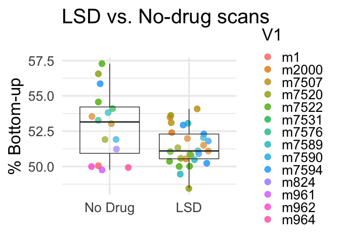
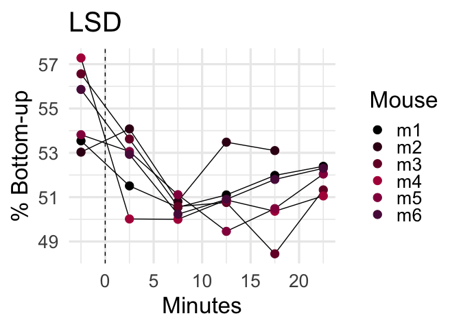

All mouse stats: LSD, Diazepam, Dexmedetomidine
================
2024-05-15

``` r
library(ggplot2)
library(dplyr)
```

    ## 
    ## Attaching package: 'dplyr'

    ## The following objects are masked from 'package:stats':
    ## 
    ##     filter, lag

    ## The following objects are masked from 'package:base':
    ## 
    ##     intersect, setdiff, setequal, union

``` r
library(ggdist)
library(nlme)
```

    ## 
    ## Attaching package: 'nlme'

    ## The following object is masked from 'package:dplyr':
    ## 
    ##     collapse

``` r
# load in average DMN angles
DMNAngs=read.csv('~/Downloads/mice_propsMerged_mice_LSD.csv',header=F)


# Rename the columns for easier reference
colnames(DMNAngs) <- c("V1", paste0("V", 2:ncol(DMNAngs)))

# Reshape the data to long format using base R
DMNAngs_long <- reshape(DMNAngs, 
                        varying = list(names(DMNAngs)[-1]), 
                        v.names = "Value", 
                        timevar = "Timepoint", 
                        times = 2:ncol(DMNAngs), 
                        direction = "long")

# Adjust the timepoint to start from 1
DMNAngs_long$Timepoint <- DMNAngs_long$Timepoint - 1

# Reset row names
rownames(DMNAngs_long) <- NULL

# plot it out
ggplot(DMNAngs_long, aes(x = Timepoint, y = Value, color = V1, group = V1)) +
  geom_line() +
  geom_point(size=4) +
  scale_color_viridis_d(option = "plasma") +
  labs(x = "Timepoint", y = "% Bottom-up", color = "Variable",title='LSD') +
  theme_minimal(base_size=25)+geom_vline(xintercept=1.5,linetype='dashed')
```

    ## Warning: Removed 1 row containing missing values or values outside the scale range
    ## (`geom_line()`).

    ## Warning: Removed 1 row containing missing values or values outside the scale range
    ## (`geom_point()`).

<!-- -->

``` r
# add drug value and test standalone
DMNAngs_long$Drug=1
DMNAngs_long$Drug[DMNAngs_long$Timepoint==1]=0
# remove any NA values
DMNAngs_long=na.omit(DMNAngs_long)

fit_lme <- lme(Value ~ Drug, random = ~ 1 | V1, data = DMNAngs_long)
summary(fit_lme)
```

    ## Linear mixed-effects model fit by REML
    ##   Data: DMNAngs_long 
    ##         AIC       BIC   logLik
    ##   -174.4596 -168.4736 91.22982
    ## 
    ## Random effects:
    ##  Formula: ~1 | V1
    ##          (Intercept)   Residual
    ## StdDev: 5.044927e-07 0.01409907
    ## 
    ## Fixed effects:  Value ~ Drug 
    ##                  Value   Std.Error DF  t-value p-value
    ## (Intercept)  0.5501568 0.005755923 28 95.58099       0
    ## Drug        -0.0362397 0.006323390 28 -5.73106       0
    ##  Correlation: 
    ##      (Intr)
    ## Drug -0.91 
    ## 
    ## Standardized Within-Group Residuals:
    ##        Min         Q1        Med         Q3        Max 
    ## -2.0901756 -0.6856360 -0.2060217  0.6769334  1.9060834 
    ## 
    ## Number of Observations: 35
    ## Number of Groups: 6

``` r
# sep. pre and post
DMNAngs_long$TP=NULL
DMNAngs_long$TP[DMNAngs_long$Timepoint==1]='pre'
DMNAngs_long$TP[DMNAngs_long$Timepoint>1]='LSD'
# reorder it
DMNAngs_long$TP <- factor(DMNAngs_long$TP, levels = c('pre', 'LSD'))

# retain original
DMNAngs_longOG=DMNAngs_long

# save df for eventual merge
DMN_angles_long=DMNAngs_longOG
```

``` r
library(ggplot2)
library(dplyr)
# load in average DMN magnitudes
DMNAngs=read.csv('~/Downloads/mice_magsMerged_mice_LSD.csv',header=F)


# Rename the columns for easier reference
colnames(DMNAngs) <- c("V1", paste0("V", 2:ncol(DMNAngs)))

# Reshape the data to long format using base R
DMNAngs_long <- reshape(DMNAngs, 
                        varying = list(names(DMNAngs)[-1]), 
                        v.names = "Value", 
                        timevar = "Timepoint", 
                        times = 2:ncol(DMNAngs), 
                        direction = "long")

# Adjust the timepoint to start from 1
DMNAngs_long$Timepoint <- DMNAngs_long$Timepoint - 1

# Reset row names
rownames(DMNAngs_long) <- NULL

# plot it out
ggplot(DMNAngs_long, aes(x = Timepoint, y = Value, color = V1, group = V1)) +
  geom_line() +
  geom_point(size=4) +
  scale_color_viridis_d(option = "plasma") +
  labs(x = "Timepoint", y = "Magnitude", color = "Variable",title='LSD') +
  theme_minimal(base_size=25)+geom_vline(xintercept=1.5,linetype='dashed')
```

    ## Warning: Removed 1 row containing missing values or values outside the scale range
    ## (`geom_line()`).

    ## Warning: Removed 1 row containing missing values or values outside the scale range
    ## (`geom_point()`).

<!-- -->

``` r
# add drug value and test standalone
DMNAngs_long$Drug=1
DMNAngs_long$Drug[DMNAngs_long$Timepoint==1]=0
# remove any NA values
DMNAngs_long=na.omit(DMNAngs_long)

fit_lme <- lme(Value ~ Drug, random = ~ 1 | V1, data = DMNAngs_long)
summary(fit_lme)
```

    ## Linear mixed-effects model fit by REML
    ##   Data: DMNAngs_long 
    ##        AIC      BIC    logLik
    ##   7.412891 13.39892 0.2935546
    ## 
    ## Random effects:
    ##  Formula: ~1 | V1
    ##         (Intercept)  Residual
    ## StdDev:   0.1706474 0.1950472
    ## 
    ## Fixed effects:  Value ~ Drug 
    ##                  Value  Std.Error DF   t-value p-value
    ## (Intercept)  2.4312277 0.10580166 28 22.979107       0
    ## Drug        -0.5837643 0.08751149 28 -6.670716       0
    ##  Correlation: 
    ##      (Intr)
    ## Drug -0.685
    ## 
    ## Standardized Within-Group Residuals:
    ##         Min          Q1         Med          Q3         Max 
    ## -2.79123670 -0.63247684  0.04840861  0.58060200  1.70855564 
    ## 
    ## Number of Observations: 35
    ## Number of Groups: 6

``` r
### and make plain figure version without longitudinal lines (Fig 2A)
# sep. pre and post
DMNAngs_long$TP=NULL
DMNAngs_long$TP[DMNAngs_long$Timepoint==1]='pre'
DMNAngs_long$TP[DMNAngs_long$Timepoint>1]='LSD'
# reorder it
DMNAngs_long$TP <- factor(DMNAngs_long$TP, levels = c('pre', 'LSD'))

# save df for eventual merge
DMN_Mags_long=DMNAngs_longOG
```

``` r
# load in average DMN FC
DMNAngs=read.csv('~/Downloads/mice_DMNSeg_Merged_mice_LSD.csv',header=F)

# Rename the columns for easier reference
colnames(DMNAngs) <- c("V1", paste0("V", 2:ncol(DMNAngs)))

# Reshape the data to long format using base R
DMNAngs_long <- reshape(DMNAngs, 
                        varying = list(names(DMNAngs)[-1]), 
                        v.names = "Value", 
                        timevar = "Timepoint", 
                        times = 2:ncol(DMNAngs), 
                        direction = "long")

# Adjust the timepoint to start from 1
DMNAngs_long$Timepoint <- DMNAngs_long$Timepoint - 1

# Reset row names
rownames(DMNAngs_long) <- NULL

# plot it out
ggplot(DMNAngs_long, aes(x = Timepoint, y = Value, color = V1, group = V1)) +
  geom_line() +
  geom_point(size=4) +
  scale_color_viridis_d(option = "plasma") +
  labs(x = "Timepoint", y = "DMN FC", color = "Variable",title='LSD') +
  theme_minimal(base_size=25)+geom_vline(xintercept=1.5,linetype='dashed')
```

    ## Warning: Removed 1 row containing missing values or values outside the scale range
    ## (`geom_line()`).

    ## Warning: Removed 1 row containing missing values or values outside the scale range
    ## (`geom_point()`).

<!-- -->

``` r
# add drug value and test standalone
DMNAngs_long$Drug=1
DMNAngs_long$Drug[DMNAngs_long$Timepoint==1]=0
# remove any NA values
DMNAngs_long=na.omit(DMNAngs_long)

fit_lme <- lme(Value ~ Drug, random = ~ 1 | V1, data = DMNAngs_long)
summary(fit_lme)
```

    ## Linear mixed-effects model fit by REML
    ##   Data: DMNAngs_long 
    ##         AIC       BIC logLik
    ##   -69.54599 -63.55996 38.773
    ## 
    ## Random effects:
    ##  Formula: ~1 | V1
    ##          (Intercept)   Residual
    ## StdDev: 1.602407e-06 0.06911073
    ## 
    ## Fixed effects:  Value ~ Drug 
    ##                  Value  Std.Error DF   t-value p-value
    ## (Intercept)  0.5706452 0.02821434 28 20.225364  0.0000
    ## Drug        -0.0320732 0.03099594 28 -1.034755  0.3096
    ##  Correlation: 
    ##      (Intr)
    ## Drug -0.91 
    ## 
    ## Standardized Within-Group Residuals:
    ##         Min          Q1         Med          Q3         Max 
    ## -2.01896561 -0.76207291  0.06679519  0.76726463  1.68630645 
    ## 
    ## Number of Observations: 35
    ## Number of Groups: 6

``` r
### and make plain figure version without longitudinal lines (Fig 2A)
# sep. pre and post
DMNAngs_long$TP=NULL
DMNAngs_long$TP[DMNAngs_long$Timepoint==1]='pre'
DMNAngs_long$TP[DMNAngs_long$Timepoint>1]='LSD'
# reorder it
DMNAngs_long$TP <- factor(DMNAngs_long$TP, levels = c('pre', 'LSD'))

# retain original
DMNAngs_longOG=DMNAngs_long


# save df for eventual merge
DMN_Segs_long=DMNAngs_longOG
```

``` r
# load in average DMN temporal autocor
DMNAngs=read.csv('~/Downloads/mice_av_AutoCor_Merged_mice_LSD.csv',header=F)


# Rename the columns for easier reference
colnames(DMNAngs) <- c("V1", paste0("V", 2:ncol(DMNAngs)))

# Reshape the data to long format using base R
DMNAngs_long <- reshape(DMNAngs, 
                        varying = list(names(DMNAngs)[-1]), 
                        v.names = "Value", 
                        timevar = "Timepoint", 
                        times = 2:ncol(DMNAngs), 
                        direction = "long")

# Adjust the timepoint to start from 1
DMNAngs_long$Timepoint <- DMNAngs_long$Timepoint - 1

# Reset row names
rownames(DMNAngs_long) <- NULL

# plot it out
ggplot(DMNAngs_long, aes(x = Timepoint, y = Value, color = V1, group = V1)) +
  geom_line() +
  geom_point(size=4) +
  scale_color_viridis_d(option = "plasma") +
  labs(x = "Timepoint", y = "DMN TAutoCor", color = "Variable",title='LSD') +
  theme_minimal(base_size=25)+geom_vline(xintercept=1.5,linetype='dashed')
```

    ## Warning: Removed 1 row containing missing values or values outside the scale range
    ## (`geom_line()`).

    ## Warning: Removed 1 row containing missing values or values outside the scale range
    ## (`geom_point()`).

<!-- -->

``` r
# add drug value and test standalone
DMNAngs_long$Drug=1
DMNAngs_long$Drug[DMNAngs_long$Timepoint==1]=0
# remove any NA values
DMNAngs_long=na.omit(DMNAngs_long)

fit_lme <- lme(Value ~ Drug, random = ~ 1 | V1, data = DMNAngs_long)
summary(fit_lme)
```

    ## Linear mixed-effects model fit by REML
    ##   Data: DMNAngs_long 
    ##        AIC      BIC   logLik
    ##   -107.162 -101.176 57.58102
    ## 
    ## Random effects:
    ##  Formula: ~1 | V1
    ##         (Intercept)  Residual
    ## StdDev:  0.01718593 0.0367268
    ## 
    ## Fixed effects:  Value ~ Drug 
    ##                  Value  Std.Error DF  t-value p-value
    ## (Intercept)  0.6142235 0.01655402 28 37.10418  0.0000
    ## Drug        -0.0399952 0.01647603 28 -2.42747  0.0219
    ##  Correlation: 
    ##      (Intr)
    ## Drug -0.824
    ## 
    ## Standardized Within-Group Residuals:
    ##         Min          Q1         Med          Q3         Max 
    ## -1.90515604 -0.57627085  0.01555121  0.53979863  2.79898743 
    ## 
    ## Number of Observations: 35
    ## Number of Groups: 6

``` r
### and make plain figure version without longitudinal lines (Fig 2A)
# sep. pre and post
DMNAngs_long$TP=NULL
DMNAngs_long$TP[DMNAngs_long$Timepoint==1]='pre'
DMNAngs_long$TP[DMNAngs_long$Timepoint>1]='LSD'
# reorder it

# retain original
DMNAngs_longOG=DMNAngs_long

# save df for eventual merge
DMN_autoCors_long=DMNAngs_longOG
```

``` r
# set column names of organized datafames
colnames(DMN_angles_long)[3]<-'BUP'
colnames(DMN_autoCors_long)[3]<-'TA'
colnames(DMN_Mags_long)[3]<-'Mag'
colnames(DMN_Segs_long)[3]<-'Seg'
# merge 
mergedMice_LSD=merge(DMN_angles_long,DMN_autoCors_long,by=c('V1','Timepoint','id','Drug','TP'))
mergedMice_LSD=merge(mergedMice_LSD,DMN_Mags_long,by=c('V1','Timepoint','id','Drug','TP'))
mergedMice_LSD=merge(mergedMice_LSD,DMN_Segs_long,by=c('V1','Timepoint','id','Drug','TP'))

library(pROC)
```

    ## Type 'citation("pROC")' for a citation.

    ## 
    ## Attaching package: 'pROC'

    ## The following objects are masked from 'package:stats':
    ## 
    ##     cov, smooth, var

``` r
library(plotROC)
```

    ## 
    ## Attaching package: 'plotROC'

    ## The following object is masked from 'package:pROC':
    ## 
    ##     ggroc

``` r
# Fit logistic regression models
model1 <- glm(Drug ~  Seg + TA, data = mergedMice_LSD, family = binomial)
model2 <- glm(Drug ~  Seg + TA+ Mag + BUP, data = mergedMice_LSD, family = binomial)

# Predict probabilities
prob1 <- predict(model1, type = "response")
prob2 <- predict(model2, type = "response")

# Create a combined data frame for all models
df <- data.frame(
  labels = as.numeric(rep(mergedMice_LSD$Drug, 2)),
  predictions = c(prob1, prob2),
  model = factor(rep(c("DMN Correlations","DMN Propagations"), each = nrow(mergedMice_LSD)))
)

# Generate the ROC plot
ggplot(df, aes(m = predictions, d = labels, color = model)) + 
  geom_roc(n.cuts = 0, labels = FALSE) + 
  ylim(0, 1) + ylab('True Positive Rate') +xlab('False Positive Rate')+
  ggtitle("ROC Curves for Classifying LSD") + 
  theme_minimal(base_size=18) + 
  scale_color_manual(values = c("#c12139","#09416b"))+
  geom_abline(intercept = 0, slope = 1, linetype = "dashed", color = "gray")+
  theme(legend.position = "none")
```

<!-- -->

``` r
# Calculate AUC for each model
roc1 <- roc(mergedMice_LSD$Drug, prob1)
```

    ## Setting levels: control = 0, case = 1

    ## Setting direction: controls < cases

``` r
roc2 <- roc(mergedMice_LSD$Drug, prob2)
```

    ## Setting levels: control = 0, case = 1
    ## Setting direction: controls < cases

``` r
# Print AUC values
auc1 <- auc(roc1)
auc2 <- auc(roc2)


print(paste("AUC for DMN Correlations:", auc1))
```

    ## [1] "AUC for DMN Correlations: 0.78735632183908"

``` r
print(paste("AUC for DMN Propagations:", auc2))
```

    ## [1] "AUC for DMN Propagations: 0.96551724137931"

``` r
auc_diff=auc2-auc1
```

``` r
# make equivalent AUC calculations on permuted data

# as in other scripts, commented out for online .md but does run

# initialize AUC difference vectors
#auc_diffs <- rep(NA, 1000)
#
## 1. permute each DMN variable (and FD)
#set.seed(1)
#for (i in 1:1000){
#  print(i)
#  # permute DMNMag
#  mergedMice_LSD$DMNMag_perm <- sample(mergedMice_LSD$Mag)
#  # permute TDProp1
#  mergedMice_LSD$TDProp1_perm <- sample(mergedMice_LSD$BUP)
# 
#  # Fit logistic regression models
#  model1 <- glm(Drug ~ Seg+TA, data = mergedMice_LSD, family = binomial)
#  model2_perm <- glm(Drug ~Seg+TA+TDProp1_perm+DMNMag_perm, data = mergedMice_LSD, family = binomial)
#   
#  # 3. calculate AUC difference between full and reduced models with permuted data
#  roc1 <- roc(mergedMice_LSD$Drug, predict(model1, type = "response"))
#  roc2_perm <- roc(mergedMice_LSD$Drug, predict(model2_perm, type = "response"))
#  
#  # Print AUC values
#  auc1 <- auc(roc1)
#  auc2_perm <-auc(roc2_perm)
#
#  # populate auc_diff vectors
#  # DMN correlations vs. full (permuted props) model
#  auc_diffs[i] <- auc1 - auc2_perm
#}
## 4. Compare true AUC differences to permuted AUC differences
#
#sum(auc_diffs>auc_diff)
# 0 indicates p <0.001
```

``` r
# also figure 3: bootstraps
# great, now let's bootstrap them
# Set the number of bootstrap samples
num_bootstrap_samples <- 1000

# initialize t vectors
td_d<-rep(0,num_bootstrap_samples)
td_fd<-rep(0,num_bootstrap_samples)
ta_d<-rep(0,num_bootstrap_samples)
ta_fd<-rep(0,num_bootstrap_samples)
cx_d<-rep(0,num_bootstrap_samples)
cx_fd<-rep(0,num_bootstrap_samples)
ds_d<-rep(0,num_bootstrap_samples)
ds_fd<-rep(0,num_bootstrap_samples)
dm_d<-rep(0,num_bootstrap_samples)
dm_fd<-rep(0,num_bootstrap_samples)

# bootstrap loops
set.seed(1)
for (i in 1:num_bootstrap_samples){
  # needed to add more constraints so no bootstrap resample has <3 no drug scans
  valid_sample <- FALSE
  while (!valid_sample) {
    # Resample data
    data <- mergedMice_LSD[sample(nrow(mergedMice_LSD), replace = TRUE), ]
    
    # Check conditions
    if (nrow(data[data$Drug == 0, ]) >= 3) {
      valid_sample <- TRUE
    }
  }
  # fit on all models
  td_model <- lme(BUP ~  Drug, random = ~ 1 | V1, data = data)
  ta_model <- lme(TA ~ Drug, random = ~ 1 | V1, data = data)
  ds_model <- lme(Seg ~ Drug, random = ~ 1 | V1, data = data)
  dm_model <- lme(Mag ~ Drug, random = ~ 1 | V1, data = data)
  # get t-values
  td_d[i]=summary(td_model)$tTable[rownames(summary(td_model)$tTable) == "Drug", "t-value"]
  ta_d[i]=summary(ta_model)$tTable[rownames(summary(ta_model)$tTable) == "Drug", "t-value"]
  ds_d[i]=summary(ds_model)$tTable[rownames(summary(ds_model)$tTable) == "Drug", "t-value"]
  dm_d[i]=summary(dm_model)$tTable[rownames(summary(dm_model)$tTable) == "Drug", "t-value"]
}
# convert to dataframes
td_d=data.frame(td_d)
ta_d=data.frame(ta_d)
ds_d=data.frame(ds_d)
dm_d=data.frame(dm_d)

colnames(td_d)='tstat'
colnames(ta_d)='tstat'
colnames(ds_d)='tstat'
colnames(dm_d)='tstat'

# set column names for merging
td_d$Cov='Drug'
ta_d$Cov='Drug'
ds_d$Cov='Drug'
dm_d$Cov='Drug'

td_d$Model='Bottom-up %'
ta_d$Model='AutoCor'
ds_d$Model='Integration'
dm_d$Model='Magnitude'

bootstrap_results_Drug=rbind(td_d,ta_d,ds_d,dm_d)

# Calculate the average t-value for each Model category
average_t_values <- bootstrap_results_Drug %>%
  group_by(Model) %>%
  summarize(avg_t_value = mean(tstat, na.rm = TRUE))

# Reorder the Model factor based on the average t-values
bootstrap_results_Drug$Model <- factor(bootstrap_results_Drug$Model, 
                                     levels = c('Integration','AutoCor','Bottom-up %','Magnitude'))
# add fill column
bootstrap_results_Drug$Fill='DMN Correlatons'
bootstrap_results_Drug$Fill[bootstrap_results_Drug$Model=='Bottom-up %']='DMN Propagations'
bootstrap_results_Drug$Fill[bootstrap_results_Drug$Model=='Magnitude']='DMN Propagations'


# Generate the plot
ggplot(bootstrap_results_Drug, aes(x = Model, y = tstat, fill = Fill)) +
    geom_boxplot(
        width = 0.12,
        # Removing outliers
        outlier.color = NA) +
        scale_fill_manual(values=c("#c12139","#09416b"))+
    stat_dots(
        # Plotting on left side
        side = "left",
        # Adjusting position
        justification = 1.1,
        # Adjust grouping (binning) of observations
        binwidth = 0.08,
        overflow = "compress"
    ) +
    labs(x = "Model", y = "T-Values", title = "Bootstrap T-Values for LSD effect") +
    theme_minimal(base_size = 18) +
    geom_hline(yintercept = 0, linetype = "dashed")+
    # just to prevent extra x-axis expansion
    coord_cartesian(xlim = c(1, length(unique(bootstrap_results_Drug$Model))))+
    theme(legend.position = "none")+ylim(c(-14.5,14.5))
```

<!-- -->

``` r
# let's merge in dex and diaz all into one set to test for any interactions
### LSD ###
# load in average DMN angles
DMNAngsLSD=read.csv('~/Downloads/mice_propsMerged_mice_LSD.csv',header=F)
# Rename the columns for easier reference
colnames(DMNAngsLSD) <- c("V1", paste0("V", 2:ncol(DMNAngsLSD)))
# Reshape the data to long format using base R
DMNAngsLSD_long <- reshape(DMNAngsLSD, 
                        varying = list(names(DMNAngsLSD)[-1]), 
                        v.names = "Value", 
                        timevar = "Timepoint", 
                        times = 2:ncol(DMNAngsLSD), 
                        direction = "long")

# Adjust the timepoint to start from 1
DMNAngsLSD_long$Timepoint <- DMNAngsLSD_long$Timepoint - 1
# add drug value and test standalone
DMNAngsLSD_long$Drug=1
DMNAngsLSD_long$Drug[DMNAngsLSD_long$Timepoint==1]=0
# set drug
DMNAngsLSD_long$WhichDrug='LSD'

### DIAZEPAM ###
# load in average DMN angles
DMNAngsDiaz=read.csv('~/Downloads/mice_propsMerged_mice_Diaz.csv',header=F)
# Rename the columns for easier reference
colnames(DMNAngsDiaz) <- c("V1", paste0("V", 2:ncol(DMNAngsDiaz)))
# Reshape the data to long format using base R
DMNAngsDiaz_long <- reshape(DMNAngsDiaz, 
                        varying = list(names(DMNAngsDiaz)[-1]), 
                        v.names = "Value", 
                        timevar = "Timepoint", 
                        times = 2:ncol(DMNAngsDiaz), 
                        direction = "long")

# Adjust the timepoint to start from 1
DMNAngsDiaz_long$Timepoint <- DMNAngsDiaz_long$Timepoint - 1
# add drug value and test standalone
DMNAngsDiaz_long$Drug=1
DMNAngsDiaz_long$Drug[DMNAngsDiaz_long$Timepoint==1]=0
# set drug
DMNAngsDiaz_long$WhichDrug='Diaz'

### Dexmedetomidine ###
# load in average DMN angles
DMNAngsDex=read.csv('~/Downloads/mice_propsMerged_mice_Dex.csv',header=F)
# Rename the columns for easier reference
colnames(DMNAngsDex) <- c("V1", paste0("V", 2:ncol(DMNAngsDex)))
# Reshape the data to long format using base R
DMNAngsDex_long <- reshape(DMNAngsDex, 
                        varying = list(names(DMNAngsDex)[-1]), 
                        v.names = "Value", 
                        timevar = "Timepoint", 
                        times = 2:ncol(DMNAngsDex), 
                        direction = "long")

# Adjust the timepoint to start from 1
DMNAngsDex_long$Timepoint <- DMNAngsDex_long$Timepoint - 1
# add drug value and test standalone
DMNAngsDex_long$Drug=1
DMNAngsDex_long$Drug[DMNAngsDex_long$Timepoint==1]=0
# set drug
DMNAngsDex_long$WhichDrug='Dex'


# merge 'em all
masterMousedf=rbind(DMNAngsLSD_long,DMNAngsDiaz_long)
# rename mouse col
colnames(masterMousedf)[1]<-'mouse'
# bottom-up percentage col
colnames(masterMousedf)[3]<-'BUP'
# remove NA rows
masterMousedf <- masterMousedf[!is.na(masterMousedf$BUP), ]
# relevel LSD to be reference
masterMousedf$WhichDrug<-as.factor(masterMousedf$WhichDrug)
masterMousedf$Drug<-as.factor(masterMousedf$Drug)
masterMousedf <- within(masterMousedf, WhichDrug <- relevel(WhichDrug, ref = 2))
# mixed effect model
fit_lme <- lme(BUP ~ Drug*WhichDrug, random = ~ 1 | mouse, data = masterMousedf)
summary(fit_lme)
```

    ## Linear mixed-effects model fit by REML
    ##   Data: masterMousedf 
    ##         AIC       BIC   logLik
    ##   -270.3363 -258.7454 141.1682
    ## 
    ## Random effects:
    ##  Formula: ~1 | mouse
    ##         (Intercept)   Residual
    ## StdDev: 0.003270766 0.01354526
    ## 
    ## Fixed effects:  BUP ~ Drug * WhichDrug 
    ##                          Value   Std.Error DF  t-value p-value
    ## (Intercept)          0.5507530 0.005682712 43 96.91728  0.0000
    ## Drug1               -0.0361634 0.006075674 43 -5.95216  0.0000
    ## WhichDrugDiaz       -0.0190838 0.008338099 43 -2.28875  0.0271
    ## Drug1:WhichDrugDiaz  0.0238446 0.009265000 43  2.57362  0.0136
    ##  Correlation: 
    ##                     (Intr) Drug1  WhchDD
    ## Drug1               -0.886              
    ## WhichDrugDiaz       -0.666  0.604       
    ## Drug1:WhichDrugDiaz  0.581 -0.656 -0.871
    ## 
    ## Standardized Within-Group Residuals:
    ##         Min          Q1         Med          Q3         Max 
    ## -1.99710329 -0.67101318 -0.06431281  0.64931552  1.82622153 
    ## 
    ## Number of Observations: 55
    ## Number of Groups: 9

``` r
library(sjPlot)
plot_model(fit_lme,type='int',title='% bottom-up by Drug')
```

<!-- -->

``` r
# plot out distribution of scans
masterMouseAll=rbind(DMNAngsLSD_long,DMNAngsDiaz_long,DMNAngsDex_long)
masterMouseAll$WhichDrug2=NULL
masterMouseAll$WhichDrug2[masterMouseAll$Drug==0]='Baseline'
masterMouseAll$WhichDrug2[masterMouseAll$WhichDrug=='Dex' & masterMouseAll$Drug==1]='Active Controls'
masterMouseAll$WhichDrug2[masterMouseAll$WhichDrug=='Diaz' & masterMouseAll$Drug==1]='Active Controls'
masterMouseAll$WhichDrug2[masterMouseAll$WhichDrug=='LSD' & masterMouseAll$Drug==1]='Psychedelic'

# remove na rows
masterMouseAll=masterMouseAll[!is.na(masterMouseAll$Value),]

# make donut plot
masterMouseAll$Drug<-as.factor(masterMouseAll$WhichDrug2)
donutData<- data.frame(
  Category=levels(masterMouseAll$Drug),
  count=tabulate(masterMouseAll$Drug)
)

# convert labels to be consistent across studies
donutData$Category=c('Active Controls','Baseline','Psychedelic')

# percentages
donutData$frac = donutData$count / sum(donutData$count)

# Compute the cumulative for plotting
donutData$ymax = cumsum(donutData$frac)

# Compute the bottom of each rectangle (plotted as rectangle and coord_polar'ed)
donutData$ymin = c(0, head(donutData$ymax, n=-1))
 
# plot
ggplot(donutData, aes(ymax=ymax, ymin=ymin, xmax=4, xmin=3, fill=Category)) +
     geom_rect() +
     coord_polar(theta="y") + 
     xlim(c(1, 4)) + theme_classic(base_size=28)+theme(
    axis.text = element_blank(),
    axis.ticks = element_blank(),
    axis.line = element_blank()
  )+guides(fill = guide_legend(title = NULL))+scale_fill_manual(values = c("#EF9500","#002642","#840032"))
```

<!-- -->

``` r
### and make a No-drug vs. LSD plot
# remove NA rows
masterMouseAll=masterMouseAll[!is.na(masterMouseAll$Value),]

# sep. pre and post
masterMouseAll$TP=NULL
masterMouseAll$TP[masterMouseAll$Timepoint==1]='No Drug'
masterMouseAll$TP[masterMouseAll$Timepoint>1 & masterMouseAll$WhichDrug=='LSD']='LSD'

# make a drug nodrug DF
masterMouseDnD=masterMouseAll[!is.na(masterMouseAll$TP),]

# model it
fit_lme <- lme(Value ~ Drug, random = ~ 1 | V1, data = masterMouseDnD)

# reorder it
masterMouseDnD$TP <- factor(masterMouseDnD$TP, levels = c('No Drug', 'LSD'))
ggplot(masterMouseDnD, aes(x = TP, y = Value)) +
  geom_jitter(width = 0.25, height = 0, alpha = 0.8,size=4,aes(color=V1)) +  # Jittered points
  geom_boxplot(alpha = 0.2,outlier.shape = NA) +     # Boxplot
  labs(title = "LSD vs. No-drug scans \n",
       x = "",
       y = "% Bottom-up") + scale_x_discrete(labels=c('No Drug','LSD'))+
  theme_minimal(base_size=25)
```

<!-- -->

``` r
# copy in color scheme
library(ggplot2)
library(grDevices)

# Define the extended custom palette function
extended_palette <- colorRampPalette(rev(c("#FFEE00", "#EF9500", "#002642", "#c1004f", "#000000")))

# Generate a palette with the number of unique levels in V1
num_colors <- length(unique(masterMouseAll$V1))
generated_colors <- extended_palette(num_colors)

# get unique mouse names
unique_values <- unique(masterMouseAll$V1)
new_labels <- paste0("m", seq_along(unique_values))
names(new_labels) <- unique_values

# Replace the values in V1 using the new labels
masterMouseAll$V1 <- new_labels[masterMouseAll$V1]

# make a drug nodrug DF
masterMouseDnD=masterMouseAll[!is.na(masterMouseAll$TP),]


# final ordering
masterMouseDnD$TP <- factor(masterMouseDnD$TP, levels = c('No Drug', 'LSD'))
masterMouseDnD$Mice <- factor(masterMouseDnD$V1, levels = new_labels)

# Figure 2, bottom
ggplot(masterMouseDnD, aes(x = TP, y = Value)) +
  geom_jitter(width = 0.25, height = 0, alpha = 0.8, size = 4, aes(color = Mice)) +  # Jittered points
  geom_boxplot(alpha = 0.2, outlier.shape = NA) +     # Boxplot
  labs(title = "LSD vs. No-drug scans \n",
       x = "",
       y = "% Bottom-up") +
  scale_x_discrete(labels = c('No Drug', 'LSD')) +
  scale_color_manual(values = generated_colors) +  # Custom generated color palette
  theme_minimal(base_size = 28)
```

<!-- -->

``` r
# job application version with reduced labels - 350 x 600
ggplot(masterMouseDnD, aes(x = TP, y = Value)) +
  geom_jitter(width = 0.25, height = 0, alpha = 0.8, size = 2, aes(color = Mice)) +  # Jittered points
  geom_boxplot(alpha = 0.2, outlier.shape = NA) +     # Boxplot
  labs(x = "",
       y = "% Bottom-up") +
  scale_x_discrete(labels = c('No Drug', 'LSD')) +
  scale_color_manual(values = generated_colors) +  # Custom generated color palette
  theme_minimal(base_size = 28)+
  theme(legend.position = "none",axis.text.x=element_text(angle=45))
```

<!-- -->

``` r
# plotting against active controls: figure 2: middle
ggplot(masterMouseAll[masterMouseAll$WhichDrug2!='No Drug',], aes(x = WhichDrug, y = Value)) +
  geom_jitter(width = 0.25, height = 0, alpha = 0.8, size = 4, aes(color = V1)) +  # Jittered points
  geom_boxplot(alpha = 0.2, outlier.shape = NA) +     # Boxplot
  labs(title = "LSD vs. Active Control \n",
       x = "",
       y = "% Bottom-up") +
  #scale_x_discrete(labels = c('No Drug', 'LSD')) +
  scale_color_manual(values = generated_colors) +  # Custom generated color palette
  theme_minimal(base_size = 28)
```

<!-- -->

``` r
# model it
actContrDf=masterMouseAll[masterMouseAll$WhichDrug2!='No Drug',]
actContrDf$WhichDrug<-as.factor(actContrDf$WhichDrug)
actContrDf <- within(actContrDf, WhichDrug <- relevel(WhichDrug, ref = 3))

s <- lme(Value ~ WhichDrug, random = ~ 1 | V1, data = actContrDf)
```

``` r
# plot LSD time series
# extract LSD
DMNAngs_long=masterMouseAll[masterMouseAll$WhichDrug=='LSD',]
# create minutes column
DMNAngs_long$Minutes=(DMNAngs_long$Timepoint-1.5)*5
ggplot(DMNAngs_long, aes(x = Minutes, y = Value,  group = V1)) +
  geom_line() +
  geom_point(size=4,aes(color=V1)) +
  scale_color_viridis_d(option = "plasma") +
  labs(x = "Minutes", y = "% Bottom-up", color = "Variable",title='LSD') +
  theme_minimal(base_size=25)+geom_vline(xintercept=0,linetype='dashed')+scale_color_manual(values = generated_colors)
```

    ## Scale for colour is already present.
    ## Adding another scale for colour, which will replace the existing scale.

<!-- -->

``` r
library(ggplot2)
library(viridis)
```

    ## Loading required package: viridisLite

``` r
# Define the extended custom palette function
extended_palette <- colorRampPalette(rev(c("#FFEE00", "#EF9500", "#002642", "#c1004f", "#000000")))

# Generate a palette with the number of unique levels in V1
unique_values <- unique(masterMouseAll$V1)
num_colors <- length(unique_values)
generated_colors <- extended_palette(num_colors)

# Create a named vector for the colors
names(generated_colors) <- unique_values

# Function to plot data
plot_data <- function(data, title) {
  ggplot(data, aes(x = Minutes, y = Value, group = V1)) +
    geom_line() +
    geom_point(size = 4, aes(color = V1)) +
    labs(x = "Minutes", y = "% Bottom-up", color = "Mouse", title = title) +
    theme_minimal(base_size = 25) +
    geom_vline(xintercept = 0, linetype = 'dashed') +
    scale_color_manual(values = generated_colors)
}

# Extract LSD data
DMNAngs_long_LSD <- masterMouseAll[masterMouseAll$WhichDrug == 'LSD',]
# Create minutes column
DMNAngs_long_LSD$Minutes <- (DMNAngs_long_LSD$Timepoint - 1.5) * 5
# Plot LSD data
plot_lsd <- plot_data(DMNAngs_long_LSD, 'LSD')
print(plot_lsd)
```

<!-- -->

``` r
fit_lme <- lme(Value ~ Drug, random = ~ 1 | V1, data = DMNAngs_long_LSD)
summary(fit_lme)
```

    ## Linear mixed-effects model fit by REML
    ##   Data: DMNAngs_long_LSD 
    ##         AIC       BIC   logLik
    ##   -174.4596 -168.4736 91.22982
    ## 
    ## Random effects:
    ##  Formula: ~1 | V1
    ##          (Intercept)   Residual
    ## StdDev: 5.044927e-07 0.01409907
    ## 
    ## Fixed effects:  Value ~ Drug 
    ##                      Value   Std.Error DF  t-value p-value
    ## (Intercept)      0.5501568 0.005755923 28 95.58099       0
    ## DrugPsychedelic -0.0362397 0.006323390 28 -5.73106       0
    ##  Correlation: 
    ##                 (Intr)
    ## DrugPsychedelic -0.91 
    ## 
    ## Standardized Within-Group Residuals:
    ##        Min         Q1        Med         Q3        Max 
    ## -2.0901756 -0.6856360 -0.2060217  0.6769334  1.9060834 
    ## 
    ## Number of Observations: 35
    ## Number of Groups: 6

``` r
# Extract Dex data
DMNAngs_long_Dex <- masterMouseAll[masterMouseAll$WhichDrug == 'Dex',]
# Create minutes column
DMNAngs_long_Dex$Minutes <- (DMNAngs_long_Dex$Timepoint - 1.5) * 5
# Plot Dex data
plot_dex <- plot_data(DMNAngs_long_Dex, 'Dexmedetomidine')
print(plot_dex)
```

<!-- -->

``` r
fit_lme <- lme(Value ~ Drug, random = ~ 1 | V1, data = DMNAngs_long_Dex)
summary(fit_lme)
```

    ## Linear mixed-effects model fit by REML
    ##   Data: DMNAngs_long_Dex 
    ##         AIC       BIC   logLik
    ##   -59.93582 -55.39384 33.96791
    ## 
    ## Random effects:
    ##  Formula: ~1 | V1
    ##         (Intercept)   Residual
    ## StdDev: 9.91705e-07 0.04999079
    ## 
    ## Fixed effects:  Value ~ Drug 
    ##                   Value  Std.Error DF  t-value p-value
    ## (Intercept)   0.5909345 0.01117828 19 52.86453  0.0000
    ## DrugBaseline -0.0890129 0.02499539 19 -3.56117  0.0021
    ##  Correlation: 
    ##              (Intr)
    ## DrugBaseline -0.447
    ## 
    ## Standardized Within-Group Residuals:
    ##         Min          Q1         Med          Q3         Max 
    ## -1.94501953 -0.72949575  0.04760928  0.73740999  1.38472233 
    ## 
    ## Number of Observations: 25
    ## Number of Groups: 5

``` r
# extract Diaz
DMNAngs_long=masterMouseAll[masterMouseAll$WhichDrug=='Diaz',]
# create minutes column
DMNAngs_long$Minutes=(DMNAngs_long$Timepoint-1.5)*5
plot_diaz <- plot_data(DMNAngs_long, 'Diazepam')
print(plot_diaz)
```

<!-- -->

``` r
fit_lme <- lme(Value ~ Drug, random = ~ 1 | V1, data = DMNAngs_long)
summary(fit_lme)
```

    ## Linear mixed-effects model fit by REML
    ##   Data: DMNAngs_long 
    ##         AIC       BIC   logLik
    ##   -96.23952 -92.67804 52.11976
    ## 
    ## Random effects:
    ##  Formula: ~1 | V1
    ##         (Intercept)    Residual
    ## StdDev: 0.009671493 0.009973725
    ## 
    ## Fixed effects:  Value ~ Drug 
    ##                  Value   Std.Error DF  t-value p-value
    ## (Intercept)  0.5192033 0.005033809 14 103.1432  0.0000
    ## DrugBaseline 0.0123188 0.005150409 14   2.3918  0.0314
    ##  Correlation: 
    ##              (Intr)
    ## DrugBaseline -0.256
    ## 
    ## Standardized Within-Group Residuals:
    ##         Min          Q1         Med          Q3         Max 
    ## -1.81523403 -0.58489130  0.07299728  0.54406292  1.51300384 
    ## 
    ## Number of Observations: 20
    ## Number of Groups: 5
