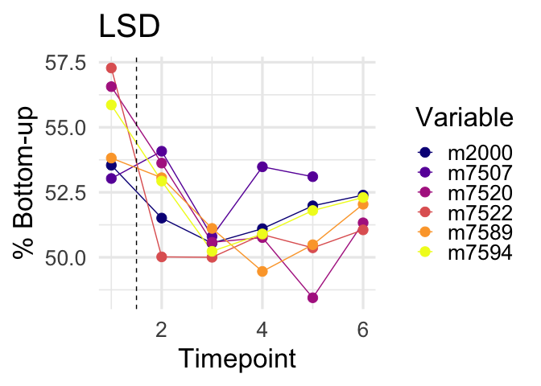
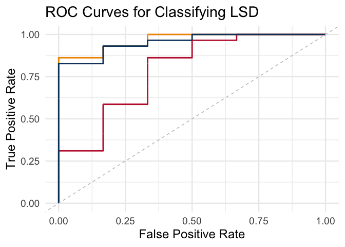
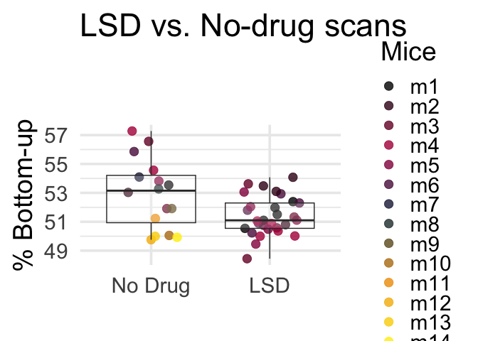

LSD Stats and Visualization: Study 3
================
2024-05-15

``` r
library(ggplot2)
library(dplyr)
```

    ## 
    ## Attaching package: 'dplyr'

    ## The following objects are masked from 'package:stats':
    ## 
    ##     filter, lag

    ## The following objects are masked from 'package:base':
    ## 
    ##     intersect, setdiff, setequal, union

``` r
library(ggdist)
library(nlme)
```

    ## 
    ## Attaching package: 'nlme'

    ## The following object is masked from 'package:dplyr':
    ## 
    ##     collapse

``` r
# load in average DMN angles
DMNAngs=read.csv('~/Downloads/mice_propsMerged_mice_LSD.csv',header=F)


# Rename the columns for easier reference
colnames(DMNAngs) <- c("V1", paste0("V", 2:ncol(DMNAngs)))

# Reshape the data to long format using base R
DMNAngs_long <- reshape(DMNAngs, 
                        varying = list(names(DMNAngs)[-1]), 
                        v.names = "Value", 
                        timevar = "Timepoint", 
                        times = 2:ncol(DMNAngs), 
                        direction = "long")

# Adjust the timepoint to start from 1
DMNAngs_long$Timepoint <- DMNAngs_long$Timepoint - 1

# Reset row names
rownames(DMNAngs_long) <- NULL

# plot it out, * 100 to get it back to percent
ggplot(DMNAngs_long, aes(x = Timepoint, y = Value* 100, color = V1, group = V1)) +
  geom_line() +
  geom_point(size=4) +
  scale_color_viridis_d(option = "plasma") +
  labs(x = "Timepoint", y = "% Bottom-up", color = "Variable",title='LSD') +
  theme_minimal(base_size=25)+geom_vline(xintercept=1.5,linetype='dashed')
```

    ## Warning: Removed 1 row containing missing values or values outside the scale range
    ## (`geom_line()`).

    ## Warning: Removed 1 row containing missing values or values outside the scale range
    ## (`geom_point()`).

<!-- -->

``` r
# add drug value and test standalone
DMNAngs_long$Drug=1
DMNAngs_long$Drug[DMNAngs_long$Timepoint==1]=0
# remove any NA values
DMNAngs_long=na.omit(DMNAngs_long)

fit_lme <- lme(Value ~ Drug, random = ~ 1 | V1, data = DMNAngs_long)
summary(fit_lme)
```

    ## Linear mixed-effects model fit by REML
    ##   Data: DMNAngs_long 
    ##         AIC       BIC   logLik
    ##   -174.4596 -168.4736 91.22982
    ## 
    ## Random effects:
    ##  Formula: ~1 | V1
    ##          (Intercept)   Residual
    ## StdDev: 5.044927e-07 0.01409907
    ## 
    ## Fixed effects:  Value ~ Drug 
    ##                  Value   Std.Error DF  t-value p-value
    ## (Intercept)  0.5501568 0.005755923 28 95.58099       0
    ## Drug        -0.0362397 0.006323390 28 -5.73106       0
    ##  Correlation: 
    ##      (Intr)
    ## Drug -0.91 
    ## 
    ## Standardized Within-Group Residuals:
    ##        Min         Q1        Med         Q3        Max 
    ## -2.0901756 -0.6856360 -0.2060217  0.6769334  1.9060834 
    ## 
    ## Number of Observations: 35
    ## Number of Groups: 6

``` r
# sep. pre and post
DMNAngs_long$TP=NULL
DMNAngs_long$TP[DMNAngs_long$Timepoint==1]='pre'
DMNAngs_long$TP[DMNAngs_long$Timepoint>1]='LSD'
# reorder it
DMNAngs_long$TP <- factor(DMNAngs_long$TP, levels = c('pre', 'LSD'))

# retain original
DMNAngs_longOG=DMNAngs_long

# save df for eventual merge
DMN_angles_long=DMNAngs_longOG
```

``` r
library(ggplot2)
library(dplyr)
# load in average DMN magnitudes
DMNAngs=read.csv('~/Downloads/mice_magsMerged_mice_LSD.csv',header=F)


# Rename the columns for easier reference
colnames(DMNAngs) <- c("V1", paste0("V", 2:ncol(DMNAngs)))

# Reshape the data to long format using base R
DMNAngs_long <- reshape(DMNAngs, 
                        varying = list(names(DMNAngs)[-1]), 
                        v.names = "Value", 
                        timevar = "Timepoint", 
                        times = 2:ncol(DMNAngs), 
                        direction = "long")

# Adjust the timepoint to start from 1
DMNAngs_long$Timepoint <- DMNAngs_long$Timepoint - 1

# Reset row names
rownames(DMNAngs_long) <- NULL

# plot it out
ggplot(DMNAngs_long, aes(x = Timepoint, y = Value, color = V1, group = V1)) +
  geom_line() +
  geom_point(size=4) +
  scale_color_viridis_d(option = "plasma") +
  labs(x = "Timepoint", y = "Magnitude", color = "Variable",title='LSD') +
  theme_minimal(base_size=25)+geom_vline(xintercept=1.5,linetype='dashed')
```

    ## Warning: Removed 1 row containing missing values or values outside the scale range
    ## (`geom_line()`).

    ## Warning: Removed 1 row containing missing values or values outside the scale range
    ## (`geom_point()`).

<!-- -->

``` r
# add drug value and test standalone
DMNAngs_long$Drug=1
DMNAngs_long$Drug[DMNAngs_long$Timepoint==1]=0
# remove any NA values
DMNAngs_long=na.omit(DMNAngs_long)

fit_lme <- lme(Value ~ Drug, random = ~ 1 | V1, data = DMNAngs_long)
summary(fit_lme)
```

    ## Linear mixed-effects model fit by REML
    ##   Data: DMNAngs_long 
    ##        AIC      BIC    logLik
    ##   7.412891 13.39892 0.2935546
    ## 
    ## Random effects:
    ##  Formula: ~1 | V1
    ##         (Intercept)  Residual
    ## StdDev:   0.1706474 0.1950472
    ## 
    ## Fixed effects:  Value ~ Drug 
    ##                  Value  Std.Error DF   t-value p-value
    ## (Intercept)  2.4312277 0.10580166 28 22.979107       0
    ## Drug        -0.5837643 0.08751149 28 -6.670716       0
    ##  Correlation: 
    ##      (Intr)
    ## Drug -0.685
    ## 
    ## Standardized Within-Group Residuals:
    ##         Min          Q1         Med          Q3         Max 
    ## -2.79123670 -0.63247684  0.04840861  0.58060200  1.70855564 
    ## 
    ## Number of Observations: 35
    ## Number of Groups: 6

``` r
### and make plain figure version without longitudinal lines (Fig 2A)
# sep. pre and post
DMNAngs_long$TP=NULL
DMNAngs_long$TP[DMNAngs_long$Timepoint==1]='pre'
DMNAngs_long$TP[DMNAngs_long$Timepoint>1]='LSD'
# reorder it
DMNAngs_long$TP <- factor(DMNAngs_long$TP, levels = c('pre', 'LSD'))

# save df for eventual merge
DMN_Mags_long=DMNAngs_longOG
```

``` r
# load in average DMN FC
DMNAngs=read.csv('~/Downloads/mice_DMNSeg_Merged_mice_LSD.csv',header=F)

# Rename the columns for easier reference
colnames(DMNAngs) <- c("V1", paste0("V", 2:ncol(DMNAngs)))

# Reshape the data to long format using base R
DMNAngs_long <- reshape(DMNAngs, 
                        varying = list(names(DMNAngs)[-1]), 
                        v.names = "Value", 
                        timevar = "Timepoint", 
                        times = 2:ncol(DMNAngs), 
                        direction = "long")

# Adjust the timepoint to start from 1
DMNAngs_long$Timepoint <- DMNAngs_long$Timepoint - 1

# Reset row names
rownames(DMNAngs_long) <- NULL

# plot it out
ggplot(DMNAngs_long, aes(x = Timepoint, y = Value, color = V1, group = V1)) +
  geom_line() +
  geom_point(size=4) +
  scale_color_viridis_d(option = "plasma") +
  labs(x = "Timepoint", y = "DMN FC", color = "Variable",title='LSD') +
  theme_minimal(base_size=25)+geom_vline(xintercept=1.5,linetype='dashed')
```

    ## Warning: Removed 1 row containing missing values or values outside the scale range
    ## (`geom_line()`).

    ## Warning: Removed 1 row containing missing values or values outside the scale range
    ## (`geom_point()`).

<!-- -->

``` r
# add drug value and test standalone
DMNAngs_long$Drug=1
DMNAngs_long$Drug[DMNAngs_long$Timepoint==1]=0
# remove any NA values
DMNAngs_long=na.omit(DMNAngs_long)

fit_lme <- lme(Value ~ Drug, random = ~ 1 | V1, data = DMNAngs_long)
summary(fit_lme)
```

    ## Linear mixed-effects model fit by REML
    ##   Data: DMNAngs_long 
    ##         AIC       BIC logLik
    ##   -69.54599 -63.55996 38.773
    ## 
    ## Random effects:
    ##  Formula: ~1 | V1
    ##          (Intercept)   Residual
    ## StdDev: 1.602407e-06 0.06911073
    ## 
    ## Fixed effects:  Value ~ Drug 
    ##                  Value  Std.Error DF   t-value p-value
    ## (Intercept)  0.5706452 0.02821434 28 20.225364  0.0000
    ## Drug        -0.0320732 0.03099594 28 -1.034755  0.3096
    ##  Correlation: 
    ##      (Intr)
    ## Drug -0.91 
    ## 
    ## Standardized Within-Group Residuals:
    ##         Min          Q1         Med          Q3         Max 
    ## -2.01896561 -0.76207291  0.06679519  0.76726463  1.68630645 
    ## 
    ## Number of Observations: 35
    ## Number of Groups: 6

``` r
### and make plain figure version without longitudinal lines (Fig 2A)
# sep. pre and post
DMNAngs_long$TP=NULL
DMNAngs_long$TP[DMNAngs_long$Timepoint==1]='pre'
DMNAngs_long$TP[DMNAngs_long$Timepoint>1]='LSD'
# reorder it
DMNAngs_long$TP <- factor(DMNAngs_long$TP, levels = c('pre', 'LSD'))

# retain original
DMNAngs_longOG=DMNAngs_long


# save df for eventual merge
DMN_Segs_long=DMNAngs_longOG
```

``` r
# load in average DMN temporal autocor
DMNAngs=read.csv('~/Downloads/mice_av_AutoCor_Merged_mice_LSD.csv',header=F)


# Rename the columns for easier reference
colnames(DMNAngs) <- c("V1", paste0("V", 2:ncol(DMNAngs)))

# Reshape the data to long format using base R
DMNAngs_long <- reshape(DMNAngs, 
                        varying = list(names(DMNAngs)[-1]), 
                        v.names = "Value", 
                        timevar = "Timepoint", 
                        times = 2:ncol(DMNAngs), 
                        direction = "long")

# Adjust the timepoint to start from 1
DMNAngs_long$Timepoint <- DMNAngs_long$Timepoint - 1

# Reset row names
rownames(DMNAngs_long) <- NULL

# plot it out
ggplot(DMNAngs_long, aes(x = Timepoint, y = Value, color = V1, group = V1)) +
  geom_line() +
  geom_point(size=4) +
  scale_color_viridis_d(option = "plasma") +
  labs(x = "Timepoint", y = "DMN TAutoCor", color = "Variable",title='LSD') +
  theme_minimal(base_size=25)+geom_vline(xintercept=1.5,linetype='dashed')
```

    ## Warning: Removed 1 row containing missing values or values outside the scale range
    ## (`geom_line()`).

    ## Warning: Removed 1 row containing missing values or values outside the scale range
    ## (`geom_point()`).

<!-- -->

``` r
# add drug value and test standalone
DMNAngs_long$Drug=1
DMNAngs_long$Drug[DMNAngs_long$Timepoint==1]=0
# remove any NA values
DMNAngs_long=na.omit(DMNAngs_long)

fit_lme <- lme(Value ~ Drug, random = ~ 1 | V1, data = DMNAngs_long)
summary(fit_lme)
```

    ## Linear mixed-effects model fit by REML
    ##   Data: DMNAngs_long 
    ##        AIC      BIC   logLik
    ##   -107.162 -101.176 57.58102
    ## 
    ## Random effects:
    ##  Formula: ~1 | V1
    ##         (Intercept)  Residual
    ## StdDev:  0.01718593 0.0367268
    ## 
    ## Fixed effects:  Value ~ Drug 
    ##                  Value  Std.Error DF  t-value p-value
    ## (Intercept)  0.6142235 0.01655402 28 37.10418  0.0000
    ## Drug        -0.0399952 0.01647603 28 -2.42747  0.0219
    ##  Correlation: 
    ##      (Intr)
    ## Drug -0.824
    ## 
    ## Standardized Within-Group Residuals:
    ##         Min          Q1         Med          Q3         Max 
    ## -1.90515604 -0.57627085  0.01555121  0.53979863  2.79898743 
    ## 
    ## Number of Observations: 35
    ## Number of Groups: 6

``` r
### and make plain figure version without longitudinal lines (Fig 2A)
# sep. pre and post
DMNAngs_long$TP=NULL
DMNAngs_long$TP[DMNAngs_long$Timepoint==1]='pre'
DMNAngs_long$TP[DMNAngs_long$Timepoint>1]='LSD'
# reorder it

# retain original
DMNAngs_longOG=DMNAngs_long

# save df for eventual merge
DMN_autoCors_long=DMNAngs_longOG
```

``` r
# set column names of organized datafames
colnames(DMN_angles_long)[3]<-'BUP'
colnames(DMN_autoCors_long)[3]<-'TA'
colnames(DMN_Mags_long)[3]<-'Mag'
colnames(DMN_Segs_long)[3]<-'Seg'
# merge 
mergedMice_LSD=merge(DMN_angles_long,DMN_autoCors_long,by=c('V1','Timepoint','id','Drug','TP'))
mergedMice_LSD=merge(mergedMice_LSD,DMN_Mags_long,by=c('V1','Timepoint','id','Drug','TP'))
mergedMice_LSD=merge(mergedMice_LSD,DMN_Segs_long,by=c('V1','Timepoint','id','Drug','TP'))

library(pROC)
```

    ## Type 'citation("pROC")' for a citation.

    ## 
    ## Attaching package: 'pROC'

    ## The following objects are masked from 'package:stats':
    ## 
    ##     cov, smooth, var

``` r
library(plotROC)
```

    ## 
    ## Attaching package: 'plotROC'

    ## The following object is masked from 'package:pROC':
    ## 
    ##     ggroc

``` r
# Fit logistic regression models
model1 <- glm(Drug ~  Seg + TA, data = mergedMice_LSD, family = binomial)
model2 <- glm(Drug ~  Seg + TA+ Mag + BUP, data = mergedMice_LSD, family = binomial)
model3 <- glm(Drug ~  Mag + BUP, data = mergedMice_LSD, family = binomial)

# Predict probabilities
prob1 <- predict(model1, type = "response")
prob2 <- predict(model2, type = "response")
prob3 <- predict(model3, type = "response")

# Create a combined data frame for all models
df <- data.frame(
  labels = as.numeric(rep(mergedMice_LSD$Drug, 3)),
  predictions = c(prob1, prob2,prob3),
  model = factor(rep(c("DMN Correlations","+DMN Propagations","DMN Propagations"), each = nrow(mergedMice_LSD)))
)

# Generate the ROC plot
ggplot(df, aes(m = predictions, d = labels, color = model)) + 
  geom_roc(n.cuts = 0, labels = FALSE) + 
  ylim(0, 1) + ylab('True Positive Rate') +xlab('False Positive Rate')+
  ggtitle("ROC Curves for Classifying LSD") + 
  theme_minimal(base_size=18) + 
  scale_color_manual(values = c("#EF9500","#c12139","#09416b"))+
  geom_abline(intercept = 0, slope = 1, linetype = "dashed", color = "gray")+
  theme(legend.position = "none")
```

<!-- -->

``` r
# Calculate AUC for each model
roc1 <- roc(mergedMice_LSD$Drug, prob1)
```

    ## Setting levels: control = 0, case = 1

    ## Setting direction: controls < cases

``` r
roc2 <- roc(mergedMice_LSD$Drug, prob2)
```

    ## Setting levels: control = 0, case = 1
    ## Setting direction: controls < cases

``` r
roc3 <- roc(mergedMice_LSD$Drug, prob3)
```

    ## Setting levels: control = 0, case = 1
    ## Setting direction: controls < cases

``` r
# Print AUC values
auc1 <- auc(roc1)
auc2 <- auc(roc2)
auc3 <- auc(roc3)


print(paste("AUC for DMN Correlations:", auc1))
```

    ## [1] "AUC for DMN Correlations: 0.78735632183908"

``` r
print(paste("AUC for +DMN Propagations:", auc2))
```

    ## [1] "AUC for +DMN Propagations: 0.96551724137931"

``` r
print(paste("AUC for DMN Propagations:", auc3))
```

    ## [1] "AUC for DMN Propagations: 0.954022988505747"

``` r
auc_diff=auc2-auc1
```

``` r
# make equivalent AUC calculations on permuted data

# as in other scripts, commented out for online .md but does run

# initialize AUC difference vectors
auc_diffs <- rep(NA, 1000)

# 1. permute each DMN variable (and FD)
set.seed(1)
for (i in 1:1000){
  print(i)
  # permute DMNMag
  mergedMice_LSD$DMNMag_perm <- sample(mergedMice_LSD$Mag)
  # permute TDProp1
  mergedMice_LSD$TDProp1_perm <- sample(mergedMice_LSD$BUP)
 
  # Fit logistic regression models
  model1 <- glm(Drug ~ Seg+TA, data = mergedMice_LSD, family = binomial)
  model2_perm <- glm(Drug ~Seg+TA+TDProp1_perm+DMNMag_perm, data = mergedMice_LSD, family = binomial)
    
  # 3. calculate AUC difference between full and reduced models with permuted data
  roc1 <- roc(mergedMice_LSD$Drug, predict(model1, type = "response"))
  roc2_perm <- roc(mergedMice_LSD$Drug, predict(model2_perm, type = "response"))
  
  # Print AUC values
  auc1 <- auc(roc1)
  auc2_perm <-auc(roc2_perm)

  # populate auc_diff vectors
  # DMN correlations vs. full (permuted props) model
  auc_diffs[i] <- auc2_perm - auc1
}
```

    ## [1] 1

    ## Setting levels: control = 0, case = 1

    ## Setting direction: controls < cases

    ## Setting levels: control = 0, case = 1

    ## Setting direction: controls < cases

    ## [1] 2

    ## Setting levels: control = 0, case = 1
    ## Setting direction: controls < cases

    ## Setting levels: control = 0, case = 1

    ## Setting direction: controls < cases

    ## [1] 3

    ## Setting levels: control = 0, case = 1
    ## Setting direction: controls < cases

    ## Setting levels: control = 0, case = 1

    ## Setting direction: controls < cases

    ## [1] 4

    ## Setting levels: control = 0, case = 1
    ## Setting direction: controls < cases

    ## Setting levels: control = 0, case = 1

    ## Setting direction: controls < cases

    ## [1] 5

    ## Setting levels: control = 0, case = 1
    ## Setting direction: controls < cases

    ## Setting levels: control = 0, case = 1

    ## Setting direction: controls < cases

    ## [1] 6

    ## Setting levels: control = 0, case = 1
    ## Setting direction: controls < cases

    ## Setting levels: control = 0, case = 1

    ## Setting direction: controls < cases

    ## [1] 7

    ## Setting levels: control = 0, case = 1
    ## Setting direction: controls < cases

    ## Setting levels: control = 0, case = 1

    ## Setting direction: controls < cases

    ## [1] 8

    ## Setting levels: control = 0, case = 1
    ## Setting direction: controls < cases

    ## Setting levels: control = 0, case = 1

    ## Setting direction: controls < cases

    ## [1] 9

    ## Setting levels: control = 0, case = 1
    ## Setting direction: controls < cases

    ## Setting levels: control = 0, case = 1

    ## Setting direction: controls < cases

    ## [1] 10

    ## Setting levels: control = 0, case = 1
    ## Setting direction: controls < cases

    ## Setting levels: control = 0, case = 1

    ## Setting direction: controls < cases

    ## [1] 11

    ## Setting levels: control = 0, case = 1
    ## Setting direction: controls < cases

    ## Setting levels: control = 0, case = 1

    ## Setting direction: controls < cases

    ## [1] 12

    ## Setting levels: control = 0, case = 1
    ## Setting direction: controls < cases

    ## Setting levels: control = 0, case = 1

    ## Setting direction: controls < cases

    ## [1] 13

    ## Setting levels: control = 0, case = 1
    ## Setting direction: controls < cases

    ## Setting levels: control = 0, case = 1

    ## Setting direction: controls < cases

    ## [1] 14

    ## Setting levels: control = 0, case = 1
    ## Setting direction: controls < cases

    ## Setting levels: control = 0, case = 1

    ## Setting direction: controls < cases

    ## [1] 15

    ## Setting levels: control = 0, case = 1
    ## Setting direction: controls < cases

    ## Setting levels: control = 0, case = 1

    ## Setting direction: controls < cases

    ## [1] 16

    ## Setting levels: control = 0, case = 1
    ## Setting direction: controls < cases

    ## Setting levels: control = 0, case = 1

    ## Setting direction: controls < cases

    ## [1] 17

    ## Setting levels: control = 0, case = 1
    ## Setting direction: controls < cases

    ## Setting levels: control = 0, case = 1

    ## Setting direction: controls < cases

    ## [1] 18

    ## Setting levels: control = 0, case = 1
    ## Setting direction: controls < cases

    ## Setting levels: control = 0, case = 1

    ## Setting direction: controls < cases

    ## [1] 19

    ## Setting levels: control = 0, case = 1
    ## Setting direction: controls < cases

    ## Setting levels: control = 0, case = 1

    ## Setting direction: controls < cases

    ## [1] 20

    ## Setting levels: control = 0, case = 1
    ## Setting direction: controls < cases

    ## Setting levels: control = 0, case = 1

    ## Setting direction: controls < cases

    ## [1] 21

    ## Setting levels: control = 0, case = 1
    ## Setting direction: controls < cases

    ## Setting levels: control = 0, case = 1

    ## Setting direction: controls < cases

    ## [1] 22

    ## Setting levels: control = 0, case = 1
    ## Setting direction: controls < cases

    ## Setting levels: control = 0, case = 1

    ## Setting direction: controls < cases

    ## [1] 23

    ## Setting levels: control = 0, case = 1
    ## Setting direction: controls < cases

    ## Setting levels: control = 0, case = 1

    ## Setting direction: controls < cases

    ## [1] 24

    ## Setting levels: control = 0, case = 1
    ## Setting direction: controls < cases

    ## Setting levels: control = 0, case = 1

    ## Setting direction: controls < cases

    ## [1] 25

    ## Setting levels: control = 0, case = 1
    ## Setting direction: controls < cases

    ## Setting levels: control = 0, case = 1

    ## Setting direction: controls < cases

    ## [1] 26

    ## Setting levels: control = 0, case = 1
    ## Setting direction: controls < cases

    ## Setting levels: control = 0, case = 1

    ## Setting direction: controls < cases

    ## [1] 27

    ## Setting levels: control = 0, case = 1
    ## Setting direction: controls < cases

    ## Setting levels: control = 0, case = 1

    ## Setting direction: controls < cases

    ## [1] 28

    ## Setting levels: control = 0, case = 1
    ## Setting direction: controls < cases

    ## Setting levels: control = 0, case = 1

    ## Setting direction: controls < cases

    ## [1] 29

    ## Setting levels: control = 0, case = 1
    ## Setting direction: controls < cases

    ## Setting levels: control = 0, case = 1

    ## Setting direction: controls < cases

    ## [1] 30

    ## Setting levels: control = 0, case = 1
    ## Setting direction: controls < cases

    ## Setting levels: control = 0, case = 1

    ## Setting direction: controls < cases

    ## [1] 31

    ## Setting levels: control = 0, case = 1
    ## Setting direction: controls < cases

    ## Setting levels: control = 0, case = 1

    ## Setting direction: controls < cases

    ## [1] 32

    ## Setting levels: control = 0, case = 1
    ## Setting direction: controls < cases

    ## Setting levels: control = 0, case = 1

    ## Setting direction: controls < cases

    ## [1] 33

    ## Setting levels: control = 0, case = 1
    ## Setting direction: controls < cases

    ## Setting levels: control = 0, case = 1

    ## Setting direction: controls < cases

    ## [1] 34

    ## Setting levels: control = 0, case = 1
    ## Setting direction: controls < cases

    ## Setting levels: control = 0, case = 1

    ## Setting direction: controls < cases

    ## [1] 35

    ## Setting levels: control = 0, case = 1
    ## Setting direction: controls < cases

    ## Setting levels: control = 0, case = 1

    ## Setting direction: controls < cases

    ## [1] 36

    ## Setting levels: control = 0, case = 1
    ## Setting direction: controls < cases

    ## Setting levels: control = 0, case = 1

    ## Setting direction: controls < cases

    ## [1] 37

    ## Setting levels: control = 0, case = 1
    ## Setting direction: controls < cases

    ## Setting levels: control = 0, case = 1

    ## Setting direction: controls < cases

    ## [1] 38

    ## Setting levels: control = 0, case = 1
    ## Setting direction: controls < cases

    ## Setting levels: control = 0, case = 1

    ## Setting direction: controls < cases

    ## [1] 39

    ## Setting levels: control = 0, case = 1
    ## Setting direction: controls < cases

    ## Setting levels: control = 0, case = 1

    ## Setting direction: controls < cases

    ## [1] 40

    ## Setting levels: control = 0, case = 1
    ## Setting direction: controls < cases

    ## Setting levels: control = 0, case = 1

    ## Setting direction: controls < cases

    ## [1] 41

    ## Setting levels: control = 0, case = 1
    ## Setting direction: controls < cases

    ## Setting levels: control = 0, case = 1

    ## Setting direction: controls < cases

    ## [1] 42

    ## Setting levels: control = 0, case = 1
    ## Setting direction: controls < cases

    ## Setting levels: control = 0, case = 1

    ## Setting direction: controls < cases

    ## [1] 43

    ## Setting levels: control = 0, case = 1
    ## Setting direction: controls < cases

    ## Setting levels: control = 0, case = 1

    ## Setting direction: controls < cases

    ## [1] 44

    ## Setting levels: control = 0, case = 1
    ## Setting direction: controls < cases

    ## Setting levels: control = 0, case = 1

    ## Setting direction: controls < cases

    ## [1] 45

    ## Setting levels: control = 0, case = 1
    ## Setting direction: controls < cases

    ## Setting levels: control = 0, case = 1

    ## Setting direction: controls < cases

    ## [1] 46

    ## Setting levels: control = 0, case = 1
    ## Setting direction: controls < cases

    ## Setting levels: control = 0, case = 1

    ## Setting direction: controls < cases

    ## [1] 47

    ## Setting levels: control = 0, case = 1
    ## Setting direction: controls < cases

    ## Setting levels: control = 0, case = 1

    ## Setting direction: controls < cases

    ## [1] 48

    ## Setting levels: control = 0, case = 1
    ## Setting direction: controls < cases

    ## Setting levels: control = 0, case = 1

    ## Setting direction: controls < cases

    ## [1] 49

    ## Setting levels: control = 0, case = 1
    ## Setting direction: controls < cases

    ## Setting levels: control = 0, case = 1

    ## Setting direction: controls < cases

    ## [1] 50

    ## Setting levels: control = 0, case = 1
    ## Setting direction: controls < cases

    ## Setting levels: control = 0, case = 1

    ## Setting direction: controls < cases

    ## [1] 51

    ## Setting levels: control = 0, case = 1
    ## Setting direction: controls < cases

    ## Setting levels: control = 0, case = 1

    ## Setting direction: controls < cases

    ## [1] 52

    ## Setting levels: control = 0, case = 1
    ## Setting direction: controls < cases

    ## Setting levels: control = 0, case = 1

    ## Setting direction: controls < cases

    ## [1] 53

    ## Setting levels: control = 0, case = 1
    ## Setting direction: controls < cases

    ## Setting levels: control = 0, case = 1

    ## Setting direction: controls < cases

    ## [1] 54

    ## Setting levels: control = 0, case = 1
    ## Setting direction: controls < cases

    ## Setting levels: control = 0, case = 1

    ## Setting direction: controls < cases

    ## [1] 55

    ## Setting levels: control = 0, case = 1
    ## Setting direction: controls < cases

    ## Setting levels: control = 0, case = 1

    ## Setting direction: controls < cases

    ## [1] 56

    ## Setting levels: control = 0, case = 1
    ## Setting direction: controls < cases

    ## Setting levels: control = 0, case = 1

    ## Setting direction: controls < cases

    ## [1] 57

    ## Setting levels: control = 0, case = 1
    ## Setting direction: controls < cases

    ## Setting levels: control = 0, case = 1

    ## Setting direction: controls < cases

    ## [1] 58

    ## Setting levels: control = 0, case = 1
    ## Setting direction: controls < cases

    ## Setting levels: control = 0, case = 1

    ## Setting direction: controls < cases

    ## [1] 59

    ## Setting levels: control = 0, case = 1
    ## Setting direction: controls < cases

    ## Setting levels: control = 0, case = 1

    ## Setting direction: controls < cases

    ## [1] 60

    ## Setting levels: control = 0, case = 1
    ## Setting direction: controls < cases

    ## Setting levels: control = 0, case = 1

    ## Setting direction: controls < cases

    ## [1] 61

    ## Setting levels: control = 0, case = 1
    ## Setting direction: controls < cases

    ## Setting levels: control = 0, case = 1

    ## Setting direction: controls < cases

    ## [1] 62

    ## Setting levels: control = 0, case = 1
    ## Setting direction: controls < cases

    ## Setting levels: control = 0, case = 1

    ## Setting direction: controls < cases

    ## [1] 63

    ## Setting levels: control = 0, case = 1
    ## Setting direction: controls < cases

    ## Setting levels: control = 0, case = 1

    ## Setting direction: controls < cases

    ## [1] 64

    ## Setting levels: control = 0, case = 1
    ## Setting direction: controls < cases

    ## Setting levels: control = 0, case = 1

    ## Setting direction: controls < cases

    ## [1] 65

    ## Setting levels: control = 0, case = 1
    ## Setting direction: controls < cases

    ## Setting levels: control = 0, case = 1

    ## Setting direction: controls < cases

    ## [1] 66

    ## Setting levels: control = 0, case = 1
    ## Setting direction: controls < cases

    ## Setting levels: control = 0, case = 1

    ## Setting direction: controls < cases

    ## [1] 67

    ## Setting levels: control = 0, case = 1
    ## Setting direction: controls < cases

    ## Setting levels: control = 0, case = 1

    ## Setting direction: controls < cases

    ## [1] 68

    ## Setting levels: control = 0, case = 1
    ## Setting direction: controls < cases

    ## Setting levels: control = 0, case = 1

    ## Setting direction: controls < cases

    ## [1] 69

    ## Setting levels: control = 0, case = 1
    ## Setting direction: controls < cases

    ## Setting levels: control = 0, case = 1

    ## Setting direction: controls < cases

    ## [1] 70

    ## Setting levels: control = 0, case = 1
    ## Setting direction: controls < cases

    ## Setting levels: control = 0, case = 1

    ## Setting direction: controls < cases

    ## [1] 71

    ## Setting levels: control = 0, case = 1
    ## Setting direction: controls < cases

    ## Setting levels: control = 0, case = 1

    ## Setting direction: controls < cases

    ## [1] 72

    ## Setting levels: control = 0, case = 1
    ## Setting direction: controls < cases

    ## Setting levels: control = 0, case = 1

    ## Setting direction: controls < cases

    ## [1] 73

    ## Setting levels: control = 0, case = 1
    ## Setting direction: controls < cases

    ## Setting levels: control = 0, case = 1

    ## Setting direction: controls < cases

    ## [1] 74

    ## Setting levels: control = 0, case = 1
    ## Setting direction: controls < cases

    ## Setting levels: control = 0, case = 1

    ## Setting direction: controls < cases

    ## [1] 75

    ## Setting levels: control = 0, case = 1
    ## Setting direction: controls < cases

    ## Setting levels: control = 0, case = 1

    ## Setting direction: controls < cases

    ## [1] 76

    ## Setting levels: control = 0, case = 1
    ## Setting direction: controls < cases

    ## Setting levels: control = 0, case = 1

    ## Setting direction: controls < cases

    ## [1] 77

    ## Setting levels: control = 0, case = 1
    ## Setting direction: controls < cases

    ## Setting levels: control = 0, case = 1

    ## Setting direction: controls < cases

    ## [1] 78

    ## Setting levels: control = 0, case = 1
    ## Setting direction: controls < cases

    ## Setting levels: control = 0, case = 1

    ## Setting direction: controls < cases

    ## [1] 79

    ## Setting levels: control = 0, case = 1
    ## Setting direction: controls < cases

    ## Setting levels: control = 0, case = 1

    ## Setting direction: controls < cases

    ## [1] 80

    ## Setting levels: control = 0, case = 1
    ## Setting direction: controls < cases

    ## Setting levels: control = 0, case = 1

    ## Setting direction: controls < cases

    ## [1] 81

    ## Setting levels: control = 0, case = 1
    ## Setting direction: controls < cases

    ## Setting levels: control = 0, case = 1

    ## Setting direction: controls < cases

    ## [1] 82

    ## Setting levels: control = 0, case = 1
    ## Setting direction: controls < cases

    ## Setting levels: control = 0, case = 1

    ## Setting direction: controls < cases

    ## [1] 83

    ## Setting levels: control = 0, case = 1
    ## Setting direction: controls < cases

    ## Setting levels: control = 0, case = 1

    ## Setting direction: controls < cases

    ## [1] 84

    ## Setting levels: control = 0, case = 1
    ## Setting direction: controls < cases

    ## Setting levels: control = 0, case = 1

    ## Setting direction: controls < cases

    ## [1] 85

    ## Setting levels: control = 0, case = 1
    ## Setting direction: controls < cases

    ## Setting levels: control = 0, case = 1

    ## Setting direction: controls < cases

    ## [1] 86

    ## Setting levels: control = 0, case = 1
    ## Setting direction: controls < cases

    ## Setting levels: control = 0, case = 1

    ## Setting direction: controls < cases

    ## [1] 87

    ## Setting levels: control = 0, case = 1
    ## Setting direction: controls < cases

    ## Setting levels: control = 0, case = 1

    ## Setting direction: controls < cases

    ## [1] 88

    ## Setting levels: control = 0, case = 1
    ## Setting direction: controls < cases

    ## Setting levels: control = 0, case = 1

    ## Setting direction: controls < cases

    ## [1] 89

    ## Setting levels: control = 0, case = 1
    ## Setting direction: controls < cases

    ## Setting levels: control = 0, case = 1

    ## Setting direction: controls < cases

    ## [1] 90

    ## Setting levels: control = 0, case = 1
    ## Setting direction: controls < cases

    ## Setting levels: control = 0, case = 1

    ## Setting direction: controls < cases

    ## [1] 91

    ## Setting levels: control = 0, case = 1
    ## Setting direction: controls < cases

    ## Setting levels: control = 0, case = 1

    ## Setting direction: controls < cases

    ## [1] 92

    ## Setting levels: control = 0, case = 1
    ## Setting direction: controls < cases

    ## Setting levels: control = 0, case = 1

    ## Setting direction: controls < cases

    ## [1] 93

    ## Setting levels: control = 0, case = 1
    ## Setting direction: controls < cases

    ## Setting levels: control = 0, case = 1

    ## Setting direction: controls < cases

    ## [1] 94

    ## Setting levels: control = 0, case = 1
    ## Setting direction: controls < cases

    ## Setting levels: control = 0, case = 1

    ## Setting direction: controls < cases

    ## [1] 95

    ## Setting levels: control = 0, case = 1
    ## Setting direction: controls < cases

    ## Setting levels: control = 0, case = 1

    ## Setting direction: controls < cases

    ## [1] 96

    ## Setting levels: control = 0, case = 1
    ## Setting direction: controls < cases

    ## Setting levels: control = 0, case = 1

    ## Setting direction: controls < cases

    ## [1] 97

    ## Setting levels: control = 0, case = 1
    ## Setting direction: controls < cases

    ## Setting levels: control = 0, case = 1

    ## Setting direction: controls < cases

    ## [1] 98

    ## Setting levels: control = 0, case = 1
    ## Setting direction: controls < cases

    ## Setting levels: control = 0, case = 1

    ## Setting direction: controls < cases

    ## [1] 99

    ## Setting levels: control = 0, case = 1
    ## Setting direction: controls < cases

    ## Setting levels: control = 0, case = 1

    ## Setting direction: controls < cases

    ## [1] 100

    ## Setting levels: control = 0, case = 1
    ## Setting direction: controls < cases

    ## Setting levels: control = 0, case = 1

    ## Setting direction: controls < cases

    ## [1] 101

    ## Setting levels: control = 0, case = 1
    ## Setting direction: controls < cases

    ## Setting levels: control = 0, case = 1

    ## Setting direction: controls < cases

    ## [1] 102

    ## Setting levels: control = 0, case = 1
    ## Setting direction: controls < cases

    ## Setting levels: control = 0, case = 1

    ## Setting direction: controls < cases

    ## [1] 103

    ## Setting levels: control = 0, case = 1
    ## Setting direction: controls < cases

    ## Setting levels: control = 0, case = 1

    ## Setting direction: controls < cases

    ## [1] 104

    ## Setting levels: control = 0, case = 1
    ## Setting direction: controls < cases

    ## Setting levels: control = 0, case = 1

    ## Setting direction: controls < cases

    ## [1] 105

    ## Setting levels: control = 0, case = 1
    ## Setting direction: controls < cases

    ## Setting levels: control = 0, case = 1

    ## Setting direction: controls < cases

    ## [1] 106

    ## Setting levels: control = 0, case = 1
    ## Setting direction: controls < cases

    ## Setting levels: control = 0, case = 1

    ## Setting direction: controls < cases

    ## [1] 107

    ## Setting levels: control = 0, case = 1
    ## Setting direction: controls < cases

    ## Setting levels: control = 0, case = 1

    ## Setting direction: controls < cases

    ## [1] 108

    ## Setting levels: control = 0, case = 1
    ## Setting direction: controls < cases

    ## Setting levels: control = 0, case = 1

    ## Setting direction: controls < cases

    ## [1] 109

    ## Setting levels: control = 0, case = 1
    ## Setting direction: controls < cases

    ## Setting levels: control = 0, case = 1

    ## Setting direction: controls < cases

    ## [1] 110

    ## Setting levels: control = 0, case = 1
    ## Setting direction: controls < cases

    ## Setting levels: control = 0, case = 1

    ## Setting direction: controls < cases

    ## [1] 111

    ## Setting levels: control = 0, case = 1
    ## Setting direction: controls < cases

    ## Setting levels: control = 0, case = 1

    ## Setting direction: controls < cases

    ## [1] 112

    ## Setting levels: control = 0, case = 1
    ## Setting direction: controls < cases

    ## Setting levels: control = 0, case = 1

    ## Setting direction: controls < cases

    ## [1] 113

    ## Setting levels: control = 0, case = 1
    ## Setting direction: controls < cases

    ## Setting levels: control = 0, case = 1

    ## Setting direction: controls < cases

    ## [1] 114

    ## Setting levels: control = 0, case = 1
    ## Setting direction: controls < cases

    ## Setting levels: control = 0, case = 1

    ## Setting direction: controls < cases

    ## [1] 115

    ## Setting levels: control = 0, case = 1
    ## Setting direction: controls < cases

    ## Setting levels: control = 0, case = 1

    ## Setting direction: controls < cases

    ## [1] 116

    ## Setting levels: control = 0, case = 1
    ## Setting direction: controls < cases

    ## Setting levels: control = 0, case = 1

    ## Setting direction: controls < cases

    ## [1] 117

    ## Setting levels: control = 0, case = 1
    ## Setting direction: controls < cases

    ## Setting levels: control = 0, case = 1

    ## Setting direction: controls < cases

    ## [1] 118

    ## Setting levels: control = 0, case = 1
    ## Setting direction: controls < cases

    ## Setting levels: control = 0, case = 1

    ## Setting direction: controls < cases

    ## [1] 119

    ## Setting levels: control = 0, case = 1
    ## Setting direction: controls < cases

    ## Setting levels: control = 0, case = 1

    ## Setting direction: controls < cases

    ## [1] 120

    ## Setting levels: control = 0, case = 1
    ## Setting direction: controls < cases

    ## Setting levels: control = 0, case = 1

    ## Setting direction: controls < cases

    ## [1] 121

    ## Setting levels: control = 0, case = 1
    ## Setting direction: controls < cases

    ## Setting levels: control = 0, case = 1

    ## Setting direction: controls < cases

    ## [1] 122

    ## Setting levels: control = 0, case = 1
    ## Setting direction: controls < cases

    ## Setting levels: control = 0, case = 1

    ## Setting direction: controls < cases

    ## [1] 123

    ## Setting levels: control = 0, case = 1
    ## Setting direction: controls < cases

    ## Setting levels: control = 0, case = 1

    ## Setting direction: controls < cases

    ## [1] 124

    ## Setting levels: control = 0, case = 1
    ## Setting direction: controls < cases

    ## Setting levels: control = 0, case = 1

    ## Setting direction: controls < cases

    ## [1] 125

    ## Setting levels: control = 0, case = 1
    ## Setting direction: controls < cases

    ## Setting levels: control = 0, case = 1

    ## Setting direction: controls < cases

    ## [1] 126

    ## Setting levels: control = 0, case = 1
    ## Setting direction: controls < cases

    ## Setting levels: control = 0, case = 1

    ## Setting direction: controls < cases

    ## [1] 127

    ## Setting levels: control = 0, case = 1
    ## Setting direction: controls < cases

    ## Setting levels: control = 0, case = 1

    ## Setting direction: controls < cases

    ## [1] 128

    ## Setting levels: control = 0, case = 1
    ## Setting direction: controls < cases

    ## Setting levels: control = 0, case = 1

    ## Setting direction: controls < cases

    ## [1] 129

    ## Setting levels: control = 0, case = 1
    ## Setting direction: controls < cases

    ## Setting levels: control = 0, case = 1

    ## Setting direction: controls < cases

    ## [1] 130

    ## Setting levels: control = 0, case = 1
    ## Setting direction: controls < cases

    ## Setting levels: control = 0, case = 1

    ## Setting direction: controls < cases

    ## [1] 131

    ## Setting levels: control = 0, case = 1
    ## Setting direction: controls < cases

    ## Setting levels: control = 0, case = 1

    ## Setting direction: controls < cases

    ## [1] 132

    ## Setting levels: control = 0, case = 1
    ## Setting direction: controls < cases

    ## Setting levels: control = 0, case = 1

    ## Setting direction: controls < cases

    ## [1] 133

    ## Setting levels: control = 0, case = 1
    ## Setting direction: controls < cases

    ## Setting levels: control = 0, case = 1

    ## Setting direction: controls < cases

    ## [1] 134

    ## Setting levels: control = 0, case = 1
    ## Setting direction: controls < cases

    ## Setting levels: control = 0, case = 1

    ## Setting direction: controls < cases

    ## [1] 135

    ## Setting levels: control = 0, case = 1
    ## Setting direction: controls < cases

    ## Setting levels: control = 0, case = 1

    ## Setting direction: controls < cases

    ## [1] 136

    ## Setting levels: control = 0, case = 1
    ## Setting direction: controls < cases

    ## Setting levels: control = 0, case = 1

    ## Setting direction: controls < cases

    ## [1] 137

    ## Setting levels: control = 0, case = 1
    ## Setting direction: controls < cases

    ## Setting levels: control = 0, case = 1

    ## Setting direction: controls < cases

    ## [1] 138

    ## Setting levels: control = 0, case = 1
    ## Setting direction: controls < cases

    ## Setting levels: control = 0, case = 1

    ## Setting direction: controls < cases

    ## [1] 139

    ## Setting levels: control = 0, case = 1
    ## Setting direction: controls < cases

    ## Setting levels: control = 0, case = 1

    ## Setting direction: controls < cases

    ## [1] 140

    ## Setting levels: control = 0, case = 1
    ## Setting direction: controls < cases

    ## Setting levels: control = 0, case = 1

    ## Setting direction: controls < cases

    ## [1] 141

    ## Setting levels: control = 0, case = 1
    ## Setting direction: controls < cases

    ## Setting levels: control = 0, case = 1

    ## Setting direction: controls < cases

    ## [1] 142

    ## Setting levels: control = 0, case = 1
    ## Setting direction: controls < cases

    ## Setting levels: control = 0, case = 1

    ## Setting direction: controls < cases

    ## [1] 143

    ## Setting levels: control = 0, case = 1
    ## Setting direction: controls < cases

    ## Setting levels: control = 0, case = 1

    ## Setting direction: controls < cases

    ## [1] 144

    ## Setting levels: control = 0, case = 1
    ## Setting direction: controls < cases

    ## Setting levels: control = 0, case = 1

    ## Setting direction: controls < cases

    ## [1] 145

    ## Setting levels: control = 0, case = 1
    ## Setting direction: controls < cases

    ## Setting levels: control = 0, case = 1

    ## Setting direction: controls < cases

    ## [1] 146

    ## Setting levels: control = 0, case = 1
    ## Setting direction: controls < cases

    ## Setting levels: control = 0, case = 1

    ## Setting direction: controls < cases

    ## [1] 147

    ## Setting levels: control = 0, case = 1
    ## Setting direction: controls < cases

    ## Setting levels: control = 0, case = 1

    ## Setting direction: controls < cases

    ## [1] 148

    ## Setting levels: control = 0, case = 1
    ## Setting direction: controls < cases

    ## Setting levels: control = 0, case = 1

    ## Setting direction: controls < cases

    ## [1] 149

    ## Setting levels: control = 0, case = 1
    ## Setting direction: controls < cases

    ## Setting levels: control = 0, case = 1

    ## Setting direction: controls < cases

    ## [1] 150

    ## Setting levels: control = 0, case = 1
    ## Setting direction: controls < cases

    ## Setting levels: control = 0, case = 1

    ## Setting direction: controls < cases

    ## [1] 151

    ## Setting levels: control = 0, case = 1
    ## Setting direction: controls < cases

    ## Setting levels: control = 0, case = 1

    ## Setting direction: controls < cases

    ## [1] 152

    ## Setting levels: control = 0, case = 1
    ## Setting direction: controls < cases

    ## Setting levels: control = 0, case = 1

    ## Setting direction: controls < cases

    ## [1] 153

    ## Setting levels: control = 0, case = 1
    ## Setting direction: controls < cases

    ## Setting levels: control = 0, case = 1

    ## Setting direction: controls < cases

    ## [1] 154

    ## Setting levels: control = 0, case = 1
    ## Setting direction: controls < cases

    ## Setting levels: control = 0, case = 1

    ## Setting direction: controls < cases

    ## [1] 155

    ## Setting levels: control = 0, case = 1
    ## Setting direction: controls < cases

    ## Setting levels: control = 0, case = 1

    ## Setting direction: controls < cases

    ## [1] 156

    ## Setting levels: control = 0, case = 1
    ## Setting direction: controls < cases

    ## Setting levels: control = 0, case = 1

    ## Setting direction: controls < cases

    ## [1] 157

    ## Setting levels: control = 0, case = 1
    ## Setting direction: controls < cases

    ## Setting levels: control = 0, case = 1

    ## Setting direction: controls < cases

    ## [1] 158

    ## Setting levels: control = 0, case = 1
    ## Setting direction: controls < cases

    ## Setting levels: control = 0, case = 1

    ## Setting direction: controls < cases

    ## [1] 159

    ## Setting levels: control = 0, case = 1
    ## Setting direction: controls < cases

    ## Setting levels: control = 0, case = 1

    ## Setting direction: controls < cases

    ## [1] 160

    ## Setting levels: control = 0, case = 1
    ## Setting direction: controls < cases

    ## Setting levels: control = 0, case = 1

    ## Setting direction: controls < cases

    ## [1] 161

    ## Setting levels: control = 0, case = 1
    ## Setting direction: controls < cases

    ## Setting levels: control = 0, case = 1

    ## Setting direction: controls < cases

    ## [1] 162

    ## Setting levels: control = 0, case = 1
    ## Setting direction: controls < cases

    ## Setting levels: control = 0, case = 1

    ## Setting direction: controls < cases

    ## [1] 163

    ## Setting levels: control = 0, case = 1
    ## Setting direction: controls < cases

    ## Setting levels: control = 0, case = 1

    ## Setting direction: controls < cases

    ## [1] 164

    ## Setting levels: control = 0, case = 1
    ## Setting direction: controls < cases

    ## Setting levels: control = 0, case = 1

    ## Setting direction: controls < cases

    ## [1] 165

    ## Setting levels: control = 0, case = 1
    ## Setting direction: controls < cases

    ## Setting levels: control = 0, case = 1

    ## Setting direction: controls < cases

    ## [1] 166

    ## Setting levels: control = 0, case = 1
    ## Setting direction: controls < cases

    ## Setting levels: control = 0, case = 1

    ## Setting direction: controls < cases

    ## [1] 167

    ## Setting levels: control = 0, case = 1
    ## Setting direction: controls < cases

    ## Setting levels: control = 0, case = 1

    ## Setting direction: controls < cases

    ## [1] 168

    ## Setting levels: control = 0, case = 1
    ## Setting direction: controls < cases

    ## Setting levels: control = 0, case = 1

    ## Setting direction: controls < cases

    ## [1] 169

    ## Setting levels: control = 0, case = 1
    ## Setting direction: controls < cases

    ## Setting levels: control = 0, case = 1

    ## Setting direction: controls < cases

    ## [1] 170

    ## Setting levels: control = 0, case = 1
    ## Setting direction: controls < cases

    ## Setting levels: control = 0, case = 1

    ## Setting direction: controls < cases

    ## [1] 171

    ## Setting levels: control = 0, case = 1
    ## Setting direction: controls < cases

    ## Setting levels: control = 0, case = 1

    ## Setting direction: controls < cases

    ## [1] 172

    ## Setting levels: control = 0, case = 1
    ## Setting direction: controls < cases

    ## Setting levels: control = 0, case = 1

    ## Setting direction: controls < cases

    ## [1] 173

    ## Setting levels: control = 0, case = 1
    ## Setting direction: controls < cases

    ## Setting levels: control = 0, case = 1

    ## Setting direction: controls < cases

    ## [1] 174

    ## Setting levels: control = 0, case = 1
    ## Setting direction: controls < cases

    ## Setting levels: control = 0, case = 1

    ## Setting direction: controls < cases

    ## [1] 175

    ## Setting levels: control = 0, case = 1
    ## Setting direction: controls < cases

    ## Setting levels: control = 0, case = 1

    ## Setting direction: controls < cases

    ## [1] 176

    ## Setting levels: control = 0, case = 1
    ## Setting direction: controls < cases

    ## Setting levels: control = 0, case = 1

    ## Setting direction: controls < cases

    ## [1] 177

    ## Setting levels: control = 0, case = 1
    ## Setting direction: controls < cases

    ## Setting levels: control = 0, case = 1

    ## Setting direction: controls < cases

    ## [1] 178

    ## Setting levels: control = 0, case = 1
    ## Setting direction: controls < cases

    ## Setting levels: control = 0, case = 1

    ## Setting direction: controls < cases

    ## [1] 179

    ## Setting levels: control = 0, case = 1
    ## Setting direction: controls < cases

    ## Setting levels: control = 0, case = 1

    ## Setting direction: controls < cases

    ## [1] 180

    ## Setting levels: control = 0, case = 1
    ## Setting direction: controls < cases

    ## Setting levels: control = 0, case = 1

    ## Setting direction: controls < cases

    ## [1] 181

    ## Setting levels: control = 0, case = 1
    ## Setting direction: controls < cases

    ## Setting levels: control = 0, case = 1

    ## Setting direction: controls < cases

    ## [1] 182

    ## Setting levels: control = 0, case = 1
    ## Setting direction: controls < cases

    ## Setting levels: control = 0, case = 1

    ## Setting direction: controls < cases

    ## [1] 183

    ## Setting levels: control = 0, case = 1
    ## Setting direction: controls < cases

    ## Setting levels: control = 0, case = 1

    ## Setting direction: controls < cases

    ## [1] 184

    ## Setting levels: control = 0, case = 1
    ## Setting direction: controls < cases

    ## Setting levels: control = 0, case = 1

    ## Setting direction: controls < cases

    ## [1] 185

    ## Setting levels: control = 0, case = 1
    ## Setting direction: controls < cases

    ## Setting levels: control = 0, case = 1

    ## Setting direction: controls < cases

    ## [1] 186

    ## Setting levels: control = 0, case = 1
    ## Setting direction: controls < cases

    ## Setting levels: control = 0, case = 1

    ## Setting direction: controls < cases

    ## [1] 187

    ## Setting levels: control = 0, case = 1
    ## Setting direction: controls < cases

    ## Setting levels: control = 0, case = 1

    ## Setting direction: controls < cases

    ## [1] 188

    ## Setting levels: control = 0, case = 1
    ## Setting direction: controls < cases

    ## Setting levels: control = 0, case = 1

    ## Setting direction: controls < cases

    ## [1] 189

    ## Setting levels: control = 0, case = 1
    ## Setting direction: controls < cases

    ## Setting levels: control = 0, case = 1

    ## Setting direction: controls < cases

    ## [1] 190

    ## Setting levels: control = 0, case = 1
    ## Setting direction: controls < cases

    ## Setting levels: control = 0, case = 1

    ## Setting direction: controls < cases

    ## [1] 191

    ## Setting levels: control = 0, case = 1
    ## Setting direction: controls < cases

    ## Setting levels: control = 0, case = 1

    ## Setting direction: controls < cases

    ## [1] 192

    ## Setting levels: control = 0, case = 1
    ## Setting direction: controls < cases

    ## Setting levels: control = 0, case = 1

    ## Setting direction: controls < cases

    ## [1] 193

    ## Setting levels: control = 0, case = 1
    ## Setting direction: controls < cases

    ## Setting levels: control = 0, case = 1

    ## Setting direction: controls < cases

    ## [1] 194

    ## Setting levels: control = 0, case = 1
    ## Setting direction: controls < cases

    ## Setting levels: control = 0, case = 1

    ## Setting direction: controls < cases

    ## [1] 195

    ## Setting levels: control = 0, case = 1
    ## Setting direction: controls < cases

    ## Setting levels: control = 0, case = 1

    ## Setting direction: controls < cases

    ## [1] 196

    ## Setting levels: control = 0, case = 1
    ## Setting direction: controls < cases

    ## Setting levels: control = 0, case = 1

    ## Setting direction: controls < cases

    ## [1] 197

    ## Setting levels: control = 0, case = 1
    ## Setting direction: controls < cases

    ## Setting levels: control = 0, case = 1

    ## Setting direction: controls < cases

    ## [1] 198

    ## Setting levels: control = 0, case = 1
    ## Setting direction: controls < cases

    ## Setting levels: control = 0, case = 1

    ## Setting direction: controls < cases

    ## [1] 199

    ## Setting levels: control = 0, case = 1
    ## Setting direction: controls < cases

    ## Setting levels: control = 0, case = 1

    ## Setting direction: controls < cases

    ## [1] 200

    ## Setting levels: control = 0, case = 1
    ## Setting direction: controls < cases

    ## Setting levels: control = 0, case = 1

    ## Setting direction: controls < cases

    ## [1] 201

    ## Setting levels: control = 0, case = 1
    ## Setting direction: controls < cases

    ## Setting levels: control = 0, case = 1

    ## Setting direction: controls < cases

    ## [1] 202

    ## Setting levels: control = 0, case = 1
    ## Setting direction: controls < cases

    ## Setting levels: control = 0, case = 1

    ## Setting direction: controls < cases

    ## [1] 203

    ## Setting levels: control = 0, case = 1
    ## Setting direction: controls < cases

    ## Setting levels: control = 0, case = 1

    ## Setting direction: controls < cases

    ## [1] 204

    ## Setting levels: control = 0, case = 1
    ## Setting direction: controls < cases

    ## Setting levels: control = 0, case = 1

    ## Setting direction: controls < cases

    ## [1] 205

    ## Setting levels: control = 0, case = 1
    ## Setting direction: controls < cases

    ## Setting levels: control = 0, case = 1

    ## Setting direction: controls < cases

    ## [1] 206

    ## Setting levels: control = 0, case = 1
    ## Setting direction: controls < cases

    ## Setting levels: control = 0, case = 1

    ## Setting direction: controls < cases

    ## [1] 207

    ## Setting levels: control = 0, case = 1
    ## Setting direction: controls < cases

    ## Setting levels: control = 0, case = 1

    ## Setting direction: controls < cases

    ## [1] 208

    ## Setting levels: control = 0, case = 1
    ## Setting direction: controls < cases

    ## Setting levels: control = 0, case = 1

    ## Setting direction: controls < cases

    ## [1] 209

    ## Setting levels: control = 0, case = 1
    ## Setting direction: controls < cases

    ## Setting levels: control = 0, case = 1

    ## Setting direction: controls < cases

    ## [1] 210

    ## Setting levels: control = 0, case = 1
    ## Setting direction: controls < cases

    ## Setting levels: control = 0, case = 1

    ## Setting direction: controls < cases

    ## [1] 211

    ## Setting levels: control = 0, case = 1
    ## Setting direction: controls < cases

    ## Setting levels: control = 0, case = 1

    ## Setting direction: controls < cases

    ## [1] 212

    ## Setting levels: control = 0, case = 1
    ## Setting direction: controls < cases

    ## Setting levels: control = 0, case = 1

    ## Setting direction: controls < cases

    ## [1] 213

    ## Setting levels: control = 0, case = 1
    ## Setting direction: controls < cases

    ## Setting levels: control = 0, case = 1

    ## Setting direction: controls < cases

    ## [1] 214

    ## Setting levels: control = 0, case = 1
    ## Setting direction: controls < cases

    ## Setting levels: control = 0, case = 1

    ## Setting direction: controls < cases

    ## [1] 215

    ## Setting levels: control = 0, case = 1
    ## Setting direction: controls < cases

    ## Setting levels: control = 0, case = 1

    ## Setting direction: controls < cases

    ## [1] 216

    ## Setting levels: control = 0, case = 1
    ## Setting direction: controls < cases

    ## Setting levels: control = 0, case = 1

    ## Setting direction: controls < cases

    ## [1] 217

    ## Setting levels: control = 0, case = 1
    ## Setting direction: controls < cases

    ## Setting levels: control = 0, case = 1

    ## Setting direction: controls < cases

    ## [1] 218

    ## Setting levels: control = 0, case = 1
    ## Setting direction: controls < cases

    ## Setting levels: control = 0, case = 1

    ## Setting direction: controls < cases

    ## [1] 219

    ## Setting levels: control = 0, case = 1
    ## Setting direction: controls < cases

    ## Setting levels: control = 0, case = 1

    ## Setting direction: controls < cases

    ## [1] 220

    ## Setting levels: control = 0, case = 1
    ## Setting direction: controls < cases

    ## Setting levels: control = 0, case = 1

    ## Setting direction: controls < cases

    ## [1] 221

    ## Setting levels: control = 0, case = 1
    ## Setting direction: controls < cases

    ## Setting levels: control = 0, case = 1

    ## Setting direction: controls < cases

    ## [1] 222

    ## Setting levels: control = 0, case = 1
    ## Setting direction: controls < cases

    ## Setting levels: control = 0, case = 1

    ## Setting direction: controls < cases

    ## [1] 223

    ## Setting levels: control = 0, case = 1
    ## Setting direction: controls < cases

    ## Setting levels: control = 0, case = 1

    ## Setting direction: controls < cases

    ## [1] 224

    ## Setting levels: control = 0, case = 1
    ## Setting direction: controls < cases

    ## Setting levels: control = 0, case = 1

    ## Setting direction: controls < cases

    ## [1] 225

    ## Setting levels: control = 0, case = 1
    ## Setting direction: controls < cases

    ## Setting levels: control = 0, case = 1

    ## Setting direction: controls < cases

    ## [1] 226

    ## Setting levels: control = 0, case = 1
    ## Setting direction: controls < cases

    ## Setting levels: control = 0, case = 1

    ## Setting direction: controls < cases

    ## [1] 227

    ## Setting levels: control = 0, case = 1
    ## Setting direction: controls < cases

    ## Setting levels: control = 0, case = 1

    ## Setting direction: controls < cases

    ## [1] 228

    ## Setting levels: control = 0, case = 1
    ## Setting direction: controls < cases

    ## Setting levels: control = 0, case = 1

    ## Setting direction: controls < cases

    ## [1] 229

    ## Setting levels: control = 0, case = 1
    ## Setting direction: controls < cases

    ## Setting levels: control = 0, case = 1

    ## Setting direction: controls < cases

    ## [1] 230

    ## Setting levels: control = 0, case = 1
    ## Setting direction: controls < cases

    ## Setting levels: control = 0, case = 1

    ## Setting direction: controls < cases

    ## [1] 231

    ## Setting levels: control = 0, case = 1
    ## Setting direction: controls < cases

    ## Setting levels: control = 0, case = 1

    ## Setting direction: controls < cases

    ## [1] 232

    ## Setting levels: control = 0, case = 1
    ## Setting direction: controls < cases

    ## Setting levels: control = 0, case = 1

    ## Setting direction: controls < cases

    ## [1] 233

    ## Setting levels: control = 0, case = 1
    ## Setting direction: controls < cases

    ## Setting levels: control = 0, case = 1

    ## Setting direction: controls < cases

    ## [1] 234

    ## Setting levels: control = 0, case = 1
    ## Setting direction: controls < cases

    ## Setting levels: control = 0, case = 1

    ## Setting direction: controls < cases

    ## [1] 235

    ## Setting levels: control = 0, case = 1
    ## Setting direction: controls < cases

    ## Setting levels: control = 0, case = 1

    ## Setting direction: controls < cases

    ## [1] 236

    ## Setting levels: control = 0, case = 1
    ## Setting direction: controls < cases

    ## Setting levels: control = 0, case = 1

    ## Setting direction: controls < cases

    ## [1] 237

    ## Setting levels: control = 0, case = 1
    ## Setting direction: controls < cases

    ## Setting levels: control = 0, case = 1

    ## Setting direction: controls < cases

    ## [1] 238

    ## Setting levels: control = 0, case = 1
    ## Setting direction: controls < cases

    ## Setting levels: control = 0, case = 1

    ## Setting direction: controls < cases

    ## [1] 239

    ## Setting levels: control = 0, case = 1
    ## Setting direction: controls < cases

    ## Setting levels: control = 0, case = 1

    ## Setting direction: controls < cases

    ## [1] 240

    ## Setting levels: control = 0, case = 1
    ## Setting direction: controls < cases

    ## Setting levels: control = 0, case = 1

    ## Setting direction: controls < cases

    ## [1] 241

    ## Setting levels: control = 0, case = 1
    ## Setting direction: controls < cases

    ## Setting levels: control = 0, case = 1

    ## Setting direction: controls < cases

    ## [1] 242

    ## Setting levels: control = 0, case = 1
    ## Setting direction: controls < cases

    ## Setting levels: control = 0, case = 1

    ## Setting direction: controls < cases

    ## [1] 243

    ## Setting levels: control = 0, case = 1
    ## Setting direction: controls < cases

    ## Setting levels: control = 0, case = 1

    ## Setting direction: controls < cases

    ## [1] 244

    ## Setting levels: control = 0, case = 1
    ## Setting direction: controls < cases

    ## Setting levels: control = 0, case = 1

    ## Setting direction: controls < cases

    ## [1] 245

    ## Setting levels: control = 0, case = 1
    ## Setting direction: controls < cases

    ## Setting levels: control = 0, case = 1

    ## Setting direction: controls < cases

    ## [1] 246

    ## Setting levels: control = 0, case = 1
    ## Setting direction: controls < cases

    ## Setting levels: control = 0, case = 1

    ## Setting direction: controls < cases

    ## [1] 247

    ## Setting levels: control = 0, case = 1
    ## Setting direction: controls < cases

    ## Setting levels: control = 0, case = 1

    ## Setting direction: controls < cases

    ## [1] 248

    ## Setting levels: control = 0, case = 1
    ## Setting direction: controls < cases

    ## Setting levels: control = 0, case = 1

    ## Setting direction: controls < cases

    ## [1] 249

    ## Setting levels: control = 0, case = 1
    ## Setting direction: controls < cases

    ## Setting levels: control = 0, case = 1

    ## Setting direction: controls < cases

    ## [1] 250

    ## Setting levels: control = 0, case = 1
    ## Setting direction: controls < cases

    ## Setting levels: control = 0, case = 1

    ## Setting direction: controls < cases

    ## [1] 251

    ## Setting levels: control = 0, case = 1
    ## Setting direction: controls < cases

    ## Setting levels: control = 0, case = 1

    ## Setting direction: controls < cases

    ## [1] 252

    ## Setting levels: control = 0, case = 1
    ## Setting direction: controls < cases

    ## Setting levels: control = 0, case = 1

    ## Setting direction: controls < cases

    ## [1] 253

    ## Setting levels: control = 0, case = 1
    ## Setting direction: controls < cases

    ## Setting levels: control = 0, case = 1

    ## Setting direction: controls < cases

    ## [1] 254

    ## Setting levels: control = 0, case = 1
    ## Setting direction: controls < cases

    ## Setting levels: control = 0, case = 1

    ## Setting direction: controls < cases

    ## [1] 255

    ## Setting levels: control = 0, case = 1
    ## Setting direction: controls < cases

    ## Setting levels: control = 0, case = 1

    ## Setting direction: controls < cases

    ## [1] 256

    ## Setting levels: control = 0, case = 1
    ## Setting direction: controls < cases

    ## Setting levels: control = 0, case = 1

    ## Setting direction: controls < cases

    ## [1] 257

    ## Setting levels: control = 0, case = 1
    ## Setting direction: controls < cases

    ## Setting levels: control = 0, case = 1

    ## Setting direction: controls < cases

    ## [1] 258

    ## Setting levels: control = 0, case = 1
    ## Setting direction: controls < cases

    ## Setting levels: control = 0, case = 1

    ## Setting direction: controls < cases

    ## [1] 259

    ## Setting levels: control = 0, case = 1
    ## Setting direction: controls < cases

    ## Setting levels: control = 0, case = 1

    ## Setting direction: controls < cases

    ## [1] 260

    ## Setting levels: control = 0, case = 1
    ## Setting direction: controls < cases

    ## Setting levels: control = 0, case = 1

    ## Setting direction: controls < cases

    ## [1] 261

    ## Setting levels: control = 0, case = 1
    ## Setting direction: controls < cases

    ## Setting levels: control = 0, case = 1

    ## Setting direction: controls < cases

    ## [1] 262

    ## Setting levels: control = 0, case = 1
    ## Setting direction: controls < cases

    ## Setting levels: control = 0, case = 1

    ## Setting direction: controls < cases

    ## [1] 263

    ## Setting levels: control = 0, case = 1
    ## Setting direction: controls < cases

    ## Setting levels: control = 0, case = 1

    ## Setting direction: controls < cases

    ## [1] 264

    ## Setting levels: control = 0, case = 1
    ## Setting direction: controls < cases

    ## Setting levels: control = 0, case = 1

    ## Setting direction: controls < cases

    ## [1] 265

    ## Setting levels: control = 0, case = 1
    ## Setting direction: controls < cases

    ## Setting levels: control = 0, case = 1

    ## Setting direction: controls < cases

    ## [1] 266

    ## Setting levels: control = 0, case = 1
    ## Setting direction: controls < cases

    ## Setting levels: control = 0, case = 1

    ## Setting direction: controls < cases

    ## [1] 267

    ## Setting levels: control = 0, case = 1
    ## Setting direction: controls < cases

    ## Setting levels: control = 0, case = 1

    ## Setting direction: controls < cases

    ## [1] 268

    ## Setting levels: control = 0, case = 1
    ## Setting direction: controls < cases

    ## Setting levels: control = 0, case = 1

    ## Setting direction: controls < cases

    ## [1] 269

    ## Setting levels: control = 0, case = 1
    ## Setting direction: controls < cases

    ## Setting levels: control = 0, case = 1

    ## Setting direction: controls < cases

    ## [1] 270

    ## Setting levels: control = 0, case = 1
    ## Setting direction: controls < cases

    ## Setting levels: control = 0, case = 1

    ## Setting direction: controls < cases

    ## [1] 271

    ## Setting levels: control = 0, case = 1
    ## Setting direction: controls < cases

    ## Setting levels: control = 0, case = 1

    ## Setting direction: controls < cases

    ## [1] 272

    ## Setting levels: control = 0, case = 1
    ## Setting direction: controls < cases

    ## Setting levels: control = 0, case = 1

    ## Setting direction: controls < cases

    ## [1] 273

    ## Setting levels: control = 0, case = 1
    ## Setting direction: controls < cases

    ## Setting levels: control = 0, case = 1

    ## Setting direction: controls < cases

    ## [1] 274

    ## Setting levels: control = 0, case = 1
    ## Setting direction: controls < cases

    ## Setting levels: control = 0, case = 1

    ## Setting direction: controls < cases

    ## [1] 275

    ## Setting levels: control = 0, case = 1
    ## Setting direction: controls < cases

    ## Setting levels: control = 0, case = 1

    ## Setting direction: controls < cases

    ## [1] 276

    ## Setting levels: control = 0, case = 1
    ## Setting direction: controls < cases

    ## Setting levels: control = 0, case = 1

    ## Setting direction: controls < cases

    ## [1] 277

    ## Setting levels: control = 0, case = 1
    ## Setting direction: controls < cases

    ## Setting levels: control = 0, case = 1

    ## Setting direction: controls < cases

    ## [1] 278

    ## Setting levels: control = 0, case = 1
    ## Setting direction: controls < cases

    ## Setting levels: control = 0, case = 1

    ## Setting direction: controls < cases

    ## [1] 279

    ## Setting levels: control = 0, case = 1
    ## Setting direction: controls < cases

    ## Setting levels: control = 0, case = 1

    ## Setting direction: controls < cases

    ## [1] 280

    ## Setting levels: control = 0, case = 1
    ## Setting direction: controls < cases

    ## Setting levels: control = 0, case = 1

    ## Setting direction: controls < cases

    ## [1] 281

    ## Setting levels: control = 0, case = 1
    ## Setting direction: controls < cases

    ## Setting levels: control = 0, case = 1

    ## Setting direction: controls < cases

    ## [1] 282

    ## Setting levels: control = 0, case = 1
    ## Setting direction: controls < cases

    ## Setting levels: control = 0, case = 1

    ## Setting direction: controls < cases

    ## [1] 283

    ## Setting levels: control = 0, case = 1
    ## Setting direction: controls < cases

    ## Setting levels: control = 0, case = 1

    ## Setting direction: controls < cases

    ## [1] 284

    ## Setting levels: control = 0, case = 1
    ## Setting direction: controls < cases

    ## Setting levels: control = 0, case = 1

    ## Setting direction: controls < cases

    ## [1] 285

    ## Setting levels: control = 0, case = 1
    ## Setting direction: controls < cases

    ## Setting levels: control = 0, case = 1

    ## Setting direction: controls < cases

    ## [1] 286

    ## Setting levels: control = 0, case = 1
    ## Setting direction: controls < cases

    ## Setting levels: control = 0, case = 1

    ## Setting direction: controls < cases

    ## [1] 287

    ## Setting levels: control = 0, case = 1
    ## Setting direction: controls < cases

    ## Setting levels: control = 0, case = 1

    ## Setting direction: controls < cases

    ## [1] 288

    ## Setting levels: control = 0, case = 1
    ## Setting direction: controls < cases

    ## Setting levels: control = 0, case = 1

    ## Setting direction: controls < cases

    ## [1] 289

    ## Setting levels: control = 0, case = 1
    ## Setting direction: controls < cases

    ## Setting levels: control = 0, case = 1

    ## Setting direction: controls < cases

    ## [1] 290

    ## Setting levels: control = 0, case = 1
    ## Setting direction: controls < cases

    ## Setting levels: control = 0, case = 1

    ## Setting direction: controls < cases

    ## [1] 291

    ## Setting levels: control = 0, case = 1
    ## Setting direction: controls < cases

    ## Setting levels: control = 0, case = 1

    ## Setting direction: controls < cases

    ## [1] 292

    ## Setting levels: control = 0, case = 1
    ## Setting direction: controls < cases

    ## Setting levels: control = 0, case = 1

    ## Setting direction: controls < cases

    ## [1] 293

    ## Setting levels: control = 0, case = 1
    ## Setting direction: controls < cases

    ## Setting levels: control = 0, case = 1

    ## Setting direction: controls < cases

    ## [1] 294

    ## Setting levels: control = 0, case = 1
    ## Setting direction: controls < cases

    ## Setting levels: control = 0, case = 1

    ## Setting direction: controls < cases

    ## [1] 295

    ## Setting levels: control = 0, case = 1
    ## Setting direction: controls < cases

    ## Setting levels: control = 0, case = 1

    ## Setting direction: controls < cases

    ## [1] 296

    ## Setting levels: control = 0, case = 1
    ## Setting direction: controls < cases

    ## Setting levels: control = 0, case = 1

    ## Setting direction: controls < cases

    ## [1] 297

    ## Setting levels: control = 0, case = 1
    ## Setting direction: controls < cases

    ## Setting levels: control = 0, case = 1

    ## Setting direction: controls < cases

    ## [1] 298

    ## Setting levels: control = 0, case = 1
    ## Setting direction: controls < cases

    ## Setting levels: control = 0, case = 1

    ## Setting direction: controls < cases

    ## [1] 299

    ## Setting levels: control = 0, case = 1
    ## Setting direction: controls < cases

    ## Setting levels: control = 0, case = 1

    ## Setting direction: controls < cases

    ## [1] 300

    ## Setting levels: control = 0, case = 1
    ## Setting direction: controls < cases

    ## Setting levels: control = 0, case = 1

    ## Setting direction: controls < cases

    ## [1] 301

    ## Setting levels: control = 0, case = 1
    ## Setting direction: controls < cases

    ## Setting levels: control = 0, case = 1

    ## Setting direction: controls < cases

    ## [1] 302

    ## Setting levels: control = 0, case = 1
    ## Setting direction: controls < cases

    ## Setting levels: control = 0, case = 1

    ## Setting direction: controls < cases

    ## [1] 303

    ## Setting levels: control = 0, case = 1
    ## Setting direction: controls < cases

    ## Setting levels: control = 0, case = 1

    ## Setting direction: controls < cases

    ## [1] 304

    ## Setting levels: control = 0, case = 1
    ## Setting direction: controls < cases

    ## Setting levels: control = 0, case = 1

    ## Setting direction: controls < cases

    ## [1] 305

    ## Setting levels: control = 0, case = 1
    ## Setting direction: controls < cases

    ## Setting levels: control = 0, case = 1

    ## Setting direction: controls < cases

    ## [1] 306

    ## Setting levels: control = 0, case = 1
    ## Setting direction: controls < cases

    ## Setting levels: control = 0, case = 1

    ## Setting direction: controls < cases

    ## [1] 307

    ## Setting levels: control = 0, case = 1
    ## Setting direction: controls < cases

    ## Setting levels: control = 0, case = 1

    ## Setting direction: controls < cases

    ## [1] 308

    ## Setting levels: control = 0, case = 1
    ## Setting direction: controls < cases

    ## Setting levels: control = 0, case = 1

    ## Setting direction: controls < cases

    ## [1] 309

    ## Setting levels: control = 0, case = 1
    ## Setting direction: controls < cases

    ## Setting levels: control = 0, case = 1

    ## Setting direction: controls < cases

    ## [1] 310

    ## Setting levels: control = 0, case = 1
    ## Setting direction: controls < cases

    ## Setting levels: control = 0, case = 1

    ## Setting direction: controls < cases

    ## [1] 311

    ## Setting levels: control = 0, case = 1
    ## Setting direction: controls < cases

    ## Setting levels: control = 0, case = 1

    ## Setting direction: controls < cases

    ## [1] 312

    ## Setting levels: control = 0, case = 1
    ## Setting direction: controls < cases

    ## Setting levels: control = 0, case = 1

    ## Setting direction: controls < cases

    ## [1] 313

    ## Setting levels: control = 0, case = 1
    ## Setting direction: controls < cases

    ## Setting levels: control = 0, case = 1

    ## Setting direction: controls < cases

    ## [1] 314

    ## Setting levels: control = 0, case = 1
    ## Setting direction: controls < cases

    ## Setting levels: control = 0, case = 1

    ## Setting direction: controls < cases

    ## [1] 315

    ## Setting levels: control = 0, case = 1
    ## Setting direction: controls < cases

    ## Setting levels: control = 0, case = 1

    ## Setting direction: controls < cases

    ## [1] 316

    ## Setting levels: control = 0, case = 1
    ## Setting direction: controls < cases

    ## Setting levels: control = 0, case = 1

    ## Setting direction: controls < cases

    ## [1] 317

    ## Setting levels: control = 0, case = 1
    ## Setting direction: controls < cases

    ## Setting levels: control = 0, case = 1

    ## Setting direction: controls < cases

    ## [1] 318

    ## Setting levels: control = 0, case = 1
    ## Setting direction: controls < cases

    ## Setting levels: control = 0, case = 1

    ## Setting direction: controls < cases

    ## [1] 319

    ## Setting levels: control = 0, case = 1
    ## Setting direction: controls < cases

    ## Setting levels: control = 0, case = 1

    ## Setting direction: controls < cases

    ## [1] 320

    ## Setting levels: control = 0, case = 1
    ## Setting direction: controls < cases

    ## Setting levels: control = 0, case = 1

    ## Setting direction: controls < cases

    ## [1] 321

    ## Setting levels: control = 0, case = 1
    ## Setting direction: controls < cases

    ## Setting levels: control = 0, case = 1

    ## Setting direction: controls < cases

    ## [1] 322

    ## Setting levels: control = 0, case = 1
    ## Setting direction: controls < cases

    ## Setting levels: control = 0, case = 1

    ## Setting direction: controls < cases

    ## [1] 323

    ## Setting levels: control = 0, case = 1
    ## Setting direction: controls < cases

    ## Setting levels: control = 0, case = 1

    ## Setting direction: controls < cases

    ## [1] 324

    ## Setting levels: control = 0, case = 1
    ## Setting direction: controls < cases

    ## Setting levels: control = 0, case = 1

    ## Setting direction: controls < cases

    ## [1] 325

    ## Setting levels: control = 0, case = 1
    ## Setting direction: controls < cases

    ## Setting levels: control = 0, case = 1

    ## Setting direction: controls < cases

    ## [1] 326

    ## Setting levels: control = 0, case = 1
    ## Setting direction: controls < cases

    ## Setting levels: control = 0, case = 1

    ## Setting direction: controls < cases

    ## [1] 327

    ## Setting levels: control = 0, case = 1
    ## Setting direction: controls < cases

    ## Setting levels: control = 0, case = 1

    ## Setting direction: controls < cases

    ## [1] 328

    ## Setting levels: control = 0, case = 1
    ## Setting direction: controls < cases

    ## Setting levels: control = 0, case = 1

    ## Setting direction: controls < cases

    ## [1] 329

    ## Setting levels: control = 0, case = 1
    ## Setting direction: controls < cases

    ## Setting levels: control = 0, case = 1

    ## Setting direction: controls < cases

    ## [1] 330

    ## Setting levels: control = 0, case = 1
    ## Setting direction: controls < cases

    ## Setting levels: control = 0, case = 1

    ## Setting direction: controls < cases

    ## [1] 331

    ## Setting levels: control = 0, case = 1
    ## Setting direction: controls < cases

    ## Setting levels: control = 0, case = 1

    ## Setting direction: controls < cases

    ## [1] 332

    ## Setting levels: control = 0, case = 1
    ## Setting direction: controls < cases

    ## Setting levels: control = 0, case = 1

    ## Setting direction: controls < cases

    ## [1] 333

    ## Setting levels: control = 0, case = 1
    ## Setting direction: controls < cases

    ## Setting levels: control = 0, case = 1

    ## Setting direction: controls < cases

    ## [1] 334

    ## Setting levels: control = 0, case = 1
    ## Setting direction: controls < cases

    ## Setting levels: control = 0, case = 1

    ## Setting direction: controls < cases

    ## [1] 335

    ## Setting levels: control = 0, case = 1
    ## Setting direction: controls < cases

    ## Setting levels: control = 0, case = 1

    ## Setting direction: controls < cases

    ## [1] 336

    ## Setting levels: control = 0, case = 1
    ## Setting direction: controls < cases

    ## Setting levels: control = 0, case = 1

    ## Setting direction: controls < cases

    ## [1] 337

    ## Setting levels: control = 0, case = 1
    ## Setting direction: controls < cases

    ## Setting levels: control = 0, case = 1

    ## Setting direction: controls < cases

    ## [1] 338

    ## Setting levels: control = 0, case = 1
    ## Setting direction: controls < cases

    ## Setting levels: control = 0, case = 1

    ## Setting direction: controls < cases

    ## [1] 339

    ## Setting levels: control = 0, case = 1
    ## Setting direction: controls < cases

    ## Setting levels: control = 0, case = 1

    ## Setting direction: controls < cases

    ## [1] 340

    ## Setting levels: control = 0, case = 1
    ## Setting direction: controls < cases

    ## Setting levels: control = 0, case = 1

    ## Setting direction: controls < cases

    ## [1] 341

    ## Setting levels: control = 0, case = 1
    ## Setting direction: controls < cases

    ## Setting levels: control = 0, case = 1

    ## Setting direction: controls < cases

    ## [1] 342

    ## Setting levels: control = 0, case = 1
    ## Setting direction: controls < cases

    ## Setting levels: control = 0, case = 1

    ## Setting direction: controls < cases

    ## [1] 343

    ## Setting levels: control = 0, case = 1
    ## Setting direction: controls < cases

    ## Setting levels: control = 0, case = 1

    ## Setting direction: controls < cases

    ## [1] 344

    ## Setting levels: control = 0, case = 1
    ## Setting direction: controls < cases

    ## Setting levels: control = 0, case = 1

    ## Setting direction: controls < cases

    ## [1] 345

    ## Setting levels: control = 0, case = 1
    ## Setting direction: controls < cases

    ## Setting levels: control = 0, case = 1

    ## Setting direction: controls < cases

    ## [1] 346

    ## Setting levels: control = 0, case = 1
    ## Setting direction: controls < cases

    ## Setting levels: control = 0, case = 1

    ## Setting direction: controls < cases

    ## [1] 347

    ## Setting levels: control = 0, case = 1
    ## Setting direction: controls < cases

    ## Setting levels: control = 0, case = 1

    ## Setting direction: controls < cases

    ## [1] 348

    ## Setting levels: control = 0, case = 1
    ## Setting direction: controls < cases

    ## Setting levels: control = 0, case = 1

    ## Setting direction: controls < cases

    ## [1] 349

    ## Setting levels: control = 0, case = 1
    ## Setting direction: controls < cases

    ## Setting levels: control = 0, case = 1

    ## Setting direction: controls < cases

    ## [1] 350

    ## Setting levels: control = 0, case = 1
    ## Setting direction: controls < cases

    ## Setting levels: control = 0, case = 1

    ## Setting direction: controls < cases

    ## [1] 351

    ## Setting levels: control = 0, case = 1
    ## Setting direction: controls < cases

    ## Setting levels: control = 0, case = 1

    ## Setting direction: controls < cases

    ## [1] 352

    ## Setting levels: control = 0, case = 1
    ## Setting direction: controls < cases

    ## Setting levels: control = 0, case = 1

    ## Setting direction: controls < cases

    ## [1] 353

    ## Setting levels: control = 0, case = 1
    ## Setting direction: controls < cases

    ## Setting levels: control = 0, case = 1

    ## Setting direction: controls < cases

    ## [1] 354

    ## Setting levels: control = 0, case = 1
    ## Setting direction: controls < cases

    ## Setting levels: control = 0, case = 1

    ## Setting direction: controls < cases

    ## [1] 355

    ## Setting levels: control = 0, case = 1
    ## Setting direction: controls < cases

    ## Setting levels: control = 0, case = 1

    ## Setting direction: controls < cases

    ## [1] 356

    ## Setting levels: control = 0, case = 1
    ## Setting direction: controls < cases

    ## Setting levels: control = 0, case = 1

    ## Setting direction: controls < cases

    ## [1] 357

    ## Setting levels: control = 0, case = 1
    ## Setting direction: controls < cases

    ## Setting levels: control = 0, case = 1

    ## Setting direction: controls < cases

    ## [1] 358

    ## Setting levels: control = 0, case = 1
    ## Setting direction: controls < cases

    ## Setting levels: control = 0, case = 1

    ## Setting direction: controls < cases

    ## [1] 359

    ## Setting levels: control = 0, case = 1
    ## Setting direction: controls < cases

    ## Setting levels: control = 0, case = 1

    ## Setting direction: controls < cases

    ## [1] 360

    ## Setting levels: control = 0, case = 1
    ## Setting direction: controls < cases

    ## Setting levels: control = 0, case = 1

    ## Setting direction: controls < cases

    ## [1] 361

    ## Setting levels: control = 0, case = 1
    ## Setting direction: controls < cases

    ## Setting levels: control = 0, case = 1

    ## Setting direction: controls < cases

    ## [1] 362

    ## Setting levels: control = 0, case = 1
    ## Setting direction: controls < cases

    ## Setting levels: control = 0, case = 1

    ## Setting direction: controls < cases

    ## [1] 363

    ## Setting levels: control = 0, case = 1
    ## Setting direction: controls < cases

    ## Setting levels: control = 0, case = 1

    ## Setting direction: controls < cases

    ## [1] 364

    ## Setting levels: control = 0, case = 1
    ## Setting direction: controls < cases

    ## Setting levels: control = 0, case = 1

    ## Setting direction: controls < cases

    ## [1] 365

    ## Setting levels: control = 0, case = 1
    ## Setting direction: controls < cases

    ## Setting levels: control = 0, case = 1

    ## Setting direction: controls < cases

    ## [1] 366

    ## Setting levels: control = 0, case = 1
    ## Setting direction: controls < cases

    ## Setting levels: control = 0, case = 1

    ## Setting direction: controls < cases

    ## [1] 367

    ## Setting levels: control = 0, case = 1
    ## Setting direction: controls < cases

    ## Setting levels: control = 0, case = 1

    ## Setting direction: controls < cases

    ## [1] 368

    ## Setting levels: control = 0, case = 1
    ## Setting direction: controls < cases

    ## Setting levels: control = 0, case = 1

    ## Setting direction: controls < cases

    ## [1] 369

    ## Setting levels: control = 0, case = 1
    ## Setting direction: controls < cases

    ## Setting levels: control = 0, case = 1

    ## Setting direction: controls < cases

    ## [1] 370

    ## Setting levels: control = 0, case = 1
    ## Setting direction: controls < cases

    ## Setting levels: control = 0, case = 1

    ## Setting direction: controls < cases

    ## [1] 371

    ## Setting levels: control = 0, case = 1
    ## Setting direction: controls < cases

    ## Setting levels: control = 0, case = 1

    ## Setting direction: controls < cases

    ## [1] 372

    ## Setting levels: control = 0, case = 1
    ## Setting direction: controls < cases

    ## Setting levels: control = 0, case = 1

    ## Setting direction: controls < cases

    ## [1] 373

    ## Setting levels: control = 0, case = 1
    ## Setting direction: controls < cases

    ## Setting levels: control = 0, case = 1

    ## Setting direction: controls < cases

    ## [1] 374

    ## Setting levels: control = 0, case = 1
    ## Setting direction: controls < cases

    ## Setting levels: control = 0, case = 1

    ## Setting direction: controls < cases

    ## [1] 375

    ## Setting levels: control = 0, case = 1
    ## Setting direction: controls < cases

    ## Setting levels: control = 0, case = 1

    ## Setting direction: controls < cases

    ## [1] 376

    ## Setting levels: control = 0, case = 1
    ## Setting direction: controls < cases

    ## Setting levels: control = 0, case = 1

    ## Setting direction: controls < cases

    ## [1] 377

    ## Setting levels: control = 0, case = 1
    ## Setting direction: controls < cases

    ## Setting levels: control = 0, case = 1

    ## Setting direction: controls < cases

    ## [1] 378

    ## Setting levels: control = 0, case = 1
    ## Setting direction: controls < cases

    ## Setting levels: control = 0, case = 1

    ## Setting direction: controls < cases

    ## [1] 379

    ## Setting levels: control = 0, case = 1
    ## Setting direction: controls < cases

    ## Setting levels: control = 0, case = 1

    ## Setting direction: controls < cases

    ## [1] 380

    ## Setting levels: control = 0, case = 1
    ## Setting direction: controls < cases

    ## Setting levels: control = 0, case = 1

    ## Setting direction: controls < cases

    ## [1] 381

    ## Setting levels: control = 0, case = 1
    ## Setting direction: controls < cases

    ## Setting levels: control = 0, case = 1

    ## Setting direction: controls < cases

    ## [1] 382

    ## Setting levels: control = 0, case = 1
    ## Setting direction: controls < cases

    ## Setting levels: control = 0, case = 1

    ## Setting direction: controls < cases

    ## [1] 383

    ## Setting levels: control = 0, case = 1
    ## Setting direction: controls < cases

    ## Setting levels: control = 0, case = 1

    ## Setting direction: controls < cases

    ## [1] 384

    ## Setting levels: control = 0, case = 1
    ## Setting direction: controls < cases

    ## Setting levels: control = 0, case = 1

    ## Setting direction: controls < cases

    ## [1] 385

    ## Setting levels: control = 0, case = 1
    ## Setting direction: controls < cases

    ## Setting levels: control = 0, case = 1

    ## Setting direction: controls < cases

    ## [1] 386

    ## Setting levels: control = 0, case = 1
    ## Setting direction: controls < cases

    ## Setting levels: control = 0, case = 1

    ## Setting direction: controls < cases

    ## [1] 387

    ## Setting levels: control = 0, case = 1
    ## Setting direction: controls < cases

    ## Setting levels: control = 0, case = 1

    ## Setting direction: controls < cases

    ## [1] 388

    ## Setting levels: control = 0, case = 1
    ## Setting direction: controls < cases

    ## Setting levels: control = 0, case = 1

    ## Setting direction: controls < cases

    ## [1] 389

    ## Setting levels: control = 0, case = 1
    ## Setting direction: controls < cases

    ## Setting levels: control = 0, case = 1

    ## Setting direction: controls < cases

    ## [1] 390

    ## Setting levels: control = 0, case = 1
    ## Setting direction: controls < cases

    ## Setting levels: control = 0, case = 1

    ## Setting direction: controls < cases

    ## [1] 391

    ## Setting levels: control = 0, case = 1
    ## Setting direction: controls < cases

    ## Setting levels: control = 0, case = 1

    ## Setting direction: controls < cases

    ## [1] 392

    ## Setting levels: control = 0, case = 1
    ## Setting direction: controls < cases

    ## Setting levels: control = 0, case = 1

    ## Setting direction: controls < cases

    ## [1] 393

    ## Setting levels: control = 0, case = 1
    ## Setting direction: controls < cases

    ## Setting levels: control = 0, case = 1

    ## Setting direction: controls < cases

    ## [1] 394

    ## Setting levels: control = 0, case = 1
    ## Setting direction: controls < cases

    ## Setting levels: control = 0, case = 1

    ## Setting direction: controls < cases

    ## [1] 395

    ## Setting levels: control = 0, case = 1
    ## Setting direction: controls < cases

    ## Setting levels: control = 0, case = 1

    ## Setting direction: controls < cases

    ## [1] 396

    ## Setting levels: control = 0, case = 1
    ## Setting direction: controls < cases

    ## Setting levels: control = 0, case = 1

    ## Setting direction: controls < cases

    ## [1] 397

    ## Setting levels: control = 0, case = 1
    ## Setting direction: controls < cases

    ## Setting levels: control = 0, case = 1

    ## Setting direction: controls < cases

    ## [1] 398

    ## Setting levels: control = 0, case = 1
    ## Setting direction: controls < cases

    ## Setting levels: control = 0, case = 1

    ## Setting direction: controls < cases

    ## [1] 399

    ## Setting levels: control = 0, case = 1
    ## Setting direction: controls < cases

    ## Setting levels: control = 0, case = 1

    ## Setting direction: controls < cases

    ## [1] 400

    ## Setting levels: control = 0, case = 1
    ## Setting direction: controls < cases

    ## Setting levels: control = 0, case = 1

    ## Setting direction: controls < cases

    ## [1] 401

    ## Setting levels: control = 0, case = 1
    ## Setting direction: controls < cases

    ## Setting levels: control = 0, case = 1

    ## Setting direction: controls < cases

    ## [1] 402

    ## Setting levels: control = 0, case = 1
    ## Setting direction: controls < cases

    ## Setting levels: control = 0, case = 1

    ## Setting direction: controls < cases

    ## [1] 403

    ## Setting levels: control = 0, case = 1
    ## Setting direction: controls < cases

    ## Setting levels: control = 0, case = 1

    ## Setting direction: controls < cases

    ## [1] 404

    ## Setting levels: control = 0, case = 1
    ## Setting direction: controls < cases

    ## Setting levels: control = 0, case = 1

    ## Setting direction: controls < cases

    ## [1] 405

    ## Setting levels: control = 0, case = 1
    ## Setting direction: controls < cases

    ## Setting levels: control = 0, case = 1

    ## Setting direction: controls < cases

    ## [1] 406

    ## Setting levels: control = 0, case = 1
    ## Setting direction: controls < cases

    ## Setting levels: control = 0, case = 1

    ## Setting direction: controls < cases

    ## [1] 407

    ## Setting levels: control = 0, case = 1
    ## Setting direction: controls < cases

    ## Setting levels: control = 0, case = 1

    ## Setting direction: controls < cases

    ## [1] 408

    ## Setting levels: control = 0, case = 1
    ## Setting direction: controls < cases

    ## Setting levels: control = 0, case = 1

    ## Setting direction: controls < cases

    ## [1] 409

    ## Setting levels: control = 0, case = 1
    ## Setting direction: controls < cases

    ## Setting levels: control = 0, case = 1

    ## Setting direction: controls < cases

    ## [1] 410

    ## Setting levels: control = 0, case = 1
    ## Setting direction: controls < cases

    ## Setting levels: control = 0, case = 1

    ## Setting direction: controls < cases

    ## [1] 411

    ## Setting levels: control = 0, case = 1
    ## Setting direction: controls < cases

    ## Setting levels: control = 0, case = 1

    ## Setting direction: controls < cases

    ## [1] 412

    ## Setting levels: control = 0, case = 1
    ## Setting direction: controls < cases

    ## Setting levels: control = 0, case = 1

    ## Setting direction: controls < cases

    ## [1] 413

    ## Setting levels: control = 0, case = 1
    ## Setting direction: controls < cases

    ## Setting levels: control = 0, case = 1

    ## Setting direction: controls < cases

    ## [1] 414

    ## Setting levels: control = 0, case = 1
    ## Setting direction: controls < cases

    ## Setting levels: control = 0, case = 1

    ## Setting direction: controls < cases

    ## [1] 415

    ## Setting levels: control = 0, case = 1
    ## Setting direction: controls < cases

    ## Setting levels: control = 0, case = 1

    ## Setting direction: controls < cases

    ## [1] 416

    ## Setting levels: control = 0, case = 1
    ## Setting direction: controls < cases

    ## Setting levels: control = 0, case = 1

    ## Setting direction: controls < cases

    ## [1] 417

    ## Setting levels: control = 0, case = 1
    ## Setting direction: controls < cases

    ## Setting levels: control = 0, case = 1

    ## Setting direction: controls < cases

    ## [1] 418

    ## Setting levels: control = 0, case = 1
    ## Setting direction: controls < cases

    ## Setting levels: control = 0, case = 1

    ## Setting direction: controls < cases

    ## [1] 419

    ## Setting levels: control = 0, case = 1
    ## Setting direction: controls < cases

    ## Setting levels: control = 0, case = 1

    ## Setting direction: controls < cases

    ## [1] 420

    ## Setting levels: control = 0, case = 1
    ## Setting direction: controls < cases

    ## Setting levels: control = 0, case = 1

    ## Setting direction: controls < cases

    ## [1] 421

    ## Setting levels: control = 0, case = 1
    ## Setting direction: controls < cases

    ## Setting levels: control = 0, case = 1

    ## Setting direction: controls < cases

    ## [1] 422

    ## Setting levels: control = 0, case = 1
    ## Setting direction: controls < cases

    ## Setting levels: control = 0, case = 1

    ## Setting direction: controls < cases

    ## [1] 423

    ## Setting levels: control = 0, case = 1
    ## Setting direction: controls < cases

    ## Setting levels: control = 0, case = 1

    ## Setting direction: controls < cases

    ## [1] 424

    ## Setting levels: control = 0, case = 1
    ## Setting direction: controls < cases

    ## Setting levels: control = 0, case = 1

    ## Setting direction: controls < cases

    ## [1] 425

    ## Setting levels: control = 0, case = 1
    ## Setting direction: controls < cases

    ## Setting levels: control = 0, case = 1

    ## Setting direction: controls < cases

    ## [1] 426

    ## Setting levels: control = 0, case = 1
    ## Setting direction: controls < cases

    ## Setting levels: control = 0, case = 1

    ## Setting direction: controls < cases

    ## [1] 427

    ## Setting levels: control = 0, case = 1
    ## Setting direction: controls < cases

    ## Setting levels: control = 0, case = 1

    ## Setting direction: controls < cases

    ## [1] 428

    ## Setting levels: control = 0, case = 1
    ## Setting direction: controls < cases

    ## Setting levels: control = 0, case = 1

    ## Setting direction: controls < cases

    ## [1] 429

    ## Setting levels: control = 0, case = 1
    ## Setting direction: controls < cases

    ## Setting levels: control = 0, case = 1

    ## Setting direction: controls < cases

    ## [1] 430

    ## Setting levels: control = 0, case = 1
    ## Setting direction: controls < cases

    ## Setting levels: control = 0, case = 1

    ## Setting direction: controls < cases

    ## [1] 431

    ## Setting levels: control = 0, case = 1
    ## Setting direction: controls < cases

    ## Setting levels: control = 0, case = 1

    ## Setting direction: controls < cases

    ## [1] 432

    ## Setting levels: control = 0, case = 1
    ## Setting direction: controls < cases

    ## Setting levels: control = 0, case = 1

    ## Setting direction: controls < cases

    ## [1] 433

    ## Setting levels: control = 0, case = 1
    ## Setting direction: controls < cases

    ## Setting levels: control = 0, case = 1

    ## Setting direction: controls < cases

    ## [1] 434

    ## Setting levels: control = 0, case = 1
    ## Setting direction: controls < cases

    ## Setting levels: control = 0, case = 1

    ## Setting direction: controls < cases

    ## [1] 435

    ## Setting levels: control = 0, case = 1
    ## Setting direction: controls < cases

    ## Setting levels: control = 0, case = 1

    ## Setting direction: controls < cases

    ## [1] 436

    ## Setting levels: control = 0, case = 1
    ## Setting direction: controls < cases

    ## Setting levels: control = 0, case = 1

    ## Setting direction: controls < cases

    ## [1] 437

    ## Setting levels: control = 0, case = 1
    ## Setting direction: controls < cases

    ## Setting levels: control = 0, case = 1

    ## Setting direction: controls < cases

    ## [1] 438

    ## Setting levels: control = 0, case = 1
    ## Setting direction: controls < cases

    ## Setting levels: control = 0, case = 1

    ## Setting direction: controls < cases

    ## [1] 439

    ## Setting levels: control = 0, case = 1
    ## Setting direction: controls < cases

    ## Setting levels: control = 0, case = 1

    ## Setting direction: controls < cases

    ## [1] 440

    ## Setting levels: control = 0, case = 1
    ## Setting direction: controls < cases

    ## Setting levels: control = 0, case = 1

    ## Setting direction: controls < cases

    ## [1] 441

    ## Setting levels: control = 0, case = 1
    ## Setting direction: controls < cases

    ## Setting levels: control = 0, case = 1

    ## Setting direction: controls < cases

    ## [1] 442

    ## Setting levels: control = 0, case = 1
    ## Setting direction: controls < cases

    ## Setting levels: control = 0, case = 1

    ## Setting direction: controls < cases

    ## [1] 443

    ## Setting levels: control = 0, case = 1
    ## Setting direction: controls < cases

    ## Setting levels: control = 0, case = 1

    ## Setting direction: controls < cases

    ## [1] 444

    ## Setting levels: control = 0, case = 1
    ## Setting direction: controls < cases

    ## Setting levels: control = 0, case = 1

    ## Setting direction: controls < cases

    ## [1] 445

    ## Setting levels: control = 0, case = 1
    ## Setting direction: controls < cases

    ## Setting levels: control = 0, case = 1

    ## Setting direction: controls < cases

    ## [1] 446

    ## Setting levels: control = 0, case = 1
    ## Setting direction: controls < cases

    ## Setting levels: control = 0, case = 1

    ## Setting direction: controls < cases

    ## [1] 447

    ## Setting levels: control = 0, case = 1
    ## Setting direction: controls < cases

    ## Setting levels: control = 0, case = 1

    ## Setting direction: controls < cases

    ## [1] 448

    ## Setting levels: control = 0, case = 1
    ## Setting direction: controls < cases

    ## Setting levels: control = 0, case = 1

    ## Setting direction: controls < cases

    ## [1] 449

    ## Setting levels: control = 0, case = 1
    ## Setting direction: controls < cases

    ## Setting levels: control = 0, case = 1

    ## Setting direction: controls < cases

    ## [1] 450

    ## Setting levels: control = 0, case = 1
    ## Setting direction: controls < cases

    ## Setting levels: control = 0, case = 1

    ## Setting direction: controls < cases

    ## [1] 451

    ## Setting levels: control = 0, case = 1
    ## Setting direction: controls < cases

    ## Setting levels: control = 0, case = 1

    ## Setting direction: controls < cases

    ## [1] 452

    ## Setting levels: control = 0, case = 1
    ## Setting direction: controls < cases

    ## Setting levels: control = 0, case = 1

    ## Setting direction: controls < cases

    ## [1] 453

    ## Setting levels: control = 0, case = 1
    ## Setting direction: controls < cases

    ## Setting levels: control = 0, case = 1

    ## Setting direction: controls < cases

    ## [1] 454

    ## Setting levels: control = 0, case = 1
    ## Setting direction: controls < cases

    ## Setting levels: control = 0, case = 1

    ## Setting direction: controls < cases

    ## [1] 455

    ## Setting levels: control = 0, case = 1
    ## Setting direction: controls < cases

    ## Setting levels: control = 0, case = 1

    ## Setting direction: controls < cases

    ## [1] 456

    ## Setting levels: control = 0, case = 1
    ## Setting direction: controls < cases

    ## Setting levels: control = 0, case = 1

    ## Setting direction: controls < cases

    ## [1] 457

    ## Setting levels: control = 0, case = 1
    ## Setting direction: controls < cases

    ## Setting levels: control = 0, case = 1

    ## Setting direction: controls < cases

    ## [1] 458

    ## Setting levels: control = 0, case = 1
    ## Setting direction: controls < cases

    ## Setting levels: control = 0, case = 1

    ## Setting direction: controls < cases

    ## [1] 459

    ## Setting levels: control = 0, case = 1
    ## Setting direction: controls < cases

    ## Setting levels: control = 0, case = 1

    ## Setting direction: controls < cases

    ## [1] 460

    ## Setting levels: control = 0, case = 1
    ## Setting direction: controls < cases

    ## Setting levels: control = 0, case = 1

    ## Setting direction: controls < cases

    ## [1] 461

    ## Setting levels: control = 0, case = 1
    ## Setting direction: controls < cases

    ## Setting levels: control = 0, case = 1

    ## Setting direction: controls < cases

    ## [1] 462

    ## Setting levels: control = 0, case = 1
    ## Setting direction: controls < cases

    ## Setting levels: control = 0, case = 1

    ## Setting direction: controls < cases

    ## [1] 463

    ## Setting levels: control = 0, case = 1
    ## Setting direction: controls < cases

    ## Setting levels: control = 0, case = 1

    ## Setting direction: controls < cases

    ## [1] 464

    ## Setting levels: control = 0, case = 1
    ## Setting direction: controls < cases

    ## Setting levels: control = 0, case = 1

    ## Setting direction: controls < cases

    ## [1] 465

    ## Setting levels: control = 0, case = 1
    ## Setting direction: controls < cases

    ## Setting levels: control = 0, case = 1

    ## Setting direction: controls < cases

    ## [1] 466

    ## Setting levels: control = 0, case = 1
    ## Setting direction: controls < cases

    ## Setting levels: control = 0, case = 1

    ## Setting direction: controls < cases

    ## [1] 467

    ## Setting levels: control = 0, case = 1
    ## Setting direction: controls < cases

    ## Setting levels: control = 0, case = 1

    ## Setting direction: controls < cases

    ## [1] 468

    ## Setting levels: control = 0, case = 1
    ## Setting direction: controls < cases

    ## Setting levels: control = 0, case = 1

    ## Setting direction: controls < cases

    ## [1] 469

    ## Setting levels: control = 0, case = 1
    ## Setting direction: controls < cases

    ## Setting levels: control = 0, case = 1

    ## Setting direction: controls < cases

    ## [1] 470

    ## Setting levels: control = 0, case = 1
    ## Setting direction: controls < cases

    ## Setting levels: control = 0, case = 1

    ## Setting direction: controls < cases

    ## [1] 471

    ## Setting levels: control = 0, case = 1
    ## Setting direction: controls < cases

    ## Setting levels: control = 0, case = 1

    ## Setting direction: controls < cases

    ## [1] 472

    ## Setting levels: control = 0, case = 1
    ## Setting direction: controls < cases

    ## Setting levels: control = 0, case = 1

    ## Setting direction: controls < cases

    ## [1] 473

    ## Setting levels: control = 0, case = 1
    ## Setting direction: controls < cases

    ## Setting levels: control = 0, case = 1

    ## Setting direction: controls < cases

    ## [1] 474

    ## Setting levels: control = 0, case = 1
    ## Setting direction: controls < cases

    ## Setting levels: control = 0, case = 1

    ## Setting direction: controls < cases

    ## [1] 475

    ## Setting levels: control = 0, case = 1
    ## Setting direction: controls < cases

    ## Setting levels: control = 0, case = 1

    ## Setting direction: controls < cases

    ## [1] 476

    ## Setting levels: control = 0, case = 1
    ## Setting direction: controls < cases

    ## Setting levels: control = 0, case = 1

    ## Setting direction: controls < cases

    ## [1] 477

    ## Setting levels: control = 0, case = 1
    ## Setting direction: controls < cases

    ## Setting levels: control = 0, case = 1

    ## Setting direction: controls < cases

    ## [1] 478

    ## Setting levels: control = 0, case = 1
    ## Setting direction: controls < cases

    ## Setting levels: control = 0, case = 1

    ## Setting direction: controls < cases

    ## [1] 479

    ## Setting levels: control = 0, case = 1
    ## Setting direction: controls < cases

    ## Setting levels: control = 0, case = 1

    ## Setting direction: controls < cases

    ## [1] 480

    ## Setting levels: control = 0, case = 1
    ## Setting direction: controls < cases

    ## Setting levels: control = 0, case = 1

    ## Setting direction: controls < cases

    ## [1] 481

    ## Setting levels: control = 0, case = 1
    ## Setting direction: controls < cases

    ## Setting levels: control = 0, case = 1

    ## Setting direction: controls < cases

    ## [1] 482

    ## Setting levels: control = 0, case = 1
    ## Setting direction: controls < cases

    ## Setting levels: control = 0, case = 1

    ## Setting direction: controls < cases

    ## [1] 483

    ## Setting levels: control = 0, case = 1
    ## Setting direction: controls < cases

    ## Setting levels: control = 0, case = 1

    ## Setting direction: controls < cases

    ## [1] 484

    ## Setting levels: control = 0, case = 1
    ## Setting direction: controls < cases

    ## Setting levels: control = 0, case = 1

    ## Setting direction: controls < cases

    ## [1] 485

    ## Setting levels: control = 0, case = 1
    ## Setting direction: controls < cases

    ## Setting levels: control = 0, case = 1

    ## Setting direction: controls < cases

    ## [1] 486

    ## Setting levels: control = 0, case = 1
    ## Setting direction: controls < cases

    ## Setting levels: control = 0, case = 1

    ## Setting direction: controls < cases

    ## [1] 487

    ## Setting levels: control = 0, case = 1
    ## Setting direction: controls < cases

    ## Setting levels: control = 0, case = 1

    ## Setting direction: controls < cases

    ## [1] 488

    ## Setting levels: control = 0, case = 1
    ## Setting direction: controls < cases

    ## Setting levels: control = 0, case = 1

    ## Setting direction: controls < cases

    ## [1] 489

    ## Setting levels: control = 0, case = 1
    ## Setting direction: controls < cases

    ## Setting levels: control = 0, case = 1

    ## Setting direction: controls < cases

    ## [1] 490

    ## Setting levels: control = 0, case = 1
    ## Setting direction: controls < cases

    ## Setting levels: control = 0, case = 1

    ## Setting direction: controls < cases

    ## [1] 491

    ## Setting levels: control = 0, case = 1
    ## Setting direction: controls < cases

    ## Setting levels: control = 0, case = 1

    ## Setting direction: controls < cases

    ## [1] 492

    ## Setting levels: control = 0, case = 1
    ## Setting direction: controls < cases

    ## Setting levels: control = 0, case = 1

    ## Setting direction: controls < cases

    ## [1] 493

    ## Setting levels: control = 0, case = 1
    ## Setting direction: controls < cases

    ## Setting levels: control = 0, case = 1

    ## Setting direction: controls < cases

    ## [1] 494

    ## Setting levels: control = 0, case = 1
    ## Setting direction: controls < cases

    ## Setting levels: control = 0, case = 1

    ## Setting direction: controls < cases

    ## [1] 495

    ## Setting levels: control = 0, case = 1
    ## Setting direction: controls < cases

    ## Setting levels: control = 0, case = 1

    ## Setting direction: controls < cases

    ## [1] 496

    ## Setting levels: control = 0, case = 1
    ## Setting direction: controls < cases

    ## Setting levels: control = 0, case = 1

    ## Setting direction: controls < cases

    ## [1] 497

    ## Setting levels: control = 0, case = 1
    ## Setting direction: controls < cases

    ## Setting levels: control = 0, case = 1

    ## Setting direction: controls < cases

    ## [1] 498

    ## Setting levels: control = 0, case = 1
    ## Setting direction: controls < cases

    ## Setting levels: control = 0, case = 1

    ## Setting direction: controls < cases

    ## [1] 499

    ## Setting levels: control = 0, case = 1
    ## Setting direction: controls < cases

    ## Setting levels: control = 0, case = 1

    ## Setting direction: controls < cases

    ## [1] 500

    ## Setting levels: control = 0, case = 1
    ## Setting direction: controls < cases

    ## Setting levels: control = 0, case = 1

    ## Setting direction: controls < cases

    ## [1] 501

    ## Setting levels: control = 0, case = 1
    ## Setting direction: controls < cases

    ## Setting levels: control = 0, case = 1

    ## Setting direction: controls < cases

    ## [1] 502

    ## Setting levels: control = 0, case = 1
    ## Setting direction: controls < cases

    ## Setting levels: control = 0, case = 1

    ## Setting direction: controls < cases

    ## [1] 503

    ## Setting levels: control = 0, case = 1
    ## Setting direction: controls < cases

    ## Setting levels: control = 0, case = 1

    ## Setting direction: controls < cases

    ## [1] 504

    ## Setting levels: control = 0, case = 1
    ## Setting direction: controls < cases

    ## Setting levels: control = 0, case = 1

    ## Setting direction: controls < cases

    ## [1] 505

    ## Setting levels: control = 0, case = 1
    ## Setting direction: controls < cases

    ## Setting levels: control = 0, case = 1

    ## Setting direction: controls < cases

    ## [1] 506

    ## Setting levels: control = 0, case = 1
    ## Setting direction: controls < cases

    ## Setting levels: control = 0, case = 1

    ## Setting direction: controls < cases

    ## [1] 507

    ## Setting levels: control = 0, case = 1
    ## Setting direction: controls < cases

    ## Setting levels: control = 0, case = 1

    ## Setting direction: controls < cases

    ## [1] 508

    ## Setting levels: control = 0, case = 1
    ## Setting direction: controls < cases

    ## Setting levels: control = 0, case = 1

    ## Setting direction: controls < cases

    ## [1] 509

    ## Setting levels: control = 0, case = 1
    ## Setting direction: controls < cases

    ## Setting levels: control = 0, case = 1

    ## Setting direction: controls < cases

    ## [1] 510

    ## Setting levels: control = 0, case = 1
    ## Setting direction: controls < cases

    ## Setting levels: control = 0, case = 1

    ## Setting direction: controls < cases

    ## [1] 511

    ## Setting levels: control = 0, case = 1
    ## Setting direction: controls < cases

    ## Setting levels: control = 0, case = 1

    ## Setting direction: controls < cases

    ## [1] 512

    ## Setting levels: control = 0, case = 1
    ## Setting direction: controls < cases

    ## Setting levels: control = 0, case = 1

    ## Setting direction: controls < cases

    ## [1] 513

    ## Setting levels: control = 0, case = 1
    ## Setting direction: controls < cases

    ## Setting levels: control = 0, case = 1

    ## Setting direction: controls < cases

    ## [1] 514

    ## Setting levels: control = 0, case = 1
    ## Setting direction: controls < cases

    ## Setting levels: control = 0, case = 1

    ## Setting direction: controls < cases

    ## [1] 515

    ## Setting levels: control = 0, case = 1
    ## Setting direction: controls < cases

    ## Setting levels: control = 0, case = 1

    ## Setting direction: controls < cases

    ## [1] 516

    ## Setting levels: control = 0, case = 1
    ## Setting direction: controls < cases

    ## Setting levels: control = 0, case = 1

    ## Setting direction: controls < cases

    ## [1] 517

    ## Setting levels: control = 0, case = 1
    ## Setting direction: controls < cases

    ## Setting levels: control = 0, case = 1

    ## Setting direction: controls < cases

    ## [1] 518

    ## Setting levels: control = 0, case = 1
    ## Setting direction: controls < cases

    ## Setting levels: control = 0, case = 1

    ## Setting direction: controls < cases

    ## [1] 519

    ## Setting levels: control = 0, case = 1
    ## Setting direction: controls < cases

    ## Setting levels: control = 0, case = 1

    ## Setting direction: controls < cases

    ## [1] 520

    ## Setting levels: control = 0, case = 1
    ## Setting direction: controls < cases

    ## Setting levels: control = 0, case = 1

    ## Setting direction: controls < cases

    ## [1] 521

    ## Setting levels: control = 0, case = 1
    ## Setting direction: controls < cases

    ## Setting levels: control = 0, case = 1

    ## Setting direction: controls < cases

    ## [1] 522

    ## Setting levels: control = 0, case = 1
    ## Setting direction: controls < cases

    ## Setting levels: control = 0, case = 1

    ## Setting direction: controls < cases

    ## [1] 523

    ## Setting levels: control = 0, case = 1
    ## Setting direction: controls < cases

    ## Setting levels: control = 0, case = 1

    ## Setting direction: controls < cases

    ## [1] 524

    ## Setting levels: control = 0, case = 1
    ## Setting direction: controls < cases

    ## Setting levels: control = 0, case = 1

    ## Setting direction: controls < cases

    ## [1] 525

    ## Setting levels: control = 0, case = 1
    ## Setting direction: controls < cases

    ## Setting levels: control = 0, case = 1

    ## Setting direction: controls < cases

    ## [1] 526

    ## Setting levels: control = 0, case = 1
    ## Setting direction: controls < cases

    ## Setting levels: control = 0, case = 1

    ## Setting direction: controls < cases

    ## [1] 527

    ## Setting levels: control = 0, case = 1
    ## Setting direction: controls < cases

    ## Setting levels: control = 0, case = 1

    ## Setting direction: controls < cases

    ## [1] 528

    ## Setting levels: control = 0, case = 1
    ## Setting direction: controls < cases

    ## Setting levels: control = 0, case = 1

    ## Setting direction: controls < cases

    ## [1] 529

    ## Setting levels: control = 0, case = 1
    ## Setting direction: controls < cases

    ## Setting levels: control = 0, case = 1

    ## Setting direction: controls < cases

    ## [1] 530

    ## Setting levels: control = 0, case = 1
    ## Setting direction: controls < cases

    ## Setting levels: control = 0, case = 1

    ## Setting direction: controls < cases

    ## [1] 531

    ## Setting levels: control = 0, case = 1
    ## Setting direction: controls < cases

    ## Setting levels: control = 0, case = 1

    ## Setting direction: controls < cases

    ## [1] 532

    ## Setting levels: control = 0, case = 1
    ## Setting direction: controls < cases

    ## Setting levels: control = 0, case = 1

    ## Setting direction: controls < cases

    ## [1] 533

    ## Setting levels: control = 0, case = 1
    ## Setting direction: controls < cases

    ## Setting levels: control = 0, case = 1

    ## Setting direction: controls < cases

    ## [1] 534

    ## Setting levels: control = 0, case = 1
    ## Setting direction: controls < cases

    ## Setting levels: control = 0, case = 1

    ## Setting direction: controls < cases

    ## [1] 535

    ## Setting levels: control = 0, case = 1
    ## Setting direction: controls < cases

    ## Setting levels: control = 0, case = 1

    ## Setting direction: controls < cases

    ## [1] 536

    ## Setting levels: control = 0, case = 1
    ## Setting direction: controls < cases

    ## Setting levels: control = 0, case = 1

    ## Setting direction: controls < cases

    ## [1] 537

    ## Setting levels: control = 0, case = 1
    ## Setting direction: controls < cases

    ## Setting levels: control = 0, case = 1

    ## Setting direction: controls < cases

    ## [1] 538

    ## Setting levels: control = 0, case = 1
    ## Setting direction: controls < cases

    ## Setting levels: control = 0, case = 1

    ## Setting direction: controls < cases

    ## [1] 539

    ## Setting levels: control = 0, case = 1
    ## Setting direction: controls < cases

    ## Setting levels: control = 0, case = 1

    ## Setting direction: controls < cases

    ## [1] 540

    ## Setting levels: control = 0, case = 1
    ## Setting direction: controls < cases

    ## Setting levels: control = 0, case = 1

    ## Setting direction: controls < cases

    ## [1] 541

    ## Setting levels: control = 0, case = 1
    ## Setting direction: controls < cases

    ## Setting levels: control = 0, case = 1

    ## Setting direction: controls < cases

    ## [1] 542

    ## Setting levels: control = 0, case = 1
    ## Setting direction: controls < cases

    ## Setting levels: control = 0, case = 1

    ## Setting direction: controls < cases

    ## [1] 543

    ## Setting levels: control = 0, case = 1
    ## Setting direction: controls < cases

    ## Setting levels: control = 0, case = 1

    ## Setting direction: controls < cases

    ## [1] 544

    ## Setting levels: control = 0, case = 1
    ## Setting direction: controls < cases

    ## Setting levels: control = 0, case = 1

    ## Setting direction: controls < cases

    ## [1] 545

    ## Setting levels: control = 0, case = 1
    ## Setting direction: controls < cases

    ## Setting levels: control = 0, case = 1

    ## Setting direction: controls < cases

    ## [1] 546

    ## Setting levels: control = 0, case = 1
    ## Setting direction: controls < cases

    ## Setting levels: control = 0, case = 1

    ## Setting direction: controls < cases

    ## [1] 547

    ## Setting levels: control = 0, case = 1
    ## Setting direction: controls < cases

    ## Setting levels: control = 0, case = 1

    ## Setting direction: controls < cases

    ## [1] 548

    ## Setting levels: control = 0, case = 1
    ## Setting direction: controls < cases

    ## Setting levels: control = 0, case = 1

    ## Setting direction: controls < cases

    ## [1] 549

    ## Setting levels: control = 0, case = 1
    ## Setting direction: controls < cases

    ## Setting levels: control = 0, case = 1

    ## Setting direction: controls < cases

    ## [1] 550

    ## Setting levels: control = 0, case = 1
    ## Setting direction: controls < cases

    ## Setting levels: control = 0, case = 1

    ## Setting direction: controls < cases

    ## [1] 551

    ## Setting levels: control = 0, case = 1
    ## Setting direction: controls < cases

    ## Setting levels: control = 0, case = 1

    ## Setting direction: controls < cases

    ## [1] 552

    ## Setting levels: control = 0, case = 1
    ## Setting direction: controls < cases

    ## Setting levels: control = 0, case = 1

    ## Setting direction: controls < cases

    ## [1] 553

    ## Setting levels: control = 0, case = 1
    ## Setting direction: controls < cases

    ## Setting levels: control = 0, case = 1

    ## Setting direction: controls < cases

    ## [1] 554

    ## Setting levels: control = 0, case = 1
    ## Setting direction: controls < cases

    ## Setting levels: control = 0, case = 1

    ## Setting direction: controls < cases

    ## [1] 555

    ## Setting levels: control = 0, case = 1
    ## Setting direction: controls < cases

    ## Setting levels: control = 0, case = 1

    ## Setting direction: controls < cases

    ## [1] 556

    ## Setting levels: control = 0, case = 1
    ## Setting direction: controls < cases

    ## Setting levels: control = 0, case = 1

    ## Setting direction: controls < cases

    ## [1] 557

    ## Setting levels: control = 0, case = 1
    ## Setting direction: controls < cases

    ## Setting levels: control = 0, case = 1

    ## Setting direction: controls < cases

    ## [1] 558

    ## Setting levels: control = 0, case = 1
    ## Setting direction: controls < cases

    ## Setting levels: control = 0, case = 1

    ## Setting direction: controls < cases

    ## [1] 559

    ## Setting levels: control = 0, case = 1
    ## Setting direction: controls < cases

    ## Setting levels: control = 0, case = 1

    ## Setting direction: controls < cases

    ## [1] 560

    ## Setting levels: control = 0, case = 1
    ## Setting direction: controls < cases

    ## Setting levels: control = 0, case = 1

    ## Setting direction: controls < cases

    ## [1] 561

    ## Setting levels: control = 0, case = 1
    ## Setting direction: controls < cases

    ## Setting levels: control = 0, case = 1

    ## Setting direction: controls < cases

    ## [1] 562

    ## Setting levels: control = 0, case = 1
    ## Setting direction: controls < cases

    ## Setting levels: control = 0, case = 1

    ## Setting direction: controls < cases

    ## [1] 563

    ## Setting levels: control = 0, case = 1
    ## Setting direction: controls < cases

    ## Setting levels: control = 0, case = 1

    ## Setting direction: controls < cases

    ## [1] 564

    ## Setting levels: control = 0, case = 1
    ## Setting direction: controls < cases

    ## Setting levels: control = 0, case = 1

    ## Setting direction: controls < cases

    ## [1] 565

    ## Setting levels: control = 0, case = 1
    ## Setting direction: controls < cases

    ## Setting levels: control = 0, case = 1

    ## Setting direction: controls < cases

    ## [1] 566

    ## Setting levels: control = 0, case = 1
    ## Setting direction: controls < cases

    ## Setting levels: control = 0, case = 1

    ## Setting direction: controls < cases

    ## [1] 567

    ## Setting levels: control = 0, case = 1
    ## Setting direction: controls < cases

    ## Setting levels: control = 0, case = 1

    ## Setting direction: controls < cases

    ## [1] 568

    ## Setting levels: control = 0, case = 1
    ## Setting direction: controls < cases

    ## Setting levels: control = 0, case = 1

    ## Setting direction: controls < cases

    ## [1] 569

    ## Setting levels: control = 0, case = 1
    ## Setting direction: controls < cases

    ## Setting levels: control = 0, case = 1

    ## Setting direction: controls < cases

    ## [1] 570

    ## Setting levels: control = 0, case = 1
    ## Setting direction: controls < cases

    ## Setting levels: control = 0, case = 1

    ## Setting direction: controls < cases

    ## [1] 571

    ## Setting levels: control = 0, case = 1
    ## Setting direction: controls < cases

    ## Setting levels: control = 0, case = 1

    ## Setting direction: controls < cases

    ## [1] 572

    ## Setting levels: control = 0, case = 1
    ## Setting direction: controls < cases

    ## Setting levels: control = 0, case = 1

    ## Setting direction: controls < cases

    ## [1] 573

    ## Setting levels: control = 0, case = 1
    ## Setting direction: controls < cases

    ## Setting levels: control = 0, case = 1

    ## Setting direction: controls < cases

    ## [1] 574

    ## Setting levels: control = 0, case = 1
    ## Setting direction: controls < cases

    ## Setting levels: control = 0, case = 1

    ## Setting direction: controls < cases

    ## [1] 575

    ## Setting levels: control = 0, case = 1
    ## Setting direction: controls < cases

    ## Setting levels: control = 0, case = 1

    ## Setting direction: controls < cases

    ## [1] 576

    ## Setting levels: control = 0, case = 1
    ## Setting direction: controls < cases

    ## Setting levels: control = 0, case = 1

    ## Setting direction: controls < cases

    ## [1] 577

    ## Setting levels: control = 0, case = 1
    ## Setting direction: controls < cases

    ## Setting levels: control = 0, case = 1

    ## Setting direction: controls < cases

    ## [1] 578

    ## Setting levels: control = 0, case = 1
    ## Setting direction: controls < cases

    ## Setting levels: control = 0, case = 1

    ## Setting direction: controls < cases

    ## [1] 579

    ## Setting levels: control = 0, case = 1
    ## Setting direction: controls < cases

    ## Setting levels: control = 0, case = 1

    ## Setting direction: controls < cases

    ## [1] 580

    ## Setting levels: control = 0, case = 1
    ## Setting direction: controls < cases

    ## Setting levels: control = 0, case = 1

    ## Setting direction: controls < cases

    ## [1] 581

    ## Setting levels: control = 0, case = 1
    ## Setting direction: controls < cases

    ## Setting levels: control = 0, case = 1

    ## Setting direction: controls < cases

    ## [1] 582

    ## Setting levels: control = 0, case = 1
    ## Setting direction: controls < cases

    ## Setting levels: control = 0, case = 1

    ## Setting direction: controls < cases

    ## [1] 583

    ## Setting levels: control = 0, case = 1
    ## Setting direction: controls < cases

    ## Setting levels: control = 0, case = 1

    ## Setting direction: controls < cases

    ## [1] 584

    ## Setting levels: control = 0, case = 1
    ## Setting direction: controls < cases

    ## Setting levels: control = 0, case = 1

    ## Setting direction: controls < cases

    ## [1] 585

    ## Setting levels: control = 0, case = 1
    ## Setting direction: controls < cases

    ## Setting levels: control = 0, case = 1

    ## Setting direction: controls < cases

    ## [1] 586

    ## Setting levels: control = 0, case = 1
    ## Setting direction: controls < cases

    ## Setting levels: control = 0, case = 1

    ## Setting direction: controls < cases

    ## [1] 587

    ## Setting levels: control = 0, case = 1
    ## Setting direction: controls < cases

    ## Setting levels: control = 0, case = 1

    ## Setting direction: controls < cases

    ## [1] 588

    ## Setting levels: control = 0, case = 1
    ## Setting direction: controls < cases

    ## Setting levels: control = 0, case = 1

    ## Setting direction: controls < cases

    ## [1] 589

    ## Setting levels: control = 0, case = 1
    ## Setting direction: controls < cases

    ## Setting levels: control = 0, case = 1

    ## Setting direction: controls < cases

    ## [1] 590

    ## Setting levels: control = 0, case = 1
    ## Setting direction: controls < cases

    ## Setting levels: control = 0, case = 1

    ## Setting direction: controls < cases

    ## [1] 591

    ## Setting levels: control = 0, case = 1
    ## Setting direction: controls < cases

    ## Setting levels: control = 0, case = 1

    ## Setting direction: controls < cases

    ## [1] 592

    ## Setting levels: control = 0, case = 1
    ## Setting direction: controls < cases

    ## Setting levels: control = 0, case = 1

    ## Setting direction: controls < cases

    ## [1] 593

    ## Setting levels: control = 0, case = 1
    ## Setting direction: controls < cases

    ## Setting levels: control = 0, case = 1

    ## Setting direction: controls < cases

    ## [1] 594

    ## Setting levels: control = 0, case = 1
    ## Setting direction: controls < cases

    ## Setting levels: control = 0, case = 1

    ## Setting direction: controls < cases

    ## [1] 595

    ## Setting levels: control = 0, case = 1
    ## Setting direction: controls < cases

    ## Setting levels: control = 0, case = 1

    ## Setting direction: controls < cases

    ## [1] 596

    ## Setting levels: control = 0, case = 1
    ## Setting direction: controls < cases

    ## Setting levels: control = 0, case = 1

    ## Setting direction: controls < cases

    ## [1] 597

    ## Setting levels: control = 0, case = 1
    ## Setting direction: controls < cases

    ## Setting levels: control = 0, case = 1

    ## Setting direction: controls < cases

    ## [1] 598

    ## Setting levels: control = 0, case = 1
    ## Setting direction: controls < cases

    ## Setting levels: control = 0, case = 1

    ## Setting direction: controls < cases

    ## [1] 599

    ## Setting levels: control = 0, case = 1
    ## Setting direction: controls < cases

    ## Setting levels: control = 0, case = 1

    ## Setting direction: controls < cases

    ## [1] 600

    ## Setting levels: control = 0, case = 1
    ## Setting direction: controls < cases

    ## Setting levels: control = 0, case = 1

    ## Setting direction: controls < cases

    ## [1] 601

    ## Setting levels: control = 0, case = 1
    ## Setting direction: controls < cases

    ## Setting levels: control = 0, case = 1

    ## Setting direction: controls < cases

    ## [1] 602

    ## Setting levels: control = 0, case = 1
    ## Setting direction: controls < cases

    ## Setting levels: control = 0, case = 1

    ## Setting direction: controls < cases

    ## [1] 603

    ## Setting levels: control = 0, case = 1
    ## Setting direction: controls < cases

    ## Setting levels: control = 0, case = 1

    ## Setting direction: controls < cases

    ## [1] 604

    ## Setting levels: control = 0, case = 1
    ## Setting direction: controls < cases

    ## Setting levels: control = 0, case = 1

    ## Setting direction: controls < cases

    ## [1] 605

    ## Setting levels: control = 0, case = 1
    ## Setting direction: controls < cases

    ## Setting levels: control = 0, case = 1

    ## Setting direction: controls < cases

    ## [1] 606

    ## Setting levels: control = 0, case = 1
    ## Setting direction: controls < cases

    ## Setting levels: control = 0, case = 1

    ## Setting direction: controls < cases

    ## [1] 607

    ## Setting levels: control = 0, case = 1
    ## Setting direction: controls < cases

    ## Setting levels: control = 0, case = 1

    ## Setting direction: controls < cases

    ## [1] 608

    ## Setting levels: control = 0, case = 1
    ## Setting direction: controls < cases

    ## Setting levels: control = 0, case = 1

    ## Setting direction: controls < cases

    ## [1] 609

    ## Setting levels: control = 0, case = 1
    ## Setting direction: controls < cases

    ## Setting levels: control = 0, case = 1

    ## Setting direction: controls < cases

    ## [1] 610

    ## Setting levels: control = 0, case = 1
    ## Setting direction: controls < cases

    ## Setting levels: control = 0, case = 1

    ## Setting direction: controls < cases

    ## [1] 611

    ## Setting levels: control = 0, case = 1
    ## Setting direction: controls < cases

    ## Setting levels: control = 0, case = 1

    ## Setting direction: controls < cases

    ## [1] 612

    ## Setting levels: control = 0, case = 1
    ## Setting direction: controls < cases

    ## Setting levels: control = 0, case = 1

    ## Setting direction: controls < cases

    ## [1] 613

    ## Setting levels: control = 0, case = 1
    ## Setting direction: controls < cases

    ## Setting levels: control = 0, case = 1

    ## Setting direction: controls < cases

    ## [1] 614

    ## Setting levels: control = 0, case = 1
    ## Setting direction: controls < cases

    ## Setting levels: control = 0, case = 1

    ## Setting direction: controls < cases

    ## [1] 615

    ## Setting levels: control = 0, case = 1
    ## Setting direction: controls < cases

    ## Setting levels: control = 0, case = 1

    ## Setting direction: controls < cases

    ## [1] 616

    ## Setting levels: control = 0, case = 1
    ## Setting direction: controls < cases

    ## Setting levels: control = 0, case = 1

    ## Setting direction: controls < cases

    ## [1] 617

    ## Setting levels: control = 0, case = 1
    ## Setting direction: controls < cases

    ## Setting levels: control = 0, case = 1

    ## Setting direction: controls < cases

    ## [1] 618

    ## Setting levels: control = 0, case = 1
    ## Setting direction: controls < cases

    ## Setting levels: control = 0, case = 1

    ## Setting direction: controls < cases

    ## [1] 619

    ## Setting levels: control = 0, case = 1
    ## Setting direction: controls < cases

    ## Setting levels: control = 0, case = 1

    ## Setting direction: controls < cases

    ## [1] 620

    ## Setting levels: control = 0, case = 1
    ## Setting direction: controls < cases

    ## Setting levels: control = 0, case = 1

    ## Setting direction: controls < cases

    ## [1] 621

    ## Setting levels: control = 0, case = 1
    ## Setting direction: controls < cases

    ## Setting levels: control = 0, case = 1

    ## Setting direction: controls < cases

    ## [1] 622

    ## Setting levels: control = 0, case = 1
    ## Setting direction: controls < cases

    ## Setting levels: control = 0, case = 1

    ## Setting direction: controls < cases

    ## [1] 623

    ## Setting levels: control = 0, case = 1
    ## Setting direction: controls < cases

    ## Setting levels: control = 0, case = 1

    ## Setting direction: controls < cases

    ## [1] 624

    ## Setting levels: control = 0, case = 1
    ## Setting direction: controls < cases

    ## Setting levels: control = 0, case = 1

    ## Setting direction: controls < cases

    ## [1] 625

    ## Setting levels: control = 0, case = 1
    ## Setting direction: controls < cases

    ## Setting levels: control = 0, case = 1

    ## Setting direction: controls < cases

    ## [1] 626

    ## Setting levels: control = 0, case = 1
    ## Setting direction: controls < cases

    ## Setting levels: control = 0, case = 1

    ## Setting direction: controls < cases

    ## [1] 627

    ## Setting levels: control = 0, case = 1
    ## Setting direction: controls < cases

    ## Setting levels: control = 0, case = 1

    ## Setting direction: controls < cases

    ## [1] 628

    ## Setting levels: control = 0, case = 1
    ## Setting direction: controls < cases

    ## Setting levels: control = 0, case = 1

    ## Setting direction: controls < cases

    ## [1] 629

    ## Setting levels: control = 0, case = 1
    ## Setting direction: controls < cases

    ## Setting levels: control = 0, case = 1

    ## Setting direction: controls < cases

    ## [1] 630

    ## Setting levels: control = 0, case = 1
    ## Setting direction: controls < cases

    ## Setting levels: control = 0, case = 1

    ## Setting direction: controls < cases

    ## [1] 631

    ## Setting levels: control = 0, case = 1
    ## Setting direction: controls < cases

    ## Setting levels: control = 0, case = 1

    ## Setting direction: controls < cases

    ## [1] 632

    ## Setting levels: control = 0, case = 1
    ## Setting direction: controls < cases

    ## Setting levels: control = 0, case = 1

    ## Setting direction: controls < cases

    ## [1] 633

    ## Setting levels: control = 0, case = 1
    ## Setting direction: controls < cases

    ## Setting levels: control = 0, case = 1

    ## Setting direction: controls < cases

    ## [1] 634

    ## Setting levels: control = 0, case = 1
    ## Setting direction: controls < cases

    ## Setting levels: control = 0, case = 1

    ## Setting direction: controls < cases

    ## [1] 635

    ## Setting levels: control = 0, case = 1
    ## Setting direction: controls < cases

    ## Setting levels: control = 0, case = 1

    ## Setting direction: controls < cases

    ## [1] 636

    ## Setting levels: control = 0, case = 1
    ## Setting direction: controls < cases

    ## Setting levels: control = 0, case = 1

    ## Setting direction: controls < cases

    ## [1] 637

    ## Setting levels: control = 0, case = 1
    ## Setting direction: controls < cases

    ## Setting levels: control = 0, case = 1

    ## Setting direction: controls < cases

    ## [1] 638

    ## Setting levels: control = 0, case = 1
    ## Setting direction: controls < cases

    ## Setting levels: control = 0, case = 1

    ## Setting direction: controls < cases

    ## [1] 639

    ## Setting levels: control = 0, case = 1
    ## Setting direction: controls < cases

    ## Setting levels: control = 0, case = 1

    ## Setting direction: controls < cases

    ## [1] 640

    ## Setting levels: control = 0, case = 1
    ## Setting direction: controls < cases

    ## Setting levels: control = 0, case = 1

    ## Setting direction: controls < cases

    ## [1] 641

    ## Setting levels: control = 0, case = 1
    ## Setting direction: controls < cases

    ## Setting levels: control = 0, case = 1

    ## Setting direction: controls < cases

    ## [1] 642

    ## Setting levels: control = 0, case = 1
    ## Setting direction: controls < cases

    ## Setting levels: control = 0, case = 1

    ## Setting direction: controls < cases

    ## [1] 643

    ## Setting levels: control = 0, case = 1
    ## Setting direction: controls < cases

    ## Setting levels: control = 0, case = 1

    ## Setting direction: controls < cases

    ## [1] 644

    ## Setting levels: control = 0, case = 1
    ## Setting direction: controls < cases

    ## Setting levels: control = 0, case = 1

    ## Setting direction: controls < cases

    ## [1] 645

    ## Setting levels: control = 0, case = 1
    ## Setting direction: controls < cases

    ## Setting levels: control = 0, case = 1

    ## Setting direction: controls < cases

    ## [1] 646

    ## Setting levels: control = 0, case = 1
    ## Setting direction: controls < cases

    ## Setting levels: control = 0, case = 1

    ## Setting direction: controls < cases

    ## [1] 647

    ## Setting levels: control = 0, case = 1
    ## Setting direction: controls < cases

    ## Setting levels: control = 0, case = 1

    ## Setting direction: controls < cases

    ## [1] 648

    ## Setting levels: control = 0, case = 1
    ## Setting direction: controls < cases

    ## Setting levels: control = 0, case = 1

    ## Setting direction: controls < cases

    ## [1] 649

    ## Setting levels: control = 0, case = 1
    ## Setting direction: controls < cases

    ## Setting levels: control = 0, case = 1

    ## Setting direction: controls < cases

    ## [1] 650

    ## Setting levels: control = 0, case = 1
    ## Setting direction: controls < cases

    ## Setting levels: control = 0, case = 1

    ## Setting direction: controls < cases

    ## [1] 651

    ## Setting levels: control = 0, case = 1
    ## Setting direction: controls < cases

    ## Setting levels: control = 0, case = 1

    ## Setting direction: controls < cases

    ## [1] 652

    ## Setting levels: control = 0, case = 1
    ## Setting direction: controls < cases

    ## Setting levels: control = 0, case = 1

    ## Setting direction: controls < cases

    ## [1] 653

    ## Setting levels: control = 0, case = 1
    ## Setting direction: controls < cases

    ## Setting levels: control = 0, case = 1

    ## Setting direction: controls < cases

    ## [1] 654

    ## Setting levels: control = 0, case = 1
    ## Setting direction: controls < cases

    ## Setting levels: control = 0, case = 1

    ## Setting direction: controls < cases

    ## [1] 655

    ## Setting levels: control = 0, case = 1
    ## Setting direction: controls < cases

    ## Setting levels: control = 0, case = 1

    ## Setting direction: controls < cases

    ## [1] 656

    ## Setting levels: control = 0, case = 1
    ## Setting direction: controls < cases

    ## Setting levels: control = 0, case = 1

    ## Setting direction: controls < cases

    ## [1] 657

    ## Setting levels: control = 0, case = 1
    ## Setting direction: controls < cases

    ## Setting levels: control = 0, case = 1

    ## Setting direction: controls < cases

    ## [1] 658

    ## Setting levels: control = 0, case = 1
    ## Setting direction: controls < cases

    ## Setting levels: control = 0, case = 1

    ## Setting direction: controls < cases

    ## [1] 659

    ## Setting levels: control = 0, case = 1
    ## Setting direction: controls < cases

    ## Setting levels: control = 0, case = 1

    ## Setting direction: controls < cases

    ## [1] 660

    ## Setting levels: control = 0, case = 1
    ## Setting direction: controls < cases

    ## Setting levels: control = 0, case = 1

    ## Setting direction: controls < cases

    ## [1] 661

    ## Setting levels: control = 0, case = 1
    ## Setting direction: controls < cases

    ## Setting levels: control = 0, case = 1

    ## Setting direction: controls < cases

    ## [1] 662

    ## Setting levels: control = 0, case = 1
    ## Setting direction: controls < cases

    ## Setting levels: control = 0, case = 1

    ## Setting direction: controls < cases

    ## [1] 663

    ## Setting levels: control = 0, case = 1
    ## Setting direction: controls < cases

    ## Setting levels: control = 0, case = 1

    ## Setting direction: controls < cases

    ## [1] 664

    ## Setting levels: control = 0, case = 1
    ## Setting direction: controls < cases

    ## Setting levels: control = 0, case = 1

    ## Setting direction: controls < cases

    ## [1] 665

    ## Setting levels: control = 0, case = 1
    ## Setting direction: controls < cases

    ## Setting levels: control = 0, case = 1

    ## Setting direction: controls < cases

    ## [1] 666

    ## Setting levels: control = 0, case = 1
    ## Setting direction: controls < cases

    ## Setting levels: control = 0, case = 1

    ## Setting direction: controls < cases

    ## [1] 667

    ## Setting levels: control = 0, case = 1
    ## Setting direction: controls < cases

    ## Setting levels: control = 0, case = 1

    ## Setting direction: controls < cases

    ## [1] 668

    ## Setting levels: control = 0, case = 1
    ## Setting direction: controls < cases

    ## Setting levels: control = 0, case = 1

    ## Setting direction: controls < cases

    ## [1] 669

    ## Setting levels: control = 0, case = 1
    ## Setting direction: controls < cases

    ## Setting levels: control = 0, case = 1

    ## Setting direction: controls < cases

    ## [1] 670

    ## Setting levels: control = 0, case = 1
    ## Setting direction: controls < cases

    ## Setting levels: control = 0, case = 1

    ## Setting direction: controls < cases

    ## [1] 671

    ## Setting levels: control = 0, case = 1
    ## Setting direction: controls < cases

    ## Setting levels: control = 0, case = 1

    ## Setting direction: controls < cases

    ## [1] 672

    ## Setting levels: control = 0, case = 1
    ## Setting direction: controls < cases

    ## Setting levels: control = 0, case = 1

    ## Setting direction: controls < cases

    ## [1] 673

    ## Setting levels: control = 0, case = 1
    ## Setting direction: controls < cases

    ## Setting levels: control = 0, case = 1

    ## Setting direction: controls < cases

    ## [1] 674

    ## Setting levels: control = 0, case = 1
    ## Setting direction: controls < cases

    ## Setting levels: control = 0, case = 1

    ## Setting direction: controls < cases

    ## [1] 675

    ## Setting levels: control = 0, case = 1
    ## Setting direction: controls < cases

    ## Setting levels: control = 0, case = 1

    ## Setting direction: controls < cases

    ## [1] 676

    ## Setting levels: control = 0, case = 1
    ## Setting direction: controls < cases

    ## Setting levels: control = 0, case = 1

    ## Setting direction: controls < cases

    ## [1] 677

    ## Setting levels: control = 0, case = 1
    ## Setting direction: controls < cases

    ## Setting levels: control = 0, case = 1

    ## Setting direction: controls < cases

    ## [1] 678

    ## Setting levels: control = 0, case = 1
    ## Setting direction: controls < cases

    ## Setting levels: control = 0, case = 1

    ## Setting direction: controls < cases

    ## [1] 679

    ## Setting levels: control = 0, case = 1
    ## Setting direction: controls < cases

    ## Setting levels: control = 0, case = 1

    ## Setting direction: controls < cases

    ## [1] 680

    ## Setting levels: control = 0, case = 1
    ## Setting direction: controls < cases

    ## Setting levels: control = 0, case = 1

    ## Setting direction: controls < cases

    ## [1] 681

    ## Setting levels: control = 0, case = 1
    ## Setting direction: controls < cases

    ## Setting levels: control = 0, case = 1

    ## Setting direction: controls < cases

    ## [1] 682

    ## Setting levels: control = 0, case = 1
    ## Setting direction: controls < cases

    ## Setting levels: control = 0, case = 1

    ## Setting direction: controls < cases

    ## [1] 683

    ## Setting levels: control = 0, case = 1
    ## Setting direction: controls < cases

    ## Setting levels: control = 0, case = 1

    ## Setting direction: controls < cases

    ## [1] 684

    ## Setting levels: control = 0, case = 1
    ## Setting direction: controls < cases

    ## Setting levels: control = 0, case = 1

    ## Setting direction: controls < cases

    ## [1] 685

    ## Setting levels: control = 0, case = 1
    ## Setting direction: controls < cases

    ## Setting levels: control = 0, case = 1

    ## Setting direction: controls < cases

    ## [1] 686

    ## Setting levels: control = 0, case = 1
    ## Setting direction: controls < cases

    ## Setting levels: control = 0, case = 1

    ## Setting direction: controls < cases

    ## [1] 687

    ## Setting levels: control = 0, case = 1
    ## Setting direction: controls < cases

    ## Setting levels: control = 0, case = 1

    ## Setting direction: controls < cases

    ## [1] 688

    ## Setting levels: control = 0, case = 1
    ## Setting direction: controls < cases

    ## Setting levels: control = 0, case = 1

    ## Setting direction: controls < cases

    ## [1] 689

    ## Setting levels: control = 0, case = 1
    ## Setting direction: controls < cases

    ## Setting levels: control = 0, case = 1

    ## Setting direction: controls < cases

    ## [1] 690

    ## Setting levels: control = 0, case = 1
    ## Setting direction: controls < cases

    ## Setting levels: control = 0, case = 1

    ## Setting direction: controls < cases

    ## [1] 691

    ## Setting levels: control = 0, case = 1
    ## Setting direction: controls < cases

    ## Setting levels: control = 0, case = 1

    ## Setting direction: controls < cases

    ## [1] 692

    ## Setting levels: control = 0, case = 1
    ## Setting direction: controls < cases

    ## Setting levels: control = 0, case = 1

    ## Setting direction: controls < cases

    ## [1] 693

    ## Setting levels: control = 0, case = 1
    ## Setting direction: controls < cases

    ## Setting levels: control = 0, case = 1

    ## Setting direction: controls < cases

    ## [1] 694

    ## Setting levels: control = 0, case = 1
    ## Setting direction: controls < cases

    ## Setting levels: control = 0, case = 1

    ## Setting direction: controls < cases

    ## [1] 695

    ## Setting levels: control = 0, case = 1
    ## Setting direction: controls < cases

    ## Setting levels: control = 0, case = 1

    ## Setting direction: controls < cases

    ## [1] 696

    ## Setting levels: control = 0, case = 1
    ## Setting direction: controls < cases

    ## Setting levels: control = 0, case = 1

    ## Setting direction: controls < cases

    ## [1] 697

    ## Setting levels: control = 0, case = 1
    ## Setting direction: controls < cases

    ## Setting levels: control = 0, case = 1

    ## Setting direction: controls < cases

    ## [1] 698

    ## Setting levels: control = 0, case = 1
    ## Setting direction: controls < cases

    ## Setting levels: control = 0, case = 1

    ## Setting direction: controls < cases

    ## [1] 699

    ## Setting levels: control = 0, case = 1
    ## Setting direction: controls < cases

    ## Setting levels: control = 0, case = 1

    ## Setting direction: controls < cases

    ## [1] 700

    ## Setting levels: control = 0, case = 1
    ## Setting direction: controls < cases

    ## Setting levels: control = 0, case = 1

    ## Setting direction: controls < cases

    ## [1] 701

    ## Setting levels: control = 0, case = 1
    ## Setting direction: controls < cases

    ## Setting levels: control = 0, case = 1

    ## Setting direction: controls < cases

    ## [1] 702

    ## Setting levels: control = 0, case = 1
    ## Setting direction: controls < cases

    ## Setting levels: control = 0, case = 1

    ## Setting direction: controls < cases

    ## [1] 703

    ## Setting levels: control = 0, case = 1
    ## Setting direction: controls < cases

    ## Setting levels: control = 0, case = 1

    ## Setting direction: controls < cases

    ## [1] 704

    ## Setting levels: control = 0, case = 1
    ## Setting direction: controls < cases

    ## Setting levels: control = 0, case = 1

    ## Setting direction: controls < cases

    ## [1] 705

    ## Setting levels: control = 0, case = 1
    ## Setting direction: controls < cases

    ## Setting levels: control = 0, case = 1

    ## Setting direction: controls < cases

    ## [1] 706

    ## Setting levels: control = 0, case = 1
    ## Setting direction: controls < cases

    ## Setting levels: control = 0, case = 1

    ## Setting direction: controls < cases

    ## [1] 707

    ## Setting levels: control = 0, case = 1
    ## Setting direction: controls < cases

    ## Setting levels: control = 0, case = 1

    ## Setting direction: controls < cases

    ## [1] 708

    ## Setting levels: control = 0, case = 1
    ## Setting direction: controls < cases

    ## Setting levels: control = 0, case = 1

    ## Setting direction: controls < cases

    ## [1] 709

    ## Setting levels: control = 0, case = 1
    ## Setting direction: controls < cases

    ## Setting levels: control = 0, case = 1

    ## Setting direction: controls < cases

    ## [1] 710

    ## Setting levels: control = 0, case = 1
    ## Setting direction: controls < cases

    ## Setting levels: control = 0, case = 1

    ## Setting direction: controls < cases

    ## [1] 711

    ## Setting levels: control = 0, case = 1
    ## Setting direction: controls < cases

    ## Setting levels: control = 0, case = 1

    ## Setting direction: controls < cases

    ## [1] 712

    ## Setting levels: control = 0, case = 1
    ## Setting direction: controls < cases

    ## Setting levels: control = 0, case = 1

    ## Setting direction: controls < cases

    ## [1] 713

    ## Setting levels: control = 0, case = 1
    ## Setting direction: controls < cases

    ## Setting levels: control = 0, case = 1

    ## Setting direction: controls < cases

    ## [1] 714

    ## Setting levels: control = 0, case = 1
    ## Setting direction: controls < cases

    ## Setting levels: control = 0, case = 1

    ## Setting direction: controls < cases

    ## [1] 715

    ## Setting levels: control = 0, case = 1
    ## Setting direction: controls < cases

    ## Setting levels: control = 0, case = 1

    ## Setting direction: controls < cases

    ## [1] 716

    ## Setting levels: control = 0, case = 1
    ## Setting direction: controls < cases

    ## Setting levels: control = 0, case = 1

    ## Setting direction: controls < cases

    ## [1] 717

    ## Setting levels: control = 0, case = 1
    ## Setting direction: controls < cases

    ## Setting levels: control = 0, case = 1

    ## Setting direction: controls < cases

    ## [1] 718

    ## Setting levels: control = 0, case = 1
    ## Setting direction: controls < cases

    ## Setting levels: control = 0, case = 1

    ## Setting direction: controls < cases

    ## [1] 719

    ## Setting levels: control = 0, case = 1
    ## Setting direction: controls < cases

    ## Setting levels: control = 0, case = 1

    ## Setting direction: controls < cases

    ## [1] 720

    ## Setting levels: control = 0, case = 1
    ## Setting direction: controls < cases

    ## Setting levels: control = 0, case = 1

    ## Setting direction: controls < cases

    ## [1] 721

    ## Setting levels: control = 0, case = 1
    ## Setting direction: controls < cases

    ## Setting levels: control = 0, case = 1

    ## Setting direction: controls < cases

    ## [1] 722

    ## Setting levels: control = 0, case = 1
    ## Setting direction: controls < cases

    ## Setting levels: control = 0, case = 1

    ## Setting direction: controls < cases

    ## [1] 723

    ## Setting levels: control = 0, case = 1
    ## Setting direction: controls < cases

    ## Setting levels: control = 0, case = 1

    ## Setting direction: controls < cases

    ## [1] 724

    ## Setting levels: control = 0, case = 1
    ## Setting direction: controls < cases

    ## Setting levels: control = 0, case = 1

    ## Setting direction: controls < cases

    ## [1] 725

    ## Setting levels: control = 0, case = 1
    ## Setting direction: controls < cases

    ## Setting levels: control = 0, case = 1

    ## Setting direction: controls < cases

    ## [1] 726

    ## Setting levels: control = 0, case = 1
    ## Setting direction: controls < cases

    ## Setting levels: control = 0, case = 1

    ## Setting direction: controls < cases

    ## [1] 727

    ## Setting levels: control = 0, case = 1
    ## Setting direction: controls < cases

    ## Setting levels: control = 0, case = 1

    ## Setting direction: controls < cases

    ## [1] 728

    ## Setting levels: control = 0, case = 1
    ## Setting direction: controls < cases

    ## Setting levels: control = 0, case = 1

    ## Setting direction: controls < cases

    ## [1] 729

    ## Setting levels: control = 0, case = 1
    ## Setting direction: controls < cases

    ## Setting levels: control = 0, case = 1

    ## Setting direction: controls < cases

    ## [1] 730

    ## Setting levels: control = 0, case = 1
    ## Setting direction: controls < cases

    ## Setting levels: control = 0, case = 1

    ## Setting direction: controls < cases

    ## [1] 731

    ## Setting levels: control = 0, case = 1
    ## Setting direction: controls < cases

    ## Setting levels: control = 0, case = 1

    ## Setting direction: controls < cases

    ## [1] 732

    ## Setting levels: control = 0, case = 1
    ## Setting direction: controls < cases

    ## Setting levels: control = 0, case = 1

    ## Setting direction: controls < cases

    ## [1] 733

    ## Setting levels: control = 0, case = 1
    ## Setting direction: controls < cases

    ## Setting levels: control = 0, case = 1

    ## Setting direction: controls < cases

    ## [1] 734

    ## Setting levels: control = 0, case = 1
    ## Setting direction: controls < cases

    ## Setting levels: control = 0, case = 1

    ## Setting direction: controls < cases

    ## [1] 735

    ## Setting levels: control = 0, case = 1
    ## Setting direction: controls < cases

    ## Setting levels: control = 0, case = 1

    ## Setting direction: controls < cases

    ## [1] 736

    ## Setting levels: control = 0, case = 1
    ## Setting direction: controls < cases

    ## Setting levels: control = 0, case = 1

    ## Setting direction: controls < cases

    ## [1] 737

    ## Setting levels: control = 0, case = 1
    ## Setting direction: controls < cases

    ## Setting levels: control = 0, case = 1

    ## Setting direction: controls < cases

    ## [1] 738

    ## Setting levels: control = 0, case = 1
    ## Setting direction: controls < cases

    ## Setting levels: control = 0, case = 1

    ## Setting direction: controls < cases

    ## [1] 739

    ## Setting levels: control = 0, case = 1
    ## Setting direction: controls < cases

    ## Setting levels: control = 0, case = 1

    ## Setting direction: controls < cases

    ## [1] 740

    ## Setting levels: control = 0, case = 1
    ## Setting direction: controls < cases

    ## Setting levels: control = 0, case = 1

    ## Setting direction: controls < cases

    ## [1] 741

    ## Setting levels: control = 0, case = 1
    ## Setting direction: controls < cases

    ## Setting levels: control = 0, case = 1

    ## Setting direction: controls < cases

    ## [1] 742

    ## Setting levels: control = 0, case = 1
    ## Setting direction: controls < cases

    ## Setting levels: control = 0, case = 1

    ## Setting direction: controls < cases

    ## [1] 743

    ## Setting levels: control = 0, case = 1
    ## Setting direction: controls < cases

    ## Setting levels: control = 0, case = 1

    ## Setting direction: controls < cases

    ## [1] 744

    ## Setting levels: control = 0, case = 1
    ## Setting direction: controls < cases

    ## Setting levels: control = 0, case = 1

    ## Setting direction: controls < cases

    ## [1] 745

    ## Setting levels: control = 0, case = 1
    ## Setting direction: controls < cases

    ## Setting levels: control = 0, case = 1

    ## Setting direction: controls < cases

    ## [1] 746

    ## Setting levels: control = 0, case = 1
    ## Setting direction: controls < cases

    ## Setting levels: control = 0, case = 1

    ## Setting direction: controls < cases

    ## [1] 747

    ## Setting levels: control = 0, case = 1
    ## Setting direction: controls < cases

    ## Setting levels: control = 0, case = 1

    ## Setting direction: controls < cases

    ## [1] 748

    ## Setting levels: control = 0, case = 1
    ## Setting direction: controls < cases

    ## Setting levels: control = 0, case = 1

    ## Setting direction: controls < cases

    ## [1] 749

    ## Setting levels: control = 0, case = 1
    ## Setting direction: controls < cases

    ## Setting levels: control = 0, case = 1

    ## Setting direction: controls < cases

    ## [1] 750

    ## Setting levels: control = 0, case = 1
    ## Setting direction: controls < cases

    ## Setting levels: control = 0, case = 1

    ## Setting direction: controls < cases

    ## [1] 751

    ## Setting levels: control = 0, case = 1
    ## Setting direction: controls < cases

    ## Setting levels: control = 0, case = 1

    ## Setting direction: controls < cases

    ## [1] 752

    ## Setting levels: control = 0, case = 1
    ## Setting direction: controls < cases

    ## Setting levels: control = 0, case = 1

    ## Setting direction: controls < cases

    ## [1] 753

    ## Setting levels: control = 0, case = 1
    ## Setting direction: controls < cases

    ## Setting levels: control = 0, case = 1

    ## Setting direction: controls < cases

    ## [1] 754

    ## Setting levels: control = 0, case = 1
    ## Setting direction: controls < cases

    ## Setting levels: control = 0, case = 1

    ## Setting direction: controls < cases

    ## [1] 755

    ## Setting levels: control = 0, case = 1
    ## Setting direction: controls < cases

    ## Setting levels: control = 0, case = 1

    ## Setting direction: controls < cases

    ## [1] 756

    ## Setting levels: control = 0, case = 1
    ## Setting direction: controls < cases

    ## Setting levels: control = 0, case = 1

    ## Setting direction: controls < cases

    ## [1] 757

    ## Setting levels: control = 0, case = 1
    ## Setting direction: controls < cases

    ## Setting levels: control = 0, case = 1

    ## Setting direction: controls < cases

    ## [1] 758

    ## Setting levels: control = 0, case = 1
    ## Setting direction: controls < cases

    ## Setting levels: control = 0, case = 1

    ## Setting direction: controls < cases

    ## [1] 759

    ## Setting levels: control = 0, case = 1
    ## Setting direction: controls < cases

    ## Setting levels: control = 0, case = 1

    ## Setting direction: controls < cases

    ## [1] 760

    ## Setting levels: control = 0, case = 1
    ## Setting direction: controls < cases

    ## Setting levels: control = 0, case = 1

    ## Setting direction: controls < cases

    ## [1] 761

    ## Setting levels: control = 0, case = 1
    ## Setting direction: controls < cases

    ## Setting levels: control = 0, case = 1

    ## Setting direction: controls < cases

    ## [1] 762

    ## Setting levels: control = 0, case = 1
    ## Setting direction: controls < cases

    ## Setting levels: control = 0, case = 1

    ## Setting direction: controls < cases

    ## [1] 763

    ## Setting levels: control = 0, case = 1
    ## Setting direction: controls < cases

    ## Setting levels: control = 0, case = 1

    ## Setting direction: controls < cases

    ## [1] 764

    ## Setting levels: control = 0, case = 1
    ## Setting direction: controls < cases

    ## Setting levels: control = 0, case = 1

    ## Setting direction: controls < cases

    ## [1] 765

    ## Setting levels: control = 0, case = 1
    ## Setting direction: controls < cases

    ## Setting levels: control = 0, case = 1

    ## Setting direction: controls < cases

    ## [1] 766

    ## Setting levels: control = 0, case = 1
    ## Setting direction: controls < cases

    ## Setting levels: control = 0, case = 1

    ## Setting direction: controls < cases

    ## [1] 767

    ## Setting levels: control = 0, case = 1
    ## Setting direction: controls < cases

    ## Setting levels: control = 0, case = 1

    ## Setting direction: controls < cases

    ## [1] 768

    ## Setting levels: control = 0, case = 1
    ## Setting direction: controls < cases

    ## Setting levels: control = 0, case = 1

    ## Setting direction: controls < cases

    ## [1] 769

    ## Setting levels: control = 0, case = 1
    ## Setting direction: controls < cases

    ## Setting levels: control = 0, case = 1

    ## Setting direction: controls < cases

    ## [1] 770

    ## Setting levels: control = 0, case = 1
    ## Setting direction: controls < cases

    ## Setting levels: control = 0, case = 1

    ## Setting direction: controls < cases

    ## [1] 771

    ## Setting levels: control = 0, case = 1
    ## Setting direction: controls < cases

    ## Setting levels: control = 0, case = 1

    ## Setting direction: controls < cases

    ## [1] 772

    ## Setting levels: control = 0, case = 1
    ## Setting direction: controls < cases

    ## Setting levels: control = 0, case = 1

    ## Setting direction: controls < cases

    ## [1] 773

    ## Setting levels: control = 0, case = 1
    ## Setting direction: controls < cases

    ## Setting levels: control = 0, case = 1

    ## Setting direction: controls < cases

    ## [1] 774

    ## Setting levels: control = 0, case = 1
    ## Setting direction: controls < cases

    ## Setting levels: control = 0, case = 1

    ## Setting direction: controls < cases

    ## [1] 775

    ## Setting levels: control = 0, case = 1
    ## Setting direction: controls < cases

    ## Setting levels: control = 0, case = 1

    ## Setting direction: controls < cases

    ## [1] 776

    ## Setting levels: control = 0, case = 1
    ## Setting direction: controls < cases

    ## Setting levels: control = 0, case = 1

    ## Setting direction: controls < cases

    ## [1] 777

    ## Setting levels: control = 0, case = 1
    ## Setting direction: controls < cases

    ## Setting levels: control = 0, case = 1

    ## Setting direction: controls < cases

    ## [1] 778

    ## Setting levels: control = 0, case = 1
    ## Setting direction: controls < cases

    ## Setting levels: control = 0, case = 1

    ## Setting direction: controls < cases

    ## [1] 779

    ## Setting levels: control = 0, case = 1
    ## Setting direction: controls < cases

    ## Setting levels: control = 0, case = 1

    ## Setting direction: controls < cases

    ## [1] 780

    ## Setting levels: control = 0, case = 1
    ## Setting direction: controls < cases

    ## Setting levels: control = 0, case = 1

    ## Setting direction: controls < cases

    ## [1] 781

    ## Setting levels: control = 0, case = 1
    ## Setting direction: controls < cases

    ## Setting levels: control = 0, case = 1

    ## Setting direction: controls < cases

    ## [1] 782

    ## Setting levels: control = 0, case = 1
    ## Setting direction: controls < cases

    ## Setting levels: control = 0, case = 1

    ## Setting direction: controls < cases

    ## [1] 783

    ## Setting levels: control = 0, case = 1
    ## Setting direction: controls < cases

    ## Setting levels: control = 0, case = 1

    ## Setting direction: controls < cases

    ## [1] 784

    ## Setting levels: control = 0, case = 1
    ## Setting direction: controls < cases

    ## Setting levels: control = 0, case = 1

    ## Setting direction: controls < cases

    ## [1] 785

    ## Setting levels: control = 0, case = 1
    ## Setting direction: controls < cases

    ## Setting levels: control = 0, case = 1

    ## Setting direction: controls < cases

    ## [1] 786

    ## Setting levels: control = 0, case = 1
    ## Setting direction: controls < cases

    ## Setting levels: control = 0, case = 1

    ## Setting direction: controls < cases

    ## [1] 787

    ## Setting levels: control = 0, case = 1
    ## Setting direction: controls < cases

    ## Setting levels: control = 0, case = 1

    ## Setting direction: controls < cases

    ## [1] 788

    ## Setting levels: control = 0, case = 1
    ## Setting direction: controls < cases

    ## Setting levels: control = 0, case = 1

    ## Setting direction: controls < cases

    ## [1] 789

    ## Setting levels: control = 0, case = 1
    ## Setting direction: controls < cases

    ## Setting levels: control = 0, case = 1

    ## Setting direction: controls < cases

    ## [1] 790

    ## Setting levels: control = 0, case = 1
    ## Setting direction: controls < cases

    ## Setting levels: control = 0, case = 1

    ## Setting direction: controls < cases

    ## [1] 791

    ## Setting levels: control = 0, case = 1
    ## Setting direction: controls < cases

    ## Setting levels: control = 0, case = 1

    ## Setting direction: controls < cases

    ## [1] 792

    ## Setting levels: control = 0, case = 1
    ## Setting direction: controls < cases

    ## Setting levels: control = 0, case = 1

    ## Setting direction: controls < cases

    ## [1] 793

    ## Setting levels: control = 0, case = 1
    ## Setting direction: controls < cases

    ## Setting levels: control = 0, case = 1

    ## Setting direction: controls < cases

    ## [1] 794

    ## Setting levels: control = 0, case = 1
    ## Setting direction: controls < cases

    ## Setting levels: control = 0, case = 1

    ## Setting direction: controls < cases

    ## [1] 795

    ## Setting levels: control = 0, case = 1
    ## Setting direction: controls < cases

    ## Setting levels: control = 0, case = 1

    ## Setting direction: controls < cases

    ## [1] 796

    ## Setting levels: control = 0, case = 1
    ## Setting direction: controls < cases

    ## Setting levels: control = 0, case = 1

    ## Setting direction: controls < cases

    ## [1] 797

    ## Setting levels: control = 0, case = 1
    ## Setting direction: controls < cases

    ## Setting levels: control = 0, case = 1

    ## Setting direction: controls < cases

    ## [1] 798

    ## Setting levels: control = 0, case = 1
    ## Setting direction: controls < cases

    ## Setting levels: control = 0, case = 1

    ## Setting direction: controls < cases

    ## [1] 799

    ## Setting levels: control = 0, case = 1
    ## Setting direction: controls < cases

    ## Setting levels: control = 0, case = 1

    ## Setting direction: controls < cases

    ## [1] 800

    ## Setting levels: control = 0, case = 1
    ## Setting direction: controls < cases

    ## Setting levels: control = 0, case = 1

    ## Setting direction: controls < cases

    ## [1] 801

    ## Setting levels: control = 0, case = 1
    ## Setting direction: controls < cases

    ## Setting levels: control = 0, case = 1

    ## Setting direction: controls < cases

    ## [1] 802

    ## Setting levels: control = 0, case = 1
    ## Setting direction: controls < cases

    ## Setting levels: control = 0, case = 1

    ## Setting direction: controls < cases

    ## [1] 803

    ## Setting levels: control = 0, case = 1
    ## Setting direction: controls < cases

    ## Setting levels: control = 0, case = 1

    ## Setting direction: controls < cases

    ## [1] 804

    ## Setting levels: control = 0, case = 1
    ## Setting direction: controls < cases

    ## Setting levels: control = 0, case = 1

    ## Setting direction: controls < cases

    ## [1] 805

    ## Setting levels: control = 0, case = 1
    ## Setting direction: controls < cases

    ## Setting levels: control = 0, case = 1

    ## Setting direction: controls < cases

    ## [1] 806

    ## Setting levels: control = 0, case = 1
    ## Setting direction: controls < cases

    ## Setting levels: control = 0, case = 1

    ## Setting direction: controls < cases

    ## [1] 807

    ## Setting levels: control = 0, case = 1
    ## Setting direction: controls < cases

    ## Setting levels: control = 0, case = 1

    ## Setting direction: controls < cases

    ## [1] 808

    ## Setting levels: control = 0, case = 1
    ## Setting direction: controls < cases

    ## Setting levels: control = 0, case = 1

    ## Setting direction: controls < cases

    ## [1] 809

    ## Setting levels: control = 0, case = 1
    ## Setting direction: controls < cases

    ## Setting levels: control = 0, case = 1

    ## Setting direction: controls < cases

    ## [1] 810

    ## Setting levels: control = 0, case = 1
    ## Setting direction: controls < cases

    ## Setting levels: control = 0, case = 1

    ## Setting direction: controls < cases

    ## [1] 811

    ## Setting levels: control = 0, case = 1
    ## Setting direction: controls < cases

    ## Setting levels: control = 0, case = 1

    ## Setting direction: controls < cases

    ## [1] 812

    ## Setting levels: control = 0, case = 1
    ## Setting direction: controls < cases

    ## Setting levels: control = 0, case = 1

    ## Setting direction: controls < cases

    ## [1] 813

    ## Setting levels: control = 0, case = 1
    ## Setting direction: controls < cases

    ## Setting levels: control = 0, case = 1

    ## Setting direction: controls < cases

    ## [1] 814

    ## Setting levels: control = 0, case = 1
    ## Setting direction: controls < cases

    ## Setting levels: control = 0, case = 1

    ## Setting direction: controls < cases

    ## [1] 815

    ## Setting levels: control = 0, case = 1
    ## Setting direction: controls < cases

    ## Setting levels: control = 0, case = 1

    ## Setting direction: controls < cases

    ## [1] 816

    ## Setting levels: control = 0, case = 1
    ## Setting direction: controls < cases

    ## Setting levels: control = 0, case = 1

    ## Setting direction: controls < cases

    ## [1] 817

    ## Setting levels: control = 0, case = 1
    ## Setting direction: controls < cases

    ## Setting levels: control = 0, case = 1

    ## Setting direction: controls < cases

    ## [1] 818

    ## Setting levels: control = 0, case = 1
    ## Setting direction: controls < cases

    ## Setting levels: control = 0, case = 1

    ## Setting direction: controls < cases

    ## [1] 819

    ## Setting levels: control = 0, case = 1
    ## Setting direction: controls < cases

    ## Setting levels: control = 0, case = 1

    ## Setting direction: controls < cases

    ## [1] 820

    ## Setting levels: control = 0, case = 1
    ## Setting direction: controls < cases

    ## Setting levels: control = 0, case = 1

    ## Setting direction: controls < cases

    ## [1] 821

    ## Setting levels: control = 0, case = 1
    ## Setting direction: controls < cases

    ## Setting levels: control = 0, case = 1

    ## Setting direction: controls < cases

    ## [1] 822

    ## Setting levels: control = 0, case = 1
    ## Setting direction: controls < cases

    ## Setting levels: control = 0, case = 1

    ## Setting direction: controls < cases

    ## [1] 823

    ## Setting levels: control = 0, case = 1
    ## Setting direction: controls < cases

    ## Setting levels: control = 0, case = 1

    ## Setting direction: controls < cases

    ## [1] 824

    ## Setting levels: control = 0, case = 1
    ## Setting direction: controls < cases

    ## Setting levels: control = 0, case = 1

    ## Setting direction: controls < cases

    ## [1] 825

    ## Setting levels: control = 0, case = 1
    ## Setting direction: controls < cases

    ## Setting levels: control = 0, case = 1

    ## Setting direction: controls < cases

    ## [1] 826

    ## Setting levels: control = 0, case = 1
    ## Setting direction: controls < cases

    ## Setting levels: control = 0, case = 1

    ## Setting direction: controls < cases

    ## [1] 827

    ## Setting levels: control = 0, case = 1
    ## Setting direction: controls < cases

    ## Setting levels: control = 0, case = 1

    ## Setting direction: controls < cases

    ## [1] 828

    ## Setting levels: control = 0, case = 1
    ## Setting direction: controls < cases

    ## Setting levels: control = 0, case = 1

    ## Setting direction: controls < cases

    ## [1] 829

    ## Setting levels: control = 0, case = 1
    ## Setting direction: controls < cases

    ## Setting levels: control = 0, case = 1

    ## Setting direction: controls < cases

    ## [1] 830

    ## Setting levels: control = 0, case = 1
    ## Setting direction: controls < cases

    ## Setting levels: control = 0, case = 1

    ## Setting direction: controls < cases

    ## [1] 831

    ## Setting levels: control = 0, case = 1
    ## Setting direction: controls < cases

    ## Setting levels: control = 0, case = 1

    ## Setting direction: controls < cases

    ## [1] 832

    ## Setting levels: control = 0, case = 1
    ## Setting direction: controls < cases

    ## Setting levels: control = 0, case = 1

    ## Setting direction: controls < cases

    ## [1] 833

    ## Setting levels: control = 0, case = 1
    ## Setting direction: controls < cases

    ## Setting levels: control = 0, case = 1

    ## Setting direction: controls < cases

    ## [1] 834

    ## Setting levels: control = 0, case = 1
    ## Setting direction: controls < cases

    ## Setting levels: control = 0, case = 1

    ## Setting direction: controls < cases

    ## [1] 835

    ## Setting levels: control = 0, case = 1
    ## Setting direction: controls < cases

    ## Setting levels: control = 0, case = 1

    ## Setting direction: controls < cases

    ## [1] 836

    ## Setting levels: control = 0, case = 1
    ## Setting direction: controls < cases

    ## Setting levels: control = 0, case = 1

    ## Setting direction: controls < cases

    ## [1] 837

    ## Setting levels: control = 0, case = 1
    ## Setting direction: controls < cases

    ## Setting levels: control = 0, case = 1

    ## Setting direction: controls < cases

    ## [1] 838

    ## Setting levels: control = 0, case = 1
    ## Setting direction: controls < cases

    ## Setting levels: control = 0, case = 1

    ## Setting direction: controls < cases

    ## [1] 839

    ## Setting levels: control = 0, case = 1
    ## Setting direction: controls < cases

    ## Setting levels: control = 0, case = 1

    ## Setting direction: controls < cases

    ## [1] 840

    ## Setting levels: control = 0, case = 1
    ## Setting direction: controls < cases

    ## Setting levels: control = 0, case = 1

    ## Setting direction: controls < cases

    ## [1] 841

    ## Setting levels: control = 0, case = 1
    ## Setting direction: controls < cases

    ## Setting levels: control = 0, case = 1

    ## Setting direction: controls < cases

    ## [1] 842

    ## Setting levels: control = 0, case = 1
    ## Setting direction: controls < cases

    ## Setting levels: control = 0, case = 1

    ## Setting direction: controls < cases

    ## [1] 843

    ## Setting levels: control = 0, case = 1
    ## Setting direction: controls < cases

    ## Setting levels: control = 0, case = 1

    ## Setting direction: controls < cases

    ## [1] 844

    ## Setting levels: control = 0, case = 1
    ## Setting direction: controls < cases

    ## Setting levels: control = 0, case = 1

    ## Setting direction: controls < cases

    ## [1] 845

    ## Setting levels: control = 0, case = 1
    ## Setting direction: controls < cases

    ## Setting levels: control = 0, case = 1

    ## Setting direction: controls < cases

    ## [1] 846

    ## Setting levels: control = 0, case = 1
    ## Setting direction: controls < cases

    ## Setting levels: control = 0, case = 1

    ## Setting direction: controls < cases

    ## [1] 847

    ## Setting levels: control = 0, case = 1
    ## Setting direction: controls < cases

    ## Setting levels: control = 0, case = 1

    ## Setting direction: controls < cases

    ## [1] 848

    ## Setting levels: control = 0, case = 1
    ## Setting direction: controls < cases

    ## Setting levels: control = 0, case = 1

    ## Setting direction: controls < cases

    ## [1] 849

    ## Setting levels: control = 0, case = 1
    ## Setting direction: controls < cases

    ## Setting levels: control = 0, case = 1

    ## Setting direction: controls < cases

    ## [1] 850

    ## Setting levels: control = 0, case = 1
    ## Setting direction: controls < cases

    ## Setting levels: control = 0, case = 1

    ## Setting direction: controls < cases

    ## [1] 851

    ## Setting levels: control = 0, case = 1
    ## Setting direction: controls < cases

    ## Setting levels: control = 0, case = 1

    ## Setting direction: controls < cases

    ## [1] 852

    ## Setting levels: control = 0, case = 1
    ## Setting direction: controls < cases

    ## Setting levels: control = 0, case = 1

    ## Setting direction: controls < cases

    ## [1] 853

    ## Setting levels: control = 0, case = 1
    ## Setting direction: controls < cases

    ## Setting levels: control = 0, case = 1

    ## Setting direction: controls < cases

    ## [1] 854

    ## Setting levels: control = 0, case = 1
    ## Setting direction: controls < cases

    ## Setting levels: control = 0, case = 1

    ## Setting direction: controls < cases

    ## [1] 855

    ## Setting levels: control = 0, case = 1
    ## Setting direction: controls < cases

    ## Setting levels: control = 0, case = 1

    ## Setting direction: controls < cases

    ## [1] 856

    ## Setting levels: control = 0, case = 1
    ## Setting direction: controls < cases

    ## Setting levels: control = 0, case = 1

    ## Setting direction: controls < cases

    ## [1] 857

    ## Setting levels: control = 0, case = 1
    ## Setting direction: controls < cases

    ## Setting levels: control = 0, case = 1

    ## Setting direction: controls < cases

    ## [1] 858

    ## Setting levels: control = 0, case = 1
    ## Setting direction: controls < cases

    ## Setting levels: control = 0, case = 1

    ## Setting direction: controls < cases

    ## [1] 859

    ## Setting levels: control = 0, case = 1
    ## Setting direction: controls < cases

    ## Setting levels: control = 0, case = 1

    ## Setting direction: controls < cases

    ## [1] 860

    ## Setting levels: control = 0, case = 1
    ## Setting direction: controls < cases

    ## Setting levels: control = 0, case = 1

    ## Setting direction: controls < cases

    ## [1] 861

    ## Setting levels: control = 0, case = 1
    ## Setting direction: controls < cases

    ## Setting levels: control = 0, case = 1

    ## Setting direction: controls < cases

    ## [1] 862

    ## Setting levels: control = 0, case = 1
    ## Setting direction: controls < cases

    ## Setting levels: control = 0, case = 1

    ## Setting direction: controls < cases

    ## [1] 863

    ## Setting levels: control = 0, case = 1
    ## Setting direction: controls < cases

    ## Setting levels: control = 0, case = 1

    ## Setting direction: controls < cases

    ## [1] 864

    ## Setting levels: control = 0, case = 1
    ## Setting direction: controls < cases

    ## Setting levels: control = 0, case = 1

    ## Setting direction: controls < cases

    ## [1] 865

    ## Setting levels: control = 0, case = 1
    ## Setting direction: controls < cases

    ## Setting levels: control = 0, case = 1

    ## Setting direction: controls < cases

    ## [1] 866

    ## Setting levels: control = 0, case = 1
    ## Setting direction: controls < cases

    ## Setting levels: control = 0, case = 1

    ## Setting direction: controls < cases

    ## [1] 867

    ## Setting levels: control = 0, case = 1
    ## Setting direction: controls < cases

    ## Setting levels: control = 0, case = 1

    ## Setting direction: controls < cases

    ## [1] 868

    ## Setting levels: control = 0, case = 1
    ## Setting direction: controls < cases

    ## Setting levels: control = 0, case = 1

    ## Setting direction: controls < cases

    ## [1] 869

    ## Setting levels: control = 0, case = 1
    ## Setting direction: controls < cases

    ## Setting levels: control = 0, case = 1

    ## Setting direction: controls < cases

    ## [1] 870

    ## Setting levels: control = 0, case = 1
    ## Setting direction: controls < cases

    ## Setting levels: control = 0, case = 1

    ## Setting direction: controls < cases

    ## [1] 871

    ## Setting levels: control = 0, case = 1
    ## Setting direction: controls < cases

    ## Setting levels: control = 0, case = 1

    ## Setting direction: controls < cases

    ## [1] 872

    ## Setting levels: control = 0, case = 1
    ## Setting direction: controls < cases

    ## Setting levels: control = 0, case = 1

    ## Setting direction: controls < cases

    ## [1] 873

    ## Setting levels: control = 0, case = 1
    ## Setting direction: controls < cases

    ## Setting levels: control = 0, case = 1

    ## Setting direction: controls < cases

    ## [1] 874

    ## Setting levels: control = 0, case = 1
    ## Setting direction: controls < cases

    ## Setting levels: control = 0, case = 1

    ## Setting direction: controls < cases

    ## [1] 875

    ## Setting levels: control = 0, case = 1
    ## Setting direction: controls < cases

    ## Setting levels: control = 0, case = 1

    ## Setting direction: controls < cases

    ## [1] 876

    ## Setting levels: control = 0, case = 1
    ## Setting direction: controls < cases

    ## Setting levels: control = 0, case = 1

    ## Setting direction: controls < cases

    ## [1] 877

    ## Setting levels: control = 0, case = 1
    ## Setting direction: controls < cases

    ## Setting levels: control = 0, case = 1

    ## Setting direction: controls < cases

    ## [1] 878

    ## Setting levels: control = 0, case = 1
    ## Setting direction: controls < cases

    ## Setting levels: control = 0, case = 1

    ## Setting direction: controls < cases

    ## [1] 879

    ## Setting levels: control = 0, case = 1
    ## Setting direction: controls < cases

    ## Setting levels: control = 0, case = 1

    ## Setting direction: controls < cases

    ## [1] 880

    ## Setting levels: control = 0, case = 1
    ## Setting direction: controls < cases

    ## Setting levels: control = 0, case = 1

    ## Setting direction: controls < cases

    ## [1] 881

    ## Setting levels: control = 0, case = 1
    ## Setting direction: controls < cases

    ## Setting levels: control = 0, case = 1

    ## Setting direction: controls < cases

    ## [1] 882

    ## Setting levels: control = 0, case = 1
    ## Setting direction: controls < cases

    ## Setting levels: control = 0, case = 1

    ## Setting direction: controls < cases

    ## [1] 883

    ## Setting levels: control = 0, case = 1
    ## Setting direction: controls < cases

    ## Setting levels: control = 0, case = 1

    ## Setting direction: controls < cases

    ## [1] 884

    ## Setting levels: control = 0, case = 1
    ## Setting direction: controls < cases

    ## Setting levels: control = 0, case = 1

    ## Setting direction: controls < cases

    ## [1] 885

    ## Setting levels: control = 0, case = 1
    ## Setting direction: controls < cases

    ## Setting levels: control = 0, case = 1

    ## Setting direction: controls < cases

    ## [1] 886

    ## Setting levels: control = 0, case = 1
    ## Setting direction: controls < cases

    ## Setting levels: control = 0, case = 1

    ## Setting direction: controls < cases

    ## [1] 887

    ## Setting levels: control = 0, case = 1
    ## Setting direction: controls < cases

    ## Setting levels: control = 0, case = 1

    ## Setting direction: controls < cases

    ## [1] 888

    ## Setting levels: control = 0, case = 1
    ## Setting direction: controls < cases

    ## Setting levels: control = 0, case = 1

    ## Setting direction: controls < cases

    ## [1] 889

    ## Setting levels: control = 0, case = 1
    ## Setting direction: controls < cases

    ## Setting levels: control = 0, case = 1

    ## Setting direction: controls < cases

    ## [1] 890

    ## Setting levels: control = 0, case = 1
    ## Setting direction: controls < cases

    ## Setting levels: control = 0, case = 1

    ## Setting direction: controls < cases

    ## [1] 891

    ## Setting levels: control = 0, case = 1
    ## Setting direction: controls < cases

    ## Setting levels: control = 0, case = 1

    ## Setting direction: controls < cases

    ## [1] 892

    ## Setting levels: control = 0, case = 1
    ## Setting direction: controls < cases

    ## Setting levels: control = 0, case = 1

    ## Setting direction: controls < cases

    ## [1] 893

    ## Setting levels: control = 0, case = 1
    ## Setting direction: controls < cases

    ## Setting levels: control = 0, case = 1

    ## Setting direction: controls < cases

    ## [1] 894

    ## Setting levels: control = 0, case = 1
    ## Setting direction: controls < cases

    ## Setting levels: control = 0, case = 1

    ## Setting direction: controls < cases

    ## [1] 895

    ## Setting levels: control = 0, case = 1
    ## Setting direction: controls < cases

    ## Setting levels: control = 0, case = 1

    ## Setting direction: controls < cases

    ## [1] 896

    ## Setting levels: control = 0, case = 1
    ## Setting direction: controls < cases

    ## Setting levels: control = 0, case = 1

    ## Setting direction: controls < cases

    ## [1] 897

    ## Setting levels: control = 0, case = 1
    ## Setting direction: controls < cases

    ## Setting levels: control = 0, case = 1

    ## Setting direction: controls < cases

    ## [1] 898

    ## Setting levels: control = 0, case = 1
    ## Setting direction: controls < cases

    ## Setting levels: control = 0, case = 1

    ## Setting direction: controls < cases

    ## [1] 899

    ## Setting levels: control = 0, case = 1
    ## Setting direction: controls < cases

    ## Setting levels: control = 0, case = 1

    ## Setting direction: controls < cases

    ## [1] 900

    ## Setting levels: control = 0, case = 1
    ## Setting direction: controls < cases

    ## Setting levels: control = 0, case = 1

    ## Setting direction: controls < cases

    ## [1] 901

    ## Setting levels: control = 0, case = 1
    ## Setting direction: controls < cases

    ## Setting levels: control = 0, case = 1

    ## Setting direction: controls < cases

    ## [1] 902

    ## Setting levels: control = 0, case = 1
    ## Setting direction: controls < cases

    ## Setting levels: control = 0, case = 1

    ## Setting direction: controls < cases

    ## [1] 903

    ## Setting levels: control = 0, case = 1
    ## Setting direction: controls < cases

    ## Setting levels: control = 0, case = 1

    ## Setting direction: controls < cases

    ## [1] 904

    ## Setting levels: control = 0, case = 1
    ## Setting direction: controls < cases

    ## Setting levels: control = 0, case = 1

    ## Setting direction: controls < cases

    ## [1] 905

    ## Setting levels: control = 0, case = 1
    ## Setting direction: controls < cases

    ## Setting levels: control = 0, case = 1

    ## Setting direction: controls < cases

    ## [1] 906

    ## Setting levels: control = 0, case = 1
    ## Setting direction: controls < cases

    ## Setting levels: control = 0, case = 1

    ## Setting direction: controls < cases

    ## [1] 907

    ## Setting levels: control = 0, case = 1
    ## Setting direction: controls < cases

    ## Setting levels: control = 0, case = 1

    ## Setting direction: controls < cases

    ## [1] 908

    ## Warning: glm.fit: algorithm did not converge

    ## Warning: glm.fit: fitted probabilities numerically 0 or 1 occurred

    ## Setting levels: control = 0, case = 1
    ## Setting direction: controls < cases

    ## Setting levels: control = 0, case = 1

    ## Setting direction: controls < cases

    ## [1] 909

    ## Setting levels: control = 0, case = 1
    ## Setting direction: controls < cases

    ## Setting levels: control = 0, case = 1

    ## Setting direction: controls < cases

    ## [1] 910

    ## Setting levels: control = 0, case = 1
    ## Setting direction: controls < cases

    ## Setting levels: control = 0, case = 1

    ## Setting direction: controls < cases

    ## [1] 911

    ## Setting levels: control = 0, case = 1
    ## Setting direction: controls < cases

    ## Setting levels: control = 0, case = 1

    ## Setting direction: controls < cases

    ## [1] 912

    ## Setting levels: control = 0, case = 1
    ## Setting direction: controls < cases

    ## Setting levels: control = 0, case = 1

    ## Setting direction: controls < cases

    ## [1] 913

    ## Setting levels: control = 0, case = 1
    ## Setting direction: controls < cases

    ## Setting levels: control = 0, case = 1

    ## Setting direction: controls < cases

    ## [1] 914

    ## Setting levels: control = 0, case = 1
    ## Setting direction: controls < cases

    ## Setting levels: control = 0, case = 1

    ## Setting direction: controls < cases

    ## [1] 915

    ## Setting levels: control = 0, case = 1
    ## Setting direction: controls < cases

    ## Setting levels: control = 0, case = 1

    ## Setting direction: controls < cases

    ## [1] 916

    ## Setting levels: control = 0, case = 1
    ## Setting direction: controls < cases

    ## Setting levels: control = 0, case = 1

    ## Setting direction: controls < cases

    ## [1] 917

    ## Setting levels: control = 0, case = 1
    ## Setting direction: controls < cases

    ## Setting levels: control = 0, case = 1

    ## Setting direction: controls < cases

    ## [1] 918

    ## Setting levels: control = 0, case = 1
    ## Setting direction: controls < cases

    ## Setting levels: control = 0, case = 1

    ## Setting direction: controls < cases

    ## [1] 919

    ## Setting levels: control = 0, case = 1
    ## Setting direction: controls < cases

    ## Setting levels: control = 0, case = 1

    ## Setting direction: controls < cases

    ## [1] 920

    ## Setting levels: control = 0, case = 1
    ## Setting direction: controls < cases

    ## Setting levels: control = 0, case = 1

    ## Setting direction: controls < cases

    ## [1] 921

    ## Setting levels: control = 0, case = 1
    ## Setting direction: controls < cases

    ## Setting levels: control = 0, case = 1

    ## Setting direction: controls < cases

    ## [1] 922

    ## Setting levels: control = 0, case = 1
    ## Setting direction: controls < cases

    ## Setting levels: control = 0, case = 1

    ## Setting direction: controls < cases

    ## [1] 923

    ## Setting levels: control = 0, case = 1
    ## Setting direction: controls < cases

    ## Setting levels: control = 0, case = 1

    ## Setting direction: controls < cases

    ## [1] 924

    ## Setting levels: control = 0, case = 1
    ## Setting direction: controls < cases

    ## Setting levels: control = 0, case = 1

    ## Setting direction: controls < cases

    ## [1] 925

    ## Setting levels: control = 0, case = 1
    ## Setting direction: controls < cases

    ## Setting levels: control = 0, case = 1

    ## Setting direction: controls < cases

    ## [1] 926

    ## Setting levels: control = 0, case = 1
    ## Setting direction: controls < cases

    ## Setting levels: control = 0, case = 1

    ## Setting direction: controls < cases

    ## [1] 927

    ## Setting levels: control = 0, case = 1
    ## Setting direction: controls < cases

    ## Setting levels: control = 0, case = 1

    ## Setting direction: controls < cases

    ## [1] 928

    ## Setting levels: control = 0, case = 1
    ## Setting direction: controls < cases

    ## Setting levels: control = 0, case = 1

    ## Setting direction: controls < cases

    ## [1] 929

    ## Setting levels: control = 0, case = 1
    ## Setting direction: controls < cases

    ## Setting levels: control = 0, case = 1

    ## Setting direction: controls < cases

    ## [1] 930

    ## Setting levels: control = 0, case = 1
    ## Setting direction: controls < cases

    ## Setting levels: control = 0, case = 1

    ## Setting direction: controls < cases

    ## [1] 931

    ## Setting levels: control = 0, case = 1
    ## Setting direction: controls < cases

    ## Setting levels: control = 0, case = 1

    ## Setting direction: controls < cases

    ## [1] 932

    ## Setting levels: control = 0, case = 1
    ## Setting direction: controls < cases

    ## Setting levels: control = 0, case = 1

    ## Setting direction: controls < cases

    ## [1] 933

    ## Setting levels: control = 0, case = 1
    ## Setting direction: controls < cases

    ## Setting levels: control = 0, case = 1

    ## Setting direction: controls < cases

    ## [1] 934

    ## Setting levels: control = 0, case = 1
    ## Setting direction: controls < cases

    ## Setting levels: control = 0, case = 1

    ## Setting direction: controls < cases

    ## [1] 935

    ## Setting levels: control = 0, case = 1
    ## Setting direction: controls < cases

    ## Setting levels: control = 0, case = 1

    ## Setting direction: controls < cases

    ## [1] 936

    ## Setting levels: control = 0, case = 1
    ## Setting direction: controls < cases

    ## Setting levels: control = 0, case = 1

    ## Setting direction: controls < cases

    ## [1] 937

    ## Setting levels: control = 0, case = 1
    ## Setting direction: controls < cases

    ## Setting levels: control = 0, case = 1

    ## Setting direction: controls < cases

    ## [1] 938

    ## Setting levels: control = 0, case = 1
    ## Setting direction: controls < cases

    ## Setting levels: control = 0, case = 1

    ## Setting direction: controls < cases

    ## [1] 939

    ## Setting levels: control = 0, case = 1
    ## Setting direction: controls < cases

    ## Setting levels: control = 0, case = 1

    ## Setting direction: controls < cases

    ## [1] 940

    ## Setting levels: control = 0, case = 1
    ## Setting direction: controls < cases

    ## Setting levels: control = 0, case = 1

    ## Setting direction: controls < cases

    ## [1] 941

    ## Setting levels: control = 0, case = 1
    ## Setting direction: controls < cases

    ## Setting levels: control = 0, case = 1

    ## Setting direction: controls < cases

    ## [1] 942

    ## Setting levels: control = 0, case = 1
    ## Setting direction: controls < cases

    ## Setting levels: control = 0, case = 1

    ## Setting direction: controls < cases

    ## [1] 943

    ## Setting levels: control = 0, case = 1
    ## Setting direction: controls < cases

    ## Setting levels: control = 0, case = 1

    ## Setting direction: controls < cases

    ## [1] 944

    ## Setting levels: control = 0, case = 1
    ## Setting direction: controls < cases

    ## Setting levels: control = 0, case = 1

    ## Setting direction: controls < cases

    ## [1] 945

    ## Setting levels: control = 0, case = 1
    ## Setting direction: controls < cases

    ## Setting levels: control = 0, case = 1

    ## Setting direction: controls < cases

    ## [1] 946

    ## Setting levels: control = 0, case = 1
    ## Setting direction: controls < cases

    ## Setting levels: control = 0, case = 1

    ## Setting direction: controls < cases

    ## [1] 947

    ## Setting levels: control = 0, case = 1
    ## Setting direction: controls < cases

    ## Setting levels: control = 0, case = 1

    ## Setting direction: controls < cases

    ## [1] 948

    ## Setting levels: control = 0, case = 1
    ## Setting direction: controls < cases

    ## Setting levels: control = 0, case = 1

    ## Setting direction: controls < cases

    ## [1] 949

    ## Setting levels: control = 0, case = 1
    ## Setting direction: controls < cases

    ## Setting levels: control = 0, case = 1

    ## Setting direction: controls < cases

    ## [1] 950

    ## Setting levels: control = 0, case = 1
    ## Setting direction: controls < cases

    ## Setting levels: control = 0, case = 1

    ## Setting direction: controls < cases

    ## [1] 951

    ## Setting levels: control = 0, case = 1
    ## Setting direction: controls < cases

    ## Setting levels: control = 0, case = 1

    ## Setting direction: controls < cases

    ## [1] 952

    ## Setting levels: control = 0, case = 1
    ## Setting direction: controls < cases

    ## Setting levels: control = 0, case = 1

    ## Setting direction: controls < cases

    ## [1] 953

    ## Setting levels: control = 0, case = 1
    ## Setting direction: controls < cases

    ## Setting levels: control = 0, case = 1

    ## Setting direction: controls < cases

    ## [1] 954

    ## Setting levels: control = 0, case = 1
    ## Setting direction: controls < cases

    ## Setting levels: control = 0, case = 1

    ## Setting direction: controls < cases

    ## [1] 955

    ## Setting levels: control = 0, case = 1
    ## Setting direction: controls < cases

    ## Setting levels: control = 0, case = 1

    ## Setting direction: controls < cases

    ## [1] 956

    ## Setting levels: control = 0, case = 1
    ## Setting direction: controls < cases

    ## Setting levels: control = 0, case = 1

    ## Setting direction: controls < cases

    ## [1] 957

    ## Setting levels: control = 0, case = 1
    ## Setting direction: controls < cases

    ## Setting levels: control = 0, case = 1

    ## Setting direction: controls < cases

    ## [1] 958

    ## Setting levels: control = 0, case = 1
    ## Setting direction: controls < cases

    ## Setting levels: control = 0, case = 1

    ## Setting direction: controls < cases

    ## [1] 959

    ## Setting levels: control = 0, case = 1
    ## Setting direction: controls < cases

    ## Setting levels: control = 0, case = 1

    ## Setting direction: controls < cases

    ## [1] 960

    ## Setting levels: control = 0, case = 1
    ## Setting direction: controls < cases

    ## Setting levels: control = 0, case = 1

    ## Setting direction: controls < cases

    ## [1] 961

    ## Setting levels: control = 0, case = 1
    ## Setting direction: controls < cases

    ## Setting levels: control = 0, case = 1

    ## Setting direction: controls < cases

    ## [1] 962

    ## Setting levels: control = 0, case = 1
    ## Setting direction: controls < cases

    ## Setting levels: control = 0, case = 1

    ## Setting direction: controls < cases

    ## [1] 963

    ## Setting levels: control = 0, case = 1
    ## Setting direction: controls < cases

    ## Setting levels: control = 0, case = 1

    ## Setting direction: controls < cases

    ## [1] 964

    ## Setting levels: control = 0, case = 1
    ## Setting direction: controls < cases

    ## Setting levels: control = 0, case = 1

    ## Setting direction: controls < cases

    ## [1] 965

    ## Setting levels: control = 0, case = 1
    ## Setting direction: controls < cases

    ## Setting levels: control = 0, case = 1

    ## Setting direction: controls < cases

    ## [1] 966

    ## Setting levels: control = 0, case = 1
    ## Setting direction: controls < cases

    ## Setting levels: control = 0, case = 1

    ## Setting direction: controls < cases

    ## [1] 967

    ## Setting levels: control = 0, case = 1
    ## Setting direction: controls < cases

    ## Setting levels: control = 0, case = 1

    ## Setting direction: controls < cases

    ## [1] 968

    ## Setting levels: control = 0, case = 1
    ## Setting direction: controls < cases

    ## Setting levels: control = 0, case = 1

    ## Setting direction: controls < cases

    ## [1] 969

    ## Setting levels: control = 0, case = 1
    ## Setting direction: controls < cases

    ## Setting levels: control = 0, case = 1

    ## Setting direction: controls < cases

    ## [1] 970

    ## Setting levels: control = 0, case = 1
    ## Setting direction: controls < cases

    ## Setting levels: control = 0, case = 1

    ## Setting direction: controls < cases

    ## [1] 971

    ## Setting levels: control = 0, case = 1
    ## Setting direction: controls < cases

    ## Setting levels: control = 0, case = 1

    ## Setting direction: controls < cases

    ## [1] 972

    ## Setting levels: control = 0, case = 1
    ## Setting direction: controls < cases

    ## Setting levels: control = 0, case = 1

    ## Setting direction: controls < cases

    ## [1] 973

    ## Setting levels: control = 0, case = 1
    ## Setting direction: controls < cases

    ## Setting levels: control = 0, case = 1

    ## Setting direction: controls < cases

    ## [1] 974

    ## Setting levels: control = 0, case = 1
    ## Setting direction: controls < cases

    ## Setting levels: control = 0, case = 1

    ## Setting direction: controls < cases

    ## [1] 975

    ## Setting levels: control = 0, case = 1
    ## Setting direction: controls < cases

    ## Setting levels: control = 0, case = 1

    ## Setting direction: controls < cases

    ## [1] 976

    ## Setting levels: control = 0, case = 1
    ## Setting direction: controls < cases

    ## Setting levels: control = 0, case = 1

    ## Setting direction: controls < cases

    ## [1] 977

    ## Setting levels: control = 0, case = 1
    ## Setting direction: controls < cases

    ## Setting levels: control = 0, case = 1

    ## Setting direction: controls < cases

    ## [1] 978

    ## Setting levels: control = 0, case = 1
    ## Setting direction: controls < cases

    ## Setting levels: control = 0, case = 1

    ## Setting direction: controls < cases

    ## [1] 979

    ## Setting levels: control = 0, case = 1
    ## Setting direction: controls < cases

    ## Setting levels: control = 0, case = 1

    ## Setting direction: controls < cases

    ## [1] 980

    ## Setting levels: control = 0, case = 1
    ## Setting direction: controls < cases

    ## Setting levels: control = 0, case = 1

    ## Setting direction: controls < cases

    ## [1] 981

    ## Setting levels: control = 0, case = 1
    ## Setting direction: controls < cases

    ## Setting levels: control = 0, case = 1

    ## Setting direction: controls < cases

    ## [1] 982

    ## Setting levels: control = 0, case = 1
    ## Setting direction: controls < cases

    ## Setting levels: control = 0, case = 1

    ## Setting direction: controls < cases

    ## [1] 983

    ## Setting levels: control = 0, case = 1
    ## Setting direction: controls < cases

    ## Setting levels: control = 0, case = 1

    ## Setting direction: controls < cases

    ## [1] 984

    ## Setting levels: control = 0, case = 1
    ## Setting direction: controls < cases

    ## Setting levels: control = 0, case = 1

    ## Setting direction: controls < cases

    ## [1] 985

    ## Setting levels: control = 0, case = 1
    ## Setting direction: controls < cases

    ## Setting levels: control = 0, case = 1

    ## Setting direction: controls < cases

    ## [1] 986

    ## Setting levels: control = 0, case = 1
    ## Setting direction: controls < cases

    ## Setting levels: control = 0, case = 1

    ## Setting direction: controls < cases

    ## [1] 987

    ## Setting levels: control = 0, case = 1
    ## Setting direction: controls < cases

    ## Setting levels: control = 0, case = 1

    ## Setting direction: controls < cases

    ## [1] 988

    ## Setting levels: control = 0, case = 1
    ## Setting direction: controls < cases

    ## Setting levels: control = 0, case = 1

    ## Setting direction: controls < cases

    ## [1] 989

    ## Setting levels: control = 0, case = 1
    ## Setting direction: controls < cases

    ## Setting levels: control = 0, case = 1

    ## Setting direction: controls < cases

    ## [1] 990

    ## Setting levels: control = 0, case = 1
    ## Setting direction: controls < cases

    ## Setting levels: control = 0, case = 1

    ## Setting direction: controls < cases

    ## [1] 991

    ## Setting levels: control = 0, case = 1
    ## Setting direction: controls < cases

    ## Setting levels: control = 0, case = 1

    ## Setting direction: controls < cases

    ## [1] 992

    ## Setting levels: control = 0, case = 1
    ## Setting direction: controls < cases

    ## Setting levels: control = 0, case = 1

    ## Setting direction: controls < cases

    ## [1] 993

    ## Setting levels: control = 0, case = 1
    ## Setting direction: controls < cases

    ## Setting levels: control = 0, case = 1

    ## Setting direction: controls < cases

    ## [1] 994

    ## Setting levels: control = 0, case = 1
    ## Setting direction: controls < cases

    ## Setting levels: control = 0, case = 1

    ## Setting direction: controls < cases

    ## [1] 995

    ## Setting levels: control = 0, case = 1
    ## Setting direction: controls < cases

    ## Setting levels: control = 0, case = 1

    ## Setting direction: controls < cases

    ## [1] 996

    ## Setting levels: control = 0, case = 1
    ## Setting direction: controls < cases

    ## Setting levels: control = 0, case = 1

    ## Setting direction: controls < cases

    ## [1] 997

    ## Setting levels: control = 0, case = 1
    ## Setting direction: controls < cases

    ## Setting levels: control = 0, case = 1

    ## Setting direction: controls < cases

    ## [1] 998

    ## Setting levels: control = 0, case = 1
    ## Setting direction: controls < cases

    ## Setting levels: control = 0, case = 1

    ## Setting direction: controls < cases

    ## [1] 999

    ## Setting levels: control = 0, case = 1
    ## Setting direction: controls < cases

    ## Setting levels: control = 0, case = 1

    ## Setting direction: controls < cases

    ## [1] 1000

    ## Setting levels: control = 0, case = 1
    ## Setting direction: controls < cases

    ## Setting levels: control = 0, case = 1

    ## Setting direction: controls < cases

``` r
# 4. Compare true AUC differences to permuted AUC differences

sum(auc_diffs>auc_diff)
```

    ## [1] 3

``` r
# 0 indicates p <0.001
```

``` r
# also figure 3: bootstraps
# great, now let's bootstrap them
# Set the number of bootstrap samples
num_bootstrap_samples <- 1000

# initialize t vectors
td_d<-rep(0,num_bootstrap_samples)
td_fd<-rep(0,num_bootstrap_samples)
ta_d<-rep(0,num_bootstrap_samples)
ta_fd<-rep(0,num_bootstrap_samples)
cx_d<-rep(0,num_bootstrap_samples)
cx_fd<-rep(0,num_bootstrap_samples)
ds_d<-rep(0,num_bootstrap_samples)
ds_fd<-rep(0,num_bootstrap_samples)
dm_d<-rep(0,num_bootstrap_samples)
dm_fd<-rep(0,num_bootstrap_samples)

# bootstrap loops
set.seed(1)
for (i in 1:num_bootstrap_samples){
  # needed to add more constraints so no bootstrap resample has <3 no drug scans
  valid_sample <- FALSE
  while (!valid_sample) {
    # Resample data
    data <- mergedMice_LSD[sample(nrow(mergedMice_LSD), replace = TRUE), ]
    
    # Check conditions
    if (nrow(data[data$Drug == 0, ]) >= 3) {
      valid_sample <- TRUE
    }
  }
  # fit on all models
  td_model <- lme(BUP ~  Drug, random = ~ 1 | V1, data = data)
  ta_model <- lme(TA ~ Drug, random = ~ 1 | V1, data = data)
  ds_model <- lme(Seg ~ Drug, random = ~ 1 | V1, data = data)
  dm_model <- lme(Mag ~ Drug, random = ~ 1 | V1, data = data)
  # get t-values
  td_d[i]=summary(td_model)$tTable[rownames(summary(td_model)$tTable) == "Drug", "t-value"]
  ta_d[i]=summary(ta_model)$tTable[rownames(summary(ta_model)$tTable) == "Drug", "t-value"]
  ds_d[i]=summary(ds_model)$tTable[rownames(summary(ds_model)$tTable) == "Drug", "t-value"]
  dm_d[i]=summary(dm_model)$tTable[rownames(summary(dm_model)$tTable) == "Drug", "t-value"]
}
# convert to dataframes
td_d=data.frame(td_d)
ta_d=data.frame(ta_d)
ds_d=data.frame(ds_d)
dm_d=data.frame(dm_d)

colnames(td_d)='tstat'
colnames(ta_d)='tstat'
colnames(ds_d)='tstat'
colnames(dm_d)='tstat'

# set column names for merging
td_d$Cov='Drug'
ta_d$Cov='Drug'
ds_d$Cov='Drug'
dm_d$Cov='Drug'

td_d$Model='Bottom-up %'
ta_d$Model='AutoCor'
ds_d$Model='Integration'
dm_d$Model='Magnitude'

bootstrap_results_Drug=rbind(td_d,ta_d,ds_d,dm_d)

# Calculate the average t-value for each Model category
average_t_values <- bootstrap_results_Drug %>%
  group_by(Model) %>%
  summarize(avg_t_value = mean(tstat, na.rm = TRUE))

# Reorder the Model factor based on the average t-values
bootstrap_results_Drug$Model <- factor(bootstrap_results_Drug$Model, 
                                     levels = c('Integration','AutoCor','Bottom-up %','Magnitude'))
# add fill column
bootstrap_results_Drug$Fill='DMN Correlatons'
bootstrap_results_Drug$Fill[bootstrap_results_Drug$Model=='Bottom-up %']='DMN Propagations'
bootstrap_results_Drug$Fill[bootstrap_results_Drug$Model=='Magnitude']='DMN Propagations'


# Generate the plot
ggplot(bootstrap_results_Drug, aes(x = Model, y = tstat, fill = Fill)) +
    geom_boxplot(
        width = 0.12,
        # Removing outliers
        outlier.color = NA) +
        scale_fill_manual(values=c("#c12139","#09416b"))+
    stat_dots(
        # Plotting on left side
        side = "left",
        # Adjusting position
        justification = 1.1,
        # Adjust grouping (binning) of observations
        binwidth = 0.08,
        overflow = "compress"
    ) +
    labs(x = "Model", y = "T-Values", title = "Bootstrap T-Values for LSD effect") +
    theme_minimal(base_size = 18) +
    geom_hline(yintercept = 0, linetype = "dashed")+
    # just to prevent extra x-axis expansion
    coord_cartesian(xlim = c(1, length(unique(bootstrap_results_Drug$Model))))+
    theme(legend.position = "none")+ylim(c(-14.5,14.5))
```

<!-- -->

``` r
# let's merge in dex and diaz all into one set to test for any interactions
### LSD ###
# load in average DMN angles
DMNAngsLSD=read.csv('~/Downloads/mice_propsMerged_mice_LSD.csv',header=F)
# Rename the columns for easier reference
colnames(DMNAngsLSD) <- c("V1", paste0("V", 2:ncol(DMNAngsLSD)))
# Reshape the data to long format using base R
DMNAngsLSD_long <- reshape(DMNAngsLSD, 
                        varying = list(names(DMNAngsLSD)[-1]), 
                        v.names = "Value", 
                        timevar = "Timepoint", 
                        times = 2:ncol(DMNAngsLSD), 
                        direction = "long")

# Adjust the timepoint to start from 1
DMNAngsLSD_long$Timepoint <- DMNAngsLSD_long$Timepoint - 1
# add drug value and test standalone
DMNAngsLSD_long$Drug=1
DMNAngsLSD_long$Drug[DMNAngsLSD_long$Timepoint==1]=0
# set drug
DMNAngsLSD_long$WhichDrug='LSD'

### DIAZEPAM ###
# load in average DMN angles
DMNAngsDiaz=read.csv('~/Downloads/mice_propsMerged_mice_Diaz.csv',header=F)
# Rename the columns for easier reference
colnames(DMNAngsDiaz) <- c("V1", paste0("V", 2:ncol(DMNAngsDiaz)))
# Reshape the data to long format using base R
DMNAngsDiaz_long <- reshape(DMNAngsDiaz, 
                        varying = list(names(DMNAngsDiaz)[-1]), 
                        v.names = "Value", 
                        timevar = "Timepoint", 
                        times = 2:ncol(DMNAngsDiaz), 
                        direction = "long")

# Adjust the timepoint to start from 1
DMNAngsDiaz_long$Timepoint <- DMNAngsDiaz_long$Timepoint - 1
# add drug value and test standalone
DMNAngsDiaz_long$Drug=1
DMNAngsDiaz_long$Drug[DMNAngsDiaz_long$Timepoint==1]=0
# set drug
DMNAngsDiaz_long$WhichDrug='Diaz'

### Dexmedetomidine ###
# load in average DMN angles
DMNAngsDex=read.csv('~/Downloads/mice_propsMerged_mice_Dex.csv',header=F)
# Rename the columns for easier reference
colnames(DMNAngsDex) <- c("V1", paste0("V", 2:ncol(DMNAngsDex)))
# Reshape the data to long format using base R
DMNAngsDex_long <- reshape(DMNAngsDex, 
                        varying = list(names(DMNAngsDex)[-1]), 
                        v.names = "Value", 
                        timevar = "Timepoint", 
                        times = 2:ncol(DMNAngsDex), 
                        direction = "long")

# Adjust the timepoint to start from 1
DMNAngsDex_long$Timepoint <- DMNAngsDex_long$Timepoint - 1
# add drug value and test standalone
DMNAngsDex_long$Drug=1
DMNAngsDex_long$Drug[DMNAngsDex_long$Timepoint==1]=0
# set drug
DMNAngsDex_long$WhichDrug='Dex'


# merge 'em all
masterMousedf=rbind(DMNAngsLSD_long,DMNAngsDiaz_long)
# rename mouse col
colnames(masterMousedf)[1]<-'mouse'
# bottom-up percentage col
colnames(masterMousedf)[3]<-'BUP'
# remove NA rows
masterMousedf <- masterMousedf[!is.na(masterMousedf$BUP), ]
# relevel LSD to be reference
masterMousedf$WhichDrug<-as.factor(masterMousedf$WhichDrug)
masterMousedf$Drug<-as.factor(masterMousedf$Drug)
masterMousedf <- within(masterMousedf, WhichDrug <- relevel(WhichDrug, ref = 2))
# mixed effect model
fit_lme <- lme(BUP ~ Drug*WhichDrug, random = ~ 1 | mouse, data = masterMousedf)
summary(fit_lme)
```

    ## Linear mixed-effects model fit by REML
    ##   Data: masterMousedf 
    ##         AIC       BIC   logLik
    ##   -270.3363 -258.7454 141.1682
    ## 
    ## Random effects:
    ##  Formula: ~1 | mouse
    ##         (Intercept)   Residual
    ## StdDev: 0.003270766 0.01354526
    ## 
    ## Fixed effects:  BUP ~ Drug * WhichDrug 
    ##                          Value   Std.Error DF  t-value p-value
    ## (Intercept)          0.5507530 0.005682712 43 96.91728  0.0000
    ## Drug1               -0.0361634 0.006075674 43 -5.95216  0.0000
    ## WhichDrugDiaz       -0.0190838 0.008338099 43 -2.28875  0.0271
    ## Drug1:WhichDrugDiaz  0.0238446 0.009265000 43  2.57362  0.0136
    ##  Correlation: 
    ##                     (Intr) Drug1  WhchDD
    ## Drug1               -0.886              
    ## WhichDrugDiaz       -0.666  0.604       
    ## Drug1:WhichDrugDiaz  0.581 -0.656 -0.871
    ## 
    ## Standardized Within-Group Residuals:
    ##         Min          Q1         Med          Q3         Max 
    ## -1.99710329 -0.67101318 -0.06431281  0.64931552  1.82622153 
    ## 
    ## Number of Observations: 55
    ## Number of Groups: 9

``` r
library(sjPlot)
plot_model(fit_lme,type='int',title='% bottom-up by Drug')
```

<!-- -->

``` r
# plot out distribution of scans
masterMouseAll=rbind(DMNAngsLSD_long,DMNAngsDiaz_long,DMNAngsDex_long)
masterMouseAll$WhichDrug2=NULL
masterMouseAll$WhichDrug2[masterMouseAll$Drug==0]='Baseline'
masterMouseAll$WhichDrug2[masterMouseAll$WhichDrug=='Dex' & masterMouseAll$Drug==1]='Active Controls'
masterMouseAll$WhichDrug2[masterMouseAll$WhichDrug=='Diaz' & masterMouseAll$Drug==1]='Active Controls'
masterMouseAll$WhichDrug2[masterMouseAll$WhichDrug=='LSD' & masterMouseAll$Drug==1]='Psychedelic'

# remove na rows
masterMouseAll=masterMouseAll[!is.na(masterMouseAll$Value),]

# make donut plot
masterMouseAll$Drug<-as.factor(masterMouseAll$WhichDrug2)
donutData<- data.frame(
  Category=levels(masterMouseAll$Drug),
  count=tabulate(masterMouseAll$Drug)
)

# convert labels to be consistent across studies
donutData$Category=c('Active Controls','Baseline','Psychedelic')

# percentages
donutData$frac = donutData$count / sum(donutData$count)

# Compute the cumulative for plotting
donutData$ymax = cumsum(donutData$frac)

# Compute the bottom of each rectangle (plotted as rectangle and coord_polar'ed)
donutData$ymin = c(0, head(donutData$ymax, n=-1))
 
# plot
ggplot(donutData, aes(ymax=ymax, ymin=ymin, xmax=4, xmin=3, fill=Category)) +
     geom_rect() +
     coord_polar(theta="y") + 
     xlim(c(1, 4)) + theme_classic(base_size=28)+theme(
    axis.text = element_blank(),
    axis.ticks = element_blank(),
    axis.line = element_blank()
  )+guides(fill = guide_legend(title = NULL))+scale_fill_manual(values = c("#EF9500","#002642","#840032"))
```

<!-- -->

``` r
### and make a No-drug vs. LSD plot
# remove NA rows
masterMouseAll=masterMouseAll[!is.na(masterMouseAll$Value),]

# sep. pre and post
masterMouseAll$TP=NULL
masterMouseAll$TP[masterMouseAll$Timepoint==1]='No Drug'
masterMouseAll$TP[masterMouseAll$Timepoint>1 & masterMouseAll$WhichDrug=='LSD']='LSD'

# make a drug nodrug DF
masterMouseDnD=masterMouseAll[!is.na(masterMouseAll$TP),]

# model it
fit_lme <- lme(Value ~ Drug, random = ~ 1 | V1, data = masterMouseDnD)
summaryLME<-summary(fit_lme)
paste('one sided p (confirmatory of LSD):', pt(summaryLME$tTable[2,4],summaryLME$tTable[2,3],lower=TRUE))
```

    ## [1] "one sided p (confirmatory of LSD): 0.00485366673154601"

``` r
# reorder it
masterMouseDnD$TP <- factor(masterMouseDnD$TP, levels = c('No Drug', 'LSD'))
# correct to percentages w/ *100
ggplot(masterMouseDnD, aes(x = TP, y = Value*100)) +
  geom_jitter(width = 0.25, height = 0, alpha = 0.8,size=4,aes(color=V1)) +  # Jittered points
  geom_boxplot(alpha = 0.2,outlier.shape = NA) +     # Boxplot
  labs(title = "LSD vs. No-drug scans \n",
       x = "",
       y = "% Bottom-up") + scale_x_discrete(labels=c('No Drug','LSD'))+
  theme_minimal(base_size=25)
```

<!-- -->

``` r
# copy in color scheme
library(ggplot2)
library(grDevices)

# Define the extended custom palette function
extended_palette <- colorRampPalette(rev(c("#FFEE00", "#EF9500", "#002642", "#c1004f", "#000000")))

# Generate a palette with the number of unique levels in V1
num_colors <- length(unique(masterMouseAll$V1))
generated_colors <- extended_palette(num_colors)

# get unique mouse names
unique_values <- unique(masterMouseAll$V1)
new_labels <- paste0("m", seq_along(unique_values))
names(new_labels) <- unique_values

# Replace the values in V1 using the new labels
masterMouseAll$V1 <- new_labels[masterMouseAll$V1]

# make a drug nodrug DF
masterMouseDnD=masterMouseAll[!is.na(masterMouseAll$TP),]


# final ordering
masterMouseDnD$TP <- factor(masterMouseDnD$TP, levels = c('No Drug', 'LSD'))
masterMouseDnD$Mice <- factor(masterMouseDnD$V1, levels = new_labels)

# Figure 2, bottom, correct to percentage with *100
ggplot(masterMouseDnD, aes(x = TP, y = Value*100)) +
  geom_jitter(width = 0.25, height = 0, alpha = 0.8, size = 4, aes(color = Mice)) +  # Jittered points
  geom_boxplot(alpha = 0.2, outlier.shape = NA) +     # Boxplot
  labs(title = "LSD vs. No-drug scans \n  \n",
       x = "",
       y = "% Bottom-up") +
  scale_x_discrete(labels = c('No Drug', 'LSD')) +
  scale_y_continuous(breaks=c(49,51,53,55,57)) +
  scale_color_manual(values = generated_colors) +  # Custom generated color palette
  theme_minimal(base_size = 28)
```

<!-- -->

``` r
# job application version with reduced labels - 350 x 600
ggplot(masterMouseDnD, aes(x = TP, y = Value)) +
  geom_jitter(width = 0.25, height = 0, alpha = 0.8, size = 2, aes(color = Mice)) +  # Jittered points
  geom_boxplot(alpha = 0.2, outlier.shape = NA) +     # Boxplot
  labs(x = "",
       y = "% Bottom-up") +
  scale_x_discrete(labels = c('No Drug', 'LSD')) +
  scale_color_manual(values = generated_colors) +  # Custom generated color palette
  theme_minimal(base_size = 28)+
  theme(legend.position = "none",axis.text.x=element_text(angle=45))
```

<!-- -->

``` r
# plotting against active controls: figure 2: middle
ggplot(masterMouseAll[masterMouseAll$WhichDrug2!='No Drug',], aes(x = WhichDrug, y = Value)) +
  geom_jitter(width = 0.25, height = 0, alpha = 0.8, size = 4, aes(color = V1)) +  # Jittered points
  geom_boxplot(alpha = 0.2, outlier.shape = NA) +     # Boxplot
  labs(title = "LSD vs. Active Control \n",
       x = "",
       y = "% Bottom-up") +
  #scale_x_discrete(labels = c('No Drug', 'LSD')) +
  scale_color_manual(values = generated_colors) +  # Custom generated color palette
  theme_minimal(base_size = 28)
```

<!-- -->

``` r
# model it
actContrDf=masterMouseAll[masterMouseAll$WhichDrug2!='No Drug',]
actContrDf$WhichDrug<-as.factor(actContrDf$WhichDrug)
actContrDf <- within(actContrDf, WhichDrug <- relevel(WhichDrug, ref = 3))

s <- lme(Value ~ WhichDrug, random = ~ 1 | V1, data = actContrDf)
```

``` r
# plot LSD time series
# extract LSD
DMNAngs_long=masterMouseAll[masterMouseAll$WhichDrug=='LSD',]
# create minutes column
DMNAngs_long$Minutes=(DMNAngs_long$Timepoint-1.5)*5
# and convert to percentage with *100
ggplot(DMNAngs_long, aes(x = Minutes, y = Value*100,  group = V1)) +
  geom_line() +
  geom_point(size=4,aes(color=V1)) +
  scale_color_viridis_d(option = "plasma") +
  labs(x = "Minutes", y = "% Bottom-up", color = "Mouse",title='LSD') +
  theme_minimal(base_size=25)+geom_vline(xintercept=0,linetype='dashed')+scale_color_manual(values = generated_colors)+scale_y_continuous(breaks=c(49,51,53,55,57))
```

    ## Scale for colour is already present.
    ## Adding another scale for colour, which will replace the existing scale.

<!-- -->

``` r
library(ggplot2)
library(viridis)
```

    ## Loading required package: viridisLite

``` r
# Define the extended custom palette function
extended_palette <- colorRampPalette(rev(c("#FFEE00", "#EF9500", "#002642", "#c1004f", "#000000")))

# Generate a palette with the number of unique levels in V1
unique_values <- unique(masterMouseAll$V1)
num_colors <- length(unique_values)
generated_colors <- extended_palette(num_colors)

# Create a named vector for the colors
names(generated_colors) <- unique_values

# Function to plot data
plot_data <- function(data, title) {
  # * 100 for percentages
  ggplot(data, aes(x = Minutes, y = Value*100, group = V1)) +
    geom_line() +
    geom_point(size = 4, aes(color = V1)) +
    labs(x = "Minutes", y = "% Bottom-up", color = "Mouse", title = title) +
    theme_minimal(base_size = 25) +
    geom_vline(xintercept = 0, linetype = 'dashed') +
    scale_color_manual(values = generated_colors)
}

# Extract LSD data
DMNAngs_long_LSD <- masterMouseAll[masterMouseAll$WhichDrug == 'LSD',]
# Create minutes column
DMNAngs_long_LSD$Minutes <- (DMNAngs_long_LSD$Timepoint - 1.5) * 5
# Plot LSD data
plot_lsd <- plot_data(DMNAngs_long_LSD, 'LSD')
print(plot_lsd)
```

<!-- -->

``` r
fit_lme <- lme(Value ~ Drug, random = ~ 1 | V1, data = DMNAngs_long_LSD)
summary(fit_lme)
```

    ## Linear mixed-effects model fit by REML
    ##   Data: DMNAngs_long_LSD 
    ##         AIC       BIC   logLik
    ##   -174.4596 -168.4736 91.22982
    ## 
    ## Random effects:
    ##  Formula: ~1 | V1
    ##          (Intercept)   Residual
    ## StdDev: 5.044927e-07 0.01409907
    ## 
    ## Fixed effects:  Value ~ Drug 
    ##                      Value   Std.Error DF  t-value p-value
    ## (Intercept)      0.5501568 0.005755923 28 95.58099       0
    ## DrugPsychedelic -0.0362397 0.006323390 28 -5.73106       0
    ##  Correlation: 
    ##                 (Intr)
    ## DrugPsychedelic -0.91 
    ## 
    ## Standardized Within-Group Residuals:
    ##        Min         Q1        Med         Q3        Max 
    ## -2.0901756 -0.6856360 -0.2060217  0.6769334  1.9060834 
    ## 
    ## Number of Observations: 35
    ## Number of Groups: 6

``` r
# Extract Dex data
DMNAngs_long_Dex <- masterMouseAll[masterMouseAll$WhichDrug == 'Dex',]
# Create minutes column
DMNAngs_long_Dex$Minutes <- (DMNAngs_long_Dex$Timepoint - 1.5) * 5
# Plot Dex data
plot_dex <- plot_data(DMNAngs_long_Dex, 'Dexmedetomidine')
print(plot_dex)
```

<!-- -->

``` r
fit_lme <- lme(Value ~ Drug, random = ~ 1 | V1, data = DMNAngs_long_Dex)
summary(fit_lme)
```

    ## Linear mixed-effects model fit by REML
    ##   Data: DMNAngs_long_Dex 
    ##         AIC       BIC   logLik
    ##   -59.93582 -55.39384 33.96791
    ## 
    ## Random effects:
    ##  Formula: ~1 | V1
    ##         (Intercept)   Residual
    ## StdDev: 9.91705e-07 0.04999079
    ## 
    ## Fixed effects:  Value ~ Drug 
    ##                   Value  Std.Error DF  t-value p-value
    ## (Intercept)   0.5909345 0.01117828 19 52.86453  0.0000
    ## DrugBaseline -0.0890129 0.02499539 19 -3.56117  0.0021
    ##  Correlation: 
    ##              (Intr)
    ## DrugBaseline -0.447
    ## 
    ## Standardized Within-Group Residuals:
    ##         Min          Q1         Med          Q3         Max 
    ## -1.94501953 -0.72949575  0.04760928  0.73740999  1.38472233 
    ## 
    ## Number of Observations: 25
    ## Number of Groups: 5

``` r
# extract Diaz
DMNAngs_long=masterMouseAll[masterMouseAll$WhichDrug=='Diaz',]
# create minutes column
DMNAngs_long$Minutes=(DMNAngs_long$Timepoint-1.5)*5
plot_diaz <- plot_data(DMNAngs_long, 'Diazepam')
print(plot_diaz)
```

<!-- -->

``` r
fit_lme <- lme(Value ~ Drug, random = ~ 1 | V1, data = DMNAngs_long)
summary(fit_lme)
```

    ## Linear mixed-effects model fit by REML
    ##   Data: DMNAngs_long 
    ##         AIC       BIC   logLik
    ##   -96.23952 -92.67804 52.11976
    ## 
    ## Random effects:
    ##  Formula: ~1 | V1
    ##         (Intercept)    Residual
    ## StdDev: 0.009671493 0.009973725
    ## 
    ## Fixed effects:  Value ~ Drug 
    ##                  Value   Std.Error DF  t-value p-value
    ## (Intercept)  0.5192033 0.005033809 14 103.1432  0.0000
    ## DrugBaseline 0.0123188 0.005150409 14   2.3918  0.0314
    ##  Correlation: 
    ##              (Intr)
    ## DrugBaseline -0.256
    ## 
    ## Standardized Within-Group Residuals:
    ##         Min          Q1         Med          Q3         Max 
    ## -1.81523403 -0.58489130  0.07299728  0.54406292  1.51300384 
    ## 
    ## Number of Observations: 20
    ## Number of Groups: 5
