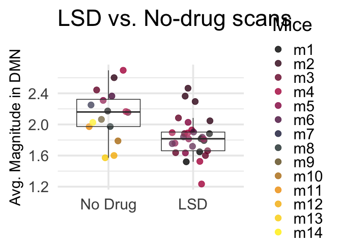

Mouse magnitudes
================
2024-05-15

``` r
library(ggplot2)
library(dplyr)
```

    ## 
    ## Attaching package: 'dplyr'

    ## The following objects are masked from 'package:stats':
    ## 
    ##     filter, lag

    ## The following objects are masked from 'package:base':
    ## 
    ##     intersect, setdiff, setequal, union

``` r
library(sjPlot)
```

    ## Learn more about sjPlot with 'browseVignettes("sjPlot")'.

``` r
library(nlme)
```

    ## 
    ## Attaching package: 'nlme'

    ## The following object is masked from 'package:dplyr':
    ## 
    ##     collapse

``` r
# let's merge them all into one set to test for any interactions
### LSD ###
# load in average DMN angles
DMNAngsLSD=read.csv('~/Downloads/mice_magsMerged_mice_LSD.csv',header=F)
# Rename the columns for easier reference
colnames(DMNAngsLSD) <- c("V1", paste0("V", 2:ncol(DMNAngsLSD)))
# Reshape the data to long format using base R
DMNAngsLSD_long <- reshape(DMNAngsLSD, 
                        varying = list(names(DMNAngsLSD)[-1]), 
                        v.names = "Value", 
                        timevar = "Timepoint", 
                        times = 2:ncol(DMNAngsLSD), 
                        direction = "long")

# Adjust the timepoint to start from 1
DMNAngsLSD_long$Timepoint <- DMNAngsLSD_long$Timepoint - 1
# add drug value and test standalone
DMNAngsLSD_long$Drug=1
DMNAngsLSD_long$Drug[DMNAngsLSD_long$Timepoint==1]=0
# set drug
DMNAngsLSD_long$WhichDrug='LSD'

### DIAZEPAM ###
# load in average DMN angles
DMNAngsDiaz=read.csv('~/Downloads/mice_magsMerged_mice_Diaz.csv',header=F)
# Rename the columns for easier reference
colnames(DMNAngsDiaz) <- c("V1", paste0("V", 2:ncol(DMNAngsDiaz)))
# Reshape the data to long format using base R
DMNAngsDiaz_long <- reshape(DMNAngsDiaz, 
                        varying = list(names(DMNAngsDiaz)[-1]), 
                        v.names = "Value", 
                        timevar = "Timepoint", 
                        times = 2:ncol(DMNAngsDiaz), 
                        direction = "long")

# Adjust the timepoint to start from 1
DMNAngsDiaz_long$Timepoint <- DMNAngsDiaz_long$Timepoint - 1
# add drug value and test standalone
DMNAngsDiaz_long$Drug=1
DMNAngsDiaz_long$Drug[DMNAngsDiaz_long$Timepoint==1]=0
# set drug
DMNAngsDiaz_long$WhichDrug='Diaz'

### Dexmedetomidine ###
# load in average DMN angles
DMNAngsDex=read.csv('~/Downloads/mice_magsMerged_mice_Dex.csv',header=F)
# Rename the columns for easier reference
colnames(DMNAngsDex) <- c("V1", paste0("V", 2:ncol(DMNAngsDex)))
# Reshape the data to long format using base R
DMNAngsDex_long <- reshape(DMNAngsDex, 
                        varying = list(names(DMNAngsDex)[-1]), 
                        v.names = "Value", 
                        timevar = "Timepoint", 
                        times = 2:ncol(DMNAngsDex), 
                        direction = "long")

# Adjust the timepoint to start from 1
DMNAngsDex_long$Timepoint <- DMNAngsDex_long$Timepoint - 1
# add drug value and test standalone
DMNAngsDex_long$Drug=1
DMNAngsDex_long$Drug[DMNAngsDex_long$Timepoint==1]=0
# set drug
DMNAngsDex_long$WhichDrug='Dex'


# merge 'em all
masterMousedf=rbind(DMNAngsLSD_long,DMNAngsDiaz_long)
# rename mouse col
colnames(masterMousedf)[1]<-'mouse'
# bottom-up percentage col
colnames(masterMousedf)[3]<-'BUP'
# remove NA rows
masterMousedf <- masterMousedf[!is.na(masterMousedf$BUP), ]
# relevel LSD to be reference
masterMousedf$WhichDrug<-as.factor(masterMousedf$WhichDrug)
masterMousedf$Drug<-as.factor(masterMousedf$Drug)
masterMousedf <- within(masterMousedf, WhichDrug <- relevel(WhichDrug, ref = 2))
# mixed effect model
fit_lme <- lme(BUP ~ Drug*WhichDrug, random = ~ 1 | mouse, data = masterMousedf)
summary(fit_lme)
```

    ## Linear mixed-effects model fit by REML
    ##   Data: masterMousedf 
    ##        AIC      BIC   logLik
    ##   1.179117 12.77007 5.410441
    ## 
    ## Random effects:
    ##  Formula: ~1 | mouse
    ##         (Intercept)  Residual
    ## StdDev:    0.145948 0.1759939
    ## 
    ## Fixed effects:  BUP ~ Drug * WhichDrug 
    ##                          Value  Std.Error DF   t-value p-value
    ## (Intercept)          2.4256293 0.08961816 43 27.066269  0.0000
    ## Drug1               -0.5840459 0.07896194 43 -7.396550  0.0000
    ## WhichDrugDiaz       -0.2770925 0.11653238 43 -2.377816  0.0219
    ## Drug1:WhichDrugDiaz  0.7619270 0.12039385 43  6.328621  0.0000
    ##  Correlation: 
    ##                     (Intr) Drug1  WhchDD
    ## Drug1               -0.730              
    ## WhichDrugDiaz       -0.591  0.563       
    ## Drug1:WhichDrugDiaz  0.479 -0.656 -0.811
    ## 
    ## Standardized Within-Group Residuals:
    ##        Min         Q1        Med         Q3        Max 
    ## -3.3303419 -0.5192464  0.1344914  0.5286103  1.8217000 
    ## 
    ## Number of Observations: 55
    ## Number of Groups: 9

``` r
plot_model(fit_lme,type='int',title='Magnitude by Drug')
```

<!-- -->

``` r
masterMouseAll=rbind(DMNAngsLSD_long,DMNAngsDiaz_long,DMNAngsDex_long)
masterMouseAll$WhichDrug2=NULL
masterMouseAll$WhichDrug2[masterMouseAll$Drug==0]='No Drug'
masterMouseAll$WhichDrug2[masterMouseAll$WhichDrug=='Dex' & masterMouseAll$Drug==1]='Active Control'
masterMouseAll$WhichDrug2[masterMouseAll$WhichDrug=='Diaz' & masterMouseAll$Drug==1]='Active Control'
masterMouseAll$WhichDrug2[masterMouseAll$WhichDrug=='LSD' & masterMouseAll$Drug==1]='Psychedelic'

# remove na rows
masterMouseAll=masterMouseAll[!is.na(masterMouseAll$Value),]

# make donut plot
masterMouseAll$Drug<-as.factor(masterMouseAll$WhichDrug2)
donutData<- data.frame(
  Category=levels(masterMouseAll$Drug),
  count=tabulate(masterMouseAll$Drug)
)

# convert labels to be consistent across studies
donutData$Category=c('Active Control','No Drug','Psychedelic')

# percentages
donutData$frac = donutData$count / sum(donutData$count)

# Compute the cumulative for plotting
donutData$ymax = cumsum(donutData$frac)

# Compute the bottom of each rectangle (plotted as rectangle and coord_polar'ed)
donutData$ymin = c(0, head(donutData$ymax, n=-1))
 
# plot
ggplot(donutData, aes(ymax=ymax, ymin=ymin, xmax=4, xmin=3, fill=Category)) +
     geom_rect() +
     coord_polar(theta="y") + 
     xlim(c(1, 4)) + theme_classic(base_size=28)+theme(
    axis.text = element_blank(),
    axis.ticks = element_blank(),
    axis.line = element_blank()
  )+guides(fill = guide_legend(title = NULL))+scale_fill_manual(values = c("#EF9500","#002642","#840032"))
```

<!-- -->

``` r
### and make a No-drug vs. LSD plot
# remove NA rows
masterMouseAll=masterMouseAll[!is.na(masterMouseAll$Value),]

# sep. pre and post
masterMouseAll$TP=NULL
masterMouseAll$TP[masterMouseAll$Timepoint==1]='No Drug'
masterMouseAll$TP[masterMouseAll$Timepoint>1 & masterMouseAll$WhichDrug=='LSD']='LSD'

# make a drug nodrug DF
masterMouseDnD=masterMouseAll[!is.na(masterMouseAll$TP),]

# model it
fit_lme <- lme(Value ~ Drug, random = ~ 1 | V1, data = masterMouseDnD)

# reorder it
masterMouseDnD$TP <- factor(masterMouseDnD$TP, levels = c('No Drug', 'LSD'))
ggplot(masterMouseDnD, aes(x = TP, y = Value)) +
  geom_jitter(width = 0.25, height = 0, alpha = 0.8,size=4,aes(color=V1)) +  # Jittered points
  geom_boxplot(alpha = 0.2,outlier.shape = NA) +     # Boxplot
  labs(title = "LSD vs. No-drug scans \n",
       x = "",
       y = "Avg. Magnitude in DMN") + scale_x_discrete(labels=c('No Drug','LSD'))+
  theme_minimal(base_size=25)
```

<!-- -->

``` r
# copy in color scheme
library(ggplot2)
library(grDevices)

# Define the extended custom palette function
extended_palette <- colorRampPalette(rev(c("#FFEE00", "#EF9500", "#002642", "#c1004f", "#000000")))

# Generate a palette with the number of unique levels in V1
num_colors <- length(unique(masterMouseAll$V1))
generated_colors <- extended_palette(num_colors)

# get unique mouse names
unique_values <- unique(masterMouseAll$V1)
new_labels <- paste0("m", seq_along(unique_values))
names(new_labels) <- unique_values

# Replace the values in V1 using the new labels
masterMouseAll$V1 <- new_labels[masterMouseAll$V1]

# make a drug nodrug DF
masterMouseDnD=masterMouseAll[!is.na(masterMouseAll$TP),]


# final ordering
masterMouseDnD$TP <- factor(masterMouseDnD$TP, levels = c('No Drug', 'LSD'))
masterMouseDnD$Mice <- factor(masterMouseDnD$V1, levels = new_labels)

# Figure 2, bottom
ggplot(masterMouseDnD, aes(x = TP, y = Value)) +
  geom_jitter(width = 0.25, height = 0, alpha = 0.8, size = 4, aes(color = Mice)) +  # Jittered points
  geom_boxplot(alpha = 0.2, outlier.shape = NA) +     # Boxplot
  labs(title = "LSD vs. No-drug scans \n",
       x = "",
       y = "Avg. Magnitude in DMN") +
  scale_x_discrete(labels = c('No Drug', 'LSD')) +
  scale_color_manual(values = generated_colors) +  # Custom generated color palette
  theme_minimal(base_size = 28)+theme(axis.title.y = element_text(size = 22))
```

<!-- -->

``` r
# plot LSD time series
# extract LSD
DMNAngs_long=masterMouseAll[masterMouseAll$WhichDrug=='LSD',]
# create minutes column
DMNAngs_long$Minutes=(DMNAngs_long$Timepoint-1.5)*5
ggplot(DMNAngs_long, aes(x = Minutes, y = Value,  group = V1)) +
  geom_line() +
  geom_point(size=4,aes(color=V1)) +
  scale_color_viridis_d(option = "plasma") +
  labs(x = "Minutes", y = "Avg. Magnitude", color = "Mouse",title='LSD') +
  theme_minimal(base_size=25)+geom_vline(xintercept=0,linetype='dashed')+scale_color_manual(values = generated_colors)+
  theme(axis.title.y = element_text(size = 22))
```

    ## Scale for colour is already present.
    ## Adding another scale for colour, which will replace the existing scale.

<!-- -->

``` r
library(ggplot2)
library(viridis)
```

    ## Loading required package: viridisLite

``` r
# Define the extended custom palette function
extended_palette <- colorRampPalette(rev(c("#FFEE00", "#EF9500", "#002642", "#c1004f", "#000000")))

# Generate a palette with the number of unique levels in V1
unique_values <- unique(masterMouseAll$V1)
num_colors <- length(unique_values)
generated_colors <- extended_palette(num_colors)

# Create a named vector for the colors
names(generated_colors) <- unique_values

# Function to plot data
plot_data <- function(data, title) {
  ggplot(data, aes(x = Minutes, y = Value, group = V1)) +
    geom_line() +
    geom_point(size = 4, aes(color = V1)) +
    labs(x = "Minutes", y = "Avg. Magnitude", color = "Mouse", title = title) +
    theme_minimal(base_size = 25) +
    geom_vline(xintercept = 0, linetype = 'dashed') +
    scale_color_manual(values = generated_colors)+theme(axis.title.y = element_text(size = 22))
}

# Extract LSD data
DMNAngs_long_LSD <- masterMouseAll[masterMouseAll$WhichDrug == 'LSD',]
# Create minutes column
DMNAngs_long_LSD$Minutes <- (DMNAngs_long_LSD$Timepoint - 1.5) * 5
# Plot LSD data
plot_lsd <- plot_data(DMNAngs_long_LSD, 'LSD')
print(plot_lsd)
```

<!-- -->

``` r
# Extract Dex data
DMNAngs_long_Dex <- masterMouseAll[masterMouseAll$WhichDrug == 'Dex',]
# Create minutes column
DMNAngs_long_Dex$Minutes <- (DMNAngs_long_Dex$Timepoint - 1.5) * 5
# Plot Dex data
plot_dex <- plot_data(DMNAngs_long_Dex, 'Dexmedetomidine')
print(plot_dex)
```

<!-- -->

``` r
# extract Diaz
DMNAngs_long=masterMouseAll[masterMouseAll$WhichDrug=='Diaz',]
# create minutes column
DMNAngs_long$Minutes=(DMNAngs_long$Timepoint-1.5)*5
plot_diaz <- plot_data(DMNAngs_long, 'Diazepam')
print(plot_diaz)
```

<!-- -->
